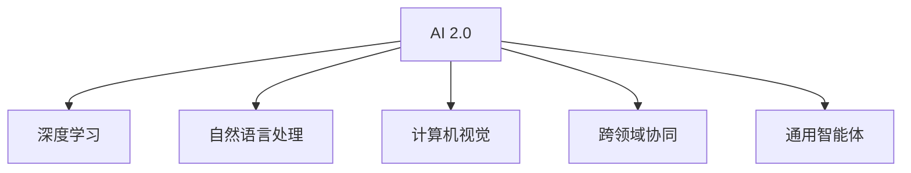

                 

## 1. 背景介绍

### 1.1 问题的由来
自20世纪60年代人工智能概念提出以来，人工智能技术经过数十年的发展，逐渐从实验室走向现实应用。尤其是进入21世纪以来，随着深度学习、自然语言处理、计算机视觉等技术的突破，人工智能技术进入了一个全新的阶段，即AI 2.0时代。

AI 2.0时代的特点是，人工智能技术开始从单一领域的工具演变为跨领域的通用智能体，具备了自主学习、知识积累、跨领域协同的能力。这一时期，人工智能技术在自动驾驶、语音识别、图像处理、自然语言处理、医疗诊断等多个领域取得了显著进展，逐渐改变了人类的生产生活方式。

### 1.2 问题的核心关键点
AI 2.0时代的核心关键点包括：

- **通用智能体的崛起**：AI 2.0时代的人工智能不再是仅在某一个领域内发挥作用的工具，而是具备跨领域学习和应用能力的通用智能体。
- **自主学习与知识积累**：AI 2.0时代的智能体能够通过不断学习新的数据和知识，提升自身性能，具备自我优化能力。
- **跨领域协同**：AI 2.0时代的智能体能够在不同领域间协同工作，完成复杂任务，如语音识别与自然语言处理的结合，图像处理与自然语言处理的结合等。

### 1.3 问题研究的意义
研究AI 2.0时代的趋势，对于理解人工智能技术的未来发展方向，把握人工智能技术的商业应用前景，具有重要意义：

1. **预测技术发展**：通过研究AI 2.0时代的趋势，可以预测未来人工智能技术在各个领域的应用前景和潜力。
2. **指导技术应用**：了解AI 2.0时代的技术趋势，可以指导企业、政府等组织，制定合理的人工智能应用策略和规划。
3. **推动技术创新**：把握AI 2.0时代的技术趋势，可以推动人工智能技术的持续创新，推动相关产业的升级转型。

## 2. 核心概念与联系

### 2.1 核心概念概述

为了更好地理解AI 2.0时代的趋势，本节将介绍几个关键核心概念：

- **AI 2.0**：指的是人工智能技术发展到第二代，具备了更加广泛的跨领域应用能力和自主学习能力。
- **深度学习**：一种基于神经网络的学习方法，通过多层非线性变换，可以从原始数据中自动提取特征。
- **自然语言处理**：研究计算机如何理解、处理和生成人类语言的技术。
- **计算机视觉**：研究如何让计算机具备人类视觉系统的识别和理解能力。
- **跨领域协同**：指不同领域的人工智能技术能够协同工作，完成复杂任务。
- **通用智能体**：指具备跨领域学习和应用能力的智能体，能够在多个领域间无缝切换。

这些核心概念之间的逻辑关系可以通过以下Mermaid流程图来展示：



这个流程图展示了几个人工智能关键概念及其之间的关系：

1. AI 2.0时代的人工智能技术，基础在于深度学习，通过多层非线性变换提取数据特征。
2. 在深度学习的基础上，AI 2.0技术进一步发展了自然语言处理和计算机视觉技术，能够处理和理解人类语言和视觉信息。
3. AI 2.0技术具备跨领域协同能力，能够整合不同领域的信息，完成复杂任务。
4. 通用智能体是AI 2.0技术的最终目标，具备跨领域学习和应用能力，能够在多个领域间无缝切换。

这些核心概念共同构成了AI 2.0时代的核心技术框架，推动着人工智能技术的发展和应用。

## 3. 核心算法原理 & 具体操作步骤

### 3.1 算法原理概述

AI 2.0时代的核心算法原理主要包括深度学习、自然语言处理和计算机视觉等技术。这些技术通过多层次、非线性变换，从原始数据中提取特征，并通过跨领域协同实现更复杂的应用场景。

### 3.2 算法步骤详解

AI 2.0时代的算法步骤大致如下：

1. **数据预处理**：收集和清洗数据，准备用于训练的样本。
2. **模型构建**：选择适当的深度学习模型，如卷积神经网络(CNN)、递归神经网络(RNN)、Transformer等，进行模型构建。
3. **模型训练**：使用训练数据对模型进行训练，优化模型参数，提高模型性能。
4. **模型评估**：使用测试数据对模型进行评估，检查模型性能是否满足要求。
5. **模型应用**：将训练好的模型应用于实际问题，完成预测、识别、生成等任务。

### 3.3 算法优缺点

AI 2.0时代的算法优点包括：

- **泛化能力强**：深度学习模型可以通过多层次非线性变换，从原始数据中提取更丰富的特征，具备较强的泛化能力。
- **自动学习**：AI 2.0时代的智能体能够通过学习数据自动提取特征，减少人工干预，提高模型效率。
- **跨领域协同**：AI 2.0时代的智能体能够整合不同领域的信息，完成复杂任务。

AI 2.0时代的算法缺点包括：

- **数据依赖性强**：深度学习模型对数据质量和数据量要求较高，数据缺失或不平衡可能导致模型性能下降。
- **计算资源消耗大**：深度学习模型参数量大，计算复杂度高，对计算资源要求较高。
- **可解释性不足**：深度学习模型通常被视为“黑盒”，难以解释其内部决策过程。

### 3.4 算法应用领域

AI 2.0时代的算法在多个领域得到了广泛应用，包括但不限于：

- **自动驾驶**：通过计算机视觉和自然语言处理技术，实现自动驾驶车辆的感知、决策和控制。
- **语音识别**：通过深度学习和自然语言处理技术，实现对语音信号的识别和理解。
- **图像处理**：通过深度学习模型，实现对图像的识别、分类和生成。
- **医疗诊断**：通过计算机视觉和自然语言处理技术，辅助医生进行疾病诊断和治疗方案制定。
- **智能客服**：通过自然语言处理技术，实现智能客服的自动问答和问题解决。

## 4. 数学模型和公式 & 详细讲解 & 举例说明

### 4.1 数学模型构建

AI 2.0时代的数学模型构建主要基于深度学习技术。以下以卷积神经网络(CNN)为例，介绍其数学模型构建过程。

卷积神经网络(CNN)通常由卷积层、池化层、全连接层等组成。以图像分类任务为例，CNN的输入为图像像素值，输出为图像类别。其数学模型构建过程如下：

$$
\begin{align*}
& \text{输入层} & & \text{图像像素值} \\
& \text{卷积层} & & \text{特征提取} \\
& \text{池化层} & & \text{特征降维} \\
& \text{全连接层} & & \text{分类输出} \\
& \text{softmax函数} & & \text{概率输出}
\end{align*}
$$

### 4.2 公式推导过程

以卷积神经网络的卷积层为例，其数学公式推导过程如下：

$$
\begin{align*}
& \text{输入层} & & x \in \mathbb{R}^{n \times n \times c} \\
& \text{卷积核} & & w \in \mathbb{R}^{k \times k \times c \times o} \\
& \text{卷积操作} & & y = x * w \in \mathbb{R}^{(n-k+1) \times (n-k+1) \times o} \\
& \text{偏置项} & & b \in \mathbb{R}^{o}
\end{align*}
$$

其中，$x$表示输入图像，$w$表示卷积核，$y$表示卷积结果，$b$表示偏置项。

### 4.3 案例分析与讲解

以图像分类任务为例，CNN模型的训练过程如下：

1. **数据准备**：收集和预处理图像数据，将图像转化为像素值，进行归一化等预处理。
2. **模型构建**：设计CNN模型结构，包括卷积层、池化层、全连接层等。
3. **模型训练**：使用训练数据对模型进行训练，优化模型参数，提高模型性能。
4. **模型评估**：使用测试数据对模型进行评估，检查模型性能是否满足要求。
5. **模型应用**：将训练好的模型应用于实际问题，完成图像分类任务。

## 5. 项目实践：代码实例和详细解释说明

### 5.1 开发环境搭建

在进行AI 2.0项目的开发前，我们需要准备好开发环境。以下是使用Python进行TensorFlow开发的环境配置流程：

1. 安装Anaconda：从官网下载并安装Anaconda，用于创建独立的Python环境。

2. 创建并激活虚拟环境：
```bash
conda create -n tf-env python=3.8 
conda activate tf-env
```

3. 安装TensorFlow：根据CUDA版本，从官网获取对应的安装命令。例如：
```bash
conda install tensorflow==2.6 -c conda-forge
```

4. 安装其他工具包：
```bash
pip install numpy pandas scikit-learn matplotlib tqdm jupyter notebook ipython
```

完成上述步骤后，即可在`tf-env`环境中开始AI 2.0项目的开发。

### 5.2 源代码详细实现

这里以图像分类任务为例，给出使用TensorFlow对卷积神经网络(CNN)进行图像分类任务的PyTorch代码实现。

首先，定义CNN模型：

```python
import tensorflow as tf
from tensorflow.keras import layers

model = tf.keras.Sequential([
    layers.Conv2D(32, (3, 3), activation='relu', input_shape=(28, 28, 1)),
    layers.MaxPooling2D((2, 2)),
    layers.Conv2D(64, (3, 3), activation='relu'),
    layers.MaxPooling2D((2, 2)),
    layers.Conv2D(64, (3, 3), activation='relu'),
    layers.Flatten(),
    layers.Dense(64, activation='relu'),
    layers.Dense(10, activation='softmax')
])
```

然后，定义训练和评估函数：

```python
def train_model(model, train_data, epochs, batch_size, validation_data):
    model.compile(optimizer='adam', loss='sparse_categorical_crossentropy', metrics=['accuracy'])
    model.fit(train_data, epochs=epochs, batch_size=batch_size, validation_data=validation_data)

def evaluate_model(model, test_data, batch_size):
    test_loss, test_acc = model.evaluate(test_data, batch_size=batch_size)
    print('Test accuracy:', test_acc)
```

最后，启动训练流程并在测试集上评估：

```python
train_data = (train_images, train_labels)
validation_data = (validation_images, validation_labels)
test_data = (test_images, test_labels)

epochs = 10
batch_size = 32

model = build_cnn_model()
train_model(model, train_data, epochs, batch_size, validation_data)
evaluate_model(model, test_data, batch_size)
```

以上就是使用TensorFlow对卷积神经网络进行图像分类任务微调的完整代码实现。可以看到，得益于TensorFlow的强大封装，我们可以用相对简洁的代码完成CNN模型的加载和微调。

### 5.3 代码解读与分析

让我们再详细解读一下关键代码的实现细节：

**CNN模型定义**：
- 使用`Sequential`模型定义模型结构，包括卷积层、池化层、全连接层等。
- 卷积层使用`Conv2D`，指定卷积核大小和数量，激活函数使用ReLU。
- 池化层使用`MaxPooling2D`，指定池化大小和步长。
- 全连接层使用`Dense`，指定层数和激活函数。

**训练和评估函数**：
- 使用`compile`方法定义优化器、损失函数和评估指标。
- 使用`fit`方法训练模型，指定训练轮数和批次大小。
- 使用`evaluate`方法评估模型性能，输出测试集上的准确率。

**训练流程**：
- 定义训练数据、验证数据和测试数据。
- 构建CNN模型。
- 在训练集上训练模型，在验证集上评估模型性能。
- 在测试集上评估模型性能，输出最终结果。

可以看到，TensorFlow配合Keras封装使得CNN微调的代码实现变得简洁高效。开发者可以将更多精力放在模型改进和数据处理上，而不必过多关注底层的实现细节。

当然，工业级的系统实现还需考虑更多因素，如模型的保存和部署、超参数的自动搜索、更灵活的任务适配层等。但核心的微调范式基本与此类似。

## 6. 实际应用场景

### 6.1 自动驾驶

基于AI 2.0的自动驾驶技术，通过计算机视觉和自然语言处理技术，实现自动驾驶车辆的感知、决策和控制。在技术实现上，可以收集大量行车数据，对车辆进行标注，在此基础上对预训练模型进行微调。微调后的模型能够识别道路标志、交通信号灯等，进行路径规划和避障，实现自动驾驶。

### 6.2 语音识别

基于AI 2.0的语音识别技术，通过深度学习和自然语言处理技术，实现对语音信号的识别和理解。在技术实现上，可以收集大量的语音数据，对语音进行标注，在此基础上对预训练模型进行微调。微调后的模型能够识别语音信号，进行语音转文字、语音识别等任务。

### 6.3 图像处理

基于AI 2.0的图像处理技术，通过深度学习模型，实现对图像的识别、分类和生成。在技术实现上，可以收集大量的图像数据，对图像进行标注，在此基础上对预训练模型进行微调。微调后的模型能够识别物体、场景，进行图像分类、图像生成等任务。

### 6.4 医疗诊断

基于AI 2.0的医疗诊断技术，通过计算机视觉和自然语言处理技术，辅助医生进行疾病诊断和治疗方案制定。在技术实现上，可以收集大量的医疗图像和文本数据，对数据进行标注，在此基础上对预训练模型进行微调。微调后的模型能够识别病灶、辅助医生进行诊断，并生成个性化的治疗方案。

## 7. 工具和资源推荐

### 7.1 学习资源推荐

为了帮助开发者系统掌握AI 2.0的理论基础和实践技巧，这里推荐一些优质的学习资源：

1. 《深度学习》系列书籍：由李开复教授撰写，全面介绍了深度学习的基本原理和应用。
2. 《TensorFlow官方文档》：TensorFlow官方提供的文档，提供了完整的API说明和示例代码，是学习TensorFlow的必备资源。
3. 《自然语言处理综论》：介绍自然语言处理的经典算法和最新技术，涵盖了NLP的多个重要领域。
4. 《计算机视觉：算法与应用》：介绍了计算机视觉的原理和应用，涵盖了图像处理、物体检测、图像识别等技术。
5. 《AI 2.0时代的前沿技术》系列课程：由顶尖高校和研究机构联合推出的在线课程，介绍了AI 2.0时代的前沿技术，包括深度学习、自然语言处理、计算机视觉等。

通过对这些资源的学习实践，相信你一定能够快速掌握AI 2.0的精髓，并用于解决实际的AI问题。

### 7.2 开发工具推荐

高效的开发离不开优秀的工具支持。以下是几款用于AI 2.0开发常用的工具：

1. TensorFlow：由Google主导开发的开源深度学习框架，生产部署方便，适合大规模工程应用。
2. Keras：基于TensorFlow的高层次API，提供了简洁易用的模型构建和训练接口。
3. PyTorch：基于Python的开源深度学习框架，灵活动态的计算图，适合快速迭代研究。
4. Weights & Biases：模型训练的实验跟踪工具，可以记录和可视化模型训练过程中的各项指标，方便对比和调优。
5. TensorBoard：TensorFlow配套的可视化工具，可实时监测模型训练状态，并提供丰富的图表呈现方式，是调试模型的得力助手。

合理利用这些工具，可以显著提升AI 2.0的开发效率，加快创新迭代的步伐。

### 7.3 相关论文推荐

AI 2.0时代的发展离不开学界的持续研究。以下是几篇奠基性的相关论文，推荐阅读：

1. AlexNet：卷积神经网络的经典模型，开创了深度学习在图像识别领域的先河。
2. ResNet：通过残差连接解决深度神经网络的退化问题，提高了模型的深度和性能。
3. Attention is All You Need：提出了Transformer结构，开启了NLP领域的预训练大模型时代。
4. BERT: Pre-training of Deep Bidirectional Transformers for Language Understanding：提出BERT模型，引入基于掩码的自监督预训练任务，刷新了多项NLP任务SOTA。
5. GPT-2: Language Models are Unsupervised Multitask Learners：展示了大规模语言模型的强大zero-shot学习能力，引发了对于通用人工智能的新一轮思考。

这些论文代表了大模型时代的最新进展，通过学习这些前沿成果，可以帮助研究者把握学科前进方向，激发更多的创新灵感。

## 8. 总结：未来发展趋势与挑战

### 8.1 总结

本文对AI 2.0时代的趋势进行了全面系统的介绍。首先阐述了AI 2.0时代的背景和核心关键点，明确了通用智能体、深度学习、自然语言处理等技术的重要性。其次，从原理到实践，详细讲解了AI 2.0时代的算法原理和操作步骤，给出了AI 2.0任务开发的完整代码实例。同时，本文还广泛探讨了AI 2.0技术在自动驾驶、语音识别、图像处理、医疗诊断等多个领域的应用前景，展示了AI 2.0技术的广阔前景。

通过本文的系统梳理，可以看到，AI 2.0时代的核心算法和技术正在不断突破，引领人工智能技术的发展方向。AI 2.0时代的技术进步，为人工智能技术在各个领域的应用提供了更广阔的空间，将深刻影响人类的生产生活方式。

### 8.2 未来发展趋势

展望未来，AI 2.0时代的趋势将呈现以下几个方向：

1. **通用智能体的崛起**：未来的人工智能技术将逐步具备跨领域学习和应用能力，成为通用的智能体。
2. **深度学习的进一步发展**：深度学习技术将继续快速发展，生成模型、对抗生成网络(GANs)等新模型将被广泛应用。
3. **自然语言处理的突破**：自然语言处理技术将继续提升，语言模型的参数量和语言理解能力将进一步提升。
4. **计算机视觉的进步**：计算机视觉技术将继续进步，识别精度和实时性将进一步提升。
5. **跨领域协同的增强**：未来的人工智能技术将在不同领域间协同工作，实现更复杂的应用场景。

这些趋势展示了AI 2.0时代技术的持续发展和应用前景，为人工智能技术的发展和应用提供了新的方向。

### 8.3 面临的挑战

尽管AI 2.0时代的技术发展迅速，但在迈向更加智能化、普适化应用的过程中，仍面临诸多挑战：

1. **数据依赖性**：AI 2.0技术对数据质量和数据量要求较高，数据缺失或不平衡可能导致模型性能下降。
2. **计算资源消耗大**：深度学习模型参数量大，计算复杂度高，对计算资源要求较高。
3. **可解释性不足**：深度学习模型通常被视为“黑盒”，难以解释其内部决策过程。
4. **安全性问题**：AI 2.0技术在实际应用中可能存在安全漏洞，如对抗样本攻击、模型泄漏等。
5. **伦理道德问题**：AI 2.0技术在应用过程中可能涉及伦理道德问题，如偏见、歧视等。

这些挑战需要学界和产业界共同努力，通过技术创新和政策规范，解决AI 2.0技术的应用问题，推动技术的健康发展。

### 8.4 研究展望

未来，AI 2.0时代的研究需要在以下几个方向上寻求新的突破：

1. **提高模型泛化能力**：通过优化模型架构和训练方法，提高模型在跨领域数据上的泛化能力。
2. **增强模型可解释性**：通过可解释性方法，提高AI 2.0技术的透明度和可信度。
3. **解决计算资源消耗大**：通过模型压缩、量化等技术，减少模型计算资源的消耗。
4. **提高模型安全性**：通过对抗训练、安全验证等技术，提高AI 2.0技术的安全性。
5. **解决伦理道德问题**：通过伦理规范和技术手段，解决AI 2.0技术的伦理道德问题。

这些研究方向将推动AI 2.0技术的发展，解决应用中的问题，推动AI 2.0技术的普及应用。

## 9. 附录：常见问题与解答

**Q1：AI 2.0是否适用于所有领域？**

A: AI 2.0技术在大多数领域都能取得不错的效果，特别是在数据量较大、任务复杂的情况下。但对于一些领域，如金融、医疗等，AI 2.0技术可能面临数据隐私、伦理道德等问题，需要慎重考虑。

**Q2：AI 2.0技术对计算资源的要求高吗？**

A: AI 2.0技术对计算资源的要求较高，特别是在深度学习和计算机视觉领域。需要使用高性能的计算设备，如GPU、TPU等。但随着计算资源的不断提升和算法的优化，未来AI 2.0技术的计算资源消耗将逐渐减少。

**Q3：AI 2.0技术的可解释性如何？**

A: 目前AI 2.0技术中，深度学习模型通常被视为“黑盒”，难以解释其内部决策过程。但随着可解释性方法的不断研究，AI 2.0技术的可解释性将逐步提升。

**Q4：AI 2.0技术面临哪些伦理道德问题？**

A: AI 2.0技术在应用过程中可能涉及伦理道德问题，如偏见、歧视等。需要制定相应的规范和标准，确保AI 2.0技术的公平性和公正性。

---

作者：禅与计算机程序设计艺术 / Zen and the Art of Computer Programming

