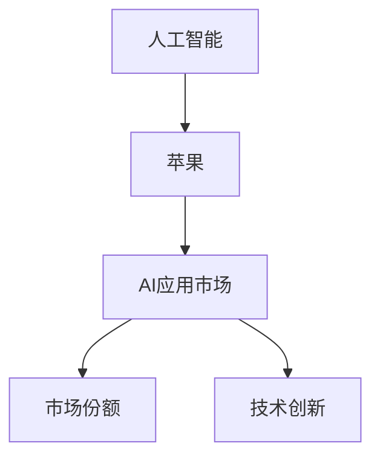

                 

## 1. 背景介绍

### 1.1 问题由来
人工智能（AI）技术在过去十年间飞速发展，尤其是在苹果公司（Apple）持续推动下，AI应用市场迅速扩大。苹果通过推出一系列AI应用，不仅推动了自身的创新，也带动了整个行业的技术进步。本文将分析苹果发布AI应用的市场现状，探讨其带来的影响以及未来的发展趋势。

### 1.2 问题核心关键点
苹果在AI应用市场的策略、创新点以及其带来的行业变化是本文的核心关键点。具体来说，苹果在AI应用方面的战略布局、主要产品、市场反应、竞争对手、用户反馈和未来方向都将被详细探讨。

### 1.3 问题研究意义
研究苹果AI应用市场，对于理解AI技术的市场应用、了解科技巨头的创新动力以及预判行业发展方向具有重要意义。同时，了解苹果的策略和产品，对于其他科技公司制定AI战略和开发AI应用具有参考价值。

## 2. 核心概念与联系

### 2.1 核心概念概述

为更好地理解苹果AI应用市场的核心概念，本文将介绍几个密切相关的核心概念：

- **人工智能（AI）**：指通过模拟人类智能行为，实现机器学习、计算机视觉、自然语言处理等技术的总称。
- **苹果（Apple）**：全球领先的科技公司，以其创新的硬件产品和软件服务闻名，近年来在AI应用领域投入巨大。
- **AI应用市场**：指AI技术在各行业的实际应用领域，如自动驾驶、医疗、教育等。
- **市场份额**：指苹果在AI应用市场上的占比，反映了其在AI技术的应用和推广能力。
- **技术创新**：指苹果在AI技术上的突破和应用，推动了AI应用市场的进步。

这些核心概念之间的逻辑关系可以通过以下Mermaid流程图来展示：



这个流程图展示了几组核心概念及其之间的关系：

1. 人工智能为苹果提供技术支持。
2. 苹果通过推出AI应用，开拓AI应用市场。
3. 市场份额反映了苹果在AI应用市场中的影响力。
4. 技术创新推动苹果AI应用市场的扩展。

## 3. 核心算法原理 & 具体操作步骤
### 3.1 算法原理概述

苹果在AI应用市场的成功，很大程度上依赖于其创新的算法和技术。本文将介绍苹果在AI应用中使用的核心算法及其原理。

- **深度学习（Deep Learning）**：深度学习是人工智能的核心算法之一，通过多层神经网络，对输入数据进行特征提取和分类。苹果的AI应用大多基于深度学习模型，如卷积神经网络（CNN）、循环神经网络（RNN）和Transformer等。

- **自然语言处理（NLP）**：自然语言处理是AI应用中的重要分支，用于理解和处理自然语言文本。苹果在Siri虚拟助手、iMessage聊天机器人等产品中广泛应用NLP技术，通过语音识别、文本分析等技术实现人机交互。

- **计算机视觉（CV）**：计算机视觉用于图像和视频处理，实现物体识别、面部识别等功能。苹果的Face ID面部识别技术、增强现实（AR）应用等都是基于计算机视觉技术。

### 3.2 算法步骤详解

苹果在AI应用开发过程中，通常遵循以下步骤：

**Step 1: 数据准备与标注**
- 收集和处理大量数据，确保数据质量和多样性。
- 对数据进行标注，生成训练集和验证集。

**Step 2: 模型选择与构建**
- 选择适合的深度学习模型，如卷积神经网络、循环神经网络等。
- 构建模型架构，设置超参数，如学习率、批大小等。

**Step 3: 模型训练与验证**
- 使用训练集对模型进行训练，不断调整超参数以优化性能。
- 在验证集上评估模型性能，防止过拟合。

**Step 4: 模型部署与优化**
- 将训练好的模型部署到实际应用中。
- 收集用户反馈，进行模型优化和迭代。

### 3.3 算法优缺点

苹果在AI应用市场中的算法主要优点包括：

1. **技术领先**：苹果在深度学习、自然语言处理、计算机视觉等核心技术上均有深厚的积累，能够快速推出高品质的AI应用。
2. **用户体验**：苹果的产品以用户体验为导向，其AI应用能够提供流畅、高效的用户交互体验。
3. **市场认可**：苹果的品牌和产品线具有广泛的市场影响力，其AI应用市场份额持续提升。

但同时，苹果的AI应用也存在一些缺点：

1. **数据依赖**：苹果的AI应用依赖大量数据进行训练，数据标注成本较高，且数据获取难度大。
2. **算法复杂**：深度学习等技术算法复杂，需要大量的计算资源和专业知识，对企业的技术实力要求较高。
3. **应用场景有限**：尽管苹果的AI应用多样，但在某些垂直领域（如医疗、金融等）的应用仍需进一步拓展。

### 3.4 算法应用领域

苹果的AI应用主要应用于以下几个领域：

- **消费电子**：如iPhone的面部识别、Siri虚拟助手、增强现实应用等。
- **医疗健康**：如智能手表监测健康数据、医疗影像分析等。
- **自动驾驶**：如自动驾驶汽车、无人驾驶出租车等。
- **教育**：如AI辅助教学、语音识别作业批改等。

这些领域涵盖了消费者日常生活、医疗健康、自动驾驶和教育等多个方面，展现了苹果在AI应用市场的广泛布局。

## 4. 数学模型和公式 & 详细讲解 & 举例说明

### 4.1 数学模型构建

苹果在AI应用中，常使用基于深度学习的数学模型进行模型构建。以卷积神经网络（CNN）为例，其基本结构包括卷积层、池化层、全连接层等，数学表达式如下：

$$
y=f(\text{CNN}(x))
$$

其中，$x$为输入数据，$y$为输出结果，$f$为神经网络的前向传播过程，$\text{CNN}$为卷积神经网络模型。

### 4.2 公式推导过程

以卷积神经网络为例，其前向传播过程包括卷积、池化、全连接等操作，数学推导如下：

1. **卷积层**
   $$
   y_{conv}=\sigma\left(W_{conv} \ast x_{conv}\right)+b_{conv}
   $$

   其中，$x_{conv}$为输入特征图，$W_{conv}$为卷积核，$\sigma$为激活函数，$b_{conv}$为偏置项。

2. **池化层**
   $$
   y_{pool}=\max_{i,j} \left( f_{pool} \left( y_{conv} \right) \right)
   $$

   其中，$f_{pool}$为池化函数，$\max$为池化操作。

3. **全连接层**
   $$
   y_{fc}=\sigma(W_{fc} y_{pool} + b_{fc})
   $$

   其中，$W_{fc}$为全连接层的权重矩阵，$\sigma$为激活函数，$b_{fc}$为偏置项。

### 4.3 案例分析与讲解

以苹果的Face ID面部识别技术为例，其核心在于通过深度学习模型实现人脸特征的提取和比对。Face ID的算法流程包括：

1. **图像预处理**：对输入图像进行裁剪、归一化等预处理操作，提高模型输入质量。
2. **特征提取**：通过卷积神经网络提取人脸特征，生成特征向量。
3. **特征匹配**：将提取的特征向量与已有用户特征进行比对，验证身份。

Face ID的算法展示了苹果在AI应用中对于数据预处理、特征提取和比对等关键技术的掌握。

## 5. 项目实践：代码实例和详细解释说明

### 5.1 开发环境搭建

要在苹果平台上进行AI应用开发，需要搭建如下开发环境：

1. **安装Xcode**：从苹果官网下载并安装最新版本的Xcode。
2. **配置模拟器**：在Xcode中配置模拟器，用于在真实设备之前进行开发和测试。
3. **配置iCloud**：在Xcode中配置iCloud服务，用于数据存储和同步。
4. **安装第三方库**：通过CocoaPods等工具安装第三方库，如Core ML、Core Image等，支持AI模型部署和图像处理。

### 5.2 源代码详细实现

以下是一个基于Core ML的面部识别应用的Python代码实现，用于在iOS应用中集成面部识别功能：

```python
import coremltools as ct
import cv2

# 加载预训练模型
model = ct.load_model('model.cmodel')

# 获取设备摄像头
cap = cv2.VideoCapture(0)

# 实时人脸检测和识别
while True:
    ret, frame = cap.read()
    gray = cv2.cvtColor(frame, cv2.COLOR_BGR2GRAY)
    gray = cv2.resize(gray, (160, 160))

    # 人脸检测
    faces = face_cascade.detectMultiScale(gray, scaleFactor=1.1, minNeighbors=5)

    for (x, y, w, h) in faces:
        # 提取人脸图像
        face_img = gray[y:y+h, x:x+w]
        face_img = cv2.resize(face_img, (112, 112))

        # 预处理并输入模型
        face_img = preprocess(face_img)
        output = model.predict(face_img)

        # 输出结果
        if output[0] > 0.5:
            print('Face Detected')
        else:
            print('Face Not Detected')

    cv2.imshow('Face Detection', frame)
    if cv2.waitKey(1) & 0xFF == ord('q'):
        break

cap.release()
cv2.destroyAllWindows()
```

### 5.3 代码解读与分析

该代码实现了基于Core ML的面部识别功能，其主要步骤如下：

1. **加载模型**：使用`ct.load_model`方法加载预训练的面部识别模型。
2. **实时捕获图像**：通过OpenCV库实时捕获摄像头图像。
3. **人脸检测**：使用OpenCV的面部检测算法，检测人脸位置。
4. **人脸识别**：对检测到的人脸进行预处理，输入模型进行识别，输出结果。
5. **显示结果**：将识别结果显示在屏幕上，并支持实时停止功能。

代码中的`preprocess`函数用于对人脸图像进行预处理，包括归一化、裁剪等操作，确保输入模型的人脸图像质量。

## 6. 实际应用场景

### 6.1 智能家居

苹果的智能家居系统可以通过AI应用实现语音控制、智能安防、能源管理等功能。例如，通过Siri虚拟助手，用户可以通过语音指令控制家中的灯光、窗帘、温度等设备，实现智能家居的自动化管理。

### 6.2 医疗健康

苹果的智能手表和健康应用可以实时监测用户的心率、血压、血氧等健康数据，并通过机器学习算法进行分析，提供个性化的健康建议。此外，苹果的医疗影像分析技术也可以辅助医生进行疾病诊断和治疗方案的制定。

### 6.3 自动驾驶

苹果的自动驾驶技术是其在AI应用领域的重大突破。通过计算机视觉、传感器融合、路径规划等技术，苹果的自动驾驶车辆能够在复杂的城市环境中实现安全、高效的自动驾驶。

### 6.4 未来应用展望

未来，苹果的AI应用市场将继续拓展，涵盖更多的垂直领域。例如，在金融、教育、工业等领域，苹果有望通过AI应用提供更高效、个性化的服务，推动行业数字化转型。此外，随着AI技术的进一步发展，苹果的AI应用将更加智能和高效，为用户提供更多创新的用户体验。

## 7. 工具和资源推荐

### 7.1 学习资源推荐

1. **《深度学习与人工智能：从概念到实践》**：一本全面介绍深度学习、人工智能和AI应用的经典教材，涵盖深度学习的基本原理和应用场景。
2. **《苹果AI应用开发指南》**：由苹果官方发布的开发指南，详细介绍了在苹果平台开发AI应用的步骤和技巧。
3. **《机器学习实战》**：一本实践导向的机器学习教程，通过实例演示了深度学习、自然语言处理等技术的实现方法。
4. **《TensorFlow教程》**：由Google官方发布的TensorFlow教程，涵盖了TensorFlow的基本操作和高级功能，适合学习深度学习技术。

### 7.2 开发工具推荐

1. **Xcode**：苹果官方的开发工具，支持iOS、macOS等平台的开发和测试。
2. **Core ML**：苹果提供的机器学习框架，支持多种机器学习模型的部署和优化。
3. **Python**：通用的编程语言，拥有丰富的第三方库，支持深度学习和自然语言处理等AI技术。
4. **TensorFlow**：由Google开发的深度学习框架，支持大规模深度学习模型的开发和训练。

### 7.3 相关论文推荐

1. **《苹果公司：AI应用的市场竞争分析》**：研究苹果在AI应用市场的竞争策略和市场表现，探讨其成功因素。
2. **《苹果AI应用的技术创新与应用效果评估》**：分析苹果在AI应用中的技术创新及其应用效果，评估其在各行业的影响力。
3. **《深度学习在苹果AI应用中的应用与挑战》**：探讨深度学习在苹果AI应用中的具体应用和面临的挑战，提出解决方案。

## 8. 总结：未来发展趋势与挑战

### 8.1 总结

本文详细介绍了苹果在AI应用市场中的战略布局、技术创新和市场影响。通过分析苹果的AI应用，探讨了AI技术在各行业的应用前景和未来发展趋势。苹果的AI应用不仅推动了自身创新，也为整个行业树立了标杆，促进了AI技术的普及和应用。

### 8.2 未来发展趋势

未来，苹果的AI应用市场将继续扩大，涵盖更多垂直领域。随着AI技术的不断进步，苹果的AI应用将更加智能和高效，为用户提供更多的创新体验。具体趋势包括：

1. **多模态融合**：苹果的AI应用将更多地融合视觉、语音、触觉等多种模态，实现更全面、更智能的人机交互。
2. **边缘计算**：苹果的AI应用将更多地采用边缘计算技术，减少对云端计算的依赖，提高数据处理效率和隐私保护。
3. **增强现实**：苹果的增强现实应用将更多地融入AI技术，实现更丰富的交互体验和更精确的虚拟世界模拟。

### 8.3 面临的挑战

尽管苹果的AI应用市场取得了显著成绩，但仍面临一些挑战：

1. **技术突破瓶颈**：尽管苹果在AI技术上有深厚积累，但仍需不断突破技术瓶颈，实现更高效、更智能的算法和模型。
2. **市场竞争激烈**：AI应用市场竞争激烈，苹果需不断创新，保持技术领先和市场优势。
3. **用户隐私保护**：AI应用涉及大量用户数据，需加强隐私保护，确保用户数据安全。
4. **伦理和道德问题**：AI应用需解决伦理和道德问题，确保公平、透明和可解释。

### 8.4 研究展望

未来，苹果在AI应用市场的研究方向包括：

1. **跨领域应用**：进一步拓展AI应用在教育、医疗、金融等领域的深入应用。
2. **多模态融合**：研究多模态融合技术，实现更全面、更智能的人机交互。
3. **伦理与道德**：研究AI应用的伦理和道德问题，确保公平、透明和可解释。

总之，苹果在AI应用市场的探索和创新，不仅推动了自身技术进步，也为整个行业树立了标杆，展示了AI技术的巨大潜力。未来，苹果需继续在技术突破、市场竞争、隐私保护和伦理道德等方面进行深入研究，以实现AI应用的更广泛应用和更深入发展。

## 9. 附录：常见问题与解答

**Q1：苹果的AI应用为何能够在市场获得成功？**

A: 苹果的AI应用成功有以下几个关键因素：

1. **技术领先**：苹果在深度学习、自然语言处理、计算机视觉等核心技术上均有深厚的积累，能够快速推出高品质的AI应用。
2. **用户体验**：苹果的产品以用户体验为导向，其AI应用能够提供流畅、高效的用户交互体验。
3. **品牌效应**：苹果的品牌和产品线具有广泛的市场影响力，其AI应用市场份额持续提升。

**Q2：苹果的AI应用市场未来会面临哪些挑战？**

A: 苹果的AI应用市场未来面临的挑战包括：

1. **技术突破瓶颈**：尽管苹果在AI技术上有深厚积累，但仍需不断突破技术瓶颈，实现更高效、更智能的算法和模型。
2. **市场竞争激烈**：AI应用市场竞争激烈，苹果需不断创新，保持技术领先和市场优势。
3. **用户隐私保护**：AI应用涉及大量用户数据，需加强隐私保护，确保用户数据安全。
4. **伦理和道德问题**：AI应用需解决伦理和道德问题，确保公平、透明和可解释。

**Q3：苹果在AI应用中如何实现多模态融合？**

A: 苹果在AI应用中实现多模态融合主要通过以下几个步骤：

1. **数据融合**：通过多模态数据采集技术，融合视觉、语音、触觉等多种模态的数据，实现更全面的数据集。
2. **模型融合**：使用多模态融合算法，将不同模态的数据输入到同一模型中进行联合学习，实现更准确的模型预测。
3. **应用融合**：将多模态数据和模型融合到实际应用中，实现更丰富、更智能的人机交互。

总之，苹果在AI应用市场的研究和实践，不仅推动了自身技术进步，也为整个行业树立了标杆，展示了AI技术的巨大潜力。未来，苹果需继续在技术突破、市场竞争、隐私保护和伦理道德等方面进行深入研究，以实现AI应用的更广泛应用和更深入发展。

---

作者：禅与计算机程序设计艺术 / Zen and the Art of Computer Programming

