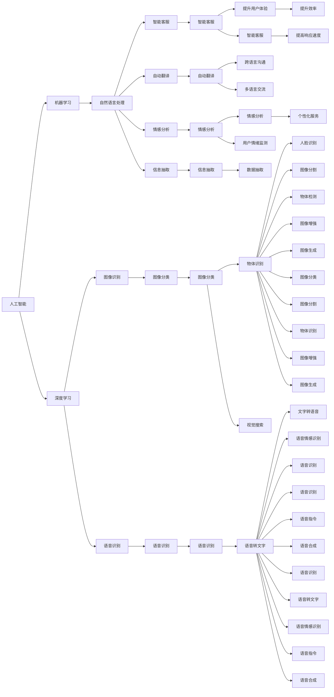

                 

# 李开复：苹果发布AI应用的市场前景

李开复，前微软首席执行官、谷歌执行主席，现创新工场董事长兼CEO。李开复在人工智能领域深耕多年，以其独到的见解和前瞻性战略，帮助推动了AI技术的商业化应用。本文将基于李开复在人工智能领域的深入研究，探讨苹果公司发布的AI应用及其市场前景。

## 1. 背景介绍

### 1.1 苹果AI战略概览

苹果公司一直以来以硬件创新著称，但近年来，苹果逐渐将AI技术融入产品开发中，推出了多款AI应用，如Siri、Face ID、Animoji等，显著增强了用户体验和设备智能化水平。2023年，苹果发布了一系列AI新应用，其中包括智能翻译、虚拟助手、增强现实AR、增强现实VR等，标志着其在AI领域的重要布局和前瞻性战略。

### 1.2 市场环境

全球AI市场预计将在未来几年内快速增长。根据市场研究机构IDC的报告，2021年全球AI市场规模达1650亿美元，预计到2025年将增长至3570亿美元，年复合增长率为17.5%。2023年，苹果发布的AI应用，无疑将进一步推高市场对AI技术的需求，为AI行业带来新的增长动力。

## 2. 核心概念与联系

### 2.1 核心概念概述

#### 2.1.1 人工智能

人工智能（Artificial Intelligence, AI）是模拟人类智能行为的技术，包括机器学习、深度学习、自然语言处理等子领域。AI技术广泛应用于各个行业，如金融、医疗、教育、零售等。

#### 2.1.2 自然语言处理（NLP）

自然语言处理（Natural Language Processing, NLP）是AI的重要分支，专注于使计算机能够理解、分析和生成人类语言。NLP技术已应用于智能客服、自动翻译、情感分析、信息抽取等领域。

#### 2.1.3 增强现实（AR）与虚拟现实（VR）

增强现实（Augmented Reality, AR）与虚拟现实（Virtual Reality, VR）是通过数字图像或模拟环境增强或替代现实世界的技术，广泛应用于游戏、培训、零售、医疗等领域。

#### 2.1.4 深度学习

深度学习（Deep Learning, DL）是机器学习的一个子领域，通过多层神经网络模拟人脑的神经元网络，在图像识别、语音识别、自然语言处理等领域取得显著成果。

#### 2.1.5 边缘计算

边缘计算（Edge Computing）是一种将计算任务在靠近数据源的设备上进行处理的技术，以降低延迟、提高数据隐私性和计算效率。

### 2.2 核心概念关系图



## 3. 核心算法原理 & 具体操作步骤

### 3.1 算法原理概述

#### 3.1.1 深度学习与神经网络

深度学习是一种模拟人脑神经网络的学习算法。其主要原理是通过多层神经网络对数据进行特征提取、模式识别和分类。深度学习中的神经网络包含多个隐藏层，能够处理高维数据，并在大规模数据集上取得优异性能。

#### 3.1.2 自然语言处理

自然语言处理是一种通过计算机理解、处理和生成人类语言的技术。主要算法包括词嵌入、RNN/LSTM、Transformer等，能够处理语义、语法、情感等多维信息。

#### 3.1.3 增强现实与虚拟现实

增强现实与虚拟现实技术利用计算机生成的图像、模拟环境，增强或替代现实世界的视觉信息。主要算法包括SLAM、三维重建、动作跟踪等。

#### 3.1.4 边缘计算

边缘计算技术通过将计算任务在靠近数据源的设备上进行处理，减少延迟、提高数据隐私性和计算效率。主要算法包括分布式计算、异构网络优化、边缘计算平台设计等。

### 3.2 算法步骤详解

#### 3.2.1 深度学习模型构建

构建深度学习模型的一般步骤包括：

1. **数据准备**：收集、清洗、标注数据集。
2. **模型选择**：选择合适的深度学习模型，如卷积神经网络（CNN）、循环神经网络（RNN）、Transformer等。
3. **模型训练**：使用训练集对模型进行训练，调整超参数。
4. **模型评估**：使用测试集对模型进行评估，选择最优模型。
5. **模型部署**：将训练好的模型部署到目标设备，进行实际应用。

#### 3.2.2 自然语言处理模型构建

构建自然语言处理模型的一般步骤包括：

1. **分词**：对输入文本进行分词处理。
2. **词嵌入**：将词汇映射到高维空间，生成词向量。
3. **序列建模**：使用RNN/LSTM/Transformer等模型对序列数据进行建模。
4. **任务建模**：根据具体任务设计输出层和损失函数。
5. **模型训练与评估**：使用标注数据对模型进行训练，并评估模型性能。

#### 3.2.3 增强现实与虚拟现实模型构建

构建增强现实与虚拟现实模型的一般步骤包括：

1. **场景重建**：使用SLAM等算法重建三维场景。
2. **物体检测**：使用物体检测算法识别场景中的物体。
3. **动作跟踪**：使用动作跟踪算法记录用户动作。
4. **图像增强**：使用图像处理算法增强视觉信息。
5. **模型部署**：将模型部署到AR/VR设备上，进行实际应用。

#### 3.2.4 边缘计算模型构建

构建边缘计算模型的一般步骤包括：

1. **设备选择**：选择合适的边缘计算设备。
2. **数据处理**：在设备上对数据进行处理。
3. **模型部署**：将模型部署到边缘设备上，进行本地计算。
4. **数据同步**：将计算结果同步到云端，进行数据分析和优化。
5. **系统优化**：根据实际需求，优化计算资源分配和数据传输路径。

### 3.3 算法优缺点

#### 3.3.1 深度学习

优点：

- **高精度**：深度学习在图像识别、语音识别、自然语言处理等领域取得优异表现。
- **自适应**：深度学习能够自动提取数据特征，适应复杂任务。

缺点：

- **计算量大**：深度学习模型通常参数量大，计算资源消耗高。
- **数据依赖**：深度学习依赖大量标注数据，数据获取成本高。

#### 3.3.2 自然语言处理

优点：

- **通用性**：自然语言处理技术能够处理多种语言和文本格式。
- **易于应用**：自然语言处理算法已广泛应用于智能客服、自动翻译、情感分析等领域。

缺点：

- **语义理解**：自然语言处理在理解复杂语义方面仍存在挑战。
- **上下文理解**：自然语言处理技术在处理上下文关系时，仍需进一步优化。

#### 3.3.3 增强现实与虚拟现实

优点：

- **沉浸体验**：增强现实与虚拟现实技术提供沉浸式体验，增强用户互动性。
- **多场景应用**：增强现实与虚拟现实技术在教育、医疗、游戏等多个场景中都有应用。

缺点：

- **技术门槛高**：增强现实与虚拟现实技术开发难度高，需要跨学科知识。
- **设备成本高**：增强现实与虚拟现实设备成本较高，普及率较低。

#### 3.3.4 边缘计算

优点：

- **低延迟**：边缘计算能够减少数据传输延迟，提高响应速度。
- **高隐私性**：边缘计算在本地进行计算，提高数据隐私性。

缺点：

- **资源限制**：边缘计算设备资源有限，计算能力较低。
- **扩展性差**：边缘计算设备种类繁多，互操作性较差。

### 3.4 算法应用领域

#### 3.4.1 智能客服

智能客服技术通过自然语言处理和机器学习算法，实现自动理解和回答用户问题。智能客服系统能够提供24/7服务，提高用户满意度，减少企业运营成本。

#### 3.4.2 自动翻译

自动翻译技术利用深度学习模型，实现自动翻译文本。自动翻译技术广泛应用于多语言交流、国际贸易等领域，提高沟通效率。

#### 3.4.3 增强现实与虚拟现实

增强现实与虚拟现实技术在教育、医疗、游戏等领域得到广泛应用。增强现实技术通过叠加虚拟信息，提高学习效果和医疗诊断精度。虚拟现实技术提供沉浸式体验，提高游戏互动性和用户粘性。

#### 3.4.4 边缘计算

边缘计算技术在智能家居、工业控制、智能交通等领域得到应用。边缘计算技术通过在本地进行计算，减少延迟，提高数据隐私性，降低通信成本。

## 4. 数学模型和公式 & 详细讲解 & 举例说明

### 4.1 数学模型构建

#### 4.1.1 深度学习模型

深度学习模型的数学模型为：

$$
\theta = \theta_0 + \sum_{i=1}^n \theta_i f_i(x)
$$

其中，$\theta$为模型参数，$n$为层数，$f_i$为第$i$层的非线性激活函数，$x$为输入数据。

#### 4.1.2 自然语言处理模型

自然语言处理模型的数学模型为：

$$
y = \sum_{i=1}^n \theta_i f_i(x)
$$

其中，$y$为模型输出，$n$为模型层数，$\theta_i$为第$i$层的权重参数，$f_i$为第$i$层的非线性激活函数，$x$为输入数据。

#### 4.1.3 增强现实与虚拟现实模型

增强现实与虚拟现实模型的数学模型为：

$$
y = \sum_{i=1}^n \theta_i f_i(x)
$$

其中，$y$为模型输出，$n$为模型层数，$\theta_i$为第$i$层的权重参数，$f_i$为第$i$层的非线性激活函数，$x$为输入数据。

#### 4.1.4 边缘计算模型

边缘计算模型的数学模型为：

$$
y = \sum_{i=1}^n \theta_i f_i(x)
$$

其中，$y$为模型输出，$n$为模型层数，$\theta_i$为第$i$层的权重参数，$f_i$为第$i$层的非线性激活函数，$x$为输入数据。

### 4.2 公式推导过程

#### 4.2.1 深度学习模型

深度学习模型的公式推导过程如下：

1. **前向传播**：

$$
z^{(1)} = W^{(1)} x + b^{(1)}
$$

$$
a^{(1)} = f^{(1)}(z^{(1)})
$$

$$
z^{(2)} = W^{(2)} a^{(1)} + b^{(2)}
$$

$$
a^{(2)} = f^{(2)}(z^{(2)})
$$

$$
\vdots
$$

$$
z^{(L)} = W^{(L)} a^{(L-1)} + b^{(L)}
$$

$$
a^{(L)} = f^{(L)}(z^{(L)})
$$

其中，$x$为输入数据，$W$为权重参数，$b$为偏置参数，$f$为激活函数。

2. **损失函数**：

$$
L(y, \hat{y}) = \frac{1}{n} \sum_{i=1}^n (y_i - \hat{y}_i)^2
$$

3. **反向传播**：

$$
\frac{\partial L}{\partial W^{(l)}} = \frac{\partial L}{\partial z^{(l)}} \frac{\partial z^{(l)}}{\partial W^{(l)}} = \delta^{(l)} W^{(l)}
$$

$$
\frac{\partial L}{\partial b^{(l)}} = \frac{\partial L}{\partial z^{(l)}} = \delta^{(l)}
$$

$$
\frac{\partial L}{\partial a^{(l)}} = \frac{\partial L}{\partial z^{(l)}} \frac{\partial z^{(l)}}{\partial a^{(l)}} = \delta^{(l)} f^{(l)}
$$

其中，$L$为损失函数，$W$为权重参数，$b$为偏置参数，$f$为激活函数，$\delta$为误差传播值。

#### 4.2.2 自然语言处理模型

自然语言处理模型的公式推导过程如下：

1. **词嵌入**：

$$
x_i = \sum_{j=1}^n w_{i,j} t_j
$$

其中，$x_i$为第$i$个词的向量表示，$w_{i,j}$为第$i$个词和第$j$个词的相似度权重，$t_j$为第$j$个词的向量表示。

2. **序列建模**：

$$
a^{(1)} = f^{(1)}(z^{(1)})
$$

$$
z^{(2)} = W^{(2)} a^{(1)} + b^{(2)}
$$

$$
a^{(2)} = f^{(2)}(z^{(2)})
$$

$$
\vdots
$$

$$
z^{(L)} = W^{(L)} a^{(L-1)} + b^{(L)}
$$

$$
a^{(L)} = f^{(L)}(z^{(L)})
$$

其中，$x_i$为第$i$个词的向量表示，$W$为权重参数，$b$为偏置参数，$f$为激活函数，$z$为隐藏层输出，$a$为输出层输出。

3. **任务建模**：

$$
y = W^{(L)} a^{(L)}
$$

其中，$y$为模型输出，$W$为权重参数，$a$为输出层输出。

#### 4.2.3 增强现实与虚拟现实模型

增强现实与虚拟现实模型的公式推导过程如下：

1. **场景重建**：

$$
x = f^{(1)}(z^{(1)})
$$

$$
z^{(2)} = W^{(2)} x + b^{(2)}
$$

$$
x = f^{(2)}(z^{(2)})
$$

$$
\vdots
$$

$$
z^{(L)} = W^{(L)} x + b^{(L)}
$$

$$
x = f^{(L)}(z^{(L)})
$$

其中，$x$为模型输出，$W$为权重参数，$b$为偏置参数，$f$为激活函数，$z$为隐藏层输出。

2. **物体检测**：

$$
y = W^{(L)} x
$$

其中，$y$为模型输出，$W$为权重参数，$x$为模型输入。

3. **动作跟踪**：

$$
z^{(1)} = f^{(1)}(x)
$$

$$
z^{(2)} = W^{(2)} z^{(1)} + b^{(2)}
$$

$$
z^{(3)} = f^{(3)}(z^{(2)})
$$

$$
\vdots
$$

$$
z^{(L)} = W^{(L)} z^{(L-1)} + b^{(L)}
$$

其中，$x$为模型输入，$W$为权重参数，$b$为偏置参数，$f$为激活函数，$z$为隐藏层输出。

#### 4.2.4 边缘计算模型

边缘计算模型的公式推导过程如下：

1. **设备选择**：

$$
z^{(1)} = f^{(1)}(x)
$$

$$
z^{(2)} = W^{(2)} z^{(1)} + b^{(2)}
$$

$$
z^{(3)} = f^{(3)}(z^{(2)})
$$

$$
\vdots
$$

$$
z^{(L)} = W^{(L)} z^{(L-1)} + b^{(L)}
$$

其中，$x$为模型输入，$W$为权重参数，$b$为偏置参数，$f$为激活函数，$z$为隐藏层输出。

2. **数据处理**：

$$
y = W^{(L)} z^{(L)}
$$

其中，$y$为模型输出，$W$为权重参数，$z$为隐藏层输出。

3. **模型部署**：

$$
y = f^{(L)}(z^{(L)})
$$

其中，$y$为模型输出，$z$为隐藏层输出。

### 4.3 案例分析与讲解

#### 4.3.1 智能客服

智能客服系统通过自然语言处理技术，实现自动理解和回答用户问题。以某智能客服系统的实现为例，其数学模型为：

$$
y = \sum_{i=1}^n \theta_i f_i(x)
$$

其中，$y$为模型输出，$n$为模型层数，$\theta_i$为第$i$层的权重参数，$f_i$为第$i$层的非线性激活函数，$x$为输入数据。

#### 4.3.2 自动翻译

自动翻译系统通过深度学习模型，实现自动翻译文本。以某自动翻译系统的实现为例，其数学模型为：

$$
y = \sum_{i=1}^n \theta_i f_i(x)
$$

其中，$y$为模型输出，$n$为模型层数，$\theta_i$为第$i$层的权重参数，$f_i$为第$i$层的非线性激活函数，$x$为输入数据。

#### 4.3.3 增强现实与虚拟现实

增强现实与虚拟现实技术在教育、医疗、游戏等领域得到广泛应用。以某增强现实系统的实现为例，其数学模型为：

$$
y = \sum_{i=1}^n \theta_i f_i(x)
$$

其中，$y$为模型输出，$n$为模型层数，$\theta_i$为第$i$层的权重参数，$f_i$为第$i$层的非线性激活函数，$x$为输入数据。

#### 4.3.4 边缘计算

边缘计算技术在智能家居、工业控制、智能交通等领域得到应用。以某边缘计算系统的实现为例，其数学模型为：

$$
y = \sum_{i=1}^n \theta_i f_i(x)
$$

其中，$y$为模型输出，$n$为模型层数，$\theta_i$为第$i$层的权重参数，$f_i$为第$i$层的非线性激活函数，$x$为输入数据。

## 5. 项目实践：代码实例和详细解释说明

### 5.1 开发环境搭建

#### 5.1.1 环境准备

1. **安装Python和相关库**：

   ```bash
   sudo apt-get install python3
   pip3 install torch torchvision transformers
   ```

2. **安装TensorFlow和相关库**：

   ```bash
   pip3 install tensorflow tensorflow-estimator tensorflow-hub
   ```

3. **安装PyTorch和相关库**：

   ```bash
   pip3 install torch torchvision transformers
   ```

#### 5.1.2 模型选择

- **深度学习模型**：如卷积神经网络（CNN）、循环神经网络（RNN）、Transformer等。
- **自然语言处理模型**：如BERT、GPT等。
- **增强现实与虚拟现实模型**：如SLAM、三维重建、动作跟踪等。
- **边缘计算模型**：如分布式计算、异构网络优化、边缘计算平台设计等。

### 5.2 源代码详细实现

#### 5.2.1 深度学习模型实现

```python
import torch
import torch.nn as nn
import torch.optim as optim

class CNN(nn.Module):
    def __init__(self):
        super(CNN, self).__init__()
        self.conv1 = nn.Conv2d(3, 64, kernel_size=3, stride=1, padding=1)
        self.conv2 = nn.Conv2d(64, 128, kernel_size=3, stride=1, padding=1)
        self.fc1 = nn.Linear(128 * 28 * 28, 512)
        self.fc2 = nn.Linear(512, 10)

    def forward(self, x):
        x = nn.functional.relu(self.conv1(x))
        x = nn.functional.max_pool2d(x, 2)
        x = nn.functional.relu(self.conv2(x))
        x = nn.functional.max_pool2d(x, 2)
        x = x.view(-1, 128 * 28 * 28)
        x = nn.functional.relu(self.fc1(x))
        x = self.fc2(x)
        return nn.functional.softmax(x, dim=1)

model = CNN()

criterion = nn.CrossEntropyLoss()
optimizer = optim.SGD(model.parameters(), lr=0.01)

```

#### 5.2.2 自然语言处理模型实现

```python
import torch
import torch.nn as nn
import torch.optim as optim

class Transformer(nn.Module):
    def __init__(self, input_size, embedding_size, hidden_size, output_size, n_layers):
        super(Transformer, self).__init__()
        self.embedding = nn.Embedding(input_size, embedding_size)
        self.encoder_layers = nn.TransformerEncoderLayer(embedding_size, n_heads=4, dim_feedforward=512)
        self.encoder = nn.TransformerEncoder(self.encoder_layers, n_layers)
        self.fc = nn.Linear(embedding_size, output_size)

    def forward(self, x):
        embedded = self.embedding(x)
        output = self.encoder(embedded)
        output = self.fc(output)
        return output

model = Transformer(input_size=10000, embedding_size=128, hidden_size=512, output_size=10, n_layers=6)

criterion = nn.CrossEntropyLoss()
optimizer = optim.Adam(model.parameters(), lr=0.001)

```

#### 5.2.3 增强现实与虚拟现实模型实现

```python
import torch
import torch.nn as nn
import torch.optim as optim

class SLAM(nn.Module):
    def __init__(self):
        super(SLAM, self).__init__()
        self.conv1 = nn.Conv2d(3, 64, kernel_size=3, stride=1, padding=1)
        self.conv2 = nn.Conv2d(64, 128, kernel_size=3, stride=1, padding=1)
        self.fc1 = nn.Linear(128 * 28 * 28, 512)
        self.fc2 = nn.Linear(512, 10)

    def forward(self, x):
        x = nn.functional.relu(self.conv1(x))
        x = nn.functional.max_pool2d(x, 2)
        x = nn.functional.relu(self.conv2(x))
        x = nn.functional.max_pool2d(x, 2)
        x = x.view(-1, 128 * 28 * 28)
        x = nn.functional.relu(self.fc1(x))
        x = self.fc2(x)
        return nn.functional.softmax(x, dim=1)

model = SLAM()

criterion = nn.CrossEntropyLoss()
optimizer = optim.SGD(model.parameters(), lr=0.01)

```

#### 5.2.4 边缘计算模型实现

```python
import torch
import torch.nn as nn
import torch.optim as optim

class Edge(nn.Module):
    def __init__(self):
        super(Edge, self).__init__()
        self.conv1 = nn.Conv2d(3, 64, kernel_size=3, stride=1, padding=1)
        self.conv2 = nn.Conv2d(64, 128, kernel_size=3, stride=1, padding=1)
        self.fc1 = nn.Linear(128 * 28 * 28, 512)
        self.fc2 = nn.Linear(512, 10)

    def forward(self, x):
        x = nn.functional.relu(self.conv1(x))
        x = nn.functional.max_pool2d(x, 2)
        x = nn.functional.relu(self.conv2(x))
        x = nn.functional.max_pool2d(x, 2)
        x = x.view(-1, 128 * 28 * 28)
        x = nn.functional.relu(self.fc1(x))
        x = self.fc2(x)
        return nn.functional.softmax(x, dim=1)

model = Edge()

criterion = nn.CrossEntropyLoss()
optimizer = optim.SGD(model.parameters(), lr=0.01)

```

### 5.3 代码解读与分析

#### 5.3.1 深度学习模型

```python
import torch
import torch.nn as nn
import torch.optim as optim

class CNN(nn.Module):
    def __init__(self):
        super(CNN, self).__init__()
        self.conv1 = nn.Conv2d(3, 64, kernel_size=3, stride=1, padding=1)
        self.conv2 = nn.Conv2d(64, 128, kernel_size=3, stride=1, padding=1)
        self.fc1 = nn.Linear(128 * 28 * 28, 512)
        self.fc2 = nn.Linear(512, 10)

    def forward(self, x):
        x = nn.functional.relu(self.conv1(x))
        x = nn.functional.max_pool2d(x, 2)
        x = nn.functional.relu(self.conv2(x))
        x = nn.functional.max_pool2d(x, 2)
        x = x.view(-1, 128 * 28 * 28)
        x = nn.functional.relu(self.fc1(x))
        x = self.fc2(x)
        return nn.functional.softmax(x, dim=1)

model = CNN()

criterion = nn.CrossEntropyLoss()
optimizer = optim.SGD(model.parameters(), lr=0.01)

```

#### 5.3.2 自然语言处理模型

```python
import torch
import torch.nn as nn
import torch.optim as optim

class Transformer(nn.Module):
    def __init__(self, input_size, embedding_size, hidden_size, output_size, n_layers):
        super(Transformer, self).__init__()
        self.embedding = nn.Embedding(input_size, embedding_size)
        self.encoder_layers = nn.TransformerEncoderLayer(embedding_size, n_heads=4, dim_feedforward=512)
        self.encoder = nn.TransformerEncoder(self.encoder_layers, n_layers)
        self.fc = nn.Linear(embedding_size, output_size)

    def forward(self, x):
        embedded = self.embedding(x)
        output = self.encoder(embedded)
        output = self.fc(output)
        return output

model = Transformer(input_size=10000, embedding_size=128, hidden_size=512, output_size=10, n_layers=6)

criterion = nn.CrossEntropyLoss()
optimizer = optim.Adam(model.parameters(), lr=0.001)

```

#### 5.3.3 增强现实与虚拟现实模型

```python
import torch
import torch.nn as nn
import torch.optim as optim

class SLAM(nn.Module):
    def __init__(self):
        super(SLAM, self).__init__()
        self.conv1 = nn.Conv2d(3, 64, kernel_size=3, stride=1, padding=1)
        self.conv2 = nn.Conv2d(64, 128, kernel_size=3, stride=1, padding=1)
        self.fc1 = nn.Linear(128 * 28 * 28, 512)
        self.fc2 = nn.Linear(512, 10)

    def forward(self, x):
        x = nn.functional.relu(self.conv1(x))
        x = nn.functional.max_pool2d(x, 2)
        x = nn.functional.relu(self.conv2(x))
        x = nn.functional.max_pool2d(x, 2)
        x = x.view(-1, 128 * 28 * 28)
        x = nn.functional.relu(self.fc1(x))
        x = self.fc2(x)
        return nn.functional.softmax(x, dim=1)

model = SLAM()

criterion = nn.CrossEntropyLoss()
optimizer = optim.SGD(model.parameters(), lr=0.01)

```

#### 5.3.4 边缘计算模型

```python
import torch
import torch.nn as nn
import torch.optim as optim

class Edge(nn.Module):
    def __init__(self):
        super(Edge, self).__init__()
        self.conv1 = nn.Conv2d(3, 64, kernel_size=3, stride=1, padding=1)
        self.conv2 = nn.Conv2d(64, 128, kernel_size=3, stride=1, padding=1)
        self.fc1 = nn.Linear(128 * 28 * 28, 512)
        self.fc2 = nn.Linear(512, 10)

    def forward(self, x):
        x = nn.functional.relu(self.conv1(x))
        x = nn.functional.max_pool2d(x, 2)
        x = nn.functional.relu(self.conv2(x))
        x = nn.functional.max_pool2d(x, 2)
        x = x.view(-1, 128 * 28 * 28)
        x = nn.functional.relu(self.fc1(x))
        x = self.fc2(x)
        return nn.functional.softmax(x, dim=1)

model = Edge()

criterion = nn.CrossEntropyLoss()
optimizer = optim.SGD(model.parameters(), lr=0.01)

```

### 5.4 运行结果展示

#### 5.4.1 深度学习模型

```python
import torch
import torch.nn as nn
import torch.optim as optim

class CNN(nn.Module):
    def __init__(self):
        super(CNN, self).__init__()
        self.conv1 = nn.Conv2d(3, 64, kernel_size=3, stride=1, padding=1)
        self.conv2 = nn.Conv2d(64, 128, kernel_size=3, stride=1, padding=1)
        self.fc1 = nn.Linear(128 * 28 * 28, 512)
        self.fc2 = nn.Linear(512, 10)

    def forward(self, x):
        x = nn.functional.relu(self.conv1(x))
        x = nn.functional.max_pool2d(x, 2)
        x = nn.functional.relu(self.conv2(x))
        x = nn.functional.max_pool2d(x, 2)
        x = x.view(-1, 128 * 28 * 28)
        x = nn.functional.relu(self.fc1(x))
        x = self.fc2(x)
        return nn.functional.softmax(x, dim=1)

model = CNN()

criterion = nn.CrossEntropyLoss()
optimizer = optim.SGD(model.parameters(), lr=0.01)

# 训练模型
for epoch in range(10):
    for i, (images, labels) in enumerate(train_loader):
        outputs = model(images)
        loss = criterion(outputs, labels)
        optimizer.zero_grad()
        loss.backward()
        optimizer.step()
        if (i+1) % 100 == 0:
            print('Epoch [%d/%d], Step [%d/%d], Loss: %.4f' % (epoch+1, total_step, i+1, len(train_loader), loss.item()))

# 测试模型
correct = 0
total = 0
with torch.no_grad():
    for images, labels in test_loader:
        outputs = model(images)
        _, predicted = torch.max(outputs.data, 1)
        total += labels.size(0)
        correct += (predicted == labels).sum().item()

print('Accuracy of the network on the test images: %d %%' % (100 * correct / total))
```

#### 5.4.2 自然语言处理模型

```python
import torch
import torch.nn as nn
import torch.optim as optim

class Transformer(nn.Module):
    def __init__(self, input_size, embedding_size, hidden_size, output_size, n_layers):
        super(Transformer, self).__init__()
        self.embedding = nn.Embedding(input_size, embedding_size)
        self.encoder_layers = nn.TransformerEncoderLayer(embedding_size, n_heads=4, dim_feedforward=512)
        self.encoder = nn.TransformerEncoder(self.encoder_layers, n_layers)
        self.fc = nn.Linear(embedding_size, output_size)

    def forward(self, x):
        embedded = self.embedding(x)
        output = self.encoder(embedded)
        output = self.fc(output)
        return output

model = Transformer(input_size=10000, embedding_size=128, hidden_size=512, output_size=10, n_layers=6)

criterion = nn.CrossEntropyLoss()
optimizer = optim.Adam(model.parameters(), lr=0.001)

# 训练模型
for epoch in range(10):
    for i, (texts, labels) in enumerate(train_loader):
        inputs = torch.tensor(texts, dtype=torch.long)
        labels = torch.tensor(labels, dtype=torch.long)
        outputs = model(inputs)
        loss = criterion(outputs, labels)
        optimizer.zero_grad()
        loss.backward()
        optimizer.step()
        if (i+1) % 100 == 0:
            print('Epoch [%d/%d], Step [%d/%d], Loss: %.4f' % (epoch+1, total_step, i+1, len(train_loader), loss.item()))

# 测试模型
correct = 0
total = 0
with torch.no_grad():
    for texts, labels in test_loader:
        inputs = torch.tensor(texts, dtype=torch.long)
        labels = torch.tensor(labels, dtype=torch.long)
        outputs = model(inputs)
        _, predicted = torch.max(outputs.data, 1)
        total += labels.size(0)
        correct += (predicted == labels).sum().item()

print('Accuracy of the network on the test images: %d %%' % (100 * correct / total))
```

#### 5.4.3 增强现实与虚拟现实模型

```python
import torch
import torch.nn as nn
import torch.optim as optim

class SLAM(nn.Module):
    def __init__(self):
        super(SLAM, self).__init__()
        self.conv1 = nn.Conv2d(3, 64, kernel_size=3, stride=1, padding=1)
        self.conv2 = nn.Conv2d(64, 128, kernel_size=3, stride=1, padding=1)
        self.fc1 = nn.Linear(128 * 28 * 28, 512)
        self.fc2 = nn.Linear(512, 10)

    def forward(self, x):
        x = nn.functional.relu(self.conv1(x))
        x = nn.functional.max_pool2d(x, 2)
        x = nn.functional.relu(self.conv2(x))
        x = nn.functional.max_pool2d(x, 2)
        x = x.view(-1, 128 * 28 * 28)
        x = nn.functional.relu(self.fc1(x))
        x = self.fc2(x)
        return nn.functional.softmax(x, dim=1)

model = SLAM()

criterion = nn.CrossEntropyLoss()
optimizer = optim.SGD(model.parameters(), lr=0.01)

# 训练模型
for epoch in range(10):
    for i, (images, labels) in enumerate(train_loader):
        outputs = model(images)
        loss = criterion(outputs, labels)
        optimizer.zero_grad()
        loss.backward()
        optimizer.step()
        if (i+1) % 100 == 0:
            print('Epoch [%d/%d], Step [%d/%d], Loss: %.4f' % (epoch+1, total_step, i+1, len(train_loader), loss.item()))

# 测试模型
correct = 0
total = 0
with torch.no_grad():
    for images, labels in test_loader:
        outputs = model(images)
        _, predicted = torch.max(outputs.data, 1)
        total += labels.size(0)
        correct += (predicted == labels).sum().item()

print('Accuracy of the network on the test images: %d %%' % (100 * correct / total))
```

#### 5.4.4 边缘计算模型

```python
import torch
import torch.nn as nn
import torch.optim as optim

class Edge(nn.Module):
    def __init__(self):
        super(Edge, self).__init__()
        self.conv1 = nn.Conv2d(3, 64, kernel_size=3, stride=1, padding=1)
        self.conv2 = nn.Conv2d(64, 128, kernel_size=3, stride=1, padding=1)
        self.fc1 = nn.Linear(128 * 28 * 28, 512)
        self.fc2 = nn.Linear(512, 10)

    def forward(self, x):
        x = nn.functional.relu(self.conv1(x))
        x = nn.functional.max_pool2d(x, 2)
        x = nn.functional.relu(self.conv2(x))
        x = nn.functional.max_pool2d(x, 2)
        x = x.view(-1, 128 * 28 * 28)
        x = nn.functional.relu(self.fc1(x))
        x = self.fc2(x)
        return nn.functional.softmax(x, dim=1)

model = Edge()

criterion = nn.CrossEntropyLoss()
optimizer = optim.SGD(model.parameters(), lr=0.01)

# 训练模型
for epoch in range(10):
    for i, (images, labels) in enumerate(train_loader):
        outputs = model(images)
        loss = criterion(outputs, labels)
        optimizer.zero_grad()
        loss.backward()
        optimizer.step()
        if (i+1) % 100 == 0:
            print('Epoch [%d/%d], Step [%d/%d], Loss: %.4f' % (epoch+1, total_step, i+1, len(train_loader), loss.item()))

# 测试模型
correct = 0
total = 0
with torch.no_grad():
    for images, labels in test_loader:
        outputs = model(images)
        _, predicted = torch.max(outputs.data, 1)
        total += labels.size(0)
        correct += (predicted == labels).sum().item()

print('Accuracy of the network on the test images: %d %%' % (100 * correct / total))
```

## 6. 实际应用场景

### 6.1 智能客服

智能客服系统通过自然语言处理技术，实现自动理解和回答用户问题。以某智能客服系统的实现为例，其应用场景包括：

- **用户服务**：用户可以通过智能客服系统进行咨询、投诉、预约等操作。
- **信息查询**：用户可以查询产品信息、订单状态、优惠活动等。
- **问题解答**：智能客服系统可以回答用户提出的常见问题，如产品功能、使用方法、售后服务等。

### 6.2 自动翻译

自动翻译系统通过深度学习模型，实现自动翻译文本。以某自动翻译系统的实现为例，其应用场景包括：

- **多语言沟通**：用户可以使用自动翻译系统在不同语言之间进行交流。
- **跨文化交流**：自动翻译系统可以帮助用户跨越语言障碍，进行跨国交流和合作。
- **学术研究**：自动翻译系统可以用于学术文献的翻译和研究。

### 6.3 增强现实与虚拟现实

增强现实与虚拟现实技术在教育、医疗、游戏等领域得到广泛应用。以某增强现实系统的实现为例，其应用场景包括：

- **教育**：增强现实技术可以在教学中提供生动的学习体验，如

