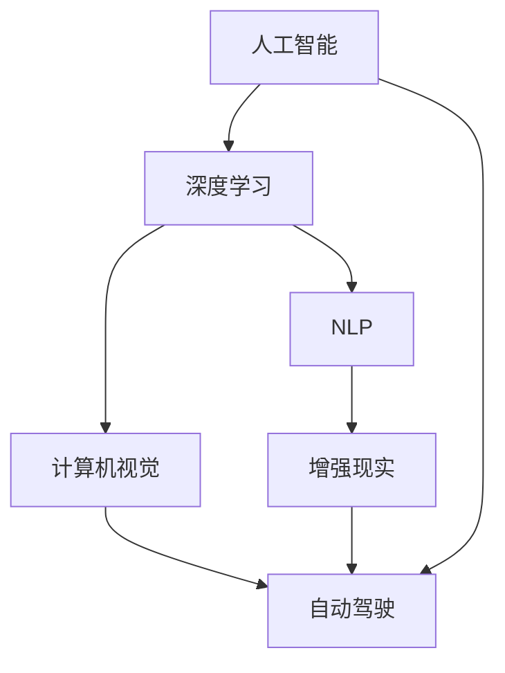

                 

## 1. 背景介绍

近年来，人工智能（AI）技术迅猛发展，尤其是在图像识别、自然语言处理、语音识别等领域取得了显著进展。随着AI技术的广泛应用，越来越多的企业开始探索和投资AI应用，以期获得更高的商业价值和市场竞争力。苹果作为全球领先的科技公司，在AI应用方面也有着独到的见解和布局。本文将探讨苹果发布AI应用的投资价值，分析其技术优势和未来发展方向。

## 2. 核心概念与联系

### 2.1 核心概念概述

- **人工智能（AI）**：利用计算机算法和模型，使机器能够模拟人类智能行为，进行学习、推理、决策等。
- **深度学习（Deep Learning）**：一种基于神经网络的机器学习方法，通过多层次的特征提取和抽象，实现对复杂数据的深度学习和理解。
- **自然语言处理（NLP）**：使计算机能够理解、解释和生成人类语言的技术，包括语音识别、文本分析、机器翻译等。
- **计算机视觉（CV）**：使计算机能够“看”和理解图像和视频，包括图像分类、目标检测、场景理解等。
- **增强现实（AR）**：将虚拟信息叠加在现实世界之上，使真实世界与虚拟世界融合，增强用户体验。
- **自动驾驶（AD）**：通过计算机视觉、传感器融合、路径规划等技术，使车辆能够自主驾驶。

这些核心概念构成了人工智能技术的主要研究方向，并通过不同的技术和应用场景实现了深度融合和协同发展。苹果作为一家综合性科技公司，在上述各个领域都有布局，并希望通过AI应用获得更高的投资价值。

### 2.2 核心概念原理和架构的 Mermaid 流程图



## 3. 核心算法原理 & 具体操作步骤

### 3.1 算法原理概述

苹果公司的人工智能应用主要基于深度学习和计算机视觉技术，通过大量标注数据进行模型训练，实现对图像、语音、文本等数据的理解和处理。其中，深度学习模型主要包括卷积神经网络（CNN）、循环神经网络（RNN）、变换器（Transformer）等。

### 3.2 算法步骤详解

1. **数据收集与预处理**：收集大量标注数据，如图片、音频、文本等，并进行清洗、分割、归一化等预处理操作。
2. **模型训练**：使用深度学习框架（如TensorFlow、PyTorch）进行模型训练，通过反向传播算法更新模型参数，最小化损失函数。
3. **模型评估与优化**：在验证集上评估模型性能，通过调整超参数和优化算法，提高模型精度和泛化能力。
4. **模型部署与应用**：将训练好的模型部署到应用场景中，实现图像识别、语音识别、自然语言处理等功能。

### 3.3 算法优缺点

**优点**：
- **高效处理大量数据**：深度学习模型能够自动学习数据特征，高效处理大规模数据。
- **泛化能力强**：通过大量标注数据进行训练，模型能够适应不同场景和应用需求。
- **灵活应用**：模型可以应用于图像识别、语音识别、自然语言处理等多个领域，具有广泛的应用前景。

**缺点**：
- **需要大量数据**：深度学习模型需要大量标注数据进行训练，数据收集和预处理成本较高。
- **模型复杂度高**：深度学习模型结构复杂，需要较高的计算资源和存储资源。
- **模型解释性差**：深度学习模型通常被称为“黑箱”，难以解释其内部工作机制和决策逻辑。

### 3.4 算法应用领域

苹果公司的人工智能应用主要集中在以下几个领域：

- **图像识别与增强现实**：通过计算机视觉技术，实现图像分类、目标检测、场景理解等功能，并应用于增强现实应用中。
- **语音识别与自然语言处理**：通过深度学习模型，实现语音识别、语音合成、机器翻译等功能，提升用户体验。
- **智能家居与健康管理**：利用AI技术，实现智能家居控制、健康监测、个性化推荐等功能，提升生活便利性。
- **自动驾驶**：通过计算机视觉、传感器融合、路径规划等技术，实现车辆自主驾驶。

## 4. 数学模型和公式 & 详细讲解

### 4.1 数学模型构建

苹果公司的人工智能模型主要基于深度学习框架进行构建。以下以卷积神经网络（CNN）为例，介绍其数学模型构建过程。

**卷积神经网络（CNN）**：
- **输入层**：接收输入数据，如图片、文本等。
- **卷积层**：通过卷积操作提取局部特征，减少参数量。
- **池化层**：通过池化操作降低特征维度和数据量。
- **全连接层**：将池化层输出的特征进行全连接，输出最终结果。

### 4.2 公式推导过程

以图像分类为例，CNN模型的公式推导过程如下：

设输入图片为 $x \in \mathbb{R}^{H \times W \times C}$，其中 $H$、$W$、$C$ 分别为图片的高度、宽度和通道数。卷积核为 $W \times W$ 的矩阵 $K \in \mathbb{R}^{H \times W \times C \times K^2}$，步长为 $s$，则卷积操作定义为：

$$
y_{ij} = \sum_{k=1}^{C} \sum_{m=0}^{W-1} \sum_{n=0}^{H-1} k_{ijmn} x_{mns} + b
$$

其中，$y_{ij} \in \mathbb{R}$ 为卷积输出，$b$ 为偏置项。

通过多个卷积层和池化层的操作，可以得到高层次的特征表示。最后通过全连接层将特征进行分类，输出预测结果。

### 4.3 案例分析与讲解

以苹果公司发布的iPhone X中的Face ID功能为例，分析其背后的AI技术。

Face ID功能基于深度神经网络（DNN），利用3D结构光扫描和计算机视觉技术，实现人脸识别和解锁功能。Face ID包含以下几个步骤：

1. **图像采集**：通过前置摄像头采集人脸图像，并进行预处理。
2. **特征提取**：利用DNN提取人脸图像的特征，包括面部轮廓、纹理、深度信息等。
3. **特征匹配**：将提取的人脸特征与存储在设备中的模板进行匹配，识别用户身份。
4. **解锁操作**：当识别到正确身份时，解锁设备。

Face ID功能利用了深度学习技术，通过多层次的特征提取和匹配，实现了高效、安全的人脸识别。

## 5. 项目实践：代码实例和详细解释说明

### 5.1 开发环境搭建

苹果公司的人工智能应用开发主要使用Python语言和TensorFlow框架。以下是在Mac OS系统上搭建Python开发环境的步骤：

1. 安装Python：从官网下载并安装Python 3.x版本。
2. 安装TensorFlow：使用pip命令安装TensorFlow，例如 `pip install tensorflow==2.x`。
3. 安装相关库：安装OpenCV、Pillow、numpy等库，例如 `pip install opencv-python pillow numpy`。

### 5.2 源代码详细实现

以下是一个简单的图像分类项目的源代码实现，利用TensorFlow框架进行模型训练和测试。

```python
import tensorflow as tf
from tensorflow.keras import layers, models

# 加载数据集
(train_images, train_labels), (test_images, test_labels) = tf.keras.datasets.mnist.load_data()

# 数据预处理
train_images = train_images.reshape(train_images.shape[0], 28, 28, 1)
train_images = train_images / 255.0
test_images = test_images.reshape(test_images.shape[0], 28, 28, 1)
test_images = test_images / 255.0

# 构建模型
model = models.Sequential()
model.add(layers.Conv2D(32, (3, 3), activation='relu', input_shape=(28, 28, 1)))
model.add(layers.MaxPooling2D((2, 2)))
model.add(layers.Conv2D(64, (3, 3), activation='relu'))
model.add(layers.MaxPooling2D((2, 2)))
model.add(layers.Conv2D(64, (3, 3), activation='relu'))
model.add(layers.Flatten())
model.add(layers.Dense(64, activation='relu'))
model.add(layers.Dense(10, activation='softmax'))

# 编译模型
model.compile(optimizer='adam',
              loss='sparse_categorical_crossentropy',
              metrics=['accuracy'])

# 训练模型
model.fit(train_images, train_labels, epochs=10, validation_data=(test_images, test_labels))

# 评估模型
test_loss, test_acc = model.evaluate(test_images, test_labels, verbose=2)
print('Test accuracy:', test_acc)
```

### 5.3 代码解读与分析

以上代码实现了基于卷积神经网络的图像分类模型，包含数据预处理、模型构建、编译、训练、评估等步骤。

- **数据预处理**：将数据集reshape为模型所需形状，并进行归一化处理。
- **模型构建**：使用卷积层、池化层和全连接层构建卷积神经网络模型。
- **模型编译**：选择优化器、损失函数和评估指标，进行模型编译。
- **模型训练**：在训练集上进行模型训练，设置训练轮数。
- **模型评估**：在测试集上进行模型评估，输出测试精度。

## 6. 实际应用场景

苹果公司的人工智能应用在多个领域都有应用，以下是几个典型的应用场景：

### 6.1 图像识别与增强现实

苹果公司通过计算机视觉技术，实现了图像识别和增强现实功能。例如，Siri助手可以通过摄像头识别用户的手势，执行相应的语音指令；ARKit框架支持开发者创建增强现实应用，如AR游戏、虚拟试衣等。

### 6.2 语音识别与自然语言处理

苹果公司的语音识别技术已经应用于Siri助手和Face ID功能中。Siri助手可以通过语音指令进行智能控制、查询信息、执行任务等；Face ID功能通过语音提示用户进行人脸识别，提升安全性。

### 6.3 智能家居与健康管理

苹果公司推出了HomePod智能音箱，支持语音识别和自然语言处理功能，能够通过语音控制家庭设备，提供个性化音乐推荐等。Apple Watch和iPhone等设备集成了健康监测功能，可以实时监测用户的心率、步数、睡眠质量等，并提供个性化的健康建议。

### 6.4 自动驾驶

苹果公司正在研发自动驾驶技术，通过计算机视觉、传感器融合、路径规划等技术，实现车辆自主驾驶。Apple Car作为未来汽车的重要组成部分，将进一步推动自动驾驶技术的发展。

## 7. 工具和资源推荐

### 7.1 学习资源推荐

- **TensorFlow官方文档**：提供详细的TensorFlow框架文档和教程，适合初学者和进阶学习者。
- **PyTorch官方文档**：提供详细的PyTorch框架文档和教程，支持深度学习模型构建和训练。
- **OpenCV官方文档**：提供OpenCV库的使用文档和示例，支持计算机视觉技术的开发。
- **Pillow官方文档**：提供Pillow库的使用文档和示例，支持图像处理和预处理。
- **Kaggle**：提供海量数据集和竞赛平台，支持机器学习和深度学习项目开发。

### 7.2 开发工具推荐

- **PyCharm**：Google开发的Python集成开发环境，支持TensorFlow和PyTorch等深度学习框架。
- **Jupyter Notebook**：支持Python和R语言开发，提供交互式编程和代码运行环境。
- **Colab**：Google提供的云平台，支持Python开发和GPU/TPU计算，适合大规模深度学习项目开发。
- **TensorBoard**：TensorFlow配套的可视化工具，实时监测模型训练状态和性能。

### 7.3 相关论文推荐

- **AlexNet**：Hinton等人提出，基于卷积神经网络的图像分类模型。
- **VGGNet**：Simonyan和Zisserman提出，采用小卷积核和大层数的卷积神经网络模型。
- **InceptionNet**：Google提出，采用多分支卷积结构和跨层连接的网络模型。
- **ResNet**：He等人提出，采用残差连接的网络模型，解决了深度神经网络训练中的梯度消失问题。
- **Transformer**：Vaswani等人提出，基于自注意力机制的神经网络模型，适用于自然语言处理任务。

## 8. 总结：未来发展趋势与挑战

### 8.1 未来发展趋势

苹果公司的人工智能应用将继续保持快速发展的趋势，未来可能出现以下技术突破：

1. **模型精度提升**：通过更复杂的神经网络结构和更多的训练数据，提升AI模型的精度和泛化能力。
2. **应用场景扩展**：将AI技术应用于更多领域，如自动驾驶、智能家居、医疗健康等。
3. **模型小型化**：通过模型压缩和剪枝技术，实现轻量级、实时性的AI模型部署。
4. **跨平台集成**：将AI技术与硬件设备、操作系统等平台进行深度集成，提升用户体验。

### 8.2 面临的挑战

苹果公司的人工智能应用在发展过程中，也面临以下挑战：

1. **数据隐私和安全**：AI模型需要大量数据进行训练，如何保护用户隐私和数据安全是一个重要问题。
2. **计算资源消耗**：AI模型结构复杂，需要较高的计算资源和存储资源，如何优化计算效率和降低资源消耗是一个关键问题。
3. **模型解释性**：AI模型通常被称为“黑箱”，难以解释其内部工作机制和决策逻辑，如何提高模型解释性是一个重要问题。
4. **伦理和道德**：AI模型在决策过程中可能存在偏见和歧视，如何保证模型伦理和道德是一个关键问题。

### 8.3 研究展望

未来，苹果公司的人工智能应用需要在以下几个方面进行深入研究：

1. **数据隐私保护**：采用隐私保护技术，如差分隐私、联邦学习等，保护用户数据隐私。
2. **计算资源优化**：采用模型压缩、剪枝等技术，优化计算资源消耗。
3. **模型解释性提升**：采用可解释AI技术，提高模型解释性，增强用户信任。
4. **伦理和道德保证**：采用伦理导向的评估指标，过滤和惩罚有偏见、有害的输出倾向。

## 9. 附录：常见问题与解答

### 常见问题与解答

**Q1：苹果公司的人工智能应用有哪些？**

A: 苹果公司的人工智能应用涵盖多个领域，包括图像识别、语音识别、自然语言处理、智能家居、健康管理等。例如，Siri助手、Face ID功能、Apple Car自动驾驶技术、HomePod智能音箱等。

**Q2：苹果公司如何处理数据隐私和安全问题？**

A: 苹果公司采用差分隐私技术，通过添加噪声和限制数据使用范围，保护用户数据隐私。同时，苹果公司还采用联邦学习技术，在不共享数据的前提下，进行模型训练和优化。

**Q3：苹果公司的人工智能应用面临哪些挑战？**

A: 苹果公司的人工智能应用面临数据隐私和安全、计算资源消耗、模型解释性和伦理道德等问题。如何保护用户数据隐私、优化计算资源、提高模型解释性和保证模型伦理道德，是未来需要解决的重要挑战。

**Q4：苹果公司未来可能有哪些技术突破？**

A: 苹果公司未来可能实现模型精度提升、应用场景扩展、模型小型化、跨平台集成等技术突破。通过更复杂的神经网络结构、更多的训练数据、模型压缩和剪枝技术、跨平台集成技术，提升AI模型的性能和用户体验。

---

作者：禅与计算机程序设计艺术 / Zen and the Art of Computer Programming

