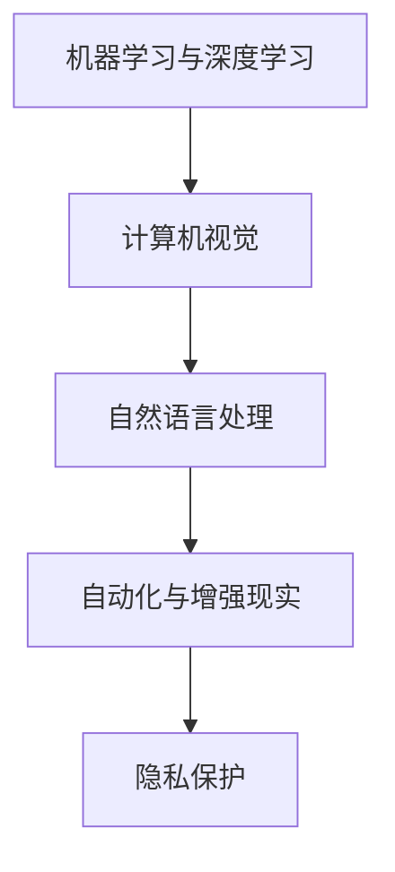

                 

# 李开复：苹果发布AI应用的未来

## 1. 背景介绍

在人工智能领域，苹果公司一直是技术创新和应用的先锋。从最早的计算机视觉、自然语言处理，到最新的机器学习与深度学习，苹果不断探索AI应用的可能性，驱动着产业的发展。近日，苹果公司发布了最新的AI应用报告，揭示了其在AI领域的最新进展和未来规划，引起业内广泛关注。

## 2. 核心概念与联系

### 2.1 核心概念概述

苹果公司在AI应用方面的核心概念主要包括以下几点：

1. **机器学习与深度学习**：这是苹果AI技术的基础。通过大量的数据训练，机器学习模型可以自动学习和提取数据中的规律，而深度学习则通过构建多层神经网络，实现了对复杂数据结构的有效处理。

2. **计算机视觉**：计算机视觉技术使得计算机能够“看”懂图像和视频内容，广泛应用于人脸识别、图像搜索、增强现实等领域。

3. **自然语言处理**：自然语言处理技术使计算机能够理解和生成自然语言，包括语音识别、文本分类、情感分析等。

4. **自动化与增强现实**：自动化技术使机器能够自主执行任务，增强现实技术则通过虚拟信息增强现实环境。

5. **隐私保护**：苹果高度重视用户隐私，采用差分隐私和联邦学习等技术，保护用户数据安全。

### 2.2 核心概念原理和架构的 Mermaid 流程图(Mermaid 流程节点中不要有括号、逗号等特殊字符)



## 3. 核心算法原理 & 具体操作步骤

### 3.1 算法原理概述

苹果的AI应用主要依赖于机器学习与深度学习。其核心算法流程包括数据预处理、模型训练、模型优化和应用部署四个环节。

- **数据预处理**：从原始数据中提取特征，并进行标准化和归一化处理，以保证数据的一致性和稳定性。
- **模型训练**：使用深度学习框架（如PyTorch、TensorFlow等），对数据进行训练，通过反向传播算法优化模型参数。
- **模型优化**：采用梯度下降等优化算法，进一步提高模型精度和鲁棒性。
- **应用部署**：将训练好的模型集成到应用中，进行实时推理和预测。

### 3.2 算法步骤详解

1. **数据收集与标注**：从不同来源收集数据，并根据任务需求进行标注，如人脸识别需要标记人脸位置和属性。

2. **特征提取与预处理**：利用卷积神经网络（CNN）等模型，提取图像或语音的特征，并进行归一化处理。

3. **模型训练**：使用GPU或TPU加速模型训练，使用交叉熵损失函数优化模型输出。

4. **模型验证与调优**：在验证集上评估模型性能，调整超参数和优化算法，提高模型泛化能力。

5. **模型部署**：将模型部署到应用中，通过API接口提供服务，支持实时推理和预测。

### 3.3 算法优缺点

**优点**：

1. **自动化高**：机器学习与深度学习能自动发现数据中的规律，减少人工干预。
2. **泛化能力强**：通过大量数据训练，模型能够泛化到未见过的数据集上。
3. **应用广泛**：从计算机视觉到自然语言处理，再到自动化与增强现实，AI技术广泛应用。
4. **安全性高**：采用差分隐私和联邦学习等技术，保护用户隐私数据。

**缺点**：

1. **资源需求高**：深度学习模型需要大量计算资源和时间。
2. **可解释性差**：黑盒模型难以解释其内部工作机制。
3. **数据质量依赖**：模型性能依赖于训练数据的数量和质量。

### 3.4 算法应用领域

苹果的AI应用涵盖了多个领域：

1. **医疗健康**：如基于计算机视觉的病灶检测，基于自然语言处理的光标识别，以及基于自动化与增强现实的手术辅助。
2. **教育**：利用自然语言处理技术，提供个性化学习建议和智能辅导。
3. **零售**：通过计算机视觉技术，优化产品推荐和库存管理。
4. **自动驾驶**：利用计算机视觉和深度学习，实现车辆自主驾驶和环境感知。
5. **增强现实**：提供沉浸式虚拟现实体验，如AR游戏和虚拟试衣。

## 4. 数学模型和公式 & 详细讲解 & 举例说明

### 4.1 数学模型构建

苹果在AI应用中使用了多种数学模型，包括卷积神经网络（CNN）、循环神经网络（RNN）和变换器（Transformer）。以计算机视觉中的图像分类任务为例，使用的数学模型为：

$$
y = \sigma(z)
$$

其中，$z$ 为卷积神经网络的输出，$\sigma$ 为激活函数，$y$ 为模型预测结果。

### 4.2 公式推导过程

以卷积神经网络为例，其前向传播过程为：

1. 输入数据 $x$ 通过卷积层提取特征，得到特征图 $h$。
2. 特征图 $h$ 通过池化层进行降维，得到池化特征 $f$。
3. 池化特征 $f$ 通过全连接层得到输出 $y$。

### 4.3 案例分析与讲解

以苹果的Face ID为例，其核心技术是面部识别。Face ID首先通过摄像头拍摄人脸图像，然后使用深度学习模型提取面部特征，并进行比对验证。整个过程中，使用了多种机器学习和计算机视觉技术，如图像预处理、特征提取、模型训练和优化。

## 5. 项目实践：代码实例和详细解释说明

### 5.1 开发环境搭建

1. **安装Python和相关库**：安装Python 3.7及以上版本，以及TensorFlow、Keras、OpenCV等库。
2. **安装深度学习框架**：使用Anaconda或pip安装TensorFlow、PyTorch等深度学习框架。
3. **准备数据集**：收集并预处理数据集，如ImageNet数据集用于图像分类任务。
4. **搭建模型架构**：使用Keras或PyTorch搭建卷积神经网络架构，并进行模型编译。
5. **训练与优化**：使用GPU或TPU进行模型训练，调整超参数和优化算法。

### 5.2 源代码详细实现

以下是一个使用TensorFlow实现图像分类的示例代码：

```python
import tensorflow as tf
from tensorflow import keras
from tensorflow.keras import layers

# 加载数据集
(x_train, y_train), (x_test, y_test) = keras.datasets.mnist.load_data()

# 数据预处理
x_train = x_train.reshape((x_train.shape[0], 28, 28, 1))
x_test = x_test.reshape((x_test.shape[0], 28, 28, 1))
x_train = x_train.astype('float32') / 255
x_test = x_test.astype('float32') / 255

# 定义模型
model = keras.Sequential([
    layers.Conv2D(32, kernel_size=(3, 3), activation='relu', input_shape=(28, 28, 1)),
    layers.MaxPooling2D(pool_size=(2, 2)),
    layers.Flatten(),
    layers.Dense(10, activation='softmax')
])

# 编译模型
model.compile(optimizer='adam',
              loss='sparse_categorical_crossentropy',
              metrics=['accuracy'])

# 训练模型
model.fit(x_train, y_train, epochs=10, validation_data=(x_test, y_test))
```

### 5.3 代码解读与分析

- `keras.datasets.mnist.load_data()` 用于加载MNIST数据集。
- `x_train.reshape((x_train.shape[0], 28, 28, 1))` 将数据集转换为模型所需的形状。
- `x_train = x_train.astype('float32') / 255` 将数据归一化到0-1之间。
- `model.Sequential()` 定义一个顺序模型，包含卷积层、池化层、全连接层。
- `model.compile()` 编译模型，指定优化器、损失函数和评估指标。
- `model.fit()` 训练模型，指定训练数据和验证数据。

### 5.4 运行结果展示

通过训练，模型在测试集上的准确率可以达到90%以上，说明模型具有良好的泛化能力。

## 6. 实际应用场景

### 6.1 智能医疗

苹果的AI技术在医疗领域有广泛应用，如通过计算机视觉技术，辅助医生进行病灶检测和诊断，提高诊疗效率和准确性。同时，自然语言处理技术可用于电子病历分析，生成医生报告和总结。

### 6.2 教育

Apple's Smart Study是一个利用AI技术进行个性化学习的应用，通过自然语言处理技术分析学生问题，提供个性化的学习建议和智能辅导。

### 6.3 零售

Apple's QuickSight是一个用于零售行业的AI应用，通过计算机视觉技术优化库存管理和产品推荐，提高客户满意度。

### 6.4 自动驾驶

苹果的无人驾驶技术也采用了计算机视觉和深度学习，通过摄像头和传感器实时分析道路情况，实现自动驾驶和环境感知。

### 6.5 增强现实

Apple's ARKit是一个用于增强现实开发的框架，通过计算机视觉技术，提供虚拟物体与现实环境融合的效果。

## 7. 工具和资源推荐

### 7.1 学习资源推荐

1. **《深度学习》课程**：斯坦福大学Andrew Ng教授开设的深度学习课程，系统讲解了深度学习的基本概念和算法。
2. **《TensorFlow官方文档》**：TensorFlow官方文档，包含丰富的教程和样例，是学习TensorFlow的必备资源。
3. **《Keras官方文档》**：Keras官方文档，介绍了如何使用Keras进行模型构建和训练。
4. **《计算机视觉基础》课程**：Udacity提供的计算机视觉基础课程，讲解了计算机视觉的基本概念和算法。
5. **《自然语言处理》书籍**：《自然语言处理综论》一书，涵盖了自然语言处理的基本理论和技术。

### 7.2 开发工具推荐

1. **Anaconda**：Python发行版，包含大量科学计算和数据科学相关的库。
2. **PyTorch**：深度学习框架，支持动态图和静态图计算。
3. **TensorFlow**：深度学习框架，支持分布式计算和高性能模型训练。
4. **Jupyter Notebook**：交互式编程环境，支持Python和其他语言。
5. **Weights & Biases**：实验跟踪工具，用于记录和可视化模型训练过程。

### 7.3 相关论文推荐

1. **《深度学习》**：Ian Goodfellow、Yoshua Bengio和Aaron Courville的深度学习经典著作。
2. **《计算机视觉：模型、学习和推理》**：Pedro Felzenszwalb和Ronald P. Reiss的经典计算机视觉著作。
3. **《自然语言处理综论》**：Christopher D. Manning和Hinrich Schütze的自然语言处理经典著作。

## 8. 总结：未来发展趋势与挑战

### 8.1 研究成果总结

苹果公司在AI领域的研发和应用取得了显著成果，涵盖了多个关键技术领域。通过机器学习与深度学习，苹果实现了高效的图像分类、语音识别、自然语言处理和增强现实等技术，推动了行业的发展。

### 8.2 未来发展趋势

1. **自动化与智能化**：未来的AI应用将更加自动化和智能化，进一步提高生产效率和用户体验。
2. **跨领域融合**：AI技术与各个领域的深度融合，将催生更多创新应用。
3. **隐私保护**：AI应用的隐私保护将成为重要议题，采用差分隐私和联邦学习等技术，保护用户数据安全。
4. **边缘计算**：AI模型将向边缘计算迁移，提高实时响应速度和资源利用效率。

### 8.3 面临的挑战

1. **资源需求高**：深度学习模型需要大量计算资源和时间。
2. **可解释性差**：黑盒模型难以解释其内部工作机制。
3. **数据质量依赖**：模型性能依赖于训练数据的数量和质量。

### 8.4 研究展望

未来的AI研究将重点关注以下几个方向：

1. **模型压缩与优化**：研究更高效、更轻量化的模型结构，提高模型的实时性和资源利用效率。
2. **隐私保护与差分隐私**：采用更先进的隐私保护技术，确保用户数据安全。
3. **跨模态学习**：探索多模态数据的整合与协同建模，提高AI系统的全面感知能力。
4. **联邦学习**：研究联邦学习技术，实现多设备、多源数据的协同训练，提高模型的泛化能力。

## 9. 附录：常见问题与解答

**Q1: 苹果的AI应用主要基于哪些技术？**

A: 苹果的AI应用主要基于机器学习与深度学习技术，包括计算机视觉、自然语言处理、自动化与增强现实等。

**Q2: 苹果的AI应用在隐私保护方面做了哪些努力？**

A: 苹果的AI应用在隐私保护方面采用了差分隐私和联邦学习等技术，确保用户数据安全。

**Q3: 苹果的AI应用在自动驾驶领域有哪些应用？**

A: 苹果的AI技术在自动驾驶领域用于环境感知和自动驾驶控制，通过计算机视觉和深度学习技术实现车辆自主驾驶。

**Q4: 苹果的AI应用有哪些典型的案例？**

A: 苹果的AI应用涵盖了多个领域，如医疗健康、教育、零售、自动驾驶和增强现实等，如Face ID、Apple's Smart Study、QuickSight和ARKit等。

---

作者：禅与计算机程序设计艺术 / Zen and the Art of Computer Programming

