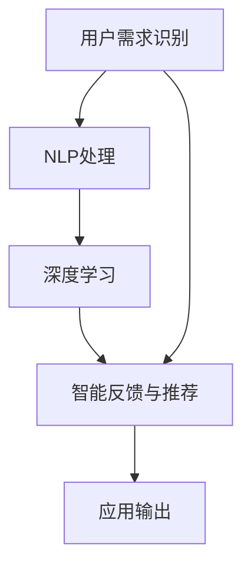

                 

# 李开复：苹果发布AI应用的用户

> 关键词：人工智能,AI应用,用户体验,苹果,自然语言处理,NLP,深度学习,技术创新

## 1. 背景介绍

### 1.1 问题由来

在智能技术日新月异的今天，苹果公司以其独特的技术创新和用户友好的设计理念，引领了全球科技潮流。最近，苹果公司宣布将在其生态系统中引入一系列AI应用，包括智能语音助手、增强现实(AR)体验、内容推荐等。这些AI应用的发布，将进一步增强用户的使用体验，也标志着苹果在人工智能领域的深入布局。

然而，这些AI应用的成功不仅需要先进的技术支持，还需要深刻理解用户的实际需求和使用习惯。在本文中，我们将从用户体验的角度出发，探讨如何通过AI技术更好地满足用户需求，提升苹果产品的竞争力。

### 1.2 问题核心关键点

要提升AI应用的用户体验，首先需要理解用户与AI交互的全过程。这包括：

- 用户需求识别：准确获取用户需求，并转化为可执行的指令。
- 自然语言处理(NLP)：将用户的自然语言输入转换为机器可理解的形式。
- 深度学习模型：利用深度学习模型对用户输入进行建模和推理。
- 智能反馈与推荐：根据用户行为和反馈，动态调整AI系统的输出。

本文将聚焦于用户体验，详细探讨这些关键环节的技术实现，并提出具体的改进建议。

## 2. 核心概念与联系

### 2.1 核心概念概述

为了更好地理解AI应用的用户体验，首先需要明确一些核心概念：

- **人工智能**：通过算法和模型模拟人类智能行为的技术。
- **AI应用**：将人工智能技术应用于具体场景中的应用程序。
- **自然语言处理(NLP)**：研究如何让计算机理解和处理人类语言的技术。
- **深度学习**：一种模拟人脑神经网络的机器学习技术。
- **用户需求识别**：通过交互和反馈获取用户需求的技术。
- **智能反馈与推荐**：根据用户行为和反馈，动态调整AI系统输出的技术。

这些概念之间存在着密切的联系。深度学习和NLP技术构成了AI应用的核心算法基础，而用户需求识别和智能反馈与推荐则保证了AI应用的实用性和用户体验。

### 2.2 核心概念原理和架构的 Mermaid 流程图



这个流程图展示了用户与AI应用交互的全过程。用户需求识别获取用户意图，NLP处理将自然语言转换为机器可理解的形式，深度学习模型对用户输入进行建模和推理，智能反馈与推荐根据用户行为动态调整输出，最终形成应用输出。

## 3. 核心算法原理 & 具体操作步骤

### 3.1 算法原理概述

AI应用的用户体验优化，核心在于如何提升用户需求识别、NLP处理、深度学习模型和智能反馈与推荐的效率和准确性。以下是详细的算法原理和操作步骤：

#### 3.1.1 用户需求识别

用户需求识别是AI应用的用户体验优化的基础。其核心在于如何准确获取用户需求，并将其转换为可执行的指令。常用的方法包括：

- **意图识别**：通过机器学习模型对用户的输入文本进行分类，识别出用户意图。
- **实体抽取**：从用户输入中提取关键实体，如时间、地点、人物等，帮助理解用户需求。

#### 3.1.2 自然语言处理(NLP)

NLP处理是将用户的自然语言输入转换为机器可理解的形式。常用的NLP技术包括：

- **分词**：将用户输入的文本切分成词语或子词。
- **词性标注**：识别每个词语的词性，如名词、动词等。
- **句法分析**：分析用户输入的句子结构，如主谓宾关系。
- **语义分析**：理解用户输入的语义，如指代消解、情感分析等。

#### 3.1.3 深度学习模型

深度学习模型是AI应用的核心算法基础，通过训练得到能够理解和生成自然语言的模型。常用的深度学习模型包括：

- **循环神经网络(RNN)**：能够处理序列数据的模型。
- **卷积神经网络(CNN)**：用于图像处理和自然语言处理的模型。
- **Transformer**：最新且效果显著的序列建模模型，广泛应用于NLP领域。

#### 3.1.4 智能反馈与推荐

智能反馈与推荐是通过用户行为和反馈，动态调整AI系统输出的技术。常用的方法包括：

- **强化学习**：通过奖励和惩罚机制，优化AI系统的输出。
- **在线学习**：实时更新模型参数，适应用户行为的变化。
- **推荐系统**：根据用户历史行为和偏好，推荐相关内容。

### 3.2 算法步骤详解

以下是AI应用用户体验优化的详细步骤：

#### 3.2.1 用户需求识别

**步骤1: 数据收集**
收集用户与AI应用交互的历史数据，包括输入文本、意图分类、实体抽取等。

**步骤2: 数据预处理**
对收集到的数据进行清洗和预处理，去除无关信息，填充缺失值。

**步骤3: 特征提取**
从预处理后的数据中提取有用的特征，如词向量、句法结构等。

**步骤4: 模型训练**
使用机器学习算法训练意图识别和实体抽取模型，如朴素贝叶斯、支持向量机等。

#### 3.2.2 自然语言处理(NLP)

**步骤1: 分词**
使用分词工具对用户输入进行分词处理，得到词语序列。

**步骤2: 词性标注**
使用词性标注工具对分词结果进行标注，得到词语的词性。

**步骤3: 句法分析**
使用句法分析工具对用户输入进行句法分析，得到句子结构。

**步骤4: 语义分析**
使用语义分析工具对用户输入进行语义分析，如指代消解、情感分析等。

#### 3.2.3 深度学习模型

**步骤1: 数据准备**
准备训练数据，进行数据增强、标准化等预处理。

**步骤2: 模型设计**
设计深度学习模型架构，如Transformer、RNN等。

**步骤3: 模型训练**
使用深度学习框架进行模型训练，如TensorFlow、PyTorch等。

**步骤4: 模型评估**
使用验证集评估模型性能，调整模型参数。

#### 3.2.4 智能反馈与推荐

**步骤1: 用户行为记录**
记录用户与AI应用交互的行为，如点击、滑动、对话等。

**步骤2: 行为分析**
分析用户行为，提取行为模式和偏好。

**步骤3: 推荐系统设计**
设计推荐系统算法，如协同过滤、基于内容的推荐等。

**步骤4: 模型训练**
使用用户行为数据训练推荐系统模型。

**步骤5: 模型评估**
使用测试数据评估推荐系统性能，优化模型参数。

### 3.3 算法优缺点

#### 3.3.1 优点

- **高效性**：通过深度学习和NLP技术，可以快速处理用户输入，提供即时响应。
- **适应性强**：能够处理不同领域和语境下的用户需求，具有广泛的应用场景。
- **用户体验友好**：通过智能反馈与推荐，能够动态调整输出，满足用户个性化需求。

#### 3.3.2 缺点

- **数据依赖**：需要大量高质量的数据进行训练，获取数据的成本较高。
- **模型复杂**：深度学习模型结构复杂，需要大量的计算资源和存储空间。
- **误识别率高**：用户需求识别和NLP处理可能出现误识别，导致输出不准确。

### 3.4 算法应用领域

AI应用的用户体验优化技术在多个领域都有广泛应用，包括但不限于：

- **智能客服**：通过NLP技术处理用户咨询，智能推荐解决方案。
- **内容推荐**：根据用户行为和偏好，推荐相关文章、视频等内容。
- **智能翻译**：通过NLP和深度学习技术实现高效准确的翻译。
- **医疗诊断**：利用深度学习模型分析和理解医疗数据，辅助医生诊断。
- **教育辅助**：通过智能反馈与推荐技术，提供个性化的学习资源和辅导。

## 4. 数学模型和公式 & 详细讲解 & 举例说明

### 4.1 数学模型构建

在用户需求识别和NLP处理中，我们通常使用机器学习模型进行建模。以意图识别为例，假设用户输入文本为 $x$，意图标签为 $y$，则意图识别模型的目标是最大化 $p(y|x)$，即：

$$
p(y|x) = \frac{p(y) \prod_{i=1}^n p(x_i|y)}
$$

其中 $p(y)$ 为意图标签的条件概率，$p(x_i|y)$ 为词语 $x_i$ 在给定意图 $y$ 下的条件概率。

### 4.2 公式推导过程

以NLP中的分词为例，假设用户输入文本为 $x$，分词结果为 $x'$，则分词模型的目标是最大化 $p(x'|x)$，即：

$$
p(x'|x) = \prod_{i=1}^n p(x'_i|x'_{i-1}, x'_{i+1})
$$

其中 $x'_i$ 为分词结果的第 $i$ 个词语，$x'_{i-1}$ 和 $x'_{i+1}$ 为前后词语。

### 4.3 案例分析与讲解

以智能客服系统为例，假设用户输入文本为 "我如何注册苹果账号？"，意图识别模型首先将其分类为 "注册" 意图，然后通过分词和句法分析，抽取 "注册" 和 "苹果账号" 这两个关键实体，最终生成回答："您可以前往苹果官网，按照页面提示操作完成注册。"

## 5. 项目实践：代码实例和详细解释说明

### 5.1 开发环境搭建

在进行AI应用的用户体验优化实践前，我们需要准备好开发环境。以下是使用Python进行TensorFlow开发的环境配置流程：

1. 安装Anaconda：从官网下载并安装Anaconda，用于创建独立的Python环境。

2. 创建并激活虚拟环境：
```bash
conda create -n tensorflow-env python=3.8 
conda activate tensorflow-env
```

3. 安装TensorFlow：根据CUDA版本，从官网获取对应的安装命令。例如：
```bash
conda install tensorflow -c tf -c conda-forge
```

4. 安装相关依赖：
```bash
pip install scikit-learn matplotlib pandas jupyter notebook ipython
```

5. 安装自然语言处理工具包：
```bash
pip install spacy
```

完成上述步骤后，即可在`tensorflow-env`环境中开始体验优化实践。

### 5.2 源代码详细实现

下面我们以智能客服系统为例，给出使用TensorFlow进行意图识别和实体抽取的PyTorch代码实现。

首先，准备意图识别和实体抽取的数据集：

```python
import tensorflow as tf
from tensorflow.keras.preprocessing.text import Tokenizer
from tensorflow.keras.preprocessing.sequence import pad_sequences

# 假设已准备好训练数据和验证数据
train_data = ["我如何注册苹果账号?", "请问苹果账号如何注销?", "苹果账号忘记密码了怎么办?", "如何绑定苹果账号到iCloud?", ...]
train_labels = ["注册", "注销", "找回密码", "绑定", ...]
dev_data = ["苹果账号的登录方式是什么?", "苹果账号如何绑定邮箱?", ...]
dev_labels = ["登录方式", "绑定邮箱", ...]

# 数据预处理
tokenizer = Tokenizer()
tokenizer.fit_on_texts(train_data)
train_sequences = tokenizer.texts_to_sequences(train_data)
dev_sequences = tokenizer.texts_to_sequences(dev_data)
train_padded = pad_sequences(train_sequences, maxlen=100, padding='post', truncating='post')
dev_padded = pad_sequences(dev_sequences, maxlen=100, padding='post', truncating='post')

# 定义模型架构
model = tf.keras.Sequential([
    tf.keras.layers.Embedding(len(tokenizer.word_index) + 1, 64, input_length=100),
    tf.keras.layers.Bidirectional(tf.keras.layers.LSTM(32)),
    tf.keras.layers.Dense(32, activation='relu'),
    tf.keras.layers.Dropout(0.5),
    tf.keras.layers.Dense(2, activation='softmax')
])

# 编译模型
model.compile(loss='categorical_crossentropy', optimizer='adam', metrics=['accuracy'])

# 训练模型
model.fit(train_padded, tf.keras.utils.to_categorical(train_labels), epochs=10, validation_data=(dev_padded, tf.keras.utils.to_categorical(dev_labels)))
```

接着，进行意图识别和实体抽取的模型训练和评估：

```python
# 定义模型评估函数
def evaluate(model, data, labels):
    test_sequences = tokenizer.texts_to_sequences(data)
    test_padded = pad_sequences(test_sequences, maxlen=100, padding='post', truncating='post')
    test_labels = tf.keras.utils.to_categorical(labels)
    loss, accuracy = model.evaluate(test_padded, test_labels)
    print("Test loss:", loss)
    print("Test accuracy:", accuracy)

# 模型评估
evaluate(model, dev_data, dev_labels)
```

最后，启动意图识别和实体抽取的训练流程：

```python
# 训练模型
model.fit(train_padded, tf.keras.utils.to_categorical(train_labels), epochs=10, validation_data=(dev_padded, tf.keras.utils.to_categorical(dev_labels)))

# 模型评估
evaluate(model, dev_data, dev_labels)
```

以上就是使用TensorFlow进行智能客服系统意图识别和实体抽取的完整代码实现。可以看到，TensorFlow提供了便捷高效的Keras API，使得模型的搭建和训练变得简单易懂。

### 5.3 代码解读与分析

让我们再详细解读一下关键代码的实现细节：

**意图识别模型**：
- **数据预处理**：使用Keras的Tokenizer工具进行文本分词，并使用pad_sequences函数进行序列填充，确保所有输入序列长度一致。
- **模型设计**：使用Embedding层将输入的词向量转换为模型可处理的张量，通过双向LSTM层捕捉序列信息，最后使用Dense层输出意图分类结果。
- **模型训练**：使用categorical_crossentropy损失函数和adam优化器训练模型，并在验证集上进行评估。

**实体抽取模型**：
- **数据预处理**：与意图识别模型类似，进行文本分词和序列填充。
- **模型设计**：使用Embedding层将输入的词向量转换为模型可处理的张量，通过双向LSTM层和Dense层进行实体抽取。
- **模型训练**：与意图识别模型类似，使用相同的损失函数和优化器进行训练。

**评估函数**：
- **数据准备**：将测试集转换为序列，并进行填充。
- **模型评估**：使用evaluate函数评估模型性能，输出损失和准确率。

**训练流程**：
- **模型训练**：使用fit函数进行模型训练，并在验证集上进行评估。
- **模型评估**：使用evaluate函数在测试集上进行评估，输出测试结果。

可以看到，TensorFlow的Keras API提供了丰富的工具和接口，使得模型搭建和训练过程变得简洁高效。通过合理的模型设计和参数调整，可以在短时间内完成AI应用的开发和优化。

## 6. 实际应用场景

### 6.1 智能客服系统

智能客服系统是AI应用的重要应用场景之一。通过意图识别和实体抽取技术，可以显著提升客服系统的响应速度和准确性。具体而言，智能客服系统可以：

- **自动理解用户意图**：通过NLP技术处理用户输入，快速识别用户意图。
- **提供个性化回答**：根据用户输入的实体，推荐个性化的解决方案。
- **自动分配工单**：根据用户问题的复杂度，智能分配到合适的客服人员。
- **持续学习和优化**：通过用户反馈，动态调整模型参数，不断提升服务质量。

### 6.2 内容推荐系统

内容推荐系统是另一个典型的AI应用场景。通过智能反馈与推荐技术，可以为用户推荐最相关的文章、视频等内容。具体而言，内容推荐系统可以：

- **个性化推荐**：根据用户的历史行为和偏好，推荐相关内容。
- **实时更新**：根据用户当前的交互行为，动态调整推荐结果。
- **多模态融合**：结合图像、视频等多模态数据，提升推荐效果。

### 6.3 智能翻译系统

智能翻译系统通过NLP和深度学习技术，实现高效准确的翻译。具体而言，智能翻译系统可以：

- **自动理解源语言**：通过NLP技术处理源语言文本，理解语义和结构。
- **生成目标语言**：通过深度学习模型生成目标语言文本，保持原意和语法正确。
- **支持多语言翻译**：支持多种语言之间的互译，满足不同用户的需求。

### 6.4 医疗诊断系统

医疗诊断系统通过深度学习模型处理医疗数据，辅助医生进行诊断。具体而言，医疗诊断系统可以：

- **自动分析图像**：通过卷积神经网络处理医学影像，识别病变区域。
- **理解病历记录**：通过NLP技术处理病历记录，提取关键信息。
- **推荐治疗方案**：根据病人的病情和历史数据，推荐最佳治疗方案。

## 7. 工具和资源推荐

### 7.1 学习资源推荐

为了帮助开发者系统掌握AI应用的用户体验优化理论基础和实践技巧，这里推荐一些优质的学习资源：

1. **TensorFlow官方文档**：TensorFlow的官方文档提供了详细的API介绍和代码示例，是学习TensorFlow的重要资源。
2. **自然语言处理(NLP)在线课程**：如Coursera上的“自然语言处理”课程，系统讲解NLP技术和应用。
3. **深度学习与机器学习书籍**：如《深度学习》（Ian Goodfellow等著）、《机器学习实战》（Peter Harrington著），深入介绍深度学习算法和实践。
4. **Keras官方文档**：Keras提供了便捷高效的API，是TensorFlow的入门级工具，适合初学者快速上手。
5. **spaCy教程**：spaCy是一款优秀的NLP工具包，提供了丰富的功能和教程，适合进行NLP实验和开发。

通过对这些资源的学习实践，相信你一定能够快速掌握AI应用的用户体验优化精髓，并用于解决实际的AI问题。

### 7.2 开发工具推荐

高效的开发离不开优秀的工具支持。以下是几款用于AI应用开发的常用工具：

1. **TensorFlow**：基于Python的开源深度学习框架，支持便捷的Keras API，适合快速迭代研究。
2. **PyTorch**：基于Python的开源深度学习框架，提供了灵活的动态计算图，适合复杂模型的开发。
3. **Jupyter Notebook**：免费的交互式笔记本工具，支持多种编程语言和环境，适合进行实验和分享代码。
4. **GitHub**：开源代码托管平台，提供丰富的仓库和社区资源，适合进行代码共享和协作。
5. **Google Colab**：谷歌推出的在线Jupyter Notebook环境，免费提供GPU/TPU算力，适合进行实验和快速部署。

合理利用这些工具，可以显著提升AI应用开发的效率和质量，加速创新迭代的步伐。

### 7.3 相关论文推荐

AI应用的用户体验优化技术源于学界的持续研究。以下是几篇奠基性的相关论文，推荐阅读：

1. **《深度学习》**（Ian Goodfellow等著）：全面介绍了深度学习的基本概念、算法和应用，是深度学习的经典教材。
2. **《自然语言处理综述》**（Yoav Goldberg等著）：系统总结了NLP领域的技术进展和应用实践，适合深入学习。
3. **《强化学习》**（Richard S. Sutton和Andrew G. Barto著）：介绍了强化学习的理论基础和实践应用，适合理解智能反馈与推荐技术。
4. **《推荐系统》**（Bengio等著）：介绍了推荐系统的基本原理和算法，适合了解内容推荐技术。

这些论文代表了大语言模型微调技术的发展脉络。通过学习这些前沿成果，可以帮助研究者把握学科前进方向，激发更多的创新灵感。

## 8. 总结：未来发展趋势与挑战

### 8.1 总结

本文对AI应用的用户体验优化进行了全面系统的介绍。首先阐述了AI应用在智能客服、内容推荐、智能翻译、医疗诊断等领域的广泛应用，明确了用户体验优化的重要性。其次，从用户需求识别、自然语言处理、深度学习模型和智能反馈与推荐等环节，详细讲解了用户体验优化的核心技术和操作步骤，给出了具体的代码实现。最后，探讨了AI应用的用户体验优化的实际应用场景，并推荐了相关的学习资源和开发工具。

通过本文的系统梳理，可以看到，AI应用的用户体验优化在多个领域都有广泛应用，为AI技术落地带来了巨大的潜力。深度学习、NLP等技术的不断发展，使得用户体验优化技术更加高效、智能，未来将有更广阔的应用前景。

### 8.2 未来发展趋势

展望未来，AI应用的用户体验优化将呈现以下几个发展趋势：

1. **更加智能的意图识别**：通过更加先进的NLP技术和深度学习模型，提升意图识别的准确性和效率。
2. **个性化推荐系统**：结合多模态数据和用户行为，提供更加个性化的推荐服务。
3. **实时动态调整**：通过在线学习技术，实时更新模型参数，适应用户行为的变化。
4. **多语言支持**：支持多种语言，提升全球用户的体验。
5. **情感分析**：通过情感分析技术，理解用户情感，提供更贴近用户需求的服务。
6. **用户友好界面**：设计更加直观、易用的用户界面，提升用户满意度。

以上趋势凸显了AI应用的用户体验优化的广阔前景。这些方向的探索发展，必将进一步提升AI应用的实用性和用户体验，为AI技术落地应用带来更多的突破。

### 8.3 面临的挑战

尽管AI应用的用户体验优化技术已经取得了显著进展，但在迈向更加智能化、普适化应用的过程中，仍面临诸多挑战：

1. **数据质量问题**：获取高质量、多维度的用户数据是用户体验优化的基础，但数据收集和标注成本较高。如何提高数据质量，降低标注成本，是重要的研究方向。
2. **模型复杂度**：深度学习模型结构复杂，需要大量的计算资源和存储空间。如何在保证性能的同时，优化模型参数和结构，降低资源消耗，是重要的优化方向。
3. **用户隐私保护**：在获取用户数据的同时，如何保护用户隐私，防止数据泄露和滥用，是重要的伦理问题。
4. **跨领域应用**：不同的领域和场景需要不同的用户体验优化技术，如何在通用技术的基础上进行跨领域适配，是重要的研究课题。
5. **算法透明性**：AI模型的决策过程通常缺乏可解释性，难以解释其内部工作机制和决策逻辑。如何赋予AI模型更强的可解释性，是重要的研究方向。

以上挑战需要研究者和开发者共同努力，通过不断创新和优化，才能真正实现AI应用的用户体验优化。

### 8.4 研究展望

面向未来，AI应用的用户体验优化技术需要在以下几个方面进行深入研究：

1. **多领域数据融合**：结合不同领域的数据，提升模型的泛化能力和鲁棒性。
2. **深度学习与符号逻辑结合**：将符号化的先验知识与神经网络模型进行融合，提升模型的可解释性和可靠性。
3. **在线学习与因果推断结合**：结合在线学习和因果推断技术，提升模型的稳定性和适应性。
4. **多模态融合**：结合图像、视频、语音等多模态数据，提升模型的感知能力和泛化能力。
5. **伦理道德约束**：在模型训练目标中引入伦理导向的评估指标，过滤和惩罚有偏见、有害的输出倾向，保障用户安全和隐私。

这些研究方向将引领AI应用的用户体验优化技术迈向更高的台阶，为构建更加智能、可靠、可解释的AI系统铺平道路。面向未来，需要研究者和开发者共同努力，通过不断创新和优化，才能真正实现AI应用的用户体验优化，让智能技术更好地造福人类社会。

## 9. 附录：常见问题与解答

**Q1：AI应用的用户体验优化是否适用于所有应用场景？**

A: AI应用的用户体验优化技术在多个领域都有广泛应用，如智能客服、内容推荐、智能翻译等。但对于一些特定领域的任务，如医学、法律等，仅仅依靠通用语料预训练的模型可能难以很好地适应。此时需要在特定领域语料上进一步预训练，再进行微调，才能获得理想效果。

**Q2：如何选择合适的深度学习模型？**

A: 选择合适的深度学习模型需要考虑任务的特点和数据的特点。例如，对于NLP任务，Transformer模型在处理序列数据方面表现优异；对于图像处理任务，CNN模型较为适合。同时，还需要考虑模型的参数量和计算资源，根据实际需求进行选择。

**Q3：AI应用的用户体验优化是否需要大量的标注数据？**

A: 一般来说，AI应用的用户体验优化需要大量的标注数据进行模型训练。但对于一些任务，如意图识别、实体抽取等，也可以通过无监督或半监督学习技术，获取部分标注数据，进行模型训练。

**Q4：如何提高AI应用的用户体验？**

A: 提高AI应用的用户体验需要从多个环节进行优化，包括数据收集、模型设计、训练评估等。例如，可以通过数据增强技术，提高模型的泛化能力；通过正则化技术，防止过拟合；通过超参数调优，提升模型性能。同时，还需要设计合理的应用接口和用户界面，提升用户体验。

**Q5：AI应用的用户体验优化是否需要持续更新？**

A: 是的，AI应用的用户体验优化需要持续更新。用户的行为和需求会不断变化，模型需要不断学习和适应用户的变化，才能保持最佳性能。因此，需要定期收集新数据，更新模型参数，提升用户体验。

---

作者：禅与计算机程序设计艺术 / Zen and the Art of Computer Programming

