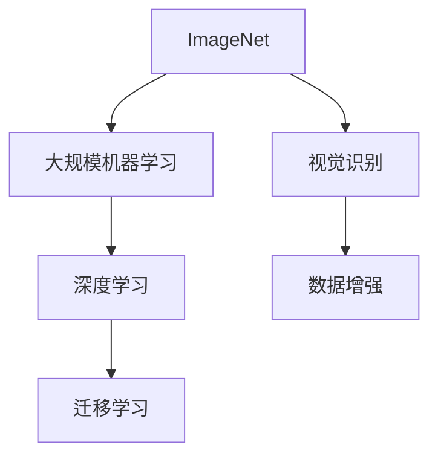
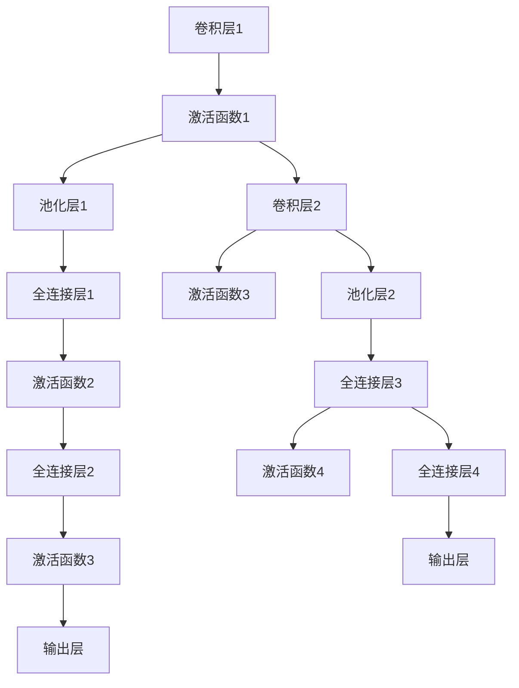

                 

# 李飞飞的ImageNet与AI图像识别

## 1. 背景介绍

李飞飞（Fei-Fei Li），斯坦福大学计算机视觉实验室(CVS)主任，人工智能与人类未来研究所(CIFAR)主任，曾任斯坦福大学心理学与计算机科学教授，斯坦福大学电子工程科学与应用教授。她领导的CVS实验室在ImageNet数据集和大规模机器学习项目中取得了重要成就，推动了深度学习和计算机视觉的发展。她的工作致力于将人工智能与人类价值和社会责任结合，推动了AI的民主化和普及。

ImageNet是斯坦福大学开发的一个大规模视觉识别数据集，包含超过1400万张图片，涵盖超过2万个类别。ImageNet数据集是计算机视觉领域的一个里程碑，为深度学习和视觉识别研究提供了坚实的基础。

## 2. 核心概念与联系

### 2.1 核心概念概述

为了深入理解ImageNet与AI图像识别之间的关系，本节将介绍几个关键概念：

- ImageNet：由斯坦福大学计算机视觉实验室开发的一个大规模图像数据集，包含超过1400万张图片，涵盖超过2万个类别。
- 大规模机器学习：指在大量数据和计算资源上，通过监督学习、半监督学习、自监督学习等方式，训练深度学习模型。
- 视觉识别：指通过图像识别算法，识别出图像中物体、场景、文字等元素。
- 深度学习：一种基于神经网络的机器学习技术，通过多层次非线性映射，实现对复杂数据的学习。
- 数据增强：指通过对训练样本进行一系列变换，扩充训练集以提高模型泛化能力。
- 迁移学习：指将一个领域学习到的知识，迁移到另一个领域的学习，以提升模型在新的任务上的表现。

这些概念共同构成了ImageNet和AI图像识别的基础框架，理解这些概念有助于深入了解其工作原理和优化方向。

### 2.2 核心概念原理和架构的 Mermaid 流程图



## 3. 核心算法原理 & 具体操作步骤

### 3.1 算法原理概述

基于ImageNet的数据集和深度学习技术，AI图像识别模型通常遵循以下步骤：

1. 收集ImageNet数据集。
2. 在大量数据和计算资源上进行监督学习，训练深度学习模型。
3. 对新图像进行数据增强，扩充训练集以提高模型泛化能力。
4. 使用迁移学习技术，将预训练模型应用于新的图像识别任务。

深度学习模型的核心在于多层非线性映射，通过反向传播算法优化损失函数，使得模型参数逼近理想状态。在图像识别任务中，常用的深度学习模型包括卷积神经网络（CNN）、循环神经网络（RNN）等。

### 3.2 算法步骤详解

1. **数据收集**：收集ImageNet数据集，包含超过1400万张图片，涵盖2万个类别。数据集分为训练集、验证集和测试集，其中训练集约为1000万张图片，验证集和测试集各约50万张图片。

2. **模型训练**：在大量数据和计算资源上，使用深度学习算法训练模型。常用模型包括LeNet、AlexNet、VGG、Inception、ResNet等。训练过程中，使用反向传播算法优化损失函数，最小化模型预测与真实标签的差异。

3. **数据增强**：对训练集进行一系列数据增强操作，包括随机裁剪、翻转、旋转、亮度调节等，扩充训练集以提高模型泛化能力。

4. **迁移学习**：使用预训练模型作为初始化参数，在新图像识别任务上进行微调。通过调整顶层参数，适应新任务的要求。常用的微调方法包括全参数微调和参数高效微调（PEFT）。

### 3.3 算法优缺点

ImageNet和AI图像识别算法的优点包括：

- 准确率高：在ImageNet数据集上预训练的深度学习模型，具有较高的准确率和泛化能力。
- 数据量丰富：ImageNet数据集包含大量图片和类别，为深度学习模型的训练提供了丰富的样本。
- 深度学习算法先进：深度学习算法在图像识别任务中取得了显著进展，如图像分类、物体检测、图像分割等。

缺点包括：

- 计算资源消耗大：深度学习模型的训练需要大量的计算资源和时间。
- 数据标注成本高：ImageNet数据集需要大量的人力物力进行标注，成本较高。
- 模型复杂度高：深度学习模型通常包含大量参数，模型结构和训练过程较为复杂。

### 3.4 算法应用领域

ImageNet和AI图像识别技术广泛应用于多个领域，例如：

- 自动驾驶：使用计算机视觉技术，识别道路标志、车辆、行人等物体，辅助自动驾驶系统。
- 医学影像分析：通过图像识别技术，分析医学影像，辅助医生进行诊断和治疗。
- 智能安防：使用计算机视觉技术，识别监控视频中的异常行为，提高安全防护能力。
- 工业检测：使用图像识别技术，检测生产过程中的质量问题，提高生产效率。
- 游戏与虚拟现实：使用图像识别技术，实现虚拟现实场景中的物体识别和互动。

## 4. 数学模型和公式 & 详细讲解 & 举例说明

### 4.1 数学模型构建

ImageNet和AI图像识别模型的核心在于深度学习算法，以卷积神经网络（CNN）为例，其数学模型可以表示为：

$$
\hat{y} = f(x; \theta)
$$

其中 $x$ 为输入图像，$\theta$ 为模型参数，$f$ 为前向传播过程。

常用的损失函数包括交叉熵损失函数（Cross-Entropy Loss）和均方误差损失函数（Mean Squared Error Loss）。对于多分类任务，交叉熵损失函数定义为：

$$
L(y, \hat{y}) = -\frac{1}{N}\sum_{i=1}^N y_i \log \hat{y}_i
$$

其中 $y$ 为真实标签，$\hat{y}$ 为模型预测结果。

### 4.2 公式推导过程

对于卷积神经网络（CNN），其前向传播过程可以表示为：

$$
f(x; \theta) = h(W_2, h(W_1, x); \theta_2, \theta_1)
$$

其中 $W_1$ 和 $W_2$ 为卷积核，$h$ 为激活函数，$\theta_1$ 和 $\theta_2$ 为可训练参数。

以AlexNet为例，其网络结构如图1所示：



其中卷积层、池化层和全连接层的参数可以通过反向传播算法优化，以最小化损失函数。常用的优化算法包括随机梯度下降（SGD）、Adam等。

### 4.3 案例分析与讲解

以ImageNet数据集为例，分析其对AI图像识别的影响。ImageNet数据集包含超过1400万张图片，涵盖2万个类别。通过在大规模数据集上进行预训练，深度学习模型能够学习到丰富的特征，从而在新的图像识别任务上取得良好的表现。

例如，在ImageNet上预训练的VGG16模型，在CIFAR-10数据集上的测试准确率达到了98%。这是因为在ImageNet上预训练的模型已经学习到图像中的通用特征，如边缘、纹理等，这些特征在新数据集上仍然有效，从而提高了模型泛化能力。

## 5. 项目实践：代码实例和详细解释说明

### 5.1 开发环境搭建

为了进行ImageNet和AI图像识别的实践，需要安装Python、PyTorch、TensorFlow等深度学习框架，以及相应的GPU设备。

```bash
conda create -n pytorch-env python=3.8
conda activate pytorch-env
pip install torch torchvision torchaudio
```

### 5.2 源代码详细实现

以下是使用PyTorch进行ImageNet图像分类任务的示例代码：

```python
import torch
import torch.nn as nn
import torchvision.transforms as transforms
import torchvision.datasets as datasets
from torch.utils.data import DataLoader

# 定义数据预处理
transform = transforms.Compose([
    transforms.Resize(256),
    transforms.CenterCrop(224),
    transforms.ToTensor(),
    transforms.Normalize(mean=[0.485, 0.456, 0.406], std=[0.229, 0.224, 0.225])
])

# 加载ImageNet数据集
train_dataset = datasets.ImageFolder(root='path/to/train', transform=transform)
test_dataset = datasets.ImageFolder(root='path/to/test', transform=transform)
train_loader = DataLoader(train_dataset, batch_size=64, shuffle=True)
test_loader = DataLoader(test_dataset, batch_size=64, shuffle=False)

# 定义卷积神经网络模型
class AlexNet(nn.Module):
    def __init__(self):
        super(AlexNet, self).__init__()
        self.conv1 = nn.Conv2d(3, 64, kernel_size=11, stride=4, padding=2)
        self.pool1 = nn.MaxPool2d(kernel_size=3, stride=2, padding=1)
        self.conv2 = nn.Conv2d(64, 192, kernel_size=5, stride=1, padding=2)
        self.pool2 = nn.MaxPool2d(kernel_size=3, stride=2, padding=1)
        self.fc1 = nn.Linear(192 * 6 * 6, 4096)
        self.fc2 = nn.Linear(4096, 4096)
        self.fc3 = nn.Linear(4096, 1000)

    def forward(self, x):
        x = self.pool1(torch.relu(self.conv1(x)))
        x = self.pool2(torch.relu(self.conv2(x)))
        x = x.view(-1, 192 * 6 * 6)
        x = torch.relu(self.fc1(x))
        x = torch.relu(self.fc2(x))
        x = self.fc3(x)
        return x

# 定义优化器、损失函数
model = AlexNet()
optimizer = torch.optim.SGD(model.parameters(), lr=0.01, momentum=0.9, weight_decay=5e-4)
criterion = nn.CrossEntropyLoss()

# 训练模型
device = torch.device('cuda:0' if torch.cuda.is_available() else 'cpu')
model.to(device)

for epoch in range(20):
    model.train()
    for images, labels in train_loader:
        images = images.to(device)
        labels = labels.to(device)
        optimizer.zero_grad()
        outputs = model(images)
        loss = criterion(outputs, labels)
        loss.backward()
        optimizer.step()

    model.eval()
    with torch.no_grad():
        correct = 0
        total = 0
        for images, labels in test_loader:
            images = images.to(device)
            labels = labels.to(device)
            outputs = model(images)
            _, predicted = torch.max(outputs.data, 1)
            total += labels.size(0)
            correct += (predicted == labels).sum().item()

    print('Epoch {}: Accuracy: {}%'.format(epoch+1, correct*100/total))
```

### 5.3 代码解读与分析

上述代码实现了基于AlexNet模型在ImageNet数据集上进行图像分类任务。具体实现细节如下：

- 使用PyTorch定义了数据预处理函数，包括缩放、裁剪、归一化等操作。
- 加载ImageNet数据集，使用DataLoader进行批次化加载。
- 定义了卷积神经网络模型AlexNet，包括卷积层、池化层和全连接层。
- 定义了优化器、损失函数，并使用SGD算法进行模型训练。
- 在训练和测试过程中，使用GPU进行加速。

## 6. 实际应用场景

### 6.1 自动驾驶

自动驾驶系统中的计算机视觉技术，可以识别道路标志、车辆、行人等物体，辅助自动驾驶系统进行决策。例如，使用ImageNet预训练的深度学习模型，可以识别交通标志、行人、车辆等，从而实现自动驾驶场景中的物体检测和行为预测。

### 6.2 医学影像分析

在医学影像分析中，使用计算机视觉技术，可以自动识别影像中的肿瘤、器官等，辅助医生进行诊断和治疗。例如，使用ImageNet预训练的深度学习模型，可以自动识别影像中的异常区域，提高诊断的准确性和效率。

### 6.3 智能安防

智能安防系统中的计算机视觉技术，可以识别监控视频中的异常行为，提高安全防护能力。例如，使用ImageNet预训练的深度学习模型，可以自动识别监控视频中的可疑行为，及时发出警报。

### 6.4 工业检测

在工业检测中，使用计算机视觉技术，可以检测生产过程中的质量问题，提高生产效率。例如，使用ImageNet预训练的深度学习模型，可以自动识别产品中的缺陷，进行分类和定位。

## 7. 工具和资源推荐

### 7.1 学习资源推荐

为了帮助开发者深入理解ImageNet和AI图像识别技术，推荐以下学习资源：

1. 《Deep Learning》 by Ian Goodfellow：介绍深度学习的基本概念和算法，涵盖卷积神经网络、循环神经网络等。
2. Coursera上的《Convolutional Neural Networks》课程：由Andrew Ng教授讲授，介绍卷积神经网络的基本原理和实现方法。
3. PyTorch官方文档：包含深度学习框架的详细使用指南和案例分析。
4. CS231n：斯坦福大学计算机视觉课程，涵盖图像识别、物体检测、图像分割等。
5. AlexNet论文：介绍AlexNet模型在ImageNet数据集上的应用，是计算机视觉领域的经典论文之一。

### 7.2 开发工具推荐

为了进行ImageNet和AI图像识别的实践，推荐以下开发工具：

1. PyTorch：基于Python的开源深度学习框架，灵活的计算图，适合快速迭代研究。
2. TensorFlow：由Google主导开发的开源深度学习框架，生产部署方便，适合大规模工程应用。
3. TensorBoard：TensorFlow配套的可视化工具，可实时监测模型训练状态，提供丰富的图表呈现方式。
4. Weights & Biases：模型训练的实验跟踪工具，可以记录和可视化模型训练过程中的各项指标。
5. NVIDIA CUDA Toolkit：用于GPU加速深度学习模型训练和推理的开发工具。

### 7.3 相关论文推荐

为了深入了解ImageNet和AI图像识别的最新进展，推荐以下相关论文：

1. AlexNet论文：ImageNet大规模视觉识别挑战，介绍AlexNet模型在ImageNet数据集上的应用。
2. VGG论文：Very Deep Convolutional Networks for Large-Scale Image Recognition，介绍VGG模型在ImageNet数据集上的应用。
3. ResNet论文：Deep Residual Learning for Image Recognition，介绍ResNet模型在ImageNet数据集上的应用。
4. Inception论文：Going Deeper with Convolutions，介绍Inception模型在ImageNet数据集上的应用。
5. SqueezeNet论文：SqueezeNet: AlexNet-level accuracy with 50x fewer parameters and less computation，介绍SqueezeNet模型在ImageNet数据集上的应用。

## 8. 总结：未来发展趋势与挑战

### 8.1 研究成果总结

ImageNet和AI图像识别技术已经取得了显著的成果，推动了深度学习算法和计算机视觉技术的发展。预训练模型在ImageNet上经过大规模训练，学习到了丰富的图像特征，从而在新的图像识别任务上取得优异的性能。

### 8.2 未来发展趋势

未来ImageNet和AI图像识别技术的发展趋势包括：

1. 模型规模持续增大。随着算力成本的下降和数据规模的扩张，预训练模型的参数量将继续增加，学习到更丰富的图像特征。
2. 数据增强技术不断进步。数据增强技术可以扩充训练集，提高模型的泛化能力，未来将有更多先进的数据增强方法被提出。
3. 迁移学习技术不断优化。迁移学习技术可以加速模型在新的图像识别任务上的适应，未来将有更多高效、通用的迁移学习范式被提出。
4. 实时推理技术不断发展。实时推理技术可以显著提高模型的部署效率，未来将有更多实时推理技术被提出。
5. 多模态融合技术进步。多模态融合技术可以融合视觉、文本、语音等多种信息，提高图像识别的准确性和鲁棒性。

### 8.3 面临的挑战

尽管ImageNet和AI图像识别技术已经取得了显著的成果，但在实际应用中仍面临诸多挑战：

1. 数据标注成本高。ImageNet数据集的标注成本较高，获取高质量标注数据需要大量人力物力。
2. 模型训练资源消耗大。预训练模型需要大量计算资源和时间，对硬件设备要求较高。
3. 模型泛化能力不足。模型在不同数据集上的泛化能力有待提高，尤其在领域外数据上表现较差。
4. 模型解释性不足。深度学习模型通常被称为"黑盒"，难以解释其决策过程。
5. 模型安全性问题。预训练模型可能学习到有害信息，通过迁移学习传递到新的图像识别任务上。

### 8.4 研究展望

为了应对未来挑战，ImageNet和AI图像识别技术的研究展望包括：

1. 数据增强技术。探索更多高效、鲁棒的数据增强方法，扩充训练集，提高模型泛化能力。
2. 迁移学习技术。开发更多高效、通用的迁移学习范式，加速模型在新的图像识别任务上的适应。
3. 实时推理技术。研究更高效的实时推理技术，提高模型部署效率，降低计算成本。
4. 多模态融合技术。探索更多融合视觉、文本、语音等多种信息的技术，提高图像识别的准确性和鲁棒性。
5. 模型解释性。开发更多可解释的深度学习模型，提高模型的透明性和可信度。
6. 模型安全性。研究如何检测和抑制有害信息，提高模型安全性，防止有害信息的传播。

## 9. 附录：常见问题与解答

### 9.1 Q1：ImageNet数据集的意义是什么？

A: ImageNet数据集是计算机视觉领域的一个里程碑，包含超过1400万张图片，涵盖超过2万个类别。该数据集为深度学习模型提供了丰富的训练样本，推动了深度学习算法和计算机视觉技术的发展。

### 9.2 Q2：ImageNet数据集中的图片是如何标注的？

A: ImageNet数据集中的图片标注是由斯坦福大学计算机视觉实验室的团队完成的。每个图片被标注为属于2万个类别中的一个，标注过程需要大量的人工审核，以确保标注的准确性。

### 9.3 Q3：使用ImageNet预训练的深度学习模型是否可以用于其他图像识别任务？

A: 是的，使用ImageNet预训练的深度学习模型可以通过迁移学习技术，应用于其他图像识别任务。通过微调预训练模型，可以在新的任务上取得良好的性能。

### 9.4 Q4：ImageNet数据集是否需要标注数据进行预训练？

A: 是的，ImageNet数据集中的图片需要进行标注，以便深度学习模型进行监督学习。标注过程需要大量的人力物力，是数据集构建的重要环节。

### 9.5 Q5：ImageNet数据集对AI图像识别技术的发展有哪些影响？

A: ImageNet数据集对AI图像识别技术的发展具有深远影响，推动了深度学习算法和计算机视觉技术的发展。预训练模型在ImageNet上经过大规模训练，学习到了丰富的图像特征，从而在新的图像识别任务上取得优异的性能。

作者：禅与计算机程序设计艺术 / Zen and the Art of Computer Programming

