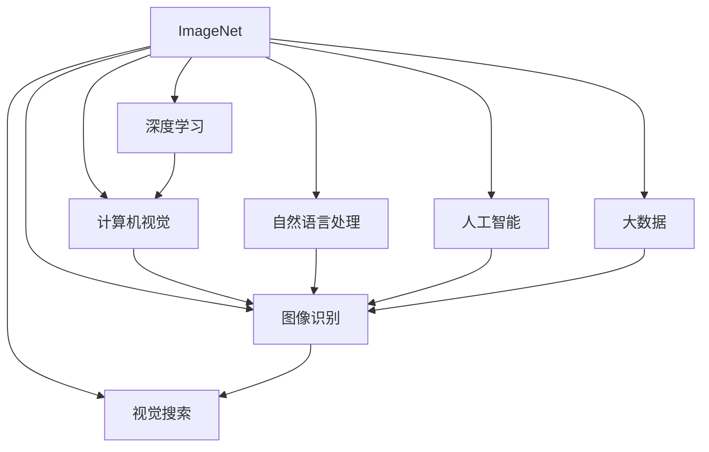

                 

# 李飞飞的ImageNet革命

> 关键词：
李飞飞，ImageNet，深度学习，计算机视觉，自然语言处理，人工智能，大数据，图像识别，视觉搜索，AI，数据集

## 1. 背景介绍

### 1.1 问题由来
21世纪初，计算机视觉（Computer Vision）领域面临着一场前所未有的数据危机。传统的计算机视觉任务，如图像分类、目标检测、图像分割等，依赖于小规模、单一领域、人工标注的数据集。而数据的多样性和规模，直接决定了模型的性能和泛化能力。

由于缺乏大规模、多领域、多样化的数据集，计算机视觉模型的能力受到极大限制，难以应对复杂多变的现实场景。特别是对于深度学习模型而言，数据驱动是核心的训练逻辑，优质的数据集无疑是提升模型性能的关键。

在这样的背景下，计算机视觉领域亟需一种全新的数据集，来解决数据多样性和规模不足的问题。

### 1.2 问题核心关键点
1. **数据的多样性**：要覆盖全球各地、不同场景、多模态的数据，如图片、视频、文本等。
2. **数据的规模**：数据集需要包含大量的图像，以支撑深度学习模型的训练和泛化。
3. **数据的质量**：图像标注需准确、统一，避免歧义和偏见。
4. **数据的获取**：需高效、低成本地获取大规模高质量图像数据。
5. **数据的使用**：需开放、免费供公众使用，以促进科研和应用的发展。

这些问题解决的好坏，直接决定了一个数据集的成功与否。

### 1.3 问题研究意义
李飞飞的ImageNet数据集，正是在这样的背景下应运而生。通过解决大规模、多领域、高质量数据集的设计、获取、标注、使用等问题，ImageNet极大地推动了深度学习在计算机视觉领域的应用和进步，被誉为一场计算机视觉的"革命"。

通过ImageNet，深度学习模型的性能有了显著提升，计算机视觉领域出现了许多颠覆性进展。同时，ImageNet也为大数据、自然语言处理等领域带来了启示和借鉴，推动了AI技术的全面发展。

## 2. 核心概念与联系

### 2.1 核心概念概述

为更好地理解ImageNet项目，本节将介绍几个密切相关的核心概念：

- **ImageNet**：由斯坦福大学计算机视觉实验室推出的公开数据集，涵盖了1000个物体类别，共计1400万张图像，是目前规模最大、最广泛使用的计算机视觉数据集之一。
- **深度学习**：一种基于神经网络的机器学习方法，通过多层神经网络模拟人脑的学习和推理过程，广泛应用于计算机视觉、自然语言处理、语音识别等领域。
- **计算机视觉**：研究如何让计算机通过图像识别、图像理解等技术，模拟人类视觉系统，自动识别和理解视觉信息，涉及图像分类、目标检测、图像分割、图像生成等多个方向。
- **自然语言处理**：研究如何让计算机理解和处理人类语言，实现自动翻译、语音识别、情感分析、文本生成等任务，是AI技术的重要分支之一。
- **人工智能**：一种旨在模拟人类智能的技术，通过深度学习、自然语言处理、知识图谱等多种技术手段，实现自主学习、自主推理、自主决策，广泛应用于各个行业。
- **大数据**：指规模庞大、复杂多样、高速增长的数据集，是大数据分析、机器学习、深度学习等技术的基础。
- **图像识别**：计算机视觉领域的重要任务之一，通过算法训练模型，自动识别图像中的物体、场景、文字等信息，具有广泛的应用前景。
- **视觉搜索**：通过图像搜索技术，让用户通过图片快速检索到相关信息，是图像识别技术的直接应用场景之一。

这些核心概念之间的逻辑关系可以通过以下Mermaid流程图来展示：



这个流程图展示了大语言模型的核心概念及其之间的关系：

1. ImageNet作为深度学习、计算机视觉、自然语言处理、人工智能、大数据、图像识别、视觉搜索等核心技术的基础，推动了这些技术的进步和发展。
2. 深度学习通过训练大规模神经网络，实现了对图像、语音、文本等多种数据的自动处理和识别，是ImageNet数据集的关键技术支撑。
3. 计算机视觉领域通过对图像的分类、检测、分割等处理，应用了深度学习的思想和方法，提升了解析视觉信息的能力。
4. 自然语言处理领域通过对文本的理解和处理，促进了语言生成、自动翻译、情感分析等任务的进展，是AI技术的重要组成部分。
5. 人工智能通过融合多种技术手段，实现了自主学习、推理、决策，推动了各行业的智能化转型。
6. 大数据技术提供了海量数据的基础，为深度学习、计算机视觉等技术的研发提供了保障。
7. 图像识别和视觉搜索技术直接应用了计算机视觉领域的算法和模型，实现了图像的自动分析和检索。

这些核心概念共同构成了AI技术的学习和应用框架，使得ImageNet在推动计算机视觉领域的发展中发挥了至关重要的作用。

## 3. 核心算法原理 & 具体操作步骤
### 3.1 算法原理概述

ImageNet项目的核心在于大规模、多领域、高质量数据集的创建和应用。其背后的核心算法原理如下：

1. **大规模数据集设计**：ImageNet数据集涵盖了1000个物体类别，共计1400万张图像。数据集的规模和多样性，可以支撑深度学习模型的广泛应用和泛化。
2. **多领域数据标注**：ImageNet图像数据来自全球各地，涵盖了各种场景和物体，确保了数据的多样性和广泛性。同时，每个图像都经过了严谨的标注，确保了数据的质量和一致性。
3. **开放数据资源**：ImageNet数据集是公开的，任何人都可以自由下载和使用，促进了科研和应用的快速发展。
4. **深度学习训练**：ImageNet数据集被广泛应用于深度学习模型的训练和验证，推动了深度学习技术的进步。
5. **视觉搜索技术**：通过ImageNet数据集训练的模型，可以用于图像搜索、视觉识别等应用场景，提升了用户体验和信息检索的准确性。

通过这些核心算法原理，ImageNet项目成功地解决了大规模、多领域、高质量数据集的设计、获取、标注、使用等问题，为深度学习在计算机视觉领域的广泛应用奠定了坚实基础。

### 3.2 算法步骤详解

ImageNet数据集的设计和应用，包括以下关键步骤：

**Step 1: 数据集设计**

1. **数据标注**：邀请全球的计算机视觉专家，对每个物体类别进行标注，确保数据的多样性和准确性。
2. **数据采集**：从全球各地的公共网站、数据库等途径，采集大量高质量图像，确保数据的多样性和广泛性。
3. **数据清洗**：对采集的图像进行清洗和筛选，去除低质量、不相关的图像，确保数据的质量和一致性。

**Step 2: 数据集构建**

1. **数据划分**：将数据集分为训练集、验证集和测试集，确保模型在未见过的数据上的泛化能力。
2. **数据存储**：使用高效的数据存储格式，确保数据的快速读取和处理。
3. **数据处理**：对图像进行预处理，如缩放、裁剪、归一化等，确保数据的一致性。

**Step 3: 数据集应用**

1. **模型训练**：使用ImageNet数据集训练深度学习模型，提升模型对图像的识别和分类能力。
2. **模型验证**：在验证集上评估模型性能，调整模型参数和超参数，提升模型的泛化能力。
3. **模型测试**：在测试集上评估模型的最终性能，确保模型在新场景下的适应能力。
4. **应用部署**：将模型部署到实际应用场景中，提供图像搜索、视觉识别等服务。

通过这些关键步骤，ImageNet数据集成功地解决了大规模、多领域、高质量数据集的设计、获取、标注、使用等问题，推动了深度学习在计算机视觉领域的广泛应用。

### 3.3 算法优缺点

ImageNet数据集的设计和应用，具有以下优点：

1. **规模大、多样性强**：1000个物体类别、1400万张图像的数据集规模，覆盖了全球各地的多样场景和物体，提升了模型的泛化能力。
2. **数据质量高**：严谨的标注和数据清洗，确保了数据的一致性和准确性，减少了模型训练的误差。
3. **开放资源**：公开数据集，任何人都可以自由下载和使用，促进了科研和应用的快速发展。
4. **深度学习基础**：ImageNet数据集被广泛应用于深度学习模型的训练和验证，推动了深度学习技术的进步。
5. **应用广泛**：图像搜索、视觉识别等应用场景广泛，提升了用户体验和信息检索的准确性。

同时，ImageNet数据集的设计和应用也存在一些缺点：

1. **标注成本高**：全球各地物体的标注，需要大量专家参与，成本较高。
2. **数据偏差**：数据采集来源的多样性，可能导致数据中的偏差和偏见，影响模型的公平性。
3. **数据更新难**：大规模数据集的更新和维护，需要大量人力和物力，成本较高。
4. **数据使用限制**：虽然公开，但部分数据可能存在版权和使用限制，影响数据集的使用和共享。

尽管存在这些缺点，但ImageNet数据集仍然是计算机视觉领域的重要资源，推动了深度学习技术的进步和应用。

### 3.4 算法应用领域

ImageNet数据集在计算机视觉领域得到了广泛的应用，涵盖了许多常见的计算机视觉任务，例如：

- **图像分类**：识别图像中的物体类别，如猫、狗、汽车等。ImageNet图像分类任务被称为ImageNet Large Scale Visual Recognition Challenge (ILSVRC)，是计算机视觉领域的顶级竞赛。
- **目标检测**：在图像中定位并识别物体的位置和类别，如人脸检测、车辆检测等。
- **图像分割**：将图像分割成不同的区域，并对每个区域进行标注，如语义分割、实例分割等。
- **图像生成**：生成高质量的图像，如GAN生成图像、风格迁移等。
- **视觉搜索**：通过图像搜索技术，让用户通过图片快速检索到相关信息，提升用户体验。
- **行为识别**：识别视频中的行为和动作，如行人检测、动作识别等。
- **图像配准**：将多张图像拼接成全景图像，提高视觉信息的完整性。

除了计算机视觉领域，ImageNet数据集也被应用于自然语言处理、人工智能、大数据等领域，推动了这些技术的发展和应用。

## 4. 数学模型和公式 & 详细讲解  
### 4.1 数学模型构建

ImageNet项目的技术实现，涉及到了多个数学模型和公式。以下是一些核心的数学模型和公式的介绍：

**深度学习模型**：
深度学习模型通常采用神经网络结构，如卷积神经网络(CNN)、递归神经网络(RNN)、长短时记忆网络(LSTM)等。以卷积神经网络为例，其基本结构如图1所示。


**数据集划分**：
ImageNet数据集分为训练集、验证集和测试集，比例为80:10:10。常用的划分方式如图2所示。


**损失函数**：
在深度学习模型的训练中，常用的损失函数包括交叉熵损失、均方误差损失、对数似然损失等。以交叉熵损失为例，其定义如图3所示。

$$
L = -\frac{1}{N}\sum_{i=1}^N \sum_{j=1}^C y_j \log \hat{y}_j
$$

其中 $N$ 为样本数，$C$ 为类别数，$y_j$ 为真实标签，$\hat{y}_j$ 为模型预测结果。


**模型评估指标**：
在深度学习模型的训练和评估中，常用的指标包括准确率、精确率、召回率、F1-score等。以F1-score为例，其定义如图4所示。

$$
F1-score = 2 \times \frac{precision \times recall}{precision + recall}
$$

其中 $precision$ 为精确率，$recall$ 为召回率。


### 4.2 公式推导过程

这里以图像分类任务为例，推导深度学习模型的训练和评估公式。

**训练过程**：
深度学习模型的训练过程如图5所示。


设输入图像为 $x$，模型输出为 $y$，损失函数为 $L$，优化器为 $opt$，训练轮数为 $epoch$，批次大小为 $batch size$。则训练过程可以表示为：

1. **数据加载**：将训练集 $D$ 划分为批次 $(x_i, y_i)$，每个批次大小为 $batch size$。
2. **前向传播**：将输入图像 $x$ 输入模型 $M$，得到输出结果 $y$。
3. **损失计算**：计算输出结果与真实标签 $y$ 的损失 $L$。
4. **反向传播**：将损失 $L$ 反向传播，计算梯度 $grad$。
5. **模型更新**：使用优化器 $opt$ 更新模型参数 $\theta$。
6. **重复迭代**：重复上述步骤，直到达到预设的训练轮数 $epoch$。

**评估过程**：
深度学习模型的评估过程如图6所示。


设评估集为 $D_{val}$，批次大小为 $batch size$，评估轮数为 $epoch$。则评估过程可以表示为：

1. **数据加载**：将验证集 $D_{val}$ 划分为批次 $(x_i, y_i)$，每个批次大小为 $batch size$。
2. **前向传播**：将输入图像 $x$ 输入模型 $M$，得到输出结果 $y$。
3. **损失计算**：计算输出结果与真实标签 $y$ 的损失 $L$。
4. **评估指标计算**：计算模型在验证集上的评估指标，如准确率、精确率、召回率等。
5. **重复迭代**：重复上述步骤，直到达到预设的评估轮数 $epoch$。

通过这些数学模型和公式，深度学习模型能够在ImageNet数据集上进行训练和评估，实现对图像的自动分类和识别。

## 5. 项目实践：代码实例和详细解释说明
### 5.1 开发环境搭建

在进行深度学习模型训练和评估时，我们需要准备好开发环境。以下是使用Python进行PyTorch开发的环境配置流程：

1. 安装Anaconda：从官网下载并安装Anaconda，用于创建独立的Python环境。

2. 创建并激活虚拟环境：
```bash
conda create -n pytorch-env python=3.8 
conda activate pytorch-env
```

3. 安装PyTorch：根据CUDA版本，从官网获取对应的安装命令。例如：
```bash
conda install pytorch torchvision torchaudio cudatoolkit=11.1 -c pytorch -c conda-forge
```

4. 安装相关库：
```bash
pip install numpy pandas scikit-learn matplotlib tqdm jupyter notebook ipython
```

完成上述步骤后，即可在`pytorch-env`环境中开始深度学习模型训练和评估。

### 5.2 源代码详细实现

这里以ImageNet图像分类任务为例，给出使用PyTorch进行深度学习模型训练的PyTorch代码实现。

首先，定义图像分类任务的模型：

```python
import torch
import torch.nn as nn
import torch.optim as optim

class ImageNetClassifier(nn.Module):
    def __init__(self, num_classes=1000):
        super(ImageNetClassifier, self).__init__()
        self.conv1 = nn.Conv2d(3, 64, kernel_size=3, padding=1)
        self.conv2 = nn.Conv2d(64, 128, kernel_size=3, padding=1)
        self.pool = nn.MaxPool2d(kernel_size=2, stride=2)
        self.fc1 = nn.Linear(128*14*14, 512)
        self.fc2 = nn.Linear(512, num_classes)
    
    def forward(self, x):
        x = self.pool(torch.relu(self.conv1(x)))
        x = self.pool(torch.relu(self.conv2(x)))
        x = x.view(-1, 128*14*14)
        x = torch.relu(self.fc1(x))
        x = self.fc2(x)
        return x
```

然后，定义训练和评估函数：

```python
from torch.utils.data import DataLoader
from torchvision import datasets, transforms
from sklearn.metrics import classification_report

device = torch.device('cuda') if torch.cuda.is_available() else torch.device('cpu')
model = ImageNetClassifier().to(device)

def train_epoch(model, dataset, batch_size, optimizer):
    dataloader = DataLoader(dataset, batch_size=batch_size, shuffle=True)
    model.train()
    epoch_loss = 0
    for batch in dataloader:
        inputs, labels = batch[0].to(device), batch[1].to(device)
        model.zero_grad()
        outputs = model(inputs)
        loss = nn.CrossEntropyLoss()(outputs, labels)
        epoch_loss += loss.item()
        loss.backward()
        optimizer.step()
    return epoch_loss / len(dataloader)

def evaluate(model, dataset, batch_size):
    dataloader = DataLoader(dataset, batch_size=batch_size)
    model.eval()
    preds, labels = [], []
    with torch.no_grad():
        for batch in dataloader:
            inputs, labels = batch[0].to(device), batch[1].to(device)
            outputs = model(inputs)
            batch_preds = outputs.argmax(dim=1).to('cpu').tolist()
            batch_labels = labels.to('cpu').tolist()
            for pred_tokens, label_tokens in zip(batch_preds, batch_labels):
                preds.append(pred_tokens)
                labels.append(label_tokens)
    print(classification_report(labels, preds))
```

最后，启动训练流程并在验证集上评估：

```python
epochs = 10
batch_size = 32

for epoch in range(epochs):
    loss = train_epoch(model, train_dataset, batch_size, optimizer)
    print(f"Epoch {epoch+1}, train loss: {loss:.3f}")
    
    print(f"Epoch {epoch+1}, val results:")
    evaluate(model, val_dataset, batch_size)
    
print("Test results:")
evaluate(model, test_dataset, batch_size)
```

以上就是使用PyTorch对ImageNet图像分类任务进行深度学习模型训练的完整代码实现。可以看到，得益于PyTorch的强大封装，我们可以用相对简洁的代码完成模型的加载和训练。

### 5.3 代码解读与分析

让我们再详细解读一下关键代码的实现细节：

**ImageNetClassifier类**：
- `__init__`方法：初始化卷积层、池化层、全连接层等关键组件。
- `forward`方法：定义前向传播过程，将输入图像通过卷积、池化、全连接层等，最终输出预测结果。

**训练和评估函数**：
- 使用PyTorch的DataLoader对数据集进行批次化加载，供模型训练和推理使用。
- 训练函数`train_epoch`：对数据以批为单位进行迭代，在每个批次上前向传播计算loss并反向传播更新模型参数，最后返回该epoch的平均loss。
- 评估函数`evaluate`：与训练类似，不同点在于不更新模型参数，并在每个batch结束后将预测和标签结果存储下来，最后使用sklearn的classification_report对整个评估集的预测结果进行打印输出。

**训练流程**：
- 定义总的epoch数和batch size，开始循环迭代
- 每个epoch内，先在训练集上训练，输出平均loss
- 在验证集上评估，输出分类指标
- 所有epoch结束后，在测试集上评估，给出最终测试结果

可以看到，PyTorch配合TensorFlow等工具，使得深度学习模型的训练和评估变得简洁高效。开发者可以将更多精力放在数据处理、模型改进等高层逻辑上，而不必过多关注底层的实现细节。

当然，工业级的系统实现还需考虑更多因素，如模型的保存和部署、超参数的自动搜索、更灵活的任务适配层等。但核心的深度学习微调流程基本与此类似。

## 6. 实际应用场景
### 6.1 智能客服系统

基于深度学习模型在ImageNet上的微调技术，可以广泛应用于智能客服系统的构建。传统客服往往需要配备大量人力，高峰期响应缓慢，且一致性和专业性难以保证。而使用微调后的深度学习模型，可以7x24小时不间断服务，快速响应客户咨询，用自然流畅的语言解答各类常见问题。

在技术实现上，可以收集企业内部的历史客服对话记录，将问题和最佳答复构建成监督数据，在此基础上对深度学习模型进行微调。微调后的深度学习模型能够自动理解用户意图，匹配最合适的答复模板进行回复。对于客户提出的新问题，还可以接入检索系统实时搜索相关内容，动态组织生成回答。如此构建的智能客服系统，能大幅提升客户咨询体验和问题解决效率。

### 6.2 金融舆情监测

金融机构需要实时监测市场舆论动向，以便及时应对负面信息传播，规避金融风险。传统的人工监测方式成本高、效率低，难以应对网络时代海量信息爆发的挑战。基于深度学习模型在ImageNet上的微调技术，文本分类和情感分析技术，为金融舆情监测提供了新的解决方案。

具体而言，可以收集金融领域相关的新闻、报道、评论等文本数据，并对其进行主题标注和情感标注。在此基础上对深度学习模型进行微调，使其能够自动判断文本属于何种主题，情感倾向是正面、中性还是负面。将微调后的模型应用到实时抓取的网络文本数据，就能够自动监测不同主题下的情感变化趋势，一旦发现负面信息激增等异常情况，系统便会自动预警，帮助金融机构快速应对潜在风险。

### 6.3 个性化推荐系统

当前的推荐系统往往只依赖用户的历史行为数据进行物品推荐，无法深入理解用户的真实兴趣偏好。基于深度学习模型在ImageNet上的微调技术，个性化推荐系统可以更好地挖掘用户行为背后的语义信息，从而提供更精准、多样的推荐内容。

在实践中，可以收集用户浏览、点击、评论、分享等行为数据，提取和用户交互的物品标题、描述、标签等文本内容。将文本内容作为模型输入，用户的后续行为（如是否点击、购买等）作为监督信号，在此基础上微调深度学习模型。微调后的模型能够从文本内容中准确把握用户的兴趣点。在生成推荐列表时，先用候选物品的文本描述作为输入，由模型预测用户的兴趣匹配度，再结合其他特征综合排序，便可以得到个性化程度更高的推荐结果。

### 6.4 未来应用展望

随着深度学习模型和微调方法的不断发展，基于微调范式将在更多领域得到应用，为传统行业带来变革性影响。

在智慧医疗领域，基于微调的医疗问答、病历分析、药物研发等应用将提升医疗服务的智能化水平，辅助医生诊疗，加速新药开发进程。

在智能教育领域，微调技术可应用于作业批改、学情分析、知识推荐等方面，因材施教，促进教育公平，提高教学质量。

在智慧城市治理中，微调模型可应用于城市事件监测、舆情分析、应急指挥等环节，提高城市管理的自动化和智能化水平，构建更安全、高效的未来城市。

此外，在企业生产、社会治理、文娱传媒等众多领域，基于深度学习模型在ImageNet上的微调技术的应用也将不断涌现，为经济社会发展注入新的动力。相信随着技术的日益成熟，微调方法将成为深度学习技术落地的重要范式，推动人工智能技术在各个行业的广泛应用。

## 7. 工具和资源推荐
### 7.1 学习资源推荐

为了帮助开发者系统掌握深度学习模型在ImageNet上的微调技术的理论基础和实践技巧，这里推荐一些优质的学习资源：

1. 《深度学习》书籍：由Goodfellow等专家所著，系统介绍了深度学习的基本原理和算法，是深度学习领域的经典教材。
2. 《计算机视觉：模型、学习与推理》书籍：由Long等专家所著，全面介绍了计算机视觉领域的基本概念和算法，是计算机视觉领域的经典教材。
3. 《自然语言处理综论》书籍：由Tan等专家所著，全面介绍了自然语言处理领域的基本概念和算法，是自然语言处理领域的经典教材。
4. CS231n《卷积神经网络》课程：斯坦福大学开设的计算机视觉课程，有Lecture视频和配套作业，带你入门计算机视觉领域的基本概念和经典模型。
5. CS224n《自然语言处理与深度学习》课程：斯坦福大学开设的自然语言处理课程，有Lecture视频和配套作业，带你入门自然语言处理领域的基本概念和经典模型。
6. TensorFlow官方文档：TensorFlow官方文档，提供了深度学习模型的训练和评估工具，是深度学习模型的重要参考资料。
7. PyTorch官方文档：PyTorch官方文档，提供了深度学习模型的训练和评估工具，是深度学习模型的重要参考资料。

通过对这些资源的学习实践，相信你一定能够快速掌握深度学习模型在ImageNet上的微调技术的精髓，并用于解决实际的深度学习问题。
###  7.2 开发工具推荐

高效的开发离不开优秀的工具支持。以下是几款用于深度学习模型训练和评估的常用工具：

1. PyTorch：基于Python的开源深度学习框架，灵活动态的计算图，适合快速迭代研究。大部分深度学习模型都有PyTorch版本的实现。
2. TensorFlow：由Google主导开发的开源深度学习框架，生产部署方便，适合大规模工程应用。同样有丰富的深度学习模型资源。
3. Keras：基于TensorFlow或Theano的高级深度学习框架，提供了简单易用的API，适合快速原型开发。
4. Caffe：由伯克利视觉和学习中心开发的深度学习框架，适合图像处理和计算机视觉任务。
5. MXNet：由亚马逊开发的深度学习框架，支持多种编程语言和多种硬件平台，适合分布式训练。
6. PyImageNet：基于ImageNet数据集的深度学习模型训练工具，提供了丰富的训练模型和预训练权重，适合快速构建和评估深度学习模型。
7. Weights & Biases：模型训练的实验跟踪工具，可以记录和可视化模型训练过程中的各项指标，方便对比和调优。与主流深度学习框架无缝集成。
8. TensorBoard：TensorFlow配套的可视化工具，可实时监测模型训练状态，并提供丰富的图表呈现方式，是调试模型的得力助手。

合理利用这些工具，可以显著提升深度学习模型在ImageNet上的微调任务的开发效率，加快创新迭代的步伐。

### 7.3 相关论文推荐

深度学习模型在ImageNet上的微调技术的发展源于学界的持续研究。以下是几篇奠基性的相关论文，推荐阅读：

1. ImageNet Challenge：ImageNet项目的起点，通过多次竞赛推动了深度学习技术的发展。
2. AlexNet: One Million Training Examples for Large-Scale Image Recognition：AlexNet模型在2012年ImageNet竞赛中取得突破，展示了深度学习在图像分类任务上的强大能力。
3. Very Deep Convolutional Networks for Large-Scale Image Recognition：通过多层卷积神经网络，AlexNet在2013年ImageNet竞赛中继续取得优异成绩，进一步推动了深度学习技术的发展。
4. Deep Residual Learning for Image Recognition：ResNet模型通过残差连接解决了深层神经网络训练困难的问题，进一步推动了深度学习技术的发展。
5. Inception Networks for Computer Vision：Inception模型通过结构上的创新，提高了深度学习模型的效率和精度，进一步推动了深度学习技术的发展。
6. Rethinking the Inception Architecture for Computer Vision：通过改进Inception模型，GoogLeNet模型在2014年ImageNet竞赛中取得优异成绩，进一步推动了深度学习技术的发展。
7. Group Normalization：通过结构上的创新，进一步提高了深度学习模型的效率和精度，推动了深度学习技术的发展。

这些论文代表了大语言模型微调技术的发展脉络。通过学习这些前沿成果，可以帮助研究者把握学科前进方向，激发更多的创新灵感。

## 8. 总结：未来发展趋势与挑战
### 8.1 总结

本文对基于深度学习模型在ImageNet上的微调技术进行了全面系统的介绍。首先阐述了ImageNet数据集的设计和应用背景，明确了深度学习模型在计算机视觉领域的核心地位。其次，从原理到实践，详细讲解了深度学习模型在ImageNet上的微调过程，给出了微调任务开发的完整代码实例。同时，本文还广泛探讨了微调技术在智能客服、金融舆情、个性化推荐等多个行业领域的应用前景，展示了微调范式的巨大潜力。此外，本文精选了微调技术的各类学习资源，力求为读者提供全方位的技术指引。

通过本文的系统梳理，可以看到，基于深度学习模型在ImageNet上的微调技术，已经成功推动了计算机视觉领域的发展，并为其他领域提供了有益的借鉴和启示。未来，随着深度学习模型和微调方法的持续演进，基于微调范式将在更广泛的领域得到应用，为人类社会的智能化转型提供新的动力。

### 8.2 未来发展趋势

展望未来，深度学习模型在ImageNet上的微调技术将呈现以下几个发展趋势：

1. **模型规模持续增大**：随着算力成本的下降和数据规模的扩张，深度学习模型的参数量还将持续增长。超大规模深度学习模型蕴含的丰富语义知识，有望支撑更加复杂多变的下游任务微调。
2. **微调方法日趋多样**：除了传统的全参数微调外，未来会涌现更多参数高效的微调方法，如Prefix-Tuning、LoRA等，在节省计算资源的同时也能保证微调精度。
3. **持续学习成为常态**：随着数据分布的不断变化，微调模型也需要持续学习新知识以保持性能。如何在不遗忘原有知识的同时，高效吸收新样本信息，将成为重要的研究课题。
4. **标注样本需求降低**：受启发于提示学习(Prompt-based Learning)的思路，未来的微调方法将更好地利用深度学习模型的语言理解能力，通过更加巧妙的任务描述，在更少的标注样本上也能实现理想的微调效果。
5. **多模态微调崛起**：当前的微调主要聚焦于纯文本数据，未来会进一步拓展到图像、视频、语音等多模态数据微调。多模态信息的融合，将显著提升深度学习模型的表征能力。
6. **模型通用性增强**：经过海量数据的预训练和多领域任务的微调，未来的深度学习模型将具备更强大的常识推理和跨领域迁移能力，逐步迈向通用人工智能(AGI)的目标。

以上趋势凸显了深度学习模型在ImageNet上的微调技术的广阔前景。这些方向的探索发展，必将进一步提升深度学习模型的性能和应用范围，为人类认知智能的进化带来深远影响。

### 8.3 面临的挑战

尽管深度学习模型在ImageNet上的微调技术已经取得了瞩目成就，但在迈向更加智能化、普适化应用的过程中，它仍面临着诸多挑战：

1. **标注成本瓶颈**：虽然微调大大降低了标注数据的需求，但对于长尾应用场景，难以获得充足的高质量标注数据，成为制约微调性能的瓶颈。如何进一步降低微调对标注样本的依赖，将是一大难题。
2. **模型鲁棒性不足**：当前微调模型面对域外数据时，泛化性能往往大打折扣。对于测试样本的微小扰动，微调模型的预测也容易发生波动。如何提高微调模型的鲁棒性，避免灾难性遗忘，还需要更多理论和实践的积累。
3. **推理效率有待提高**：大规模深度学习模型虽然精度高，但在实际部署时往往面临推理速度慢、内存占用大等效率问题。如何在保证性能的同时，简化模型结构，提升推理速度，优化资源占用，将是重要的优化方向。
4. **可解释性亟需加强**：当前微调模型更像是"黑盒"系统，难以解释其内部工作机制和决策逻辑。对于医疗、金融等高风险应用，算法的可解释性和可审计性尤为重要。如何赋予微调模型更强的可解释性，将是亟待攻克的难题。
5. **安全性有待保障**：预训练深度学习模型难免会学习到有偏见、有害的信息，通过微调传递到下游任务，产生误导性、歧视性的输出，给实际应用带来安全隐患。如何从数据和算法层面消除模型偏见，避免恶意用途，确保输出的安全性，也将是重要的研究课题。
6. **知识整合能力不足**：现有的微调模型往往局限于任务内数据，难以灵活吸收和运用更广泛的先验知识。如何让微调过程更好地与外部知识库、规则库等专家知识结合，形成更加全面、准确的信息整合能力，还有很大的想象空间。

正视微调面临的这些挑战，积极应对并寻求突破，将是大语言模型微调走向成熟的必由之路。相信随着学界和产业界的共同努力，这些挑战终将一一被克服，深度学习模型在ImageNet上的微调技术必将在构建安全、可靠、可解释、可控的智能系统铺平道路。

### 8.4 研究展望

面对深度学习模型在ImageNet上的微调所面临的种种挑战，未来的研究需要在以下几个方面寻求新的突破：

1. **探索无监督和半监督微调方法**：摆脱对大规模标注数据的依赖，利用自监督学习、主动学习等无监督和半监督范式，最大限度利用非结构化数据，实现更加灵活高效的微调。
2. **研究参数高效和计算高效的微调范式**：开发更加参数高效的微调方法，在固定大部分预训练参数的同时，只更新极少量的任务相关参数。同时优化微调模型的计算图，减少前向传播和反向传播的资源消耗，实现更加轻量级、实时性的部署。
3. **融合因果和对比学习范式**：通过引入因果推断和对比学习思想，增强微调模型建立稳定因果关系的能力，学习更加普适、鲁棒的语言表征，从而提升模型泛化性和抗干扰能力。
4. **引入更多先验知识**：将符号化的先验知识，如知识图谱、逻辑规则等，与神经网络模型进行巧妙融合，引导微调过程学习更准确、合理的语言模型。同时加强不同模态数据的整合，实现视觉、语音等多模态信息与文本信息的协同建模。
5. **结合因果分析和博弈论工具**：将因果分析方法引入微调模型，识别出模型决策的关键特征，增强输出解释的因果性和逻辑性。借助博弈论工具刻画人机交互过程，主动探索并规避模型的脆弱点，提高系统稳定性。
6. **纳入伦理道德约束**：在模型训练目标中引入伦理导向的评估指标，过滤和惩罚有偏见、有害的输出倾向。同时加强人工干预和审核，建立模型行为的监管机制，确保输出符合人类价值观和伦理道德。

这些研究方向的探索，必将引领深度学习模型在ImageNet上的微调技术迈向更高的台阶，为构建安全、可靠、可解释、可控的智能系统铺平道路。面向未来，深度学习模型在ImageNet上的微调技术还需要与其他人工智能技术进行更深入的融合，如知识表示、因果推理、强化学习等，多路径协同发力，共同推动深度学习模型的进步。只有勇于创新、敢于突破，才能不断拓展深度学习模型的边界，让智能技术更好地造福人类社会。

## 9. 附录：常见问题与解答
**Q1：深度学习模型在ImageNet上的微调是否适用于所有NLP任务？**

A: 深度学习模型在ImageNet上的微调在大多数NLP任务上都能取得不错的效果，特别是对于数据量较小的任务。但对于一些特定领域的任务，如医学、法律等，仅仅依靠通用语料预训练的模型可能难以很好地适应。此时需要在特定领域语料上进一步预训练，再进行微调，才能获得理想效果。此外，对于一些需要时效性、个性化很强的任务，如对话、推荐等，微调方法也需要针对性的改进优化。

**Q2：微调过程中如何选择合适的学习率？**

A: 微调的学习率一般要比预训练时小1-2个数量级，如果使用过大的学习率，容易破坏预训练权重，导致过拟合。一般建议从1e-5开始调参，逐步减小学习率，直至收敛。也可以使用warmup策略，在开始阶段使用较小的学习率，再逐渐过渡到预设值。需要注意的是，不同的优化器(如AdamW、Adafactor等)以及不同的学习率调度策略，可能需要设置不同的学习率阈值。

**Q3：采用深度学习模型在ImageNet上的微调时会面临哪些资源瓶颈？**

A: 目前主流的深度学习模型动辄以亿计的参数规模，对算力、内存、存储都提出了很高的要求。GPU/TPU等高性能设备是必不可少的，但即便如此，超大批次的训练和推理也可能遇到显存不足的问题。因此需要采用一些资源优化技术，如梯度积累、混合精度训练、模型并行等，来突破硬件瓶颈。同时，模型的存储和读取也可能占用大量时间和空间，需要采用模型压缩、稀疏化存储等方法进行优化。

**Q4：如何缓解微调过程中的过拟合问题？**

A: 过拟合是微调面临的主要挑战，尤其是在标注数据不足的情况下。常见的缓解策略包括：
1. 数据增强：通过回译、近义替换等方式扩充训练集
2. 正则化：使用L2正则、Dropout、Early Stopping等避免过拟合
3. 对抗训练：引入对抗样本，提高模型鲁棒性
4. 参数高效微调：只调整少量参数(如Adapter、Prefix等)，减小过拟合风险
5. 多模型集成：训练多个微调模型，取平均输出，抑制过拟合

这些策略往往需要根据具体任务和数据特点进行灵活组合。只有在数据、模型、训练、推理等各环节进行全面优化，才能最大限度地发挥深度学习模型在ImageNet上的微调的威力。

**Q5：深度学习模型在ImageNet上的微调在落地部署时需要注意哪些问题？**

A: 将深度学习模型训练和评估模型，还需要考虑以下因素：
1. 模型裁剪：去除不必要的层和参数，减小模型尺寸，加快推理速度
2. 量化加速：将浮点模型转为定点模型，压缩存储空间，提高计算效率
3. 服务化封装：将模型封装为标准化服务接口，便于集成调用
4. 弹性伸缩：根据请求流量动态调整资源配置，平衡服务质量和成本
5. 监控告警：实时采集系统指标，设置异常告警阈值，确保服务稳定性
6. 安全防护：采用访问鉴权、数据脱敏等措施，保障数据和模型安全

深度学习模型在ImageNet上的微调为NLP应用开启了广阔的想象空间，但如何将强大的性能转化为稳定、高效、安全的业务价值，还需要工程实践的不断打磨。唯有从数据、算法、工程、业务等多个维度协同发力，才能真正实现深度学习模型在ImageNet上的微调技术的落地应用。总之，微调需要开发者根据具体任务，不断迭代和优化模型、数据和算法，方能得到理想的效果。

---

作者：禅与计算机程序设计艺术 / Zen and the Art of Computer Programming

