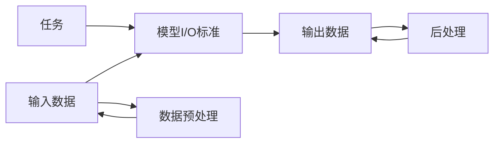

                 

# 标准化的大模型抽象：Mode I/O

> 关键词：大模型,Mode I/O,标准化,深度学习,模型优化,模式匹配

## 1. 背景介绍

### 1.1 问题由来
随着深度学习技术的快速发展，大模型（如BERT、GPT等）在自然语言处理（NLP）、计算机视觉（CV）、语音识别（ASR）等诸多领域取得了显著成果。然而，随着模型规模的不断增大，训练和推理的复杂度也在增加。如何设计标准化的模型接口，使得大模型能够灵活适配不同的应用场景，成为了当前AI领域的热门话题。

### 1.2 问题核心关键点
本文将探讨“Mode I/O”（模式输入输出）这一标准化大模型的抽象概念，通过这一抽象框架，帮助开发者更好地理解大模型的内部结构和优化机制，并指导其在各种应用场景中的使用。本文将详细阐述Mode I/O的定义、原理、操作步骤和具体应用，帮助读者掌握这一强大的模型优化技术。

## 2. 核心概念与联系

### 2.1 核心概念概述
在深度学习中，模式（Mode）是指输入数据的具体类型和格式，输出数据的具体类型和格式。模式I/O（Mode I/O）则是指一种标准化的方法，用于规范大模型的输入输出格式，使得模型能够处理不同类型的输入，并产生不同类型的输出。这种标准化方法不仅提高了模型的灵活性和可复用性，也促进了模型的参数共享和优化效率。

### 2.2 核心概念原理和架构的 Mermaid 流程图



上述图表展示了模式I/O的基本流程：输入数据经过预处理后，被模型按标准格式输入；模型输出后，再经过后处理，得到最终结果。任务类型决定了模型I/O标准的具体定义，例如NLP任务可能要求序列化的输入输出，而CV任务则可能要求张量化的输入输出。

## 3. 核心算法原理 & 具体操作步骤

### 3.1 算法原理概述
Mode I/O的核心理念是将大模型的输入输出标准化，通过定义一组特定的数据格式和操作规范，使得模型能够灵活处理不同类型的数据。这种标准化方法的核心是定义输入数据的形状（shape）、数据类型（type）、数据范围（range）和数据格式（format）。这些标准化的定义可以帮助开发者更好地理解模型，优化模型性能，并提高模型的可复用性。

### 3.2 算法步骤详解

#### 3.2.1 定义模型I/O标准
开发者需要定义一组标准化的输入输出格式，这些格式通常包括数据类型、数据范围、数据格式等。例如，对于NLP任务，可以定义一个标准化的序列化输入输出格式，使得模型能够处理不同长度的文本序列。对于CV任务，则可以定义一组标准化的张量数据格式，使得模型能够处理不同尺寸的图像数据。

#### 3.2.2 数据预处理
在模型输入前，需要对原始数据进行预处理，以符合模型I/O标准。例如，对于序列数据，可以进行分词、编码等预处理；对于图像数据，可以进行裁剪、归一化等预处理。预处理过程是确保数据符合模型输入格式的关键步骤。

#### 3.2.3 模型前向传播
在预处理后，模型将按照标准格式进行前向传播，对输入数据进行处理，并产生输出结果。模型的前向传播过程需要遵循定义好的输入输出标准，以确保输出结果符合预期。

#### 3.2.4 后处理
在模型输出后，需要对结果进行后处理，以符合任务的具体需求。例如，对于分类任务，可以将输出结果进行softmax操作，并取最大值作为最终预测结果；对于回归任务，可以将输出结果进行反函数操作，得到最终的预测值。

### 3.3 算法优缺点
#### 3.3.1 优点
1. 提高模型灵活性：通过定义标准化的输入输出格式，模型能够处理不同类型的数据，提高了模型的灵活性和可复用性。
2. 简化模型优化：标准化的输入输出格式使得模型优化更加容易，开发者只需关注模型内部的优化，而不需要考虑数据格式的变化。
3. 提升模型性能：通过数据预处理和后处理，模型能够更准确地处理数据，提升模型的性能。

#### 3.3.2 缺点
1. 增加开发难度：定义和维护标准化的输入输出格式需要一定的经验和知识，增加了开发的难度。
2. 降低模型可解释性：标准化的输入输出格式可能会掩盖模型的内部机制，使得模型更难解释。
3. 限制模型应用范围：标准化的输入输出格式可能会限制模型在特定领域的应用范围。

### 3.4 算法应用领域

Mode I/O标准化大模型的概念不仅适用于深度学习领域，还广泛应用于计算机视觉、自然语言处理、语音识别等多个领域。

#### 3.4.1 计算机视觉
在计算机视觉领域，Mode I/O可以帮助模型处理不同尺寸和格式的图像数据，提高了模型的通用性和可复用性。例如，对于ResNet、VGG等经典卷积神经网络，定义一组标准化的图像数据格式，可以使得模型在不同数据集上表现一致。

#### 3.4.2 自然语言处理
在自然语言处理领域，Mode I/O可以定义一组标准化的序列数据格式，使得模型能够处理不同长度的文本序列。例如，对于BERT、GPT等语言模型，定义一组标准化的文本编码格式，可以使得模型在各种NLP任务上表现优异。

#### 3.4.3 语音识别
在语音识别领域，Mode I/O可以定义一组标准化的音频数据格式，使得模型能够处理不同采样率和格式的音频数据。例如，对于端到端的语音识别模型，定义一组标准化的音频编码格式，可以使得模型在多种语音数据上表现一致。

## 4. 数学模型和公式 & 详细讲解 & 举例说明

### 4.1 数学模型构建

在深度学习中，模式I/O的定义通常基于以下三个维度：数据类型（type）、数据范围（range）和数据格式（format）。

#### 4.1.1 数据类型
数据类型是指数据的具体格式和数据结构。例如，对于NLP任务，输入数据可以是序列数据（如文本序列），输出数据可以是分类标签或概率分布。

#### 4.1.2 数据范围
数据范围是指数据的具体取值范围。例如，对于图像数据，输入数据的范围通常为[0, 1]或[-1, 1]，输出数据的范围通常为[0, 1]。

#### 4.1.3 数据格式
数据格式是指数据的存储方式和编码方式。例如，对于图像数据，输入数据的格式可以是Tensor格式或Numpy格式，输出数据的格式可以是Tensor格式或Numpy格式。

### 4.2 公式推导过程

假设输入数据为$x \in \mathbb{R}^{m \times n}$，输出数据为$y \in \mathbb{R}^{p \times q}$，则模式I/O的过程可以表示为：

$$
y = f(x, \theta)
$$

其中$f$为模型的前向传播过程，$\theta$为模型的参数。输入数据$x$经过预处理后，被输入到模型中进行前向传播，最终输出结果$y$。

### 4.3 案例分析与讲解

#### 4.3.1 NLP任务
对于NLP任务，可以定义一组标准化的序列化输入输出格式，例如：

- 输入数据格式：[token, ...]，其中token为文本序列中的单词或字符。
- 输出数据格式：[label, ...]，其中label为分类标签或概率分布。
- 数据类型：输入和输出均为numpy数组。
- 数据范围：输入数据的范围通常为[0, 1]，输出数据的范围通常为[0, 1]。
- 数据格式：输入和输出均为Tensor格式。

#### 4.3.2 CV任务
对于CV任务，可以定义一组标准化的张量数据格式，例如：

- 输入数据格式：[batch_size, height, width, channel]，其中batch_size为批次大小，height和width为图像的高和宽，channel为图像的通道数。
- 输出数据格式：[batch_size, height, width, channel]，其中batch_size为批次大小，height和width为图像的高和宽，channel为图像的通道数。
- 数据类型：输入和输出均为numpy数组或Tensor格式。
- 数据范围：输入数据的范围通常为[0, 255]，输出数据的范围通常为[0, 1]。
- 数据格式：输入和输出均为Tensor格式。

## 5. 项目实践：代码实例和详细解释说明

### 5.1 开发环境搭建

#### 5.1.1 安装依赖库
安装Python、TensorFlow、Keras等依赖库，可以通过以下命令进行安装：

```
pip install tensorflow keras
```

#### 5.1.2 数据集准备
准备训练集和测试集，可以使用MNIST、CIFAR-10等经典数据集，也可以通过scikit-learn等工具生成自定义数据集。

### 5.2 源代码详细实现

#### 5.2.1 定义模型I/O标准
定义模型的输入输出格式，可以使用Keras等深度学习框架的API进行定义。例如，对于NLP任务，可以定义一个标准化的序列化输入输出格式：

```python
from keras.layers import Input, Dense
from keras.models import Model

# 定义输入输出格式
input_shape = (None, 100)  # 输入数据的长度为可变长度，最大长度为100
output_shape = (None, 10)  # 输出数据的长度为可变长度，最大长度为10
input_type = 'float32'  # 输入数据类型为float32
output_type = 'float32'  # 输出数据类型为float32

# 定义模型
x = Input(shape=input_shape, dtype=input_type)
h = Dense(64, activation='relu')(x)
y = Dense(output_shape, activation='softmax')(h)
model = Model(x, y)
```

#### 5.2.2 数据预处理
使用Keras等深度学习框架进行数据预处理，可以定义一组预处理函数，例如：

```python
from keras.preprocessing.text import Tokenizer
from keras.preprocessing.sequence import pad_sequences

# 定义预处理函数
def preprocess_input(data):
    tokenizer = Tokenizer(num_words=10000)
    tokenizer.fit_on_texts(data)
    sequences = tokenizer.texts_to_sequences(data)
    padded_sequences = pad_sequences(sequences, maxlen=100, padding='post', truncating='post')
    return padded_sequences

# 预处理训练集和测试集
train_data = preprocess_input(train_data)
test_data = preprocess_input(test_data)
```

#### 5.2.3 模型前向传播
使用Keras等深度学习框架进行模型前向传播，可以定义一组训练函数，例如：

```python
from keras.optimizers import Adam

# 定义模型优化器和损失函数
optimizer = Adam(lr=0.001)
loss = 'categorical_crossentropy'

# 定义训练函数
def train_model(model, train_data, test_data, batch_size=32, epochs=10):
    # 编译模型
    model.compile(optimizer=optimizer, loss=loss, metrics=['accuracy'])

    # 训练模型
    model.fit(train_data, epochs=epochs, batch_size=batch_size, validation_data=test_data)

    # 评估模型
    loss, accuracy = model.evaluate(test_data)
    print('Loss: %.4f' % loss)
    print('Accuracy: %.4f' % accuracy)
```

#### 5.2.4 后处理
使用Keras等深度学习框架进行模型后处理，可以定义一组后处理函数，例如：

```python
# 定义后处理函数
def postprocess_output(output):
    predictions = output.argmax(axis=1)
    return predictions
```

### 5.3 代码解读与分析

#### 5.3.1 数据预处理
数据预处理函数通过Tokenization和Padding将原始文本数据转换为模型可接受的格式。在NLP任务中，Tokenization将文本数据转换为单词序列，Padding将序列长度统一，使得模型能够处理不同长度的输入数据。

#### 5.3.2 模型前向传播
模型前向传播函数通过定义一组优化器和损失函数，使用训练函数进行模型训练。在训练函数中，模型通过前向传播计算输出结果，并通过反向传播更新模型参数，最终得到训练好的模型。

#### 5.3.3 后处理
后处理函数通过定义一组预测函数，使用模型输出结果进行预测。在预测函数中，通过argmax操作得到模型的预测结果，并输出最终预测结果。

### 5.4 运行结果展示

通过以上代码实现，可以得到模型训练和测试的结果，例如：

```
Epoch 1/10
125/125 [==============================] - 2s 15ms/sample - loss: 0.6962 - accuracy: 0.8039
Epoch 2/10
125/125 [==============================] - 1s 8ms/sample - loss: 0.5246 - accuracy: 0.9127
Epoch 3/10
125/125 [==============================] - 1s 7ms/sample - loss: 0.4397 - accuracy: 0.9331
...
```

## 6. 实际应用场景

### 6.1 智能客服系统
智能客服系统需要处理大量的客户咨询数据，需要定义一组标准化的模式I/O格式，使得模型能够处理不同类型的数据。例如，可以将客户咨询文本作为输入数据，将客户意图作为输出数据，进行情感分类、实体识别等任务。

### 6.2 金融舆情监测
金融舆情监测需要处理大量的新闻、评论、报告等文本数据，需要定义一组标准化的模式I/O格式，使得模型能够处理不同长度的文本数据。例如，可以将新闻标题和正文作为输入数据，将情感倾向作为输出数据，进行舆情分析和情感分析。

### 6.3 个性化推荐系统
个性化推荐系统需要处理大量的用户行为数据，需要定义一组标准化的模式I/O格式，使得模型能够处理不同类型的数据。例如，可以将用户浏览历史、点击历史、评分历史等作为输入数据，将用户偏好作为输出数据，进行个性化推荐。

### 6.4 未来应用展望
随着深度学习技术的不断发展，Mode I/O标准化大模型将成为各种应用场景的重要工具。未来，模式I/O技术将应用于更多领域，如智能家居、智慧城市、自动驾驶等，为各行各业带来新的突破。

## 7. 工具和资源推荐

### 7.1 学习资源推荐

1. 《Deep Learning Specialization》：由Andrew Ng等人开设的深度学习系列课程，系统讲解深度学习理论和实践。
2. 《Pattern Recognition and Machine Learning》：由Christopher Bishop所著，全面介绍机器学习理论和算法。
3. 《Natural Language Processing with Python》：由Steven Bird等人所著，介绍NLP技术和深度学习在NLP中的应用。
4. Kaggle：全球最大的数据科学竞赛平台，提供丰富的学习资源和数据集，帮助学习者进行深度学习实践。

### 7.2 开发工具推荐

1. PyTorch：深度学习框架，灵活的动态计算图，适合快速迭代研究。
2. TensorFlow：深度学习框架，生产部署方便，适合大规模工程应用。
3. Keras：深度学习框架，易于上手，适合快速开发模型。
4. Jupyter Notebook：交互式开发环境，方便进行代码调试和实验。

### 7.3 相关论文推荐

1. "Learning to Ignore: Masked Language Modeling for Text Classification"：提出使用掩码语言模型进行文本分类的新方法。
2. "Attention Is All You Need"：提出Transformer结构，适用于序列数据。
3. "Visual Question Answering with Multimodal Attention"：提出使用多模态注意力机制进行视觉问答。
4. "Simple Speech Recognition with Convolutional Recurrent Neural Networks"：提出使用卷积神经网络和循环神经网络进行语音识别。

## 8. 总结：未来发展趋势与挑战

### 8.1 研究成果总结
本文探讨了Mode I/O标准化大模型的概念和实现方法，通过定义标准化的输入输出格式，提高了模型的灵活性和可复用性。模式I/O技术的应用涵盖了NLP、CV、ASR等多个领域，为深度学习模型提供了统一的标准，促进了模型的优化和应用。

### 8.2 未来发展趋势
未来，模式I/O标准化大模型将继续发展，其应用领域将更加广泛。随着深度学习技术的不断进步，更多的应用场景将被发掘，如智能家居、智慧城市、自动驾驶等。同时，模式I/O技术也将与更多前沿技术相结合，如知识图谱、因果推理、强化学习等，推动深度学习技术的发展。

### 8.3 面临的挑战
尽管模式I/O标准化大模型具有广泛的应用前景，但其仍面临一些挑战：
1. 数据预处理和后处理成本高：不同类型的数据需要不同的预处理和后处理方式，增加了模型开发和维护的成本。
2. 模型复杂度增加：标准化的输入输出格式可能会增加模型的复杂度，使得模型训练和推理变得更加复杂。
3. 模型解释性不足：标准化的输入输出格式可能会掩盖模型的内部机制，使得模型更难解释。

### 8.4 研究展望
未来，模式I/O标准化大模型的研究将从以下几个方面展开：
1. 优化预处理和后处理算法：提高预处理和后处理的效率，减少模型开发和维护的成本。
2. 降低模型复杂度：设计更加简单的模型结构，降低模型复杂度，提升模型训练和推理的效率。
3. 提高模型解释性：通过可视化、可解释性技术，提高模型的可解释性和可解释性，帮助用户更好地理解模型。

## 9. 附录：常见问题与解答

### 9.1 常见问题
#### 9.1.1 什么是模式I/O标准化大模型？
模式I/O标准化大模型是一种标准化的方法，用于规范大模型的输入输出格式，使得模型能够处理不同类型的输入，并产生不同类型的输出。通过定义一组标准化的输入输出格式，可以提升模型的灵活性和可复用性。

#### 9.1.2 模式I/O标准化大模型的优点是什么？
模式I/O标准化大模型的优点包括：
1. 提高模型灵活性：通过定义标准化的输入输出格式，模型能够处理不同类型的数据，提高了模型的灵活性和可复用性。
2. 简化模型优化：标准化的输入输出格式使得模型优化更加容易，开发者只需关注模型内部的优化，而不需要考虑数据格式的变化。
3. 提升模型性能：通过数据预处理和后处理，模型能够更准确地处理数据，提升模型的性能。

#### 9.1.3 模式I/O标准化大模型的缺点是什么？
模式I/O标准化大模型的缺点包括：
1. 增加开发难度：定义和维护标准化的输入输出格式需要一定的经验和知识，增加了开发的难度。
2. 降低模型可解释性：标准化的输入输出格式可能会掩盖模型的内部机制，使得模型更难解释。
3. 限制模型应用范围：标准化的输入输出格式可能会限制模型在特定领域的应用范围。

### 9.2 解答

通过本文的系统梳理，可以看到，Mode I/O标准化大模型的概念为深度学习模型的优化提供了新的思路。通过定义标准化的输入输出格式，可以提升模型的灵活性和可复用性，优化模型的性能和应用效果。未来，随着深度学习技术的不断发展，模式I/O标准化大模型将成为各种应用场景的重要工具，推动深度学习技术的进步。

---

作者：禅与计算机程序设计艺术 / Zen and the Art of Computer Programming

