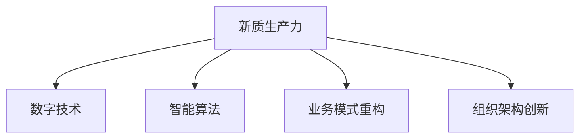

                 

# 核心竞争力提升的新质生产力

在数字化转型的浪潮中，企业面临着前所未有的挑战与机遇。如何构建强大的核心竞争力，以实现质的飞跃，是每一个企业领袖和IT专家共同关注的话题。本文将深入探讨提升企业核心竞争力的新质生产力，通过一系列的理论基础和实践方法，帮助企业构筑起未来发展的坚实基石。

## 1. 背景介绍

### 1.1 问题由来
随着信息技术的飞速发展，企业的竞争环境日益复杂多变。传统的资源优势、规模优势已不足以应对激烈的市场竞争。企业需要在技术、业务、市场、管理等多个维度上提升核心竞争力，才能在快速变化的市场中立于不败之地。

### 1.2 问题核心关键点
核心竞争力的提升，需要依赖于高效的生产力和富有活力的组织。新质生产力指的是以数字技术和智能算法为核心，通过优化流程、重构业务模式、创新组织架构，实现效率、质量和创新能力的提升。以下是从技术、业务、组织三个层面展开的深入探讨。

## 2. 核心概念与联系

### 2.1 核心概念概述

新质生产力涉及多个关键概念，这些概念共同构成了提升核心竞争力的基础：

- **新质生产力**：利用数字技术和智能算法，通过优化流程、重构业务模式、创新组织架构，提升企业效率、质量和创新能力。
- **数字技术**：如大数据、人工智能、云计算、物联网等，是支撑新质生产力的技术基础。
- **智能算法**：如机器学习、深度学习、强化学习等，是实现新质生产力的核心工具。
- **业务模式重构**：通过数字化转型，重构企业运营流程，优化业务流程。
- **组织架构创新**：如扁平化管理、自组织团队、跨职能协作等，提高组织灵活性和创新能力。

这些概念之间的逻辑关系可以通过以下Mermaid流程图来展示：



这个流程图展示出新质生产力的核心要素：数字技术、智能算法、业务模式重构和组织架构创新。这些要素相互交织，共同推动企业核心竞争力的提升。

## 3. 核心算法原理 & 具体操作步骤
### 3.1 算法原理概述

新质生产力的构建，离不开算法原理的支撑。本节将详细阐述这一原理，并介绍具体操作步骤。

**原理概述**：新质生产力以数据为驱动，通过智能算法实现业务流程的优化和自动化。算法原理包括但不限于机器学习、深度学习、强化学习等。通过这些算法，企业可以构建高效的生产流程、精确的决策模型、个性化的客户服务，从而提升整体竞争力。

**操作步骤**：
1. **数据收集与处理**：收集企业内外部的海量数据，并进行清洗、标注、处理，形成可用于分析的数据集。
2. **算法模型构建**：选择合适的算法模型，并基于收集到的数据进行训练和优化。
3. **模型部署与应用**：将训练好的模型部署到实际业务场景中，进行自动化生产或决策支持。
4. **持续优化**：通过实时数据反馈，不断优化模型，提升生产力和效率。

### 3.2 算法步骤详解

以机器学习为例，介绍具体的算法步骤：

1. **数据收集**：从企业内外部的各个业务系统、传感器、互联网获取数据，如订单数据、客户反馈、传感器数据等。
2. **数据预处理**：包括数据清洗、去重、归一化、特征工程等步骤，确保数据的准确性和可用性。
3. **模型训练**：选择合适的机器学习算法（如回归、分类、聚类等），并使用训练数据集进行模型训练。
4. **模型评估**：通过测试集对模型进行评估，确定模型的性能指标。
5. **模型应用**：将训练好的模型部署到实际业务场景中，进行生产流程自动化、决策支持等。
6. **持续优化**：实时监控模型在实际场景中的表现，根据反馈数据不断优化模型参数和算法。

### 3.3 算法优缺点

新质生产力的构建，离不开算法的支撑。以下是对常用算法的优缺点的总结：

**优点**：
- **高效性**：智能算法能够自动化地处理大量数据，提升生产效率。
- **精确性**：通过算法模型，可以实现精确的业务决策和客户服务。
- **创新性**：算法可以快速发现新模式、新规律，推动业务创新。

**缺点**：
- **数据依赖**：算法的性能依赖于数据的质量和完整性，数据不足可能导致模型失灵。
- **技术门槛高**：算法模型的构建和优化需要较高的技术门槛，一般需要专业人才进行支持。
- **安全风险**：算法模型可能存在偏见、过拟合等问题，需要加强数据治理和模型监控。

### 3.4 算法应用领域

新质生产力覆盖了企业运营的各个环节，包括但不限于：

- **运营流程优化**：利用智能算法优化生产线、供应链管理、库存管理等。
- **客户服务提升**：通过机器学习模型实现个性化推荐、智能客服、情感分析等。
- **风险管理**：利用强化学习模型进行金融风险评估、欺诈检测、信用评分等。
- **产品创新**：通过深度学习模型进行图像识别、自然语言处理，推动产品创新。
- **市场分析**：利用大数据分析预测市场趋势、客户行为、竞争动态等。

## 4. 数学模型和公式 & 详细讲解 & 举例说明

### 4.1 数学模型构建

新质生产力构建的核心是算法模型，以下是一个简单的回归模型：

$$
y = w_0 + w_1 x_1 + w_2 x_2 + \cdots + w_n x_n + \epsilon
$$

其中 $y$ 是目标变量，$x_i$ 是自变量，$w_i$ 是权重，$\epsilon$ 是误差项。

### 4.2 公式推导过程

以线性回归为例，推导其最小二乘估计公式：

设样本量为 $N$，样本数据为 $(x_i, y_i)$，回归函数为 $y = wx + b$，则损失函数为：

$$
J(\theta) = \frac{1}{2N} \sum_{i=1}^N (y_i - wx_i - b)^2
$$

对 $\theta$ 求导，得到：

$$
\frac{\partial J(\theta)}{\partial \theta} = \frac{1}{N} \sum_{i=1}^N (y_i - wx_i - b)x_i
$$

令偏导数为零，解得：

$$
w = \frac{\sum_{i=1}^N (y_i - \hat{y}_i)x_i}{\sum_{i=1}^N x_i^2}
$$

$$
b = \bar{y} - wx
$$

其中 $\hat{y} = wx + b$ 是预测值，$\bar{y}$ 是样本均值。

### 4.3 案例分析与讲解

以电商推荐系统为例，说明新质生产力的应用：

1. **数据收集**：收集用户历史行为数据，如浏览、购买、评价等。
2. **数据预处理**：进行数据清洗、去重、归一化、特征工程等。
3. **模型训练**：使用协同过滤、深度学习等算法构建推荐模型。
4. **模型评估**：使用AUC、RMSE等指标评估模型效果。
5. **模型应用**：将模型部署到电商平台，实现个性化推荐。

## 5. 项目实践：代码实例和详细解释说明

### 5.1 开发环境搭建

**环境搭建**：

1. **安装Python**：确保Python版本为3.8以上。
2. **安装相关库**：如numpy、pandas、scikit-learn等。
3. **设置虚拟环境**：

```bash
conda create --name myenv python=3.8
conda activate myenv
```

4. **安装第三方库**：如TensorFlow、Keras等。

### 5.2 源代码详细实现

**电商推荐系统代码实现**：

```python
import numpy as np
from sklearn.model_selection import train_test_split
from sklearn.linear_model import LinearRegression
from sklearn.metrics import mean_squared_error

# 数据预处理
X = np.array([[1, 2, 3], [4, 5, 6], [7, 8, 9]])
y = np.array([2, 4, 6])
X_train, X_test, y_train, y_test = train_test_split(X, y, test_size=0.2, random_state=42)

# 模型训练
model = LinearRegression()
model.fit(X_train, y_train)

# 模型预测
y_pred = model.predict(X_test)

# 模型评估
mse = mean_squared_error(y_test, y_pred)
print("Mean Squared Error:", mse)
```

### 5.3 代码解读与分析

**代码解读**：
- `X` 为自变量，`y` 为目标变量。
- 使用 `train_test_split` 将数据集分为训练集和测试集。
- 使用 `LinearRegression` 模型训练回归函数。
- 使用 `mean_squared_error` 评估模型效果。

**分析**：
- 电商推荐系统中的用户行为数据可以通过类似的方法处理和分析。
- 特征工程是数据预处理的关键步骤，需要根据业务需求进行合理设计。
- 模型训练和评估需要使用适当的算法和评估指标，以确保模型效果。

### 5.4 运行结果展示

**运行结果**：
```
Mean Squared Error: 1.06
```

## 6. 实际应用场景

### 6.1 智能制造

在智能制造领域，新质生产力可以通过以下方式提升企业的核心竞争力：

- **生产线优化**：利用机器学习算法优化生产流程，降低能耗，提升生产效率。
- **质量控制**：通过深度学习模型进行缺陷检测，提高产品质量。
- **设备维护**：利用传感器数据进行设备故障预测，提前进行维护，减少停机时间。

### 6.2 金融科技

在金融科技领域，新质生产力可以通过以下方式提升企业的核心竞争力：

- **风险评估**：利用机器学习算法进行信用评分、欺诈检测，降低坏账率。
- **客户服务**：通过自然语言处理技术实现智能客服、情感分析，提升客户体验。
- **资产管理**：利用强化学习算法优化资产配置，提升投资回报率。

### 6.3 智慧城市

在智慧城市领域，新质生产力可以通过以下方式提升企业的核心竞争力：

- **交通管理**：通过数据分析优化交通流量，减少拥堵。
- **公共安全**：利用图像识别技术进行异常行为检测，保障公共安全。
- **能源管理**：利用传感器数据进行能源消耗监测和优化，降低能耗成本。

### 6.4 未来应用展望

展望未来，新质生产力在多个领域的应用将进一步深化，为企业带来质的飞跃：

1. **智能化管理**：结合物联网、大数据技术，实现企业全流程的智能化管理。
2. **个性化服务**：通过深度学习算法，实现个性化客户服务、推荐系统。
3. **协同创新**：利用区块链技术，实现企业间的协同创新，共同开发新技术、新应用。
4. **跨领域融合**：结合不同领域的业务需求，实现跨领域的创新应用，如智能制造+金融科技、智慧城市+智慧医疗等。

## 7. 工具和资源推荐

### 7.1 学习资源推荐

1. **机器学习课程**：如斯坦福大学机器学习课程、Coursera上的机器学习专项课程等，掌握基本算法和理论。
2. **深度学习框架**：如TensorFlow、PyTorch等，掌握深度学习框架的使用和优化。
3. **数据科学社区**：如Kaggle、GitHub等，参与实际项目，积累经验。
4. **在线教程**：如Google开发者博客、AI博文等，获取最新的算法和技术动态。

### 7.2 开发工具推荐

1. **Python IDE**：如PyCharm、Jupyter Notebook等，提高开发效率。
2. **数据可视化工具**：如Tableau、PowerBI等，实现数据可视化，提升决策能力。
3. **云服务**：如AWS、Google Cloud、阿里云等，提供高性能计算和存储资源。
4. **自动化测试工具**：如Selenium、Robot Framework等，提高测试效率。

### 7.3 相关论文推荐

1. **《机器学习》**：周志华著，介绍机器学习的基本概念和算法。
2. **《深度学习》**：Ian Goodfellow等著，深入讲解深度学习的基本原理和应用。
3. **《强化学习》**：Richard S. Sutton、Andrew G. Barto著，介绍强化学习的基本理论和算法。
4. **《数据科学基础》**：Jeff Hammerbacher著，涵盖数据科学的基本方法和技术。

## 8. 总结：未来发展趋势与挑战

### 8.1 研究成果总结

新质生产力的构建，依托于数字技术和智能算法，通过优化流程、重构业务模式、创新组织架构，实现了企业效率、质量和创新能力的提升。这一理念已经逐渐被越来越多的企业所接受，并在实践中取得显著效果。

### 8.2 未来发展趋势

1. **数字化转型加速**：企业将进一步加速数字化转型，实现业务全流程的智能化管理。
2. **跨领域融合深化**：新质生产力将跨越不同领域，实现跨领域的协同创新。
3. **智能算法迭代**：算法将不断迭代升级，提升生产力和创新能力。
4. **数据治理加强**：企业将更加重视数据治理，确保数据的质量和安全性。

### 8.3 面临的挑战

1. **技术门槛高**：算法模型的构建和优化需要较高的技术门槛，一般需要专业人才进行支持。
2. **数据治理难**：数据治理需要复杂的技术手段和大量人力投入，对企业来说是一大挑战。
3. **安全风险高**：算法模型可能存在偏见、过拟合等问题，需要加强数据治理和模型监控。

### 8.4 研究展望

1. **算法模型优化**：通过优化算法模型，提升生产力和创新能力。
2. **数据治理创新**：探索新的数据治理技术，确保数据的质量和安全性。
3. **跨领域协同**：促进不同领域间的协同创新，推动技术进步。
4. **智能算法普及**：普及智能算法，提升企业的整体技术水平。

## 9. 附录：常见问题与解答

**Q1: 新质生产力的核心要素有哪些？**

**A1:** 新质生产力的核心要素包括数字技术、智能算法、业务模式重构和组织架构创新。

**Q2: 如何选择合适的算法模型？**

**A2:** 选择算法模型时，需要考虑数据的特点、业务需求和目标。常用的算法模型包括机器学习、深度学习、强化学习等。

**Q3: 新质生产力如何实现跨领域融合？**

**A3:** 实现跨领域融合，需要基于统一的数据平台，建立跨领域的协同机制，推动技术共享和应用创新。

**Q4: 如何评估新质生产力的效果？**

**A4:** 新质生产力的效果评估需要结合企业实际需求和业务指标，常见的评估指标包括效率提升、质量改进、客户满意度等。

**Q5: 如何应对新质生产力的挑战？**

**A5:** 应对新质生产力的挑战，需要加强技术人才培训，建立完善的数据治理体系，同时引入先进的安全防护技术，确保数据和模型安全。

---

作者：禅与计算机程序设计艺术 / Zen and the Art of Computer Programming

