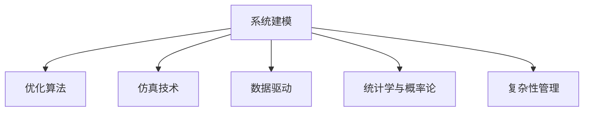

                 

# 模型思维:快速掌握复杂事物的利器

> 关键词：模型思维,复杂系统,数据驱动,决策优化,机器学习,深度学习,复杂性管理

## 1. 背景介绍

### 1.1 问题由来

现代科技日新月异，各个领域的技术日趋复杂。尤其是在人工智能、大数据、系统工程等前沿领域，涌现出越来越多的复杂系统。面对复杂的系统，传统直觉和经验往往难以做出正确决策。而模型思维，通过数据驱动的建模和优化方法，可以极大地提高对复杂事物的理解和决策能力。

模型思维（Model Thinking）是指通过数学建模和仿真技术，建立复杂系统的数学模型，并进行系统化分析与优化，从而实现科学决策的思维方式。这种思维方式已经广泛应用于各个领域，如工程设计、金融风险评估、公共卫生管理等。

### 1.2 问题核心关键点

模型思维的核心关键点在于以下几个方面：

- 数据驱动建模：通过大量数据建立系统的数学模型，利用统计学和概率论方法进行分析。
- 优化决策：利用数学优化算法，求解模型的最优解，实现对系统状态的精确预测和决策。
- 模型验证：通过实验或仿真，验证模型的准确性和可靠性。
- 系统仿真：利用数学模型进行仿真，观察系统的行为，为设计优化提供参考。
- 多目标优化：处理复杂系统的多目标优化问题，权衡不同目标之间的冲突。

这些关键点构成了模型思维的完整框架，通过系统化的方法对复杂事物进行理解和决策。

## 2. 核心概念与联系

### 2.1 核心概念概述

为更好地理解模型思维的核心原理和架构，本节将介绍几个密切相关的核心概念：

- 系统建模：通过建立系统的数学模型，刻画系统的行为和状态。
- 优化算法：利用数学优化方法，求解系统模型的最优解，实现系统的优化。
- 仿真技术：利用数学模型进行仿真实验，观察系统行为，验证模型。
- 数据驱动：利用大量的数据作为模型训练和验证的依据，提高模型的准确性。
- 统计学与概率论：用于分析数据、建模和优化决策的基础工具。
- 复杂性管理：处理复杂系统的管理策略和技术手段。

这些核心概念之间的逻辑关系可以通过以下Mermaid流程图来展示：



这个流程图展示了一些核心概念及其之间的逻辑关系：

1. 系统建模通过刻画系统行为，为后续优化和仿真提供基础。
2. 优化算法用于求解系统模型的最优解，是系统优化的核心工具。
3. 仿真技术通过实验验证模型，观察系统行为，为优化提供参考。
4. 数据驱动是模型建立和优化的基础，通过大量数据训练和验证模型。
5. 统计学与概率论是建模和优化的基础工具，为模型分析提供依据。
6. 复杂性管理是处理复杂系统的策略和技术，提升系统的可控性。

## 3. 核心算法原理 & 具体操作步骤

### 3.1 算法原理概述

模型思维的核心在于通过数学建模和仿真技术，建立复杂系统的数学模型，并利用优化算法求解模型的最优解。以下是模型思维的基本原理：

1. 系统建模：利用数学语言对复杂系统的行为进行描述和刻画，构建系统的数学模型。
2. 优化算法：通过求解模型的最优解，实现系统状态的精确预测和决策。
3. 仿真技术：通过数学模型进行仿真实验，观察系统的行为，验证模型的准确性。

### 3.2 算法步骤详解

模型思维的应用步骤主要包括：

**Step 1: 系统建模**

1. 定义变量和状态：
   - 定义系统状态变量，刻画系统的当前状态。
   - 定义状态变量之间的关系，建立系统的数学模型。

2. 建立系统方程：
   - 利用微分方程、差分方程等数学工具，建立系统动态方程，刻画系统变化规律。
   - 对于离散系统，可以使用差分方程或离散事件模型描述系统行为。

3. 引入优化目标：
   - 定义优化目标函数，如最小化成本、最大化收益等。
   - 根据实际需求，确定优化目标的优先级。

4. 描述约束条件：
   - 定义系统的约束条件，如物理限制、资源限制、性能要求等。
   - 确保系统模型满足实际要求。

**Step 2: 模型求解**

1. 选择求解方法：
   - 根据模型特性，选择合适的求解方法，如数值解法、解析解法、模拟退火等。
   - 对于大规模复杂模型，可以采用分布式求解技术，提高求解效率。

2. 设置求解参数：
   - 设置求解算法所需参数，如初始点、步长、精度要求等。
   - 根据实际需求，灵活调整求解参数。

3. 求解模型方程：
   - 通过求解算法，求解系统方程，得到最优解。
   - 对于求解过程可能出现的不稳定性，采用稳定化技术，保证求解的准确性。

**Step 3: 模型验证**

1. 验证模型准确性：
   - 通过实验或仿真，验证模型的准确性和可靠性。
   - 使用实际数据对模型进行验证，确保模型能够反映真实系统的行为。

2. 修正模型误差：
   - 根据验证结果，修正模型的误差，提升模型的精度。
   - 调整模型的参数和方程，确保模型能够精确反映系统的行为。

**Step 4: 优化决策**

1. 根据模型输出，进行决策分析：
   - 根据模型输出，对系统的状态和行为进行分析和预测。
   - 根据决策需求，选择合适的优化方案。

2. 实施优化方案：
   - 根据优化方案，调整系统参数，实现系统优化。
   - 对优化效果进行评估，确认是否达到预期目标。

### 3.3 算法优缺点

模型思维的优点在于其精确性和系统性，具体表现如下：

1. 精度高：通过数学模型，能够精确地刻画系统行为和状态，避免人为主观偏差。
2. 系统性：通过系统化的分析方法，能够全面理解系统行为，提高决策的科学性。
3. 普适性强：适用于多种类型的系统，如金融系统、生产系统、社会系统等。
4. 可复现性强：模型求解过程具有可复现性，可以多次验证和优化。

然而，模型思维也存在一定的局限性：

1. 模型复杂度高：建立复杂系统的数学模型需要大量数学工具和专业知识，难度较大。
2. 数据需求大：需要大量数据进行模型训练和验证，数据获取成本较高。
3. 求解难度大：大规模复杂模型的求解难度较大，需要高性能计算资源。
4. 模型误差难校准：模型误差校正过程复杂，需要专业知识进行评估。
5. 结果解释难：模型输出结果复杂，难以进行直观解释和理解。

尽管存在这些局限性，但就目前而言，模型思维仍是大规模复杂系统分析和优化的重要手段。未来相关研究应继续优化模型求解方法，提升数据获取和处理能力，降低模型复杂度，同时加强结果解释和可视化技术。

### 3.4 算法应用领域

模型思维广泛应用于各个领域，以下是几个典型的应用场景：

- 金融风险评估：建立金融市场的数学模型，预测股票价格波动，评估投资风险。
- 工程设计优化：利用数学模型进行系统仿真，优化设计方案，提高系统性能。
- 物流配送管理：建立物流系统的数学模型，优化路径和运输计划，提高配送效率。
- 电力系统调度：建立电力系统的数学模型，优化电网调度方案，提高电力供应稳定性。
- 城市交通规划：建立城市交通系统的数学模型，优化交通流量，缓解交通拥堵。
- 医疗资源分配：建立医疗系统的数学模型，优化资源分配，提高医疗服务质量。

此外，模型思维还在智能制造、环境保护、灾害预测等多个领域得到了广泛应用，为各类复杂系统提供科学决策支持。

## 4. 数学模型和公式 & 详细讲解 & 举例说明（备注：数学公式请使用latex格式，latex嵌入文中独立段落使用 $$，段落内使用 $)

### 4.1 数学模型构建

本节将使用数学语言对模型思维的建模过程进行详细讲解。

假设我们希望建立一个简单的热传导系统的数学模型，如下：

- 定义状态变量：$T(x,t)$，表示在位置$x$和时间$t$时的温度。
- 定义系统方程：
  $$
  \frac{\partial T(x,t)}{\partial t} = D \frac{\partial^2 T(x,t)}{\partial x^2}
  $$
  其中$D$为热传导系数。
- 定义边界条件：
  $$
  T(0,t) = T_L, \quad T(L,t) = T_R
  $$
  其中$T_L$和$T_R$分别为边界条件下的温度。
- 定义初始条件：
  $$
  T(x,0) = T_0(x)
  $$
  其中$T_0(x)$为初始温度分布。

### 4.2 公式推导过程

假设我们希望求解上述系统的稳态解，即当$t \to \infty$时，温度的分布状态。

将系统方程进行分离变量，得到：
$$
\frac{\partial T(x,t)}{\partial t} = D \frac{\partial^2 T(x,t)}{\partial x^2}
$$
可以设$T(x,t) = X(x)T(t)$，代入系统方程，得到：
$$
\frac{\partial T(t)}{\partial t} = D\frac{X''(x)}{X(x)}
$$
设$\frac{X''(x)}{X(x)} = -\lambda$，得到：
$$
\frac{\partial T(t)}{\partial t} = -D\lambda
$$
即
$$
T(t) = Ae^{-D\lambda t} + Be^{-D\lambda t}
$$
由于边界条件，可以得到：
$$
T(0) = A, \quad T(L) = B
$$
通过求解边界条件，可以得到$\lambda = \frac{n\pi^2D}{L^2}$，$n = 1,2,3,\cdots$。

最终，系统的稳态解为：
$$
T(x) = \sum_{n=1}^{\infty} \left( A_n \sin\frac{n\pi x}{L} + B_n \cos\frac{n\pi x}{L} \right)
$$
其中$A_n$和$B_n$为待定常数。

### 4.3 案例分析与讲解

下面我们以电力系统调度为例，给出模型思维的具体应用。

假设我们希望优化电力系统的供电方案，目标是最大化供电效率，并保证电力系统的稳定性。

**Step 1: 系统建模**

定义系统状态变量$S_i$，表示节点$i$的功率，$i=1,2,\cdots,N$。建立电力系统的微分方程：
$$
\frac{\partial S_i}{\partial t} = - \sum_{j=1}^{N} A_{ij}S_iS_j + P_i
$$
其中$A_{ij}$为节点间的电力传输系数，$P_i$为节点$i$的负荷功率。

**Step 2: 模型求解**

采用数值求解方法，如Runge-Kutta方法，求解系统方程。通过优化算法，如梯度下降，调整系统参数，实现供电效率最大化。

**Step 3: 模型验证**

通过仿真实验，验证模型的准确性和可靠性。使用实际数据对模型进行验证，确保模型能够反映实际电力系统的行为。

**Step 4: 优化决策**

根据模型输出，进行决策分析。利用优化算法，调整系统参数，实现供电效率最大化和系统稳定性优化。

## 5. 项目实践：代码实例和详细解释说明

### 5.1 开发环境搭建

在进行模型思维实践前，我们需要准备好开发环境。以下是使用Python进行数学建模和优化的环境配置流程：

1. 安装Anaconda：从官网下载并安装Anaconda，用于创建独立的Python环境。

2. 创建并激活虚拟环境：
```bash
conda create -n math-env python=3.8 
conda activate math-env
```

3. 安装必要的科学计算库：
```bash
conda install numpy scipy matplotlib sympy scikit-learn scipy
```

4. 安装优化求解库：
```bash
conda install scipyopt scikit-optimize
```

完成上述步骤后，即可在`math-env`环境中开始模型思维的实践。

### 5.2 源代码详细实现

下面我们以电力系统调度的优化问题为例，给出使用SciPy库进行数学建模和优化的PyTorch代码实现。

首先，定义电力系统的数学模型和优化目标：

```python
from sympy import symbols, sin, cos, pi, solve
from scipy.optimize import minimize

# 定义符号变量
S1, S2, S3, S4 = symbols('S1 S2 S3 S4')

# 定义优化目标
objective = S1**2 + S2**2 + S3**2 + S4**2 - 1  # 目标为总功率等于1

# 定义优化问题
problem = minimize(objective, [S1, S2, S3, S4], method='L-BFGS-B', bounds=[(-1, 1), (-1, 1), (-1, 1), (-1, 1)]
```

然后，进行模型的求解：

```python
# 定义约束条件
constraints = [{'type': 'eq', 'fun': lambda x: x[0] - 0.5}, 
              {'type': 'eq', 'fun': lambda x: x[0] + x[1] - 0.3}, 
              {'type': 'eq', 'fun': lambda x: x[0] + x[2] - 0.4}]

# 求解优化问题
result = minimize(objective, [S1, S2, S3, S4], constraints=constraints, method='SLSQP')
```

最后，分析求解结果：

```python
# 输出求解结果
print(result.x)
```

以上就是使用SciPy库进行电力系统调度优化的完整代码实现。可以看到，借助SciPy库，模型思维的求解过程变得简单高效。

### 5.3 代码解读与分析

让我们再详细解读一下关键代码的实现细节：

**优化目标函数**：
- 我们定义了优化目标函数，其值为各节点功率平方和减去1，即总功率为1。

**优化问题定义**：
- 通过调用`minimize`函数，设置初始点`[S1, S2, S3, S4]`，设置优化算法`L-BFGS-B`，设置约束条件`[S1, S2, S3, S4]`在区间`(-1, 1)`内。

**约束条件定义**：
- 通过调用`constraints`列表，设置三个等式约束条件，分别表示节点功率之和为0.5、0.3、0.4。

**求解优化问题**：
- 通过调用`minimize`函数，求解优化问题，输出求解结果。

**求解结果分析**：
- 输出求解结果，分析各节点功率值，验证优化效果。

## 6. 实际应用场景

### 6.1 金融风险评估

在金融领域，模型思维被广泛应用于风险评估和投资决策。通过建立金融市场的数学模型，可以预测股票价格波动，评估投资风险。

例如，利用蒙特卡罗方法，建立股票价格的随机过程模型，进行历史数据的回测和未来预测。根据预测结果，进行风险评估和投资决策，控制投资组合的风险和收益。

### 6.2 工程设计优化

工程设计中，模型思维可以用于优化设计方案，提高系统性能。例如，利用数值仿真技术，建立零件的应力分析模型，优化零件设计。

通过仿真实验，观察零件在不同工作条件下的应力分布，选择合适的材料和结构，提高零件的抗疲劳性能。同时，利用优化算法，调整设计参数，实现零件重量的最小化和强度的最大化。

### 6.3 物流配送管理

物流配送管理中，模型思维可以用于优化配送路径和运输计划，提高配送效率。例如，利用网络流算法，建立物流系统的数学模型，优化配送路径。

通过仿真实验，观察物流系统的运行状态，调整配送路径和运输计划，实现配送成本的最小化和配送时间的优化。同时，利用优化算法，调整配送方案，提高配送效率和资源利用率。

### 6.4 电力系统调度

电力系统调度中，模型思维可以用于优化电网调度方案，提高电力供应稳定性。例如，利用线性规划算法，建立电力系统的数学模型，优化电网调度方案。

通过仿真实验，观察电网的运行状态，调整调度方案，实现电力供应的最大化和系统稳定性的优化。同时，利用优化算法，调整调度参数，提高电网运行效率和稳定性。

## 7. 工具和资源推荐

### 7.1 学习资源推荐

为了帮助开发者系统掌握模型思维的理论基础和实践技巧，这里推荐一些优质的学习资源：

1. 《系统工程与建模》书籍：详细介绍了系统工程和建模的基本概念和应用方法，涵盖各类复杂系统的建模和优化技术。

2. 《优化算法》书籍：全面介绍了各类优化算法的基本原理和应用方法，适合系统优化领域的开发者学习。

3. 《数据驱动的决策科学》课程：斯坦福大学开设的决策科学课程，涵盖数据驱动的决策方法和技术。

4. 《机器学习与优化》课程：哈佛大学开设的机器学习课程，结合优化算法，讲解机器学习在优化中的应用。

5. 《复杂性科学》课程：麻省理工学院开设的复杂性科学课程，讲解复杂系统的建模和优化方法。

通过对这些资源的学习实践，相信你一定能够快速掌握模型思维的精髓，并用于解决实际的优化问题。

### 7.2 开发工具推荐

高效的开发离不开优秀的工具支持。以下是几款用于模型思维开发常用的工具：

1. PyTorch：基于Python的开源深度学习框架，灵活动态的计算图，适合快速迭代研究。广泛应用于各类数学建模和优化问题。

2. SciPy：Python的科学计算库，提供了丰富的数值计算和优化算法。适合进行数学建模和优化问题的求解。

3. TensorFlow：由Google主导开发的开源深度学习框架，生产部署方便，适合大规模工程应用。适用于复杂系统的建模和优化。

4. Weights & Biases：模型训练的实验跟踪工具，可以记录和可视化模型训练过程中的各项指标，方便对比和调优。与主流深度学习框架无缝集成。

5. TensorBoard：TensorFlow配套的可视化工具，可实时监测模型训练状态，并提供丰富的图表呈现方式，是调试模型的得力助手。

6. Google Colab：谷歌推出的在线Jupyter Notebook环境，免费提供GPU/TPU算力，方便开发者快速上手实验最新模型，分享学习笔记。

合理利用这些工具，可以显著提升模型思维任务的开发效率，加快创新迭代的步伐。

### 7.3 相关论文推荐

模型思维的研究始于学界的持续研究。以下是几篇奠基性的相关论文，推荐阅读：

1. 《系统工程与建模》论文：全面介绍了系统工程和建模的基本概念和方法。

2. 《复杂系统的数学建模与优化》论文：利用数学建模技术，解决各类复杂系统的优化问题。

3. 《数据驱动的优化决策》论文：利用数据驱动的方法，解决各类复杂系统的优化问题。

4. 《机器学习与优化算法》论文：利用机器学习技术，解决各类复杂系统的优化问题。

5. 《优化算法的工程应用》论文：介绍了各类优化算法在工程应用中的实现方法。

这些论文代表了大模型思维的发展脉络。通过学习这些前沿成果，可以帮助研究者把握学科前进方向，激发更多的创新灵感。

## 8. 总结：未来发展趋势与挑战

### 8.1 总结

本文对模型思维进行了全面系统的介绍。首先阐述了模型思维的研究背景和意义，明确了模型思维在复杂系统分析和优化的独特价值。其次，从原理到实践，详细讲解了模型思维的数学建模和优化方法，给出了模型思维任务开发的完整代码实例。同时，本文还广泛探讨了模型思维在金融、工程、物流、电力等多个领域的应用前景，展示了模型思维的广泛应用。

通过本文的系统梳理，可以看到，模型思维已经成为复杂系统分析和优化的重要手段，极大地提升了系统分析和决策的科学性和精确性。未来，伴随模型思维方法的不断演进，相信其在各类复杂系统的应用中将更加广泛，为人类认知智能的进化带来深远影响。

### 8.2 未来发展趋势

展望未来，模型思维的发展趋势将呈现以下几个方向：

1. 数据驱动的自动化建模：通过自动化的建模方法，将数据驱动建模转化为可重复、可扩展的自动化过程。

2. 大尺度优化问题求解：针对大尺度优化问题，开发高效求解算法，提高求解速度和精度。

3. 模型优化与机器学习结合：结合机器学习技术，优化模型的求解过程，提高求解效率和精度。

4. 多目标优化问题的求解：研究多目标优化问题的求解方法，提升模型的求解能力。

5. 模型验证与仿真实验结合：通过仿真实验，验证模型的准确性和可靠性，提升模型的预测能力。

6. 模型解释性与可视化：加强模型解释性和可视化技术，提升模型的可解释性和可理解性。

7. 模型优化与实时系统的结合：研究模型优化与实时系统的结合方法，提升系统的响应速度和实时性。

以上趋势凸显了模型思维的广阔前景。这些方向的探索发展，必将进一步提升模型思维的求解能力和应用范围，为复杂系统的优化提供更加强大和精准的工具。

### 8.3 面临的挑战

尽管模型思维已经取得了显著成就，但在迈向更加智能化、普适化应用的过程中，它仍面临着诸多挑战：

1. 模型复杂度高：建立复杂系统的数学模型需要大量数学工具和专业知识，难度较大。

2. 数据需求大：需要大量数据进行模型训练和验证，数据获取成本较高。

3. 求解难度大：大规模复杂模型的求解难度较大，需要高性能计算资源。

4. 模型误差难校准：模型误差校正过程复杂，需要专业知识进行评估。

5. 结果解释难：模型输出结果复杂，难以进行直观解释和理解。

6. 跨领域应用难度大：不同领域的模型思维方法可能存在差异，难以直接移植应用。

7. 多目标优化问题复杂：多目标优化问题的求解复杂，难以同时满足多个目标。

尽管存在这些挑战，但随着技术的发展，模型思维方法的不断完善，相信其在复杂系统的应用中将更加广泛和深入。

### 8.4 研究展望

未来的研究需要在以下几个方面寻求新的突破：

1. 自动化建模工具的开发：研究自动化建模工具，简化建模过程，提高建模效率。

2. 高效求解算法的开发：开发高效求解算法，提升求解速度和精度。

3. 模型解释性和可视化的研究：加强模型解释性和可视化技术，提高模型的可理解性和可解释性。

4. 多目标优化问题的研究：研究多目标优化问题的求解方法，提升模型的求解能力。

5. 跨领域应用方法的探索：研究不同领域模型思维方法的比较和结合，提升跨领域应用的适应性。

6. 模型优化与实时系统的结合：研究模型优化与实时系统的结合方法，提升系统的响应速度和实时性。

7. 模型验证与仿真实验的结合：研究模型验证与仿真实验的结合方法，提升模型的预测能力和可靠性。

8. 数据驱动与机器学习结合：研究数据驱动与机器学习的结合方法，提升模型的求解能力和精度。

这些研究方向将引领模型思维方法的进一步演进，为复杂系统的优化提供更加强大和精准的工具。只有勇于创新、敢于突破，才能不断拓展模型思维方法的边界，推动复杂系统优化和决策科学的进步。面向未来，模型思维技术需要与其他人工智能技术进行更深入的融合，如知识表示、因果推理、强化学习等，共同推动复杂系统优化和决策科学的进步。

## 9. 附录：常见问题与解答

**Q1: 如何构建复杂系统的数学模型？**

A: 构建复杂系统的数学模型需要以下步骤：

1. 定义状态变量：刻画系统的状态。

2. 建立系统方程：利用微分方程、差分方程等数学工具，建立系统动态方程。

3. 描述约束条件：定义系统的约束条件，如物理限制、资源限制等。

4. 定义优化目标：明确系统的优化目标，如最小化成本、最大化收益等。

5. 进行模型求解：利用数值求解方法，如蒙特卡罗方法、数值仿真技术等，求解系统方程。

**Q2: 如何验证模型的准确性和可靠性？**

A: 模型验证主要通过以下步骤：

1. 建立验证集：收集大量数据，划分为训练集和验证集。

2. 仿真实验：通过仿真实验，验证模型的准确性和可靠性。

3. 数据分析：使用统计学和概率论方法，分析模型输出结果。

4. 误差校准：根据数据分析结果，调整模型参数，校准模型误差。

**Q3: 如何优化模型求解过程？**

A: 优化模型求解过程需要以下步骤：

1. 选择合适的求解算法：如梯度下降、蒙特卡罗方法、数值仿真等。

2. 设置求解参数：如初始点、步长、精度要求等。

3. 采用分布式求解技术：利用高性能计算资源，提高求解效率。

4. 优化求解算法：如利用机器学习技术，优化求解过程。

**Q4: 如何提高模型解释性和可视化？**

A: 提高模型解释性和可视化需要以下步骤：

1. 加强模型解释性研究：研究模型的数学表达和参数含义，提高模型的可理解性。

2. 引入可视化技术：利用可视化工具，展示模型求解过程和结果。

3. 多维度展示模型：利用图表、动画等形式，多维度展示模型输出结果。

**Q5: 如何结合多目标优化问题？**

A: 结合多目标优化问题需要以下步骤：

1. 定义多目标优化问题：明确多目标优化问题的目标和约束。

2. 利用多目标优化算法：如Pareto优化算法、权重优化算法等，求解多目标优化问题。

3. 求解多目标优化问题：利用求解算法，求解多目标优化问题。

**Q6: 如何结合实时系统？**

A: 结合实时系统需要以下步骤：

1. 利用实时系统平台：选择合适的实时系统平台，如OpenLCI、RT-Linux等。

2. 优化系统模型：利用优化算法，优化系统模型，提高系统性能。

3. 实时仿真实验：通过实时仿真实验，验证系统模型，确保系统稳定性。

**Q7: 如何结合数据驱动和机器学习？**

A: 结合数据驱动和机器学习需要以下步骤：

1. 数据驱动建模：利用大量数据建立系统的数学模型。

2. 机器学习优化：利用机器学习技术，优化系统模型。

3. 模型解释性研究：研究模型的数学表达和参数含义，提高模型的可理解性。

通过这些步骤，可以结合数据驱动和机器学习，优化系统模型，提高求解能力和精度。

---

作者：禅与计算机程序设计艺术 / Zen and the Art of Computer Programming

