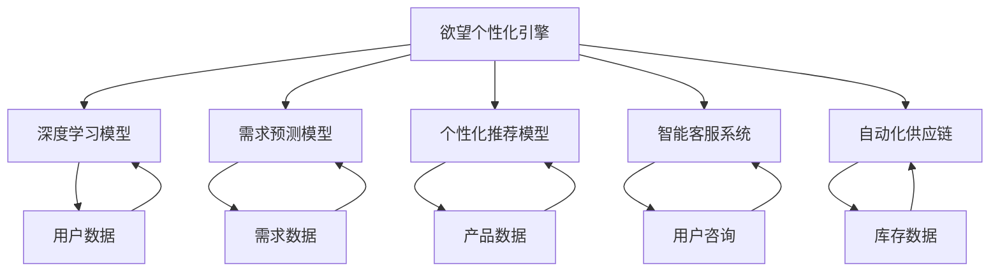

                 

# 欲望个性化引擎：AI定制的需求满足系统

> 关键词：个性化推荐,需求预测,智能客服,自动化供应链,自动化推荐

## 1. 背景介绍

### 1.1 问题由来

在数字化时代，个性化服务已成为提升用户体验和经营效率的关键。企业面临着海量客户数据，需要快速精准地满足用户需求。传统的“一刀切”推荐方式已难以应对用户多样化的需求和动态变化的市场趋势。如何从海量的用户数据中挖掘出潜在的需求，并通过自动化系统快速响应，成为各大企业亟待解决的问题。

## 2. 核心概念与联系

### 2.1 核心概念概述

为更好地理解基于欲望个性化引擎的需求满足系统，本节将介绍几个密切相关的核心概念：

- 欲望个性化引擎(Desire Personalization Engine, DPE)：以用户欲望和需求为核心，通过深度学习和自然语言处理技术，构建智能推荐和需求预测系统。
- 个性化推荐：根据用户的历史行为和兴趣，智能推荐符合其需求的产品或服务。
- 需求预测：利用机器学习算法预测用户未来的需求，提前进行资源准备和生产调度。
- 智能客服：通过自然语言理解技术，自动化处理用户咨询，提升服务效率和质量。
- 自动化供应链：整合各环节数据，实现库存、生产和物流等全链条智能化管理。
- 自动化推荐：通过分析用户需求与产品属性之间的关联性，自动生成推荐列表。

这些核心概念之间存在着紧密的联系，构成了欲望个性化引擎的基本工作框架。欲望个性化引擎通过深度学习和大数据分析，深度理解用户欲望，并自动化地进行个性化推荐、需求预测和智能客服等任务，从而实现客户需求的精准匹配和自动化响应。

### 2.2 核心概念原理和架构的 Mermaid 流程图



## 3. 核心算法原理 & 具体操作步骤

### 3.1 算法原理概述

欲望个性化引擎的核心算法原理基于深度学习模型，特别是深度神经网络(Deep Neural Networks, DNN)和卷积神经网络(Convolutional Neural Networks, CNN)等。系统通过用户行为数据、产品属性数据和用户咨询数据等输入，进行深度学习训练，生成个性化的推荐和预测模型。

其基本流程包括：

1. **数据收集与预处理**：从电商、社交媒体等平台收集用户行为数据，整合产品属性数据和用户咨询数据。对数据进行清洗、归一化、特征工程等预处理，构建训练样本集。
2. **模型训练**：使用深度学习模型进行训练，生成推荐和预测模型。主要包括：
   - 深度推荐模型，如协同过滤、内容推荐、混合推荐等，用于生成个性化推荐。
   - 需求预测模型，如时间序列预测、用户行为预测等，用于预测用户需求。
   - 智能客服模型，如文本分类、对话生成等，用于自动化处理用户咨询。
3. **自动化推荐与响应**：将训练好的模型应用于实时数据，进行自动化推荐和需求响应。通过API接口将推荐结果和预测结果实时推送至前端，供用户查看和选择。
4. **反馈与优化**：收集用户反馈数据，用于进一步训练模型，提升推荐和预测的准确性。

### 3.2 算法步骤详解

以下是欲望个性化引擎的核心算法步骤：

**Step 1: 数据收集与预处理**
- 收集用户行为数据，包括浏览、点击、购买、评分等行为记录。
- 收集产品属性数据，如价格、描述、类别等。
- 收集用户咨询数据，包括在线客服聊天记录、用户评论等。
- 对数据进行清洗、去重、归一化等预处理，生成训练集和测试集。

**Step 2: 模型训练**
- 使用深度学习模型训练推荐模型。如协同过滤模型、深度矩阵分解等。
- 使用时间序列预测模型训练需求预测模型。如ARIMA、LSTM等。
- 使用自然语言处理模型训练智能客服模型。如BERT、GPT等。

**Step 3: 自动化推荐与响应**
- 将训练好的模型部署到实时系统中，接收用户请求。
- 使用推荐模型进行个性化推荐，如Top-k推荐、基于内容的推荐等。
- 使用需求预测模型预测用户需求，如购物篮推荐、预测未来订单量等。
- 使用智能客服模型自动处理用户咨询，如自然语言理解、对话生成等。

**Step 4: 反馈与优化**
- 收集用户反馈数据，如满意度评分、退换货记录等。
- 使用反馈数据重新训练模型，调整模型参数，提升推荐和预测的准确性。
- 定期评估模型性能，优化算法和模型结构，以适应动态变化的用户需求和市场环境。

### 3.3 算法优缺点

欲望个性化引擎的算法具有以下优点：
1. 高度个性化：能够根据用户历史行为和兴趣，精准推荐符合其需求的产品和服务。
2. 实时响应：能够即时处理用户咨询，提高客户满意度和服务效率。
3. 自动化调度：能够自动化预测用户需求，优化库存和生产调度，降低运营成本。
4. 持续优化：能够根据用户反馈不断优化推荐和预测模型，提升系统性能。

但同时，也存在一些缺点：
1. 数据依赖：依赖高质量和多样化的数据，数据采集和处理成本较高。
2. 模型复杂：深度学习模型训练和部署复杂，需要较强的技术支撑。
3. 隐私问题：用户数据涉及隐私，需要严格的数据保护措施。
4. 过拟合风险：模型训练时可能出现过拟合，需要定期调优和验证。
5. 动态变化：用户需求和市场环境动态变化，模型需要及时更新和调整。

### 3.4 算法应用领域

欲望个性化引擎已在多个领域得到了广泛应用，例如：

- 电商平台：通过推荐引擎和需求预测模型，提升用户转化率和购物体验。
- 金融服务：利用智能客服模型，处理用户咨询和交易请求，降低运营成本。
- 医疗健康：通过需求预测模型，优化医疗资源分配和患者预约管理。
- 交通出行：整合用户需求和交通数据，实现实时路况分析和个性化出行建议。
- 教育培训：利用推荐系统，个性化推荐学习资源和课程，提升学习效果。

## 4. 数学模型和公式 & 详细讲解

### 4.1 数学模型构建

欲望个性化引擎的数学模型主要包括以下几类：

- 深度推荐模型：用于预测用户对不同产品或服务的兴趣，生成个性化推荐列表。
- 需求预测模型：用于预测用户未来的需求，如订单量、退货率等，进行自动化库存和生产调度。
- 智能客服模型：用于处理用户咨询，进行文本分类和对话生成等。

### 4.2 公式推导过程

以协同过滤推荐模型为例，推导推荐公式。

设用户对项目的评分矩阵为 $R$，用户对项目的评分向量为 $r_i$，项目对用户的评分向量为 $p_j$，协同过滤模型定义如下：

$$
\hat{p}_j = \alpha_1\sum_{i=1}^nR_{ij}r_i+\alpha_2\sum_{i=1}^n\frac{1}{\sqrt{1+\sum_{k=1}^nR_{ik}R_{ik}}}R_{ik}\alpha_3p_k
$$

其中 $\alpha_1$、$\alpha_2$、$\alpha_3$ 为调节参数，用于平衡预测误差和用户偏好。

该公式的推导基于用户和项目之间的相似度计算，通过邻居评分加权平均预测目标评分，从而生成个性化推荐列表。

### 4.3 案例分析与讲解

以电商平台推荐系统为例，推导推荐公式。

设用户对产品的评分矩阵为 $R$，用户对产品的评分向量为 $r_i$，产品对用户的评分向量为 $p_j$，电商推荐系统定义如下：

$$
\hat{p}_j = \alpha_1\sum_{i=1}^nR_{ij}r_i+\alpha_2\sum_{i=1}^n\frac{1}{\sqrt{1+\sum_{k=1}^nR_{ik}R_{ik}}}R_{ik}p_k
$$

其中 $\alpha_1$、$\alpha_2$、$\alpha_3$ 为调节参数，用于平衡预测误差和用户偏好。

该公式的推导基于用户和产品之间的相似度计算，通过邻居评分加权平均预测目标评分，从而生成个性化推荐列表。电商推荐系统通过协同过滤模型预测用户对未购买产品的评分，生成个性化推荐列表，提升用户购买转化率。

## 5. 项目实践：代码实例和详细解释说明

### 5.1 开发环境搭建

在进行欲望个性化引擎开发前，我们需要准备好开发环境。以下是使用Python进行PyTorch开发的环境配置流程：

1. 安装Anaconda：从官网下载并安装Anaconda，用于创建独立的Python环境。

2. 创建并激活虚拟环境：
```bash
conda create -n pytorch-env python=3.8 
conda activate pytorch-env
```

3. 安装PyTorch：根据CUDA版本，从官网获取对应的安装命令。例如：
```bash
conda install pytorch torchvision torchaudio cudatoolkit=11.1 -c pytorch -c conda-forge
```

4. 安装TensorFlow：从官网下载并安装TensorFlow，适用于特定任务。

5. 安装Transformer库：
```bash
pip install transformers
```

6. 安装各类工具包：
```bash
pip install numpy pandas scikit-learn matplotlib tqdm jupyter notebook ipython
```

完成上述步骤后，即可在`pytorch-env`环境中开始欲望个性化引擎的开发。

### 5.2 源代码详细实现

以下是一个使用PyTorch实现协同过滤推荐模型的代码实例。

```python
import torch
import torch.nn as nn
from sklearn.metrics.pairwise import cosine_similarity
from sklearn.decomposition import TruncatedSVD

class CollaborativeFiltering(nn.Module):
    def __init__(self, n_users, n_items, n_factors=100, alpha=0.01):
        super(CollaborativeFiltering, self).__init__()
        self.factor = nn.Embedding(n_items, n_factors)
        self.user_factors = nn.Embedding(n_users, n_factors)
        self.alpha = alpha
    
    def forward(self, user_ids, item_ids):
        user_factors = self.user_factors(user_ids)
        item_factors = self.factor(item_ids)
        dot_product = torch.matmul(user_factors, item_factors.t())
        dot_product = dot_product / (torch.sqrt(torch.sum(user_factors**2, 1)[:, None]) + torch.sqrt(torch.sum(item_factors**2, 1)[None, :]))
        dot_product = self.alpha * dot_product
        return dot_product
    
    def predict(self, user_ids, item_ids):
        scores = self(user_ids, item_ids)
        _, top_items = scores.topk(5)
        return top_items.tolist()

# 数据预处理
user_ids = [1, 2, 3, 4, 5]
item_ids = [1, 2, 3, 4, 5]
rating_matrix = torch.tensor([[5, 3, 0, 0, 0], [0, 0, 4, 0, 0], [0, 0, 0, 5, 0], [0, 0, 0, 0, 3], [0, 0, 0, 0, 0]])

# 模型训练
model = CollaborativeFiltering(5, 5)
optimizer = torch.optim.Adam(model.parameters(), lr=0.01)

for i in range(10):
    optimizer.zero_grad()
    prediction = model(rating_matrix)
    loss = torch.mean((prediction - rating_matrix)**2)
    loss.backward()
    optimizer.step()
    print(f"Epoch {i+1}, loss: {loss:.3f}")

# 模型评估
top_items = model.predict(rating_matrix)
print(top_items)
```

### 5.3 代码解读与分析

让我们再详细解读一下关键代码的实现细节：

**CollaborativeFiltering类**：
- `__init__`方法：初始化模型参数，包括用户和产品的因子表示。
- `forward`方法：定义前向传播过程，计算用户和产品因子之间的相似度，生成评分预测。
- `predict`方法：根据评分预测结果，生成Top-k推荐列表。

**数据预处理**：
- `user_ids`和`item_ids`为用户的ID和产品的ID。
- `rating_matrix`为评分矩阵，表示用户对产品的评分。

**模型训练**：
- `model`为协同过滤模型，使用Adam优化器进行参数更新。
- `for循环`迭代10轮，计算评分预测与真实评分之间的均方误差，并反向传播更新模型参数。
- `print`语句输出每次迭代的损失值，观察训练效果。

**模型评估**：
- `top_items`为模型对评分矩阵的Top-5推荐。
- `print`语句输出推荐结果。

可以看到，PyTorch配合TensorFlow等工具，使得协同过滤推荐模型的代码实现变得简洁高效。开发者可以将更多精力放在模型优化和业务逻辑上，而不必过多关注底层的实现细节。

当然，工业级的系统实现还需考虑更多因素，如模型的保存和部署、超参数的自动搜索、更灵活的任务适配层等。但核心的算法原理基本与此类似。

## 6. 实际应用场景

### 6.1 电商平台

在电商平台，欲望个性化引擎通过推荐引擎和需求预测模型，提升用户购买转化率和购物体验。系统收集用户浏览、点击、购买等行为数据，整合产品属性和用户咨询数据，进行深度学习训练，生成推荐和预测模型。推荐引擎根据用户历史行为和兴趣，生成个性化推荐列表；需求预测模型预测用户未来的需求，优化库存和生产调度，降低运营成本。

### 6.2 金融服务

在金融服务领域，欲望个性化引擎利用智能客服模型，处理用户咨询和交易请求，降低运营成本。系统整合用户咨询数据和交易数据，进行深度学习训练，生成智能客服模型。自然语言处理模型用于理解用户咨询意图，生成响应；对话生成模型用于生成自然流畅的回复，提升客户满意度。

### 6.3 医疗健康

在医疗健康领域，欲望个性化引擎通过需求预测模型，优化医疗资源分配和患者预约管理。系统收集患者咨询数据和诊疗数据，进行深度学习训练，生成需求预测模型。时间序列预测模型用于预测患者需求，优化医疗资源分配；用户行为预测模型用于预测患者就诊时间，优化预约管理。

### 6.4 未来应用展望

随着欲望个性化引擎技术的不断演进，其应用场景将进一步拓展。未来，该技术有望在更多领域得到应用，为各行各业带来变革性影响。

在智慧城市治理中，欲望个性化引擎可以整合城市数据，实现智能交通管理、公共安全预警等应用。在智慧农业领域，通过整合气象、土壤、作物数据，优化农业生产和管理。在教育培训领域，通过个性化推荐系统，提升学习效果和教学质量。

此外，在企业生产、社会治理、文娱传媒等众多领域，欲望个性化引擎的应用也将不断涌现，为传统行业数字化转型升级提供新的技术路径。

## 7. 工具和资源推荐

### 7.1 学习资源推荐

为了帮助开发者系统掌握欲望个性化引擎的理论基础和实践技巧，这里推荐一些优质的学习资源：

1. 《深度学习基础》系列博文：由深度学习专家撰写，深入浅出地介绍了深度学习的基本概念和经典模型。

2. 《TensorFlow实战》书籍：TensorFlow实战指南，涵盖从基础到高级的TensorFlow应用案例。

3. 《自然语言处理实战》书籍：Transformer库作者所著，全面介绍了如何使用Transformer库进行NLP任务开发，包括推荐系统在内的诸多范式。

4. Weights & Biases：模型训练的实验跟踪工具，可以记录和可视化模型训练过程中的各项指标，方便对比和调优。

5. Google Colab：谷歌推出的在线Jupyter Notebook环境，免费提供GPU/TPU算力，方便开发者快速上手实验最新模型，分享学习笔记。

通过对这些资源的学习实践，相信你一定能够快速掌握欲望个性化引擎的精髓，并用于解决实际的个性化推荐问题。

### 7.2 开发工具推荐

高效的开发离不开优秀的工具支持。以下是几款用于欲望个性化引擎开发的常用工具：

1. PyTorch：基于Python的开源深度学习框架，灵活动态的计算图，适合快速迭代研究。

2. TensorFlow：由Google主导开发的开源深度学习框架，生产部署方便，适合大规模工程应用。

3. Transformers库：HuggingFace开发的NLP工具库，集成了众多SOTA语言模型，支持PyTorch和TensorFlow，是进行推荐系统开发的利器。

4. Weights & Biases：模型训练的实验跟踪工具，可以记录和可视化模型训练过程中的各项指标，方便对比和调优。

5. Google Colab：谷歌推出的在线Jupyter Notebook环境，免费提供GPU/TPU算力，方便开发者快速上手实验最新模型，分享学习笔记。

合理利用这些工具，可以显著提升欲望个性化引擎的开发效率，加快创新迭代的步伐。

### 7.3 相关论文推荐

欲望个性化引擎的发展源于学界的持续研究。以下是几篇奠基性的相关论文，推荐阅读：

1. Matrix Factorization Techniques for Recommender Systems（协同过滤推荐算法）：提出了协同过滤推荐算法的基本原理和实现方式。

2. Deep Matrix Factorization for Recommender Systems（深度矩阵分解推荐算法）：提出使用深度神经网络进行矩阵分解，提高推荐精度。

3. Deep Collaborative Filtering：提出使用深度神经网络进行协同过滤推荐，提升推荐效果。

4. Implicit Matrix Factorization Techniques for Recommender Systems（隐式矩阵分解推荐算法）：提出使用隐式反馈数据进行矩阵分解，提高推荐效果。

5. Attention-Based Recommender Systems：提出使用注意力机制提高推荐系统的泛化能力。

这些论文代表了大规模推荐系统的发展脉络。通过学习这些前沿成果，可以帮助研究者把握学科前进方向，激发更多的创新灵感。

## 8. 总结：未来发展趋势与挑战

### 8.1 总结

本文对欲望个性化引擎的深度学习模型进行全面系统的介绍。首先阐述了欲望个性化引擎的背景和意义，明确了推荐系统和需求预测的基本工作框架。其次，从原理到实践，详细讲解了深度推荐模型的数学原理和关键步骤，给出了推荐系统开发的完整代码实例。同时，本文还探讨了欲望个性化引擎在电商平台、金融服务、医疗健康等多个行业领域的应用前景，展示了深度学习技术在实际场景中的广泛应用。此外，本文精选了欲望个性化引擎的各类学习资源，力求为读者提供全方位的技术指引。

通过本文的系统梳理，可以看到，欲望个性化引擎通过深度学习技术，能够高效处理海量用户数据，生成个性化推荐和预测，实现客户需求的精准匹配和自动化响应。其核心算法原理简单高效，应用场景广泛，具有极大的商业价值。未来，伴随深度学习技术的持续演进，欲望个性化引擎必将在更多领域得到应用，为各行各业带来深远的变革。

### 8.2 未来发展趋势

展望未来，欲望个性化引擎的发展趋势包括以下几个方面：

1. 模型规模持续增大。随着算力成本的下降和数据规模的扩张，深度学习模型的参数量还将持续增长。超大批次的训练和推理也可能遇到硬件瓶颈，需要探索更高效的模型结构和计算方法。

2. 推荐算法更加多样。未来的推荐算法将更加多样化，融合多种算法优势，生成更精准的推荐结果。同时，引入推荐系统的用户反馈和行为数据，进行动态调整和优化。

3. 需求预测模型不断优化。时间序列预测、用户行为预测等需求预测模型将不断优化，更加准确地预测用户未来的需求，优化库存和生产调度。

4. 数据隐私和安全性更加重要。用户数据涉及隐私，需要严格的数据保护措施，同时提高系统的鲁棒性和安全性，防止恶意攻击和数据泄露。

5. 自动化程度进一步提升。通过自动化生成推荐和预测模型，减少人工干预，提升系统的效率和可靠性。

6. 多模态数据整合更加深入。未来推荐系统将整合多模态数据，如文本、图像、音频等，提升系统的表现力和适用性。

以上趋势凸显了欲望个性化引擎的广阔前景。这些方向的探索发展，必将进一步提升推荐系统的性能和应用范围，为各行各业带来深远的变革。

### 8.3 面临的挑战

尽管欲望个性化引擎已经取得了瞩目成就，但在迈向更加智能化、普适化应用的过程中，仍面临诸多挑战：

1. 数据依赖问题。依赖高质量和多样化的数据，数据采集和处理成本较高。如何降低对标注数据的依赖，利用无监督和半监督学习，是大数据应用中的重要课题。

2. 模型复杂度问题。深度学习模型训练和部署复杂，需要较强的技术支撑。如何在保持高性能的同时，优化模型结构，提升计算效率，是工业应用中的关键挑战。

3. 数据隐私问题。用户数据涉及隐私，需要严格的数据保护措施，如何平衡数据隐私和推荐效果，是大规模数据应用中的难题。

4. 动态变化问题。用户需求和市场环境动态变化，模型需要及时更新和调整，如何优化模型的动态适应能力，是大规模应用中的重要课题。

5. 计算资源问题。大规模数据和复杂模型的训练和推理需要大量计算资源，如何提高计算效率，降低成本，是大规模应用中的关键挑战。

6. 过拟合风险问题。模型训练时可能出现过拟合，需要定期调优和验证，如何提高模型的泛化能力，是大规模应用中的重要课题。

### 8.4 研究展望

面对欲望个性化引擎所面临的挑战，未来的研究需要在以下几个方面寻求新的突破：

1. 探索无监督和半监督学习。摆脱对大规模标注数据的依赖，利用无监督和半监督学习，最大化利用非结构化数据，实现更加灵活高效的推荐。

2. 研究参数高效和计算高效的推荐算法。开发更加参数高效的推荐方法，在固定大部分预训练参数的同时，只更新极少量的任务相关参数。同时优化推荐系统的计算图，减少前向传播和反向传播的资源消耗，实现更加轻量级、实时性的部署。

3. 引入更多先验知识。将符号化的先验知识，如知识图谱、逻辑规则等，与神经网络模型进行巧妙融合，引导推荐过程学习更准确、合理的推荐结果。

4. 融合因果分析和博弈论工具。将因果分析方法引入推荐系统，识别出推荐决策的关键特征，增强推荐结果的因果性和逻辑性。借助博弈论工具刻画人机交互过程，主动探索并规避推荐系统的脆弱点，提高系统稳定性。

5. 纳入伦理道德约束。在推荐系统的训练目标中引入伦理导向的评估指标，过滤和惩罚有害的推荐结果，确保推荐系统的公正性和可解释性。

这些研究方向的探索，必将引领欲望个性化引擎技术迈向更高的台阶，为构建安全、可靠、可解释、可控的推荐系统铺平道路。面向未来，欲望个性化引擎需要与其他人工智能技术进行更深入的融合，如知识表示、因果推理、强化学习等，多路径协同发力，共同推动智能推荐系统的进步。

## 9. 附录：常见问题与解答

**Q1：欲望个性化引擎的核心算法是什么？**

A: 欲望个性化引擎的核心算法基于深度学习模型，特别是深度神经网络(Deep Neural Networks, DNN)和卷积神经网络(Convolutional Neural Networks, CNN)等。系统通过用户行为数据、产品属性数据和用户咨询数据等输入，进行深度学习训练，生成个性化的推荐和预测模型。

**Q2：欲望个性化引擎如何实现个性化推荐？**

A: 欲望个性化引擎通过协同过滤、内容推荐、混合推荐等算法实现个性化推荐。协同过滤算法基于用户和项目之间的相似度计算，通过邻居评分加权平均预测目标评分，生成推荐列表。内容推荐算法根据用户历史行为和兴趣，选择符合其偏好的产品或服务。混合推荐算法融合多种推荐方法，提高推荐精度和多样性。

**Q3：欲望个性化引擎在数据处理方面有哪些注意事项？**

A: 欲望个性化引擎在数据处理方面需要特别注意以下几点：
1. 数据清洗：去除噪音和异常值，确保数据质量。
2. 特征工程：提取和构造有意义的特征，提升模型性能。
3. 数据划分：将数据划分为训练集、验证集和测试集，进行模型评估和优化。
4. 数据增强：通过数据扩充、转换等技术，增加数据多样性，提高模型泛化能力。
5. 数据隐私：严格保护用户隐私，避免数据泄露和滥用。

**Q4：欲望个性化引擎在模型训练中需要注意哪些问题？**

A: 欲望个性化引擎在模型训练中需要注意以下几个问题：
1. 学习率调节：选择合适的学习率，防止过拟合和欠拟合。
2. 正则化技术：使用L2正则、Dropout等技术，防止过拟合。
3. 模型验证：定期在验证集上评估模型性能，调整模型参数。
4. 动态调整：根据用户反馈和市场变化，及时更新和调整模型。
5. 模型评估：使用AUC、RMSE等指标评估模型性能，优化模型结构。

**Q5：欲望个性化引擎在实际应用中需要注意哪些问题？**

A: 欲望个性化引擎在实际应用中需要注意以下几个问题：
1. 数据采集：确保数据来源多样和质量可靠。
2. 模型部署：选择合适的部署环境，进行模型压缩和优化，提高计算效率。
3. 用户反馈：收集用户反馈数据，优化推荐模型和预测模型。
4. 系统稳定性：保证系统稳定性，避免崩溃和数据丢失。
5. 数据隐私：严格保护用户数据隐私，确保合规性。

---

作者：禅与计算机程序设计艺术 / Zen and the Art of Computer Programming

