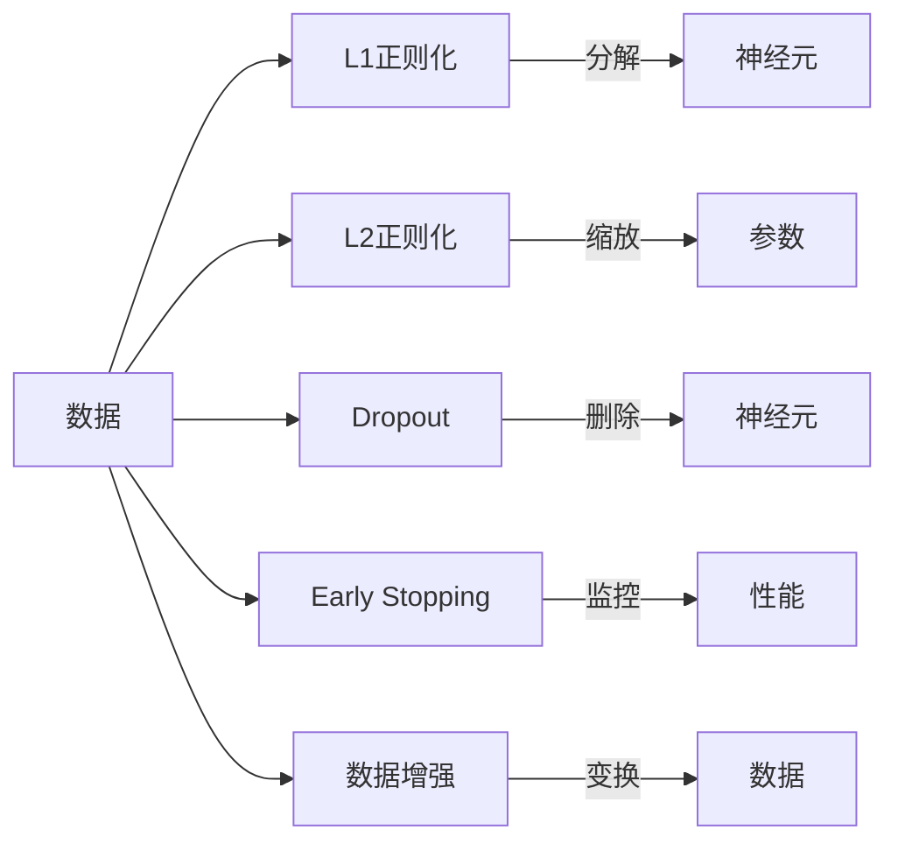

                 

## 1. 背景介绍

在机器学习领域，正则化（Regularization）是一种重要的模型优化技术，用于防止过拟合（Overfitting）和提升模型的泛化能力。过拟合指的是模型在训练数据上表现良好，但在未见过的测试数据上表现不佳的现象。正则化通过在损失函数中引入正则项，限制模型的复杂度，从而提高模型的泛化性能。

正则化的历史可以追溯到20世纪80年代，早期使用的是L1正则化（Lasso）和L2正则化（Ridge），这两种正则化方法在统计学和机器学习中都得到了广泛应用。近年来，随着深度学习的兴起，正则化技术也逐渐从线性模型推广到了非线性模型中，如Dropout、数据增强等。

本文将详细介绍正则化的核心概念、原理及其在深度学习中的应用，并通过具体案例分析展示正则化技术如何在实际项目中提高模型性能。

## 2. 核心概念与联系

### 2.1 核心概念概述

正则化通过在损失函数中引入额外惩罚项，对模型参数进行约束，防止模型过度拟合训练数据。常见的正则化方法包括L1正则化、L2正则化、Dropout、Early Stopping等。

- **L1正则化（Lasso）**：在损失函数中加入参数绝对值的和，强制模型参数向零逼近，从而实现稀疏性。
- **L2正则化（Ridge）**：在损失函数中加入参数平方和，防止参数值过大，避免过拟合。
- **Dropout**：在训练过程中随机删除神经元，强制模型学习到多个独立的子模型，减少神经元之间的依赖。
- **Early Stopping**：在验证集上监控模型性能，当性能不再提升时停止训练，避免过拟合。
- **数据增强**：通过对训练数据进行变换，如旋转、裁剪、平移等，扩充数据集，提升模型的鲁棒性。

这些正则化方法通过不同的机制，共同作用于模型，防止过拟合，提高泛化性能。

### 2.2 核心概念原理和架构的 Mermaid 流程图



### 2.3 核心概念之间的联系

上述正则化方法虽然实现方式不同，但都旨在减少模型复杂度，防止过拟合，提升泛化性能。其中，L1和L2正则化通过参数约束限制模型的复杂度，Dropout和数据增强通过增加模型的鲁棒性提升泛化能力，Early Stopping通过提前停止训练避免过拟合。

## 3. 核心算法原理 & 具体操作步骤

### 3.1 算法原理概述

正则化的核心思想是通过在损失函数中引入额外惩罚项，对模型参数进行约束，防止模型过度拟合训练数据。常见的正则化方法可以总结为：

- **L1正则化**：在损失函数中加入参数绝对值的和，强制模型参数向零逼近，从而实现稀疏性。
- **L2正则化**：在损失函数中加入参数平方和，防止参数值过大，避免过拟合。
- **Dropout**：在训练过程中随机删除神经元，强制模型学习到多个独立的子模型，减少神经元之间的依赖。
- **Early Stopping**：在验证集上监控模型性能，当性能不再提升时停止训练，避免过拟合。
- **数据增强**：通过对训练数据进行变换，如旋转、裁剪、平移等，扩充数据集，提升模型的鲁棒性。

### 3.2 算法步骤详解

以L2正则化为例，介绍正则化算法的具体操作步骤：

1. **定义损失函数**：在损失函数中加入L2正则化项，具体为：
   $$
   \mathcal{L}(\theta) = \frac{1}{N}\sum_{i=1}^N \ell(M_{\theta}(x_i),y_i) + \frac{\lambda}{2} ||\theta||^2
   $$
   其中，$\ell$ 为基本损失函数，$\theta$ 为模型参数，$\lambda$ 为正则化系数，$||\theta||$ 为参数的L2范数。

2. **定义优化目标**：将L2正则化项加入损失函数，得到优化目标：
   $$
   \min_{\theta} \mathcal{L}(\theta) = \frac{1}{N}\sum_{i=1}^N \ell(M_{\theta}(x_i),y_i) + \frac{\lambda}{2} ||\theta||^2
   $$

3. **优化算法**：使用梯度下降等优化算法求解优化目标，更新模型参数。

4. **验证和调整**：在训练过程中，需要在验证集上监控模型性能，如果模型在验证集上的性能不再提升，则停止训练。

### 3.3 算法优缺点

**优点**：
- 防止过拟合：正则化通过限制模型参数，减少模型复杂度，防止模型过度拟合训练数据。
- 提高泛化性能：正则化使得模型更加通用，可以在未见过的数据上表现良好。
- 模型稳定性：正则化使得模型参数更加稳定，避免了在训练过程中出现较大的波动。

**缺点**：
- 增加计算复杂度：正则化引入了额外的惩罚项，增加了计算量，需要更多的计算资源。
- 可能降低模型精度：正则化通过限制模型参数，可能会牺牲一些模型精度。

### 3.4 算法应用领域

正则化技术在深度学习中得到了广泛应用，尤其是在神经网络的训练中。常见的应用领域包括：

- 图像识别：通过正则化提高图像分类器的鲁棒性和泛化性能。
- 自然语言处理：通过正则化提升NLP任务的精度和泛化能力。
- 语音识别：通过正则化提高语音识别系统的准确率和鲁棒性。
- 推荐系统：通过正则化提升推荐模型的多样性和公平性。

## 4. 数学模型和公式 & 详细讲解 & 举例说明

### 4.1 数学模型构建

正则化的数学模型构建主要基于以下公式：

1. **L1正则化**：
   $$
   \mathcal{L}(\theta) = \frac{1}{N}\sum_{i=1}^N \ell(M_{\theta}(x_i),y_i) + \lambda ||\theta||_1
   $$

2. **L2正则化**：
   $$
   \mathcal{L}(\theta) = \frac{1}{N}\sum_{i=1}^N \ell(M_{\theta}(x_i),y_i) + \frac{\lambda}{2} ||\theta||^2
   $$

3. **Dropout**：
   $$
   \mathcal{L}(\theta) = \frac{1}{N}\sum_{i=1}^N \ell(M_{\theta}(x_i),y_i) + \frac{\lambda}{2} ||\theta||^2 + \lambda\sum_{i=1}^N D_i
   $$
   其中，$D_i$ 为随机变量，表示神经元被删除的概率。

4. **Early Stopping**：
   $$
   \mathcal{L}(\theta) = \frac{1}{N}\sum_{i=1}^N \ell(M_{\theta}(x_i),y_i) + \frac{\lambda}{2} ||\theta||^2
   $$

### 4.2 公式推导过程

以L2正则化为例子，推导其优化过程：

1. **定义损失函数**：
   $$
   \mathcal{L}(\theta) = \frac{1}{N}\sum_{i=1}^N \ell(M_{\theta}(x_i),y_i) + \frac{\lambda}{2} ||\theta||^2
   $$

2. **求偏导数**：
   $$
   \frac{\partial \mathcal{L}(\theta)}{\partial \theta_j} = \frac{1}{N}\sum_{i=1}^N \frac{\partial \ell(M_{\theta}(x_i),y_i)}{\partial \theta_j} + \lambda\theta_j
   $$

3. **优化目标**：
   $$
   \min_{\theta} \mathcal{L}(\theta) = \frac{1}{N}\sum_{i=1}^N \ell(M_{\theta}(x_i),y_i) + \frac{\lambda}{2} ||\theta||^2
   $$

4. **使用梯度下降算法**：
   $$
   \theta_j \leftarrow \theta_j - \eta\left(\frac{1}{N}\sum_{i=1}^N \frac{\partial \ell(M_{\theta}(x_i),y_i)}{\partial \theta_j} + \lambda\theta_j\right)
   $$

### 4.3 案例分析与讲解

以L2正则化为例子，分析其在深度学习中的应用：

假设有一个二分类问题，输入样本为$x$，真实标签为$y$，模型输出为$M_{\theta}(x)$，其中$\theta$为模型参数。假设损失函数为交叉熵损失，正则化系数为$\lambda$。

1. **定义损失函数**：
   $$
   \mathcal{L}(\theta) = \frac{1}{N}\sum_{i=1}^N \ell(M_{\theta}(x_i),y_i) + \frac{\lambda}{2} ||\theta||^2
   $$

2. **求偏导数**：
   $$
   \frac{\partial \mathcal{L}(\theta)}{\partial \theta_j} = \frac{1}{N}\sum_{i=1}^N \frac{\partial \ell(M_{\theta}(x_i),y_i)}{\partial \theta_j} + \lambda\theta_j
   $$

3. **优化目标**：
   $$
   \min_{\theta} \mathcal{L}(\theta) = \frac{1}{N}\sum_{i=1}^N \ell(M_{\theta}(x_i),y_i) + \frac{\lambda}{2} ||\theta||^2
   $$

4. **使用梯度下降算法**：
   $$
   \theta_j \leftarrow \theta_j - \eta\left(\frac{1}{N}\sum_{i=1}^N \frac{\partial \ell(M_{\theta}(x_i),y_i)}{\partial \theta_j} + \lambda\theta_j\right)
   $$

在实际应用中，L2正则化可以通过不同的参数设置来调整模型的复杂度，从而防止过拟合，提升模型的泛化能力。

## 5. 项目实践：代码实例和详细解释说明

### 5.1 开发环境搭建

要进行正则化的实践，首先需要搭建好开发环境。以下是使用Python进行TensorFlow开发的环境配置流程：

1. 安装Anaconda：从官网下载并安装Anaconda，用于创建独立的Python环境。

2. 创建并激活虚拟环境：
```bash
conda create -n tf-env python=3.8 
conda activate tf-env
```

3. 安装TensorFlow：根据CUDA版本，从官网获取对应的安装命令。例如：
```bash
conda install tensorflow -c conda-forge
```

4. 安装各类工具包：
```bash
pip install numpy pandas scikit-learn matplotlib tqdm jupyter notebook ipython
```

完成上述步骤后，即可在`tf-env`环境中开始正则化的实践。

### 5.2 源代码详细实现

下面我们以L2正则化为例子，给出使用TensorFlow进行深度学习模型训练的PyTorch代码实现。

首先，定义L2正则化函数：

```python
import tensorflow as tf
from tensorflow.keras import layers, models

def l2_regularizer(lmbda):
    def reg(weights):
        return tf.reduce_sum(tf.square(weights)) * lmbda
    return reg
```

然后，定义深度学习模型：

```python
model = models.Sequential([
    layers.Dense(64, activation='relu'),
    layers.Dense(10, activation='softmax')
])

# 定义L2正则化项
lmbda = 0.001
regularizer = l2_regularizer(lmbda)

# 计算损失函数
loss = tf.keras.losses.CategoricalCrossentropy()
regularization_loss = regularizer(model.trainable_weights)
total_loss = tf.reduce_mean(loss(model.predict(x_train), y_train) + regularization_loss)

# 定义优化器
optimizer = tf.keras.optimizers.Adam(learning_rate=0.001)
```

接着，定义训练和评估函数：

```python
def train_epoch(model, dataset, batch_size, optimizer, loss, regularization_loss):
    model.train()
    for batch in dataset:
        x_batch, y_batch = batch
        with tf.GradientTape() as tape:
            y_pred = model(x_batch)
            loss_value = loss(y_pred, y_batch)
            regularization_value = regularization_loss(model.trainable_weights)
        gradients = tape.gradient(loss_value + regularization_value, model.trainable_weights)
        optimizer.apply_gradients(zip(gradients, model.trainable_weights))
```

最后，启动训练流程并在测试集上评估：

```python
epochs = 10

for epoch in range(epochs):
    train_epoch(model, train_dataset, batch_size, optimizer, loss, regularization_loss)
    print(f"Epoch {epoch+1}, train loss: {total_loss.numpy():.4f}")
    
evaluate(model, test_dataset)
```

以上就是使用TensorFlow对深度学习模型进行L2正则化的完整代码实现。可以看到，正则化的实现相对简单，通过定义正则化项，并将其加入到损失函数中，即可完成模型训练。

### 5.3 代码解读与分析

让我们再详细解读一下关键代码的实现细节：

**l2_regularizer函数**：
- 定义一个函数，接受正则化系数 $lmbda$，返回一个正则化项函数。
- 正则化项函数 $reg$ 接受模型参数 $weights$，计算正则化项 $tf.reduce_sum(tf.square(weights)) * lmbda$，并返回。

**模型定义**：
- 定义一个包含两个全连接层的序列模型。
- 第一层包含64个神经元，使用ReLU激活函数。
- 第二层包含10个神经元，使用softmax激活函数，用于多分类问题。

**正则化项计算**：
- 定义L2正则化系数 $lmbda$。
- 使用定义好的正则化项函数 $regularizer$，计算正则化项 $regularization_loss$。
- 将损失函数 $loss$ 和正则化项 $regularization_loss$ 相加，得到总损失函数 $total_loss$。

**优化器定义**：
- 定义Adam优化器，学习率为0.001。

**训练函数train_epoch**：
- 在每个epoch开始时，将模型设置为训练模式。
- 对于每个批次的数据，计算模型预测输出 $y_pred$ 和损失值 $loss_value$，以及正则化项 $regularization_value$。
- 使用梯度磁带记录梯度，使用优化器更新模型参数。

**训练和评估过程**：
- 循环迭代epochs次，每次迭代调用train_epoch函数。
- 打印每个epoch的训练损失。
- 在测试集上评估模型性能。

可以看到，通过定义正则化项并加入到损失函数中，TensorFlow可以很方便地实现正则化。在实际应用中，还可以根据具体需求调整正则化系数和正则化项类型，如L1正则化、Dropout等。

## 6. 实际应用场景

正则化技术在深度学习中得到了广泛应用，以下是几个常见的应用场景：

### 6.1 图像识别

在图像识别中，正则化技术可以显著提高模型的泛化性能，防止过拟合。例如，可以使用L2正则化限制卷积层和全连接层的参数大小，从而减少模型复杂度，提高模型的泛化性能。

### 6.2 自然语言处理

在自然语言处理中，正则化技术可以提升NLP任务的精度和鲁棒性。例如，可以使用Dropout技术减少神经元之间的依赖，增强模型的鲁棒性。

### 6.3 语音识别

在语音识别中，正则化技术可以提高系统的准确率和鲁棒性。例如，可以使用L2正则化限制神经网络参数的大小，减少模型复杂度，提高模型的泛化性能。

### 6.4 推荐系统

在推荐系统中，正则化技术可以提升推荐模型的多样性和公平性。例如，可以使用L1正则化实现稀疏性，从而减少模型复杂度，提高模型的泛化性能。

## 7. 工具和资源推荐

### 7.1 学习资源推荐

为了帮助开发者系统掌握正则化的理论基础和实践技巧，这里推荐一些优质的学习资源：

1. 《深度学习》（Ian Goodfellow）：深度学习领域的经典教材，详细介绍了各种正则化方法的应用。
2. CS231n《卷积神经网络》课程：斯坦福大学开设的计算机视觉课程，讲解了L1和L2正则化方法在卷积神经网络中的应用。
3. 《Python机器学习》（Sebastian Raschka）：机器学习领域的经典教材，详细介绍了各种正则化方法的应用。
4. Coursera《深度学习专项课程》：由吴恩达教授主讲，详细介绍了各种正则化方法的应用。
5. Kaggle深度学习竞赛：参与Kaggle深度学习竞赛，实践正则化技术在实际项目中的应用。

通过对这些资源的学习实践，相信你一定能够快速掌握正则化的精髓，并用于解决实际的深度学习问题。

### 7.2 开发工具推荐

高效的开发离不开优秀的工具支持。以下是几款用于深度学习开发的常用工具：

1. TensorFlow：由Google主导开发的开源深度学习框架，支持L1和L2正则化等正则化方法。
2. PyTorch：基于Python的开源深度学习框架，支持各种正则化方法，包括Dropout、Early Stopping等。
3. Keras：基于TensorFlow和Theano的高级深度学习框架，支持各种正则化方法，使用简单高效。
4. Weights & Biases：模型训练的实验跟踪工具，可以记录和可视化模型训练过程中的各项指标，方便对比和调优。
5. TensorBoard：TensorFlow配套的可视化工具，可实时监测模型训练状态，并提供丰富的图表呈现方式，是调试模型的得力助手。

合理利用这些工具，可以显著提升深度学习模型训练的效率，加快创新迭代的步伐。

### 7.3 相关论文推荐

正则化技术在深度学习中得到了广泛应用，以下是几篇奠基性的相关论文，推荐阅读：

1. Regularization and Optimization of General Deep Architectures（Ian Goodfellow）：详细介绍了L1和L2正则化方法在深度神经网络中的应用。
2. Dropout: A Simple Way to Prevent Neural Networks from Overfitting（Yoshua Bengio）：提出了Dropout技术，通过随机删除神经元防止过拟合。
3. Early Stopping：在神经网络训练中，通过监控验证集性能，及时停止训练，防止过拟合。
4. Batch Normalization: Accelerating Deep Network Training by Reducing Internal Covariate Shift（Sergey Ioffe）：提出了Batch Normalization技术，通过标准化输入数据，加速训练，提高模型的鲁棒性。
5. Data Augmentation: Pre-processing Data for Generalization（Christopher M. Bishop）：详细介绍了数据增强技术，通过扩充数据集，提高模型的鲁棒性。

这些论文代表了大规模正则化技术的发展脉络。通过学习这些前沿成果，可以帮助研究者把握学科前进方向，激发更多的创新灵感。

## 8. 总结：未来发展趋势与挑战

### 8.1 总结

本文对正则化的核心概念、原理及其在深度学习中的应用进行了全面系统的介绍。首先阐述了正则化的背景和意义，明确了正则化在防止过拟合、提升模型泛化性能方面的独特价值。其次，从原理到实践，详细讲解了正则化的数学原理和操作步骤，给出了正则化任务开发的完整代码实例。同时，本文还广泛探讨了正则化方法在图像识别、自然语言处理、语音识别等多个领域的应用前景，展示了正则化技术的巨大潜力。

通过本文的系统梳理，可以看到，正则化技术在深度学习中发挥了至关重要的作用，极大地提升了模型的泛化能力和鲁棒性。正则化方法的不断演进，使得深度学习模型在多个领域取得了显著的进展，为人工智能技术的发展奠定了坚实的基础。未来，随着深度学习技术的持续进步，正则化技术也将不断优化，为构建高效、鲁棒、泛化性强的模型提供更多支持。

### 8.2 未来发展趋势

展望未来，正则化技术将呈现以下几个发展趋势：

1. **模型复杂度控制**：未来正则化技术将更加注重模型复杂度的控制，通过引入更高级的正则化方法，如弹性正则化（Elastic Regularization），更加精准地限制模型参数的大小和分布。

2. **自动化调参**：随着自动化调参技术的发展，正则化参数的选取将更加智能化，通过自动化调参算法，动态调整正则化系数，实现模型的最优性能。

3. **模型解释性增强**：未来正则化技术将更加注重模型的解释性，通过引入可视化工具和解释方法，使得模型的决策过程更加透明，提高模型的可解释性和可信度。

4. **多任务正则化**：未来的正则化方法将更加注重多任务学习的应用，通过引入多任务正则化技术，提高模型的泛化能力和任务相关性。

5. **模型鲁棒性提升**：未来的正则化技术将更加注重模型的鲁棒性，通过引入对抗样本、数据增强等方法，提高模型的泛化能力和鲁棒性。

6. **模型迁移能力**：未来的正则化技术将更加注重模型的迁移能力，通过引入迁移学习方法和正则化技术，使得模型能够在不同领域和任务之间进行迁移和适应。

### 8.3 面临的挑战

尽管正则化技术已经取得了瞩目成就，但在迈向更加智能化、普适化应用的过程中，它仍面临着诸多挑战：

1. **计算复杂度**：正则化技术虽然能够防止过拟合，但引入了额外的计算复杂度，需要更多的计算资源。如何在保证模型性能的同时，优化计算资源消耗，是未来需要解决的重要问题。

2. **模型泛化能力**：尽管正则化技术提高了模型的泛化能力，但在一些复杂任务中，模型的泛化能力仍有限。如何进一步提高模型的泛化能力，使其在更多领域和任务中表现优异，是未来需要解决的重要问题。

3. **模型解释性**：尽管正则化技术能够提高模型的泛化能力和鲁棒性，但模型的决策过程缺乏可解释性，难以理解和调试。如何提高模型的可解释性，使其更加透明和可信，是未来需要解决的重要问题。

4. **模型鲁棒性**：尽管正则化技术能够提高模型的鲁棒性，但在对抗样本和异常数据下，模型的鲁棒性仍有限。如何提高模型的鲁棒性，使其在对抗样本和异常数据下表现稳定，是未来需要解决的重要问题。

5. **模型迁移能力**：尽管正则化技术能够提高模型的迁移能力，但在不同领域和任务之间的迁移仍有限。如何进一步提高模型的迁移能力，使其在不同领域和任务之间表现优异，是未来需要解决的重要问题。

### 8.4 研究展望

面对正则化技术所面临的种种挑战，未来的研究需要在以下几个方面寻求新的突破：

1. **自动化调参**：通过自动化调参技术，动态调整正则化系数，实现模型的最优性能。

2. **多任务正则化**：通过引入多任务正则化技术，提高模型的泛化能力和任务相关性。

3. **模型解释性**：通过引入可视化工具和解释方法，使得模型的决策过程更加透明，提高模型的可解释性和可信度。

4. **模型鲁棒性**：通过引入对抗样本和数据增强等方法，提高模型的鲁棒性和泛化能力。

5. **模型迁移能力**：通过引入迁移学习方法和正则化技术，使得模型能够在不同领域和任务之间进行迁移和适应。

这些研究方向的探索，必将引领正则化技术迈向更高的台阶，为构建高效、鲁棒、泛化性强的模型提供更多支持。面向未来，正则化技术还需要与其他人工智能技术进行更深入的融合，如知识表示、因果推理、强化学习等，多路径协同发力，共同推动人工智能技术的发展。

## 9. 附录：常见问题与解答

**Q1：正则化技术是否适用于所有深度学习模型？**

A: 正则化技术可以应用于大多数深度学习模型，尤其是在模型参数较多、容易发生过拟合的情况下。但在一些特定类型的模型中，如卷积神经网络，正则化技术的效果可能有限。

**Q2：正则化技术是否会影响模型训练速度？**

A: 正则化技术会引入额外的计算复杂度，增加模型训练的时间。但通过合理的参数设置和优化算法，可以在保证模型性能的同时，尽可能缩短训练时间。

**Q3：正则化技术是否会降低模型精度？**

A: 正则化技术可能会牺牲一些模型精度，尤其是在正则化系数较大时。但通过合理的参数设置和优化算法，可以在保证模型泛化性能的同时，尽可能提高模型精度。

**Q4：正则化技术是否会降低模型训练稳定性？**

A: 正则化技术可以提升模型的训练稳定性，防止过拟合，使模型更加鲁棒和泛化。但过度正则化可能导致模型欠拟合，因此需要根据具体任务和数据特点进行合理调整。

**Q5：正则化技术是否会降低模型计算效率？**

A: 正则化技术会引入额外的计算复杂度，增加模型训练的计算资源消耗。但通过合理的计算优化，如批量处理、分布式训练等，可以在保证模型性能的同时，优化计算资源消耗。

正则化技术是深度学习中不可或缺的一部分，通过合理应用正则化技术，可以防止过拟合，提升模型泛化性能，构建更加高效、鲁棒、泛化性强的深度学习模型。未来，随着正则化技术的不断演进，深度学习模型的性能和鲁棒性将进一步提升，为人工智能技术的发展提供更多支持。

