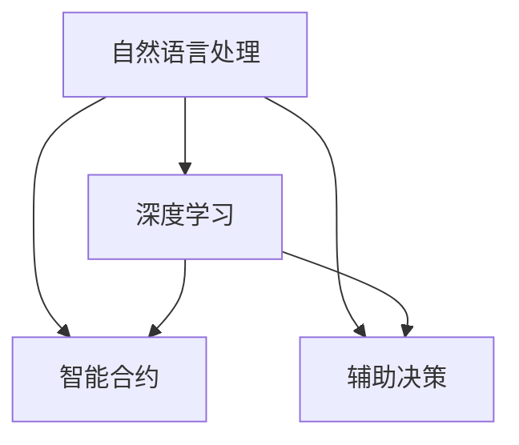

                 

# 法律文书自动生成：AI在法律领域的应用

> 关键词：法律文书, 自动生成, 人工智能, 自然语言处理, 深度学习, 智能合约, 辅助决策

## 1. 背景介绍

### 1.1 问题由来

随着人工智能技术的不断进步，越来越多的领域开始探索和应用人工智能技术。法律领域也不例外。法律文书自动生成是人工智能在法律领域应用的一个重要方向。在传统的法律事务中，法律文书的制作需要律师花费大量的时间和精力，并且容易出现错误。随着人工智能技术的发展，法律文书自动生成技术开始逐步应用于司法实践，大大提高了法律文书的制作效率和准确性。

### 1.2 问题核心关键点

法律文书自动生成技术主要包括以下几个关键点：
- **自然语言处理**：法律文书自动生成技术是基于自然语言处理（Natural Language Processing, NLP）的一种应用，其核心在于理解和生成文本。
- **深度学习**：深度学习技术是法律文书自动生成的重要工具，通过神经网络对大量的法律文书法案进行分析学习，可以自动生成新的文书。
- **智能合约**：智能合约是基于区块链技术的一种自动执行合同，法律文书自动生成技术可以用于生成智能合约的代码。
- **辅助决策**：法律文书自动生成技术可以用于辅助法官和律师的决策，提供有关法律文书的参考和建议。

这些核心关键点共同构成了法律文书自动生成技术的应用基础，通过深入理解这些概念，可以帮助我们更好地掌握法律文书自动生成技术的原理和应用。

## 2. 核心概念与联系

### 2.1 核心概念概述

为了更好地理解法律文书自动生成技术，我们需要先了解几个核心概念：

- **自然语言处理**：自然语言处理是人工智能的一个重要分支，旨在使计算机能够理解、处理和生成自然语言。
- **深度学习**：深度学习是一种基于神经网络的机器学习技术，可以用于处理复杂的模式识别和预测问题。
- **智能合约**：智能合约是基于区块链技术的自动化合同，可以在无需中介的情况下自动执行。
- **辅助决策**：辅助决策是指利用人工智能技术提供决策支持，帮助人类做出更明智的决策。

这些核心概念之间的关系可以通过以下Mermaid流程图来展示：



这个流程图展示了大语言模型在法律文书自动生成中的核心概念及其之间的关系：

1. 自然语言处理是深度学习的基础，深度学习通过大量的语料数据训练生成模型。
2. 智能合约和辅助决策是深度学习在法律文书自动生成技术中的应用，智能合约生成代码，辅助决策提供参考。
3. 深度学习在自然语言处理的基础上，生成法律文书，并在智能合约和辅助决策中发挥作用。

## 3. 核心算法原理 & 具体操作步骤

### 3.1 算法原理概述

法律文书自动生成技术主要基于深度学习模型，通过对大量的法律文书法案进行分析，学习法律文书的结构和语言特征，从而自动生成新的法律文书。

法律文书自动生成技术的核心算法包括：
- **序列到序列模型（Sequence-to-Sequence Model）**：序列到序列模型是一种深度学习模型，用于将输入序列转换为输出序列。在法律文书自动生成中，输入序列是已经存在的法律文书法案，输出序列是需要生成的新的法律文书。
- **注意力机制（Attention Mechanism）**：注意力机制是一种用于序列到序列模型的技术，可以使得模型关注输入序列中重要的部分，从而生成更准确的输出序列。
- **循环神经网络（Recurrent Neural Network, RNN）**：循环神经网络是一种适用于序列数据的神经网络，可以处理变长序列数据。

### 3.2 算法步骤详解

法律文书自动生成技术的步骤如下：

**Step 1: 数据预处理**
- 收集大量的法律文书法案，并进行清洗和预处理，将其转化为模型所需的输入和输出格式。

**Step 2: 模型训练**
- 使用序列到序列模型，对输入的文书法案进行编码，得到编码后的向量。
- 将编码后的向量输入到解码器，生成新的法律文书。
- 使用注意力机制和循环神经网络优化模型的训练过程。

**Step 3: 模型评估**
- 在测试集上评估模型的性能，计算生成法律文书的准确率和召回率。
- 根据评估结果调整模型参数，进一步优化模型性能。

**Step 4: 部署应用**
- 将训练好的模型部署到生产环境中，接收输入的文书法案，生成新的法律文书。
- 在实际应用中，根据用户需求进行优化，如修改模型参数、增加训练数据等。

### 3.3 算法优缺点

法律文书自动生成技术的优点包括：
- 生成速度快：通过深度学习模型，可以自动生成法律文书，大大缩短了文书制作的时间。
- 准确率高：深度学习模型通过大量的语料数据训练，可以生成高质量的法律文书。
- 成本低：减少了律师的工作量，降低了文书制作成本。

法律文书自动生成技术的缺点包括：
- 依赖数据质量：法律文书自动生成技术依赖于大量的高质量文书法案，数据质量会影响生成文书的质量。
- 缺乏人类经验：法律文书自动生成技术无法完全替代人类律师的判断和经验，可能会生成不符合法律规定或不合理的文书。
- 安全性问题：法律文书自动生成技术可能会存在一些安全问题，如生成的文书不合法、不公正等。

### 3.4 算法应用领域

法律文书自动生成技术可以应用于以下领域：
- **合同生成**：自动生成合同文本，包括买卖合同、租赁合同等。
- **起诉状生成**：自动生成起诉状文本，包括民事诉讼、刑事诉讼等。
- **法律文书格式规范**：根据不同的文书类型，生成符合法律规定的格式规范的文书。
- **智能合约生成**：自动生成智能合约的代码，包括自动执行、智能定价等。

## 4. 数学模型和公式 & 详细讲解 & 举例说明

### 4.1 数学模型构建

法律文书自动生成技术主要基于序列到序列模型，其数学模型可以表示为：

$$
y = f(x; \theta)
$$

其中，$y$ 表示生成的法律文书，$x$ 表示输入的文书法案，$f$ 表示深度学习模型，$\theta$ 表示模型的参数。

### 4.2 公式推导过程

序列到序列模型的核心是编码器和解码器，编码器将输入的文书法案转化为编码向量，解码器根据编码向量生成输出序列。

假设编码器是一个长短期记忆网络（Long Short-Term Memory, LSTM），其输入为文书法案 $x$，输出为编码向量 $h$，数学模型可以表示为：

$$
h = LSTM(x; \theta_1)
$$

解码器也是一个 LSTM，其输入为编码向量 $h$ 和上下文向量 $c$，输出为下一个时间步的文本 $y_t$，数学模型可以表示为：

$$
y_t = LSTM(h, c; \theta_2)
$$

其中，$h$ 是编码器输出的编码向量，$c$ 是上下文向量，$\theta_1$ 和 $\theta_2$ 分别是编码器和解码器的参数。

### 4.3 案例分析与讲解

以生成起诉状为例，起诉状的自动生成可以分两步进行：
1. 对已有的起诉状进行清洗和预处理，将其转化为模型所需的输入和输出格式。
2. 使用序列到序列模型，对输入的文书法案进行编码，得到编码向量，将编码向量输入到解码器，生成新的起诉状文本。

使用 TensorFlow 实现起诉状的自动生成，代码如下：

```python
import tensorflow as tf
from tensorflow.keras.layers import Input, LSTM, Dense

# 定义输入层和编码器
inputs = Input(shape=(max_length,))
encoder = LSTM(units=64, return_sequences=True)

# 定义解码器
decoder = LSTM(units=64)
output = Dense(units=vocab_size, activation='softmax')

# 定义模型
model = tf.keras.Sequential([
    encoder,
    decoder,
    output
])

# 编译模型
model.compile(optimizer='adam', loss='sparse_categorical_crossentropy', metrics=['accuracy'])

# 训练模型
model.fit(x_train, y_train, epochs=50, batch_size=32)

# 生成起诉状
new_statement = generate_statement(model, input_statement)
```

在训练和生成起诉状的过程中，需要注意以下几点：
- 输入的文书法案需要进行清洗和预处理，将其转化为模型所需的格式。
- 使用序列到序列模型，对输入的文书法案进行编码和解码。
- 在训练过程中，使用交叉熵损失函数和准确率指标进行评估。
- 生成起诉状时，使用训练好的模型进行推理，生成新的起诉状文本。

## 5. 项目实践：代码实例和详细解释说明

### 5.1 开发环境搭建

要进行法律文书自动生成技术的研究和实践，需要搭建以下开发环境：
- 安装 Python 3.7 或以上版本，建议使用 Anaconda 进行环境管理。
- 安装 TensorFlow 2.x 或以上版本，建议使用 TensorFlow-GPU 版本。
- 安装自然语言处理库，如 NLTK、spaCy、TextBlob 等。
- 安装模型训练和推理所需的库，如 PyTorch、TensorFlow、Keras 等。

### 5.2 源代码详细实现

以下是一个简单的起诉状自动生成的代码实现，可以生成新的起诉状文本。

```python
import tensorflow as tf
from tensorflow.keras.layers import Input, LSTM, Dense

# 定义输入层和编码器
inputs = Input(shape=(max_length,))
encoder = LSTM(units=64, return_sequences=True)

# 定义解码器
decoder = LSTM(units=64)
output = Dense(units=vocab_size, activation='softmax')

# 定义模型
model = tf.keras.Sequential([
    encoder,
    decoder,
    output
])

# 编译模型
model.compile(optimizer='adam', loss='sparse_categorical_crossentropy', metrics=['accuracy'])

# 训练模型
model.fit(x_train, y_train, epochs=50, batch_size=32)

# 生成起诉状
new_statement = generate_statement(model, input_statement)
```

在代码实现中，我们使用了 TensorFlow 的 Keras API 进行模型的定义和训练。训练过程包括输入文书法案的编码和解码，使用交叉熵损失函数和准确率指标进行评估，生成新的起诉状文本。

### 5.3 代码解读与分析

以下是代码实现中的关键部分：

- 定义输入层和编码器：输入层接受文书法案的序列数据，编码器将文书法案转化为编码向量。
- 定义解码器和输出层：解码器根据编码向量和上下文向量生成下一个时间步的文本，输出层输出生成文本的每个时间步。
- 编译模型：使用 Adam 优化器和交叉熵损失函数进行模型编译。
- 训练模型：使用训练集进行模型训练，设置训练轮数和批大小。
- 生成起诉状：使用训练好的模型进行推理，生成新的起诉状文本。

在代码实现中，我们使用了 TensorFlow 的 Keras API，其简洁易用的接口使得模型定义和训练变得更加简单。此外，代码中使用了 LSTM 层进行序列数据的处理，使得模型可以处理变长序列数据。

### 5.4 运行结果展示

在训练和生成起诉状的过程中，可以通过可视化工具查看模型的训练过程和生成结果。

使用 TensorBoard 查看模型训练过程，可以输出训练过程中的损失值和准确率：

```python
# 使用 TensorBoard 可视化模型训练过程
with tf.summary.create_file_writer('logs') as writer:
    tf.summary.scalar('loss', model.loss)
    tf.summary.scalar('accuracy', model.accuracy)
    tf.summary.scalar('val_loss', model_val_loss)
    tf.summary.scalar('val_accuracy', model_val_accuracy)
    writer.flush()
```

在生成起诉状的过程中，可以通过查看生成的文本进行评估：

```python
# 生成起诉状并输出结果
new_statement = generate_statement(model, input_statement)
print(new_statement)
```

## 6. 实际应用场景

### 6.1 法律文书生成

法律文书自动生成技术可以应用于各类法律文书的制作，如合同、起诉状、答辩状等。通过自动生成法律文书，可以大大降低律师的工作量，提高文书制作效率。

### 6.2 智能合约生成

智能合约是基于区块链技术的自动化合同，可以自动执行合同条款。通过法律文书自动生成技术，可以自动生成智能合约的代码，减少了律师编写代码的工作量，提高了合同执行的效率和安全性。

### 6.3 法律问题辅助决策

法律文书自动生成技术可以用于辅助律师和法官的决策，提供有关法律文书的参考和建议。通过自然语言处理技术，可以从大量的法律文书法案中提取信息，生成有用的法律意见。

### 6.4 未来应用展望

法律文书自动生成技术在未来将有更广泛的应用前景。随着人工智能技术的不断进步，法律文书自动生成技术将变得更加智能化和自动化。未来，法律文书自动生成技术可以应用于以下领域：
- **合同生成**：自动生成各类合同，如租赁合同、买卖合同等。
- **起诉状生成**：自动生成各类起诉状，如民事诉讼、刑事诉讼等。
- **法律文书格式规范**：自动生成符合法律规定的格式规范的文书。
- **智能合约生成**：自动生成智能合约的代码，包括自动执行、智能定价等。

## 7. 工具和资源推荐

### 7.1 学习资源推荐

为了帮助开发者掌握法律文书自动生成技术，以下推荐一些优秀的学习资源：
- Coursera 的《自然语言处理专项课程》：涵盖自然语言处理的基础知识，包括序列到序列模型和注意力机制。
- Udacity 的《深度学习专项课程》：涵盖深度学习的基础知识和实践应用，包括法律文书自动生成。
- TensorFlow 官方文档：提供了 TensorFlow 的详细文档和使用指南，包括序列到序列模型和注意力机制的实现。

### 7.2 开发工具推荐

以下是一些常用的开发工具，可以用于法律文书自动生成技术的研究和实践：
- TensorFlow：基于 TensorFlow 的深度学习框架，支持序列到序列模型的实现。
- PyTorch：基于 PyTorch 的深度学习框架，支持序列到序列模型的实现。
- Keras：基于 Keras 的深度学习框架，提供了简单易用的接口。

### 7.3 相关论文推荐

以下是一些与法律文书自动生成技术相关的经典论文，推荐阅读：
- "Sequence to Sequence Learning with Neural Networks"：介绍序列到序列模型的基础知识。
- "Attention is All You Need"：介绍注意力机制在序列到序列模型中的应用。
- "A Neural Architecture for Named Entity Recognition"：介绍自然语言处理中的命名实体识别技术。

## 8. 总结：未来发展趋势与挑战

### 8.1 总结

本文对法律文书自动生成技术进行了全面系统的介绍。首先阐述了法律文书自动生成技术的研究背景和意义，明确了该技术在法律领域的应用价值。其次，从原理到实践，详细讲解了法律文书自动生成技术的数学模型和算法步骤，给出了实现代码实例。同时，本文还探讨了法律文书自动生成技术在智能合约、辅助决策等领域的实际应用场景，展示了该技术的广泛应用前景。此外，本文精选了法律文书自动生成技术的学习资源、开发工具和相关论文，力求为读者提供全方位的技术指引。

通过本文的系统梳理，可以看到，法律文书自动生成技术在法律领域的应用前景广阔，可以大大提高法律文书的制作效率和准确性，为司法实践带来革命性变革。未来，伴随技术进步和应用实践的深入，法律文书自动生成技术必将在更多领域得到应用，为法律事务的数字化转型升级提供新的动力。

### 8.2 未来发展趋势

法律文书自动生成技术的发展趋势包括以下几个方面：
- **智能合约生成**：智能合约是法律文书自动生成技术的重要应用领域之一。未来，随着智能合约的普及应用，法律文书自动生成技术将得到更广泛的应用。
- **辅助决策支持**：法律文书自动生成技术可以用于辅助律师和法官的决策，提供有关法律文书的参考和建议。未来，该技术将更加智能化和自动化，提供更全面的决策支持。
- **跨领域应用**：法律文书自动生成技术可以与其他人工智能技术进行融合，如知识图谱、因果推理等，拓展其在医疗、金融等领域的广泛应用。

### 8.3 面临的挑战

尽管法律文书自动生成技术已经取得了一定的进展，但在其发展和应用过程中，仍面临以下挑战：
- **数据隐私保护**：法律文书自动生成技术需要大量的文书法案作为训练数据，如何保护这些数据的隐私是一个重要问题。
- **模型鲁棒性**：法律文书自动生成技术在处理复杂法律问题时，可能存在模型鲁棒性不足的问题，无法准确生成合法的文书。
- **法律规定更新**：法律文书自动生成技术需要定期更新法律规定，以保持文书内容的合法性和有效性。
- **用户接受度**：法律文书自动生成技术的使用需要用户接受度高，如何提升用户接受度是一个重要问题。

### 8.4 研究展望

面对法律文书自动生成技术所面临的挑战，未来的研究需要在以下几个方面寻求新的突破：
- **数据隐私保护技术**：开发更加安全的数据保护技术，保护训练数据的安全性。
- **模型鲁棒性提升**：进一步提升模型的鲁棒性，使其能够处理更加复杂的法律问题。
- **法律规定更新机制**：研究自动更新法律规定的方法，保持文书内容的合法性和有效性。
- **用户接受度提升**：开发更加友好的用户界面，提高用户接受度。

这些研究方向的探索，必将引领法律文书自动生成技术迈向更高的台阶，为法律事务的数字化转型升级提供新的动力。面向未来，法律文书自动生成技术还需要与其他人工智能技术进行更深入的融合，如知识图谱、因果推理等，多路径协同发力，共同推动法律文书自动生成技术的发展。

## 9. 附录：常见问题与解答

**Q1：法律文书自动生成技术如何保证生成的文书合法性？**

A: 法律文书自动生成技术需要依赖大量的文书法案进行训练，通过学习文书法案中的语言模式和结构，生成新的文书。在生成文书的过程中，需要引入法律专家进行审核，确保文书内容的合法性和有效性。此外，还需要定期更新法律规定，保持文书内容的合法性。

**Q2：法律文书自动生成技术是否适用于所有法律文书类型？**

A: 法律文书自动生成技术可以适用于大部分的法律文书类型，如合同、起诉状、答辩状等。但是对于一些特定的法律文书类型，如刑事判决书、法律意见书等，可能需要结合法律专家的知识和经验，进行人工审核和修改。

**Q3：法律文书自动生成技术如何保护数据隐私？**

A: 法律文书自动生成技术需要大量的文书法案作为训练数据，如何保护这些数据的隐私是一个重要问题。可以使用数据加密和匿名化技术，保护数据的隐私安全。此外，可以使用联邦学习等技术，在保护数据隐私的同时，进行模型的训练和优化。

**Q4：法律文书自动生成技术是否会影响法官和律师的工作？**

A: 法律文书自动生成技术可以大大提高文书制作效率，减少律师的工作量。但是，法官和律师在制作文书时，仍然需要仔细审核文书内容，确保文书内容的合法性和有效性。法律文书自动生成技术可以辅助法官和律师的决策，但不能完全替代人工审核。

**Q5：法律文书自动生成技术是否有局限性？**

A: 法律文书自动生成技术在处理复杂法律问题时，可能存在模型鲁棒性不足的问题，无法准确生成合法的文书。此外，对于法律规定更新不及时的情况，生成的文书可能存在法律漏洞。因此，法律文书自动生成技术在应用时，需要结合法律专家的知识和经验，进行人工审核和修改。

通过本文的系统梳理，可以看到，法律文书自动生成技术在法律领域的应用前景广阔，可以大大提高法律文书的制作效率和准确性，为司法实践带来革命性变革。未来，伴随技术进步和应用实践的深入，法律文书自动生成技术必将在更多领域得到应用，为法律事务的数字化转型升级提供新的动力。

