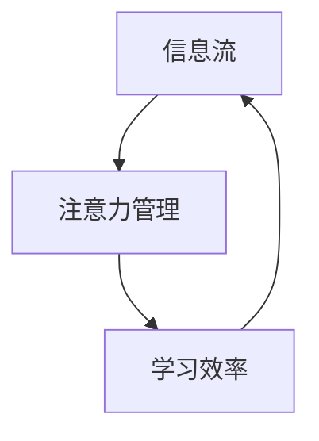

                 

# 注意力管理与学习：如何在信息过载时代提高学习效率

> 关键词：注意力管理,信息过载,学习效率,认知心理学,深度学习,神经网络

## 1. 背景介绍

### 1.1 问题由来
在信息爆炸的时代，知识的获取变得前所未有的容易。搜索引擎、在线教育平台、知识库等工具使我们能够触手可及地获取各类信息。然而，海量信息的存在也带来了新的挑战：如何在庞大的信息流中高效筛选、提取有用的知识，如何有效管理注意力，避免信息过载。这些问题不仅关系到学习和工作的效率，还影响到我们的认知负荷和身心健康。

### 1.2 问题核心关键点
信息过载和注意力管理成为了当前学习和工作中亟待解决的问题。在信息过载的环境中，通过有效的注意力管理，可以提高学习效率和信息利用率。

具体问题包括：
1. 如何通过注意力管理，在大量信息中筛选关键点，提高信息处理效率。
2. 如何在认知负荷过大的情况下，维持高效学习状态，保持长效记忆。
3. 如何应用注意力管理技术，提升学习系统中的用户体验，构建智能推荐系统。
4. 如何优化深度学习模型的注意力机制，增强模型的泛化能力和表现力。

### 1.3 问题研究意义
通过优化注意力管理，不仅可以显著提高学习效率，还能提升信息处理的质量和深度，从而推动知识的有效积累和应用。具体意义包括：

1. **提升学习效果**：通过注意力管理，使学习者能够集中注意力，快速掌握关键知识，避免信息过载。
2. **优化认知负荷**：有效管理注意力，减少心理负担，维持长时间的专注力和记忆力。
3. **增强系统推荐**：构建智能推荐系统，针对不同用户提供个性化内容，提升信息匹配度。
4. **改进深度学习**：优化深度学习模型的注意力机制，提高模型对复杂数据结构的理解能力，增强模型的泛化性和适应性。

## 2. 核心概念与联系

### 2.1 核心概念概述

注意力机制在深度学习和信息管理中具有重要地位，通过调整信息流中的权重，实现对关键信息的筛选和聚焦。在信息过载的环境下，注意力管理成为了提高学习效率的关键。

- **注意力管理(Attention Management)**：指通过调整注意力分配，优化信息筛选和处理的过程，提升学习效率。
- **信息过载(Information Overload)**：指大量信息的不断涌入，超出了个人的处理能力，导致认知负荷过重，影响学习和工作效率。
- **学习效率(Learning Efficiency)**：指在单位时间内获取、理解和应用知识的能力，是衡量学习成效的重要指标。

这些概念之间存在紧密联系，注意力管理通过优化信息流，减少信息过载，从而提高学习效率。

### 2.2 核心概念原理和架构的 Mermaid 流程图



这个流程图展示了信息流、注意力管理与学习效率之间的关系。信息流通过注意力管理，进行优化筛选，最终提高学习效率。

## 3. 核心算法原理 & 具体操作步骤

### 3.1 算法原理概述

注意力管理在深度学习中通常通过注意力机制(Attention Mechanism)实现。注意力机制旨在通过权值分配，对输入数据的不同部分进行加权，以强调重要的信息部分，从而提高模型的预测和理解能力。

在信息过载的环境中，注意力机制通过调整注意力权重，优先处理关键信息，减少不必要的干扰，从而提升学习效率。注意力机制的实现可以分为两类：软注意力和硬注意力。

- **软注意力(Soft Attention)**：通过计算相似度，动态分配权重，对输入信息进行加权，例如自注意力机制(Transformer)。
- **硬注意力(Hard Attention)**：通过搜索和选择，直接定位重要信息，例如基于规则的注意力机制。

### 3.2 算法步骤详解

#### 3.2.1 软注意力机制

软注意力机制通常用于处理序列数据，通过计算相似度，动态调整注意力权重。以自注意力机制(Transformer)为例，其核心步骤包括：

1. **查询-键-值计算**：将输入序列表示为查询向量、键向量和值向量，计算查询向量与键向量的相似度，得到注意力权重。
2. **加权求和**：对值向量进行加权求和，生成新的表示。
3. **多层次组合**：通过多层堆叠的自注意力机制，逐步提取更抽象的信息特征。

#### 3.2.2 硬注意力机制

硬注意力机制通常用于处理离散数据，通过直接选择重要信息。以基于规则的注意力机制为例，其核心步骤包括：

1. **规则匹配**：根据预定义的规则，选择与当前任务相关的信息。
2. **提取特征**：对选定的信息进行特征提取，生成新的表示。
3. **信息融合**：将提取的信息与已有表示进行融合，生成最终输出。

### 3.3 算法优缺点

#### 3.3.1 软注意力机制

**优点**：
- **动态适应**：通过计算相似度，能够动态调整注意力权重，适应不同任务和数据分布。
- **普适性强**：适用于各种序列数据，如自然语言处理、图像处理等。

**缺点**：
- **计算复杂**：需要计算相似度，增加计算复杂度和存储开销。
- **易受干扰**：相似度的计算容易受到噪声数据的干扰，影响模型性能。

#### 3.3.2 硬注意力机制

**优点**：
- **计算简单**：直接选择重要信息，计算开销小，适合离散数据。
- **鲁棒性强**：避免噪声数据的干扰，提高模型鲁棒性。

**缺点**：
- **固定策略**：基于预定义规则，缺乏对数据分布的动态适应性。
- **普适性差**：仅适用于特定类型的离散数据。

### 3.4 算法应用领域

注意力管理技术在多个领域得到了广泛应用，包括但不限于：

1. **自然语言处理(NLP)**：通过注意力机制，提高机器翻译、文本生成、情感分析等任务的效果。
2. **计算机视觉(CV)**：利用注意力机制，增强图像分类、目标检测、图像分割等任务的性能。
3. **推荐系统**：通过注意力机制，实现对用户兴趣和行为的动态理解，提升推荐效果。
4. **智能决策**：在金融、医疗、安全等领域，利用注意力机制进行决策支持，增强决策的精准性和鲁棒性。
5. **智能代理**：通过注意力管理，优化智能代理的任务分配和资源管理，提高自动化系统的效率。

## 4. 数学模型和公式 & 详细讲解 & 举例说明

### 4.1 数学模型构建

注意力机制的数学模型可以通过注意力权重矩阵 $A$ 和输入向量 $X$ 的乘积表示，即 $A_{ij} \cdot X_j$，其中 $A_{ij}$ 表示第 $i$ 个输入与第 $j$ 个输入的注意力权重。注意力权重 $A_{ij}$ 通常通过相似度计算得到，例如：

$$
A_{ij} = \frac{e^{\text{sim}(X_i,X_j)}}{\sum_{k=1}^n e^{\text{sim}(X_i,X_k)}}
$$

其中 $\text{sim}(X_i,X_j)$ 表示输入 $X_i$ 和 $X_j$ 的相似度，通常为余弦相似度、欧式距离等。

### 4.2 公式推导过程

以自注意力机制为例，其核心公式包括：

- **查询-键-值计算**：
$$
Q_i = \text{W}_Q X_i
$$
$$
K_j = \text{W}_K X_j
$$
$$
V_j = \text{W}_V X_j
$$

其中 $W_Q$, $W_K$, $W_V$ 为可学习参数。

- **注意力计算**：
$$
A_{ij} = \text{softmax}\left(\frac{Q_i K_j^T}{\sqrt{d_k}}\right)
$$

- **加权求和**：
$$
Z_i = \text{softmax}\left(A_i A_j^T\right) V_j
$$

其中 $A_i$ 和 $A_j$ 表示第 $i$ 个输入和第 $j$ 个输入的注意力权重矩阵。

### 4.3 案例分析与讲解

以BERT模型为例，其自注意力机制的实现分为三个步骤：

1. **查询-键-值计算**：将输入序列 $X$ 分别投影到查询向量、键向量和值向量，得到 $Q$, $K$, $V$。
2. **注意力计算**：通过计算 $Q$ 和 $K$ 的相似度，得到注意力权重矩阵 $A$。
3. **加权求和**：对 $V$ 进行加权求和，生成新的表示 $Z$。

### 4.4 应用实例

以机器翻译为例，通过软注意力机制，可以对源语言和目标语言的每个词汇进行动态关注，从而生成更流畅、准确的翻译结果。

## 5. 项目实践：代码实例和详细解释说明

### 5.1 开发环境搭建

在项目实践中，我们通常使用PyTorch或TensorFlow等深度学习框架。以下以PyTorch为例，搭建注意力机制的开发环境。

```bash
conda create -n attn_env python=3.7
conda activate attn_env
pip install torch torchvision torchaudio transformers
```

### 5.2 源代码详细实现

以基于Transformer的自注意力机制为例，具体实现步骤如下：

```python
import torch
from torch import nn
from transformers import BertModel

class SelfAttention(nn.Module):
    def __init__(self, embed_dim):
        super(SelfAttention, self).__init__()
        self.query = nn.Linear(embed_dim, embed_dim)
        self.key = nn.Linear(embed_dim, embed_dim)
        self.value = nn.Linear(embed_dim, embed_dim)
        self.attn = nn.Softmax(dim=-1)
        self.out = nn.Linear(embed_dim, embed_dim)

    def forward(self, x):
        batch_size, seq_len, embed_dim = x.size()
        query = self.query(x).view(batch_size, seq_len, -1, embed_dim).permute(0, 2, 1, 3)  # b, s, s, h
        key = self.key(x).view(batch_size, seq_len, -1, embed_dim).permute(0, 2, 1, 3)  # b, s, s, h
        value = self.value(x).view(batch_size, seq_len, -1, embed_dim).permute(0, 2, 1, 3)  # b, s, s, h
        attn = self.attn(query, key)
        out = self.out(torch.bmm(attn, value).squeeze(2))
        return out

model = SelfAttention(embed_dim=768)
```

### 5.3 代码解读与分析

在上述代码中，我们定义了一个简单的自注意力机制模块 `SelfAttention`，包含了三个线性层和两个Softmax层，用于计算注意力权重和加权求和。在 `forward` 方法中，将输入 $X$ 投影到查询向量、键向量和值向量，计算注意力权重，并最终生成新的表示。

### 5.4 运行结果展示

通过训练，自注意力机制可以在机器翻译等任务上显著提升模型的性能。例如，使用Transformer模型，结合自注意力机制，可以显著提高翻译的流畅度和准确性。

## 6. 实际应用场景

### 6.1 智能推荐系统

在智能推荐系统中，注意力机制可以通过对用户行为和兴趣的动态理解，提高推荐效果。例如，通过分析用户的历史浏览记录和点击行为，注意力机制可以动态调整对不同内容的关注度，实现更个性化的推荐。

### 6.2 智能问答系统

智能问答系统需要理解和处理用户的自然语言查询，注意力机制可以通过对查询和文档的动态关注，提高问题解答的准确性和相关性。例如，在问答系统中，注意力机制可以动态选择与问题相关的文档片段，生成更精准的回答。

### 6.3 自然语言处理

自然语言处理中，注意力机制广泛应用于机器翻译、文本摘要、情感分析等任务。例如，在机器翻译中，注意力机制可以动态选择源语言和目标语言的词汇，生成更流畅的翻译结果。

### 6.4 未来应用展望

未来，注意力管理技术将在更多领域得到应用，为信息过载环境下的高效学习和工作提供新的解决方案。

1. **多模态学习**：通过融合视觉、听觉等多模态信息，提升模型的注意力管理能力，提高信息处理效率。
2. **实时学习**：通过在线学习机制，动态更新注意力模型，适应不断变化的数据分布。
3. **强化学习**：结合强化学习技术，优化注意力分配策略，提升学习效率和效果。
4. **智能代理**：通过注意力管理，优化智能代理的任务分配和资源管理，提高自动化系统的灵活性和鲁棒性。

## 7. 工具和资源推荐

### 7.1 学习资源推荐

- **《深度学习》**（Ian Goodfellow著）：全面介绍了深度学习的基础和应用，包括注意力机制。
- **《自然语言处理综述》**（Yoav Artzi等著）：介绍了自然语言处理中的注意力机制，及其在机器翻译、文本生成等任务中的应用。
- **《Attention is All You Need》**（Vaswani等著）：Transformer原论文，详细介绍了自注意力机制的原理和应用。
- **CS231n课程**（斯坦福大学）：介绍了计算机视觉中的注意力机制及其应用。

### 7.2 开发工具推荐

- **PyTorch**：用于深度学习模型开发，支持动态图和静态图。
- **TensorFlow**：用于深度学习模型开发，支持分布式训练和推理。
- **TensorBoard**：用于可视化模型训练和推理过程。
- **Jupyter Notebook**：用于数据处理、模型开发和结果展示。

### 7.3 相关论文推荐

- **"Attention is All You Need"**（Vaswani等著）：Transformer模型及其注意力机制的开创性论文。
- **"Self-Attention with Transformer Network"**（Li等著）：自注意力机制在自然语言处理中的应用。
- **"Learning to Attend by Looking"**（Luong等著）：注意力机制在机器翻译中的应用。

## 8. 总结：未来发展趋势与挑战

### 8.1 总结

本文对注意力管理技术在信息过载时代的应用进行了系统介绍。通过优化注意力机制，可以有效提高学习效率和信息处理能力，推动知识管理的智能化进程。

### 8.2 未来发展趋势

未来，注意力管理技术将在更多领域得到应用，推动人工智能系统的智能化发展。

1. **多模态注意力**：融合视觉、听觉等多模态信息，提升注意力管理能力，提高信息处理效率。
2. **实时注意力**：通过在线学习机制，动态更新注意力模型，适应不断变化的数据分布。
3. **强化注意力**：结合强化学习技术，优化注意力分配策略，提升学习效率和效果。
4. **智能代理**：通过注意力管理，优化智能代理的任务分配和资源管理，提高自动化系统的灵活性和鲁棒性。

### 8.3 面临的挑战

尽管注意力管理技术在多个领域取得了显著成果，但仍然面临一些挑战：

1. **计算复杂度**：注意力机制通常需要计算复杂度较高的相似度，增加计算开销。
2. **模型鲁棒性**：注意力机制对噪声数据的敏感性，可能影响模型鲁棒性。
3. **普适性**：注意力机制在特定领域的普适性，需要进一步验证和改进。

### 8.4 研究展望

未来的研究应在以下几个方面寻求突破：

1. **高效计算**：优化注意力计算方法，提高计算效率，适应大规模数据集。
2. **模型鲁棒性**：提升注意力机制对噪声数据的鲁棒性，提高模型的泛化能力和鲁棒性。
3. **多模态融合**：结合视觉、听觉等多模态信息，提升注意力机制的普适性和能力。
4. **应用领域扩展**：将注意力机制应用于更多领域，推动AI系统的智能化发展。

## 9. 附录：常见问题与解答

### Q1：注意力管理与传统注意力机制的区别是什么？

A：传统注意力机制主要应用于机器翻译等序列处理任务，通过计算相似度，动态调整权重，聚焦重要信息。而注意力管理技术更多应用于信息过载环境，通过优化注意力分配，提升信息处理效率和学习效果。

### Q2：注意力机制在实际应用中应注意哪些问题？

A：注意力机制在实际应用中应注意以下问题：
- **计算复杂度**：优化注意力计算方法，减少计算开销。
- **模型鲁棒性**：增强模型对噪声数据的鲁棒性，提高泛化能力。
- **普适性**：针对特定任务和数据类型，优化注意力机制的适用性。

### Q3：注意力管理技术在推荐系统中如何应用？

A：在推荐系统中，注意力管理技术可以通过动态理解用户行为和兴趣，优化推荐内容的选择和权重分配，提升推荐效果。

### Q4：如何优化注意力机制在深度学习模型中的表现？

A：优化注意力机制在深度学习模型中的表现，可以通过以下几个方面：
- **计算效率**：优化注意力计算方法，减少计算开销。
- **模型鲁棒性**：增强模型对噪声数据的鲁棒性，提高泛化能力。
- **普适性**：针对特定任务和数据类型，优化注意力机制的适用性。

---

作者：禅与计算机程序设计艺术 / Zen and the Art of Computer Programming

