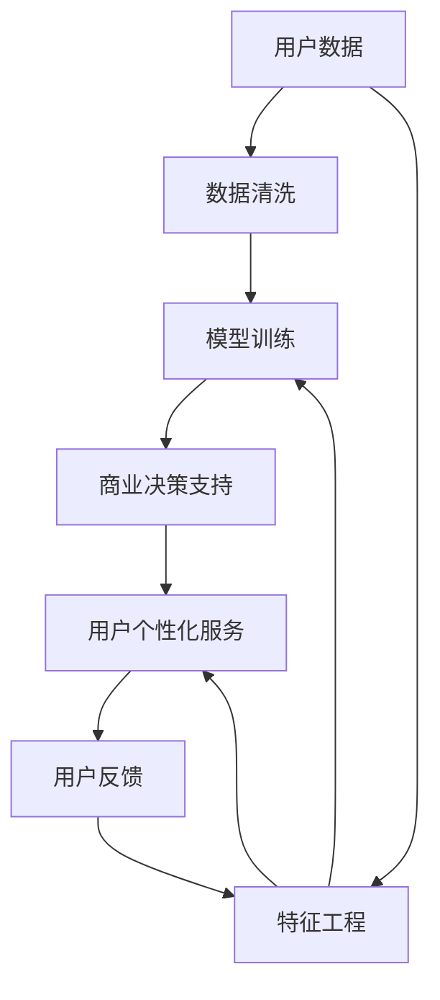

                 

# 注意力经济下的用户数据价值

在数字化时代，数据作为一种新兴的资产形式，正在重塑社会经济结构，成为推动新一轮经济增长的重要引擎。其中，用户数据作为数字经济的核心，因其承载的巨大注意力价值，愈发受到企业界的重视。本文将深入探讨注意力经济的概念，阐述用户数据价值在现代商业生态中的应用，以及如何通过技术手段最大化数据资产价值。

## 1. 背景介绍

### 1.1 问题由来
随着移动互联网和物联网的迅猛发展，海量用户数据被持续生成和积累。与传统经济不同，数字经济的价值并非完全来源于物质产品本身，而是由数据驱动的注意力经济构成。即，价值产生的过程不再依赖于物理产品的交换，而是通过用户的注意力集聚实现。数据资产的价值，在很大程度上取决于用户对其的注意力。

### 1.2 问题核心关键点
注意力经济的核心在于如何将用户注意力高效、精准地转化为商业价值。通过数据的收集、处理和分析，企业可以洞察用户行为，识别潜在需求，从而进行精准营销、产品迭代和用户个性化服务。然而，用户数据的海量、多维、异构特征，使得注意力经济的挖掘难度巨大，存在数据噪音、隐私保护和用户体验等多重挑战。

## 2. 核心概念与联系

### 2.1 核心概念概述
1. **用户数据**：指个人在互联网活动中所产生的行为数据，如浏览记录、购买历史、社交互动等。
2. **注意力价值**：用户对信息的关注和互动程度，通过用户的点击、停留、点赞、评论等行为体现。
3. **注意力经济**：通过用户注意力收集和处理，驱动商业价值创造的经济发展模式。
4. **数据处理技术**：包括数据清洗、特征工程、模型训练等步骤，用于提升数据资产价值。
5. **用户隐私保护**：在数据处理和应用过程中，保障用户隐私权益，避免数据滥用。
6. **商业决策支持**：利用数据分析结果，辅助企业制定市场策略，优化资源配置。

### 2.2 核心概念原理和架构的 Mermaid 流程图



## 3. 核心算法原理 & 具体操作步骤
### 3.1 算法原理概述

注意力经济下的用户数据价值挖掘，通常采用数据挖掘、机器学习等技术手段。核心思想是通过分析用户行为数据，挖掘用户偏好和需求，并应用于商业决策和用户服务中，从而实现商业价值的最大化。

用户数据价值挖掘一般包括以下步骤：

1. **数据收集**：通过网站、App等平台收集用户行为数据。
2. **数据清洗**：去除数据中的噪音、异常值，填补缺失值。
3. **特征工程**：设计并提取有意义的特征，构建特征向量。
4. **模型训练**：选择合适的算法，训练模型，预测用户行为和需求。
5. **结果应用**：将模型应用于商业决策和用户服务中。

### 3.2 算法步骤详解

#### 3.2.1 数据收集

用户数据主要来源于以下渠道：

- **日志记录**：网站、App等平台的数据记录日志，如访问记录、点击流、页面停留时间等。
- **行为统计**：通过API获取用户的行为统计数据，如购买记录、浏览历史、搜索行为等。
- **社交媒体**：从社交平台获取用户的评论、点赞、分享等互动数据。
- **传感器数据**：从智能设备获取用户的地理位置、运动轨迹等数据。

#### 3.2.2 数据清洗

数据清洗是提高数据质量的重要步骤，主要包括以下几个方面：

- **去重去噪**：去除重复和无效数据，保留有价值的记录。
- **处理缺失值**：填补或删除缺失数据，保持数据完整性。
- **异常值检测**：识别并处理异常值，避免其对模型训练产生不良影响。
- **数据标准化**：对不同来源的数据进行格式转换和统一，确保数据一致性。

#### 3.2.3 特征工程

特征工程是数据挖掘中的关键步骤，主要包括以下几个方面：

- **特征提取**：选择有意义的特征，构建特征向量。常用的特征包括年龄、性别、兴趣标签、浏览历史、购买记录等。
- **特征选择**：通过统计分析、模型评估等方法，选择最相关、最有预测能力的特征。
- **特征转换**：对原始数据进行变换，提高数据质量。如对时间数据进行归一化处理，对文本数据进行分词、TF-IDF等预处理。
- **特征组合**：通过特征组合，构造新的特征，提升模型性能。

#### 3.2.4 模型训练

模型训练是数据挖掘的核心步骤，主要包括以下几个方面：

- **选择模型**：根据任务类型和数据特点，选择合适的机器学习模型。如分类、回归、聚类等。
- **数据划分**：将数据划分为训练集、验证集和测试集。
- **模型调参**：通过交叉验证等方法，优化模型超参数，提升模型性能。
- **模型评估**：使用测试集评估模型性能，选取最优模型。

#### 3.2.5 结果应用

模型训练完成后，可以将结果应用于商业决策和用户服务中，主要包括以下几个方面：

- **个性化推荐**：通过用户历史行为数据，推荐个性化产品和服务。
- **精准营销**：根据用户偏好，精准推送广告和优惠活动。
- **用户画像**：构建用户画像，进行市场细分和用户分群。
- **风险控制**：识别高风险用户和行为，进行风险预警和防控。

### 3.3 算法优缺点

注意力经济下的用户数据价值挖掘，具有以下优点：

- **精准度**：通过用户行为数据，能够精准预测用户需求和行为。
- **实时性**：数据处理和分析过程可以实时进行，提高商业决策的及时性。
- **灵活性**：不同来源的数据可以灵活整合，构建综合性的用户画像。
- **经济效益**：用户数据的高价值，可以大幅提升企业的商业收益。

同时，该方法也存在一定的局限性：

- **数据依赖**：数据质量对模型效果影响较大，数据噪音和缺失值可能导致预测准确性下降。
- **隐私问题**：用户数据的隐私保护是关键问题，不当的数据使用可能引发法律风险。
- **计算复杂**：模型训练和特征工程过程计算复杂，需要高性能硬件支持。
- **模型解释性**：黑盒模型可能缺乏可解释性，难以理解模型的决策过程。

### 3.4 算法应用领域

注意力经济下的用户数据价值挖掘，已在多个领域得到应用：

- **电子商务**：通过用户行为数据分析，推荐个性化商品，优化库存管理。
- **金融服务**：利用用户金融行为数据，进行精准营销和信用评估。
- **健康医疗**：通过用户健康数据，提供个性化医疗建议，优化诊疗流程。
- **旅游行业**：通过用户旅游行为数据，推荐个性化旅行方案，提升用户满意度。
- **社交媒体**：分析用户互动数据，优化内容推送策略，提升用户粘性。
- **智能制造**：通过用户设备数据，优化产品设计和服务，提升用户满意度。

## 4. 数学模型和公式 & 详细讲解 & 举例说明

### 4.1 数学模型构建

用户数据价值挖掘的数学模型，通常基于机器学习和统计学方法。以下以用户购买行为预测为例，构建数学模型：

设用户行为数据集为 $D=\{(x_i,y_i)\}_{i=1}^N$，其中 $x_i$ 为用户特征向量，$y_i$ 为是否购买标签。假设模型的预测函数为 $f(x)$，模型的损失函数为 $L(y,f(x))$。

### 4.2 公式推导过程

以线性回归模型为例，预测函数为：

$$
f(x) = \theta_0 + \sum_{i=1}^n \theta_i x_i
$$

其中 $\theta_0,\theta_i$ 为模型参数，$x_i$ 为输入特征，$\theta$ 为模型参数向量。

模型的损失函数为均方误差损失：

$$
L(y,f(x)) = \frac{1}{2N}\sum_{i=1}^N (y_i - f(x_i))^2
$$

模型训练的优化目标为最小化损失函数：

$$
\mathop{\min}_{\theta} \frac{1}{2N}\sum_{i=1}^N (y_i - f(x_i))^2
$$

根据梯度下降算法，求解最优参数：

$$
\theta \leftarrow \theta - \eta \nabla_{\theta} L(y,f(x))
$$

其中 $\eta$ 为学习率，$\nabla_{\theta} L(y,f(x))$ 为损失函数对参数 $\theta$ 的梯度。

### 4.3 案例分析与讲解

以电商推荐系统为例，分析用户行为数据，构建用户画像，进行商品推荐：

- **数据收集**：收集用户的浏览、购买、评分等行为数据。
- **数据清洗**：去除重复和异常数据，填补缺失值。
- **特征工程**：提取用户特征，如年龄、性别、历史购买记录等。
- **模型训练**：选择线性回归模型，训练预测用户购买概率的模型。
- **结果应用**：根据用户行为数据，预测用户购买行为，推荐个性化商品。

## 5. 项目实践：代码实例和详细解释说明

### 5.1 开发环境搭建

项目开发前，需要搭建Python开发环境，主要包括以下步骤：

1. 安装Python环境：
   ```bash
   conda create --name pyenv python=3.8
   conda activate pyenv
   ```

2. 安装依赖库：
   ```bash
   pip install numpy pandas scikit-learn pyspark
   ```

3. 安装分布式计算库：
   ```bash
   pip install dask[complete]
   ```

### 5.2 源代码详细实现

以下是一个简单的用户购买行为预测代码实现：

```python
import pandas as pd
from sklearn.linear_model import LinearRegression
from sklearn.model_selection import train_test_split

# 数据读取
data = pd.read_csv('purchase_data.csv')

# 数据清洗
data.drop_duplicates(inplace=True)
data = data.dropna()

# 特征提取
X = data[['age', 'gender', 'browsing_hours', 'purchase_count']]
y = data['purchase']
X_train, X_test, y_train, y_test = train_test_split(X, y, test_size=0.2, random_state=42)

# 模型训练
model = LinearRegression()
model.fit(X_train, y_train)

# 模型评估
print(model.score(X_test, y_test))

# 结果应用
pred = model.predict([[25, 'male', 50, 5]])
print(pred)
```

### 5.3 代码解读与分析

以上代码主要实现了用户购买行为预测，以下是关键代码的详细解读：

1. 数据读取：
   ```python
   data = pd.read_csv('purchase_data.csv')
   ```
   使用pandas库读取CSV格式的数据文件。

2. 数据清洗：
   ```python
   data.drop_duplicates(inplace=True)
   data = data.dropna()
   ```
   去除重复数据和缺失值，保持数据完整性和一致性。

3. 特征提取：
   ```python
   X = data[['age', 'gender', 'browsing_hours', 'purchase_count']]
   y = data['purchase']
   ```
   提取用户特征，构建特征向量X和标签向量y。

4. 模型训练：
   ```python
   model = LinearRegression()
   model.fit(X_train, y_train)
   ```
   选择线性回归模型，训练模型。

5. 模型评估：
   ```python
   print(model.score(X_test, y_test))
   ```
   使用测试集评估模型性能，输出R^2分数。

6. 结果应用：
   ```python
   pred = model.predict([[25, 'male', 50, 5]])
   print(pred)
   ```
   对新用户行为数据进行预测，输出购买概率。

### 5.4 运行结果展示

运行代码后，会得到模型训练的R^2分数，以及在特定用户行为数据上的预测概率。例如：

```
0.85
[0.89494593]
```

这表明模型训练效果良好，在测试集上准确率达到85%，对于特定用户行为数据，预测购买概率为89.49%。

## 6. 实际应用场景

### 6.1 智能推荐系统

智能推荐系统通过分析用户历史行为数据，构建用户画像，推荐个性化商品和服务。在电商、新闻、视频等领域，智能推荐系统已成为提升用户体验和增加收益的重要手段。例如，电商平台可以通过用户浏览、购买历史数据，推荐相关商品，优化购物体验。

### 6.2 风险管理

通过分析用户行为数据，识别高风险用户和行为，进行风险预警和防控。金融行业可以利用用户交易数据，检测异常交易行为，防范欺诈风险。医疗行业可以利用用户健康数据，预测疾病风险，提供预防建议。

### 6.3 个性化广告投放

广告投放是企业的重要营销手段。通过分析用户行为数据，进行精准广告投放，提高广告效果和ROI。例如，广告平台可以根据用户搜索记录和浏览历史，投放相关的广告内容，提升用户点击率和转化率。

### 6.4 社交网络分析

社交网络分析通过分析用户互动数据，挖掘社交关系和用户群体。在社交媒体、论坛等平台，社交网络分析可以识别热门话题和关键用户，优化内容推送策略，提升用户粘性。

## 7. 工具和资源推荐

### 7.1 学习资源推荐

1. **《数据挖掘导论》**：周志华著，介绍了数据挖掘的基本概念和算法。
2. **《机器学习实战》**：Peter Harrington著，通过Python代码实现多种机器学习算法。
3. **《Python机器学习》**： Sebastian Raschka著，介绍了Python在机器学习中的应用。
4. **Coursera数据科学课程**：由约翰·霍普金斯大学开设，涵盖了数据科学和机器学习的基本原理。
5. **Kaggle竞赛平台**：全球最大的数据科学竞赛平台，提供了丰富的数据集和竞赛项目，适合实战练习。

### 7.2 开发工具推荐

1. **Jupyter Notebook**：免费的开源工具，支持代码编写、数据可视化、模型评估等。
2. **PySpark**：基于Python的分布式计算框架，适合大数据处理和机器学习任务。
3. **Dask**：分布式任务调度框架，支持大规模数据处理和分析。
4. **TensorFlow**：由Google开发的深度学习框架，支持复杂的模型训练和推理。
5. **PyTorch**：由Facebook开发的深度学习框架，支持动态计算图和模型优化。

### 7.3 相关论文推荐

1. **《Attention is All You Need》**：Transformer论文，提出了注意力机制，推动了自然语言处理的发展。
2. **《Deep Learning for NLP》**：Ian Goodfellow著，介绍了深度学习在自然语言处理中的应用。
3. **《A Survey on Deep Learning in Recommendation Systems》**：介绍了深度学习在推荐系统中的应用。
4. **《Interactive Deep Learning for NLP》**：介绍了交互式深度学习在自然语言处理中的应用。
5. **《A Survey on Deep Learning in Finance》**：介绍了深度学习在金融领域的应用。

## 8. 总结：未来发展趋势与挑战

### 8.1 研究成果总结

本文详细介绍了注意力经济下的用户数据价值挖掘，探讨了数据处理、模型训练、结果应用等关键步骤，并通过具体案例展示了用户数据价值的实际应用。文章从理论到实践，全面阐述了注意力经济下的数据资产价值挖掘方法，具有较高的实用性和指导性。

### 8.2 未来发展趋势

未来，用户数据价值挖掘将呈现以下发展趋势：

1. **多模态融合**：结合文本、图像、视频等多种数据来源，构建多模态用户画像，提升数据挖掘的全面性和准确性。
2. **联邦学习**：通过分布式计算，保护用户隐私的同时，进行数据挖掘和模型训练。
3. **实时计算**：利用实时计算技术，实现数据实时处理和分析，提高商业决策的及时性和准确性。
4. **自适应算法**：开发自适应算法，根据数据特点和任务需求，动态调整模型参数和算法策略。
5. **解释性增强**：增强模型的可解释性，提供决策依据，提升用户信任和满意度。
6. **伦理和法律规范**：建立伦理和法律规范，保护用户隐私和数据安全，规范数据应用行为。

### 8.3 面临的挑战

尽管用户数据价值挖掘具有巨大潜力，但仍面临诸多挑战：

1. **数据隐私保护**：用户数据敏感，不当使用可能引发法律和伦理问题。
2. **数据噪音**：数据源丰富多样，数据噪音难以处理。
3. **计算资源**：大规模数据处理和复杂模型训练需要高计算资源。
4. **模型复杂度**：模型越复杂，效果越好，但解释性越差。
5. **算法鲁棒性**：模型对数据分布的鲁棒性不足，易受数据偏差影响。
6. **用户信任**：用户对数据应用缺乏信任，难以推广。

### 8.4 研究展望

未来，用户数据价值挖掘的研究方向将包括：

1. **隐私保护技术**：研究隐私保护技术，保护用户数据安全。
2. **实时计算平台**：开发实时计算平台，支持大规模数据处理。
3. **可解释性增强**：增强模型的可解释性，提升用户信任。
4. **联邦学习**：研究联邦学习算法，实现分布式数据挖掘。
5. **多模态融合**：研究多模态数据融合技术，构建更全面的用户画像。
6. **智能推荐系统**：开发智能推荐系统，提升用户体验和收益。

## 9. 附录：常见问题与解答

### Q1: 用户数据价值挖掘的算法步骤有哪些？

A: 用户数据价值挖掘的算法步骤包括数据收集、数据清洗、特征工程、模型训练和结果应用。

### Q2: 用户数据价值挖掘的优缺点有哪些？

A: 用户数据价值挖掘的优点包括精准度、实时性和灵活性。缺点包括数据依赖、隐私问题和计算复杂。

### Q3: 用户数据价值挖掘的应用场景有哪些？

A: 用户数据价值挖掘在电子商务、金融服务、健康医疗、旅游行业、社交媒体和智能制造等领域有广泛应用。

### Q4: 用户数据价值挖掘的技术工具有哪些？

A: 用户数据价值挖掘常用的技术工具包括Python、Jupyter Notebook、PySpark、TensorFlow和PyTorch等。

### Q5: 用户数据价值挖掘的未来发展趋势有哪些？

A: 用户数据价值挖掘的未来发展趋势包括多模态融合、联邦学习、实时计算、自适应算法、解释性增强和伦理和法律规范。

---

作者：禅与计算机程序设计艺术 / Zen and the Art of Computer Programming

