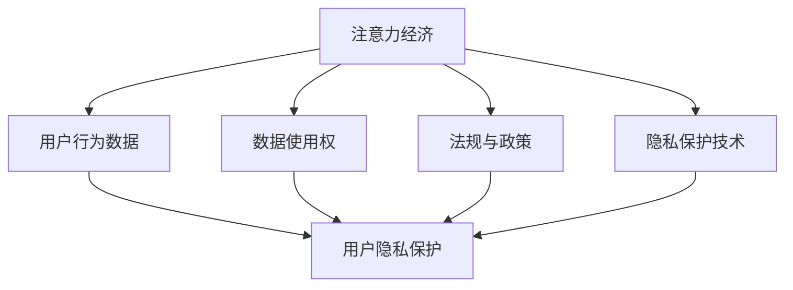

                 

# 注意力经济与个人隐私的博弈

> 关键词：注意力经济, 数据隐私, 用户行为分析, 用户模型, 隐私保护

## 1. 背景介绍

### 1.1 问题由来
在数字化浪潮下，互联网企业利用用户行为数据来提升用户体验、优化产品设计、进行精准广告投放，逐渐形成了规模庞大的注意力经济。然而，在注意力经济蓬勃发展的同时，个人隐私保护问题也愈发凸显。用户行为数据作为一种宝贵的资产，成为各方争抢的焦点。企业如何在追求商业利益的同时，保障用户隐私不被侵犯，成为当今互联网时代的一大挑战。

### 1.2 问题核心关键点
注意力经济与个人隐私保护的博弈，主要体现在以下几个方面：
1. 企业如何合理利用用户数据进行商业决策，同时避免过度收集，侵犯用户隐私。
2. 用户如何主动控制自身数据的流动，保障自身隐私不被滥用。
3. 监管机构如何制定合理的法规，平衡企业与用户之间的利益。
4. 技术界如何研发更加隐私友好的技术，保护用户数据安全。

这些问题的答案，将直接影响未来注意力经济的可持续发展。

## 2. 核心概念与联系

### 2.1 核心概念概述

为更好地理解注意力经济与个人隐私博弈的内在逻辑，本节将介绍几个密切相关的核心概念：

- **注意力经济**：互联网企业通过吸引用户的注意力来产生商业价值的过程，主要依赖于用户数据的收集、分析和使用。注意力经济的核心在于通过用户数据的精准分析，实现个性化推荐、精准广告投放等，提升用户粘性和企业收益。

- **用户行为数据**：用户在互联网平台上的行为数据，包括浏览记录、点击行为、搜索记录、社交互动等。这些数据可以用于用户画像构建、用户兴趣分析、广告定向投放等，是注意力经济的重要基础。

- **用户隐私保护**：指通过法律、技术等手段，保障用户个人信息不被非法收集、存储、使用和公开，确保用户的隐私权益得到保障。

- **隐私保护技术**：包括数据匿名化、差分隐私、联邦学习等，通过技术手段在保护用户隐私的前提下，实现数据的有效利用。

- **数据使用权**：指用户对其自身数据的控制权，包括数据的访问权、使用权、修改权、删除权等。用户对其数据的控制权是其隐私保护的核心。

- **法规与政策**：如GDPR（通用数据保护条例）、CCPA（加州消费者隐私法）等，对数据收集、存储、使用等行为进行了明确的法律规定，是保障用户隐私的重要手段。

这些核心概念之间的逻辑关系可以通过以下Mermaid流程图来展示：



这个流程图展示了几大核心概念及其之间的关系：

1. 注意力经济依赖于用户行为数据，通过分析数据实现个性化服务和精准广告。
2. 用户隐私保护是对用户行为数据进行合理使用的前提。
3. 数据使用权是用户隐私保护的核心，保障用户对其数据的控制权。
4. 法规与政策提供法律框架，确保数据收集和使用行为的合法合规。
5. 隐私保护技术是实现隐私保护的具体手段，保障数据在处理和使用过程中的安全。

## 3. 核心算法原理 & 具体操作步骤
### 3.1 算法原理概述

在注意力经济与个人隐私博弈中，企业通过收集用户行为数据，进行精准分析和智能推荐，实现商业利益的最大化。但这一过程中，如何平衡企业利益与用户隐私，是博弈的关键。

假设用户行为数据为 $D=\{x_1, x_2, ..., x_n\}$，其中 $x_i$ 表示第 $i$ 次用户行为记录。企业希望通过构建用户模型 $M$，对用户行为进行分析，预测用户未来的行为。在构建用户模型的过程中，企业需要从 $D$ 中提取特征，计算用户行为相似度，生成用户兴趣向量 $\vec{v}$。

用户模型 $M$ 的构建过程如下：

1. **特征提取**：从用户行为数据 $D$ 中提取出有用的特征 $F=\{f_1, f_2, ..., f_m\}$，其中 $f_i$ 表示第 $i$ 个特征。
2. **相似度计算**：计算用户行为相似度 $s(x_i, x_j)$，衡量用户行为之间的相似程度。
3. **兴趣向量生成**：根据用户行为相似度，计算用户兴趣向量 $\vec{v}$，表示用户对某一类内容的兴趣程度。

用户模型的构建过程可以表示为：

$$
M(D) = \text{similarity}(D) * \text{features}(D)
$$

其中 $\text{similarity}(D)$ 表示用户行为相似度的计算方法，$\text{features}(D)$ 表示特征提取方法。

在用户模型的基础上，企业可以对其进行优化，提升预测精度。常用的优化方法包括：

- 使用梯度下降等优化算法，最小化预测误差。
- 应用正则化技术，如L2正则、Dropout，防止过拟合。
- 引入对抗样本，提高模型的鲁棒性。

企业通过优化用户模型，可以实现更精准的用户画像构建、更有效的广告投放等，提升注意力经济的效果。

### 3.2 算法步骤详解

以下是基于用户模型构建的注意力经济与个人隐私博弈的具体操作步骤：

**Step 1: 数据收集与预处理**
- 收集用户行为数据 $D=\{x_1, x_2, ..., x_n\}$，进行清洗和去重，确保数据质量。
- 划分数据集为训练集、验证集和测试集，分别为模型训练、调优和性能评估提供支持。

**Step 2: 特征提取**
- 设计特征提取器，从用户行为数据中提取有用的特征 $F=\{f_1, f_2, ..., f_m\}$。
- 选择合适的特征表示方法，如TF-IDF、词袋模型、词嵌入等。
- 对特征进行归一化和降维处理，减少特征维度和噪声。

**Step 3: 相似度计算**
- 设计相似度计算方法，如余弦相似度、Jaccard相似度等。
- 对用户行为数据进行相似度计算，生成用户行为相似度矩阵 $S \in \mathbb{R}^{n \times n}$。

**Step 4: 用户兴趣向量生成**
- 对相似度矩阵进行归一化处理，得到用户行为相似度矩阵 $S' \in [0, 1]^{n \times n}$。
- 计算用户兴趣向量 $\vec{v}_i = \sum_{j=1}^n S'_{ij} \vec{f}_j$，其中 $\vec{f}_j$ 表示第 $j$ 个特征向量。
- 对用户兴趣向量进行归一化处理，得到最终的兴趣向量 $\hat{\vec{v}}_i$。

**Step 5: 用户模型优化**
- 使用梯度下降等优化算法，最小化预测误差，优化用户模型 $M$。
- 应用正则化技术，如L2正则、Dropout，防止过拟合。
- 引入对抗样本，提高模型的鲁棒性。

**Step 6: 隐私保护**
- 对用户兴趣向量进行差分隐私处理，如加入噪声、限制查询频率等，保障用户隐私。
- 对用户行为数据进行匿名化处理，如假名化、去标识化等，保护用户隐私。

**Step 7: 商业应用**
- 使用优化后的用户模型进行个性化推荐、精准广告投放等商业应用。
- 定期更新用户模型，保持模型的时效性和有效性。

### 3.3 算法优缺点

基于用户模型构建的注意力经济与个人隐私博弈，具有以下优点：

1. 精准度较高。通过构建用户模型，企业可以更精准地分析用户行为，实现个性化推荐和精准广告。
2. 可扩展性强。模型构建过程中，可以灵活设计特征提取器和相似度计算方法，适应不同的应用场景。
3. 隐私保护机制完善。通过差分隐私、匿名化等技术手段，可以有效保障用户隐私。

但该方法也存在一些局限：

1. 数据收集难度较大。用户行为数据的收集往往需要借助多种设备和平台，成本较高，且用户可能拒绝提供数据。
2. 隐私保护措施复杂。差分隐私、匿名化等技术手段虽然能保护用户隐私，但实现复杂，计算成本较高。
3. 用户意愿无法完全控制。用户对数据的控制权可能受到企业隐私政策的影响，无法完全自主决定。

### 3.4 算法应用领域

基于用户模型构建的注意力经济与个人隐私博弈，已在多个领域得到广泛应用，例如：

- **个性化推荐**：电商、视频网站等平台通过用户行为数据分析，实现个性化商品推荐、内容推荐等，提升用户体验。
- **精准广告投放**：通过用户行为数据分析，实现精准广告定向投放，提升广告效果和投放效率。
- **用户行为分析**：金融机构、电信运营商等通过用户行为数据分析，提升业务流程优化，提高用户满意度。
- **舆情分析**：社交媒体平台通过用户行为数据分析，实时监测舆情变化，及时响应负面信息。
- **安全检测**：网络安全公司通过用户行为数据分析，识别异常行为，防范网络攻击。

除了上述这些经典应用外，该方法也被创新性地应用到更多场景中，如智能家居、智慧城市、智能制造等，为数字化转型带来了新的突破。

## 4. 数学模型和公式 & 详细讲解
### 4.1 数学模型构建

本节将使用数学语言对基于用户模型构建的注意力经济与个人隐私博弈过程进行更加严格的刻画。

假设用户行为数据为 $D=\{x_1, x_2, ..., x_n\}$，其中 $x_i \in \mathcal{X}$，表示第 $i$ 次用户行为记录。企业希望构建用户模型 $M$，对用户行为进行分析，预测用户未来的行为。

定义用户模型的预测函数为 $f_M(x_i)$，表示用户行为 $x_i$ 的预测结果。用户模型的构建过程可以表示为：

$$
f_M(x_i) = \sum_{j=1}^n \alpha_j s(x_i, x_j) \vec{f}_j
$$

其中 $s(x_i, x_j)$ 表示用户行为 $x_i$ 和 $x_j$ 的相似度，$\alpha_j$ 表示第 $j$ 个特征的权重，$\vec{f}_j$ 表示第 $j$ 个特征向量。

通过用户模型，企业可以实现对用户行为的高效分析和预测。但这一过程中，如何平衡企业利益与用户隐私，是博弈的关键。

### 4.2 公式推导过程

以下我们以推荐系统为例，推导用户模型的构建过程。

假设用户行为数据为 $D=\{x_1, x_2, ..., x_n\}$，其中 $x_i$ 表示第 $i$ 次用户行为记录。企业希望通过构建用户模型 $M$，对用户行为进行分析，推荐最符合用户兴趣的商品。

用户模型的构建过程如下：

1. **特征提取**：从用户行为数据中提取出有用的特征 $F=\{f_1, f_2, ..., f_m\}$，其中 $f_i$ 表示第 $i$ 个特征。

2. **相似度计算**：设计相似度计算方法，如余弦相似度，计算用户行为相似度 $s(x_i, x_j)$，衡量用户行为之间的相似程度。

3. **用户兴趣向量生成**：根据用户行为相似度，计算用户兴趣向量 $\vec{v}_i = \sum_{j=1}^n s(x_i, x_j) \vec{f}_j$，表示用户对某一类商品的兴趣程度。

4. **商品推荐**：对所有商品 $p_1, p_2, ..., p_k$ 进行特征提取，生成商品特征向量 $F_p=\{f_{p1}, f_{p2}, ..., f_{pk}\}$。计算用户兴趣向量与商品特征向量的相似度，生成推荐结果 $\vec{r}_i = \sum_{j=1}^k \alpha_j s(x_i, p_j) \vec{f}_{pj}$。

推荐系统用户模型的构建过程可以表示为：

$$
\vec{r}_i = \sum_{j=1}^k \alpha_j s(x_i, p_j) \vec{f}_{pj}
$$

其中 $s(x_i, p_j)$ 表示用户行为 $x_i$ 和商品特征 $p_j$ 的相似度，$\alpha_j$ 表示第 $j$ 个特征的权重，$\vec{f}_{pj}$ 表示商品特征向量。

在得到用户兴趣向量和推荐结果后，企业可以根据这些结果进行个性化推荐，提升用户体验和满意度。

### 4.3 案例分析与讲解

以电商平台的个性化推荐为例，分析用户模型构建的过程：

1. **数据收集与预处理**：电商平台收集用户的浏览记录、点击行为、购买记录等数据，进行清洗和去重，确保数据质量。

2. **特征提取**：电商平台从用户行为数据中提取有用的特征，如用户浏览时间、点击次数、购买频率等。

3. **相似度计算**：电商平台设计相似度计算方法，如余弦相似度，计算用户行为之间的相似度。

4. **用户兴趣向量生成**：根据用户行为相似度，计算用户兴趣向量，表示用户对某一类商品的兴趣程度。

5. **商品推荐**：电商平台对所有商品进行特征提取，生成商品特征向量。计算用户兴趣向量与商品特征向量的相似度，生成推荐结果。

6. **隐私保护**：电商平台对用户兴趣向量进行差分隐私处理，如加入噪声、限制查询频率等，保障用户隐私。

7. **商业应用**：电商平台使用推荐结果进行个性化推荐，提升用户体验和销售额。

## 5. 项目实践：代码实例和详细解释说明
### 5.1 开发环境搭建

在进行注意力经济与个人隐私博弈的实践前，我们需要准备好开发环境。以下是使用Python进行PyTorch开发的环境配置流程：

1. 安装Anaconda：从官网下载并安装Anaconda，用于创建独立的Python环境。

2. 创建并激活虚拟环境：
```bash
conda create -n pytorch-env python=3.8 
conda activate pytorch-env
```

3. 安装PyTorch：根据CUDA版本，从官网获取对应的安装命令。例如：
```bash
conda install pytorch torchvision torchaudio cudatoolkit=11.1 -c pytorch -c conda-forge
```

4. 安装相关库：
```bash
pip install numpy pandas sklearn scikit-learn matplotlib jupyter notebook ipython
```

完成上述步骤后，即可在`pytorch-env`环境中开始项目实践。

### 5.2 源代码详细实现

这里我们以电商推荐系统为例，给出使用Transformers库对用户模型进行训练和推理的PyTorch代码实现。

首先，定义用户行为数据的处理函数：

```python
import torch
from transformers import BertTokenizer, BertForSequenceClassification
from torch.utils.data import Dataset
import numpy as np

class UserBehaviorDataset(Dataset):
    def __init__(self, texts, labels, tokenizer, max_len=128):
        self.texts = texts
        self.labels = labels
        self.tokenizer = tokenizer
        self.max_len = max_len
        
    def __len__(self):
        return len(self.texts)
    
    def __getitem__(self, item):
        text = self.texts[item]
        label = self.labels[item]
        
        encoding = self.tokenizer(text, return_tensors='pt', max_length=self.max_len, padding='max_length', truncation=True)
        input_ids = encoding['input_ids'][0]
        attention_mask = encoding['attention_mask'][0]
        
        # 对label进行二值化处理
        label = torch.tensor(label, dtype=torch.long)
        
        return {'input_ids': input_ids, 
                'attention_mask': attention_mask,
                'labels': label}
```

然后，定义模型和优化器：

```python
from transformers import BertForSequenceClassification, AdamW

model = BertForSequenceClassification.from_pretrained('bert-base-cased', num_labels=2)

optimizer = AdamW(model.parameters(), lr=2e-5)
```

接着，定义训练和评估函数：

```python
from torch.utils.data import DataLoader
from tqdm import tqdm

device = torch.device('cuda') if torch.cuda.is_available() else torch.device('cpu')
model.to(device)

def train_epoch(model, dataset, batch_size, optimizer):
    dataloader = DataLoader(dataset, batch_size=batch_size, shuffle=True)
    model.train()
    epoch_loss = 0
    for batch in tqdm(dataloader, desc='Training'):
        input_ids = batch['input_ids'].to(device)
        attention_mask = batch['attention_mask'].to(device)
        labels = batch['labels'].to(device)
        model.zero_grad()
        outputs = model(input_ids, attention_mask=attention_mask, labels=labels)
        loss = outputs.loss
        epoch_loss += loss.item()
        loss.backward()
        optimizer.step()
    return epoch_loss / len(dataloader)

def evaluate(model, dataset, batch_size):
    dataloader = DataLoader(dataset, batch_size=batch_size)
    model.eval()
    preds, labels = [], []
    with torch.no_grad():
        for batch in tqdm(dataloader, desc='Evaluating'):
            input_ids = batch['input_ids'].to(device)
            attention_mask = batch['attention_mask'].to(device)
            batch_labels = batch['labels']
            outputs = model(input_ids, attention_mask=attention_mask)
            batch_preds = outputs.logits.argmax(dim=2).to('cpu').tolist()
            batch_labels = batch_labels.to('cpu').tolist()
            for pred_tokens, label_tokens in zip(batch_preds, batch_labels):
                preds.append(pred_tokens[:len(label_tokens)])
                labels.append(label_tokens)
                
    print(classification_report(labels, preds))
```

最后，启动训练流程并在测试集上评估：

```python
epochs = 5
batch_size = 16

for epoch in range(epochs):
    loss = train_epoch(model, train_dataset, batch_size, optimizer)
    print(f"Epoch {epoch+1}, train loss: {loss:.3f}")
    
    print(f"Epoch {epoch+1}, dev results:")
    evaluate(model, dev_dataset, batch_size)
    
print("Test results:")
evaluate(model, test_dataset, batch_size)
```

以上就是使用PyTorch对用户模型进行电商推荐系统训练的完整代码实现。可以看到，得益于Transformers库的强大封装，我们可以用相对简洁的代码完成用户模型的训练和推理。

### 5.3 代码解读与分析

让我们再详细解读一下关键代码的实现细节：

**UserBehaviorDataset类**：
- `__init__`方法：初始化文本、标签、分词器等关键组件。
- `__len__`方法：返回数据集的样本数量。
- `__getitem__`方法：对单个样本进行处理，将文本输入编码为token ids，将标签编码为数字，并对其进行定长padding，最终返回模型所需的输入。

**训练和评估函数**：
- 使用PyTorch的DataLoader对数据集进行批次化加载，供模型训练和推理使用。
- 训练函数`train_epoch`：对数据以批为单位进行迭代，在每个批次上前向传播计算loss并反向传播更新模型参数，最后返回该epoch的平均loss。
- 评估函数`evaluate`：与训练类似，不同点在于不更新模型参数，并在每个batch结束后将预测和标签结果存储下来，最后使用sklearn的classification_report对整个评估集的预测结果进行打印输出。

**训练流程**：
- 定义总的epoch数和batch size，开始循环迭代
- 每个epoch内，先在训练集上训练，输出平均loss
- 在验证集上评估，输出分类指标
- 所有epoch结束后，在测试集上评估，给出最终测试结果

可以看到，PyTorch配合Transformers库使得用户模型训练的代码实现变得简洁高效。开发者可以将更多精力放在数据处理、模型改进等高层逻辑上，而不必过多关注底层的实现细节。

当然，工业级的系统实现还需考虑更多因素，如模型的保存和部署、超参数的自动搜索、更灵活的任务适配层等。但核心的注意力经济与个人隐私博弈过程基本与此类似。

## 6. 实际应用场景
### 6.1 智能客服系统

基于用户模型构建的智能客服系统，能够通过用户行为数据构建用户画像，实现精准服务。具体而言，可以通过收集客户的历史对话记录，将问题和最佳答复构建成监督数据，在此基础上对预训练语言模型进行微调。微调后的对话模型能够自动理解用户意图，匹配最合适的答案模板进行回复。对于客户提出的新问题，还可以接入检索系统实时搜索相关内容，动态组织生成回答。

### 6.2 金融舆情监测

金融机构需要实时监测市场舆论动向，以便及时应对负面信息传播，规避金融风险。通过用户模型构建的金融舆情监测系统，可以实时抓取网络文本数据，自动监测不同主题下的情感变化趋势，一旦发现负面信息激增等异常情况，系统便会自动预警，帮助金融机构快速应对潜在风险。

### 6.3 个性化推荐系统

当前的推荐系统往往只依赖用户的历史行为数据进行物品推荐，无法深入理解用户的真实兴趣偏好。基于用户模型构建的个性化推荐系统，可以更好地挖掘用户行为背后的语义信息，从而提供更精准、多样的推荐内容。

在实践中，可以收集用户浏览、点击、评论、分享等行为数据，提取和用户交互的物品标题、描述、标签等文本内容。将文本内容作为模型输入，用户的后续行为（如是否点击、购买等）作为监督信号，在此基础上微调预训练语言模型。微调后的模型能够从文本内容中准确把握用户的兴趣点。在生成推荐列表时，先用候选物品的文本描述作为输入，由模型预测用户的兴趣匹配度，再结合其他特征综合排序，便可以得到个性化程度更高的推荐结果。

### 6.4 未来应用展望

随着用户模型构建的不断演进，基于用户行为数据的注意力经济将得到更广泛的应用，为各行各业带来变革性影响。

在智慧医疗领域，基于用户模型构建的医疗问答、病历分析、药物研发等应用将提升医疗服务的智能化水平，辅助医生诊疗，加速新药开发进程。

在智能教育领域，用户模型可以应用于作业批改、学情分析、知识推荐等方面，因材施教，促进教育公平，提高教学质量。

在智慧城市治理中，用户模型可应用于城市事件监测、舆情分析、应急指挥等环节，提高城市管理的自动化和智能化水平，构建更安全、高效的未来城市。

此外，在企业生产、社会治理、文娱传媒等众多领域，基于用户模型构建的注意力经济必将在更广阔的应用领域大放异彩。相信随着技术的日益成熟，用户模型构建必将在构建人机协同的智能时代中扮演越来越重要的角色。

## 7. 工具和资源推荐
### 7.1 学习资源推荐

为了帮助开发者系统掌握用户模型构建的理论基础和实践技巧，这里推荐一些优质的学习资源：

1. 《深度学习基础》系列博文：由深度学习领域专家撰写，深入浅出地介绍了深度学习的基本概念和经典模型。

2. 《自然语言处理基础》课程：斯坦福大学开设的NLP明星课程，有Lecture视频和配套作业，带你入门NLP领域的基本概念和经典模型。

3. 《深度学习理论与实践》书籍：深度学习领域的经典书籍，涵盖了深度学习的基本原理、算法和应用，适合深度学习初学者和进阶者。

4. 《自然语言处理与深度学习》书籍：全面介绍了自然语言处理和深度学习的理论和应用，包括注意力机制、用户模型构建等。

5. 《自然语言处理实战》书籍：实践导向的NLP书籍，通过丰富的案例和代码实现，帮助你快速上手NLP项目。

通过对这些资源的学习实践，相信你一定能够快速掌握用户模型构建的精髓，并用于解决实际的NLP问题。
###  7.2 开发工具推荐

高效的开发离不开优秀的工具支持。以下是几款用于用户模型构建开发的常用工具：

1. PyTorch：基于Python的开源深度学习框架，灵活动态的计算图，适合快速迭代研究。大部分预训练语言模型都有PyTorch版本的实现。

2. TensorFlow：由Google主导开发的开源深度学习框架，生产部署方便，适合大规模工程应用。同样有丰富的预训练语言模型资源。

3. Transformers库：HuggingFace开发的NLP工具库，集成了众多SOTA语言模型，支持PyTorch和TensorFlow，是进行用户模型构建开发的利器。

4. Weights & Biases：模型训练的实验跟踪工具，可以记录和可视化模型训练过程中的各项指标，方便对比和调优。与主流深度学习框架无缝集成。

5. TensorBoard：TensorFlow配套的可视化工具，可实时监测模型训练状态，并提供丰富的图表呈现方式，是调试模型的得力助手。

6. Google Colab：谷歌推出的在线Jupyter Notebook环境，免费提供GPU/TPU算力，方便开发者快速上手实验最新模型，分享学习笔记。

合理利用这些工具，可以显著提升用户模型构建的开发效率，加快创新迭代的步伐。

### 7.3 相关论文推荐

用户模型构建的发展源于学界的持续研究。以下是几篇奠基性的相关论文，推荐阅读：

1. Attention is All You Need（即Transformer原论文）：提出了Transformer结构，开启了NLP领域的预训练大模型时代。

2. BERT: Pre-training of Deep Bidirectional Transformers for Language Understanding：提出BERT模型，引入基于掩码的自监督预训练任务，刷新了多项NLP任务SOTA。

3. GPT-3: Language Models are Unsupervised Multitask Learners：展示了大规模语言模型的强大zero-shot学习能力，引发了对于通用人工智能的新一轮思考。

4. Deep Reinforcement Learning for Personalized Recommendation in E-commerce（eRecom推荐系统）：提出基于强化学习的推荐系统，优化用户模型，提升推荐效果。

5. Multi-Task Learning for Personalized Recommendation via Deep Attributed User Modeling：通过多任务学习，构建更加全面的用户模型，提升推荐精度。

6. Fast and Accurate Recommendation via Multi-Task Learning with Fixed Feature Interaction（FiReCon推荐系统）：提出基于多任务学习的推荐系统，引入固定特征交互，提升推荐效果。

这些论文代表了大语言模型微调技术的发展脉络。通过学习这些前沿成果，可以帮助研究者把握学科前进方向，激发更多的创新灵感。

## 8. 总结：未来发展趋势与挑战
### 8.1 总结

本文对基于用户模型构建的注意力经济与个人隐私博弈方法进行了全面系统的介绍。首先阐述了注意力经济与个人隐私保护的研究背景和意义，明确了用户模型构建在追求商业利益的同时，保障用户隐私的重要性。其次，从原理到实践，详细讲解了用户模型构建的数学原理和关键步骤，给出了用户模型构建的完整代码实例。同时，本文还广泛探讨了用户模型在智能客服、金融舆情、个性化推荐等多个行业领域的应用前景，展示了用户模型构建的巨大潜力。此外，本文精选了用户模型构建的学习资源，力求为读者提供全方位的技术指引。

通过本文的系统梳理，可以看到，基于用户模型构建的注意力经济正在成为NLP领域的重要范式，极大地拓展了用户数据的应用边界，催生了更多的落地场景。受益于大规模语料的预训练，用户模型构建的方法能够在更少的标注样本上，实现理想的微调效果，从而带来巨大的商业价值。未来，伴随预训练语言模型和用户模型构建的持续演进，相信NLP技术必将在更广阔的应用领域大放异彩，深刻影响人类的生产生活方式。

### 8.2 未来发展趋势

展望未来，用户模型构建技术将呈现以下几个发展趋势：

1. 模型规模持续增大。随着算力成本的下降和数据规模的扩张，预训练语言模型的参数量还将持续增长。超大规模语言模型蕴含的丰富语言知识，有望支撑更加复杂多变的用户模型构建。

2. 用户模型构建范式日趋多样。除了传统的全参数微调外，未来会涌现更多参数高效的微调方法，如Prefix-Tuning、LoRA等，在节省计算资源的同时也能保证用户模型构建的精度。

3. 持续学习成为常态。随着数据分布的不断变化，用户模型构建也需要持续学习新知识以保持性能。如何在不遗忘原有知识的同时，高效吸收新样本信息，将成为重要的研究课题。

4. 标注样本需求降低。受启发于提示学习(Prompt-based Learning)的思路，未来的用户模型构建将更好地利用大模型的语言理解能力，通过更加巧妙的任务描述，在更少的标注样本上也能实现理想的微调效果。

5. 多模态用户模型构建崛起。当前的微调主要聚焦于纯文本数据，未来会进一步拓展到图像、视频、语音等多模态数据构建。多模态信息的融合，将显著提升用户模型对现实世界的理解和建模能力。

6. 用户模型通用性增强。经过海量数据的预训练和多领域任务的微调，未来的用户模型将具备更强大的常识推理和跨领域迁移能力，逐步迈向通用人工智能(AGI)的目标。

以上趋势凸显了用户模型构建技术的广阔前景。这些方向的探索发展，必将进一步提升NLP系统的性能和应用范围，为人类认知智能的进化带来深远影响。

### 8.3 面临的挑战

尽管用户模型构建技术已经取得了瞩目成就，但在迈向更加智能化、普适化应用的过程中，它仍面临着诸多挑战：

1. 标注成本瓶颈。虽然用户模型构建对标注样本的需求较微调方法有所降低，但对于长尾应用场景，仍然需要较多的标注数据。如何进一步降低用户模型构建对标注样本的依赖，将是一大难题。

2. 隐私保护措施复杂。差分隐私、匿名化等技术手段虽然能保护用户隐私，但实现复杂，计算成本较高。如何简化隐私保护措施，降低计算成本，将是未来的研究方向。

3. 用户意愿无法完全控制。用户对数据的控制权可能受到企业隐私政策的影响，无法完全自主决定。如何加强用户控制权，保障用户隐私，将是重要的研究课题。

4. 模型鲁棒性不足。用户模型在面对域外数据时，泛化性能往往大打折扣。对于测试样本的微小扰动，用户模型也容易发生波动。如何提高用户模型的鲁棒性，避免灾难性遗忘，还需要更多理论和实践的积累。

5. 模型可解释性不足。用户模型的决策过程通常缺乏可解释性，难以对其推理逻辑进行分析和调试。对于医疗、金融等高风险应用，算法的可解释性和可审计性尤为重要。如何赋予用户模型更强的可解释性，将是亟待攻克的难题。

6. 安全性有待保障。预训练语言模型难免会学习到有偏见、有害的信息，通过用户模型构建传递到下游任务，产生误导性、歧视性的输出，给实际应用带来安全隐患。如何从数据和算法层面消除模型偏见，避免恶意用途，确保输出的安全性，也将是重要的研究课题。

正视用户模型构建面临的这些挑战，积极应对并寻求突破，将是用户模型构建走向成熟的必由之路。相信随着学界和产业界的共同努力，这些挑战终将一一被克服，用户模型构建必将在构建人机协同的智能时代中扮演越来越重要的角色。

### 8.4 研究展望

面对用户模型构建所面临的种种挑战，未来的研究需要在以下几个方面寻求新的突破：

1. 探索无监督和半监督用户模型构建方法。摆脱对大规模标注数据的依赖，利用自监督学习、主动学习等无监督和半监督范式，最大限度利用非结构化数据，实现更加灵活高效的用户模型构建。

2. 研究参数高效和计算高效的用户模型构建范式。开发更加参数高效的构建方法，在固定大部分预训练参数的同时，只更新极少量的任务相关参数。同时优化用户模型的计算图，减少前向传播和反向传播的资源消耗，实现更加轻量级、实时性的部署。

3. 引入更多先验知识。将符号化的先验知识，如知识图谱、逻辑规则等，与神经网络模型进行巧妙融合，引导用户模型构建学习更准确、合理的语言模型。同时加强不同模态数据的整合，实现视觉、语音等多模态信息与文本信息的协同建模。

4. 结合因果分析和博弈论工具。将因果分析方法引入用户模型构建，识别出模型决策的关键特征，增强输出解释的因果性和逻辑性。借助博弈论工具刻画人机交互过程，主动探索并规避模型的脆弱点，提高系统稳定性。

5. 纳入伦理道德约束。在用户模型构建目标中引入伦理导向的评估指标，过滤和惩罚有偏见、有害的输出倾向。同时加强人工干预和审核，建立模型行为的监管机制，确保输出符合人类价值观和伦理道德。

这些研究方向的探索，必将引领用户模型构建技术迈向更高的台阶，为构建安全、可靠、可解释、可控的智能系统铺平道路。面向未来，用户模型构建技术还需要与其他人工智能技术进行更深入的融合，如知识表示、因果推理、强化学习等，多路径协同发力，共同推动自然语言理解和智能交互系统的进步。只有勇于创新、敢于突破，才能不断拓展用户模型的边界，让智能技术更好地造福人类社会。

## 9. 附录：常见问题与解答

**Q1：用户模型构建是否适用于所有NLP任务？**

A: 用户模型构建在大多数NLP任务上都能取得不错的效果，特别是对于数据量较小的任务。但对于一些特定领域的任务，如医学、法律等，仅仅依靠通用语料预训练的模型可能难以很好地适应。此时需要在特定领域语料上进一步预训练，再进行用户模型构建，才能获得理想效果。

**Q2：如何选择合适的用户模型构建范式？**

A: 用户模型构建的范式选择应根据具体任务和数据特点进行灵活设计。常见的范式包括：
1. 基于深度学习的方法：使用深度神经网络模型，如BERT、GPT等，对用户行为数据进行建模。
2. 基于图神经网络的方法：使用图神经网络模型，对用户行为数据进行图结构建模。
3. 基于序列模型的学习方法：使用序列模型，如RNN、LSTM等，对用户行为数据进行序列建模。
4. 基于半监督学习的方法：利用少量标注数据，结合大规模非标注数据进行用户模型构建。
5. 基于多任务学习的方法：将多个用户模型构建任务合并，共享参数，提升构建效果。

这些方法各有优缺点，开发者应根据具体任务选择合适的构建范式。

**Q3：用户模型构建如何平衡企业利益与用户隐私？**

A: 用户模型构建在追求商业利益的同时，应充分考虑用户隐私保护。具体的平衡措施包括：
1. 数据匿名化：对用户数据进行去标识化、假名化等处理，保护用户隐私。
2. 差分隐私：在用户模型构建过程中加入噪声，限制查询频率，防止用户数据被恶意攻击。
3. 用户控制权：允许用户自主决定是否提供数据，以及数据的用途和范围。
4. 法律法规：遵守GDPR、CCPA等法律法规，保障用户隐私权利。

通过以上措施，可以在保障用户隐私的前提下，实现高效的用户模型构建。

**Q4：用户模型构建在落地部署时需要注意哪些问题？**

A: 将用户模型构建转化为实际应用，还需要考虑以下因素：
1. 模型裁剪：去除不必要的层和参数，减小模型尺寸，加快推理速度。
2. 量化加速：将浮点模型转为定点模型，压缩存储空间，提高计算效率。
3. 服务化封装：将模型封装为标准化服务接口，便于集成调用。
4. 弹性伸缩：根据请求流量动态调整资源配置，平衡服务质量和成本。
5. 监控告警：实时采集系统指标，设置异常告警阈值，确保服务稳定性。
6. 安全防护：采用访问鉴权、数据脱敏等措施，保障数据和模型安全。

大用户模型构建为NLP应用开启了广阔的想象空间，但如何将强大的性能转化为稳定、高效、安全的业务价值，还需要工程实践的不断打磨。唯有从数据、算法、工程、业务等多个维度协同发力，才能真正实现人工智能技术在垂直行业的规模化落地。总之，用户模型构建需要开发者根据具体任务，不断迭代和优化模型、数据和算法，方能得到理想的效果。

---

作者：禅与计算机程序设计艺术 / Zen and the Art of Computer Programming

