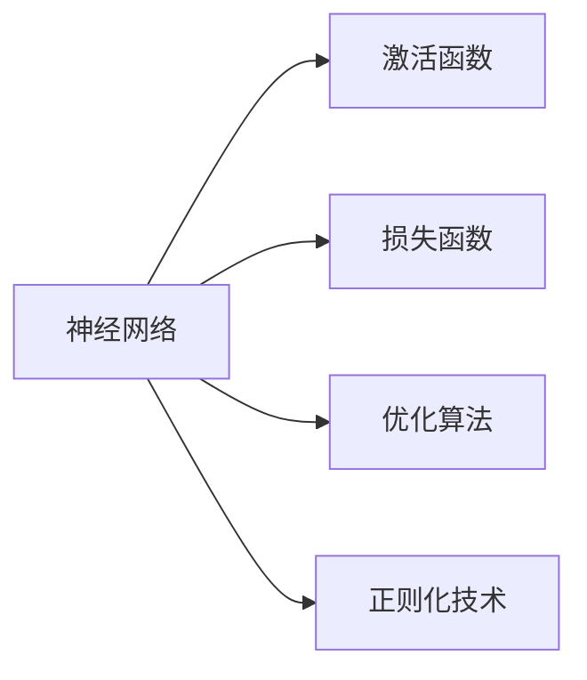

                 

## 1. 背景介绍

### 1.1 问题由来
深度学习自20世纪90年代兴起以来，凭借其强大的非线性表达能力和自动特征学习能力，在图像识别、语音识别、自然语言处理等领域取得了显著成就。然而，深度学习模型的复杂性和高昂的计算需求，限制了其在实际应用中的广泛普及。

近年来，随着硬件计算能力的提升和深度学习算法的发展，深度学习在产业界得到了广泛应用，成为推动人工智能产业发展的重要技术。然而，由于深度学习模型结构复杂、参数众多，初学者往往难以掌握其核心原理和关键实现细节。为了帮助读者更好地理解深度学习模型，本文将通过系统地讲解深度学习的基本原理、核心算法及其应用实践，深入探讨深度学习在各个领域的创新应用。

### 1.2 问题核心关键点
深度学习模型的核心在于利用多层非线性变换，从原始数据中提取出高级特征，进行复杂模式识别和分类。其主要核心技术包括：
- 神经网络结构：包括前馈神经网络、卷积神经网络、循环神经网络等，不同网络结构适用于不同的数据类型和任务。
- 激活函数：如ReLU、Sigmoid、Tanh等，用于在神经元之间传递信号，并增加模型的非线性能力。
- 损失函数：如交叉熵损失、均方误差损失等，用于度量模型预测与真实标签之间的差异。
- 优化算法：如梯度下降、Adam、RMSprop等，用于更新模型参数，最小化损失函数。
- 正则化技术：如L1、L2正则化、Dropout等，用于防止过拟合，提高模型泛化能力。

这些核心概念构成了深度学习模型的基础框架，使其能够实现复杂数据的建模和预测。通过理解这些核心概念，读者可以更深刻地把握深度学习的精髓，为后续应用实践打下坚实基础。

## 2. 核心概念与联系

### 2.1 核心概念概述

为了更好地理解深度学习的核心技术，本节将介绍几个密切相关的核心概念：

- **神经网络**：由多层神经元通过全连接、卷积、循环等结构构成，是深度学习模型的基本组成单元。
- **激活函数**：在神经网络中，激活函数用于将网络输出转化为非线性映射，增强模型的表达能力。
- **损失函数**：用于评估模型预测与真实标签之间的差异，常见的有交叉熵损失、均方误差损失等。
- **优化算法**：通过梯度下降等方法更新模型参数，最小化损失函数，实现模型训练。
- **正则化技术**：用于防止过拟合，提高模型泛化能力，包括L1/L2正则化、Dropout等。

这些核心概念之间的逻辑关系可以通过以下Mermaid流程图来展示：



这个流程图展示了几大核心概念之间的关联关系：

1. 神经网络是深度学习的基本结构。
2. 激活函数增强了网络的非线性能力。
3. 损失函数用于衡量预测与标签的差异。
4. 优化算法通过更新网络参数，最小化损失函数。
5. 正则化技术防止过拟合，提高模型泛化能力。

这些概念相互依存、相互影响，共同构成了深度学习模型的基础框架。

## 3. 核心算法原理 & 具体操作步骤
### 3.1 算法原理概述

深度学习模型的训练过程通常包括两个主要步骤：前向传播和反向传播。在前向传播中，模型接收输入数据，通过网络结构进行特征提取和预测；在反向传播中，模型利用损失函数评估预测结果，通过优化算法更新网络参数，最小化损失函数。

形式化地，假设深度学习模型为 $f_\theta(x)$，其中 $\theta$ 为模型参数，$x$ 为输入数据。训练过程的目标是最小化损失函数 $L$：

$$
\min_{\theta} L(f_\theta(x), y)
$$

其中 $y$ 为真实标签。具体的算法流程如下：

1. **前向传播**：将输入数据 $x$ 通过神经网络，得到模型预测 $f_\theta(x)$。
2. **损失计算**：根据损失函数计算预测值与真实标签之间的差异，得到损失值 $L$。
3. **反向传播**：通过链式法则计算损失值对每个参数的梯度，更新参数 $\theta$。
4. **参数更新**：利用优化算法更新模型参数，迭代上述过程直至收敛。

### 3.2 算法步骤详解

以下将详细介绍深度学习模型训练的每个步骤，包括前向传播、损失计算、反向传播和参数更新。

**前向传播**：

假设神经网络由 $L$ 层构成，其中第 $l$ 层的输入为 $a_{l-1}$，输出为 $a_l = f_l(\mathbf{W}_l a_{l-1} + \mathbf{b}_l)$，其中 $\mathbf{W}_l$ 和 $\mathbf{b}_l$ 分别为第 $l$ 层的权重和偏置。前向传播的过程可以表示为：

$$
\begin{align*}
a_0 &= x \\
a_1 &= f_1(\mathbf{W}_1 a_0 + \mathbf{b}_1) \\
a_2 &= f_2(\mathbf{W}_2 a_1 + \mathbf{b}_2) \\
&\vdots \\
a_L &= f_L(\mathbf{W}_L a_{L-1} + \mathbf{b}_L)
\end{align*}
$$

**损失计算**：

假设模型的输出为 $y$，常见的损失函数包括交叉熵损失、均方误差损失等。以交叉熵损失为例，其计算公式为：

$$
L = -\frac{1}{N} \sum_{i=1}^N \sum_{j=1}^C y_{ij} \log p_{ij}
$$

其中 $N$ 为样本数量，$C$ 为类别数量，$y_{ij}$ 为第 $i$ 个样本属于第 $j$ 类的标签，$p_{ij}$ 为模型预测第 $i$ 个样本属于第 $j$ 类的概率。

**反向传播**：

通过链式法则，可以计算损失值对每个参数的梯度：

$$
\frac{\partial L}{\partial \theta_l} = \sum_{i=1}^N \sum_{j=1}^C y_{ij} (\frac{\partial p_{ij}}{\partial a_l}) (\frac{\partial a_l}{\partial a_{l-1}}) \cdots (\frac{\partial a_1}{\partial x})
$$

**参数更新**：

利用优化算法（如梯度下降）更新模型参数，其更新公式为：

$$
\theta \leftarrow \theta - \alpha \nabla_\theta L
$$

其中 $\alpha$ 为学习率，$\nabla_\theta L$ 为损失函数对参数的梯度。

### 3.3 算法优缺点

深度学习模型的训练算法具有以下优点：

1. **高效**：通过优化算法更新模型参数，可以快速迭代优化，实现高效的模型训练。
2. **适应性强**：适用于各种复杂的数据类型和任务，能够自动学习特征，无需人工干预。
3. **泛化能力强**：利用正则化技术防止过拟合，提高模型泛化能力。

但同时也存在一些缺点：

1. **计算成本高**：深度学习模型通常包含大量参数，计算量较大，对硬件要求较高。
2. **易过拟合**：当训练数据不足或模型复杂度过高时，容易过拟合，导致泛化能力下降。
3. **训练时间长**：深度学习模型通常需要较长的训练时间，特别是在大规模数据集上。

尽管存在这些局限性，但深度学习模型在处理复杂数据和任务上的卓越表现，使其在图像识别、语音识别、自然语言处理等领域具有广泛的应用前景。

### 3.4 算法应用领域

深度学习模型的应用领域广泛，包括但不限于：

- **计算机视觉**：如图像分类、目标检测、图像分割等。
- **自然语言处理**：如语言模型、文本分类、机器翻译等。
- **语音识别**：如自动语音识别、语音合成等。
- **推荐系统**：如协同过滤、基于内容的推荐等。
- **机器人学**：如路径规划、动作生成等。

此外，深度学习还在医疗、金融、交通等领域得到了广泛应用，推动了这些行业的数字化转型。

## 4. 数学模型和公式 & 详细讲解

### 4.1 数学模型构建

深度学习模型通常由多个神经网络层构成，每层包含若干个神经元。假设一个深度神经网络由 $L$ 层构成，其中第 $l$ 层的输入为 $a_{l-1}$，输出为 $a_l = f_l(\mathbf{W}_l a_{l-1} + \mathbf{b}_l)$，其中 $\mathbf{W}_l$ 和 $\mathbf{b}_l$ 分别为第 $l$ 层的权重和偏置。

假设网络的输入为 $x$，输出为 $y$，常见的深度学习模型包括前馈神经网络、卷积神经网络、循环神经网络等。

### 4.2 公式推导过程

以一个简单的前馈神经网络为例，推导其在训练过程中的梯度计算。

假设网络由两层构成，第一层包含 $n_1$ 个神经元，第二层包含 $n_2$ 个神经元。网络输入为 $x$，输出为 $y$，其中 $y_i$ 为第 $i$ 个样本的输出。

网络的输出层可以表示为：

$$
y = \sigma(\mathbf{W}_L a_{L-1} + \mathbf{b}_L)
$$

其中 $\sigma$ 为激活函数，$\mathbf{W}_L$ 和 $\mathbf{b}_L$ 分别为输出层的权重和偏置。

前向传播过程中，第一层输出为：

$$
a_1 = f_1(\mathbf{W}_1 x + \mathbf{b}_1)
$$

其中 $f_1$ 为第一层的激活函数，$\mathbf{W}_1$ 和 $\mathbf{b}_1$ 分别为第一层的权重和偏置。

对于第二层，有：

$$
a_2 = f_2(\mathbf{W}_2 a_1 + \mathbf{b}_2)
$$

其中 $f_2$ 为第二层的激活函数，$\mathbf{W}_2$ 和 $\mathbf{b}_2$ 分别为第二层的权重和偏置。

网络的损失函数通常为交叉熵损失，表示为：

$$
L = -\frac{1}{N} \sum_{i=1}^N \sum_{j=1}^C y_{ij} \log p_{ij}
$$

其中 $N$ 为样本数量，$C$ 为类别数量，$y_{ij}$ 为第 $i$ 个样本属于第 $j$ 类的标签，$p_{ij}$ 为模型预测第 $i$ 个样本属于第 $j$ 类的概率。

### 4.3 案例分析与讲解

以一个简单的图像分类任务为例，详细分析深度学习模型的训练过程。

假设我们有一组手写数字图片，每张图片大小为 $28 \times 28$ 像素，共有 $10$ 个类别。我们将每张图片转换为 $784$ 维向量，作为模型的输入。模型的输出层包含 $10$ 个神经元，对应 $10$ 个类别。

我们选用一个简单的前馈神经网络，网络由两层构成，每层包含 $64$ 个神经元。假设激活函数为 ReLU，输出层的激活函数为 Softmax。

在训练过程中，我们选取一部分图片作为训练集，利用交叉熵损失函数进行训练。具体步骤如下：

1. 初始化模型参数 $\theta$，设定学习率 $\alpha$。
2. 从训练集中随机选取一个样本 $(x, y)$，进行前向传播计算 $y = \sigma(\mathbf{W}_L a_{L-1} + \mathbf{b}_L)$。
3. 计算损失值 $L = -\frac{1}{N} \sum_{i=1}^N \sum_{j=1}^C y_{ij} \log p_{ij}$。
4. 计算损失值对输出层的梯度 $\nabla_\theta L$。
5. 利用梯度下降算法更新参数 $\theta \leftarrow \theta - \alpha \nabla_\theta L$。
6. 重复步骤 2-5，直到训练完成。

## 5. 项目实践：代码实例和详细解释说明

### 5.1 开发环境搭建

在进行深度学习项目开发前，我们需要准备好开发环境。以下是使用Python进行PyTorch开发的环境配置流程：

1. 安装Anaconda：从官网下载并安装Anaconda，用于创建独立的Python环境。

2. 创建并激活虚拟环境：
```bash
conda create -n pytorch-env python=3.8 
conda activate pytorch-env
```

3. 安装PyTorch：根据CUDA版本，从官网获取对应的安装命令。例如：
```bash
conda install pytorch torchvision torchaudio cudatoolkit=11.1 -c pytorch -c conda-forge
```

4. 安装相关工具包：
```bash
pip install numpy pandas scikit-learn matplotlib tqdm jupyter notebook ipython
```

完成上述步骤后，即可在`pytorch-env`环境中开始项目开发。

### 5.2 源代码详细实现

下面我们以手写数字识别为例，给出使用PyTorch进行深度学习项目开发的PyTorch代码实现。

首先，定义数据集和模型：

```python
import torch
import torch.nn as nn
import torch.optim as optim
from torchvision import datasets, transforms
from torch.utils.data import DataLoader

# 定义模型
class Net(nn.Module):
    def __init__(self):
        super(Net, self).__init__()
        self.conv1 = nn.Conv2d(1, 32, 3, 1)
        self.conv2 = nn.Conv2d(32, 64, 3, 1)
        self.dropout1 = nn.Dropout2d(0.25)
        self.dropout2 = nn.Dropout2d(0.5)
        self.fc1 = nn.Linear(9216, 128)
        self.fc2 = nn.Linear(128, 10)

    def forward(self, x):
        x = self.conv1(x)
        x = nn.functional.relu(x)
        x = self.conv2(x)
        x = nn.functional.relu(x)
        x = nn.functional.max_pool2d(x, 2)
        x = self.dropout1(x)
        x = torch.flatten(x, 1)
        x = self.fc1(x)
        x = nn.functional.relu(x)
        x = self.dropout2(x)
        x = self.fc2(x)
        output = nn.functional.softmax(x, dim=1)
        return output

# 加载数据集
train_dataset = datasets.MNIST(root='./data', train=True, transform=transforms.ToTensor(), download=True)
test_dataset = datasets.MNIST(root='./data', train=False, transform=transforms.ToTensor(), download=True)

# 数据预处理
transform = transforms.Compose([transforms.ToTensor(), transforms.Normalize((0.5,), (0.5,))])

train_dataset = datasets.MNIST(root='./data', train=True, transform=transform, download=True)
test_dataset = datasets.MNIST(root='./data', train=False, transform=transform, download=True)
```

接着，定义优化器和损失函数：

```python
# 定义优化器
learning_rate = 0.001
momentum = 0.9
device = torch.device('cuda' if torch.cuda.is_available() else 'cpu')
model.to(device)

optimizer = optim.SGD(model.parameters(), lr=learning_rate, momentum=momentum)
criterion = nn.CrossEntropyLoss()

# 定义训练和评估函数
def train(model, device, train_loader, optimizer, criterion, epoch):
    model.train()
    for batch_idx, (data, target) in enumerate(train_loader):
        data, target = data.to(device), target.to(device)
        optimizer.zero_grad()
        output = model(data)
        loss = criterion(output, target)
        loss.backward()
        optimizer.step()
        if batch_idx % 100 == 0:
            print('Train Epoch: {} [{}/{} ({:.0f}%)]\tLoss: {:.6f}'.format(
                epoch, batch_idx * len(data), len(train_loader.dataset),
                100. * batch_idx / len(train_loader), loss.item()))

def test(model, device, test_loader, criterion):
    model.eval()
    test_loss = 0
    correct = 0
    with torch.no_grad():
        for data, target in test_loader:
            data, target = data.to(device), target.to(device)
            output = model(data)
            test_loss += criterion(output, target).item()
            pred = output.argmax(dim=1, keepdim=True)
            correct += pred.eq(target.view_as(pred)).sum().item()

    test_loss /= len(test_loader.dataset)
    print('\nTest set: Average loss: {:.4f}, Accuracy: {}/{} ({:.0f}%)\n'.format(
        test_loss, correct, len(test_loader.dataset),
        100. * correct / len(test_loader.dataset)))
```

最后，启动训练流程并在测试集上评估：

```python
epochs = 10
batch_size = 64

for epoch in range(epochs):
    train(model, device, train_loader, optimizer, criterion, epoch)
    test(model, device, test_loader, criterion)
```

以上就是使用PyTorch进行手写数字识别任务深度学习项目开发的完整代码实现。可以看到，得益于PyTorch的强大封装，我们可以用相对简洁的代码完成深度学习模型的搭建和训练。

### 5.3 代码解读与分析

让我们再详细解读一下关键代码的实现细节：

**Net类**：
- `__init__`方法：定义模型的神经网络结构，包括卷积层、激活函数、Dropout层、全连接层等。
- `forward`方法：实现前向传播过程，将输入数据通过网络结构进行特征提取和分类。

**train和test函数**：
- `train`函数：用于模型训练，对数据进行前向传播、反向传播和参数更新。
- `test`函数：用于模型评估，计算测试集上的损失和准确率。

**训练流程**：
- 定义总的epoch数和batch size，开始循环迭代
- 每个epoch内，先在训练集上训练，输出平均loss和正确率
- 在测试集上评估，输出测试集上的准确率
- 所有epoch结束后，关闭模型

可以看到，PyTorch使得深度学习模型的实现变得简洁高效。开发者可以将更多精力放在数据处理、模型改进等高层逻辑上，而不必过多关注底层的实现细节。

当然，工业级的系统实现还需考虑更多因素，如模型的保存和部署、超参数的自动搜索、更灵活的任务适配层等。但核心的训练范式基本与此类似。

## 6. 实际应用场景
### 6.1 计算机视觉

深度学习在计算机视觉领域的应用广泛，如图像分类、目标检测、图像分割等。以图像分类为例，深度学习模型通过学习图像的高级特征，能够对不同类别的图像进行自动分类。

在实际应用中，深度学习模型通常需要大量的标注数据进行训练，才能获得较好的分类效果。例如，对于手写数字识别任务，需要大量标注好的手写数字图片作为训练集。在模型训练完成后，可以通过测试集评估模型的分类性能，利用模型对新图像进行预测。

### 6.2 自然语言处理

深度学习在自然语言处理领域的应用也十分广泛，如语言模型、文本分类、机器翻译等。以机器翻译为例，深度学习模型通过学习语言的语法和语义特征，能够自动将一种语言的文本翻译成另一种语言。

在实际应用中，深度学习模型通常需要大量的双语数据进行训练，才能获得较好的翻译效果。例如，对于英文到中文的翻译任务，需要大量的英文和中文双语文本作为训练集。在模型训练完成后，可以通过测试集评估模型的翻译性能，利用模型对新的英文文本进行翻译。

### 6.3 推荐系统

深度学习在推荐系统中的应用包括协同过滤、基于内容的推荐等。以协同过滤为例，深度学习模型通过学习用户和物品之间的关联关系，能够为用户推荐其可能感兴趣的物品。

在实际应用中，深度学习模型通常需要大量的用户和物品数据进行训练，才能获得较好的推荐效果。例如，对于电商平台的推荐任务，需要大量的用户浏览和购买数据作为训练集。在模型训练完成后，可以通过测试集评估模型的推荐性能，利用模型对新用户进行推荐。

### 6.4 未来应用展望

未来，深度学习技术将在更多领域得到应用，为各行各业带来变革性影响。

在医疗领域，深度学习模型可以用于医学图像的自动标注、疾病诊断等，提升医疗服务的智能化水平，辅助医生诊疗，加速新药开发进程。

在金融领域，深度学习模型可以用于市场预测、风险评估等，提升金融决策的智能化水平，辅助金融机构进行决策。

在教育领域，深度学习模型可以用于学生行为分析、个性化推荐等，提升教育服务的智能化水平，因材施教，促进教育公平，提高教学质量。

总之，深度学习技术具有广泛的应用前景，将在各个领域带来深远的影响，推动各行各业的数字化转型升级。

## 7. 工具和资源推荐
### 7.1 学习资源推荐

为了帮助开发者系统掌握深度学习的基本原理和实践技巧，这里推荐一些优质的学习资源：

1. 《深度学习》（Ian Goodfellow、Yoshua Bengio和Aaron Courville著）：深度学习领域的经典教材，涵盖深度学习的核心概念和算法，适合初学者系统学习。

2. 《动手学深度学习》（李沐等人著）：由微软亚洲研究院出版的在线教材，结合代码实现，深入浅出地介绍了深度学习的基本原理和实践技巧，适合深度学习初学者。

3. Coursera深度学习课程：斯坦福大学、深度学习领域的大牛级人物Geoffrey Hinton教授讲授的深度学习课程，涵盖深度学习的基本概念和算法，适合系统学习。

4. PyTorch官方文档：PyTorch的官方文档，提供了详细的API参考和代码示例，是学习PyTorch的必备资料。

5. TensorFlow官方文档：TensorFlow的官方文档，提供了详细的API参考和代码示例，是学习TensorFlow的必备资料。

6. Kaggle竞赛平台：Kaggle是一个数据科学竞赛平台，汇聚了大量深度学习竞赛项目，适合实际应用实践。

通过对这些资源的学习实践，相信你一定能够快速掌握深度学习的精髓，并用于解决实际的NLP问题。

### 7.2 开发工具推荐

高效的开发离不开优秀的工具支持。以下是几款用于深度学习开发的常用工具：

1. PyTorch：由Facebook开发的开源深度学习框架，灵活的计算图，适合快速迭代研究。大部分深度学习模型都有PyTorch版本的实现。

2. TensorFlow：由Google主导开发的开源深度学习框架，生产部署方便，适合大规模工程应用。同样有丰富的深度学习模型资源。

3. Keras：基于TensorFlow的高级API，适合快速搭建深度学习模型，易于上手。

4. MXNet：由亚马逊开发的开源深度学习框架，支持多种深度学习模型，适合大规模工程应用。

5. Caffe：由Berkeley Vision and Learning Center开发的深度学习框架，适合图像识别任务。

6. Theano：由蒙特利尔大学开发的深度学习框架，适合深度学习研究。

合理利用这些工具，可以显著提升深度学习模型的开发效率，加快创新迭代的步伐。

### 7.3 相关论文推荐

深度学习的研究始于学界的持续探索。以下是几篇奠基性的相关论文，推荐阅读：

1. ImageNet Classification with Deep Convolutional Neural Networks（AlexNet论文）：提出了卷积神经网络，开创了深度学习在计算机视觉领域的应用。

2. Learning Deep Architectures for AI（Hinton等人著）：探讨了深度学习的基本原理和算法，奠定了深度学习的研究基础。

3. Deep Residual Learning for Image Recognition（ResNet论文）：提出了残差网络，解决了深度神经网络退化的问题，提升了深度学习模型的训练效果。

4. Attention Is All You Need（Transformer论文）：提出了Transformer结构，开创了深度学习在自然语言处理领域的应用。

5. Generating Sequences with Recurrent Neural Networks（LSTM论文）：提出了长短期记忆网络，解决了深度神经网络在序列数据处理中的问题。

这些论文代表了大深度学习的发展脉络。通过学习这些前沿成果，可以帮助研究者把握深度学习的未来方向，激发更多的创新灵感。

## 8. 总结：未来发展趋势与挑战

### 8.1 研究成果总结

深度学习技术在过去十年间取得了显著进展，广泛应用于计算机视觉、自然语言处理、推荐系统等多个领域。其核心技术包括神经网络结构、激活函数、损失函数、优化算法等，通过不断的算法创新和工程实践，提升了深度学习模型的性能和应用范围。

### 8.2 未来发展趋势

展望未来，深度学习技术将呈现以下几个发展趋势：

1. **模型规模继续增大**：随着计算能力的提升和数据量的增加，深度学习模型的规模将进一步增大，能够处理更复杂、更大规模的数据集。

2. **模型结构更加多样化**：除了传统的卷积神经网络、前馈神经网络等，新的模型结构如残差网络、Transformer等将继续涌现，提升深度学习模型的性能和应用范围。

3. **模型训练更加自动化**：未来深度学习模型的训练将更加自动化，包括自动调参、自动数据增强、自动模型选择等，提升模型的训练效率和性能。

4. **模型部署更加便捷**：未来深度学习模型的部署将更加便捷，包括云部署、边缘计算等，提升模型的应用范围和实时性。

5. **跨模态深度学习发展**：未来深度学习将更加注重跨模态信息的整合，如视觉、语音、文本等多种模态数据的融合，提升深度学习模型的泛化能力和应用范围。

### 8.3 面临的挑战

尽管深度学习技术在诸多领域取得了显著进展，但仍面临以下挑战：

1. **计算资源消耗大**：深度学习模型通常需要大量的计算资源，训练和推理成本较高，需要大规模的硬件基础设施。

2. **模型训练时间长**：深度学习模型通常需要较长的训练时间，特别是在大规模数据集上。

3. **模型泛化能力有限**：深度学习模型在处理特定任务时效果显著，但在处理复杂任务时泛化能力有限，容易过拟合。

4. **模型可解释性不足**：深度学习模型通常是"黑盒"系统，难以解释其内部工作机制和决策逻辑。

5. **模型安全性问题**：深度学习模型容易学习到有害信息，可能被用于生成假新闻、诈骗等不良用途，引发伦理和安全问题。

### 8.4 研究展望

为了应对这些挑战，未来的深度学习研究需要在以下几个方面进行突破：

1. **模型压缩与优化**：通过模型剪枝、量化等技术，提升深度学习模型的计算效率和实时性。

2. **跨领域迁移学习**：通过知识图谱、逻辑规则等技术，提升深度学习模型的泛化能力和跨领域迁移能力。

3. **模型可解释性**：通过引入可解释性技术，提升深度学习模型的可解释性和可理解性。

4. **模型安全性**：通过数据清洗、对抗样本等技术，提升深度学习模型的安全性，避免有害信息的传播。

总之，深度学习技术具有广泛的应用前景，但同时也面临诸多挑战。未来的研究需要持续创新，不断突破技术瓶颈，才能进一步推动深度学习技术的进步，为各行各业带来深远的影响。

## 9. 附录：常见问题与解答

**Q1：深度学习模型是否需要大量标注数据进行训练？**

A: 深度学习模型通常需要大量标注数据进行训练，才能获得较好的性能。但在某些领域，如无监督学习、半监督学习中，深度学习模型可以通过自监督学习等技术，利用未标注数据进行训练。

**Q2：如何选择合适的深度学习框架进行开发？**

A: 选择合适的深度学习框架需要考虑多个因素，包括模型的复杂度、计算资源、应用场景等。PyTorch和TensorFlow是目前最为流行的深度学习框架，适合不同的应用场景。PyTorch灵活性高，适合快速迭代研究；TensorFlow生产部署方便，适合大规模工程应用。

**Q3：深度学习模型的训练过程中如何进行参数更新？**

A: 深度学习模型的参数更新通常通过优化算法实现，如梯度下降、Adam等。优化算法的选择和参数设置需要根据具体任务进行调整，以获得最佳的训练效果。

**Q4：深度学习模型的部署需要注意哪些问题？**

A: 深度学习模型的部署需要注意多个问题，包括模型的保存和加载、硬件资源的配置、模型的优化等。合理利用云服务、边缘计算等技术，可以有效提升深度学习模型的部署效率和应用范围。

**Q5：如何避免深度学习模型的过拟合问题？**

A: 避免深度学习模型的过拟合问题通常需要引入正则化技术，如L1/L2正则化、Dropout等。此外，数据增强、对抗训练等技术也可以有效提升模型的泛化能力。

总之，深度学习技术具有广泛的应用前景，但同时也面临诸多挑战。未来的研究需要在多个方面进行突破，才能进一步推动深度学习技术的进步，为各行各业带来深远的影响。通过系统学习深度学习的核心概念和实践技巧，相信你一定能够快速掌握深度学习的精髓，为后续应用实践打下坚实基础。

---

作者：禅与计算机程序设计艺术 / Zen and the Art of Computer Programming

