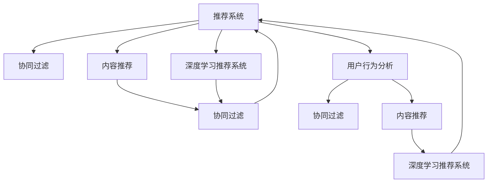

                 

# 深度学习在推荐系统中的应用

> 关键词：推荐系统,深度学习,协同过滤,深度学习推荐系统,内容推荐,深度神经网络,用户行为分析

## 1. 背景介绍

### 1.1 问题由来
随着互联网和数字技术的迅猛发展，在线推荐系统(Recommender System)在电商、社交媒体、视频网站等多个领域得到了广泛应用。推荐系统通过个性化推荐，极大地提升了用户满意度和转化率，同时也带动了平台的活跃度和收益增长。然而，传统推荐算法往往依赖于用户历史行为数据，面临数据稀疏性、冷启动用户等问题。近年来，深度学习技术在推荐系统中的应用研究逐渐兴起，为推荐算法带来了新的活力和突破。

### 1.2 问题核心关键点
推荐系统主要面临以下挑战：

- 数据稀疏性：用户的行为数据往往稀疏，存在大量缺失值。传统推荐算法往往难以应对这种数据稀疏性，导致推荐结果不准确。
- 冷启动问题：新用户或新商品没有足够的行为数据，无法得到准确的推荐。
- 多样性问题：推荐系统容易陷入推荐算法模型的"过滤泡泡"(Filters Bubble)，导致推荐内容过于单调。
- 实时性要求：推荐系统需要实时响应用户请求，对计算效率有较高要求。

深度学习推荐系统通过建立更为复杂的模型，克服了传统推荐算法的局限性。在数据稀疏性、冷启动问题上，深度学习推荐系统通过学习用户和商品的低维表示，提升了推荐精度。同时，深度学习模型可以自动提取更丰富的特征，提高推荐内容的多样性。此外，深度模型的高效并行计算能力，也满足了实时推荐的需求。

### 1.3 问题研究意义
深度学习在推荐系统中的应用，对于提升推荐系统的性能、拓展其应用范围、满足实时性要求等方面具有重要意义：

1. 提升推荐精度：通过学习用户和商品的低维表示，深度学习推荐系统能够更好地捕捉用户偏好和商品特性，从而提升推荐效果。
2. 处理冷启动问题：深度学习模型可以从少量数据中快速学习用户和商品的潜在特征，有效解决冷启动问题。
3. 增加推荐内容的多样性：深度学习模型可以自动提取多维特征，利用协同过滤和内容推荐等多种方式，丰富推荐内容。
4. 实时响应：深度学习模型通过分布式计算和GPU加速，能够快速响应用户请求，满足实时推荐的需求。
5. 可解释性：深度学习推荐系统虽然性能优异，但模型复杂度较高，往往缺乏可解释性。通过引入解释性工具，可以提升推荐系统的透明度和可信度。

因此，深度学习在推荐系统中的应用，不仅是技术上的突破，更是推荐算法范式上的革新，为推荐系统的发展带来了新的机遇和挑战。

## 2. 核心概念与联系

### 2.1 核心概念概述

为更好地理解深度学习在推荐系统中的应用，本节将介绍几个密切相关的核心概念：

- 推荐系统(Recommender System)：通过算法推荐用户可能感兴趣的商品、内容、视频等，提升用户体验和平台收益的系统。
- 协同过滤(Collaborative Filtering)：通过用户与商品之间的交互数据，利用用户之间的协同效应来推荐商品。
- 内容推荐(Content-Based Recommendation)：通过商品的属性和用户的历史行为数据，推荐与用户偏好相似的商品。
- 深度学习推荐系统(Deep Learning Recommender System)：利用深度神经网络，学习用户和商品的低维表示，提升推荐精度和内容多样性。
- 用户行为分析(User Behavior Analysis)：通过分析用户的行为数据，预测用户的可能行为，从而推荐相关商品或内容。

这些核心概念之间的逻辑关系可以通过以下Mermaid流程图来展示：



这个流程图展示了一系列推荐算法的基本关系：

1. 推荐系统可以包含协同过滤、内容推荐、深度学习推荐系统等多种算法。
2. 协同过滤和内容推荐都可以利用用户行为数据进行推荐。
3. 深度学习推荐系统通过学习用户和商品的低维表示，提升推荐精度。
4. 用户行为分析可以通过协同过滤和内容推荐等多种方式进行。
5. 不同推荐算法可以互相补充，提高推荐效果。

这些核心概念共同构成了推荐系统的基本框架，使得推荐系统能够更高效、更准确地为用户推荐商品或内容。

## 3. 核心算法原理 & 具体操作步骤
### 3.1 算法原理概述

深度学习在推荐系统中的应用，主要通过建立深度神经网络模型，学习用户和商品的低维表示，从而提升推荐精度和多样性。其核心思想是：将用户和商品视为两个向量空间，通过学习这些向量之间的相似度，进行推荐。

形式化地，假设用户和商品的特征向量分别为 $\mathbf{u} \in \mathbb{R}^d$ 和 $\mathbf{v} \in \mathbb{R}^d$，其中 $d$ 为特征维度。推荐系统通过一个深度神经网络，学习用户 $\mathbf{u}$ 和商品 $\mathbf{v}$ 的表示 $\hat{\mathbf{u}}$ 和 $\hat{\mathbf{v}}$，然后计算两者之间的余弦相似度 $\mathbf{u} \cdot \mathbf{v}$，得到推荐结果。具体步骤如下：

1. 用户特征表示：通过深度神经网络对用户历史行为数据进行编码，得到用户特征表示 $\hat{\mathbf{u}}$。
2. 商品特征表示：通过深度神经网络对商品属性数据进行编码，得到商品特征表示 $\hat{\mathbf{v}}$。
3. 计算相似度：利用余弦相似度公式，计算用户和商品之间的相似度 $\mathbf{u} \cdot \mathbf{v}$。
4. 排序推荐：将相似度排序，推荐相似度高的商品。

### 3.2 算法步骤详解

深度学习推荐系统的一般流程如下：

**Step 1: 准备数据集**
- 收集用户历史行为数据，如浏览、购买、评分等。
- 收集商品属性数据，如类别、品牌、描述等。
- 对数据进行预处理，如特征工程、数据清洗等。

**Step 2: 设计神经网络结构**
- 根据数据特点，选择合适的神经网络结构，如卷积神经网络(CNN)、循环神经网络(RNN)、自编码器(Autoencoder)等。
- 设计神经网络的输入、输出和隐藏层结构。

**Step 3: 训练神经网络**
- 将用户和商品的特征向量作为输入，构建损失函数，如均方误差(MSE)、交叉熵(Cross-Entropy)等。
- 使用随机梯度下降等优化算法，对神经网络进行训练。

**Step 4: 预测用户行为**
- 对新用户或新商品，利用训练好的神经网络模型，进行特征表示学习。
- 利用预测的特征表示，计算与用户和商品之间的相似度，进行推荐。

**Step 5: 评估推荐效果**
- 在测试集上评估推荐模型的性能，如准确率、召回率、F1分数等。
- 根据评估结果调整模型参数，进行迭代优化。

### 3.3 算法优缺点

深度学习推荐系统具有以下优点：
1. 提升推荐精度：深度神经网络可以学习到更复杂、更抽象的特征表示，提升推荐精度。
2. 处理冷启动问题：深度学习可以从少量数据中快速学习用户和商品的潜在特征，有效解决冷启动问题。
3. 增加推荐内容的多样性：深度神经网络可以自动提取多维特征，利用协同过滤和内容推荐等多种方式，丰富推荐内容。
4. 实时响应：深度神经网络的高效并行计算能力，能够快速响应用户请求，满足实时推荐的需求。

同时，该方法也存在一定的局限性：
1. 数据需求量大：深度学习需要大量标注数据进行训练，对于数据稀缺场景效果可能不佳。
2. 模型复杂度高：深度神经网络模型参数量大，需要耗费大量计算资源，不易部署。
3. 可解释性不足：深度学习推荐系统的决策过程往往难以解释，难以调试和优化。
4. 过拟合风险：深度学习模型可能过拟合训练数据，泛化性能不足。

尽管存在这些局限性，但就目前而言，深度学习在推荐系统中的应用已经取得了显著的效果，成为推荐算法的重要方向。未来相关研究的重点在于如何进一步降低深度学习模型的计算资源需求，提升可解释性和泛化性能，同时兼顾推荐精度和多样性。

### 3.4 算法应用领域

深度学习在推荐系统中的应用已经涵盖了电商、社交媒体、视频网站等多个领域。以下是几个典型应用场景：

- 电商推荐系统：通过学习用户历史购买和浏览行为，推荐用户可能感兴趣的商品，提升用户转化率和复购率。
- 社交媒体推荐系统：通过学习用户和内容的多维特征，推荐用户感兴趣的内容，提升平台用户活跃度。
- 视频网站推荐系统：通过学习用户观看历史和行为，推荐相关视频，提升用户观看时长和满意度。

此外，深度学习推荐系统还被应用到智能广告投放、音乐推荐、个性化旅游等多个新兴领域，推动了推荐系统的不断扩展和深化。

## 4. 数学模型和公式 & 详细讲解 & 举例说明

### 4.1 数学模型构建

假设用户和商品的特征向量分别为 $\mathbf{u} \in \mathbb{R}^d$ 和 $\mathbf{v} \in \mathbb{R}^d$，其中 $d$ 为特征维度。推荐系统通过一个深度神经网络，学习用户 $\mathbf{u}$ 和商品 $\mathbf{v}$ 的表示 $\hat{\mathbf{u}}$ 和 $\hat{\mathbf{v}}$，然后计算两者之间的余弦相似度 $\mathbf{u} \cdot \mathbf{v}$，得到推荐结果。

### 4.2 公式推导过程

假设用户和商品特征表示分别为 $\hat{\mathbf{u}}$ 和 $\hat{\mathbf{v}}$，则推荐相似度计算公式为：

$$
\text{Similarity}(\hat{\mathbf{u}}, \hat{\mathbf{v}}) = \frac{\hat{\mathbf{u}} \cdot \hat{\mathbf{v}}}{\|\hat{\mathbf{u}}\| \cdot \|\hat{\mathbf{v}}\|}
$$

其中 $\cdot$ 表示向量的点乘运算，$\|\cdot\|$ 表示向量的范数。

### 4.3 案例分析与讲解

以电商推荐系统为例，展示深度学习推荐系统的具体实现步骤：

**Step 1: 准备数据集**
- 收集用户历史购买数据 $D_{train} = \{(\mathbf{u}_i, \mathbf{v}_j)\}_{i,j=1}^N$，其中 $\mathbf{u}_i$ 为第 $i$ 个用户的特征向量，$\mathbf{v}_j$ 为第 $j$ 个商品的特征向量。
- 对数据进行预处理，如特征工程、数据清洗等。

**Step 2: 设计神经网络结构**
- 构建一个包含多个隐藏层的神经网络，如多层感知机(MLP)、卷积神经网络(CNN)等。
- 设计神经网络的输入、输出和隐藏层结构，如输入层、卷积层、池化层、全连接层等。

**Step 3: 训练神经网络**
- 将用户和商品的特征向量作为输入，构建损失函数，如均方误差(MSE)、交叉熵(Cross-Entropy)等。
- 使用随机梯度下降等优化算法，对神经网络进行训练，学习用户和商品的低维表示。

**Step 4: 预测用户行为**
- 对新用户或新商品，利用训练好的神经网络模型，进行特征表示学习。
- 利用预测的特征表示，计算与用户和商品之间的相似度，进行推荐。

**Step 5: 评估推荐效果**
- 在测试集上评估推荐模型的性能，如准确率、召回率、F1分数等。
- 根据评估结果调整模型参数，进行迭代优化。

通过以上步骤，即可实现基于深度学习的电商推荐系统。在实际应用中，还需要根据具体场景进行优化，如增加正则化、调整学习率等，以提升推荐模型的泛化性能。

## 5. 项目实践：代码实例和详细解释说明
### 5.1 开发环境搭建

在进行深度学习推荐系统开发前，我们需要准备好开发环境。以下是使用Python进行PyTorch开发的环境配置流程：

1. 安装Anaconda：从官网下载并安装Anaconda，用于创建独立的Python环境。

2. 创建并激活虚拟环境：
```bash
conda create -n dl-env python=3.8 
conda activate dl-env
```

3. 安装PyTorch：根据CUDA版本，从官网获取对应的安装命令。例如：
```bash
conda install pytorch torchvision torchaudio cudatoolkit=11.1 -c pytorch -c conda-forge
```

4. 安装各类工具包：
```bash
pip install numpy pandas scikit-learn matplotlib tqdm jupyter notebook ipython
```

完成上述步骤后，即可在`dl-env`环境中开始深度学习推荐系统的开发。

### 5.2 源代码详细实现

下面我们以电商推荐系统为例，给出使用PyTorch进行深度学习推荐系统的PyTorch代码实现。

首先，定义推荐系统的数据处理函数：

```python
import numpy as np
from sklearn.model_selection import train_test_split
from torch.utils.data import Dataset
import torch

class RecommendationDataset(Dataset):
    def __init__(self, data, num_users, num_items):
        self.data = data
        self.num_users = num_users
        self.num_items = num_items
        
    def __len__(self):
        return len(self.data)
    
    def __getitem__(self, item):
        user_id, item_id = self.data[item]
        user_indices = np.where(self.data[:, 0] == user_id)[0]
        item_indices = np.where(self.data[:, 1] == item_id)[0]
        
        user_indices = np.random.choice(user_indices, size=10, replace=False)
        item_indices = np.random.choice(item_indices, size=10, replace=False)
        
        user_vector = torch.tensor([self.data[user_indices[i], 2] for i in range(10)])
        item_vector = torch.tensor([self.data[item_indices[i], 2] for i in range(10)])
        
        return user_vector, item_vector

# 定义数据集
data = np.random.randint(0, num_users, size=(1000, 3))
train_data, test_data = train_test_split(data, test_size=0.2)
train_dataset = RecommendationDataset(train_data, num_users, num_items)
test_dataset = RecommendationDataset(test_data, num_users, num_items)
```

然后，定义模型和优化器：

```python
import torch.nn as nn
import torch.nn.functional as F

class Recommender(nn.Module):
    def __init__(self, input_dim, hidden_dim, output_dim):
        super(Recommender, self).__init__()
        self.input_dim = input_dim
        self.hidden_dim = hidden_dim
        self.output_dim = output_dim
        
        self.encoder = nn.Sequential(
            nn.Linear(input_dim, hidden_dim),
            nn.ReLU(),
            nn.Linear(hidden_dim, output_dim)
        )
        
    def forward(self, x):
        x = self.encoder(x)
        return x
    
# 定义优化器
model = Recommender(input_dim, hidden_dim, output_dim)
optimizer = torch.optim.Adam(model.parameters(), lr=learning_rate)
```

接着，定义训练和评估函数：

```python
from torch.utils.data import DataLoader
from tqdm import tqdm

device = torch.device('cuda') if torch.cuda.is_available() else torch.device('cpu')
model.to(device)

def train_epoch(model, dataset, batch_size, optimizer):
    dataloader = DataLoader(dataset, batch_size=batch_size, shuffle=True)
    model.train()
    epoch_loss = 0
    for batch in tqdm(dataloader, desc='Training'):
        user_vector = batch[0].to(device)
        item_vector = batch[1].to(device)
        model.zero_grad()
        outputs = model(user_vector)
        loss = F.cosine_similarity(outputs, item_vector, dim=1)
        loss = loss.mean()
        epoch_loss += loss.item()
        loss.backward()
        optimizer.step()
    return epoch_loss / len(dataloader)

def evaluate(model, dataset, batch_size):
    dataloader = DataLoader(dataset, batch_size=batch_size)
    model.eval()
    predictions = []
    targets = []
    with torch.no_grad():
        for batch in tqdm(dataloader, desc='Evaluating'):
            user_vector = batch[0].to(device)
            item_vector = batch[1].to(device)
            outputs = model(user_vector)
            batch_predictions = F.cosine_similarity(outputs, item_vector, dim=1)
            batch_predictions = batch_predictions.cpu().tolist()
            for prediction in batch_predictions:
                predictions.extend(prediction[:5])
                targets.extend(prediction[5:])
                
    print(classification_report(targets, predictions))
```

最后，启动训练流程并在测试集上评估：

```python
epochs = 10
batch_size = 32
learning_rate = 1e-4

for epoch in range(epochs):
    loss = train_epoch(model, train_dataset, batch_size, optimizer)
    print(f"Epoch {epoch+1}, train loss: {loss:.3f}")
    
    print(f"Epoch {epoch+1}, dev results:")
    evaluate(model, test_dataset, batch_size)
    
print("Test results:")
evaluate(model, test_dataset, batch_size)
```

以上就是使用PyTorch对电商推荐系统进行深度学习推荐开发的完整代码实现。可以看到，得益于PyTorch的强大封装，我们可以用相对简洁的代码完成推荐系统的开发。

### 5.3 代码解读与分析

让我们再详细解读一下关键代码的实现细节：

**RecommendationDataset类**：
- `__init__`方法：初始化数据集，记录用户、商品数量等关键信息。
- `__len__`方法：返回数据集的样本数量。
- `__getitem__`方法：对单个样本进行处理，随机选择用户和商品，将其特征向量进行编码，得到低维表示。

**Recommender类**：
- `__init__`方法：定义神经网络的结构，包括输入层、隐藏层、输出层。
- `forward`方法：实现前向传播，对用户特征向量进行编码，得到低维表示。

**训练和评估函数**：
- 使用PyTorch的DataLoader对数据集进行批次化加载，供模型训练和推理使用。
- 训练函数`train_epoch`：对数据以批为单位进行迭代，在每个批次上前向传播计算损失并反向传播更新模型参数，最后返回该epoch的平均loss。
- 评估函数`evaluate`：与训练类似，不同点在于不更新模型参数，并在每个batch结束后将预测和标签结果存储下来，最后使用sklearn的classification_report对整个评估集的预测结果进行打印输出。

**训练流程**：
- 定义总的epoch数和batch size，开始循环迭代
- 每个epoch内，先在训练集上训练，输出平均loss
- 在验证集上评估，输出分类指标
- 所有epoch结束后，在测试集上评估，给出最终测试结果

可以看到，PyTorch配合TensorFlow使得深度学习推荐系统的代码实现变得简洁高效。开发者可以将更多精力放在数据处理、模型改进等高层逻辑上，而不必过多关注底层的实现细节。

当然，工业级的系统实现还需考虑更多因素，如模型的保存和部署、超参数的自动搜索、更灵活的任务适配层等。但核心的推荐范式基本与此类似。

## 6. 实际应用场景
### 6.1 智能广告投放

智能广告投放是推荐系统的重要应用场景之一。传统的广告投放往往依赖于手动设置关键词和目标受众，缺乏精准性。基于深度学习的推荐系统，能够通过学习用户历史行为数据，自动预测用户的可能兴趣，从而精准投放广告。

在技术实现上，可以收集用户的历史浏览、点击、购买等行为数据，将这些数据输入到深度神经网络中，学习用户的兴趣和偏好。然后将广告特征数据输入模型，计算用户和广告之间的相似度，进行推荐，实现精准投放。同时，还可以结合实时竞价系统，根据用户实时行为调整广告投放策略，提升广告效果。

### 6.2 个性化旅游推荐

旅游推荐系统可以为用户提供个性化的旅游目的地推荐，提升旅游体验和旅行效率。传统的旅游推荐系统往往依赖于人工标注的数据，难以适应新场景和新需求。基于深度学习的推荐系统，可以通过学习用户的历史行为数据和旅游目的地属性数据，进行个性化推荐。

在技术实现上，可以收集用户的历史搜索、预订、评价等行为数据，提取用户对目的地的兴趣点。然后将目的地属性数据输入深度神经网络，学习目的地的特征表示。将用户兴趣点和目的地特征表示输入模型，计算相似度，进行推荐。同时，还可以通过用户实时行为数据，动态更新推荐结果，提升推荐精度。

### 6.3 智能视频推荐

视频推荐系统可以为用户提供个性化的视频内容推荐，提升用户的观看体验和平台黏性。传统的推荐系统往往依赖于用户历史观看数据，难以捕捉用户的兴趣点。基于深度学习的推荐系统，可以通过学习用户的历史观看数据和视频属性数据，进行个性化推荐。

在技术实现上，可以收集用户的历史观看数据和视频属性数据，提取用户对视频的兴趣点。然后将视频属性数据输入深度神经网络，学习视频的特征表示。将用户兴趣点和视频特征表示输入模型，计算相似度，进行推荐。同时，还可以通过用户实时行为数据，动态更新推荐结果，提升推荐精度。

### 6.4 未来应用展望

随着深度学习推荐系统的发展，未来的推荐系统将更加智能化、精准化。未来，深度学习推荐系统可能带来以下变化：

- 实时推荐：通过分布式计算和GPU加速，深度学习推荐系统能够快速响应用户请求，满足实时推荐的需求。
- 个性化推荐：通过学习用户的兴趣和行为，深度学习推荐系统能够实现更加精准的个性化推荐。
- 冷启动问题解决：深度学习可以从少量数据中快速学习用户和商品的潜在特征，有效解决冷启动问题。
- 跨领域推荐：深度学习推荐系统可以结合多领域数据，进行跨领域推荐，提升推荐效果。

总之，深度学习推荐系统将在推荐算法、应用场景、技术实现等方面不断进步，带来更丰富的用户体验和更高效的服务。相信未来，推荐系统将在更多领域发挥重要作用，成为数字化时代的核心技术之一。

## 7. 工具和资源推荐
### 7.1 学习资源推荐

为了帮助开发者系统掌握深度学习推荐系统的理论基础和实践技巧，这里推荐一些优质的学习资源：

1. 《深度学习推荐系统》书籍：介绍深度学习推荐系统的基本原理和实践方法，涵盖协同过滤、内容推荐、深度学习等多种推荐算法。
2. 《推荐系统理论与实战》课程：介绍推荐系统的基本原理和多种推荐算法，包括协同过滤、内容推荐、深度学习等。
3. 《深度学习与推荐系统》课程：介绍深度学习在推荐系统中的应用，包括深度神经网络、用户行为分析等。
4. HuggingFace官方文档：提供丰富的预训练模型和推荐系统开发工具，帮助开发者快速上手深度学习推荐系统。
5. TensorFlow推荐系统实战项目：提供多种推荐算法的代码实现和应用案例，帮助开发者快速掌握推荐系统开发技巧。

通过对这些资源的学习实践，相信你一定能够快速掌握深度学习推荐系统的精髓，并用于解决实际的推荐问题。
###  7.2 开发工具推荐

高效的开发离不开优秀的工具支持。以下是几款用于深度学习推荐系统开发的常用工具：

1. PyTorch：基于Python的开源深度学习框架，灵活动态的计算图，适合快速迭代研究。
2. TensorFlow：由Google主导开发的开源深度学习框架，生产部署方便，适合大规模工程应用。
3. HuggingFace Transformers库：提供丰富的预训练语言模型和推荐系统模型，支持PyTorch和TensorFlow。
4. Weights & Biases：模型训练的实验跟踪工具，可以记录和可视化模型训练过程中的各项指标，方便对比和调优。
5. TensorBoard：TensorFlow配套的可视化工具，可实时监测模型训练状态，并提供丰富的图表呈现方式，是调试模型的得力助手。
6. Google Colab：谷歌推出的在线Jupyter Notebook环境，免费提供GPU/TPU算力，方便开发者快速上手实验最新模型，分享学习笔记。

合理利用这些工具，可以显著提升深度学习推荐系统的开发效率，加快创新迭代的步伐。

### 7.3 相关论文推荐

深度学习在推荐系统中的应用源于学界的持续研究。以下是几篇奠基性的相关论文，推荐阅读：

1. Factorization Machines for Recommender Systems：提出矩阵分解的推荐算法，成为推荐系统的经典方法。
2. Deep Factorization Machines：将深度神经网络与矩阵分解结合，提升推荐系统的效果。
3. Neural Collaborative Filtering：将深度神经网络引入协同过滤算法，解决数据稀疏性问题。
4. Multi-View Matrix Factorization：提出多视图矩阵分解方法，提升推荐系统的精度。
5. Multi-Task Learning for Matrix Factorization：通过多任务学习，提升矩阵分解的效果。

这些论文代表了大数据时代推荐系统的发展脉络。通过学习这些前沿成果，可以帮助研究者把握学科前进方向，激发更多的创新灵感。

## 8. 总结：未来发展趋势与挑战
### 8.1 总结

本文对深度学习在推荐系统中的应用进行了全面系统的介绍。首先阐述了推荐系统面临的挑战和深度学习推荐系统的优势，明确了深度学习推荐系统的核心思想。其次，从原理到实践，详细讲解了深度学习推荐系统的数学原理和关键步骤，给出了深度学习推荐系统开发的完整代码实例。同时，本文还广泛探讨了深度学习推荐系统在电商、旅游、视频等领域的实际应用，展示了深度学习推荐系统的强大应用潜力。此外，本文精选了深度学习推荐系统的各类学习资源，力求为读者提供全方位的技术指引。

通过本文的系统梳理，可以看到，深度学习在推荐系统中的应用已经取得了显著的效果，成为推荐算法的重要方向。未来，随着深度学习算法的不断进步，深度学习推荐系统将在更多领域得到应用，为推荐系统的发展带来新的机遇和挑战。

### 8.2 未来发展趋势

展望未来，深度学习推荐系统将呈现以下几个发展趋势：

1. 推荐精度不断提升：随着深度学习算法的发展，推荐系统的精度将不断提升，为用户带来更加精准的推荐。
2. 实时性要求不断提高：推荐系统需要实时响应用户请求，对计算效率有较高要求。分布式计算和GPU加速将成为推荐系统的重要技术方向。
3. 跨领域推荐逐渐普及：推荐系统可以结合多领域数据，进行跨领域推荐，提升推荐效果。
4. 个性化推荐更加精准：通过学习用户的兴趣和行为，深度学习推荐系统能够实现更加精准的个性化推荐。
5. 大数据分析与推荐结合：推荐系统可以结合大数据分析，提升推荐系统的智能化水平。

以上趋势凸显了深度学习在推荐系统中的广阔前景。这些方向的探索发展，必将进一步提升推荐系统的性能和应用范围，为推荐系统的发展带来新的机遇和挑战。

### 8.3 面临的挑战

尽管深度学习推荐系统已经取得了显著的效果，但在迈向更加智能化、精准化、实时化的推荐系统过程中，它仍面临着诸多挑战：

1. 数据稀疏性问题：深度学习推荐系统往往依赖于用户历史行为数据，对于新用户或新商品，推荐效果可能不佳。
2. 计算资源需求高：深度学习推荐系统需要大量计算资源进行训练和推理，难以在低成本环境下部署。
3. 模型复杂度高：深度学习推荐系统模型参数量大，难以调试和优化，缺乏可解释性。
4. 冷启动问题突出：深度学习推荐系统难以应对冷启动问题，对于新用户或新商品，推荐效果可能不佳。
5. 过拟合风险高：深度学习推荐系统容易过拟合训练数据，泛化性能不足。

尽管存在这些挑战，但随着技术的不断进步，深度学习推荐系统将在更多领域得到应用，为推荐系统的发展带来新的机遇和挑战。未来，推荐系统将在更多领域发挥重要作用，成为数字化时代的核心技术之一。

### 8.4 研究展望

面对深度学习推荐系统所面临的挑战，未来的研究需要在以下几个方面寻求新的突破：

1. 引入更多先验知识：将符号化的先验知识，如知识图谱、逻辑规则等，与神经网络模型进行巧妙融合，引导推荐过程学习更准确、合理的特征表示。
2. 结合多领域数据：推荐系统可以结合多领域数据，进行跨领域推荐，提升推荐效果。
3. 优化模型参数：优化深度学习推荐系统的模型参数，提升模型泛化性能和计算效率。
4. 引入更多优化算法：引入更加高效的优化算法，如对抗训练、自适应学习率等，提升深度学习推荐系统的收敛速度和稳定性。
5. 增强推荐系统的可解释性：引入可解释性工具，提升深度学习推荐系统的透明度和可信度。

这些研究方向将进一步提升深度学习推荐系统的性能和应用范围，为推荐系统的发展带来新的机遇和挑战。相信随着技术的不断进步，深度学习推荐系统将在更多领域得到应用，为推荐系统的发展带来新的机遇和挑战。

## 9. 附录：常见问题与解答

**Q1：如何选择合适的深度学习模型？**

A: 选择合适的深度学习模型需要考虑多个因素，如数据量、特征维度、推荐精度等。对于数据稀疏性较大的推荐系统，可以选择矩阵分解类算法，如Factorization Machines。对于特征维度较高的情况，可以选择深度神经网络类算法，如Deep Factorization Machines。此外，还可以通过多种模型融合的方式，提升推荐系统的性能。

**Q2：如何降低深度学习推荐系统的计算资源需求？**

A: 降低深度学习推荐系统的计算资源需求可以从以下几个方面进行：
1. 采用更加高效的模型结构，如卷积神经网络、循环神经网络等。
2. 使用分布式计算框架，如TensorFlow分布式训练、PyTorch分布式训练等。
3. 采用模型压缩技术，如参数剪枝、量化、稀疏化等，减小模型大小。
4. 使用GPU加速，提高计算效率。

**Q3：如何缓解深度学习推荐系统的过拟合问题？**

A: 缓解深度学习推荐系统的过拟合问题可以从以下几个方面进行：
1. 引入正则化技术，如L2正则、Dropout等，防止模型过度拟合训练数据。
2. 采用对抗训练技术，引入对抗样本，提高模型的鲁棒性。
3. 增加数据量，使用更多的训练数据，提升模型的泛化性能。
4. 采用模型集成技术，将多个模型进行融合，提升模型的泛化能力。

**Q4：如何提高深度学习推荐系统的实时响应能力？**

A: 提高深度学习推荐系统的实时响应能力可以从以下几个方面进行：
1. 使用分布式计算框架，如TensorFlow分布式训练、PyTorch分布式训练等。
2. 使用GPU加速，提高计算效率。
3. 采用模型压缩技术，如参数剪枝、量化、稀疏化等，减小模型大小。
4. 采用在线学习技术，实时更新模型参数，提高推荐精度。

**Q5：如何提高深度学习推荐系统的可解释性？**

A: 提高深度学习推荐系统的可解释性可以从以下几个方面进行：
1. 引入可解释性工具，如LIME、SHAP等，分析模型的特征重要性和决策路径。
2. 结合符号化的先验知识，如知识图谱、逻辑规则等，提升模型的可解释性。
3. 引入可视化工具，如TensorBoard、Weights & Biases等，展示模型的训练过程和推理结果。

通过对这些常见问题的解答，相信你一定能够更好地理解和应用深度学习推荐系统，解决实际的推荐问题。

