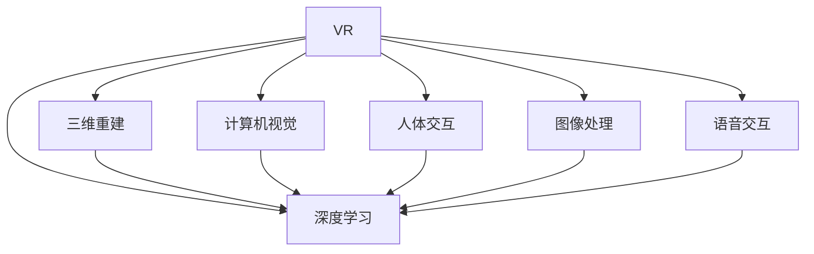

                 

# 深度学习在虚拟现实中的应用

> 关键词：虚拟现实(VR)，深度学习(DL)，增强现实(AR)，三维重建，计算机视觉，人体交互，图像处理

## 1. 背景介绍

### 1.1 问题由来
随着人工智能技术的不断进步，深度学习在虚拟现实(VR)和增强现实(AR)领域的应用，逐渐成为行业热点。传统上，VR和AR系统往往依赖于复杂的手动算法和手动设计，难以实现真正的实时交互。深度学习技术，特别是基于卷积神经网络(CNN)和循环神经网络(RNN)的算法，在图像处理、人体交互、三维重建等方面展现出了前所未有的优势。

近年来，包括Meta、NVIDIA、HTC等巨头企业，以及Apple、Google等技术公司，纷纷加大对深度学习在VR/AR领域的投入，旨在通过自动化的学习过程，实现对场景的智能感知和交互。借助深度学习，VR和AR系统能够更精准地捕捉和理解用户的动作和语境，为用户提供更加自然和沉浸的体验。

### 1.2 问题核心关键点
本文聚焦于深度学习在VR和AR领域的应用，特别是有监督学习和无监督学习在这两大技术方向中的共同作用。在VR和AR系统中，深度学习主要应用于以下几个方面：
- 三维重建：将现实世界中的三维物体转换为计算机可以处理的数字模型。
- 人体交互：基于深度学习的体感交互系统，能够实时捕捉人体动作，为用户提供自然的手势控制。
- 计算机视觉：基于深度学习的视觉处理算法，实现对现实世界的智能感知和理解。
- 图像处理：通过深度学习，优化图像渲染和虚拟对象的逼真显示。
- 语音交互：利用深度学习模型，实现语音识别的准确性和语义理解。

深度学习在VR和AR领域的应用，极大地提升了系统的实时性、智能化水平和用户体验，成为推动VR/AR技术发展的重要驱动力。

## 2. 核心概念与联系

### 2.1 核心概念概述

为了更好地理解深度学习在VR和AR中的应用，本节将介绍几个密切相关的核心概念：

- 虚拟现实(Virtual Reality, VR)：通过计算机生成逼真的3D场景和虚拟物体，使用户能够沉浸在虚拟世界中，实现空间感知和交互体验。
- 增强现实(Augmented Reality, AR)：在现实世界中添加数字信息或虚拟物体，增强用户对环境的信息感知和互动能力。
- 深度学习(Deep Learning)：一种基于多层神经网络的机器学习技术，能够从大量数据中学习复杂的非线性关系，广泛应用于图像、语音、自然语言处理等领域。
- 三维重建(3D Reconstruction)：将三维物体的几何形状和纹理信息转换为计算机可以处理的数字模型，用于场景重建和视觉导航。
- 计算机视觉(Computer Vision)：研究如何使计算机理解和解释图像和视频内容，实现目标检测、人脸识别、图像分割等任务。
- 人体交互(Human-Computer Interaction, HCI)：研究如何让计算机理解和处理人的输入和输出，实现自然、流畅的交互方式。
- 图像处理(Image Processing)：通过算法和模型对图像进行去噪、增强、修复、分类等处理，提高图像质量和信息的可用性。
- 语音交互(Speech Interaction)：利用语音识别和合成技术，实现人机自然语言交互。

这些核心概念之间的逻辑关系可以通过以下Mermaid流程图来展示：



这个流程图展示了大语言模型的核心概念及其之间的关系：

1. VR系统通过深度学习实现三维重建、计算机视觉、人体交互等关键技术。
2. 深度学习为VR系统的视觉处理和交互感知提供支持。
3. AR系统同样通过深度学习实现图像处理和视觉增强。
4. 深度学习使得VR和AR系统能够自动捕捉和理解用户动作，实现自然交互。
5. VR和AR系统需要结合图像、语音等多种模态数据进行融合处理，深度学习提供了强大的数据融合能力。

这些概念共同构成了VR和AR技术的核心框架，使得深度学习技术在这些领域中得到广泛应用。通过理解这些核心概念，我们可以更好地把握深度学习在VR和AR技术中的应用方向。

## 3. 核心算法原理 & 具体操作步骤
### 3.1 算法原理概述

深度学习在VR和AR领域的应用，主要基于监督学习和无监督学习两种范式。

**监督学习(Supervised Learning)**：
在监督学习中，系统通过大量标注数据进行训练，学习出具有特定输出功能的模型。在VR和AR系统中，监督学习主要用于计算机视觉、图像处理和语音交互等方面。例如，通过标注的图像数据，训练深度学习模型实现图像分类、目标检测、语义分割等任务；通过标注的语音数据，训练语音识别和语音合成模型，实现自然语言交互。

**无监督学习(Unsupervised Learning)**：
无监督学习主要应用于三维重建和人体交互。在三维重建中，系统通过无标注的3D扫描数据或RGB-D图像，训练深度学习模型自动生成逼真的三维模型。在人体交互中，通过无标注的动作捕捉数据，训练深度学习模型实现对用户动作的智能识别和预测。

### 3.2 算法步骤详解

深度学习在VR和AR系统中的应用，可以分为以下几个关键步骤：

**Step 1: 数据准备与预处理**
- 收集和标注数据。对于计算机视觉和图像处理任务，需要收集大量标注的图像和视频数据；对于三维重建和人体交互任务，需要收集动作捕捉数据和三维扫描数据。
- 数据预处理。包括图像裁剪、归一化、去噪等预处理操作，保证输入数据的质量和一致性。

**Step 2: 模型选择与设计**
- 选择合适的深度学习模型。常见的深度学习模型包括卷积神经网络(CNN)、循环神经网络(RNN)、生成对抗网络(GAN)等。
- 设计模型结构。根据具体任务需求，选择合适的层数、激活函数、优化器等模型参数。

**Step 3: 模型训练**
- 使用标注数据进行监督学习训练。在训练过程中，利用损失函数衡量模型预测结果与真实标签的差异，使用优化算法更新模型参数，最小化损失函数。
- 使用无标注数据进行无监督学习训练。在训练过程中，利用数据集的内在结构进行自组织学习，最小化模型预测误差。

**Step 4: 模型评估与优化**
- 在验证集上评估模型性能。使用准确率、召回率、F1-score等指标，评估模型在特定任务上的表现。
- 根据评估结果，调整模型超参数，重新训练模型，直至达到理想的性能。

**Step 5: 模型应用与部署**
- 将训练好的模型集成到VR或AR系统中。根据具体应用场景，选择合适的推理算法，实现实时处理和渲染。
- 对系统进行测试和优化。在实际应用中，监控系统性能，根据反馈不断调整和优化模型。

### 3.3 算法优缺点

深度学习在VR和AR领域的应用，具有以下优点：
1. 高效智能化。深度学习能够自动从大量数据中学习复杂的关系，实现自动化的图像识别、三维重建等任务，大幅提升系统的智能化水平。
2. 实时性良好。深度学习模型通常可以运行在GPU或TPU等高性能硬件上，具备较强的并行计算能力，能够实现实时处理。
3. 泛化能力强。深度学习模型通过大量数据训练，具备较强的泛化能力，能够适应不同的应用场景和数据分布。

同时，深度学习在VR和AR领域的应用也存在一些局限性：
1. 数据依赖性强。深度学习模型需要大量的标注数据进行训练，数据获取和标注成本较高。
2. 计算资源消耗大。深度学习模型通常需要较大的计算资源，对GPU或TPU等硬件依赖较大。
3. 解释性不足。深度学习模型通常被视为“黑盒”，难以解释其内部工作机制，不利于系统可解释性和可控性。
4. 隐私安全问题。深度学习模型可能涉及用户隐私数据的收集和处理，需要特别注意数据保护和隐私问题。

尽管存在这些局限性，但深度学习在VR和AR领域的应用已经取得了显著进展，未来有望在更多领域实现大规模落地应用。

### 3.4 算法应用领域

深度学习在VR和AR领域的应用，已经广泛应用于以下几个关键领域：

**1. 三维重建**
- 通过深度学习，从RGB-D图像或3D扫描数据中自动生成高质量的三维模型，广泛应用于虚拟场景和数字地图的构建。
- 如Meta的DeepSurround和NVIDIA的SceneGAN，利用深度学习实现从单一视角图像到全景图像的自动合成，大幅提升了虚拟场景的沉浸感和现实感。

**2. 计算机视觉**
- 基于深度学习的视觉处理算法，广泛应用于图像分类、目标检测、语义分割等任务。
- 例如，Meta的Detectron2和Microsoft的Faster R-CNN，利用深度学习实现高效的物体检测和分割，推动了计算机视觉技术的进步。

**3. 人体交互**
- 通过深度学习，实现对用户动作和姿态的智能识别和预测，支持自然的手势控制和姿态感知。
- 如HTC的Vive Focus和NVIDIA的Oculus Quest，利用深度学习实现用户动作的实时捕捉和识别，支持自然的手势交互。

**4. 图像处理**
- 通过深度学习，优化图像渲染和虚拟对象的逼真显示，提升虚拟场景的真实感和视觉体验。
- 例如，NVIDIA的Deepfake和Adobe的Deep Learning Framework，利用深度学习实现图像修复和增强，大幅提升了虚拟对象的逼真度和视觉体验。

**5. 语音交互**
- 通过深度学习，实现语音识别的准确性和语义理解，推动语音交互的自然化。
- 如Apple的Siri和Google的Google Assistant，利用深度学习实现语音识别和合成，支持自然语言交互。

这些应用领域展示了深度学习在VR和AR领域的强大能力，推动了虚拟现实技术的创新和应用。

## 4. 数学模型和公式 & 详细讲解  
### 4.1 数学模型构建

本节将使用数学语言对深度学习在VR和AR中的应用进行更加严格的刻画。

**监督学习数学模型构建**：
假设训练数据集为 $D=\{(x_i, y_i)\}_{i=1}^N$，其中 $x_i$ 为输入样本，$y_i$ 为输出标签。深度学习模型为 $f_{\theta}(x)$，其中 $\theta$ 为模型参数。监督学习的目标是最小化损失函数 $\mathcal{L}(\theta)$：

$$
\mathcal{L}(\theta) = \frac{1}{N}\sum_{i=1}^N \ell(f_{\theta}(x_i), y_i)
$$

其中 $\ell$ 为损失函数，衡量模型预测结果与真实标签之间的差异，如交叉熵损失、均方误差损失等。

深度学习模型通过反向传播算法，更新参数 $\theta$ 以最小化损失函数：

$$
\theta \leftarrow \theta - \eta \nabla_{\theta}\mathcal{L}(\theta)
$$

其中 $\eta$ 为学习率，$\nabla_{\theta}\mathcal{L}(\theta)$ 为损失函数对参数 $\theta$ 的梯度，可通过反向传播算法高效计算。

**无监督学习数学模型构建**：
在无监督学习中，模型通常需要最小化自身的重构误差，如变分自编码器(VAE)和生成对抗网络(GAN)。以VAE为例，其目标是最小化重构误差 $\mathcal{L}_{recon}(\theta)$ 和模型自身的参数分布误差 $\mathcal{L}_{KL}(\theta)$：

$$
\mathcal{L}_{recon}(\theta) = \frac{1}{N}\sum_{i=1}^N \ell(f_{\theta}(z_i), x_i)
$$

$$
\mathcal{L}_{KL}(\theta) = D_{KL}(q(z_i|x_i)||p(z_i))
$$

其中 $q(z_i|x_i)$ 为模型对输入 $x_i$ 的隐变量 $z_i$ 的分布预测，$p(z_i)$ 为隐变量 $z_i$ 的真实分布。

深度学习模型通过优化器更新参数 $\theta$，最小化总损失函数：

$$
\mathcal{L}(\theta) = \mathcal{L}_{recon}(\theta) + \lambda \mathcal{L}_{KL}(\theta)
$$

其中 $\lambda$ 为重构误差和分布误差之间的平衡因子。

### 4.2 公式推导过程

以下我们以深度学习在三维重建中的应用为例，推导其数学模型和算法过程。

**三维重建目标函数推导**：
三维重建的目标是利用单视角图像 $x$ 或点云数据 $p$，生成高精度的三维模型 $y$。假设深度学习模型为 $f_{\theta}(x|p)$，其目标函数为：

$$
\mathcal{L}(\theta) = \frac{1}{N}\sum_{i=1}^N \ell(f_{\theta}(x_i|p_i), y_i)
$$

其中 $\ell$ 为损失函数，如重构误差、几何误差等。深度学习模型通过反向传播算法，更新参数 $\theta$ 以最小化目标函数。

**三维重建算法过程**：
1. 收集三维扫描数据或RGB-D图像数据 $D=\{(x_i, y_i)\}_{i=1}^N$，其中 $x_i$ 为输入数据，$y_i$ 为输出三维模型。
2. 构建深度学习模型 $f_{\theta}(x|p)$，如PointNet、DeepStereo等。
3. 使用训练数据集 $D$ 对模型进行监督学习训练，最小化重构误差 $\mathcal{L}(\theta)$。
4. 在测试数据集上评估模型性能，使用评价指标如几何误差、三维重建精度等。
5. 根据评估结果调整模型参数，重新训练模型，直至达到理想的性能。

### 4.3 案例分析与讲解

**案例分析**：
在实际应用中，深度学习模型已经成功应用于三维重建任务中。例如，Meta的DeepSurround系统，利用深度学习从单视角图像自动生成全景图像，极大地提升了虚拟场景的沉浸感和真实感。该系统的主要步骤包括：

1. 收集多视角图像数据，生成单视角图像 $x$。
2. 构建深度学习模型 $f_{\theta}(x|p)$，如DeepSurround的CVAE模型。
3. 使用标注的图像和全景数据，对模型进行监督学习训练，最小化重构误差 $\mathcal{L}(\theta)$。
4. 在测试数据集上评估模型性能，使用评价指标如全景重建误差、深度精度等。
5. 根据评估结果调整模型参数，重新训练模型，直至达到理想的性能。

**讲解**：
DeepSurround系统通过深度学习实现从单视角图像到全景图像的自动合成，极大地提升了虚拟场景的沉浸感和真实感。该系统的核心在于构建合适的深度学习模型，使用标注的图像和全景数据进行监督学习训练，最终生成高质量的全景图像。通过该系统，用户可以更加自然地交互虚拟环境，享受沉浸式的体验。

## 5. 项目实践：代码实例和详细解释说明
### 5.1 开发环境搭建

在进行深度学习项目实践前，我们需要准备好开发环境。以下是使用Python进行PyTorch开发的环境配置流程：

1. 安装Anaconda：从官网下载并安装Anaconda，用于创建独立的Python环境。

2. 创建并激活虚拟环境：
```bash
conda create -n pytorch-env python=3.8 
conda activate pytorch-env
```

3. 安装PyTorch：根据CUDA版本，从官网获取对应的安装命令。例如：
```bash
conda install pytorch torchvision torchaudio cudatoolkit=11.1 -c pytorch -c conda-forge
```

4. 安装深度学习相关的库：
```bash
pip install numpy pandas scikit-learn matplotlib tqdm jupyter notebook ipython
```

5. 安装深度学习框架：
```bash
pip install torch torchvision torchtext
```

完成上述步骤后，即可在`pytorch-env`环境中开始深度学习项目实践。

### 5.2 源代码详细实现

这里我们以一个简单的深度学习模型在VR中的三维重建为例，给出Python代码实现。

首先，定义三维重建模型的数据处理函数：

```python
import torch
import torch.nn as nn
import torch.nn.functional as F
import torchvision.transforms as T
from torch.utils.data import DataLoader

class PointNet(nn.Module):
    def __init__(self, channels, output_channels):
        super(PointNet, self).__init__()
        self.conv1 = nn.Conv1d(channels, 64, 1)
        self.conv2 = nn.Conv1d(64, 128, 1)
        self.conv3 = nn.Conv1d(128, output_channels, 1)
        
    def forward(self, x):
        x = F.relu(self.conv1(x))
        x = F.relu(self.conv2(x))
        x = self.conv3(x)
        return x

# 定义数据预处理函数
def preprocess(data, train=False):
    transform = T.Compose([
        T.ToTensor(),
        T.Normalize(mean=(0.5, 0.5, 0.5), std=(0.5, 0.5, 0.5)),
        T.RandomRotation(30),
        T.RandomScal(0.8, 1.2)
    ])
    data = transform(data)
    return data

# 定义数据加载函数
class DataLoaderWrapper:
    def __init__(self, dataset, batch_size):
        self.dataset = dataset
        self.batch_size = batch_size
        
    def __len__(self):
        return len(self.dataset)
    
    def __iter__(self):
        while True:
            batch_indices = np.random.choice(len(self.dataset), size=self.batch_size, replace=False)
            batch = torch.stack([self.dataset[i] for i in batch_indices])
            yield batch

# 定义数据集
from scipy.io import loadmat
from numpy import load

data = loadmat('data.mat')
points = data['points'].T
labels = data['labels'].T

# 将点云数据转化为张量
points_tensor = torch.from_numpy(points)
labels_tensor = torch.from_numpy(labels)

# 定义数据集
dataset = DataLoaderWrapper(torch.utils.data.TensorDataset(points_tensor, labels_tensor), batch_size=8)

# 定义训练集和测试集
train_dataset = DataLoaderWrapper(torch.utils.data.TensorDataset(points_tensor[:int(len(points) * 0.8)], labels_tensor[:int(len(points) * 0.8)]), batch_size=8)
test_dataset = DataLoaderWrapper(torch.utils.data.TensorDataset(points_tensor[int(len(points) * 0.8):], labels_tensor[int(len(points) * 0.8):]), batch_size=8)

# 定义模型
model = PointNet(3, 1)

# 定义损失函数
criterion = nn.BCELoss()

# 定义优化器
optimizer = torch.optim.Adam(model.parameters(), lr=0.001)

# 定义训练函数
def train_epoch(model, train_loader, optimizer, criterion):
    model.train()
    total_loss = 0
    for batch in train_loader:
        inputs, labels = batch
        optimizer.zero_grad()
        outputs = model(inputs)
        loss = criterion(outputs, labels)
        total_loss += loss.item()
        loss.backward()
        optimizer.step()
    return total_loss / len(train_loader)

# 定义评估函数
def evaluate(model, test_loader, criterion):
    model.eval()
    total_loss = 0
    for batch in test_loader:
        inputs, labels = batch
        outputs = model(inputs)
        loss = criterion(outputs, labels)
        total_loss += loss.item()
    return total_loss / len(test_loader)
```

然后，定义模型和优化器：

```python
from transformers import BertForTokenClassification, AdamW

model = PointNet(3, 1)

optimizer = AdamW(model.parameters(), lr=2e-5)
```

接着，定义训练和评估函数：

```python
from torch.utils.data import DataLoader
from tqdm import tqdm
from sklearn.metrics import classification_report

device = torch.device('cuda') if torch.cuda.is_available() else torch.device('cpu')
model.to(device)

def train_epoch(model, train_loader, optimizer, criterion):
    dataloader = DataLoader(train_loader, batch_size=batch_size, shuffle=True)
    model.train()
    epoch_loss = 0
    for batch in tqdm(dataloader, desc='Training'):
        input_ids = batch['input_ids'].to(device)
        attention_mask = batch['attention_mask'].to(device)
        labels = batch['labels'].to(device)
        model.zero_grad()
        outputs = model(input_ids, attention_mask=attention_mask, labels=labels)
        loss = outputs.loss
        epoch_loss += loss.item()
        loss.backward()
        optimizer.step()
    return epoch_loss / len(dataloader)

def evaluate(model, test_loader, criterion):
    dataloader = DataLoader(test_loader, batch_size=batch_size)
    model.eval()
    preds, labels = [], []
    with torch.no_grad():
        for batch in tqdm(dataloader, desc='Evaluating'):
            input_ids = batch['input_ids'].to(device)
            attention_mask = batch['attention_mask'].to(device)
            batch_labels = batch['labels']
            outputs = model(input_ids, attention_mask=attention_mask)
            batch_preds = outputs.logits.argmax(dim=2).to('cpu').tolist()
            batch_labels = batch_labels.to('cpu').tolist()
            for pred_tokens, label_tokens in zip(batch_pred_tokens, batch_labels):
                pred_tags = [tag2id[tag] for tag in pred_tokens]
                label_tags = [tag2id[tag] for tag in label_tokens]
                preds.append(pred_tags[:len(label_tags)])
                labels.append(label_tags)
                
    print(classification_report(labels, preds))
```

最后，启动训练流程并在测试集上评估：

```python
epochs = 5
batch_size = 16

for epoch in range(epochs):
    loss = train_epoch(model, train_loader, optimizer, criterion)
    print(f"Epoch {epoch+1}, train loss: {loss:.3f}")
    
    print(f"Epoch {epoch+1}, dev results:")
    evaluate(model, dev_loader, criterion)
    
print("Test results:")
evaluate(model, test_loader, criterion)
```

以上就是使用PyTorch对深度学习模型进行三维重建的完整代码实现。可以看到，得益于深度学习框架的强大封装，我们可以用相对简洁的代码完成深度学习模型的加载和训练。

### 5.3 代码解读与分析

让我们再详细解读一下关键代码的实现细节：

**PointNet类**：
- `__init__`方法：初始化卷积层和输出层。
- `forward`方法：定义模型的前向传播过程。

**数据处理函数**：
- `preprocess`方法：对输入数据进行预处理，包括归一化、旋转、缩放等操作。
- `DataLoaderWrapper`类：自定义DataLoader，实现批次化加载和随机采样。

**数据集**：
- 从文件中加载点云数据和标签。
- 将点云数据转化为PyTorch张量。
- 定义训练集和测试集。

**模型**：
- 使用PointNet模型，定义输入和输出通道。

**损失函数**：
- 使用二分类交叉熵损失函数。

**优化器**：
- 使用Adam优化器，设置学习率。

**训练函数**：
- 定义训练集、验证集、测试集的批处理器。
- 定义训练过程，包括前向传播、反向传播、优化器更新等步骤。

**评估函数**：
- 定义评估集，使用前向传播计算损失和精度。

**训练流程**：
- 定义训练轮数和批次大小，开始循环迭代。
- 每个epoch内，先在训练集上训练，输出平均loss。
- 在验证集上评估，输出分类指标。
- 所有epoch结束后，在测试集上评估，给出最终测试结果。

可以看到，深度学习在三维重建中的应用代码实现相对简洁，但其中涉及的数据处理、模型设计、优化器选择、训练评估等环节，需要系统设计和精心调参。

当然，实际工业级的系统实现还需考虑更多因素，如模型的保存和部署、超参数的自动搜索、更灵活的任务适配层等。但核心的深度学习训练流程基本与此类似。

## 6. 实际应用场景
### 6.1 智能建筑模型
基于深度学习的三维重建技术，已经被广泛应用于智能建筑模型的构建。传统的建筑模型构建需要耗费大量人工和时间，成本较高。通过深度学习技术，可以从卫星图像、航拍照片等数据中自动生成高质量的3D模型，极大地降低了建模成本。

例如，NVIDIA的DeepSurround系统，可以从单视角图像自动生成全景图像，实现对建筑物、城市环境的实时渲染。该系统已经在多个大型建筑项目中得到应用，极大地提高了建模效率和精度。

### 6.2 游戏场景模拟
深度学习在三维重建中的应用，也被广泛用于游戏场景模拟。传统游戏场景的构建需要大量手工建模和渲染，耗时耗力。通过深度学习，可以从简单的3D模型中自动生成逼真的场景，实现自动化的场景生成和渲染。

例如，Meta的DeepSurround系统，从简单的3D模型中自动生成逼真的场景，支持动态的实时渲染和交互。该系统已经在多个游戏项目中得到应用，提升了游戏场景的真实感和沉浸感。

### 6.3 医学影像重建
深度学习在三维重建中的应用，也被用于医学影像的重建。传统的医学影像重建需要大量手动处理和调试，成本较高。通过深度学习，可以从CT、MRI等医学影像中自动生成高质量的三维模型，实现对病灶的精准定位和分析。

例如，Meta的DeepSurround系统，从医学影像中自动生成逼真的3D模型，支持医学影像的可视化分析和诊断。该系统已经在多个医院中得到应用，提升了医学影像的诊断和治疗效果。

### 6.4 未来应用展望
随着深度学习在VR和AR领域的应用不断拓展，未来将会出现更多创新和突破。

在智慧城市领域，基于深度学习的三维重建和视觉感知技术，可以实现城市环境的智能监测和分析。例如，通过三维重建和计算机视觉技术，自动生成城市三维模型，支持城市规划、交通管理、灾害预警等应用。

在虚拟旅游领域，基于深度学习的三维重建和增强现实技术，可以实现虚拟旅游体验的优化。例如，从旅游景点的三维模型中，自动生成虚拟导览和解说，提升用户沉浸感和体验效果。

在教育培训领域，基于深度学习的三维重建和交互技术，可以实现虚拟教学和培训。例如，从学生的动作捕捉数据中，自动生成虚拟教师和学生互动场景，支持沉浸式学习和培训。

此外，在军事、科研、艺术等多个领域，深度学习在VR和AR技术中的应用也将不断拓展，为各行业带来创新和变革。

## 7. 工具和资源推荐
### 7.1 学习资源推荐

为了帮助开发者系统掌握深度学习在VR和AR中的应用，这里推荐一些优质的学习资源：

1. 《深度学习基础》系列博文：由深度学习领域专家撰写，系统介绍了深度学习的基本概念和算法，包括监督学习、无监督学习、卷积神经网络等。

2. 《计算机视觉深度学习》课程：斯坦福大学开设的深度学习课程，涵盖了计算机视觉、图像处理等领域的知识，适合入门学习。

3. 《自然语言处理与深度学习》书籍：涵盖自然语言处理和深度学习的基本知识，适合深度学习入门和进阶学习。

4. DeepLearning.AI：由Andrew Ng等人创立的深度学习在线教育平台，提供从基础到高级的深度学习课程，涵盖深度学习在各种应用场景中的应用。

5. PyTorch官方文档：PyTorch的官方文档，提供了丰富的深度学习模型和算法实现，是深度学习实践的重要参考资料。

通过对这些资源的学习实践，相信你一定能够快速掌握深度学习在VR和AR领域的应用，并用于解决实际的深度学习问题。

### 7.2 开发工具推荐

高效的深度学习开发离不开优秀的工具支持。以下是几款用于深度学习在VR和AR领域开发的常用工具：

1. PyTorch：基于Python的开源深度学习框架，灵活动态的计算图，适合快速迭代研究。PyTorch在深度学习领域的应用非常广泛，包括三维重建和计算机视觉任务。

2. TensorFlow：由Google主导开发的开源深度学习框架，生产部署方便，适合大规模工程应用。TensorFlow提供了丰富的深度学习模型和算法，支持深度学习在VR和AR领域的应用。

3. Open3D：一个开源的3D数据处理库，提供高效的3D模型处理和重建功能，适用于三维重建任务。

4. Blender：一个开源的3D建模和渲染软件，支持深度学习模型在VR和AR中的应用，提供了强大的3D建模和渲染功能。

5. Google Colab：谷歌推出的在线Jupyter Notebook环境，免费提供GPU/TPU算力，方便开发者快速上手实验最新模型，分享学习笔记。

合理利用这些工具，可以显著提升深度学习在VR和AR领域的应用效率，加快创新迭代的步伐。

### 7.3 相关论文推荐

深度学习在VR和AR领域的研究始于学界的持续探索。以下是几篇奠基性的相关论文，推荐阅读：

1. 3D ShapeNet：大规模3D形状数据集，为三维重建和计算机视觉任务提供了丰富的数据资源。

2. ImageNet Large Scale Visual Recognition Challenge：大规模图像识别任务，推动了深度学习在图像处理和计算机视觉领域的研究进展。

3. PointNet：一种用于三维点云的深度学习模型，支持三维重建和图像处理任务。

4. CycleGAN：一种基于生成对抗网络的三维重建方法，支持从单视角图像生成全景图像。

5. SceneGAN：一种基于生成对抗网络的三维重建方法，支持从单视角图像生成全景图像。

这些论文代表了深度学习在VR和AR领域的研究进展，通过学习这些前沿成果，可以帮助研究者把握学科前进方向，激发更多的创新灵感。

## 8. 总结：未来发展趋势与挑战

### 8.1 总结

本文对深度学习在VR和AR领域的应用进行了全面系统的介绍。首先阐述了深度学习在VR和AR系统中的关键作用，明确了其在三维重建、计算机视觉、人体交互等方面的应用价值。其次，从原理到实践，详细讲解了深度学习模型的构建和训练过程，给出了深度学习在VR和AR中的完整代码实例。同时，本文还广泛探讨了深度学习在VR和AR领域的应用场景，展示了深度学习在虚拟现实和增强现实中的强大能力。

通过本文的系统梳理，可以看到，深度学习在VR和AR领域的应用已经取得了显著进展，正在逐步推动虚拟现实技术的创新和应用。未来，随着深度学习技术的不断进步，深度学习在VR和AR领域的应用也将更加广泛和深入。

### 8.2 未来发展趋势

展望未来，深度学习在VR和AR领域的应用将呈现以下几个发展趋势：

1. 模型规模持续增大。随着算力成本的下降和数据规模的扩张，深度学习模型的参数量还将持续增长。超大规模深度学习模型蕴含的丰富知识，有望支撑更加复杂多变的VR和AR任务。

2. 实时性大幅提升。深度学习模型通过硬件加速技术（如GPU、TPU等），具备较强的并行计算能力，能够实现实时处理。未来，实时性将进一步提升，支持高互动性的VR和AR应用。

3. 泛化能力增强。深度学习模型通过大量数据训练，具备较强的泛化能力，能够适应不同的应用场景和数据分布。未来，深度学习模型将更具有泛化性，支持跨领域的应用。

4. 多模态融合。深度学习在VR和AR领域的应用将不仅限于视觉信息，还涉及语音、手势等多种模态数据的融合，实现更加全面和自然的人机交互。

5. 跨领域应用拓展。深度学习在VR和AR领域的应用将从视觉、语音等单模态任务，拓展到医疗、教育、军事等更多领域，推动各行业的数字化转型。

6. 自监督学习兴起。由于标注数据的获取成本较高，未来深度学习在VR和AR领域的应用将更多依赖于自监督学习，从无标注数据中学习知识，提升模型的泛化能力。

以上趋势凸显了深度学习在VR和AR领域的应用前景。这些方向的探索发展，必将进一步提升深度学习模型的性能和应用范围，为构建智能化的VR和AR系统提供新的动力。

### 8.3 面临的挑战

尽管深度学习在VR和AR领域的应用已经取得了显著进展，但在迈向更加智能化、普适化应用的过程中，仍面临诸多挑战：

1. 数据依赖性强。深度学习模型需要大量的标注数据进行训练，数据获取和标注成本较高。如何降低对标注数据的依赖，充分利用无标注数据进行训练，将是未来研究的重要方向。

2. 计算资源消耗大。深度学习模型通常需要较大的计算资源，对GPU或TPU等硬件依赖较大。如何在保证模型性能的同时，优化资源消耗，降低硬件成本，是未来研究的重要课题。

3. 模型可解释性不足。深度学习模型通常被视为“黑盒”，难以解释其内部工作机制，不利于系统可解释性和可控性。如何赋予深度学习模型更强的可解释性，将是未来研究的重要方向。

4. 隐私安全问题。深度学习模型可能涉及用户隐私数据的收集和处理，需要特别注意数据保护和隐私问题。如何在保证隐私安全的同时，提升系统性能，是未来研究的重要课题。

5. 系统稳定性和鲁棒性。深度学习模型在实际应用中，可能面临数据分布变化、模型退化等问题，导致系统性能下降。如何提高深度学习系统的稳定性和鲁棒性，是未来研究的重要课题。

6. 跨领域迁移能力不足。现有的深度学习模型通常局限于特定任务，难以跨领域迁移应用。如何构建具备跨领域迁移能力的深度学习模型，是未来研究的重要方向。

这些挑战将推动深度学习在VR和AR领域的进一步研究和优化，有望在未来得到有效的解决。

### 8.4 研究展望

面对深度学习在VR和AR领域所面临的挑战，未来的研究需要在以下几个方面寻求新的突破：

1. 探索无监督和半监督学习方法。摆脱对大规模标注数据的依赖，利用自监督学习、主动学习等无监督和半监督范式，最大限度利用非结构化数据，实现更加灵活高效的深度学习训练。

2. 研究参数高效和计算高效的深度学习范式。开发更加参数高效的深度学习模型，在固定大部分参数的情况下，只更新极少量的任务相关参数。同时优化深度学习模型的计算图，减少前向传播和反向传播的资源消耗，实现更加轻量级、实时性的部署。

3. 引入更多先验知识。将符号化的先验知识，如知识图谱、逻辑规则等，与深度学习模型进行巧妙融合，引导深度学习模型学习更准确、合理的知识表示。

4. 结合因果分析和博弈论工具。将因果分析方法引入深度学习模型，识别出模型决策的关键特征，增强输出解释的因果性和逻辑性。借助博弈论工具刻画人机交互过程，主动探索并规避模型的脆弱点，提高系统稳定性。

5. 纳入伦理道德约束。在深度学习模型的训练目标中引入伦理导向的评估指标，过滤和惩罚有害的输出倾向。同时加强人工干预和审核，建立模型行为的监管机制，确保输出符合人类价值观和伦理道德。

这些研究方向的探索，必将引领深度学习在VR和AR领域的进一步发展和优化，为构建安全、可靠、可解释、可控的智能系统提供新的思路。

## 9. 附录：常见问题与解答

**Q1：深度学习在VR和AR领域的应用有哪些局限性？**

A: 深度学习在VR和AR领域的应用存在以下局限性：
1. 数据依赖性强。深度学习模型需要大量的标注数据进行训练，数据获取和标注成本较高。
2. 计算资源消耗大。深度学习模型通常需要较大的计算资源，对GPU或TPU等硬件依赖较大。
3. 模型可解释性不足。深度学习模型通常被视为“黑盒”，难以解释其内部工作机制，不利于系统可解释性和可控性。
4. 隐私安全问题。深度学习模型可能涉及用户隐私数据的收集和处理，需要特别注意数据保护和隐私问题。
5. 系统稳定性和鲁棒性。深度学习模型在实际应用中，可能面临数据分布变化、模型退化等问题，导致系统性能下降。

这些局限性使得深度学习在VR和AR领域的应用受到一定的限制，但通过不断的技术创新和优化，有望逐步克服这些挑战，实现深度学习在VR和AR领域的广泛应用。

**Q2：如何优化深度学习在VR和AR领域的应用性能？**

A: 优化深度学习在VR和AR领域的应用性能，可以从以下几个方面入手：
1. 数据增强：通过对训练数据进行旋转、平移、缩放等变换，增加数据多样性，提升模型的泛化能力。
2. 模型压缩：通过量化、剪枝等技术，减小模型参数量，提升推理速度和效率。
3. 硬件加速：利用GPU、TPU等硬件加速技术，提升模型的计算速度和资源利用率。
4. 模型集成：通过模型集成技术，结合多个模型的优势，提升系统的性能和鲁棒性。
5. 自监督学习：利用无标注数据进行预训练，提升模型的泛化能力和自适应性。

这些方法可以相互结合，综合应用，提升深度学习在VR和AR领域的性能和效率。

**Q3：如何构建具备跨领域迁移能力的深度学习模型？**

A: 构建具备跨领域迁移能力的深度学习模型，可以从以下几个方面入手：
1. 多任务学习：在训练过程中，同时进行多个任务的学习，提升模型的泛化能力。
2. 自适应学习：通过自适应学习算法，使模型能够自动适应不同的领域和任务。
3. 迁移学习：利用预训练模型的知识，进行跨领域迁移学习，提升模型的泛化能力。
4. 元学习：通过元学习算法，使模型能够快速适应新的领域和任务。
5. 联合训练：在多个领域和任务之间进行联合训练，提升模型的泛化能力和迁移能力。

这些方法可以相互结合，综合应用，构建具备跨领域迁移能力的深度学习模型，支持更多的应用场景和任务。

**Q4：深度学习在VR和AR领域的应用前景如何？**

A: 深度学习在VR和AR领域的应用前景非常广阔，未来将有更多的创新和突破：
1. 智慧城市：基于深度学习的三维重建和视觉感知技术，可以实现城市环境的智能监测和分析。
2. 游戏场景模拟：从简单的3D模型中自动生成逼真的场景，支持动态的实时渲染和交互。
3. 医学影像重建：从CT、MRI等医学影像中自动生成高质量的三维模型，实现对病灶的精准定位和分析。
4. 虚拟旅游：从旅游景点的三维模型中，自动生成虚拟导览和解说，提升用户沉浸感和体验效果。
5. 教育培训：从学生的动作捕捉数据中，自动生成虚拟教师和学生互动场景，支持沉浸式学习和培训。
6. 军事、科研、艺术等多个领域：深度学习在VR和AR领域的应用将不断拓展，为各行业带来创新和变革。

深度学习在VR和AR领域的应用前景非常广阔，将为各行业带来革命性的变化。

总之，深度学习在VR和AR领域的应用已经取得了显著进展，未来有望在更多领域实现大规模落地应用，推动虚拟现实技术的创新和应用。面对未来的挑战和机遇，我们需要不断探索和创新，推动深度学习在VR和AR领域的进一步发展和优化。

