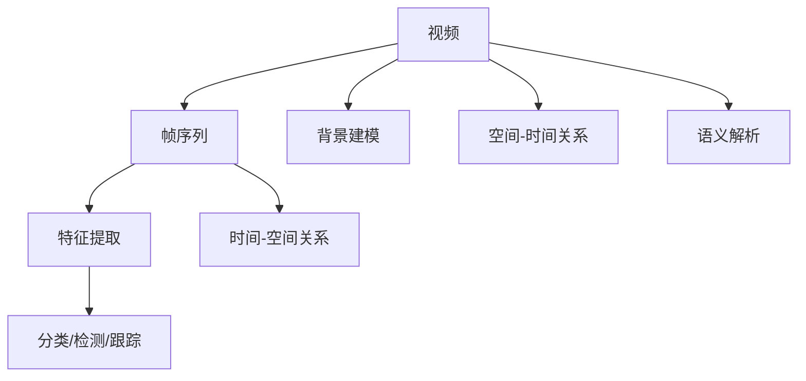

                 

# 深度学习在视频理解与分析中的应用

深度学习在过去十年中取得了迅猛发展，尤其是在计算机视觉和自然语言处理领域。然而，与图像和文本相比，视频的理解与分析具有更大的挑战性。视频不仅包含时间维度的信息，还涉及到复杂的语义和空间关系。本文将深入探讨深度学习在视频理解与分析中的应用，包括关键概念、核心算法、实现步骤、应用领域以及未来趋势。

## 1. 背景介绍

视频是时序数据，其数据量远大于图像，同时包含有声画等多模态信息。视频理解与分析的目标是从视频中提取出丰富的信息，例如对象识别、行为识别、场景理解等。深度学习特别是卷积神经网络（CNN）和循环神经网络（RNN）的兴起，使得视频理解与分析成为可能。随着计算能力的提升和数据量的增加，深度学习模型在视频理解与分析中的表现也越来越出色。

## 2. 核心概念与联系

### 2.1 核心概念概述

为了更好地理解深度学习在视频理解与分析中的应用，我们需要了解以下几个关键概念：

- 视频理解（Video Understanding）：指通过深度学习模型从视频中提取有意义的信息的过程。视频理解可以分为帧级别、帧序列级别和全视频级别。
- 动作识别（Action Recognition）：识别视频中的行为动作，通常用于监控、智能家居等领域。
- 对象检测与跟踪（Object Detection and Tracking）：识别视频中的物体并进行跟踪，广泛应用于无人驾驶、安防等领域。
- 场景理解（Scene Understanding）：从视频中理解场景中的环境、背景、光线等信息，常用于自动驾驶、智能监控等领域。

### 2.2 核心概念原理和架构的 Mermaid 流程图



这个流程图展示了视频理解与分析的基本流程：首先从视频中提取关键帧序列，然后通过特征提取、分类、检测和跟踪等手段提取视频中的信息。

## 3. 核心算法原理 & 具体操作步骤

### 3.1 算法原理概述

视频理解与分析的算法可以大致分为两类：一类是基于特征的方法，另一类是基于神经网络的方法。基于特征的方法通常包括尺度不变特征变换（SIFT）、HOG、局部二值模式（LBP）等。这些方法在早期的视频理解中占主导地位，但随着深度学习的兴起，其应用逐渐减少。

神经网络方法包括卷积神经网络（CNN）和循环神经网络（RNN）。CNN主要用于提取空间特征，RNN用于处理时间序列信息。近年来，随着深度学习模型的发展，出现了许多结合了CNN和RNN的模型，如3D CNN、时空卷积网络（TCN）、双向长短时记忆网络（BiLSTM）等。这些模型在视频理解与分析中取得了显著效果。

### 3.2 算法步骤详解

深度学习在视频理解与分析中的应用步骤通常包括以下几个环节：

**Step 1: 数据预处理**
- 对视频进行帧率调整、裁剪、旋转等预处理操作。
- 对视频中的每一帧进行去噪、归一化等预处理操作。

**Step 2: 特征提取**
- 使用深度学习模型提取视频帧的特征。常用的模型包括3D CNN、TCN、BiLSTM等。

**Step 3: 分类、检测、跟踪**
- 使用分类器对视频帧中的对象进行分类。
- 使用检测器对视频帧中的对象进行检测。
- 使用跟踪器对视频中的对象进行跟踪。

**Step 4: 场景理解**
- 通过多模态融合技术，从视频中提取环境、背景、光线等信息。
- 使用语义分割技术，对视频中的场景进行理解。

**Step 5: 结果后处理**
- 对分类、检测、跟踪结果进行后处理，如非极大值抑制（NMS）等。
- 对场景理解结果进行融合和处理。

### 3.3 算法优缺点

深度学习在视频理解与分析中的应用具有以下优点：

- 强大的特征提取能力。深度学习模型能够自动提取高维特征，无需手工设计特征。
- 良好的泛化能力。深度学习模型在处理视频理解与分析问题时，能够处理大量的训练数据，从而获得良好的泛化能力。
- 自动化的特征学习。深度学习模型能够自动学习特征，无需手工特征工程。

然而，深度学习在视频理解与分析中的应用也存在一些缺点：

- 高计算成本。深度学习模型需要大量的计算资源，特别是在处理大规模视频数据时。
- 数据需求量大。深度学习模型通常需要大量的标注数据，这些数据获取成本较高。
- 模型复杂度大。深度学习模型的复杂度较大，训练和推理速度较慢。

### 3.4 算法应用领域

深度学习在视频理解与分析中的应用已经广泛应用于多个领域，包括但不限于：

- 智能监控：视频中的人脸识别、行为识别等。
- 自动驾驶：视频中的道路、行人、车辆等检测与跟踪。
- 安防系统：视频中的人脸识别、行为识别等。
- 运动分析：视频中的人物动作、姿势等分析。
- 医学影像：视频中的人体部位、器官等检测与跟踪。

## 4. 数学模型和公式 & 详细讲解 & 举例说明

### 4.1 数学模型构建

在视频理解与分析中，通常使用卷积神经网络（CNN）来提取特征，循环神经网络（RNN）来处理时间序列信息。

假设有一个包含T帧的视频，帧数为T，每帧大小为H×W×C，则视频可以表示为一个三维张量X∈R^T×H×W×C。

### 4.2 公式推导过程

假设使用一个3D卷积神经网络对视频进行特征提取，输入视频为X，输出特征图为F，则3D卷积神经网络可以表示为：

$$
F = Conv3D(X, W, B)
$$

其中，$W$为卷积核，$B$为偏置项，$Conv3D$为3D卷积操作。

### 4.3 案例分析与讲解

以C3D模型为例，C3D模型是一个用于动作识别的3D卷积神经网络。其核心在于对每一帧视频进行卷积操作，提取时间、空间和空间时间混合的特征，然后将这些特征输入到全连接层进行分类。

## 5. 项目实践：代码实例和详细解释说明

### 5.1 开发环境搭建

在进行视频理解与分析的深度学习项目实践前，需要准备好开发环境。以下是使用Python进行TensorFlow开发的环境配置流程：

1. 安装Anaconda：从官网下载并安装Anaconda，用于创建独立的Python环境。

2. 创建并激活虚拟环境：
```bash
conda create -n video-env python=3.8 
conda activate video-env
```

3. 安装TensorFlow：根据CUDA版本，从官网获取对应的安装命令。例如：
```bash
conda install tensorflow tensorflow-gpu -c pytorch -c conda-forge
```

4. 安装OpenCV和其他相关工具包：
```bash
pip install opencv-python numpy scipy scikit-image tqdm
```

完成上述步骤后，即可在`video-env`环境中开始项目实践。

### 5.2 源代码详细实现

下面以C3D模型为例，展示使用TensorFlow实现视频动作识别的代码实现。

```python
import tensorflow as tf
import numpy as np
import cv2
import os

# 加载C3D模型
model = tf.keras.applications.C3D(input_shape=(16, 112, 112, 3), weights='imagenet', include_top=False)

# 定义动作识别函数
def recognize_action(video_path):
    cap = cv2.VideoCapture(video_path)
    frame_count = 0
    action_labels = []
    
    while cap.isOpened():
        ret, frame = cap.read()
        if ret:
            frame_count += 1
            if frame_count % 16 == 0:
                frame = cv2.resize(frame, (112, 112))
                frame = np.expand_dims(frame, axis=0)
                frame = frame / 255.0
                action_logits = model.predict(frame)
                action_label = np.argmax(action_logits, axis=-1)
                action_labels.append(action_label[0])
        else:
            break
    
    cap.release()
    return action_labels

# 测试动作识别函数
video_path = 'video.mp4'
action_labels = recognize_action(video_path)
print(action_labels)
```

### 5.3 代码解读与分析

在上述代码中，我们首先加载了C3D模型，该模型是一个用于动作识别的3D卷积神经网络。然后定义了一个`recognize_action`函数，用于对视频进行动作识别。

在函数内部，我们使用了OpenCV库对视频进行读取，并使用`cv2.resize`函数对视频帧进行归一化处理。接着，我们将处理后的视频帧输入到C3D模型中，得到每个时间步的logits，然后通过`np.argmax`函数得到对应的动作标签。

## 6. 实际应用场景

### 6.1 智能监控

智能监控系统可以实时对视频进行分析和处理，自动识别视频中的异常行为，如入侵、盗窃等。通过对视频中的行为进行分类和检测，智能监控系统可以及时报警，提高监控系统的安全性。

### 6.2 自动驾驶

自动驾驶系统需要实时处理道路、车辆、行人等数据，并进行行为识别和预测。通过对视频中的对象进行检测和跟踪，自动驾驶系统可以及时做出决策，避免交通事故。

### 6.3 安防系统

安防系统需要对视频进行实时分析和处理，自动识别视频中的异常行为，如入侵、盗窃等。通过对视频中的行为进行分类和检测，安防系统可以及时报警，提高安防系统的安全性。

### 6.4 运动分析

运动分析系统可以实时处理视频中的运动数据，如人物动作、姿势等。通过对视频中的动作进行识别和分类，运动分析系统可以提供运动数据，帮助人们进行运动训练和监控。

## 7. 工具和资源推荐

### 7.1 学习资源推荐

为了帮助开发者系统掌握深度学习在视频理解与分析中的应用，这里推荐一些优质的学习资源：

1. 《Deep Learning Specialization》系列课程：由Andrew Ng教授主讲，涵盖深度学习的基本概念和前沿技术，包括视频理解与分析。

2. 《CS231n: Convolutional Neural Networks for Visual Recognition》课程：斯坦福大学开设的计算机视觉明星课程，介绍了卷积神经网络在视频理解与分析中的应用。

3. 《Video Understanding with Deep Learning》书籍：详细介绍了深度学习在视频理解与分析中的应用，包括动作识别、对象检测、场景理解等任务。

4. arXiv上的相关论文：arXiv是一个开放的学术论文数据库，包含大量关于视频理解与分析的最新研究成果。

5. OpenCV官方文档：OpenCV是一个广泛使用的计算机视觉库，包含大量视频处理和分析的代码示例。

### 7.2 开发工具推荐

深度学习在视频理解与分析中的应用需要大量的计算资源和数据，因此需要高效的工具支持。以下是几款常用的开发工具：

1. TensorFlow：由Google主导开发的深度学习框架，生产部署方便，适合大规模工程应用。

2. PyTorch：基于Python的开源深度学习框架，灵活动态的计算图，适合快速迭代研究。

3. OpenCV：计算机视觉库，包含大量视频处理和分析的函数和代码示例。

4. Intel Media SDK：Intel提供的深度学习推理库，支持多GPU、多核优化。

5. NVIDIA CUDA SDK：NVIDIA提供的并行计算库，支持GPU加速。

6. AWS SageMaker：AWS提供的深度学习平台，支持云上部署和大规模训练。

### 7.3 相关论文推荐

深度学习在视频理解与分析中的应用源于学界的持续研究。以下是几篇奠基性的相关论文，推荐阅读：

1. Action Recognition with 3D Convolutional Neural Networks：提出C3D模型，用于动作识别任务。

2. Two-Stream ConvNets for Action Recognition：提出Two-Stream网络，用于结合空间和时序信息。

3. Temporal Shift CNNs for Action Recognition：提出Temporal Shift CNN，用于时序特征提取。

4. Spatial-Temporal Networks for Actions with Non-Maximum Suppression：提出Spatio-Temporal网络，用于非极大值抑制。

5. Action Understanding and Action Representations：综述了视频理解与分析的最新进展，包括动作识别、对象检测、场景理解等任务。

这些论文代表了大语言模型微调技术的发展脉络。通过学习这些前沿成果，可以帮助研究者把握学科前进方向，激发更多的创新灵感。

## 8. 总结：未来发展趋势与挑战

### 8.1 总结

本文对深度学习在视频理解与分析中的应用进行了全面系统的介绍。首先阐述了视频理解与分析的背景和重要性，明确了深度学习在处理视频理解与分析问题中的独特价值。其次，从原理到实践，详细讲解了视频理解与分析的数学模型和算法步骤，给出了视频理解与分析任务开发的完整代码实例。同时，本文还广泛探讨了深度学习在智能监控、自动驾驶、安防系统等多个行业领域的应用前景，展示了深度学习在视频理解与分析中的巨大潜力。此外，本文精选了深度学习在视频理解与分析中的学习资源、开发工具和相关论文，力求为读者提供全方位的技术指引。

通过本文的系统梳理，可以看到，深度学习在视频理解与分析中的应用正在逐步深入，为视频处理和分析提供了新的方法和工具。未来，伴随深度学习模型的不断演进，视频理解与分析技术必将在更多领域得到应用，为视频处理和分析带来新的突破。

### 8.2 未来发展趋势

展望未来，深度学习在视频理解与分析中的应用将呈现以下几个发展趋势：

1. 多模态融合：深度学习模型将结合视觉、语音、文本等多种模态信息，提升视频理解与分析的准确性和鲁棒性。

2. 实时处理：深度学习模型将采用更高效的计算方式和算法，实现实时处理大规模视频数据。

3. 跨领域应用：深度学习模型将与其他技术如强化学习、因果推理等相结合，拓展视频理解与分析的应用范围。

4. 自动化标注：通过无监督学习和自监督学习等技术，深度学习模型可以自动标注视频数据，减少人工标注成本。

5. 场景理解：深度学习模型将结合地理、时间、文化等多种因素，进行更全面的场景理解。

这些趋势凸显了深度学习在视频理解与分析中的广阔前景。这些方向的探索发展，必将进一步提升视频处理和分析的性能和应用范围，为视频处理和分析技术带来新的突破。

### 8.3 面临的挑战

尽管深度学习在视频理解与分析中的应用已经取得了显著成果，但在迈向更加智能化、普适化应用的过程中，仍面临诸多挑战：

1. 数据获取难度大。深度学习模型需要大量的标注数据，但大规模视频数据的获取成本较高。

2. 计算资源需求大。深度学习模型需要大量的计算资源，特别是在处理大规模视频数据时。

3. 模型泛化能力差。深度学习模型在处理复杂视频数据时，泛化能力较差。

4. 实时性不足。深度学习模型在实时处理大规模视频数据时，效率较低。

5. 模型鲁棒性差。深度学习模型在处理视频中的噪声和干扰时，鲁棒性较差。

### 8.4 未来突破

面对深度学习在视频理解与分析中面临的挑战，未来的研究需要在以下几个方面寻求新的突破：

1. 数据增强：通过数据增强技术，生成更多的标注数据，提高模型泛化能力。

2. 模型优化：通过模型优化技术，如模型剪枝、量化等，提高模型效率和实时性。

3. 多模态融合：通过多模态融合技术，结合视觉、语音、文本等多种信息，提升模型性能。

4. 跨领域应用：通过跨领域应用技术，将深度学习模型应用于更多领域，拓展其应用范围。

5. 实时处理：通过实时处理技术，如硬件加速、算法优化等，提高模型实时性。

6. 场景理解：通过场景理解技术，结合地理、时间、文化等多种因素，进行更全面的场景理解。

这些研究方向将推动深度学习在视频理解与分析中的应用，进一步提升其性能和应用范围。

## 9. 附录：常见问题与解答

**Q1: 深度学习在视频理解与分析中的应用是否适用于所有类型的视频？**

A: 深度学习在视频理解与分析中的应用通常需要满足以下几个条件：视频帧率适中、视频分辨率较高、视频中包含明显的时间、空间信息等。对于运动模糊严重、低分辨率视频等不适合深度学习处理的视频，需要结合其他技术进行处理。

**Q2: 在视频理解与分析中，如何选择深度学习模型？**

A: 在视频理解与分析中，选择深度学习模型需要考虑以下几个因素：视频数据规模、视频分辨率、视频帧率等。一般来说，视频分辨率越高、帧率越低，模型需要的计算资源越大。同时，也需要考虑模型在目标任务上的性能表现。

**Q3: 如何提高深度学习在视频理解与分析中的应用效率？**

A: 提高深度学习在视频理解与分析中的应用效率，可以从以下几个方面进行：

1. 使用硬件加速技术，如GPU、TPU等。

2. 使用模型压缩技术，如模型剪枝、量化等。

3. 使用多模态融合技术，结合视觉、语音、文本等多种信息，提升模型性能。

4. 使用数据增强技术，生成更多的标注数据，提高模型泛化能力。

**Q4: 如何保证深度学习在视频理解与分析中的鲁棒性？**

A: 提高深度学习在视频理解与分析中的鲁棒性，可以从以下几个方面进行：

1. 使用数据增强技术，生成更多的标注数据，提高模型泛化能力。

2. 使用模型优化技术，如模型剪枝、量化等，提高模型效率和实时性。

3. 使用多模态融合技术，结合视觉、语音、文本等多种信息，提升模型性能。

4. 使用跨领域应用技术，将深度学习模型应用于更多领域，拓展其应用范围。

**Q5: 如何实现深度学习在视频理解与分析中的实时性？**

A: 实现深度学习在视频理解与分析中的实时性，可以从以下几个方面进行：

1. 使用硬件加速技术，如GPU、TPU等。

2. 使用模型压缩技术，如模型剪枝、量化等。

3. 使用多模态融合技术，结合视觉、语音、文本等多种信息，提升模型性能。

4. 使用实时处理技术，如算法优化等，提高模型实时性。

总之，深度学习在视频理解与分析中的应用需要根据具体任务和数据特点进行全面优化，才能得到理想的效果。

---

作者：禅与计算机程序设计艺术 / Zen and the Art of Computer Programming

