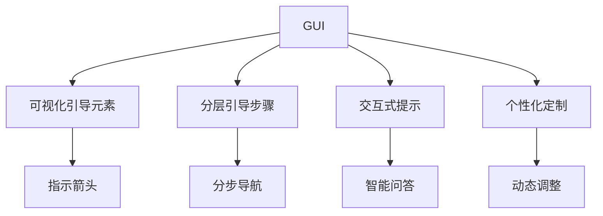

                 

## 1. 背景介绍

### 1.1 问题由来

在当今智能设备和信息时代，图形用户界面（Graphical User Interface，CUI）因其直观、易用的特性，逐渐成为计算机用户的主要交互方式。无论是智能手机、平板电脑，还是PC，CUI无处不在。然而，随着用户需求的日益丰富化，传统的CUI也面临着诸多挑战。

一方面，传统的CUI往往依赖鼠标、键盘等输入设备，对于视力障碍、行动不便的用户群体不够友好。另一方面，由于图形化的特点，用户容易在复杂的操作步骤上迷失方向，导致操作效率低下，甚至误操作。这些问题的出现，导致CUI在某些情境下难以满足用户的期望。

### 1.2 问题核心关键点

为解决上述问题，清晰的引导（Clear Guidance，CG）应运而生。它是一种新兴的CUI设计理念，旨在通过引导用户逐步完成操作，从而提升用户体验，特别是对于那些有视觉障碍、行动不便、记忆能力不足的用户。

**核心关键点包括**：
- **可视化引导元素**：通过图形、动画等方式，为用户的每一步操作提供明确的视觉反馈。
- **分层引导步骤**：将复杂操作分解为一系列层次化的小步骤，便于用户逐步理解和执行。
- **交互式提示**：利用智能问答、自然语言理解技术，实时获取用户反馈，动态调整引导步骤。
- **个性化定制**：根据用户的行为和偏好，动态调整引导策略，提升个性化体验。

这些关键点共同构成了一个功能强大且用户友好的CUI设计框架，旨在让每个用户都能以最舒适的方式使用计算机。

## 2. 核心概念与联系

### 2.1 核心概念概述

为更深入理解CUI中的清晰引导实现方法，本节将介绍几个关键概念及其相互联系：

- **图形用户界面（GUI）**：计算机用户通过图形、符号等方式进行交互的接口。它包括菜单栏、工具栏、工具栏按钮、文本区域、滚动条、文本输入框等基本元素。
- **可视化引导元素**：用于辅助用户操作的界面元素，包括指示箭头、图标、提示框等，为用户的操作提供可视化反馈。
- **分层引导步骤**：将复杂操作分解为多个层次化的小步骤，逐步引导用户完成操作。
- **交互式提示**：利用智能问答、自然语言理解等技术，实时获取用户反馈，动态调整引导策略。
- **个性化定制**：根据用户行为和偏好，动态调整引导策略，提升个性化体验。

这些概念通过一系列的技术手段和设计原则，实现了CUI中的清晰引导，提高了用户体验和操作效率。

### 2.2 核心概念原理和架构的 Mermaid 流程图



以上流程图展示了CUI中清晰引导的设计原理和架构：

1. **GUI** 作为基础，通过可视化引导元素、分层引导步骤、交互式提示和个性化定制，逐步实现清晰引导。
2. **可视化引导元素** 包括指示箭头、图标、提示框等，为用户提供明确的视觉反馈。
3. **分层引导步骤** 将复杂操作分解为多个层次化的小步骤，便于用户逐步理解和执行。
4. **交互式提示** 利用智能问答、自然语言理解等技术，实时获取用户反馈，动态调整引导策略。
5. **个性化定制** 根据用户行为和偏好，动态调整引导策略，提升个性化体验。

## 3. 核心算法原理 & 具体操作步骤

### 3.1 算法原理概述

清晰引导的核心算法原理，旨在通过智能化的交互方式，逐步引导用户完成复杂操作，提高用户体验和操作效率。其基本流程如下：

1. **初始化**：系统根据用户的当前状态，生成一个初始引导方案。
2. **交互式提示**：通过智能问答或自然语言理解技术，获取用户的即时反馈。
3. **动态调整**：根据用户反馈，动态调整引导策略。
4. **反馈与优化**：根据用户的操作行为，持续优化引导方案。

### 3.2 算法步骤详解

**Step 1: 用户状态分析**
- 分析用户当前的使用环境和行为模式，确定其操作能力、偏好和需求。
- 收集用户的行为数据，如点击、滚动、输入等，用于后续引导策略的优化。

**Step 2: 初始引导方案生成**
- 根据用户状态和操作目标，生成一个初步的引导方案。例如，对于复杂的软件安装过程，可以分解为下载、解压、配置、启动等多个小步骤。
- 将引导方案中的每个步骤，转换为可视化引导元素，如指示箭头、提示框等，展示在界面上。

**Step 3: 交互式提示**
- 利用智能问答或自然语言理解技术，获取用户的即时反馈。例如，通过语音识别获取用户指令，或通过文本输入框获取用户输入。
- 根据用户的反馈，动态调整引导策略。例如，如果用户对某个步骤不理解，系统可以提供更详细的解释或重新演示。

**Step 4: 动态调整与优化**
- 根据用户的操作行为，持续优化引导方案。例如，记录用户的操作路径和选择，优化后续引导步骤的顺序和内容。
- 定期评估引导方案的效果，根据用户满意度进行优化。例如，通过用户调研或行为数据分析，调整引导步骤的复杂度和可视化效果。

### 3.3 算法优缺点

清晰引导的算法具有以下优点：
1. **提升用户体验**：通过逐步引导，降低了复杂操作的难度，提高了用户的操作效率。
2. **增强可访问性**：对于有视觉障碍或行动不便的用户，提供了更加友好和可访问的交互方式。
3. **个性化定制**：根据用户的行为和偏好，动态调整引导策略，提升个性化体验。

同时，该算法也存在一定的局限性：
1. **算法复杂性**：需要利用智能问答和自然语言理解等技术，算法实现较为复杂。
2. **资源消耗**：动态调整和实时反馈需要消耗较多计算资源，影响系统性能。
3. **数据隐私**：用户行为数据的收集和使用，可能涉及隐私和安全问题。

尽管存在这些局限性，但总体而言，清晰引导算法在提升CUI用户体验和可访问性方面具有显著优势，值得进一步探索和优化。

### 3.4 算法应用领域

清晰引导算法在多个领域得到了广泛应用，例如：

- **智能手机**：在软件安装、应用设置等复杂操作中，通过可视化引导元素和分层引导步骤，提升用户体验。
- **PC操作系统**：在软件安装、系统设置等复杂操作中，提供逐步引导和实时反馈，帮助用户快速上手。
- **智能家居设备**：通过交互式提示和个性化定制，提升用户对设备的操作体验。
- **医疗设备**：在复杂的操作流程中，如医疗设备配置、检查结果解读等，提供清晰的引导和实时反馈，减少误操作风险。
- **教育软件**：在复杂的学习流程中，如课程选择、任务提交等，提供逐步引导和实时反馈，提升学习效果。

## 4. 数学模型和公式 & 详细讲解 & 举例说明

### 4.1 数学模型构建

本节将使用数学语言对CUI中清晰引导的实现方法进行更严谨的刻画。

记用户当前操作状态为 $S_t$，引导方案为 $G_t$，用户反馈为 $F_t$。系统根据用户当前状态和操作目标，生成一个初始引导方案 $G_0$，并将其展示在界面上。然后，系统通过交互式提示获取用户反馈 $F_t$，根据反馈动态调整引导方案 $G_t$。优化目标是最小化引导过程中用户的操作成本和时间，即：

$$
\min_{G_t} \sum_{t} \mathcal{C}(G_t, F_t)
$$

其中 $\mathcal{C}$ 为成本函数，用于衡量用户对引导方案的满意度。

### 4.2 公式推导过程

为了更好地理解成本函数 $\mathcal{C}$ 的计算方式，以下将以安装软件为例，推导成本函数的公式：

1. **步骤复杂度**：将每个引导步骤的复杂度赋值 $c_i$，成本函数中每个步骤的权重 $w_i$ 表示该步骤的重要性。
2. **用户满意度**：根据用户反馈 $F_t$，定义用户对当前引导步骤的满意度 $s_t$。满意度可以通过用户的操作时间、点击次数等指标衡量。
3. **权重调整**：根据用户满意度，动态调整每个步骤的权重 $w_i$。例如，如果用户对某个步骤满意度低，可以增加该步骤的权重。

综上所述，成本函数可以表示为：

$$
\mathcal{C}(G_t, F_t) = \sum_i w_i c_i \log(1+s_i)
$$

其中 $s_i$ 为第 $i$ 个步骤的满意度，$w_i$ 为第 $i$ 个步骤的权重，$c_i$ 为第 $i$ 个步骤的复杂度。

### 4.3 案例分析与讲解

以一个简单的邮件发送为例，分析清晰引导算法的应用：

1. **初始化**：系统分析用户的当前状态和操作目标，生成一个初始引导方案 $G_0$，包括选择收件人、编写邮件、附件上传等步骤。
2. **交互式提示**：用户通过文本输入框输入收件人地址，系统展示可视化的提示框，指示下一步操作。
3. **动态调整**：如果用户输入错误，系统重新提示正确的收件人地址。如果用户输入正确，系统展示下一个操作提示。
4. **反馈与优化**：记录用户的操作路径和满意度，优化后续引导方案，如自动填写常用收件人地址，减少用户输入时间。

通过这个案例，可以看到，清晰引导算法通过逐步引导和实时反馈，显著提升了邮件发送的操作效率和用户体验。

## 5. 项目实践：代码实例和详细解释说明

### 5.1 开发环境搭建

在进行清晰引导实践前，我们需要准备好开发环境。以下是使用Python进行Web开发的环境配置流程：

1. 安装Anaconda：从官网下载并安装Anaconda，用于创建独立的Python环境。

2. 创建并激活虚拟环境：
```bash
conda create -n web-env python=3.8 
conda activate web-env
```

3. 安装Flask：通过pip安装Flask框架，用于开发Web应用。
```bash
pip install Flask
```

4. 安装相关依赖：
```bash
pip install requests json
```

完成上述步骤后，即可在`web-env`环境中开始清晰引导的实践。

### 5.2 源代码详细实现

下面我们以一个简单的在线表单提交为例，给出清晰引导在Web应用中的代码实现。

首先，定义Web应用的入口文件 `app.py`：

```python
from flask import Flask, render_template, request

app = Flask(__name__)

@app.route('/')
def index():
    return render_template('index.html')

@app.route('/submit', methods=['POST'])
def submit():
    # 获取用户输入数据
    data = request.form
    # 验证用户输入
    if 'email' in data and 'password' in data:
        # 执行提交操作
        return '提交成功'
    else:
        return '输入不完整', 400

if __name__ == '__main__':
    app.run(debug=True)
```

然后，定义表单页面 `index.html`：

```html
<!DOCTYPE html>
<html>
<head>
    <title>在线表单提交</title>
    <script src="https://cdn.jsdelivr.net/npm/axios/dist/axios.min.js"></script>
    <script>
        async function submitForm() {
            const data = {
                email: document.getElementById('email').value,
                password: document.getElementById('password').value
            };
            const response = await axios.post('/submit', data);
            alert(response.data);
        }
    </script>
</head>
<body>
    <h1>在线表单提交</h1>
    <form id="form">
        <label for="email">邮箱：</label>
        <input type="email" id="email" required><br><br>
        <label for="password">密码：</label>
        <input type="password" id="password" required><br><br>
        <button onclick="submitForm()">提交</button>
    </form>
</body>
</html>
```

最后，定义一个简单的交互式引导，以用户输入表单数据为例：

```html
<!DOCTYPE html>
<html>
<head>
    <title>在线表单提交</title>
    <script src="https://cdn.jsdelivr.net/npm/axios/dist/axios.min.js"></script>
    <script>
        async function submitForm() {
            const data = {
                email: document.getElementById('email').value,
                password: document.getElementById('password').value
            };
            const response = await axios.post('/submit', data);
            alert(response.data);
        }
        
        async function showGuidance() {
            const emailInput = document.getElementById('email');
            const passwordInput = document.getElementById('password');
            
            // 获取用户输入数据
            const email = emailInput.value;
            const password = passwordInput.value;
            
            // 验证用户输入
            if (email === '' || password === '') {
                emailInput.value = '';
                passwordInput.value = '';
                alert('请填写完整');
                return;
            }
            
            // 执行提交操作
            const response = await axios.post('/submit', {email: email, password: password});
            alert(response.data);
        }
    </script>
</head>
<body>
    <h1>在线表单提交</h1>
    <form id="form">
        <label for="email">邮箱：</label>
        <input type="email" id="email" required><br><br>
        <label for="password">密码：</label>
        <input type="password" id="password" required><br><br>
        <button onclick="showGuidance()">提交</button>
    </form>
</body>
</html>
```

### 5.3 代码解读与分析

让我们再详细解读一下关键代码的实现细节：

**app.py**：
- `app.route('/')`：定义Web应用的根路径，展示表单页面。
- `@app.route('/submit', methods=['POST'])`：定义表单提交的路径，获取用户输入数据并执行提交操作。

**index.html**：
- `<form id="form">`：定义表单的基本结构，包含邮箱和密码输入框。
- `<label>` 和 `<input>` 元素：用于展示表单标题和用户输入项。
- `onclick` 事件：绑定表单提交事件，调用 `showGuidance()` 函数进行交互式引导。

**showGuidance.js**：
- `submitForm()` 函数：定义表单提交的基本逻辑，获取用户输入数据并发送请求。
- `showGuidance()` 函数：定义交互式引导的逻辑，包括获取用户输入、验证输入、执行提交操作等。

通过这些代码实现，可以看到清晰引导在Web应用中的基本流程：首先展示表单页面，然后通过交互式引导获取用户输入，验证输入后执行提交操作。这种方式不仅提高了表单提交的效率，还增强了用户体验，特别是对于有视觉障碍或行动不便的用户。

## 6. 实际应用场景

### 6.1 在线教育平台

在线教育平台提供了丰富的课程资源和学习工具，但也面临着复杂的操作流程和用户引导问题。通过清晰引导算法，可以显著提升用户的学习体验，特别是在一些较为复杂的任务中，如在线测试、视频学习、作业提交等。

具体而言，系统可以根据用户的当前学习状态和操作目标，生成一个初始引导方案。例如，对于在线测试，可以分解为选择测试科目、阅读测试说明、进入测试界面等步骤。在用户操作过程中，系统通过交互式提示和动态调整，逐步引导用户完成每一步操作。例如，当用户遇到复杂的操作时，系统可以展示详细的步骤说明，并提供实时反馈，帮助用户顺利通过测试。

### 6.2 在线医疗咨询

在线医疗咨询平台为用户提供了方便快捷的问诊服务，但也面临着用户操作复杂、信息填写繁琐等问题。通过清晰引导算法，可以显著提升用户的问诊体验，特别是对于有视觉障碍或行动不便的用户。

具体而言，系统可以根据用户的当前医疗状态和操作目标，生成一个初始引导方案。例如，在问诊流程中，可以分解为选择医生、填写病史、提交问诊请求等步骤。在用户操作过程中，系统通过交互式提示和动态调整，逐步引导用户完成每一步操作。例如，当用户填写病史时，系统可以提供实时填写帮助，如自动补全常见病史、智能推荐相关症状等。

### 6.3 在线购物平台

在线购物平台提供了丰富的商品选择和购物工具，但也面临着复杂的操作流程和用户引导问题。通过清晰引导算法，可以显著提升用户的购物体验，特别是在一些较为复杂的任务中，如商品搜索、加入购物车、结算支付等。

具体而言，系统可以根据用户的当前购物状态和操作目标，生成一个初始引导方案。例如，在商品搜索流程中，可以分解为输入关键字、选择商品、加入购物车等步骤。在用户操作过程中，系统通过交互式提示和动态调整，逐步引导用户完成每一步操作。例如，当用户搜索商品时，系统可以提供实时搜索建议，如自动补全商品名称、智能推荐相关商品等。

## 7. 工具和资源推荐

### 7.1 学习资源推荐

为了帮助开发者系统掌握清晰引导的理论基础和实践技巧，这里推荐一些优质的学习资源：

1. **《人类交互设计原理》（*The Principles of Human-Computer Interaction*）**：Don Norman的经典著作，全面介绍了人类交互设计的原则和方法，对于理解清晰引导的原理和应用具有重要参考价值。

2. **《设计心理学》（*Designing for Interaction*）**：Susan Weinschenk的著作，详细讲解了交互设计中的心理学原理，包括用户注意力、认知负荷等方面，对设计清晰引导有重要指导意义。

3. **《Web设计模式》（*Web Design Patterns*）**：Douglas Crockford的著作，介绍了Web设计中的常见模式和最佳实践，涵盖了交互设计、UI设计、可用性测试等方面，有助于提升清晰引导的设计水平。

4. **《用户界面设计》（*User Interface Design*）**：Jesse James Garrett的著作，详细讲解了用户界面设计的基本原理和设计流程，对于理解清晰引导的实现方法有重要参考价值。

5. **《Web交互设计》（*Interaction Design Foundation*）**：IDF提供的在线课程，系统讲解了交互设计的基本原理、方法和工具，涵盖了设计心理学、可用性测试、原型设计等方面，是提升清晰引导设计能力的好资源。

通过对这些资源的学习实践，相信你一定能够全面掌握清晰引导的实现方法，并用于解决实际的CUI设计问题。

### 7.2 开发工具推荐

高效的开发离不开优秀的工具支持。以下是几款用于清晰引导开发的常用工具：

1. **Axure RP**：专业的原型设计工具，支持复杂的交互设计，适用于可视化引导元素的设计和实现。
2. **Sketch**：流行的UI设计工具，支持高保真原型制作，适用于分层引导步骤的设计和实现。
3. **Adobe XD**：全方位的UI/UX设计工具，支持交互设计、原型设计和用户测试，适用于个性化的定制和优化。
4. **InVision Studio**：全面的设计工具，支持复杂的交互设计和用户测试，适用于交互式提示和动态调整的设计和实现。
5. **Figma**：云端设计工具，支持实时协作和共享，适用于交互式提示和动态调整的设计和实现。

合理利用这些工具，可以显著提升清晰引导的开发效率，快速迭代和优化设计方案。

### 7.3 相关论文推荐

清晰引导技术的发展源于学界的持续研究。以下是几篇奠基性的相关论文，推荐阅读：

1. **《自然语言用户界面设计》（*Natural Language User Interfaces*）**：Stuart R. Scherer的论文，探讨了自然语言用户界面的设计原理和实现方法，为清晰引导技术提供了理论基础。

2. **《智能引导系统设计》（*Intelligent Guidance System Design*）**：Dorota Parekh的论文，介绍了智能引导系统的设计和实现，涵盖了可视引导元素、分层引导步骤、交互式提示等方面。

3. **《交互式引导技术综述》（*Survey on Interactive Guidance Technologies*）**：Elena Paskova的论文，总结了交互式引导技术的最新进展，包括可视化引导元素、分层引导步骤、个性化定制等方面。

4. **《个性化用户界面设计》（*Personalized User Interface Design*）**：Marie-Christine Rousset的论文，探讨了个性化用户界面设计的原理和实现方法，为清晰引导的个性化定制提供了理论支持。

这些论文代表了清晰引导技术的最新研究成果，通过学习这些前沿成果，可以帮助研究者把握学科前进方向，激发更多的创新灵感。

## 8. 总结：未来发展趋势与挑战

### 8.1 研究成果总结

本文对清晰引导在CUI中的实现方法进行了全面系统的介绍。首先阐述了清晰引导的背景和意义，明确了其在提升用户体验和可访问性方面的重要价值。其次，从原理到实践，详细讲解了清晰引导的数学模型和操作步骤，给出了清晰引导任务开发的完整代码实例。同时，本文还广泛探讨了清晰引导在在线教育、在线医疗、在线购物等多个行业领域的应用前景，展示了其广泛的适用性。最后，本文精选了清晰引导的学习资源、开发工具和相关论文，力求为开发者提供全方位的技术指引。

通过本文的系统梳理，可以看到，清晰引导算法在提升CUI用户体验和可访问性方面具有显著优势，值得进一步探索和优化。未来，随着技术的不断进步和应用的不断扩展，清晰引导必将在更多领域得到应用，为CUI设计带来新的突破。

### 8.2 未来发展趋势

展望未来，清晰引导技术将呈现以下几个发展趋势：

1. **人工智能与自然语言结合**：未来清晰引导将更广泛地利用自然语言处理和机器学习技术，提供更智能化的交互方式，提升用户体验。例如，通过智能问答获取用户反馈，动态调整引导策略。

2. **个性化与适应性增强**：未来清晰引导将更加注重个性化定制和适应性优化，根据用户的行为和偏好，动态调整引导策略，提升个性化体验。例如，通过用户行为数据分析，优化引导步骤和提示信息。

3. **多渠道和多设备支持**：未来清晰引导将拓展到更多设备和渠道，如移动设备、智能家居、车联网等，提供跨平台的用户体验。例如，通过适配不同设备和平台的交互设计，提升用户的操作效率和满意度。

4. **交互式与沉浸式结合**：未来清晰引导将更加注重交互式和沉浸式设计，提供更丰富和多样的交互体验。例如，通过虚拟现实和增强现实技术，提供沉浸式的引导体验。

5. **无障碍与易用性增强**：未来清晰引导将更注重无障碍设计和易用性优化，提供更友好的交互体验。例如，通过无障碍设计和易用性测试，确保所有用户都能轻松使用。

以上趋势凸显了清晰引导技术的广阔前景，这些方向的探索发展，必将进一步提升CUI系统的用户体验和可访问性，为人类智能交互带来新的突破。

### 8.3 面临的挑战

尽管清晰引导技术已经取得了显著成果，但在迈向更加智能化、普适化应用的过程中，它仍面临诸多挑战：

1. **算法复杂性**：需要利用智能问答和自然语言理解等技术，算法实现较为复杂，需要更高的计算资源和更多的数据支持。
2. **用户隐私保护**：用户行为数据的收集和使用，可能涉及隐私和安全问题，需要更多的数据保护措施和技术手段。
3. **跨平台兼容性**：不同设备和平台的交互设计差异较大，如何实现跨平台的无缝体验，需要更多的适配和优化。
4. **用户期望差异**：不同用户的需求和期望差异较大，如何设计统一的引导方案，需要更多的用户调研和数据分析。
5. **技术标准统一**：目前清晰引导的标准和规范尚未统一，如何制定统一的技术标准，需要更多的行业合作和标准制定。

尽管存在这些挑战，但总体而言，清晰引导技术在提升CUI用户体验和可访问性方面具有显著优势，值得进一步探索和优化。

### 8.4 研究展望

面对清晰引导面临的挑战，未来的研究需要在以下几个方面寻求新的突破：

1. **优化算法实现**：研发更加高效的算法实现，降低计算资源消耗，提升系统的实时性和稳定性。例如，通过模型压缩和优化，实现轻量级和高效的引导算法。

2. **保护用户隐私**：制定更加完善的数据保护措施，确保用户行为数据的隐私和安全。例如，采用差分隐私和联邦学习等技术，保护用户数据隐私。

3. **实现跨平台适配**：开发跨平台的交互设计工具和框架，确保不同设备和平台的用户体验一致。例如，通过统一的API和UI设计规范，实现跨平台的无缝体验。

4. **提升用户满意度**：进行更多的用户调研和行为分析，理解不同用户的需求和期望，设计更加人性化和个性化的引导方案。例如，通过用户反馈和数据分析，优化引导步骤和提示信息。

5. **制定技术标准**：制定清晰引导的技术标准和规范，推动行业规范和标准的统一。例如，通过制定统一的技术标准，推动行业协作和标准化。

这些研究方向将为清晰引导技术带来新的突破，推动其在更多领域得到应用，为CUI设计带来新的突破。

## 9. 附录：常见问题与解答

**Q1：清晰引导是否只适用于有视觉障碍或行动不便的用户？**

A: 清晰引导的核心在于通过逐步引导和实时反馈，提升用户体验和操作效率，适用于所有用户。特别是对于有视觉障碍或行动不便的用户，清晰引导能够提供更加友好的交互方式，帮助他们更好地使用计算机。但对于一般用户，清晰引导同样能够提升操作效率和满意度。

**Q2：如何平衡引导步骤的复杂度和用户满意度？**

A: 平衡引导步骤的复杂度和用户满意度，需要根据用户的行为和反馈进行调整。一般而言，引导步骤的复杂度需要适度，既不过于简单，导致用户难以理解；也不过于复杂，导致用户感到困惑。具体来说，可以通过以下方式进行优化：

1. **用户行为分析**：通过用户的操作数据和反馈，分析引导步骤的复杂度，优化后续引导方案。例如，记录用户的操作路径和点击次数，优化引导步骤的顺序和内容。

2. **用户满意度调查**：通过用户满意度调查，了解用户对引导步骤的接受程度，进一步调整引导方案。例如，通过问卷调查和用户访谈，收集用户反馈，优化引导步骤的复杂度和可视化效果。

3. **动态调整引导策略**：根据用户的操作行为和反馈，动态调整引导策略，提升用户满意度。例如，对于用户感到困惑的引导步骤，系统可以提供更详细的解释或重新演示。

**Q3：如何实现跨平台的无缝体验？**

A: 实现跨平台的无缝体验，需要开发跨平台的交互设计工具和框架，确保不同设备和平台的用户体验一致。具体来说，可以通过以下方式进行优化：

1. **统一的API和UI设计规范**：开发统一的API和UI设计规范，确保不同平台和设备的用户交互方式一致。例如，采用统一的API接口和UI组件库，实现跨平台的无缝体验。

2. **适配不同设备和平台**：开发适配不同设备和平台的交互设计工具，确保用户在不同平台上的体验一致。例如，通过适配不同设备和平台的UI设计规范，实现跨平台的无缝体验。

3. **用户调研和行为分析**：进行更多的用户调研和行为分析，理解不同用户的需求和期望，设计统一的引导方案。例如，通过用户调研和行为分析，优化跨平台的引导策略。

4. **持续优化和迭代**：持续优化和迭代引导方案，提升跨平台的无缝体验。例如，通过用户反馈和数据分析，不断优化跨平台的引导方案。

通过这些方式，可以有效地提升跨平台的无缝体验，确保不同设备和平台的用户都能轻松使用。

---

作者：禅与计算机程序设计艺术 / Zen and the Art of Computer Programming

