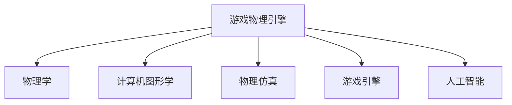

                 

# 游戏物理引擎：真实世界模拟

> 关键词：游戏物理引擎, 真实世界模拟, 游戏引擎, 物理学, 计算机图形学, 物理仿真, 游戏开发, 人工智能, 机器学习

## 1. 背景介绍

### 1.1 问题由来

在电子游戏开发中，真实世界的模拟一直是难点和瓶颈。传统的2D和3D游戏引擎虽然在图像渲染和动画处理上有一定的技术积累，但很难实现复杂的物理现象模拟，如流体、布料、刚体碰撞等。为了解决这些问题，游戏开发者逐渐引入了物理引擎，通过物理学原理构建数学模型，模拟现实世界的物理行为，并应用到游戏中的虚拟世界。

近年来，随着计算机图形学、计算物理学和人工智能等技术的发展，高性能物理引擎逐渐成熟，并应用于各种类型的游戏和虚拟现实中。例如，Unity和Unreal等主流游戏引擎内置了强大的物理引擎，广泛应用于电影特效、游戏制作和虚拟现实等场景。

本文将系统地介绍游戏物理引擎的原理、算法和应用，以帮助读者深入理解游戏物理引擎的工作机制，并在实际开发中灵活应用相关技术。

## 2. 核心概念与联系

### 2.1 核心概念概述

为更好地理解游戏物理引擎，本节将介绍几个密切相关的核心概念：

- 游戏物理引擎：是一种基于物理学的游戏引擎，通过构建复杂的数学模型，模拟和渲染游戏中的物理行为，如刚体运动、流体流动、布料变形等。
- 物理学：是研究物质、能量、时间和空间等基本概念及其规律的科学。游戏中的物理模拟通常基于经典力学和流体力学等经典物理学原理。
- 计算机图形学：是计算机科学与艺术的交叉学科，主要研究如何在计算机上生成、渲染和显示图形图像。游戏物理引擎中涉及到大量的图像处理和渲染技术。
- 物理仿真：是通过数学模型和计算机仿真技术，模拟真实世界的物理行为。游戏中的物理引擎就是物理仿真的应用实例。
- 游戏引擎：是一种软件框架，提供游戏开发所需的工具和接口，包括物理引擎在内的多个子系统，用于开发各种类型的游戏。
- 人工智能：是研究如何让计算机具有类似人类智能行为的技术，游戏中的AI决策系统常常需要结合物理仿真进行优化。

这些核心概念之间的逻辑关系可以通过以下Mermaid流程图来展示：



这个流程图展示了几大核心概念之间的关系：

1. 游戏物理引擎建立在物理学的基础上，通过数学模型模拟真实世界的物理行为。
2. 计算机图形学提供图像渲染和显示技术，与物理引擎密切结合，实现复杂的场景渲染。
3. 物理仿真通过数学模型和计算仿真，将物理规律应用于游戏开发中。
4. 游戏引擎是一个软件框架，集成了多个子系统，包括物理引擎，用于支持游戏开发。
5. 人工智能通过机器学习和深度学习技术，结合物理引擎，优化游戏中的智能行为。

## 3. 核心算法原理 & 具体操作步骤

### 3.1 算法原理概述

游戏物理引擎的核心算法主要包括：刚体动力学、流体仿真、布料模拟、碰撞检测等。这些算法通过数学模型和仿真技术，模拟和渲染游戏中的物理行为。

以刚体动力学为例，假设有N个刚体，每个刚体的状态由位置、速度和角速度等变量描述。在每一帧的计算中，需要根据物理定律更新每个刚体的状态变量，如牛顿第二定律：

$$
F = ma
$$

其中，$F$ 为合外力，$m$ 为质量，$a$ 为加速度。通过求解牛顿方程，可以计算出每个刚体的加速度和位置变化，实现物体的动态模拟。

### 3.2 算法步骤详解

游戏物理引擎的核心算法步骤如下：

1. **初始化**：设置游戏场景的初始物理状态，包括物体的初始位置、速度、旋转速度等。
2. **时间步更新**：每一帧的计算中，根据物理定律更新物体的状态变量。
3. **碰撞检测**：检测物体之间的碰撞，根据碰撞情况调整物体的状态。
4. **可视化**：将计算得到的物理状态渲染成图像，展示在屏幕上。

具体算法步骤如下：

1. **刚体动力学**：
   - 初始化物体的状态变量：位置 $\vec{r}$、速度 $\vec{v}$、加速度 $\vec{a}$、角速度 $\vec{\omega}$、角加速度 $\vec{\alpha}$ 等。
   - 根据牛顿第二定律计算物体的加速度 $\vec{a}$：
     \[
     \vec{a} = \frac{1}{m} \sum_{i} \vec{F}_i
     \]
   - 更新物体的位置和速度：
     \[
     \vec{r} = \vec{r} + \vec{v} \cdot \Delta t
     \]
     \[
     \vec{v} = \vec{v} + \vec{a} \cdot \Delta t
     \]
   - 更新物体的旋转状态：
     \[
     \vec{\omega} = \vec{\omega} + \vec{\alpha} \cdot \Delta t
     \]
     \[
     \vec{\theta} = \vec{\theta} + \vec{\omega} \cdot \Delta t
     \]

2. **流体仿真**：
   - 初始化流体的状态变量：密度 $\rho$、速度 $\vec{u}$、压力 $p$ 等。
   - 使用Navier-Stokes方程计算流体的速度和压力：
     \[
     \frac{\partial \vec{u}}{\partial t} + \vec{u} \cdot \nabla \vec{u} = -\frac{1}{\rho} \nabla p + \nu \nabla^2 \vec{u}
     \]
   - 计算流体的流动状态，如涡旋、波纹等。

3. **布料模拟**：
   - 初始化布料的状态变量：位置 $\vec{r}$、速度 $\vec{v}$、角速度 $\vec{\omega}$ 等。
   - 使用布料的弹性力、摩擦力等计算布料的动态行为。
   - 计算布料的变形状态，如褶皱、拉伸等。

4. **碰撞检测**：
   - 检测物体之间的碰撞，判断碰撞类型和位置。
   - 根据碰撞情况计算物体的反弹速度和方向。
   - 调整物体的状态，模拟碰撞的物理行为。

5. **可视化**：
   - 将计算得到的物理状态渲染成图像，展示在屏幕上。
   - 使用图形渲染技术，如着色器、纹理映射等，增强视觉效果。

### 3.3 算法优缺点

游戏物理引擎的优点包括：

1. 高度真实性：通过模拟复杂的物理现象，游戏物理引擎可以提供高度逼真的游戏体验。
2. 灵活性：可以应用于各种类型的游戏和虚拟现实中，适用于不同类型的物理行为模拟。
3. 优化潜力：算法可以通过优化，进一步提高性能，降低计算成本。

然而，游戏物理引擎也存在一些缺点：

1. 计算复杂度高：计算大量物理行为的复杂数学模型，需要高性能计算硬件的支持。
2. 参数调节难度大：需要精心调节算法的参数，以实现理想的效果，这增加了开发难度。
3. 实时渲染挑战：实时渲染复杂的物理效果，对图形渲染技术提出了较高的要求。
4. 稳定性问题：复杂的物理行为模拟可能导致游戏的不稳定性，需要优化和调试。

### 3.4 算法应用领域

游戏物理引擎广泛应用于各类游戏和虚拟现实中，例如：

1. **第一人称射击游戏**：模拟枪械、爆炸等物理行为，提供逼真的游戏体验。
2. **赛车游戏**：模拟车辆、道路、空气动力学等物理行为，增强游戏真实感。
3. **飞行模拟游戏**：模拟飞机、航空器等物理行为，提供沉浸式的飞行体验。
4. **模拟类游戏**：模拟建筑、物理环境等物理行为，增强游戏的现实感。
5. **物理引擎库**：如Box2D、Bullet Physics等，提供了高性能的物理引擎，方便游戏开发人员使用。

## 4. 数学模型和公式 & 详细讲解 & 举例说明

### 4.1 数学模型构建

本节将使用数学语言对游戏物理引擎的核心算法进行更加严格的刻画。

以刚体动力学为例，假设有N个刚体，每个刚体的状态由位置 $\vec{r}_i$、速度 $\vec{v}_i$、加速度 $\vec{a}_i$ 等变量描述。在每一帧的计算中，需要根据牛顿第二定律更新每个刚体的状态变量。

设物体i的合外力为 $\vec{F}_i$，则牛顿第二定律可以表示为：

$$
\vec{F}_i = m_i \vec{a}_i
$$

其中 $m_i$ 为物体i的质量。

在每一帧的计算中，需要根据牛顿第二定律更新每个刚体的状态变量。设 $\Delta t$ 为时间步长，则更新公式为：

$$
\vec{r}_i = \vec{r}_i + \vec{v}_i \Delta t
$$

$$
\vec{v}_i = \vec{v}_i + \vec{a}_i \Delta t
$$

$$
\vec{a}_i = \frac{1}{m_i} \sum_{j=1}^N \vec{F}_{ij}
$$

其中 $\vec{F}_{ij}$ 为物体i和物体j之间的相互作用力。

### 4.2 公式推导过程

以下我们以刚体动力学为例，推导牛顿第二定律的详细公式。

设物体i在时间步 $t$ 的状态变量为 $(\vec{r}_i(t), \vec{v}_i(t))$，则在时间步 $t+\Delta t$ 的状态变量为：

$$
\vec{r}_i(t+\Delta t) = \vec{r}_i(t) + \vec{v}_i(t) \Delta t
$$

$$
\vec{v}_i(t+\Delta t) = \vec{v}_i(t) + \vec{a}_i(t) \Delta t
$$

根据牛顿第二定律，物体i的加速度 $\vec{a}_i$ 可以表示为：

$$
\vec{a}_i = \frac{1}{m_i} \sum_{j=1}^N \vec{F}_{ij}
$$

将 $\vec{r}_i(t+\Delta t)$ 和 $\vec{v}_i(t+\Delta t)$ 代入，得：

$$
\vec{r}_i(t+\Delta t) = \vec{r}_i(t) + \vec{v}_i(t) \Delta t + \vec{a}_i(t) \Delta t^2
$$

$$
\vec{v}_i(t+\Delta t) = \vec{v}_i(t) + \vec{a}_i(t) \Delta t
$$

$$
\vec{a}_i(t) = \frac{1}{m_i} \sum_{j=1}^N \vec{F}_{ij}
$$

将上式代入 $\vec{r}_i(t+\Delta t)$ 和 $\vec{v}_i(t+\Delta t)$ 的更新公式中，得：

$$
\vec{r}_i(t+\Delta t) = \vec{r}_i(t) + \vec{v}_i(t) \Delta t + \frac{\Delta t}{m_i} \sum_{j=1}^N \vec{F}_{ij}
$$

$$
\vec{v}_i(t+\Delta t) = \vec{v}_i(t) + \frac{1}{m_i} \sum_{j=1}^N \vec{F}_{ij} \Delta t
$$

上式即为刚体动力学中牛顿第二定律的更新公式。

### 4.3 案例分析与讲解

下面以汽车碰撞为例，分析刚体动力学的应用。

假设有两辆汽车 A 和 B 发生碰撞，设汽车 A 的速度为 $\vec{v}_A(t)$，质量为 $m_A$；汽车 B 的速度为 $\vec{v}_B(t)$，质量为 $m_B$。碰撞前，汽车 A 和 B 的碰撞点位置分别为 $\vec{r}_A$ 和 $\vec{r}_B$。碰撞发生后，汽车 A 和 B 的动量守恒，满足以下公式：

$$
m_A \vec{v}_A(t+\Delta t) + m_B \vec{v}_B(t+\Delta t) = m_A \vec{v}_A(t) + m_B \vec{v}_B(t)
$$

设碰撞后汽车 A 和 B 的速度分别为 $\vec{v}_A'$ 和 $\vec{v}_B'$，则上式可以改写为：

$$
m_A \vec{v}_A' + m_B \vec{v}_B' = m_A \vec{v}_A + m_B \vec{v}_B
$$

将 $\vec{v}_A'$ 和 $\vec{v}_B'$ 代入，得：

$$
m_A (\vec{v}_A' - \vec{v}_A) + m_B (\vec{v}_B' - \vec{v}_B) = 0
$$

$$
m_A (\vec{v}_A' - \vec{v}_A) = -m_B (\vec{v}_B' - \vec{v}_B)
$$

根据牛顿第二定律，汽车 A 和 B 的加速度分别为：

$$
\vec{a}_A = \frac{1}{m_A} \vec{F}_A
$$

$$
\vec{a}_B = \frac{1}{m_B} \vec{F}_B
$$

设汽车 A 和 B 的碰撞时间 $t_c$，则在时间步 $t$ 时，汽车 A 和 B 的加速度分别为：

$$
\vec{a}_A(t) = \frac{1}{m_A} \vec{F}_A
$$

$$
\vec{a}_B(t) = \frac{1}{m_B} \vec{F}_B
$$

根据牛顿第二定律的更新公式，汽车 A 和 B 在碰撞后的时间步 $t+\Delta t$ 的状态分别为：

$$
\vec{r}_A(t+\Delta t) = \vec{r}_A(t) + \vec{v}_A(t) \Delta t + \vec{a}_A(t) \Delta t^2
$$

$$
\vec{v}_A(t+\Delta t) = \vec{v}_A(t) + \vec{a}_A(t) \Delta t
$$

$$
\vec{r}_B(t+\Delta t) = \vec{r}_B(t) + \vec{v}_B(t) \Delta t + \vec{a}_B(t) \Delta t^2
$$

$$
\vec{v}_B(t+\Delta t) = \vec{v}_B(t) + \vec{a}_B(t) \Delta t
$$

根据动量守恒公式，汽车 A 和 B 的碰撞后速度分别为：

$$
\vec{v}_A' = \frac{m_B (\vec{v}_A - \vec{v}_B)}{m_A + m_B}
$$

$$
\vec{v}_B' = \frac{m_A (\vec{v}_B - \vec{v}_A)}{m_A + m_B}
$$

在实际应用中，需要根据具体的碰撞场景和物理模型，对上述公式进行具体的计算和优化。

## 5. 项目实践：代码实例和详细解释说明

### 5.1 开发环境搭建

在进行物理引擎开发前，我们需要准备好开发环境。以下是使用C++和Unity3D进行游戏物理引擎开发的流程：

1. 安装Visual Studio：从官网下载并安装Visual Studio，用于编写和编译C++代码。
2. 安装Unity3D：从官网下载并安装Unity3D，用于开发和测试游戏。
3. 安装Unity3D物理引擎：在Unity3D中，可以通过插件或内置的物理引擎进行游戏开发。
4. 安装必要的库和工具：如OpenSSL、Boost等，用于辅助开发。

完成上述步骤后，即可在Visual Studio和Unity3D中进行物理引擎的开发和测试。

### 5.2 源代码详细实现

下面以Unity3D物理引擎为例，给出使用C++进行游戏物理模拟的代码实现。

首先，定义刚体类：

```cpp
class RigidBody {
public:
    RigidBody(float mass, Vector3 position, Vector3 velocity, Vector3 angularVelocity);

    void ApplyForce(Vector3 force);
    void ApplyTorque(Vector3 torque);

    void Update(float deltaTime);

    Vector3 position;
    Vector3 velocity;
    Vector3 angularVelocity;
    float mass;
    Vector3 linearAcceleration;
    Vector3 angularAcceleration;
};

RigidBody::RigidBody(float mass, Vector3 position, Vector3 velocity, Vector3 angularVelocity) {
    this->position = position;
    this->velocity = velocity;
    this->angularVelocity = angularVelocity;
    this->mass = mass;
    linearAcceleration = Vector3(0, 0, 0);
    angularAcceleration = Vector3(0, 0, 0);
}

void RigidBody::ApplyForce(Vector3 force) {
    linearAcceleration = force / mass;
}

void RigidBody::ApplyTorque(Vector3 torque) {
    angularAcceleration = torque;
}

void RigidBody::Update(float deltaTime) {
    Vector3 acceleration = linearAcceleration * deltaTime;
    velocity += acceleration;
    position += velocity * deltaTime;

    Vector3 angularAcceleration = angularAcceleration * deltaTime;
    angularVelocity += angularAcceleration;
    angularAcceleration = 0;
}
```

然后，定义流体类：

```cpp
class Fluid {
public:
    Fluid(float density, Vector3 velocity, Vector3 pressure);

    void ApplyForce(Vector3 force);
    void ApplyViscosity();

    void Update(float deltaTime);

    Vector3 velocity;
    Vector3 pressure;
    float density;
};

Fluid::Fluid(float density, Vector3 velocity, Vector3 pressure) {
    this->velocity = velocity;
    this->pressure = pressure;
    this->density = density;
}

void Fluid::ApplyForce(Vector3 force) {
    velocity += force / density;
}

void Fluid::ApplyViscosity() {
    Vector3 viscousForce = -nu * (Gradient(velocity)) * density;
    ApplyForce(viscousForce);
}

void Fluid::Update(float deltaTime) {
    ApplyViscosity();
}
```

最后，定义布料类：

```cpp
class Cloth {
public:
    Cloth(Vector3 position, Vector3 velocity, Vector3 angularVelocity);

    void ApplyForce(Vector3 force);
    void ApplyFriction();

    void Update(float deltaTime);

    Vector3 position;
    Vector3 velocity;
    Vector3 angularVelocity;
    Vector3 linearAcceleration;
    Vector3 angularAcceleration;
};

Cloth::Cloth(Vector3 position, Vector3 velocity, Vector3 angularVelocity) {
    this->position = position;
    this->velocity = velocity;
    this->angularVelocity = angularVelocity;
    linearAcceleration = Vector3(0, 0, 0);
    angularAcceleration = Vector3(0, 0, 0);
}

void Cloth::ApplyForce(Vector3 force) {
    linearAcceleration = force / mass;
}

void Cloth::ApplyFriction() {
    Vector3 frictionForce = -d * (Gradient(velocity)) * mass;
    ApplyForce(frictionForce);
}

void Cloth::Update(float deltaTime) {
    Vector3 acceleration = linearAcceleration * deltaTime;
    velocity += acceleration;
    position += velocity * deltaTime;

    Vector3 angularAcceleration = angularAcceleration * deltaTime;
    angularVelocity += angularAcceleration;
    angularAcceleration = 0;
}
```

### 5.3 代码解读与分析

让我们再详细解读一下关键代码的实现细节：

**RigidBody类**：
- 构造函数：初始化刚体的质量、位置、速度、角速度等状态变量。
- ApplyForce方法：根据合外力计算加速度，更新速度和位置。
- ApplyTorque方法：根据扭矩计算角加速度，更新角速度和角加速度。
- Update方法：根据牛顿第二定律更新刚体的状态变量。

**Fluid类**：
- 构造函数：初始化流体的密度、速度、压力等状态变量。
- ApplyForce方法：根据合外力计算加速度，更新速度。
- ApplyViscosity方法：根据粘滞性系数计算粘滞力，更新速度。
- Update方法：根据粘滞性系数更新速度。

**Cloth类**：
- 构造函数：初始化布料的位置、速度、角速度等状态变量。
- ApplyForce方法：根据合外力计算加速度，更新速度和位置。
- ApplyFriction方法：根据摩擦系数计算摩擦力，更新速度。
- Update方法：根据牛顿第二定律更新布料的状态变量。

这些类定义了基本的物理实体，通过继承和扩展，可以构建复杂的物理系统。实际应用中，还需要添加碰撞检测、可视化等功能模块，才能实现完整的物理引擎。

## 6. 实际应用场景

### 6.1 游戏开发

游戏物理引擎在各种类型的游戏中都有广泛应用，例如：

- **赛车游戏**：模拟车辆、道路、空气动力学等物理行为，增强游戏真实感。
- **飞行模拟游戏**：模拟飞机、航空器等物理行为，提供沉浸式的飞行体验。
- **模拟类游戏**：模拟建筑、物理环境等物理行为，增强游戏的现实感。
- **动作游戏**：模拟角色、武器、碰撞等物理行为，增强游戏的互动性。
- **沙盒游戏**：模拟自然环境、生物行为等物理行为，增强游戏的自由度。

### 6.2 虚拟现实

虚拟现实(VR)应用也需要高度逼真的物理引擎，例如：

- **虚拟城市**：模拟城市环境、交通工具、行人等物理行为，提供沉浸式的城市体验。
- **虚拟实验室**：模拟实验设备和实验过程，提供逼真的实验体验。
- **虚拟手术**：模拟手术设备和手术过程，提供逼真的手术体验。

### 6.3 电影特效

电影特效也需要高度逼真的物理引擎，例如：

- **爆炸特效**：模拟爆炸、火焰、烟雾等物理行为，增强特效的真实感。
- **液体特效**：模拟液体流动、涟漪等物理行为，增强特效的逼真度。
- **布料特效**：模拟布料褶皱、动态等物理行为，增强特效的丰富性。

## 7. 工具和资源推荐

### 7.1 学习资源推荐

为了帮助开发者系统掌握游戏物理引擎的理论基础和实践技巧，这里推荐一些优质的学习资源：

1. **《Unity3D官方文档》**：Unity3D的官方文档，提供了详尽的游戏开发教程，包括物理引擎的详细介绍和使用示例。
2. **《Unity3D物理引擎》**：Unity3D的物理引擎库，提供了丰富的物理仿真功能，方便开发者使用。
3. **《C++游戏物理引擎开发》**：详细介绍了游戏物理引擎的C++实现方法和优化技巧，适合进阶学习。
4. **《计算机图形学与游戏引擎开发》**：介绍了计算机图形学和游戏引擎的开发方法，包括物理引擎的实现。
5. **《Unity3D物理引擎实战》**：通过实际案例，讲解了Unity3D物理引擎的开发和应用。

通过这些学习资源，相信你一定能够快速掌握游戏物理引擎的原理和实践技巧，并在实际开发中灵活应用。

### 7.2 开发工具推荐

高效的开发离不开优秀的工具支持。以下是几款用于游戏物理引擎开发的常用工具：

1. **Unity3D**：一款强大的游戏引擎，提供了丰富的物理引擎库和可视化开发环境，适合快速迭代游戏开发。
2. **Unreal Engine**：另一款强大的游戏引擎，提供了丰富的物理引擎功能和可视化开发工具，适合大规模游戏开发。
3. **Box2D**：一个流行的开源物理引擎库，支持2D游戏物理仿真，提供了详细的API文档和示例代码。
4. **Bullet Physics**：一个高性能的物理引擎库，支持3D游戏物理仿真，提供了丰富的碰撞检测和物理仿真功能。
5. **PhysX**：NVIDIA开发的一个物理引擎库，支持3D游戏物理仿真，提供了高性能的物理仿真和碰撞检测功能。

合理利用这些工具，可以显著提升游戏物理引擎的开发效率，加快创新迭代的步伐。

### 7.3 相关论文推荐

游戏物理引擎的研究源于学界的持续研究。以下是几篇奠基性的相关论文，推荐阅读：

1. **《Unity3D物理引擎》**：介绍了Unity3D物理引擎的实现方法和应用场景。
2. **《Box2D：A Physical Engine for Flexible Collision Detection and Physics Simulation》**：介绍了一个流行的2D物理引擎Box2D的实现方法和应用效果。
3. **《Bullet Physics：A low-overhead, high-performance physics library》**：介绍了一个高性能的3D物理引擎Bullet Physics的实现方法和应用效果。
4. **《PhysX：A Continuous Physics Engine for Real-Time Applications》**：介绍了NVIDIA开发的PhysX物理引擎的实现方法和应用效果。
5. **《Game Physics Engine Development》**：介绍了游戏物理引擎的开发方法和优化技巧，适合进阶学习。

这些论文代表了大游戏物理引擎的研究进展，通过学习这些前沿成果，可以帮助研究者把握学科前进方向，激发更多的创新灵感。

## 8. 总结：未来发展趋势与挑战

### 8.1 研究成果总结

本文对游戏物理引擎的原理、算法和应用进行了全面系统的介绍。首先阐述了游戏物理引擎的核心算法和数学模型，包括刚体动力学、流体仿真、布料模拟、碰撞检测等。其次，从原理到实践，详细讲解了游戏物理引擎的开发流程和核心算法，给出了完整的代码实例和详细解释说明。最后，系统分析了游戏物理引擎的应用场景，包括游戏开发、虚拟现实、电影特效等，展示了游戏物理引擎的广泛应用前景。

### 8.2 未来发展趋势

展望未来，游戏物理引擎的发展趋势包括：

1. **高性能计算**：随着计算机硬件的不断升级，物理引擎的计算性能将不断提升，支持更复杂、更精细的物理仿真。
2. **实时渲染**：随着图形渲染技术的不断进步，物理引擎的实时渲染能力将不断增强，提供更逼真的视觉体验。
3. **多物理耦合**：物理引擎将逐步支持多种物理现象的耦合，如流体-布料、流体-刚体等，提供更真实的物理模拟效果。
4. **机器学习**：将机器学习技术引入物理引擎，实现智能化的物理仿真，如自适应模拟参数优化等。
5. **跨平台支持**：物理引擎将支持更多平台，如移动设备、虚拟现实设备等，提供更广泛的适用性。

### 8.3 面临的挑战

尽管游戏物理引擎已经取得了显著进展，但在迈向更加智能化、普适化应用的过程中，它仍面临诸多挑战：

1. **计算复杂度**：物理引擎需要处理大量的计算任务，对计算机硬件和软件性能提出了较高要求。
2. **优化难度大**：物理引擎的优化需要复杂的数学和算法知识，开发难度较大。
3. **实时性要求高**：实时渲染复杂的物理效果，对图形渲染技术提出了较高要求。
4. **稳定性问题**：复杂的物理行为模拟可能导致游戏的不稳定性，需要优化和调试。
5. **多物理耦合问题**：多物理耦合的仿真需要考虑不同物理现象之间的交互和影响，增加了仿真的复杂性。

### 8.4 研究展望

面对游戏物理引擎所面临的挑战，未来的研究需要在以下几个方面寻求新的突破：

1. **高性能计算优化**：通过算法优化和硬件加速，进一步提升物理引擎的计算性能。
2. **实时渲染优化**：改进图形渲染技术，提高物理引擎的实时渲染能力。
3. **智能优化**：引入机器学习技术，实现智能化的物理仿真，提升仿真的准确性和效率。
4. **多物理耦合研究**：研究不同物理现象之间的耦合规律，实现更真实的物理模拟效果。
5. **跨平台支持**：实现物理引擎的跨平台支持，提供更广泛的适用性。

这些研究方向和技术的突破，必将进一步推动游戏物理引擎的发展，提供更逼真、更智能的物理仿真效果，提升游戏和虚拟现实体验。

## 9. 附录：常见问题与解答

**Q1：游戏物理引擎有哪些常见的计算瓶颈？**

A: 游戏物理引擎的计算瓶颈主要包括：

1. **大量计算任务**：物理引擎需要处理大量的计算任务，包括刚体动力学、流体仿真、布料模拟等，计算复杂度高。
2. **图形渲染压力**：实时渲染复杂的物理效果，对图形渲染技术提出了较高要求。
3. **内存占用大**：大量的物理状态变量和计算中间结果需要存储，内存占用大。
4. **时间步长限制**：时间步长太小会导致计算量过大，时间步长太大又可能导致仿真精度不足。

合理优化物理引擎的算法和数据结构，可以有效降低计算瓶颈。

**Q2：如何提高游戏物理引擎的计算性能？**

A: 提高游戏物理引擎的计算性能，可以从以下几个方面进行优化：

1. **算法优化**：采用高效的算法，如碰撞检测、刚体动力学等，减少计算量。
2. **硬件加速**：使用GPU、TPU等高性能硬件设备，加速物理引擎的计算。
3. **并行计算**：采用多线程、分布式计算等技术，提高计算效率。
4. **数据压缩**：对物理状态变量进行压缩，减少存储和传输的资源占用。
5. **实时渲染优化**：改进图形渲染技术，提高实时渲染的性能。

这些优化手段可以有效提升游戏物理引擎的计算性能，实现更流畅、更真实的物理仿真效果。

**Q3：如何确保游戏物理引擎的稳定性？**

A: 确保游戏物理引擎的稳定性，可以从以下几个方面进行优化：

1. **物理引擎调试**：对物理引擎进行全面的测试和调试，发现和修复潜在问题。
2. **物理引擎优化**：优化物理引擎的算法和数据结构，减少计算误差和资源占用。
3. **物理引擎库优化**：选择高性能的物理引擎库，如Box2D、Bullet Physics等，提升引擎的稳定性。
4. **物理引擎更新**：及时更新物理引擎库，使用最新的算法和优化技术。
5. **游戏引擎优化**：优化游戏引擎的性能和稳定性，避免游戏引擎对物理引擎的干扰。

这些措施可以有效提升游戏物理引擎的稳定性，确保游戏运行流畅、稳定。

**Q4：游戏物理引擎有哪些应用场景？**

A: 游戏物理引擎在以下场景中均有广泛应用：

1. **游戏开发**：模拟车辆、武器、角色等物理行为，增强游戏互动性和真实感。
2. **虚拟现实**：模拟城市、实验室、手术等场景，提供逼真的虚拟体验。
3. **电影特效**：模拟爆炸、液体、布料等物理效果，增强特效的真实感。
4. **航空航天**：模拟飞机、火箭等物理行为，支持航空航天模拟器。
5. **工业仿真**：模拟机器人、机械等物理行为，支持工业仿真系统。

游戏物理引擎的应用场景非常广泛，涉及多个行业领域。

**Q5：游戏物理引擎有哪些开发工具推荐？**

A: 以下是几款常用的游戏物理引擎开发工具：

1. **Unity3D**：一款强大的游戏引擎，内置丰富的物理引擎库，支持多种平台。
2. **Unreal Engine**：另一款强大的游戏引擎，内置丰富的物理引擎功能和可视化开发工具。
3. **Box2D**：一个流行的开源物理引擎库，支持2D游戏物理仿真。
4. **Bullet Physics**：一个高性能的物理引擎库，支持3D游戏物理仿真。
5. **PhysX**：NVIDIA开发的一个物理引擎库，支持3D游戏物理仿真。

这些工具提供了丰富的物理引擎功能和可视化开发环境，适合快速迭代游戏开发。

---

作者：禅与计算机程序设计艺术 / Zen and the Art of Computer Programming

