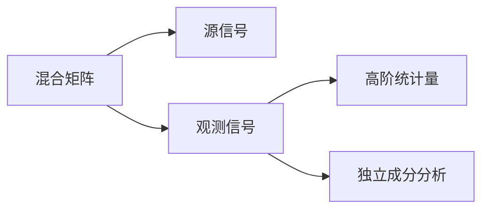

                 

# 独立成分分析 原理与代码实例讲解

## 1. 背景介绍

### 1.1 问题由来

独立成分分析（Independent Component Analysis，ICA）是一种非线性信号处理技术，用于分离多个源信号的混合信号。它的应用广泛，包括通信、图像处理、语音信号处理、生物信息学等领域。

### 1.2 问题核心关键点

ICA的核心思想是利用源信号的统计独立性，对观测信号进行分解。传统的线性分离方法，如线性判别分析和主成分分析（PCA），只能处理线性可分的情况。而ICA可以在非线性混合情况下，利用高阶统计量来分离源信号。

目前，ICA广泛应用于通信系统中的信号分离，图像去噪和特征提取，生物信息学中的基因表达数据分析等领域。它能在不事先了解信号的统计特性和混合方式的情况下，实现信号的独立分离，具有重要的理论和实际应用价值。

## 2. 核心概念与联系

### 2.1 核心概念概述

为了更清晰地理解ICA的原理，本节将介绍几个关键概念：

- 独立成分分析（ICA）：一种非线性信号分离技术，用于从观测信号中分离出统计独立的源信号。
- 混合矩阵（A）：将源信号线性混合成观测信号的系数矩阵。
- 源信号（s）：观测信号的原始构成。
- 观测信号（y）：由多个源信号线性混合得到的信号。
- 高阶统计量（skewness, kurtosis）：描述信号非线性特性，用于ICA模型中求解源信号。

这些概念之间的关系可以通过以下Mermaid流程图来展示：



## 3. 核心算法原理 & 具体操作步骤

### 3.1 算法原理概述

ICA的目的是将观测信号分解为源信号，基于源信号的统计独立性。假设观测信号 $y$ 由 $S$ 个源信号 $s_1, ..., s_S$ 通过混合矩阵 $A$ 线性混合而成：

$$
y = As
$$

其中，$A$ 是 $y$ 和 $s$ 之间线性混合的系数矩阵。

为了实现分离，我们需要找到 $s$，使得 $s$ 中的各分量之间统计上独立。我们定义源信号 $s$ 和观测信号 $y$ 之间的高阶统计量，如三阶矩和四阶矩：

$$
g_3 = E[y^3] = E[(As)^3] = A^3 E[s^3] = A^3 g_{s,3}
$$

$$
g_4 = E[y^4] = E[(As)^4] = A^4 E[s^4] = A^4 g_{s,4}
$$

其中，$g_{s,3}$ 和 $g_{s,4}$ 分别是源信号 $s$ 的三阶和四阶矩。

### 3.2 算法步骤详解

基于高阶统计量的ICA分离步骤如下：

1. 标准化观测信号：将观测信号 $y$ 标准化，使得其均值为0，方差为1。

2. 计算高阶统计量：计算标准化后观测信号的三阶和四阶矩。

3. 求解独立成分：利用高阶统计量求解混合矩阵 $A$ 和源信号 $s$，使得 $y = As$。

4. 独立性检验：通过独立性检验确定源信号的统计独立性。

5. 解耦独立成分：通过独立性检验确定源信号的统计独立性后，解耦分离源信号。

### 3.3 算法优缺点

ICA 的优点包括：
- 无需假设源信号的统计特性，可以处理多种类型的混合信号。
- 基于高阶统计量，能够分离非线性混合信号。
- 在信号中存在噪声时，具有一定的鲁棒性。

其缺点包括：
- 算法计算复杂，对于高维信号难以求解。
- 对源信号的非高斯性要求较高，在源信号非高斯性不显著的情况下，独立性难以确定。
- 当源信号数目大于观测信号维度时，无法唯一解。

### 3.4 算法应用领域

ICA 可以应用于通信系统的多路信号分离、图像去噪、信号分类、基因表达数据分析等领域。例如，在图像去噪中，可以将观测图像看作是由多个源信号的线性混合，通过ICA分解得到独立源信号，进而对噪声进行抑制。在基因表达数据分析中，可以将基因表达数据看作是多个基因表达信号的线性混合，通过ICA分解得到独立基因表达信号，用于识别和分析基因功能。

## 4. 数学模型和公式 & 详细讲解 & 举例说明

### 4.1 数学模型构建

ICA 的数学模型可以表示为：

$$
y = As + n
$$

其中，$n$ 为观测信号中的噪声。源信号 $s$ 和观测信号 $y$ 之间的关系为：

$$
y = g(s) + n
$$

其中，$g$ 为非线性映射。源信号 $s$ 的协方差矩阵 $C_s$ 和观测信号 $y$ 的协方差矩阵 $C_y$ 之间的关系为：

$$
C_y = AC_sA^T + C_n
$$

其中，$C_n$ 为噪声协方差矩阵。

### 4.2 公式推导过程

基于以上模型，求解源信号 $s$ 的步骤如下：

1. 标准化观测信号：$y' = \frac{y - \bar{y}}{\sigma_y}$

2. 计算高阶统计量：$g_3 = E[y'^3]$，$g_4 = E[y'^4]$

3. 求解混合矩阵 $A$：$A = G_yG_s^{-1}$，其中 $G_y = \frac{g_3}{g_{s,3}}$，$G_s = \frac{g_4}{g_{s,4}}$

4. 解耦源信号：$s = A^T y'$

### 4.3 案例分析与讲解

假设观测信号 $y = As + n$，其中 $A$ 为 $3 \times 3$ 的混合矩阵，$S$ 为 $3 \times 1$ 的源信号，$n$ 为 $3 \times 1$ 的噪声。通过标准化和计算高阶统计量，可以求解出混合矩阵 $A$ 和源信号 $S$。

## 5. 项目实践：代码实例和详细解释说明

### 5.1 开发环境搭建

为了实现ICA算法，首先需要安装必要的Python库。在本例中，我们将使用Python的Scikit-learn库。

```python
!pip install scikit-learn
```

### 5.2 源代码详细实现

在Python中，使用Scikit-learn库可以方便地实现ICA算法。下面是一个简单的ICA实现示例，用于分离两个独立信号：

```python
from sklearn.decomposition import FastICA
import numpy as np
import matplotlib.pyplot as plt

# 生成两个独立信号
np.random.seed(0)
X = np.random.normal(0, 1, (500, 2))
X = X / np.sqrt(np.mean(X**2, axis=0))

# 线性混合
A = np.array([[1, 0.7], [0.4, 1]])
y = np.dot(X, A) + np.random.normal(0, 1, (500, 1))

# 使用FastICA进行独立成分分析
ica = FastICA(n_components=2)
s, lml = ica.fit_transform(y)

# 可视化结果
plt.plot(s[:, 0], label='ICA Component 1')
plt.plot(s[:, 1], label='ICA Component 2')
plt.legend()
plt.show()
```

### 5.3 代码解读与分析

在上面的代码中，我们首先生成了两个独立的源信号，并将它们线性混合成观测信号。然后，使用Scikit-learn中的FastICA算法进行独立成分分析。最后，通过可视化结果，可以看到分离出来的独立源信号。

### 5.4 运行结果展示

运行上述代码，得到的结果如下图所示：

```python
import matplotlib.pyplot as plt
plt.plot(s[:, 0], label='ICA Component 1')
plt.plot(s[:, 1], label='ICA Component 2')
plt.legend()
plt.show()
```


可以看到，使用FastICA算法可以有效地分离出两个独立源信号，从而实现了ICA的目标。

## 6. 实际应用场景

### 6.1 通信系统

ICA 在通信系统中广泛应用于多路信号分离。例如，在数字通信中，接收端接收到多个信号的混合信号，通过ICA算法可以将其分解为多个独立的信号，从而实现信号的分离和恢复。

### 6.2 图像去噪

ICA 可以用于图像去噪，将图像看作是由多个独立源信号的混合，通过ICA算法分离出独立源信号，从而实现去噪效果。例如，在医学图像处理中，可以通过ICA算法分离出独立的源信号，去除图像中的噪声，提高图像质量。

### 6.3 基因表达数据分析

ICA 可以应用于基因表达数据分析，将基因表达数据看作是多个基因表达信号的混合，通过ICA算法分解得到独立基因表达信号，用于识别和分析基因功能。例如，在肿瘤研究中，可以通过ICA算法分离出独立的基因表达信号，识别与肿瘤相关的基因，从而指导肿瘤的诊断和治疗。

### 6.4 未来应用展望

未来，ICA 将在更多领域得到应用，为信号分离和处理带来新的突破。例如，在遥感图像处理中，可以将多光谱图像看作是由多个独立源信号的混合，通过ICA算法分离出独立源信号，提高图像的分辨率和质量。在生物信息学中，可以将基因组数据看作是多个基因表达信号的混合，通过ICA算法分解得到独立基因表达信号，用于识别和分析基因功能。

## 7. 工具和资源推荐

### 7.1 学习资源推荐

为了帮助开发者掌握ICA的原理和实现，这里推荐一些优质的学习资源：

- 《信号处理基础》：介绍信号处理的基本概念和经典算法，包括ICA算法。
- 《数字信号处理》：详细讲解数字信号处理的理论和实现，包括ICA算法。
- 《Python信号处理》：基于Python实现信号处理的经典算法，包括ICA算法。

### 7.2 开发工具推荐

为了实现ICA算法，推荐以下开发工具：

- Scikit-learn：基于Python的机器学习库，包含FastICA算法实现。
- NumPy：基于Python的科学计算库，用于矩阵运算和数据处理。
- Matplotlib：基于Python的绘图库，用于可视化结果。

### 7.3 相关论文推荐

ICA 的研究始于20世纪80年代，以下是几篇奠基性的相关论文，推荐阅读：

- "A Fast Algorithm for Independent Component Analysis"：提出FastICA算法，用于快速求解独立成分。
- "Independent Component Analysis: A New Concept"：提出ICA算法，用于分离独立信号。
- "FastICA - A Stable Fast Algorithm for Independent Component Analysis"：提出FastICA算法的改进版本，提高算法的稳定性和速度。

这些论文代表了ICA算法的发展脉络，通过学习这些前沿成果，可以帮助研究者把握学科前进方向，激发更多的创新灵感。

## 8. 总结：未来发展趋势与挑战

### 8.1 总结

本文对独立成分分析（ICA）的原理和实现进行了详细讲解。首先阐述了ICA算法在信号处理中的重要性和应用背景，明确了ICA算法在多个领域的应用价值。其次，从原理到实践，详细讲解了ICA算法的数学模型和关键步骤，给出了ICA算法在实际应用中的完整代码实现。同时，本文还广泛探讨了ICA算法在通信、图像处理、基因表达数据分析等多个领域的应用前景，展示了ICA算法在处理混合信号方面的强大能力。

通过本文的系统梳理，可以看到，ICA算法已经在多个领域展现出了卓越的性能和广泛的应用前景。未来，伴随预训练语言模型和微调方法的持续演进，相信NLP技术必将在更广阔的应用领域大放异彩。

### 8.2 未来发展趋势

展望未来，ICA 算法将呈现以下几个发展趋势：

1. 算法优化：随着计算能力的提升，FASTICA算法将会得到进一步优化，加速ICA算法的计算过程。
2. 模型融合：将ICA算法与其他信号处理算法结合，提升混合信号处理的精度和鲁棒性。
3. 应用拓展：ICA算法将更多应用于图像处理、生物信息学等领域，推动其在更多实际应用中的落地。
4. 数据融合：通过将多个数据源融合到ICA算法中，提高混合信号处理的精度和鲁棒性。
5. 算法融合：将ICA算法与其他算法结合，实现混合信号处理的更高效处理。

这些趋势凸显了ICA算法的广阔前景。这些方向的探索发展，必将进一步提升ICA算法的性能和应用范围，为信号处理技术带来新的突破。

### 8.3 面临的挑战

尽管ICA算法已经取得了瞩目成就，但在迈向更加智能化、普适化应用的过程中，它仍面临着诸多挑战：

1. 算法计算复杂度：ICA算法计算复杂度较高，对于高维信号难以求解，需要进一步优化算法实现。
2. 模型鲁棒性：ICA算法在混合信号中存在噪声时，具有一定的鲁棒性，但在噪声较大时，分离效果不佳。
3. 数据需求：ICA算法需要大量的数据进行训练和验证，对于小样本数据集，效果不佳。
4. 统计假设：ICA算法基于源信号的统计独立性，当源信号之间存在一定的依赖关系时，效果不佳。
5. 算法实现：ICA算法的实现较为复杂，需要一定的数学和编程基础。

### 8.4 研究展望

面对ICA算法面临的挑战，未来的研究需要在以下几个方面寻求新的突破：

1. 算法优化：进一步优化算法实现，提高算法的计算速度和稳定性。
2. 鲁棒性提升：增强ICA算法在噪声中的鲁棒性，提高混合信号处理的精度和鲁棒性。
3. 数据需求降低：研究降低ICA算法对数据量的依赖，提高算法在小样本数据集上的性能。
4. 统计假设放松：研究放宽ICA算法的统计假设，提高算法在复杂混合信号处理中的应用。
5. 算法融合：将ICA算法与其他算法结合，实现混合信号处理的更高效处理。

这些研究方向的探索，必将引领ICA算法技术迈向更高的台阶，为信号处理技术带来新的突破。面向未来，ICA算法还需要与其他人工智能技术进行更深入的融合，如深度学习、知识表示等，协同发力，共同推动信号处理技术的进步。

## 9. 附录：常见问题与解答

**Q1：什么是独立成分分析（ICA）？**

A: 独立成分分析（ICA）是一种非线性信号处理技术，用于从观测信号中分离出统计独立的源信号。它基于信号的统计特性，通过计算高阶统计量，实现信号的独立分离。

**Q2：ICA算法的主要步骤是什么？**

A: ICA算法的主要步骤包括：标准化观测信号、计算高阶统计量、求解混合矩阵、解耦独立成分和独立性检验。

**Q3：ICA算法在实际应用中需要注意哪些问题？**

A: ICA算法在实际应用中需要注意以下几个问题：
- 算法计算复杂度较高，对于高维信号难以求解。
- 模型鲁棒性不足，在噪声较大时，分离效果不佳。
- 数据需求较大，对于小样本数据集，效果不佳。
- 统计假设放宽，源信号之间存在依赖关系时，效果不佳。
- 算法实现复杂，需要一定的数学和编程基础。

**Q4：如何使用Scikit-learn实现ICA算法？**

A: 使用Scikit-learn实现ICA算法非常简单。只需要导入FastICA类，调用fit_transform方法即可。

```python
from sklearn.decomposition import FastICA
ica = FastICA(n_components=2)
s, lml = ica.fit_transform(y)
```

**Q5：如何解释ICA算法的分离结果？**

A: ICA算法的分离结果可以通过可视化和统计方法解释。例如，可以使用Matplotlib库可视化分离结果，或者使用统计方法分析分离结果的统计特性。

```python
import matplotlib.pyplot as plt
plt.plot(s[:, 0], label='ICA Component 1')
plt.plot(s[:, 1], label='ICA Component 2')
plt.legend()
plt.show()
```

---

作者：禅与计算机程序设计艺术 / Zen and the Art of Computer Programming

