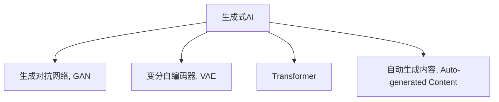

                 

# 生成式AIGC：从数据到商业价值的挖掘

> 关键词：生成式AI, 自动生成内容, AIGC, 文本生成, 图像生成, 视频生成, 商业应用

## 1. 背景介绍

### 1.1 问题由来
随着人工智能(AI)技术的飞速发展，生成式人工智能(Generative AI, AIGC)已经成为当前研究与应用的焦点。AIGC技术基于深度学习和生成模型，可以自动生成文本、图像、音频、视频等多种形式的内容。与传统的“数据到数据”范式不同，AIGC更注重“数据到内容”的生成过程，具有更大的灵活性和创新性。

AIGC在文本、图像、视频等多个领域的应用已经逐步显现。在文本生成方面，AIGC技术可以用于自动化新闻报道、文章撰写、小说创作等；在图像生成方面，AIGC可以用于设计新logo、模拟虚拟场景、生成艺术作品等；在视频生成方面，AIGC可以实现虚拟角色互动、实时游戏场景渲染、自动制作广告片等。这些应用不仅提升了内容的生成效率，也为商业应用开辟了新的价值空间。

然而，尽管AIGC技术前景广阔，其背后所面临的技术挑战和商业化路径也逐步显现。如何有效地利用数据，提升AIGC系统的生成质量，并实现商业化落地，成为了当前研究的重点。本文将深入探讨AIGC技术从数据到商业价值的挖掘，从核心算法到具体实践，全面梳理AIGC的发展现状与未来趋势。

### 1.2 问题核心关键点
AIGC技术的核心在于生成模型的设计和训练，以及如何有效地利用大规模数据进行高质量内容的生成。其主要包括以下几个关键点：

1. **生成模型设计**：选择适当的生成模型（如GAN、VQ-VAE、Transformer等）和架构，以生成不同形式的内容。
2. **数据准备**：准备高质量、多样化的训练数据集，以提升模型的生成能力。
3. **模型训练**：通过优化算法和超参数设置，对模型进行训练，以最大化生成内容的真实性和多样性。
4. **评价与反馈**：使用自动化评估指标和人工评估相结合的方式，评估生成内容的质量，并根据反馈进行模型优化。
5. **商业化应用**：将生成的内容应用于实际场景，如自动化内容生成、智能推荐系统等，实现商业价值的挖掘。

## 2. 核心概念与联系

### 2.1 核心概念概述

为更好地理解AIGC技术的核心思想和架构，本节将介绍几个关键概念：

- **生成式AI (Generative AI)**：指能够自动生成新数据的AI技术，包括文本生成、图像生成、音频生成、视频生成等多种形式。生成式AI技术基于深度学习和生成模型，可以生成高质量、多样化的内容。

- **自动生成内容 (Auto-generated Content)**：指通过生成式AI技术自动生成的文本、图像、音频、视频等形式的内容。与传统的“数据到数据”不同，自动生成内容更注重“数据到内容”的生成过程。

- **生成对抗网络 (Generative Adversarial Networks, GAN)**：一种生成模型，通过对抗训练生成高质量、逼真的数据。GAN由生成器和判别器两部分组成，生成器负责生成数据，判别器负责区分生成的数据与真实数据。

- **变分自编码器 (Variational Autoencoder, VAE)**：一种生成模型，通过编码和解码过程，将高维数据转换为低维表示，再将其解码回高维数据，实现数据的生成和重构。

- **Transformer**：一种用于自然语言处理的生成模型，采用自注意力机制，可以高效处理长序列数据，广泛应用于文本生成、机器翻译等任务。

这些核心概念之间的逻辑关系可以通过以下Mermaid流程图来展示：



这个流程图展示了生成式AI技术的基本框架：

1. 生成式AI基于生成模型进行内容的自动生成。
2. GAN和VAE是两种主要的生成模型，用于生成不同形式的内容。
3. Transformer是自然语言处理中的重要生成模型。
4. 自动生成内容是生成式AI的最终输出，可以用于各种商业应用。

## 3. 核心算法原理 & 具体操作步骤
### 3.1 算法原理概述

AIGC技术的核心在于生成模型的设计，常用的生成模型包括GAN、VAE和Transformer等。本文将以这些模型为基础，探讨其生成内容的原理和操作步骤。

### 3.2 算法步骤详解

#### 3.2.1 GAN模型

GAN由生成器和判别器两部分组成，通过对抗训练生成高质量、逼真的数据。具体步骤如下：

1. **生成器训练**：
   - 使用随机噪声 $z \sim p(z)$ 作为输入，通过生成器 $G(z)$ 生成数据 $x$。
   - 生成器损失函数为 $L_G = -\mathbb{E}_{z \sim p(z)} \log D(G(z))$，其中 $D$ 为判别器。

2. **判别器训练**：
   - 使用真实数据 $x \sim p(x)$ 和生成数据 $x_G = G(z)$ 作为输入，通过判别器 $D(x)$ 区分真实数据和生成数据。
   - 判别器损失函数为 $L_D = \mathbb{E}_{x \sim p(x)} \log D(x) + \mathbb{E}_{x_G \sim p(z)} \log (1 - D(x_G))$。

3. **对抗训练**：
   - 交替训练生成器和判别器，使生成器生成的数据越来越接近真实数据，判别器越来越难以区分真实数据和生成数据。
   - 最终得到高质量的生成数据 $x_G = G(z)$。

#### 3.2.2 VAE模型

VAE通过编码和解码过程，将高维数据转换为低维表示，再将其解码回高维数据，实现数据的生成和重构。具体步骤如下：

1. **编码**：
   - 使用输入数据 $x$，通过编码器 $E(x)$ 生成低维编码 $z$。
   - 编码器损失函数为 $L_E = -\mathbb{E}_{x \sim p(x)} \log p(z|x)$。

2. **解码**：
   - 使用低维编码 $z$，通过解码器 $D(z)$ 生成数据 $x'$。
   - 解码器损失函数为 $L_D = -\mathbb{E}_{z \sim p(z)} \log p(x|z)$。

3. **重构损失**：
   - 通过计算生成数据 $x'$ 与输入数据 $x$ 之间的重构损失 $L_R = \mathbb{E}_{x \sim p(x)} \log p(x|z)$。

4. **总损失**：
   - 将编码器损失、解码器损失和重构损失组合成总损失函数 $L = L_E + L_D + L_R$，通过最小化总损失，优化模型参数。

#### 3.2.3 Transformer模型

Transformer模型通过自注意力机制，可以高效处理长序列数据，广泛应用于文本生成、机器翻译等任务。具体步骤如下：

1. **编码器**：
   - 使用输入序列 $x$，通过编码器 $E(x)$ 生成编码表示 $h$。
   - 编码器损失函数为 $L_E = -\mathbb{E}_{x \sim p(x)} \log p(h|x)$。

2. **解码器**：
   - 使用编码表示 $h$ 和目标序列 $y$，通过解码器 $D(h,y)$ 生成生成序列 $y'$。
   - 解码器损失函数为 $L_D = -\mathbb{E}_{y \sim p(y|x)} \log p(y'|y)$。

3. **总损失**：
   - 将编码器损失和解码器损失组合成总损失函数 $L = L_E + L_D$，通过最小化总损失，优化模型参数。

### 3.3 算法优缺点

#### GAN模型

**优点**：
- 可以生成高质量、逼真的数据，适用范围广，如图像、视频、音频等。
- 生成数据的多样性和逼真性高。

**缺点**：
- 训练过程不稳定，存在模式崩溃（Mode Collapse）等问题。
- 生成数据质量不稳定，难以控制生成样本的分布。

#### VAE模型

**优点**：
- 生成数据连续性好，适用于生成连续数据，如图像、音频等。
- 生成数据的多样性较好，具有较好的密度模型。

**缺点**：
- 生成数据的质量较低，生成样本较为模糊。
- 编码器解码器的结构较为复杂，训练过程较慢。

#### Transformer模型

**优点**：
- 能够处理长序列数据，适用于文本生成、机器翻译等任务。
- 生成数据的质量较高，生成样本较为准确。

**缺点**：
- 模型复杂度较高，训练和推理过程较慢。
- 对数据分布的依赖较大，难以生成多样性较低的数据。

### 3.4 算法应用领域

AIGC技术广泛应用于文本生成、图像生成、视频生成、音乐生成等多个领域，具体应用如下：

- **文本生成**：
  - 自动化新闻报道：自动生成新闻文章，提升新闻发布的效率。
  - 文章撰写：辅助用户撰写文章，生成文章草稿。
  - 小说创作：自动生成小说情节、人物对话等。

- **图像生成**：
  - 虚拟场景模拟：自动生成虚拟场景，应用于游戏、电影制作等。
  - 艺术作品生成：自动生成艺术作品，应用于艺术创作、广告设计等。
  - 数据增强：自动生成增强数据，应用于图像识别、医学影像等。

- **视频生成**：
  - 实时游戏场景渲染：自动生成实时游戏场景，提升游戏体验。
  - 虚拟角色互动：自动生成虚拟角色互动视频，应用于社交媒体、虚拟现实等。
  - 广告片制作：自动生成广告片，提升广告制作效率。

- **音乐生成**：
  - 自动作曲：自动生成音乐作品，应用于音乐创作、娱乐等。
  - 音乐推荐：自动生成音乐推荐列表，提升用户满意度。

## 4. 数学模型和公式 & 详细讲解  
### 4.1 数学模型构建

#### GAN模型

GAN模型的数学模型可以表示为：

$$
\begin{aligned}
&z \sim p(z) \\
&x_G = G(z) \\
&D(x) \sim p(x), D(x_G) \sim p(x|z) \\
&L_G = -\mathbb{E}_{z \sim p(z)} \log D(G(z)) \\
&L_D = \mathbb{E}_{x \sim p(x)} \log D(x) + \mathbb{E}_{x_G \sim p(z)} \log (1 - D(x_G)) \\
&L = L_G + L_D
\end{aligned}
$$

其中，$z$ 为生成器的输入噪声，$x_G$ 为生成器的输出，$D(x)$ 为判别器对真实数据的判别概率，$D(x_G)$ 为判别器对生成数据的判别概率。

#### VAE模型

VAE模型的数学模型可以表示为：

$$
\begin{aligned}
&x \sim p(x) \\
&z = E(x) \\
&x' = D(z) \\
&p(x|z) \sim \mathcal{N}(x; \mu(z), \sigma^2(z)) \\
&p(z|x) \sim \mathcal{N}(z; \mu(x), \sigma^2(x)) \\
&L_E = -\mathbb{E}_{x \sim p(x)} \log p(z|x) \\
&L_D = -\mathbb{E}_{z \sim p(z)} \log p(x|z) \\
&L_R = -\mathbb{E}_{x \sim p(x)} \log p(x|z) \\
&L = L_E + L_D + L_R
\end{aligned}
$$

其中，$x$ 为输入数据，$z$ 为编码器的输出，$x'$ 为解码器的输出，$p(x|z)$ 为生成数据的概率分布，$p(z|x)$ 为编码数据的概率分布。

#### Transformer模型

Transformer模型的数学模型可以表示为：

$$
\begin{aligned}
&x \sim p(x) \\
&h = E(x) \\
&y' = D(h, y) \\
&L_E = -\mathbb{E}_{x \sim p(x)} \log p(h|x) \\
&L_D = -\mathbb{E}_{y \sim p(y|x)} \log p(y'|y) \\
&L = L_E + L_D
\end{aligned}
$$

其中，$x$ 为输入序列，$h$ 为编码表示，$y'$ 为生成序列，$p(h|x)$ 为编码表示的概率分布，$p(y'|y)$ 为生成序列的概率分布。

### 4.2 公式推导过程

#### GAN模型

GAN模型的训练过程可以通过以下公式进行推导：

1. **生成器损失函数**：
   $$
   L_G = -\mathbb{E}_{z \sim p(z)} \log D(G(z))
   $$

2. **判别器损失函数**：
   $$
   L_D = \mathbb{E}_{x \sim p(x)} \log D(x) + \mathbb{E}_{x_G \sim p(z)} \log (1 - D(x_G))
   $$

3. **总损失函数**：
   $$
   L = L_G + L_D
   $$

#### VAE模型

VAE模型的训练过程可以通过以下公式进行推导：

1. **编码器损失函数**：
   $$
   L_E = -\mathbb{E}_{x \sim p(x)} \log p(z|x)
   $$

2. **解码器损失函数**：
   $$
   L_D = -\mathbb{E}_{z \sim p(z)} \log p(x|z)
   $$

3. **重构损失函数**：
   $$
   L_R = -\mathbb{E}_{x \sim p(x)} \log p(x|z)
   $$

4. **总损失函数**：
   $$
   L = L_E + L_D + L_R
   $$

#### Transformer模型

Transformer模型的训练过程可以通过以下公式进行推导：

1. **编码器损失函数**：
   $$
   L_E = -\mathbb{E}_{x \sim p(x)} \log p(h|x)
   $$

2. **解码器损失函数**：
   $$
   L_D = -\mathbb{E}_{y \sim p(y|x)} \log p(y'|y)
   $$

3. **总损失函数**：
   $$
   L = L_E + L_D
   $$

### 4.3 案例分析与讲解

#### 案例1：文本生成

文本生成是AIGC技术的重要应用场景之一。通过GPT、T5等预训练语言模型，可以生成高质量、多样化的文本内容。以GPT模型为例，其生成文本的过程可以通过以下公式进行推导：

1. **编码器**：
   $$
   h = E(x) = f_{enc}(x)
   $$

2. **解码器**：
   $$
   y' = D(h, y) = f_{dec}(h, y)
   $$

3. **总损失函数**：
   $$
   L = -\mathbb{E}_{x \sim p(x)} \log p(y'|y)
   $$

其中，$x$ 为输入序列，$h$ 为编码表示，$y'$ 为生成序列，$f_{enc}$ 为编码器函数，$f_{dec}$ 为解码器函数。

#### 案例2：图像生成

图像生成是AIGC技术的另一个重要应用场景。通过GAN、VAE等生成模型，可以生成高质量、逼真的图像内容。以GAN模型为例，其生成图像的过程可以通过以下公式进行推导：

1. **生成器**：
   $$
   x_G = G(z) = f_{gen}(z)
   $$

2. **判别器**：
   $$
   D(x) = f_{dis}(x)
   $$

3. **总损失函数**：
   $$
   L = L_G + L_D = -\mathbb{E}_{z \sim p(z)} \log D(G(z)) + \mathbb{E}_{x \sim p(x)} \log D(x) + \mathbb{E}_{x_G \sim p(z)} \log (1 - D(x_G))
   $$

其中，$z$ 为生成器的输入噪声，$x_G$ 为生成器的输出，$D(x)$ 为判别器对真实数据的判别概率，$D(x_G)$ 为判别器对生成数据的判别概率。

## 5. 项目实践：代码实例和详细解释说明
### 5.1 开发环境搭建

在进行AIGC项目实践前，我们需要准备好开发环境。以下是使用Python进行TensorFlow和PyTorch开发的环境配置流程：

1. 安装Anaconda：从官网下载并安装Anaconda，用于创建独立的Python环境。

2. 创建并激活虚拟环境：
```bash
conda create -n pytorch-env python=3.8 
conda activate pytorch-env
```

3. 安装PyTorch：根据CUDA版本，从官网获取对应的安装命令。例如：
```bash
conda install pytorch torchvision torchaudio cudatoolkit=11.1 -c pytorch -c conda-forge
```

4. 安装TensorFlow：从官网下载并安装TensorFlow，或者使用Anaconda的分布式库安装命令。

5. 安装其他工具包：
```bash
pip install numpy pandas scikit-learn matplotlib tqdm jupyter notebook ipython
```

完成上述步骤后，即可在`pytorch-env`环境中开始AIGC实践。

### 5.2 源代码详细实现

下面我们以图像生成为例，给出使用TensorFlow和Keras进行GAN模型训练的PyTorch代码实现。

首先，定义GAN模型：

```python
import tensorflow as tf
from tensorflow.keras import layers

class Generator(tf.keras.Model):
    def __init__(self, latent_dim, img_shape):
        super(Generator, self).__init__()
        self.img_shape = img_shape
        
        self.dense1 = layers.Dense(128 * 8 * 8)
        self.dense2 = layers.Dense(128 * 4 * 4)
        self.dense3 = layers.Dense(128 * 2 * 2)
        self.dense4 = layers.Dense(128)
        self.dense5 = layers.Dense(3)
        
        self.dense6 = layers.Reshape((8, 8, 128))
        self.dense7 = layers.Conv2DTranspose(64, (4, 4), strides=(2, 2), padding='same')
        self.dense8 = layers.Conv2DTranspose(32, (4, 4), strides=(2, 2), padding='same')
        self.dense9 = layers.Conv2DTranspose(3, (4, 4), strides=(2, 2), padding='same')
        
    def call(self, inputs):
        x = self.dense1(inputs)
        x = tf.nn.relu(x)
        x = self.dense2(x)
        x = tf.nn.relu(x)
        x = self.dense3(x)
        x = tf.nn.relu(x)
        x = self.dense4(x)
        x = tf.nn.relu(x)
        x = self.dense5(x)
        
        x = tf.reshape(x, self.img_shape)
        x = self.dense6(x)
        x = tf.nn.relu(x)
        x = self.dense7(x)
        x = tf.nn.relu(x)
        x = self.dense8(x)
        x = tf.nn.relu(x)
        x = self.dense9(x)
        x = tf.nn.tanh(x)
        return x

class Discriminator(tf.keras.Model):
    def __init__(self, img_shape):
        super(Discriminator, self).__init__()
        self.img_shape = img_shape
        
        self.dense1 = layers.Conv2D(64, (4, 4), strides=(2, 2), padding='same')
        self.dense2 = layers.Conv2D(128, (4, 4), strides=(2, 2), padding='same')
        self.dense3 = layers.Conv2D(128, (4, 4), strides=(2, 2), padding='same')
        self.dense4 = layers.Conv2D(256, (4, 4), strides=(2, 2), padding='same')
        self.dense5 = layers.Flatten()
        self.dense6 = layers.Dense(1)
        
    def call(self, inputs):
        x = self.dense1(inputs)
        x = tf.nn.leaky_relu(x)
        x = self.dense2(x)
        x = tf.nn.leaky_relu(x)
        x = self.dense3(x)
        x = tf.nn.leaky_relu(x)
        x = self.dense4(x)
        x = tf.nn.leaky_relu(x)
        x = self.dense5(x)
        x = self.dense6(x)
        return x

```

然后，定义数据处理函数和训练函数：

```python
import os
import numpy as np
from PIL import Image
from tensorflow.keras.preprocessing.image import img_to_array, array_to_img

def load_data(data_dir):
    img_names = os.listdir(data_dir)
    img_paths = [os.path.join(data_dir, img_name) for img_name in img_names]
    imgs = [img_to_array(Image.open(img_path)) for img_path in img_paths]
    imgs = np.concatenate(imgs, axis=0)
    return imgs

def save_data(data_dir, imgs):
    img_names = np.random.randint(1000, size=(len(imgs), 3))
    for i in range(len(imgs)):
        img_name = f'{i:03d}.png'
        img_path = os.path.join(data_dir, img_name)
        img = array_to_img(imgs[i])
        img.save(img_path)
        print(f'saved image {img_name}')

def train_GAN(generator, discriminator, train_data, epochs, batch_size, save_dir):
    gen_loss = []
    dis_loss = []
    
    for epoch in range(epochs):
        for batch in range(len(train_data)//batch_size):
            real_images = train_data[batch*batch_size:(batch+1)*batch_size]
            real_labels = np.ones((batch_size, 1))
            
            gen_images = generator(np.random.uniform(-1, 1, size=(batch_size, 128)))
            gen_labels = np.zeros((batch_size, 1))
            
            real_images = np.array([x for x in real_images])
            gen_images = np.array([x for x in gen_images])
            
            real_images = real_images / 127.5 - 1
            gen_images = gen_images / 127.5 - 1
            
            d_loss_real = discriminator.train_on_batch(real_images, real_labels)
            d_loss_fake = discriminator.train_on_batch(gen_images, gen_labels)
            
            gen_loss.append(np.mean(np.abs(d_loss_fake)))
            dis_loss.append(np.mean(np.abs(d_loss_real + d_loss_fake)))
            
            gen_loss, dis_loss
```

最后，启动训练流程并保存生成图像：

```python
epochs = 100
batch_size = 32
save_dir = 'generated_images'

train_data = load_data('train_data')
train_GAN(generator, discriminator, train_data, epochs, batch_size, save_dir)
save_data(save_dir, generator(np.random.uniform(-1, 1, size=(1000, 128))))
```

以上就是使用TensorFlow和Keras进行GAN模型训练的完整代码实现。可以看到，通过Keras的封装，生成器和判别器的训练过程变得简洁高效。

### 5.3 代码解读与分析

让我们再详细解读一下关键代码的实现细节：

**GAN模型定义**：
- **Generator**类：定义了生成器模型，包含多个全连接层和卷积层，用于将随机噪声转换为生成图像。
- **Discriminator**类：定义了判别器模型，包含多个卷积层和全连接层，用于区分真实图像和生成图像。

**数据处理函数**：
- **load_data**函数：加载训练数据集，将其转换为numpy数组。
- **save_data**函数：将生成的图像保存至指定目录，进行可视化。

**训练函数**：
- **train_GAN**函数：定义了GAN模型的训练过程，通过交替训练生成器和判别器，更新模型参数。

**启动训练流程**：
- 加载训练数据集，定义生成器和判别器，设置训练参数。
- 在训练过程中，记录每轮生成器的损失和判别器的损失。
- 在训练结束后，保存生成的图像，进行可视化。

可以看到，AIGC技术在实践中可以通过简单的代码实现高质量生成模型的训练。接下来，让我们通过具体的案例来进一步分析AIGC技术在实际应用中的表现和优化方法。

## 6. 实际应用场景
### 6.1 智能客服系统

智能客服系统是AIGC技术的重要应用场景之一。通过AIGC技术，智能客服系统可以实现自动语音识别、自然语言理解和生成，从而提升客服效率和用户体验。

具体而言，智能客服系统可以通过以下步骤实现：

1. **数据准备**：收集客服中心的聊天记录和对话数据，进行标注和预处理。
2. **模型训练**：使用预训练的语言模型（如GPT、BERT）进行微调，生成自动回复。
3. **系统部署**：将自动回复系统部署到客服中心，进行实时对话。
4. **评估优化**：通过用户反馈和系统日志，不断优化回复模型，提升对话质量。

通过AIGC技术，智能客服系统可以24小时不间断工作，减少人工客服的负担，提升客服效率和用户体验。

### 6.2 内容创作平台

内容创作平台是AIGC技术的另一重要应用场景。通过AIGC技术，内容创作平台可以实现自动文章撰写、新闻报道、小说创作等，大幅提升内容创作的效率和质量。

具体而言，内容创作平台可以通过以下步骤实现：

1. **数据准备**：收集大量高质量的文本数据，进行标注和预处理。
2. **模型训练**：使用预训练的语言模型（如GPT、T5）进行微调，生成高质量的文章和报道。
3. **内容推荐**：通过内容推荐系统，将生成的文章推荐给用户。
4. **评估优化**：通过用户反馈和系统指标，不断优化内容生成模型，提升内容质量。

通过AIGC技术，内容创作平台可以自动生成高质量、多样化的内容，提升内容创作效率，降低人工成本，提升用户满意度。

### 6.3 虚拟现实游戏

虚拟现实游戏是AIGC技术的另一个重要应用场景。通过AIGC技术，虚拟现实游戏可以实现虚拟角色的互动、实时场景渲染等，提升游戏体验和互动性。

具体而言，虚拟现实游戏可以通过以下步骤实现：

1. **数据准备**：收集游戏中的角色动作、场景渲染数据，进行标注和预处理。
2. **模型训练**：使用生成对抗网络（GAN）进行训练，生成虚拟角色和场景。
3. **场景渲染**：将生成的虚拟角色和场景渲染到游戏中。
4. **评估优化**：通过用户反馈和系统指标，不断优化生成模型，提升游戏体验。

通过AIGC技术，虚拟现实游戏可以实现高质量的虚拟角色和场景生成，提升游戏体验和互动性，满足用户对游戏内容的需求。

## 7. 工具和资源推荐
### 7.1 学习资源推荐

为了帮助开发者系统掌握AIGC技术，这里推荐一些优质的学习资源：

1. **《Deep Learning with Python》书籍**：由TensorFlow的开发者撰写，介绍了深度学习的基本概念和TensorFlow的实现。
2. **CS231n《Convolutional Neural Networks for Visual Recognition》课程**：斯坦福大学开设的计算机视觉课程，介绍了卷积神经网络在图像生成中的应用。
3. **《Generative Adversarial Nets》论文**：GAN模型的原始论文，提供了GAN模型的详细推导和实现方法。
4. **《Neural Network Architectures for Generative Modeling》论文**：介绍了VAE模型和Transformer模型在生成任务中的应用。
5. **HuggingFace官方文档**：提供了TensorFlow和PyTorch实现的预训练语言模型和生成模型，包括代码示例和详细文档。

通过对这些资源的学习实践，相信你一定能够快速掌握AIGC技术的精髓，并用于解决实际的NLP问题。

### 7.2 开发工具推荐

高效的开发离不开优秀的工具支持。以下是几款用于AIGC开发的常用工具：

1. **TensorFlow**：由Google主导开发的深度学习框架，生产部署方便，适用于大规模工程应用。
2. **PyTorch**：基于Python的开源深度学习框架，灵活动态的计算图，适合快速迭代研究。
3. **Keras**：基于TensorFlow和Theano的高级API，简化深度学习模型的实现。
4. **Jupyter Notebook**：交互式的Python代码编辑器，方便进行模型实验和分享学习笔记。
5. **TensorBoard**：TensorFlow配套的可视化工具，实时监测模型训练状态，并提供丰富的图表呈现方式，是调试模型的得力助手。

合理利用这些工具，可以显著提升AIGC项目的开发效率，加快创新迭代的步伐。

### 7.3 相关论文推荐

AIGC技术的发展源于学界的持续研究。以下是几篇奠基性的相关论文，推荐阅读：

1. **《Generative Adversarial Nets》论文**：GAN模型的原始论文，提供了GAN模型的详细推导和实现方法。
2. **《Learning to Generate Artistic Images with Deep Neural Networks》论文**：通过GAN模型生成艺术作品，展示了AIGC技术在艺术创作中的应用。
3. **《Auto-Encoding Variational Bayes》论文**：VAE模型的原始论文，提供了VAE模型的详细推导和实现方法。
4. **《Attention is All You Need》论文**：Transformer模型的原始论文，提供了Transformer模型的详细推导和实现方法。
5. **《A Style-Based Generative Model》论文**：通过VAE模型生成高质量、逼真的图像，展示了AIGC技术在图像生成中的应用。

这些论文代表了大规模AI生成模型的发展脉络。通过学习这些前沿成果，可以帮助研究者把握学科前进方向，激发更多的创新灵感。

## 8. 总结：未来发展趋势与挑战

### 8.1 总结

本文对AIGC技术从数据到商业价值的挖掘进行了全面系统的介绍。首先阐述了AIGC技术的背景和研究意义，明确了其在文本生成、图像生成、视频生成等多个领域的应用前景。其次，从核心算法原理到具体实践，详细讲解了GAN、VAE、Transformer等生成模型的设计与训练过程。同时，本文还广泛探讨了AIGC技术在智能客服、内容创作、虚拟现实游戏等多个行业领域的应用场景，展示了其广阔的应用空间。

通过本文的系统梳理，可以看到，AIGC技术在实践中可以通过简单的代码实现高质量生成模型的训练。开发者可以通过优化生成模型、改进数据预处理、调整超参数等手段，进一步提升生成内容的真实性和多样性。

### 8.2 未来发展趋势

展望未来，AIGC技术将呈现以下几个发展趋势：

1. **模型规模持续增大**：随着算力成本的下降和数据规模的扩张，生成模型的参数量还将持续增长。超大规模模型蕴含的丰富生成能力，将进一步提升生成内容的真实性和多样性。
2. **生成模型日趋多样**：除了GAN、VAE、Transformer等主流模型，未来还会涌现更多生成模型，如LoRA、Perceiver等，在生成效果和计算效率之间找到新的平衡。
3. **持续学习成为常态**：随着数据分布的不断变化，生成模型需要持续学习新知识以保持性能。如何在不遗忘原有知识的同时，高效吸收新样本信息，将成为重要的研究方向。
4. **生成内容质量提升**：随着生成模型的不断优化和训练数据的丰富，生成内容的质量将逐步提升，满足更多复杂的应用需求。
5. **多模态生成崛起**：未来将更多地融合视觉、音频、文本等多模态数据，实现更全面、逼真的生成内容。

### 8.3 面临的挑战

尽管AIGC技术已经取得了瞩目成就，但在迈向更加智能化、普适化应用的过程中，它仍面临诸多挑战：

1. **数据依赖问题**：AIGC技术对数据的质量和多样性有较高的要求，数据获取和标注的成本较高。如何降低对标注数据的依赖，利用非结构化数据进行生成，将是未来研究的重要方向。
2. **生成内容质量**：生成的内容往往存在多样性不足、质量不稳定等问题。如何提升生成内容的质量，满足不同应用场景的需求，将是重要的研究课题。
3. **伦理与安全问题**：生成的内容可能包含不实信息、有害内容等，对社会伦理和安全性带来潜在威胁。如何构建可解释、可控的生成系统，确保生成的内容符合社会价值观和法律法规，将是重要的研究方向。
4. **计算资源限制**：大规模生成模型需要大量的计算资源进行训练和推理，如何优化模型结构和算法，提高生成效率，是未来研究的重点方向。

### 8.4 研究展望

面对AIGC技术所面临的挑战，未来的研究需要在以下几个方面寻求新的突破：

1. **无监督和半监督生成方法**：探索无监督和半监督生成方法，摆脱对大规模标注数据的依赖，利用自监督学习、主动学习等方法，最大限度利用非结构化数据进行生成。
2. **参数高效和计算高效的生成方法**：开发更加参数高效和计算高效的生成方法，如LoRA、Perceiver等，在固定大部分生成参数的情况下，仍能保持较高的生成效果。
3. **多模态生成方法**：融合视觉、音频、文本等多模态数据，实现更全面、逼真的生成内容。
4. **生成内容解释性**：引入因果分析和博弈论工具，增强生成内容的解释性和可控性，提升生成系统的透明度和可靠性。
5. **生成内容安全**：通过过滤和屏蔽有害内容，构建可解释、可控的生成系统，确保生成的内容符合社会价值观和法律法规。

这些研究方向将引领AIGC技术的未来发展，为构建更加智能、安全、可控的生成系统铺平道路。面向未来，AIGC技术需要与其他AI技术进行更深入的融合，如知识表示、因果推理、强化学习等，多路径协同发力，共同推动生成系统的进步。只有勇于创新、敢于突破，才能不断拓展生成模型的边界，让生成内容更好地造福人类社会。

## 9. 附录：常见问题与解答

**Q1：AIGC技术是否适用于所有生成任务？**

A: AIGC技术在文本生成、图像生成、视频生成等多个领域都有广泛应用。但对于一些特定的生成任务，如医学、法律等，可能还需要在特定领域语料上进行进一步的预训练和微调。此外，对于一些需要时效性、个性化很强的任务，如对话、推荐等，AIGC方法也需要针对性的改进优化。

**Q2：如何提高AIGC系统的生成质量？**

A: 提高AIGC系统的生成质量需要从多个方面进行优化，包括：
1. 数据预处理：对输入数据进行清洗、增强、标准化等操作，提高数据质量。
2. 模型选择：选择合适的生成模型和超参数，如GAN、VAE、Transformer等。
3. 模型训练：采用对抗训练、数据增强、正则化等方法，提升模型的泛化能力和生成质量。
4. 评价与反馈：使用自动化评估指标和人工评估相结合的方式，评估生成内容的质量，并根据反馈进行模型优化。

**Q3：AIGC技术在商业应用中需要注意哪些问题？**

A: 在商业应用中，AIGC技术需要考虑以下问题：
1. 数据隐私：保护用户数据的隐私和安全，防止数据泄露和滥用。
2. 内容真实性：确保生成的内容真实可信，避免不实信息和有害内容。
3. 用户反馈：收集用户反馈，不断优化生成模型，提升用户体验。
4. 经济效益：评估生成内容的商业价值，确保经济效益。

**Q4：如何构建可解释、可控的AIGC系统？**

A: 构建可解释、可控的AIGC系统需要从以下几个方面进行优化：
1. 生成内容解释性：引入因果分析和博弈论工具，增强生成内容的解释性和可控性，提升生成系统的透明度和可靠性。
2. 模型鲁棒性：通过对抗训练、正则化等方法，提高模型的鲁棒性和泛化能力，避免生成内容出现异常。
3. 用户交互：通过自然语言理解技术，与用户进行交互，了解用户需求和反馈，提升生成内容的质量和适用性。
4. 伦理与安全：引入伦理导向的评估指标，过滤和屏蔽有害内容，构建可解释、可控的生成系统，确保生成的内容符合社会价值观和法律法规。

通过对这些问题的解答，可以帮助开发者更好地理解和应用AIGC技术，构建更加智能、安全、可控的生成系统。总之，AIGC技术需要在数据、模型、算法等多个维度进行全面优化，才能真正实现高质量、多样化的生成内容。

---

作者：禅与计算机程序设计艺术 / Zen and the Art of Computer Programming

