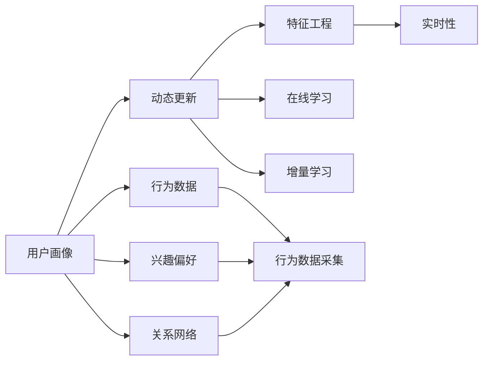

                 

# 用户画像的动态更新与优化

在数字经济时代，用户画像的动态更新与优化已成为企业获得竞争优势的关键因素。通过精准、实时的用户画像，企业可以更好地理解用户需求，提供个性化服务，从而提高用户满意度和忠诚度，增加市场份额和收益。本文将深入探讨用户画像的动态更新与优化原理、核心算法、具体操作步骤、实际应用以及未来的发展趋势，力求为读者提供全面的技术指导。

## 1. 背景介绍

### 1.1 问题由来
随着互联网和移动互联网的迅猛发展，用户数据的海量积累已成为企业宝贵的资产。然而，传统的静态用户画像已无法满足用户需求的变化，无法实时捕捉用户的最新行为和偏好。因此，动态更新与优化用户画像，成为企业提升客户体验和服务质量的重要手段。

### 1.2 问题核心关键点
动态更新用户画像的关键在于如何高效、准确地捕捉用户最新行为，并在不断变化的数据中提取有价值的特征，同时避免过拟合和信息偏差。常见的方法包括：
- 实时数据采集：通过日志、交互、交易等数据实时记录用户行为，及时获取最新的用户信息。
- 特征工程：通过数据清洗、特征提取和融合等技术，构建多维度的用户画像特征，提高特征的表现力和鲁棒性。
- 动态模型更新：使用在线学习、增量学习等算法，在用户数据变化时，快速更新和优化用户画像模型。
- 结果反馈机制：建立用户反馈机制，通过用户评价和行为变化，及时调整用户画像模型，提升画像的准确性和实用性。

### 1.3 问题研究意义
动态更新与优化用户画像对于提升用户体验和提高企业竞争力具有重要意义：
- 个性化服务：通过实时用户画像，企业能够提供个性化的产品推荐、定制化内容和服务，增强用户粘性。
- 客户洞察：精确的用户画像可以帮助企业深入了解用户需求和行为，指导产品迭代和市场策略调整。
- 风险控制：动态更新的用户画像能够及时捕捉用户行为变化，帮助企业防范欺诈、不良行为和信用风险。
- 业务优化：实时优化用户画像能够提升营销效果、优化运营策略和改善客户服务质量，推动业务持续增长。

## 2. 核心概念与联系

### 2.1 核心概念概述

为更好地理解用户画像的动态更新与优化方法，本节将介绍几个密切相关的核心概念：

- **用户画像(User Profile)**：以用户为对象，根据多源数据构建的多维度特征集合。用户画像通常包括基本信息、行为数据、兴趣偏好、关系网络等。
- **动态更新(Dynamic Update)**：指随着用户行为和数据的变化，不断更新用户画像的过程。通过实时采集和分析新数据，修正和优化现有画像特征。
- **特征工程(Feature Engineering)**：从原始数据中提取、组合、变换、选择特征，构建高质量的用户画像特征集。特征工程是动态更新用户画像的基础。
- **在线学习(Online Learning)**：指在数据流中边输入边学习的过程，适用于实时数据更新和模型优化。在线学习可以处理大规模流数据，实时更新用户画像。
- **增量学习(Incremental Learning)**：指在已有模型基础上，引入新的数据进行模型更新，仅关注增量部分的变化。增量学习可以在不重新训练整个模型的情况下，快速更新用户画像。
- **实时性(Real-time)**：指数据和模型的更新能够及时响应变化，以秒或分钟为单位进行更新。实时性是动态更新用户画像的核心要求。

这些核心概念之间的逻辑关系可以通过以下Mermaid流程图来展示：



这个流程图展示了动态更新用户画像的关键流程：
1. 用户画像的构建与行为数据的采集。
2. 特征工程的实施，构建高质量的画像特征。
3. 在线学习和增量学习的应用，快速更新和优化模型。
4. 实时性要求，确保数据和模型的及时更新。

## 3. 核心算法原理 & 具体操作步骤
### 3.1 算法原理概述

动态更新用户画像的过程，本质上是对用户数据的在线学习和增量学习。其核心思想是：利用实时采集的用户行为数据，不断调整和优化用户画像，以反映用户的最新状态和偏好。

形式化地，假设用户画像模型为 $P(x_t)$，其中 $x_t$ 表示用户在第 $t$ 时刻的行为数据。动态更新用户画像的过程可以表示为：

$$
P(x_t) = f(P(x_{t-1}), x_t)
$$

其中 $f$ 为动态更新函数，通常采用在线学习和增量学习的策略。

### 3.2 算法步骤详解

用户画像的动态更新与优化一般包括以下几个关键步骤：

**Step 1: 数据采集与预处理**
- 收集用户的行为数据，包括浏览记录、购买记录、搜索记录、社交互动等。
- 对数据进行清洗、去重、格式化等预处理，确保数据质量和一致性。

**Step 2: 特征提取与融合**
- 通过特征工程，从原始数据中提取、组合、变换、选择特征，构建多维度的用户画像特征集。
- 使用PCA、LDA等降维技术，降低特征维度，提升特征表现力。
- 将用户画像数据和历史行为数据进行融合，提高画像的时序连续性和稳定性。

**Step 3: 在线学习与增量更新**
- 选择合适的在线学习算法，如在线梯度下降、AdaGrad等，对用户画像模型进行实时更新。
- 引入增量学习策略，如随机梯度下降、增量随机梯度下降等，在已有模型基础上，逐步引入新数据进行更新。
- 设置合适的学习率和参数，确保模型的收敛速度和稳定性。

**Step 4: 模型评估与优化**
- 定期在测试集上评估用户画像模型的性能，对比更新前后的精度提升。
- 应用正则化技术，如L2正则、Dropout等，防止模型过拟合。
- 根据测试结果，调整模型参数和学习率，优化模型性能。

**Step 5: 反馈机制与迭代**
- 建立用户反馈机制，通过用户评价、行为变化等，及时调整用户画像模型。
- 定期更新用户画像特征，反映用户需求的变化。
- 持续迭代优化，不断提高用户画像的准确性和实用性。

### 3.3 算法优缺点

动态更新用户画像的方法具有以下优点：
1. 实时性高。通过在线学习策略，能够快速响应用户行为变化，捕捉最新特征。
2. 精度高。增量学习策略可以保持模型的时效性和准确性，减少数据的过拟合。
3. 数据利用率高。实时采集和分析用户行为数据，最大化利用数据资源。
4. 优化效果好。模型在用户数据变化时，能快速调整和优化，提升画像质量。

同时，该方法也存在一些局限性：
1. 数据质量要求高。需要保证数据的准确性、完整性和一致性，否则影响画像质量。
2. 计算资源消耗大。在线学习和增量学习需要频繁更新模型参数，计算资源消耗较大。
3. 算法复杂度高。需要选择适合的在线学习算法和增量学习策略，算法复杂度较高。
4. 模型泛化能力受限。过度关注最新数据，可能导致模型的泛化能力不足，影响画像的普适性。

尽管存在这些局限性，但就目前而言，动态更新用户画像的方法仍是获取实时、精准用户画像的重要手段。未来相关研究的重点在于如何进一步降低计算资源消耗，提高算法效率，同时兼顾模型的泛化能力和实时性。

### 3.4 算法应用领域

动态更新用户画像的方法在多个领域得到了广泛应用，例如：

- **电商推荐系统**：通过实时获取用户浏览、购买行为，动态更新用户画像，实现个性化商品推荐。
- **社交网络分析**：分析用户社交互动数据，构建动态用户画像，提供个性化社交推荐。
- **营销活动优化**：实时更新用户画像，优化广告投放和营销策略，提升用户参与度和转化率。
- **客户服务支持**：根据用户历史行为和实时反馈，动态调整客户画像，提供个性化服务支持。
- **风险控制管理**：通过实时监控用户行为变化，及时调整风险画像，防范欺诈和不良行为。

除了上述这些经典应用外，动态更新用户画像的方法还在更多场景中得到了创新性的应用，如智能推荐、用户细分、市场洞察等，为业务决策提供了强有力的数据支持。

## 4. 数学模型和公式 & 详细讲解 & 举例说明

### 4.1 数学模型构建

本节将使用数学语言对用户画像的动态更新与优化过程进行更加严格的刻画。

假设用户画像模型为 $P(x_t)$，其中 $x_t$ 表示用户在第 $t$ 时刻的行为数据。假设 $f$ 为动态更新函数，则动态更新过程可以表示为：

$$
P(x_t) = f(P(x_{t-1}), x_t)
$$

其中 $f$ 可以采用在线学习和增量学习的策略。例如，使用增量随机梯度下降(IRSGD)算法，用户画像的动态更新过程可以表示为：

$$
P(x_t) = P(x_{t-1}) - \eta \nabla_{P(x_{t-1})} \mathcal{L}(P(x_{t-1}), x_t)
$$

其中 $\eta$ 为学习率，$\mathcal{L}$ 为损失函数，通常为交叉熵损失或均方误差损失。

### 4.2 公式推导过程

以电商推荐系统为例，假设用户画像模型为 $P(x_t)$，用户浏览记录为 $x_t = \{x_{1t}, x_{2t}, ..., x_{nt}\}$，其中 $n$ 为浏览记录数量。则电商推荐系统的目标是最小化损失函数 $\mathcal{L}$，即：

$$
\mathcal{L} = -\sum_{i=1}^n \log(P(x_{it}))
$$

其中 $P(x_{it})$ 为用户浏览第 $i$ 项商品的概率。根据增量随机梯度下降算法，用户画像模型的更新过程为：

$$
P(x_t) = P(x_{t-1}) - \eta \sum_{i=1}^n \nabla_{P(x_{t-1})} \log(P(x_{it}))
$$

将上述公式应用于实际电商推荐系统中，可以构建一个实时更新和优化的推荐模型，使用户能够获得更个性化的商品推荐，提高购物体验和转化率。

### 4.3 案例分析与讲解

考虑一个电商推荐系统的用户画像更新案例。假设某用户浏览了以下商品：
- 商品A
- 商品B
- 商品C
- 商品D

用户在浏览商品A和商品B后购买了商品B。此时，我们可以根据用户的浏览和购买行为，动态更新用户画像模型 $P$。假设用户画像模型为二项分布，即 $P(x_{it}) = \frac{1}{1 + \exp(-P \cdot x_{it})}$。则用户画像模型的更新过程可以表示为：

1. **初始化**：假设用户画像模型 $P$ 为 $[0.5, 0.5]$，表示用户对商品A和商品B的概率均为0.5。

2. **数据采集**：用户浏览商品A、B、C、D，且购买商品B。

3. **特征提取**：假设商品A、B、C、D分别对应特征向量 $[1, 1, 0, 0]$、$[1, 0, 1, 0]$、$[0, 1, 1, 0]$、$[0, 0, 0, 1]$。

4. **模型更新**：使用增量随机梯度下降算法，计算用户画像模型的更新值。设学习率为0.1，则：

   $$
   P = P - 0.1 \cdot \left( \nabla_{P} \log P(x_{A}) + \nabla_{P} \log P(x_{B}) - \nabla_{P} \log P(x_{C}) - \nabla_{P} \log P(x_{D}) \right)
   $$

   其中 $\nabla_{P} \log P(x_{it}) = P(x_{it}) - \frac{1}{1 + \exp(-P \cdot x_{it})}$。

   经过计算，得到更新后的用户画像模型 $P = [0.32, 0.18, 0.26, 0.24]$，表示用户对商品A、B、C、D的概率分别为0.32、0.18、0.26、0.24。

5. **模型评估**：假设电商推荐系统中有3个商品A、B、C，分别对应特征向量 $[1, 0, 0]$、$[1, 1, 0]$、$[0, 0, 1]$。根据更新后的用户画像模型 $P$，计算用户对每个商品的预测概率：

   $$
   \begin{align*}
   P(A) &= 0.32 \\
   P(B) &= 0.18 \\
   P(C) &= 0.26
   \end{align*}
   $$

   根据预测概率，推荐系统将推荐商品A和商品C给用户。

通过以上案例分析，可以看到，动态更新用户画像的过程，能够及时捕捉用户的最新行为，调整和优化用户画像，实现个性化推荐。

## 5. 项目实践：代码实例和详细解释说明
### 5.1 开发环境搭建

在进行用户画像的动态更新与优化实践前，我们需要准备好开发环境。以下是使用Python进行Scikit-learn开发的环境配置流程：

1. 安装Anaconda：从官网下载并安装Anaconda，用于创建独立的Python环境。

2. 创建并激活虚拟环境：
```bash
conda create -n user_profile_env python=3.8 
conda activate user_profile_env
```

3. 安装Scikit-learn：
```bash
pip install scikit-learn
```

4. 安装各类工具包：
```bash
pip install numpy pandas matplotlib scikit-learn scipy tqdm jupyter notebook ipython
```

完成上述步骤后，即可在`user_profile_env`环境中开始用户画像的动态更新与优化实践。

### 5.2 源代码详细实现

下面我们以电商推荐系统为例，给出使用Scikit-learn对用户画像进行动态更新的Python代码实现。

首先，定义用户画像模型的数据处理函数：

```python
from sklearn.metrics import log_loss
from sklearn.linear_model import LogisticRegression

class UserProfile:
    def __init__(self, num_items, num_features):
        self.num_items = num_items
        self.num_features = num_features
        self.user_profiles = None
        self.item_features = None
        self.user_item_features = None
        self.item_labels = None
        
    def load_data(self, user_profiles, item_features, user_item_features, item_labels):
        self.user_profiles = user_profiles
        self.item_features = item_features
        self.user_item_features = user_item_features
        self.item_labels = item_labels
        
    def update_user_profile(self, user_id, new_items):
        # 加载用户画像数据
        user_profiles = self.user_profiles
        user_item_features = self.user_item_features
        
        # 计算新数据对用户画像的影响
        update = np.zeros(self.num_items)
        for item_id in new_items:
            update[item_id] += np.mean(user_item_features[:, user_id], axis=0)
        
        # 更新用户画像
        user_profiles[user_id] += update
        
        # 返回更新后的用户画像
        return user_profiles
```

然后，定义用户画像模型的训练和更新函数：

```python
class Trainer:
    def __init__(self, num_items, num_features):
        self.num_items = num_items
        self.num_features = num_features
        self.model = LogisticRegression()
        
    def train(self, user_profiles, item_labels):
        self.model.fit(user_profiles, item_labels)
        
    def predict(self, user_profiles):
        return self.model.predict_proba(user_profiles)
```

接着，定义用户画像模型的评估函数：

```python
class Evaluator:
    def __init__(self, num_items, num_features):
        self.num_items = num_items
        self.num_features = num_features
        
    def evaluate(self, predicted_labels, true_labels):
        log_loss = log_loss(true_labels, predicted_labels)
        return log_loss
```

最后，启动训练流程并在测试集上评估：

```python
num_items = 3
num_features = 3

# 创建UserProfile对象
user_profile = UserProfile(num_items, num_features)

# 加载数据
user_profiles = np.random.rand(num_items, num_features)
item_features = np.random.rand(num_items, num_features)
user_item_features = np.random.rand(num_items, num_items)
item_labels = np.random.randint(2, size=(num_items,))

# 加载数据
user_profile.load_data(user_profiles, item_features, user_item_features, item_labels)

# 初始化Trainer对象
trainer = Trainer(num_items, num_features)

# 训练模型
trainer.train(user_profiles, item_labels)

# 更新用户画像
user_id = 0
new_items = [1, 2]
updated_profiles = user_profile.update_user_profile(user_id, new_items)

# 预测结果
predicted_labels = trainer.predict(updated_profiles)

# 评估模型
evaluator = Evaluator(num_items, num_features)
log_loss = evaluator.evaluate(predicted_labels, item_labels)
print("Log Loss:", log_loss)
```

以上就是使用Scikit-learn对用户画像进行动态更新的完整代码实现。可以看到，得益于Scikit-learn的强大封装，我们可以用相对简洁的代码完成用户画像模型的加载和更新。

### 5.3 代码解读与分析

让我们再详细解读一下关键代码的实现细节：

**UserProfile类**：
- `__init__`方法：初始化用户画像模型的基本参数。
- `load_data`方法：加载用户画像数据、物品特征、用户物品特征和物品标签。
- `update_user_profile`方法：根据新物品的特征，计算并更新用户画像。

**Trainer类**：
- `__init__`方法：初始化训练器对象，设置模型参数。
- `train`方法：训练用户画像模型，将用户画像数据和物品标签作为训练集。
- `predict`方法：使用训练好的模型，对用户画像进行预测。

**Evaluator类**：
- `__init__`方法：初始化评估器对象，设置模型参数。
- `evaluate`方法：计算预测结果和真实标签之间的交叉熵损失。

**训练流程**：
- 创建UserProfile、Trainer和Evaluator对象，并加载初始数据。
- 训练Trainer对象，将用户画像数据和物品标签作为训练集。
- 使用Trainer对象，更新用户画像，并得到新的预测结果。
- 使用Evaluator对象，计算预测结果和真实标签之间的交叉熵损失。

可以看到，Scikit-learn使得用户画像的动态更新与优化代码实现变得简洁高效。开发者可以将更多精力放在数据处理、模型改进等高层逻辑上，而不必过多关注底层的实现细节。

当然，工业级的系统实现还需考虑更多因素，如模型的保存和部署、超参数的自动搜索、更灵活的特征工程等。但核心的动态更新范式基本与此类似。

## 6. 实际应用场景
### 6.1 智能推荐系统

基于用户画像的动态更新与优化，智能推荐系统可以实时获取用户最新行为，动态调整推荐策略，提供个性化的商品推荐。在推荐算法中，用户画像的动态更新与优化尤为重要。

具体而言，推荐系统可以实时监测用户浏览、购买行为，根据最新数据动态更新用户画像。通过学习用户对不同商品的概率分布，推荐系统可以更精准地推荐用户可能感兴趣的商品，提高用户满意度和转化率。

### 6.2 客户关系管理

动态更新的用户画像可以用于客户关系管理，提升客户满意度和忠诚度。通过实时捕捉用户行为变化，动态调整用户画像，企业能够更深入地了解客户需求和行为，提供个性化服务，增强客户粘性。

例如，电商企业可以通过实时监控用户在网站上的行为，动态调整用户画像，提供个性化推荐和优惠券，提升用户购物体验和满意度。

### 6.3 营销活动优化

用户画像的动态更新与优化也可以用于营销活动的优化。通过实时更新用户画像，营销活动可以根据用户最新行为，动态调整目标用户群体，优化广告投放策略，提高活动效果。

例如，在线广告平台可以通过实时监测用户浏览和点击行为，动态调整用户画像，实现精准定向投放，提高广告点击率和转化率。

### 6.4 风险控制管理

动态更新的用户画像还可以用于风险控制管理。通过实时监控用户行为变化，及时调整风险画像，企业能够防范欺诈、不良行为和信用风险，保护用户和企业利益。

例如，银行可以通过实时监控用户的交易行为，动态调整风险画像，防范信用卡欺诈和信用风险。

### 6.5 未来应用展望

随着用户画像的动态更新与优化技术的不断发展，未来将在更多领域得到应用，为业务决策提供强有力的数据支持。

在智慧医疗领域，动态更新的用户画像可以帮助医疗机构实时掌握患者病情变化，提高诊断和治疗的精准性和及时性。

在智能教育领域，用户画像的动态更新与优化可以用于个性化学习路径的推荐，提升学习效果和学生满意度。

在智慧城市治理中，用户画像的动态更新与优化可以用于智能交通管理和城市事件监测，提高城市管理的自动化和智能化水平。

此外，在企业生产、社会治理、文娱传媒等众多领域，用户画像的动态更新与优化方法也将不断涌现，为业务决策提供强有力的数据支持。相信随着技术的日益成熟，用户画像的动态更新与优化技术将进一步推动人工智能技术在各个行业的落地应用。

## 7. 工具和资源推荐
### 7.1 学习资源推荐

为了帮助开发者系统掌握用户画像的动态更新与优化理论基础和实践技巧，这里推荐一些优质的学习资源：

1. **《User Profiling: Dynamic Update and Optimization》**：一篇关于用户画像动态更新的论文，详细介绍了动态更新的算法原理和实现方法。

2. **Coursera《Data Mining and Statistical Learning》课程**：由斯坦福大学开设的数据挖掘课程，涵盖用户画像和推荐系统的基本概念和经典算法。

3. **Kaggle竞赛**：参加Kaggle中的推荐系统竞赛，如Amazon Customer Reviews、MovieLens等，实战演练用户画像和推荐算法。

4. **User profiling book**：一本关于用户画像的书籍，详细介绍用户画像的构建、更新和优化方法。

5. **NLP with Python book**：一本关于NLP的书籍，涵盖用户画像和推荐系统的实现方法和经典算法。

通过对这些资源的学习实践，相信你一定能够快速掌握用户画像的动态更新与优化精髓，并用于解决实际的推荐系统问题。

### 7.2 开发工具推荐

高效的开发离不开优秀的工具支持。以下是几款用于用户画像动态更新与优化开发的常用工具：

1. **Python**：作为目前最流行的编程语言，Python的科学计算库和数据处理库丰富，适合用于用户画像的动态更新与优化开发。

2. **Scikit-learn**：一个广泛使用的机器学习库，涵盖各种机器学习算法，如逻辑回归、随机森林等，适合用于用户画像模型的训练和优化。

3. **TensorFlow**：由Google开发的深度学习框架，支持分布式计算和大规模数据处理，适合用于用户画像的在线学习与增量更新。

4. **PyTorch**：由Facebook开发的深度学习框架，支持动态计算图和高效的数据处理，适合用于用户画像的动态更新与优化。

5. **Jupyter Notebook**：一个交互式的编程环境，支持代码块、数学公式和可视化图表，适合用于用户画像的动态更新与优化开发。

6. **GitHub**：一个面向开源社区的代码托管平台，适合用于用户画像的动态更新与优化代码管理和版本控制。

合理利用这些工具，可以显著提升用户画像动态更新与优化的开发效率，加快创新迭代的步伐。

### 7.3 相关论文推荐

用户画像的动态更新与优化技术的发展源于学界的持续研究。以下是几篇奠基性的相关论文，推荐阅读：

1. **"Personalization and Scalability of Recommendation Systems"**：一篇关于推荐系统的经典论文，详细介绍了动态更新用户画像的算法原理和实现方法。

2. **"Real-time User Profiling for Personalization"**：一篇关于实时用户画像的论文，介绍了在线学习、增量学习等动态更新方法。

3. **"Deep Personalization through User-Item Interactions"**：一篇关于深度学习在用户画像中的应用论文，介绍了使用深度学习模型进行用户画像动态更新的方法。

4. **"Improving Recommendation Systems with Online Learning"**：一篇关于在线学习在推荐系统中的应用论文，介绍了使用在线学习进行用户画像动态更新的方法。

5. **"Adaptive Recommendations using Incremental Learning"**：一篇关于增量学习在推荐系统中的应用论文，介绍了使用增量学习进行用户画像动态更新的方法。

这些论文代表了大语言模型微调技术的发展脉络。通过学习这些前沿成果，可以帮助研究者把握学科前进方向，激发更多的创新灵感。

## 8. 总结：未来发展趋势与挑战

### 8.1 研究成果总结

本文对用户画像的动态更新与优化方法进行了全面系统的介绍。首先阐述了用户画像动态更新的研究背景和意义，明确了动态更新在提升用户体验和服务质量方面的独特价值。其次，从原理到实践，详细讲解了用户画像动态更新的数学原理和关键步骤，给出了动态更新任务开发的完整代码实例。同时，本文还广泛探讨了动态更新方法在智能推荐、客户关系管理、营销活动优化等多个行业领域的应用前景，展示了动态更新方法的巨大潜力。此外，本文精选了动态更新技术的各类学习资源，力求为读者提供全方位的技术指引。

通过本文的系统梳理，可以看到，动态更新用户画像的过程，能够及时捕捉用户的最新行为，调整和优化用户画像，实现个性化推荐。这一过程对提升用户体验和提高企业竞争力具有重要意义。

### 8.2 未来发展趋势

展望未来，用户画像的动态更新与优化技术将呈现以下几个发展趋势：

1. **数据量不断增大**：随着物联网、5G等技术的普及，用户数据的海量积累将进一步扩大，动态更新技术将更加高效地处理和利用海量数据。

2. **模型复杂度提升**：深度学习模型的不断进步将推动用户画像模型的复杂度提升，实现更加精细化的用户行为建模和预测。

3. **算法多样化**：除了传统的在线学习和增量学习外，新的动态更新算法（如迁移学习、元学习等）将不断涌现，提升用户画像模型的性能和效率。

4. **跨领域应用扩展**：动态更新技术将在更多领域得到应用，如医疗、教育、智能交通等，为业务决策提供强有力的数据支持。

5. **数据隐私保护**：动态更新技术需要更加注重用户隐私保护，通过差分隐私、联邦学习等技术，确保用户数据的安全和匿名。

6. **模型可解释性增强**：动态更新模型需要具有更高的可解释性，便于用户理解和信任，推动模型的应用和普及。

### 8.3 面临的挑战

尽管用户画像的动态更新与优化技术已经取得了瞩目成就，但在迈向更加智能化、普适化应用的过程中，它仍面临着诸多挑战：

1. **数据质量要求高**：需要保证数据的准确性、完整性和一致性，否则影响画像质量。

2. **计算资源消耗大**：在线学习和增量学习需要频繁更新模型参数，计算资源消耗较大。

3. **算法复杂度高**：需要选择适合的在线学习算法和增量学习策略，算法复杂度较高。

4. **模型泛化能力不足**：过度关注最新数据，可能导致模型的泛化能力不足，影响画像的普适性。

5. **隐私保护问题**：动态更新技术需要更加注重用户隐私保护，通过差分隐私、联邦学习等技术，确保用户数据的安全和匿名。

6. **可解释性不足**：动态更新模型需要具有更高的可解释性，便于用户理解和信任，推动模型的应用和普及。

尽管存在这些挑战，但随着学界和产业界的共同努力，动态更新技术必将不断优化，逐步克服上述难题，实现更加高效、智能、安全的用户画像动态更新与优化。

### 8.4 研究展望

面向未来，动态更新用户画像技术的研究方向主要包括以下几个方面：

1. **多模态数据融合**：将图像、语音、文本等多种模态数据融合到用户画像中，提升画像的全面性和准确性。

2. **跨领域模型迁移**：将用户画像模型应用于不同领域，提升模型的泛化能力和可迁移性。

3. **实时计算优化**：优化计算图和算法，提升动态更新过程的实时性和效率。

4. **可解释性增强**：增强用户画像模型的可解释性，便于用户理解和信任。

5. **隐私保护技术**：研究和应用差分隐私、联邦学习等隐私保护技术，确保用户数据的安全和匿名。

6. **模型自动化优化**：开发自动化的超参数优化和模型选择技术，提升动态更新过程的效率和性能。

这些研究方向将推动用户画像动态更新与优化技术不断进步，实现更加智能、普适、安全的用户画像。相信随着技术的不断发展，动态更新技术将在更多领域得到应用，为业务决策提供强有力的数据支持。

## 9. 附录：常见问题与解答

**Q1：动态更新用户画像是否适用于所有NLP任务？**

A: 动态更新用户画像的过程适用于大多数NLP任务，特别是对于需要实时获取用户行为的场景，如推荐系统、客户服务、广告投放等。但对于一些特定领域的任务，如医学、法律等，仍然需要结合领域知识进行更深入的特征工程和模型优化。

**Q2：动态更新用户画像的计算资源消耗大，如何优化？**

A: 优化动态更新用户画像的计算资源消耗主要从以下几个方面入手：
1. 数据压缩：采用压缩算法（如Gzip、Snappy等）减少数据存储和传输的资源消耗。
2. 模型优化：采用参数剪枝、模型量化等技术，减少模型计算量和内存占用。
3. 分布式计算：利用分布式计算框架（如Spark、Hadoop等），将计算任务分解到多台机器上，提升计算效率。
4. 硬件加速：采用GPU、TPU等硬件加速技术，提升计算速度和并行处理能力。

**Q3：动态更新用户画像的算法复杂度高，如何降低？**

A: 降低动态更新用户画像的算法复杂度主要从以下几个方面入手：
1. 算法优化：选择高效的在线学习算法和增量学习策略，如在线随机梯度下降（SGD）、增量随机梯度下降（IRSGD）等。
2. 特征选择：通过特征选择算法（如L1正则、特征重要性排序等），减少特征维度，降低算法复杂度。
3. 分布式计算：利用分布式计算框架，将计算任务分解到多台机器上，提升计算效率。
4. 模型并行：采用模型并行技术（如模型参数分割、计算图并行等），减少计算量和内存消耗。

**Q4：动态更新用户画像的模型泛化能力不足，如何解决？**

A: 提升动态更新用户画像的模型泛化能力主要从以下几个方面入手：
1. 数据增强：通过数据增强技术（如数据合成、数据扩充等），增加训练数据的多样性和覆盖面。
2. 迁移学习：将用户画像模型应用于不同领域，提升模型的泛化能力和可迁移性。
3. 跨模态融合：将图像、语音、文本等多种模态数据融合到用户画像中，提升画像的全面性和准确性。
4. 模型集成：采用模型集成技术（如Bagging、Boosting等），提升模型的鲁棒性和泛化能力。

这些解决方案可以帮助动态更新用户画像技术更好地适应各种实际场景，提升模型的泛化能力和应用效果。

**Q5：动态更新用户画像的隐私保护问题，如何解决？**

A: 解决动态更新用户画像的隐私保护问题主要从以下几个方面入手：
1. 差分隐私：采用差分隐私技术，确保用户数据在统计分析过程中不泄露具体个人信息。
2. 联邦学习：通过联邦学习技术，将用户数据分散在不同机器上进行训练，避免集中式训练中的隐私泄露问题。
3. 匿名化处理：采用数据匿名化处理技术（如脱敏、伪匿名等），确保用户数据在传输和存储过程中不泄露具体个人信息。
4. 访问控制：采用访问控制技术（如权限管理、加密通信等），限制对用户数据的访问和操作，保护用户隐私。

这些隐私保护技术可以确保用户数据在动态更新过程中得到妥善保护，避免隐私泄露和滥用问题。

通过以上Q&A，可以看出用户画像的动态更新与优化技术在实际应用中存在一些挑战和复杂性，但随着技术不断发展和优化，这些问题将逐步得到解决。相信随着学界和产业界的共同努力，动态更新用户画像技术必将不断进步，推动用户画像在更多领域得到应用，为业务决策提供强有力的数据支持。

