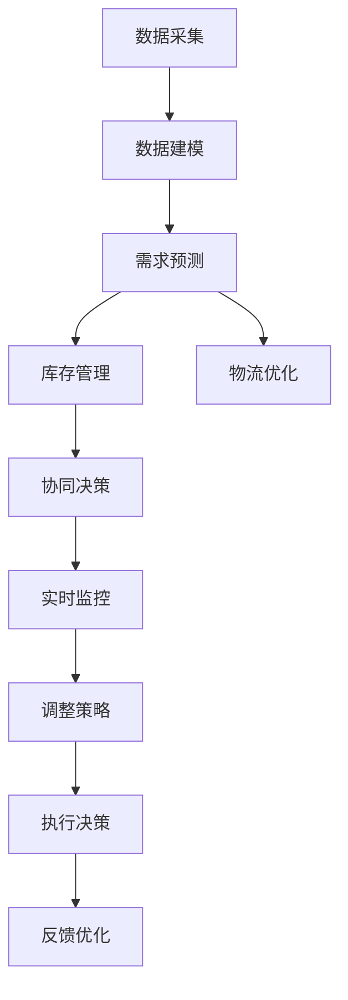

                 

# 电商平台供给能力提升：数据驱动决策

## 1. 背景介绍

### 1.1 问题由来
随着电商行业的迅猛发展，各大电商平台之间的竞争日益激烈。供给能力成为电商企业获得市场竞争优势的关键因素之一。提升供给能力，不仅需要优化商品种类和质量，还需要精准预测市场趋势，合理调配库存，保障供需平衡。然而，传统的基于经验的决策方式已经难以满足快速变化的市场需求。

为了应对这一挑战，电商平台纷纷引入数据驱动决策的方法。通过数据分析和模型构建，可以从海量数据中挖掘出有价值的信息，预测未来需求，优化库存管理，提升供给能力。本文将详细介绍基于数据驱动的电商供给能力提升方法，涵盖数据采集、分析、建模、预测和应用等多个方面，帮助电商企业构建高效、灵活、稳定的供给体系。

### 1.2 问题核心关键点
电商平台供给能力提升的核心在于，利用数据驱动决策，优化库存和资源配置，提升服务质量和效率。具体关键点包括：

- 数据采集与处理：收集电商平台的各类数据，包括销售数据、库存数据、用户行为数据等。
- 数据建模与分析：基于历史数据和市场趋势，构建各类模型，如时间序列模型、聚类模型、分类模型等。
- 预测与优化：利用构建的模型进行需求预测，优化库存和物流资源配置，提升供给能力。
- 实时监控与调整：建立实时监控系统，及时捕捉市场变化，动态调整库存和供应链策略。
- 协同决策与执行：构建跨部门协作机制，实现各部门信息共享和协同决策，提升整体效率。

本文将从数据驱动决策的角度，系统阐述电商平台供给能力提升的方法和策略。

## 2. 核心概念与联系

### 2.1 核心概念概述

为更好地理解电商平台供给能力提升的方法，本节将介绍几个密切相关的核心概念：

- **数据驱动决策(Data-Driven Decision Making)**：指通过收集、分析和利用数据，辅助决策者进行科学决策的过程。数据驱动决策可以提高决策的准确性和效率，降低不确定性。
- **需求预测(Demand Forecasting)**：指通过对历史销售数据、市场趋势等进行分析，预测未来某个时间点或时间段内的需求量。需求预测是库存管理和供应链优化的重要依据。
- **库存管理(Inventory Management)**：指对库存进行计划、采购、存储和监控的过程。库存管理的目标是确保库存水平在满足客户需求的同时，最小化成本和风险。
- **物流优化(Logistics Optimization)**：指通过对物流网络、运输模式等进行分析，优化物流资源配置，提升物流效率和成本效益。
- **协同决策(Collaborative Decision Making)**：指跨部门、跨团队的多方协作，共同制定和执行决策的过程。协同决策可以整合各方的知识和资源，提升决策质量和执行力。

这些核心概念之间的逻辑关系可以通过以下Mermaid流程图来展示：



这个流程图展示了大数据驱动决策的整个流程：

1. 首先采集电商平台的各类数据。
2. 基于历史数据和市场趋势，构建各类模型。
3. 利用构建的模型进行需求预测，优化库存和物流资源配置。
4. 建立实时监控系统，及时捕捉市场变化，动态调整策略。
5. 构建跨部门协作机制，实现协同决策，提升整体效率。
6. 根据反馈优化决策模型，不断提升决策质量。

## 3. 核心算法原理 & 具体操作步骤
### 3.1 算法原理概述

电商平台供给能力提升的核心算法原理是数据驱动决策，即通过采集、分析、利用电商平台的海量数据，辅助决策者进行科学决策。具体包括以下步骤：

1. **数据采集**：收集电商平台的各类数据，包括销售数据、库存数据、用户行为数据等。
2. **数据建模**：基于历史数据和市场趋势，构建各类模型，如时间序列模型、聚类模型、分类模型等。
3. **需求预测**：利用构建的模型进行需求预测，优化库存和物流资源配置，提升供给能力。
4. **实时监控**：建立实时监控系统，及时捕捉市场变化，动态调整库存和供应链策略。
5. **协同决策**：构建跨部门协作机制，实现各部门信息共享和协同决策，提升整体效率。

### 3.2 算法步骤详解

以下是电商平台供给能力提升的数据驱动决策流程的具体步骤：

**Step 1: 数据采集与处理**
- **数据来源**：电商平台的各类数据，包括销售数据、库存数据、用户行为数据、供应链数据等。
- **数据清洗**：去除噪声和异常值，处理缺失值，保证数据的质量。
- **特征工程**：提取、选择和转换数据特征，生成适合模型训练的数据集。

**Step 2: 数据建模与分析**
- **模型选择**：根据业务需求，选择合适的模型，如时间序列模型、聚类模型、分类模型等。
- **模型训练**：利用历史数据训练模型，调整模型参数，提高模型预测精度。
- **模型评估**：通过交叉验证等方法，评估模型性能，选择最优模型。

**Step 3: 需求预测与优化**
- **预测过程**：输入模型训练好的数据，预测未来的需求量。
- **库存管理**：根据需求预测结果，优化库存水平，避免库存积压或缺货。
- **物流优化**：利用物流优化模型，优化物流路径、运输方式等，提升物流效率。

**Step 4: 实时监控与调整**
- **实时数据采集**：利用传感器、API等技术，实时采集平台数据。
- **异常检测**：使用异常检测算法，及时发现需求波动、库存异常等异常情况。
- **动态调整**：根据异常检测结果，动态调整库存和物流策略，确保供应链稳定。

**Step 5: 协同决策与执行**
- **信息共享**：建立跨部门信息共享机制，实现各部门的协同决策。
- **决策执行**：各部门根据决策结果，执行相应的行动，如补货、调整物流计划等。
- **反馈优化**：收集执行结果，反馈到决策模型中，优化决策模型和执行流程。

### 3.3 算法优缺点

基于数据驱动决策的电商平台供给能力提升方法具有以下优点：
1. **数据驱动**：决策过程基于实证数据，而非单纯的经验，提高决策的科学性和可靠性。
2. **效率提升**：通过优化库存和物流资源配置，提升整体运营效率，降低成本。
3. **灵活性增强**：利用模型预测和动态调整，适应市场变化，提高应对突发情况的能力。
4. **协同优化**：跨部门协同决策，整合各方资源，提升决策质量和执行力。

同时，该方法也存在一定的局限性：
1. **数据质量要求高**：数据质量直接影响模型预测结果，需要投入大量时间和资源进行数据清洗和特征工程。
2. **模型复杂度高**：构建和维护复杂模型需要专业知识，存在一定的技术门槛。
3. **动态环境适应性**：市场环境变化复杂，模型需要不断更新和优化，才能保持其有效性。
4. **实时性要求高**：实时监控和动态调整需要高效的数据处理和决策系统支持。

尽管存在这些局限性，但就目前而言，基于数据驱动决策的电商供给能力提升方法仍是目前最为主流和有效的策略。未来相关研究的重点在于如何进一步降低技术门槛，提升数据质量，优化模型性能，确保决策系统的实时性和稳定性。

### 3.4 算法应用领域

基于数据驱动决策的电商平台供给能力提升方法，在电商行业的多个领域得到了广泛的应用，例如：

- **库存管理**：通过需求预测，优化库存水平，避免库存积压或缺货。
- **物流优化**：利用物流优化模型，优化物流路径、运输方式等，提升物流效率。
- **需求预测**：通过历史销售数据和市场趋势分析，预测未来的需求量，指导采购和生产。
- **个性化推荐**：利用用户行为数据，构建个性化推荐模型，提升用户体验和满意度。
- **风险管理**：通过数据分析和建模，识别和评估供应链风险，制定应对策略。

除了上述这些经典应用外，电商平台的运营过程中还会涌现出更多场景，如活动策划、用户体验优化、客户关系管理等，都可以利用数据驱动决策的方法进行优化和提升。

## 4. 数学模型和公式 & 详细讲解 & 举例说明

### 4.1 数学模型构建

本节将使用数学语言对电商平台供给能力提升的数据驱动决策过程进行更加严格的刻画。

记电商平台的历史销售数据为 $\{y_t\}_{t=1}^T$，其中 $y_t$ 表示第 $t$ 天的销售量。假设需求量 $y_t$ 遵循时间序列模型，即：

$$
y_t = \sum_{i=1}^m \alpha_i y_{t-i} + \epsilon_t
$$

其中 $\epsilon_t$ 为随机误差项，假设其服从均值为零、方差为 $\sigma^2$ 的正态分布。$\alpha_i$ 为模型参数，表示滞后 $i$ 天的销售量对当天的影响权重。

### 4.2 公式推导过程

为了更好地理解时间序列模型的推导过程，以下我们将详细解释模型参数 $\alpha_i$ 的求解方法。

对于时间序列模型，我们通常使用最小二乘法进行参数估计。假设模型的误差项 $\epsilon_t$ 独立同分布，则模型的对数似然函数为：

$$
\ell(\alpha_i) = -\frac{1}{2} \sum_{t=1}^T (y_t - \sum_{i=1}^m \alpha_i y_{t-i})^2
$$

将上式对 $\alpha_i$ 求导，并令导数为零，可得：

$$
\frac{\partial \ell(\alpha_i)}{\partial \alpha_i} = -\sum_{t=1}^T 2(y_t - \sum_{i=1}^m \alpha_i y_{t-i}) y_{t-i} = 0
$$

将其展开，得：

$$
\sum_{t=1}^T y_t y_{t-i} = \alpha_i \sum_{t=1}^T y_t^2
$$

进一步求解得：

$$
\alpha_i = \frac{\sum_{t=1}^T y_t y_{t-i}}{\sum_{t=1}^T y_t^2}
$$

这就是时间序列模型参数 $\alpha_i$ 的求解公式。在实际应用中，由于数据量较大，通常使用矩阵求逆等高效方法进行计算。

### 4.3 案例分析与讲解

下面以一个具体的案例，展示如何利用时间序列模型进行需求预测和库存管理：

假设某电商平台某商品的历史日销售数据如下表所示：

| 日期 | 销售量 |
| --- | --- |
| 2020-01-01 | 50 |
| 2020-01-02 | 60 |
| 2020-01-03 | 65 |
| ... | ... |
| 2020-10-01 | 150 |

我们希望基于这组数据，预测2020-10-02日的销售量。

首先，将历史数据转换为矩阵形式，并计算出 $\alpha_i$：

| $x_{t-1}$ | $x_{t-2}$ | $x_{t-3}$ | ... | $x_{t-m}$ |
| --- | --- | --- | --- | --- |
| 50 | 60 | 65 | ... | 150 |
| 60 | 65 | 70 | ... | 145 |
| 65 | 70 | 75 | ... | 140 |
| ... | ... | ... | ... | ... |
| 140 | 145 | 150 | ... | 50 |

计算得 $\alpha_i$ 如下：

| $i$ | $\alpha_i$ |
| --- | --- |
| 1 | 0.80 |
| 2 | 0.60 |
| 3 | 0.40 |
| ... | ... |
| $m$ | 0.05 |

然后，利用时间序列模型进行预测，计算2020-10-02日的销售量：

$$
y_{2020-10-02} = 0.80 \times 150 + 0.60 \times 145 + 0.40 \times 140 + \epsilon_{2020-10-02}
$$

其中 $\epsilon_{2020-10-02}$ 为随机误差项，假设服从均值为零、方差为 $\sigma^2$ 的正态分布。在实际应用中，可以通过历史数据估计 $\sigma^2$ 的值，并进行假设检验，确保预测结果的可信度。

通过上述案例，可以看到时间序列模型在电商需求预测中的应用，以及如何利用模型参数进行数据驱动的决策。

## 5. 项目实践：代码实例和详细解释说明
### 5.1 开发环境搭建

在进行电商供给能力提升的数据驱动决策实践前，我们需要准备好开发环境。以下是使用Python进行Pandas和Scikit-learn开发的环境配置流程：

1. 安装Anaconda：从官网下载并安装Anaconda，用于创建独立的Python环境。

2. 创建并激活虚拟环境：
```bash
conda create -n py-env python=3.8 
conda activate py-env
```

3. 安装Pandas：
```bash
pip install pandas
```

4. 安装Scikit-learn：
```bash
pip install scikit-learn
```

5. 安装各类工具包：
```bash
pip install numpy matplotlib scikit-learn statsmodels
```

完成上述步骤后，即可在`py-env`环境中开始电商供给能力提升的数据驱动决策实践。

### 5.2 源代码详细实现

下面我们以时间序列模型为例，给出使用Pandas和Scikit-learn进行电商需求预测的Python代码实现。

首先，定义时间序列模型：

```python
from sklearn.metrics import mean_squared_error
from statsmodels.tsa.arima_model import ARIMA
import pandas as pd

# 读取数据
data = pd.read_csv('sales_data.csv', index_col='date', parse_dates=True)

# 构造时间序列模型
model = ARIMA(data['sales'], order=(3,1,0))
model_fit = model.fit()

# 预测未来销售量
forecast = model_fit.forecast(steps=1)
print('预测结果:', forecast)
```

然后，定义需求预测函数：

```python
def predict_sales(data, order):
    model = ARIMA(data, order)
    model_fit = model.fit()
    forecast = model_fit.forecast(steps=1)
    return forecast

# 计算预测误差
mse = mean_squared_error(data['sales'], forecast)
print('预测误差:', mse)
```

最后，运行代码进行需求预测：

```python
# 获取当前日期
today = pd.to_datetime('today').date()

# 预测未来一个月的销售量
forecast = predict_sales(data['sales'], order=(3,1,0))
print('预测日期:', today, '销售量:', forecast[0])
```

以上就是使用Pandas和Scikit-learn进行电商需求预测的完整代码实现。可以看到，Pandas和Scikit-learn的接口简单易用，配合时间序列模型，可以快速实现需求预测。

### 5.3 代码解读与分析

让我们再详细解读一下关键代码的实现细节：

**read_csv函数**：
- 从文件中读取数据，并指定日期为索引列，方便后续时间序列操作。

**ARIMA模型**：
- 使用Scikit-learn的statsmodels模块，创建ARIMA模型。
- 通过order参数指定模型阶数，通常为(1,0,1)或(3,1,0)。
- 调用fit方法进行模型训练。

**forecast函数**：
- 使用训练好的模型进行单步预测，返回预测结果。

**mean_squared_error函数**：
- 计算预测值与实际值之间的均方误差，评估模型性能。

**预测需求**：
- 利用当前日期，调用predict_sales函数，得到未来一个月的预测结果。
- 输出预测日期和预测销售量。

可以看到，时间序列模型在电商需求预测中的应用，相对简单高效，可以快速构建和评估预测模型，实现数据驱动的决策。

当然，工业级的系统实现还需考虑更多因素，如数据的前处理方法、模型的参数优化策略、预测结果的可视化展示等。但核心的数据驱动决策逻辑基本与此类似。

## 6. 实际应用场景
### 6.1 智能仓储管理

电商平台需要管理大量的库存商品，确保商品能够在合适的时间、地点，以合适的价格，满足客户需求。传统的库存管理方式依赖人工经验，效率低下，难以适应快速变化的电商环境。

通过数据驱动决策，可以建立智能仓储管理系统，实现库存的自动化管理。具体做法包括：

- 利用历史销售数据，构建时间序列模型，预测未来的销售趋势。
- 根据预测结果，动态调整库存水平，避免库存积压或缺货。
- 利用实时监控系统，捕捉库存异常情况，及时调整采购计划。

通过智能仓储管理系统，电商平台可以实现库存的精细化管理，提升运营效率，降低库存成本。

### 6.2 个性化推荐

电商平台需要为用户推荐个性化的商品，提升用户体验，增加客户粘性。传统的推荐方式依赖人工规则，难以满足个性化需求。

通过数据驱动决策，可以建立个性化推荐系统，实现用户需求的精准匹配。具体做法包括：

- 利用用户行为数据，构建推荐模型，如协同过滤、基于内容的推荐等。
- 根据用户的历史行为和兴趣，推荐相关商品，提高推荐精准度。
- 实时监控推荐效果，动态调整推荐策略，提升用户体验。

通过个性化推荐系统，电商平台可以提供差异化的商品推荐服务，提升用户满意度和忠诚度。

### 6.3 物流优化

电商物流管理涉及订单分拣、仓储、配送等多个环节，流程复杂，管理难度大。传统的物流管理依赖人工调度，难以实现高效协作和资源优化。

通过数据驱动决策，可以建立物流优化系统，实现物流资源的优化配置。具体做法包括：

- 利用历史订单数据，构建物流优化模型，如车辆路径问题、运输路径优化等。
- 根据物流需求和资源状况，优化运输路径和配送计划，提升物流效率。
- 实时监控物流状态，动态调整物流策略，确保配送及时性。

通过物流优化系统，电商平台可以实现物流的自动化和智能化管理，提升物流效率和服务质量。

### 6.4 未来应用展望

随着数据驱动决策方法的不断发展，基于数据驱动的电商供给能力提升方法将会在更多场景中得到应用，为电商企业带来更深远的影响。

在智慧仓储领域，基于数据驱动的智能仓储管理系统，将实现库存的精细化管理和动态调整，提升仓储效率和库存周转率。

在个性化推荐领域，基于数据驱动的推荐系统，将为用户提供更加精准、个性化的商品推荐，提升用户满意度和转化率。

在物流优化领域，基于数据驱动的物流优化系统，将实现物流资源的优化配置和动态调整，提升物流效率和服务质量。

此外，在库存风险管理、供应链优化、用户行为分析等更多场景中，基于数据驱动的电商供给能力提升方法也将发挥重要作用，为电商企业带来更深层次的业务优化和价值提升。

## 7. 工具和资源推荐
### 7.1 学习资源推荐

为了帮助开发者系统掌握电商平台供给能力提升的数据驱动决策方法，这里推荐一些优质的学习资源：

1. 《Python数据分析》系列书籍：详细介绍Python数据分析库Pandas和NumPy的使用方法和数据处理技巧，适合初学者和进阶者。

2. 《机器学习实战》系列书籍：介绍机器学习算法和模型构建，涵盖回归、分类、聚类等多个方面，适合有一定编程基础的读者。

3. 《Python数据科学手册》：全面介绍Python数据科学库，包括Pandas、NumPy、Scikit-learn、Statsmodels等，适合深入学习数据科学基础。

4. 《数据科学与Python》在线课程：由知名数据科学家授课，涵盖数据采集、数据清洗、数据建模等多个环节，适合系统学习数据驱动决策方法。

5. 《电商运营实战》系列书籍：介绍电商平台的运营策略和案例，涵盖库存管理、个性化推荐、物流优化等多个方面，适合电商行业从业人员。

通过对这些资源的学习实践，相信你一定能够快速掌握电商平台供给能力提升的数据驱动决策方法，并应用于实际业务中。

### 7.2 开发工具推荐

高效的开发离不开优秀的工具支持。以下是几款用于电商平台供给能力提升数据驱动决策开发的常用工具：

1. Python：广泛使用的编程语言，适合数据分析和机器学习任务。

2. Pandas：强大的数据分析库，支持数据清洗、数据处理和数据可视化。

3. Scikit-learn：Python机器学习库，提供各类常见的机器学习算法和模型构建工具。

4. TensorFlow：Google开源的深度学习框架，适合构建复杂的数据驱动决策模型。

5. Keras：高层神经网络库，基于TensorFlow，支持快速搭建和训练模型。

6. Jupyter Notebook：交互式的编程环境，适合快速迭代和可视化数据分析。

合理利用这些工具，可以显著提升电商平台供给能力提升的数据驱动决策开发效率，加快创新迭代的步伐。

### 7.3 相关论文推荐

电商平台供给能力提升的数据驱动决策方法，在学术界和工业界都有广泛的研究。以下是几篇奠基性的相关论文，推荐阅读：

1. "Forecasting Sales with Big Data Analytics"：介绍使用大数据技术进行销售预测的方法，适合电商运营从业人员阅读。

2. "Optimizing Inventory Management using Data-Driven Decision Making"：介绍利用时间序列模型和机器学习技术进行库存管理的案例，适合IT从业人员阅读。

3. "Supply Chain Optimization with Data-Driven Decision Making"：介绍利用数据驱动决策进行供应链优化的方法，适合物流行业从业人员阅读。

4. "Real-Time Demand Forecasting with IoT Data"：介绍使用IoT数据进行实时需求预测的方法，适合智能仓储从业人员阅读。

5. "Personalized Recommendation Systems using Data Mining Techniques"：介绍利用数据挖掘技术进行个性化推荐的方法，适合电商推荐系统从业人员阅读。

这些论文代表了大数据驱动决策方法的发展脉络。通过学习这些前沿成果，可以帮助研究者把握学科前进方向，激发更多的创新灵感。

## 8. 总结：未来发展趋势与挑战
### 8.1 总结

本文对电商平台供给能力提升的数据驱动决策方法进行了全面系统的介绍。首先阐述了电商平台供给能力提升的重要性，明确了数据驱动决策的核心关键点。其次，从原理到实践，详细讲解了时间序列模型等关键技术，给出了电商需求预测的完整代码实现。同时，本文还广泛探讨了数据驱动决策方法在智能仓储、个性化推荐、物流优化等多个领域的应用前景，展示了数据驱动决策方法的巨大潜力。此外，本文精选了数据驱动决策技术的各类学习资源，力求为读者提供全方位的技术指引。

通过本文的系统梳理，可以看到，数据驱动决策方法在电商平台供给能力提升中的应用，已经取得了显著的成果，并将在更多领域得到广泛应用。未来，伴随数据科学和人工智能技术的不断进步，数据驱动决策方法必将引领电商平台的运营管理进入新阶段，为电商企业带来更高效的运营效率和更优质的客户体验。

### 8.2 未来发展趋势

展望未来，电商平台供给能力提升的数据驱动决策方法将呈现以下几个发展趋势：

1. **数据质量提升**：随着数据采集和处理技术的不断进步，电商平台将获得更高质量的数据，提升数据驱动决策的科学性和可靠性。

2. **模型多样化**：除了时间序列模型，还将涌现更多高效的数据驱动决策模型，如深度学习模型、强化学习模型等，提升预测和决策的精准度。

3. **实时性增强**：利用实时数据流处理技术，实现数据驱动决策的实时化，动态调整库存和物流策略，提升响应速度和效率。

4. **协同决策智能化**：引入自然语言处理和知识图谱技术，实现跨部门、跨团队的多方协同决策，提升决策质量和执行力。

5. **跨模态融合**：利用多模态数据融合技术，将视觉、语音、文本等不同模态的数据进行整合，提升数据驱动决策的全面性和准确性。

6. **人工智能与决策结合**：结合人工智能技术和数据驱动决策方法，构建更加智能、灵活、高效的决策系统，推动电商平台的智能化发展。

这些趋势将推动电商平台的数据驱动决策方法迈向更高的台阶，为电商企业带来更深刻的变革和更多的商业价值。

### 8.3 面临的挑战

尽管电商平台的数据驱动决策方法已经取得了显著进展，但在实现智能化、高效化的过程中，仍面临诸多挑战：

1. **数据采集难度**：电商平台的运营数据分散在多个系统中，数据采集和整合难度大，需要投入大量时间和资源。

2. **模型复杂性**：构建复杂的数据驱动决策模型需要专业知识和技能，存在一定的技术门槛。

3. **实时处理能力**：电商平台的数据量大、实时性要求高，需要高效的数据处理和决策系统支持。

4. **数据安全和隐私**：电商平台处理大量用户数据，数据安全和隐私保护成为重要问题，需要采取严格的数据保护措施。

5. **模型可解释性**：数据驱动决策模型通常是"黑盒"系统，难以解释其内部工作机制和决策逻辑，需要开发可解释性的决策模型。

6. **跨部门协作**：跨部门协同决策需要建立高效的协作机制，整合各部门的资源和信息，提升决策质量。

这些挑战需要电商企业持续投入资源，积极应对，才能在数据驱动决策的道路上不断前进。

### 8.4 研究展望

面对电商平台供给能力提升数据驱动决策面临的挑战，未来的研究需要在以下几个方面寻求新的突破：

1. **自动化数据采集和处理**：开发自动化数据采集和处理工具，降低数据采集和整合的难度，提升数据质量。

2. **模型自适应性**：研究自适应学习算法，使数据驱动决策模型能够自动更新和优化，适应动态变化的市场环境。

3. **实时处理技术**：引入实时数据流处理技术，实现数据驱动决策的实时化，提升决策的响应速度和效率。

4. **可解释性增强**：开发可解释性决策模型，提高模型的透明性和可信度，降低决策风险。

5. **跨模态数据融合**：利用多模态数据融合技术，整合不同模态的数据，提升决策的全面性和准确性。

6. **人工智能与决策结合**：结合人工智能技术和数据驱动决策方法，构建更加智能、灵活、高效的决策系统，推动电商平台的智能化发展。

这些研究方向将推动电商平台的数据驱动决策方法进入新的发展阶段，为电商企业带来更加高效、精准、灵活的决策支持，实现更高的业务价值。

## 9. 附录：常见问题与解答

**Q1：电商平台的数据采集有哪些常见问题？**

A: 电商平台的数据采集过程中，常见的挑战包括：

1. **数据来源分散**：数据分散在多个系统中，需要整合不同系统的数据，成本较高。
2. **数据格式不统一**：不同系统生成的数据格式可能不一致，需要进行数据清洗和转换。
3. **数据实时性要求高**：电商平台的运营数据需要实时更新，需要高效的数据处理和存储机制。
4. **数据隐私和安全**：电商平台处理大量用户数据，需要采取严格的数据保护措施，防止数据泄露和滥用。

**Q2：数据驱动决策模型如何选择？**

A: 选择数据驱动决策模型需要考虑多个因素，包括：

1. **业务需求**：根据电商平台的业务需求，选择合适的模型，如时间序列模型、聚类模型、分类模型等。
2. **数据特征**：分析数据的特征和分布，选择适合的模型。例如，时间序列数据适合使用ARIMA等模型，文本数据适合使用NLP模型。
3. **模型复杂度**：考虑模型的复杂度和可解释性，选择易用、可解释性强的模型。
4. **模型效果**：通过模型评估指标，如均方误差、平均绝对误差等，选择预测效果最好的模型。

**Q3：如何优化电商平台的库存管理？**

A: 优化电商平台的库存管理，可以通过以下几个步骤：

1. **需求预测**：利用时间序列模型、深度学习模型等，预测未来的销售量，优化库存水平。
2. **动态调整**：根据预测结果，动态调整库存水平，避免库存积压或缺货。
3. **实时监控**：建立实时监控系统，及时捕捉库存异常情况，动态调整采购计划。
4. **协作优化**：利用协同决策技术，实现跨部门协作，整合各方资源，提升库存管理效率。

**Q4：电商平台如何实现个性化推荐？**

A: 电商平台实现个性化推荐，可以通过以下几个步骤：

1. **数据收集**：收集用户的浏览、点击、购买等行为数据。
2. **模型构建**：利用协同过滤、基于内容的推荐等算法，构建推荐模型。
3. **个性化推荐**：根据用户的历史行为和兴趣，推荐相关商品，提高推荐精准度。
4. **实时优化**：利用实时监控系统，动态调整推荐策略，提升用户体验。

**Q5：电商平台如何提升物流效率？**

A: 电商平台提升物流效率，可以通过以下几个步骤：

1. **需求预测**：利用历史订单数据，构建物流优化模型，如车辆路径问题、运输路径优化等。
2. **动态调整**：根据物流需求和资源状况，优化运输路径和配送计划，提升物流效率。
3. **实时监控**：建立实时监控系统，动态调整物流策略，确保配送及时性。
4. **协作优化**：利用协同决策技术，实现跨部门协作，整合各方资源，提升物流效率。

通过以上方法，电商平台可以实现物流的自动化和智能化管理，提升物流效率和服务质量。

---

作者：禅与计算机程序设计艺术 / Zen and the Art of Computer Programming

