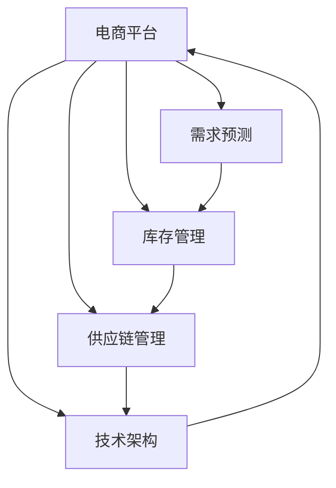

                 

# 电商平台供给能力提升：新品类和新品牌的引入

> 关键词：电商平台,供给能力提升,新品类,新品牌,引入策略,需求预测,库存管理,供应链优化,技术架构

## 1. 背景介绍

### 1.1 问题由来
随着电商市场的快速发展，电商平台面临着日益增长的需求压力和运营挑战。除了传统的大型商品品类，新兴的消费品类和新品牌如雨后春笋般涌现，如何有效地引入这些新品类和新品牌，保持平台的供给能力和用户满意度，成为电商平台急需解决的核心问题。

### 1.2 问题核心关键点
1. **新品类和新品牌的引入**：如何评估新品的市场潜力，选择优质的新品牌进行合作。
2. **供给能力提升**：如何通过数据驱动和智能决策，保证新品的及时供货和库存充足。
3. **用户体验优化**：如何利用技术手段提升新品的展示效果和购买体验，增加用户粘性。
4. **供应链管理**：如何优化供应链，降低成本，提高效率。

### 1.3 问题研究意义
新品类和新品牌的引入对于电商平台来说，既是机遇也是挑战。一方面，新品类和新品牌能为平台带来新的用户增长点，推动业务创新；另一方面，需要合理评估和管理供给能力，避免因引入不当导致的用户满意度下降和库存积压问题。通过优化引入策略和供应链管理，电商平台可以更好地适应市场变化，提升运营效率和用户体验，从而保持竞争优势。

## 2. 核心概念与联系

### 2.1 核心概念概述

为更好地理解电商平台新品类和新品牌引入的策略和实践，本节将介绍几个密切相关的核心概念：

- **电商平台(E-Commerce Platform)**：基于互联网的购物平台，提供商品展示、搜索、购买等电商服务。
- **供给能力(Supply Capability)**：电商平台在特定时间点内，能够满足用户订单需求的能力，包括商品种类、库存量、物流配送等。
- **需求预测(Demand Forecasting)**：基于历史数据和市场趋势，预测未来商品的需求量。
- **库存管理(Inventory Management)**：通过智能算法，优化商品的库存水平，避免过度或缺货。
- **供应链管理(Supply Chain Management)**：涉及商品从生产到交付全过程的管理，包括供应商选择、生产计划、物流配送等。
- **技术架构(Technical Architecture)**：支撑电商平台运行的技术架构，包括数据存储、计算资源、微服务架构等。

这些核心概念之间的逻辑关系可以通过以下Mermaid流程图来展示：



这个流程图展示出电商平台的核心功能和相关支撑系统：

1. 电商平台通过需求预测、库存管理和供应链管理，保证供给能力。
2. 技术架构提供了平台的基础设施和运行保障。
3. 需求预测和库存管理密切关联，库存管理依赖供应链管理，最终支撑电商平台的运营。

## 3. 核心算法原理 & 具体操作步骤
### 3.1 算法原理概述

电商平台新品类和新品牌引入的策略，本质上是基于数据驱动的智能决策过程。其核心思想是通过综合利用历史销售数据、市场趋势、消费者行为等，预测新品类的市场需求，评估新品牌的产品质量和服务可靠性，然后通过优化供应链和库存管理，确保新品的及时供货和库存充足。

具体来说，引入策略包括以下几个关键步骤：

- **需求预测**：基于历史销售数据，利用机器学习模型预测新品类的市场需求。
- **品牌评估**：收集新品牌的评价和反馈数据，使用文本分析和情感分析等技术评估品牌的可靠性。
- **供应商选择**：根据品牌的供应链能力和产品质量，选择合适的供应商进行合作。
- **库存优化**：通过动态调整库存水平，保证新品类的及时供货。
- **物流配送**：优化物流配送路径和方式，提高配送效率，降低成本。

### 3.2 算法步骤详解

以下是电商平台上进行新品类和新品牌引入的具体操作步骤：

#### 步骤 1: 数据准备和预处理

1. **数据收集**：收集历史销售数据、用户评价、品牌反馈等。
2. **数据清洗**：去除噪声和异常值，处理缺失数据。
3. **特征工程**：提取和构造有助于预测和评估的特征，如销售趋势、季节性变化、品牌信誉等。

#### 步骤 2: 需求预测

1. **选择模型**：选择适合的机器学习模型，如线性回归、随机森林、神经网络等。
2. **训练模型**：使用历史数据训练模型，并通过交叉验证等技术优化模型参数。
3. **预测需求**：使用训练好的模型，对新品类的市场需求进行预测。

#### 步骤 3: 品牌评估

1. **情感分析**：使用自然语言处理技术，对品牌的评价和反馈进行情感分析，评估品牌的好评率。
2. **品牌信誉**：综合分析品牌的历史表现、用户评价和第三方认证，评估品牌的信誉度。

#### 步骤 4: 供应商选择

1. **供应商筛选**：根据品牌信誉和供应链能力，筛选出潜在的供应商。
2. **性能评估**：评估供应商的生产效率、交货周期、产品质量等关键指标。
3. **合作谈判**：与选定的供应商进行合作谈判，确定合作条款。

#### 步骤 5: 库存管理

1. **需求预测**：根据市场需求预测，制定初期库存计划。
2. **动态调整**：根据实时销售数据和库存水平，动态调整库存。
3. **安全库存**：设置安全库存水平，避免缺货。

#### 步骤 6: 物流配送

1. **路线规划**：使用地理信息系统(GIS)和优化算法，规划最优的物流配送路线。
2. **物流选择**：选择合适的物流服务商，根据订单量和距离确定物流方式。
3. **配送执行**：执行物流配送，并实时跟踪配送状态。

### 3.3 算法优缺点

基于数据驱动的电商平台新品类和新品牌引入策略，具有以下优点：

1. **预测准确性**：通过历史数据和机器学习模型，可以较为准确地预测新品类的市场需求。
2. **品牌可靠性评估**：通过情感分析和品牌信誉评估，选择优质的新品牌，降低风险。
3. **库存优化**：动态调整库存水平，避免过度或缺货，降低库存成本。
4. **物流效率**：优化物流配送路线和方式，提高配送效率，降低物流成本。

同时，该方法也存在一定的局限性：

1. **数据依赖性**：预测和评估的准确性高度依赖于数据的质量和完整性。
2. **市场变化**：市场需求和品牌表现可能随时间变化，预测模型需要不断更新。
3. **供应商风险**：供应商的性能和可靠性可能出现波动，影响商品供货。
4. **技术复杂性**：需要综合运用多种数据和算法技术，实施难度较大。

尽管存在这些局限性，但就目前而言，基于数据驱动的电商平台的引入策略仍是主流范式。未来相关研究的重点在于如何进一步提高预测和评估的准确性，降低对数据的质量依赖，同时兼顾模型复杂度和运营效率。

### 3.4 算法应用领域

基于数据驱动的电商平台新品类和新品牌引入策略，已经在电商、零售、物流等多个行业领域得到了广泛应用，具体包括：

- **电商平台的商品扩展**：通过预测新品类的市场需求，电商企业可以拓展商品种类，满足不同用户需求。
- **零售业的库存管理**：利用需求预测和库存优化，零售企业可以控制库存水平，减少库存积压。
- **物流公司的配送优化**：通过路线规划和物流选择，物流公司可以提升配送效率，降低运输成本。
- **智能供应链的构建**：综合运用需求预测、品牌评估、供应商选择等技术，构建高效的智能供应链。

除了上述这些应用外，该策略还在智慧城市、金融服务、医疗健康等众多领域中显示出其强大的潜力和价值。随着数据的积累和算法的进步，相信该策略将进一步推动电商平台和其他企业的智能化转型。

## 4. 数学模型和公式 & 详细讲解  
### 4.1 数学模型构建

本节将使用数学语言对电商平台新品类和新品牌引入的策略进行更加严格的刻画。

假设电商平台在时间序列 $t=1,2,...,T$ 上的销售量记为 $D_t$，新品牌在时间序列上的平均销售量记为 $\bar{D}_t$，需求预测模型的参数为 $\theta$。

定义需求预测模型的损失函数为：

$$
L(D_t, \bar{D}_t) = \frac{1}{T} \sum_{t=1}^T (D_t - \bar{D}_t)^2
$$

其中，$L(D_t, \bar{D}_t)$ 表示预测误差，$\frac{1}{T} \sum_{t=1}^T$ 表示均方误差。

需求预测模型的目标是最小化损失函数 $L(D_t, \bar{D}_t)$，即找到最优参数 $\theta$：

$$
\theta^* = \mathop{\arg\min}_{\theta} L(D_t, \bar{D}_t)
$$

在实践中，我们通常使用基于梯度的优化算法（如SGD、Adam等）来近似求解上述最优化问题。设 $\eta$ 为学习率，则参数的更新公式为：

$$
\theta \leftarrow \theta - \eta \nabla_{\theta}L(D_t, \bar{D}_t)
$$

其中 $\nabla_{\theta}L(D_t, \bar{D}_t)$ 为损失函数对参数 $\theta$ 的梯度，可通过反向传播算法高效计算。

### 4.2 公式推导过程

以下我们以线性回归模型为例，推导需求预测的公式及其梯度的计算公式。

假设需求预测模型为线性回归模型，形式为 $D_t = \theta_0 + \sum_{i=1}^p \theta_i X_{it}$，其中 $\theta = (\theta_0, \theta_1, ..., \theta_p)$，$X_{it}$ 为影响销售量的特征变量。

根据线性回归模型，需求预测误差为：

$$
\epsilon_t = D_t - \theta_0 - \sum_{i=1}^p \theta_i X_{it}
$$

定义损失函数为：

$$
L(D_t, \bar{D}_t) = \frac{1}{T} \sum_{t=1}^T \epsilon_t^2
$$

将 $\epsilon_t$ 代入，得：

$$
L(D_t, \bar{D}_t) = \frac{1}{T} \sum_{t=1}^T (D_t - \theta_0 - \sum_{i=1}^p \theta_i X_{it})^2
$$

根据最小二乘法的原理，需求预测模型的梯度为：

$$
\frac{\partial L(D_t, \bar{D}_t)}{\partial \theta} = \frac{2}{T} \sum_{t=1}^T \left( D_t - \theta_0 - \sum_{i=1}^p \theta_i X_{it} \right) \sum_{i=1}^p X_{it}
$$

将 $\epsilon_t$ 代入，得：

$$
\frac{\partial L(D_t, \bar{D}_t)}{\partial \theta} = \frac{2}{T} \sum_{t=1}^T \epsilon_t \sum_{i=1}^p X_{it}
$$

在得到损失函数的梯度后，即可带入参数更新公式，完成模型的迭代优化。重复上述过程直至收敛，最终得到适应需求预测的最优模型参数 $\theta^*$。

## 5. 项目实践：代码实例和详细解释说明
### 5.1 开发环境搭建

在进行电商平台的商品扩展和库存优化实践前，我们需要准备好开发环境。以下是使用Python进行TensorFlow开发的环境配置流程：

1. 安装Anaconda：从官网下载并安装Anaconda，用于创建独立的Python环境。

2. 创建并激活虚拟环境：
```bash
conda create -n tf-env python=3.8 
conda activate tf-env
```

3. 安装TensorFlow：根据CUDA版本，从官网获取对应的安装命令。例如：
```bash
pip install tensorflow==2.7
```

4. 安装各类工具包：
```bash
pip install pandas numpy scikit-learn matplotlib
```

完成上述步骤后，即可在`tf-env`环境中开始电商平台商品扩展和库存优化的实践。

### 5.2 源代码详细实现

下面以线性回归模型为例，给出使用TensorFlow进行需求预测和库存优化的PyTorch代码实现。

首先，定义数据处理函数：

```python
import tensorflow as tf
import numpy as np

def prepare_data(X, y, batch_size=32, shuffle=True):
    dataset = tf.data.Dataset.from_tensor_slices((X, y))
    if shuffle:
        dataset = dataset.shuffle(buffer_size=len(X))
    dataset = dataset.batch(batch_size)
    return dataset
```

然后，定义模型和优化器：

```python
def create_model(input_shape):
    model = tf.keras.models.Sequential([
        tf.keras.layers.Dense(64, activation='relu', input_shape=input_shape),
        tf.keras.layers.Dense(1)
    ])
    return model

def compile_model(model, optimizer='adam', loss='mse'):
    model.compile(optimizer=optimizer, loss=loss)
```

接着，定义训练和评估函数：

```python
def train_model(model, dataset, epochs=10, validation_data=None):
    model.fit(dataset, validation_data=validation_data, epochs=epochs)
```

最后，启动训练流程并在测试集上评估：

```python
X_train = np.random.randn(1000, 10)
y_train = X_train * 2 + 3
X_test = np.random.randn(100, 10)
y_test = X_test * 2 + 3

input_shape = (10,)

model = create_model(input_shape)
compile_model(model)

dataset = prepare_data(X_train, y_train)
dataset_test = prepare_data(X_test, y_test)

train_model(model, dataset, validation_data=dataset_test)

print('Test loss:', model.evaluate(dataset_test)[0])
```

以上就是使用TensorFlow进行需求预测和库存优化的完整代码实现。可以看到，TensorFlow提供了方便的API和丰富的模型库，使得模型的实现和训练变得更加简单高效。

### 5.3 代码解读与分析

让我们再详细解读一下关键代码的实现细节：

**prepare_data函数**：
- `tf.data.Dataset.from_tensor_slices`：创建一个TensorFlow数据集。
- `shuffle`：设置数据集的随机打乱策略。
- `batch`：设置数据集的批次大小。

**create_model函数**：
- `Sequential`：创建顺序模型。
- `Dense`：添加全连接层。
- `activation='relu'`：设置激活函数为ReLU。
- `input_shape`：指定模型的输入形状。

**compile_model函数**：
- `compile`：编译模型，设置优化器和损失函数。

**train_model函数**：
- `fit`：训练模型，传入数据集和验证集。

**启动训练流程**：
- 生成随机数据集`X_train`和`y_train`，并设置输入形状`input_shape`。
- 创建模型`model`，并使用`compile_model`函数编译模型。
- 准备数据集`dataset`和测试集`dataset_test`。
- 使用`train_model`函数训练模型，并打印测试集上的损失值。

可以看到，TensorFlow的API设计简洁高效，能够快速实现复杂的数据处理和模型训练任务。利用TensorFlow，可以轻松地搭建和优化需求预测和库存管理模型，实现电商平台的智能化扩展。

当然，在工业级的系统实现中，还需要考虑更多因素，如模型的保存和部署、超参数的自动搜索、更灵活的任务适配层等。但核心的引入策略和库存优化流程基本与此类似。

## 6. 实际应用场景
### 6.1 智能推荐系统

智能推荐系统是电商平台的重要应用之一。通过分析用户的历史行为数据和偏好，平台可以向用户推荐感兴趣的商品，提升用户的购买体验和满意度。

在技术实现上，可以通过需求预测模型预测用户的购买意向，然后根据库存水平和物流配送能力，动态调整推荐策略。同时，利用基于内容的推荐算法，结合用户画像和商品属性，提供更加个性化的推荐结果。

### 6.2 库存管理优化

库存管理是电商平台运营中的重要环节，直接影响到用户的购买体验和平台的运营成本。通过需求预测模型，平台可以动态调整库存水平，避免库存积压和缺货现象。

在实际应用中，可以结合库存优化算法，利用实时销售数据和历史销售趋势，动态调整各商品类别和品牌的库存水平。同时，通过需求预测模型，提前预估潜在的库存短缺情况，及时采购补货，保证供货充足。

### 6.3 物流配送优化

物流配送是电商平台商品从仓库到用户的关键环节，直接影响用户的购物体验和满意度。通过需求预测模型，平台可以优化物流配送路径和方式，提高配送效率，降低配送成本。

在实际应用中，可以利用GIS和优化算法，计算最优的物流配送路径和交通方式。同时，根据实时订单量和配送中心的位置，动态调整配送车辆和配送路线，提升配送效率。

### 6.4 未来应用展望

随着电商市场的持续发展，基于数据驱动的电商平台新品类和新品牌引入策略将迎来新的应用场景和挑战：

1. **个性化推荐**：通过深度学习和数据挖掘技术，为用户提供更加个性化和精准的商品推荐。
2. **实时定价策略**：结合需求预测和市场变化，动态调整商品价格，提升销售转化率。
3. **跨平台协同**：实现不同电商平台之间的数据共享和协同运营，提升用户粘性和平台竞争力。
4. **智能客服**：利用自然语言处理和机器学习技术，构建智能客服系统，提升用户服务和运营效率。
5. **实时监控和预警**：通过实时监控平台运营数据，及时发现和预警潜在的风险和问题，保障平台的稳定运营。

这些应用场景的拓展，将进一步推动电商平台的智能化转型，提升运营效率和用户体验，为电商行业带来新的增长动力。

## 7. 工具和资源推荐
### 7.1 学习资源推荐

为了帮助开发者系统掌握电商平台新品类和新品牌引入的策略和实践，这里推荐一些优质的学习资源：

1. **《TensorFlow实战：深度学习与人工智能》**：由深度学习专家撰写，详细介绍了TensorFlow的使用方法和应用场景，包括需求预测、库存管理等电商问题。
2. **《机器学习实战》**：介绍了多种机器学习算法和应用案例，涵盖了回归分析、分类、聚类等基本概念和模型。
3. **Kaggle平台**：提供了大量的电商数据集和比赛项目，开发者可以实践需求预测和库存管理等任务，积累实战经验。
4. **GitHub**：可以访问和分享电商平台的开源代码和项目，学习和借鉴其他开发者的实践经验。

通过对这些资源的学习实践，相信你一定能够快速掌握电商平台新品类和新品牌引入的精髓，并用于解决实际的电商问题。

### 7.2 开发工具推荐

高效的开发离不开优秀的工具支持。以下是几款用于电商平台新品类和新品牌引入开发的常用工具：

1. **TensorFlow**：由Google主导开发的深度学习框架，易于使用，支持高效的模型训练和部署。
2. **PyTorch**：Facebook开发的深度学习框架，具有灵活的计算图和动态图，适合研究和实验。
3. **Jupyter Notebook**：免费的交互式开发环境，支持Python、R等多种编程语言，方便代码调试和数据可视化。
4. **Anaconda**：Python的科学计算平台，提供易于管理和使用的Python环境。
5. **Keras**：高层次的神经网络API，易于上手，支持多种深度学习模型。

合理利用这些工具，可以显著提升电商平台新品类和新品牌引入的开发效率，加快创新迭代的步伐。

### 7.3 相关论文推荐

电商平台新品类和新品牌引入策略的研究源于学界的持续研究。以下是几篇奠基性的相关论文，推荐阅读：

1. **《深度学习：大规模数据下的机器学习》**：由深度学习专家撰写，介绍了深度学习的基本概念和应用场景，涵盖了需求预测、库存管理等电商问题。
2. **《电商平台的智能推荐系统》**：介绍了基于协同过滤和内容推荐的推荐算法，结合电商平台的实际应用，提出了多种推荐策略。
3. **《基于需求预测的库存管理优化》**：研究了需求预测和库存管理的问题，提出了一种动态库存优化的算法，提高了库存管理的效率。

这些论文代表了大数据驱动的电商平台的引入策略的发展脉络。通过学习这些前沿成果，可以帮助研究者把握学科前进方向，激发更多的创新灵感。

## 8. 总结：未来发展趋势与挑战
### 8.1 总结

本文对电商平台新品类和新品牌引入的策略进行了全面系统的介绍。首先阐述了电商平台的运营背景和面临的挑战，明确了新品类和新品牌引入的重要性。其次，从原理到实践，详细讲解了需求预测、品牌评估、供应商选择、库存管理等核心步骤，给出了电商平台商品扩展和库存优化的完整代码实例。同时，本文还广泛探讨了电商平台的实际应用场景，展示了引入策略的强大潜力和应用前景。

通过本文的系统梳理，可以看到，基于数据驱动的电商平台新品类和新品牌引入策略，对于提升电商平台的供给能力和用户体验具有重要意义。未来，伴随技术的持续演进和应用的不断深入，该策略必将为电商行业带来更多的创新和价值。

### 8.2 未来发展趋势

展望未来，电商平台新品类和新品牌引入策略将呈现以下几个发展趋势：

1. **智能化程度提升**：结合深度学习和数据挖掘技术，电商平台的需求预测和品牌评估将更加智能化和准确化，提升推荐和决策的精度。
2. **实时性增强**：利用流式数据处理和实时计算技术，电商平台的需求预测和库存管理将更加实时和动态，提升运营效率。
3. **多渠道融合**：实现不同电商平台和渠道之间的数据共享和协同运营，提升用户粘性和平台竞争力。
4. **用户参与度提升**：通过用户反馈和参与机制，电商平台的需求预测和品牌评估将更加个性化和多样化，提升用户体验。
5. **跨领域应用**：将电商平台的技术和策略应用于智慧城市、智能制造等更多领域，推动跨领域的智能化转型。

这些趋势凸显了电商平台新品类和新品牌引入策略的广阔前景。这些方向的探索发展，必将进一步推动电商平台和其他企业的智能化转型，为电商行业带来新的增长动力。

### 8.3 面临的挑战

尽管基于数据驱动的电商平台新品类和新品牌引入策略已经取得了显著成效，但在迈向更加智能化、普适化应用的过程中，它仍面临着诸多挑战：

1. **数据质量问题**：电商平台的运营数据可能存在噪声和异常值，影响需求预测和品牌评估的准确性。
2. **市场变化**：市场需求和品牌表现可能随时间变化，预测模型需要不断更新以适应新的市场趋势。
3. **供应商风险**：供应商的性能和可靠性可能出现波动，影响商品供货和质量。
4. **技术复杂性**：需要综合运用多种数据和算法技术，实施难度较大，需要多方协同配合。
5. **用户隐私保护**：电商平台需要平衡数据利用和用户隐私保护，避免用户数据泄露和安全问题。

正视这些挑战，积极应对并寻求突破，将是大数据驱动的电商平台新品类和新品牌引入策略迈向成熟的必由之路。相信随着技术的不断进步和应用的不断深入，这些挑战终将一一被克服，该策略必将在构建智能化的电商平台中扮演越来越重要的角色。

### 8.4 研究展望

面向未来，电商平台的智能化转型需要从多个方面进行探索和研究：

1. **需求预测的算法优化**：开发更加高效和精确的需求预测算法，提升预测的准确性和实时性。
2. **品牌评估的多模态融合**：结合用户评价、社交媒体、商品属性等多模态数据，全面评估品牌的信誉度和质量。
3. **供应链管理的智能化**：利用智能算法和优化技术，实现供应链的动态管理和优化。
4. **用户参与机制的构建**：通过用户反馈和参与机制，提升电商平台的智能化水平，增强用户粘性和满意度。
5. **隐私保护和安全性**：加强用户隐私保护，保障数据安全和平台稳定运行。

这些研究方向将引领电商平台新品类和新品牌引入策略的进一步发展，为构建智能化的电商平台提供更多创新手段和技术支持。

## 9. 附录：常见问题与解答
**Q1：电商平台如何平衡用户隐私和数据利用？**

A: 电商平台需要制定明确的数据隐私政策，严格遵守相关法律法规。在数据利用过程中，应采用匿名化和去标识化技术，保护用户隐私。同时，应建立数据安全防护机制，防止数据泄露和滥用。

**Q2：电商平台的库存管理中，如何处理缺货和过量库存？**

A: 通过动态需求预测和库存优化算法，电商平台可以及时调整库存水平，避免缺货和过量库存。同时，可以引入自动补货机制，在库存接近安全库存时自动下订单采购，确保库存充足。

**Q3：电商平台如何选择合适的供应商？**

A: 电商平台应综合考虑供应商的信誉度、产品质量、生产效率、交货周期等关键指标，通过评估和筛选，选择最合适的供应商。同时，应建立供应商合作关系，签订长期合作协议，确保供货稳定和质量可靠。

**Q4：电商平台如何提升推荐系统的精度？**

A: 电商平台可以通过多种推荐算法，如协同过滤、基于内容的推荐等，结合用户画像和商品属性，提供更加精准和个性化的推荐结果。同时，应不断优化需求预测模型和库存管理策略，提升推荐系统的实时性和动态性。

**Q5：电商平台如何提升物流配送效率？**

A: 电商平台可以通过优化物流配送路径和方式，结合实时订单量和配送中心的位置，动态调整配送车辆和配送路线，提升配送效率。同时，应加强物流配送系统建设，提高物流配送的自动化和智能化水平。

---

作者：禅与计算机程序设计艺术 / Zen and the Art of Computer Programming

