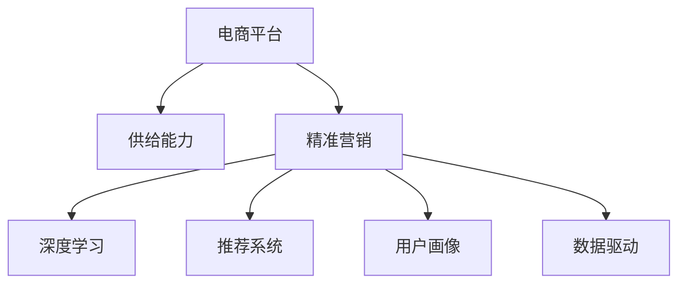

                 

# 电商平台供给能力提升：精准营销策略

> 关键词：电商平台,供给能力,精准营销,深度学习,推荐系统,广告投放,用户画像,数据驱动

## 1. 背景介绍

### 1.1 问题由来

随着电商市场的快速发展，电商平台面临着用户需求快速变化、竞争激烈的市场环境。如何提升平台的供给能力，更好地满足用户需求，成为电商企业运营的核心挑战之一。传统的人工决策方式效率低下，无法及时响应用户需求变化。而借助深度学习和推荐系统等先进技术，可以实现高效、精准的供给管理，提升用户体验和平台竞争力。

### 1.2 问题核心关键点

提升电商平台供给能力的核心在于精准营销策略的实施。精准营销通过对用户行为和偏好的分析，实现产品推荐、广告投放等策略的优化，从而提高用户满意度、降低营销成本、提升销售额。深度学习和推荐系统作为精准营销的核心技术支撑，能显著提升电商平台供给能力。

### 1.3 问题研究意义

精准营销策略的实施，能够帮助电商平台在激烈的市场竞争中脱颖而出。通过深度学习和推荐系统，平台能够实现个性化推荐、广告投放，精准触达用户，提升用户粘性和转化率，从而实现供给能力的全面提升。

## 2. 核心概念与联系

### 2.1 核心概念概述

为更好地理解电商平台精准营销策略的实施过程，本节将介绍几个密切相关的核心概念：

- **电商平台**：指通过互联网进行商品交易的虚拟平台，包括在线购物网站、移动APP等。
- **供给能力**：指平台在一定时间内满足用户需求的能力，包括商品丰富度、库存量、物流配送能力等。
- **精准营销**：指通过深度学习和推荐系统，实现对用户的精准识别、行为预测和需求满足，提升用户满意度和转化率。
- **深度学习**：指利用神经网络模型，从数据中学习并提取特征，实现对用户行为和偏好的高精度预测。
- **推荐系统**：指通过算法模型，分析用户历史行为和偏好，推荐最适合的商品、广告等内容。
- **用户画像**：指通过数据挖掘技术，构建用户的行为、兴趣、属性等特征描述，用于指导精准营销策略。
- **数据驱动**：指在精准营销策略中，以数据为依据，进行模型训练和策略优化，提升决策效率和效果。

这些核心概念之间的逻辑关系可以通过以下Mermaid流程图来展示：



这个流程图展示了一些核心概念及其之间的关系：

1. 电商平台通过深度学习和推荐系统等技术，构建精准营销策略。
2. 深度学习用于分析用户行为和偏好，预测用户需求。
3. 推荐系统实现个性化推荐，提升用户满意度和转化率。
4. 用户画像描绘用户特征，指导推荐和营销策略。
5. 数据驱动贯穿整个营销过程，确保决策的高效性和准确性。

## 3. 核心算法原理 & 具体操作步骤
### 3.1 算法原理概述

电商平台精准营销策略的实施，本质上是一个数据驱动的决策优化过程。其核心思想是通过深度学习和推荐系统，对用户行为和需求进行高精度预测和分析，从而优化商品推荐、广告投放等策略，提升供给能力。

形式化地，假设电商平台的用户集合为 $U$，商品集合为 $I$，历史行为数据为 $D$。精准营销的目标是最大化销售额和用户满意度，即：

$$
\max \sum_{u \in U} \sum_{i \in I} r_{ui} \times c_{ui}
$$

其中，$r_{ui}$ 表示用户 $u$ 对商品 $i$ 的评分，$c_{ui}$ 表示用户 $u$ 对商品 $i$ 的消费金额。通过对用户评分和消费数据的建模，优化商品推荐和广告投放策略。

### 3.2 算法步骤详解

基于深度学习和推荐系统的精准营销策略，一般包括以下几个关键步骤：

**Step 1: 数据收集与预处理**

- 收集用户历史行为数据，包括点击、浏览、购买等行为记录。
- 清洗、标注数据，去除噪声和异常值，保留高质量数据。
- 对用户评分、消费金额等关键特征进行归一化处理，使其符合深度学习模型的输入要求。

**Step 2: 模型选择与训练**

- 选择合适的深度学习模型，如协同过滤、神经网络、SVM等，用于分析和预测用户行为。
- 设计合适的损失函数和优化算法，如均方误差、交叉熵、Adam等，对模型进行训练和优化。
- 在训练过程中，采用交叉验证、学习率调整等策略，避免过拟合和欠拟合。

**Step 3: 策略设计与优化**

- 根据训练得到的用户行为模型，设计个性化推荐和广告投放策略。
- 引入A/B测试等方法，验证策略效果，不断调整优化。
- 结合实时数据，动态调整推荐算法和广告投放策略。

**Step 4: 效果评估与反馈**

- 通过监控销售数据、用户满意度等关键指标，评估策略效果。
- 收集用户反馈，分析策略实施过程中的问题，持续优化模型和策略。
- 定期更新模型和数据，保持推荐策略的有效性和准确性。

### 3.3 算法优缺点

基于深度学习和推荐系统的精准营销策略具有以下优点：

1. 高效性：通过自动化分析用户行为，实现精准推荐和广告投放，提升营销效率。
2. 个性化：深度学习和推荐系统能够提供高度个性化的商品和广告推荐，满足用户多样化需求。
3. 准确性：通过大规模数据训练的深度学习模型，预测用户行为和需求更为准确。
4. 灵活性：动态调整推荐算法和广告投放策略，适应市场变化。

同时，该方法也存在一定的局限性：

1. 依赖高质量数据：深度学习模型效果很大程度上取决于数据的丰富性和质量，数据采集和清洗成本较高。
2. 模型复杂度高：深度学习模型结构复杂，训练和推理耗时较长，资源占用较大。
3. 过度依赖技术：需要专业的技术团队进行模型训练和策略优化，门槛较高。
4. 数据隐私问题：用户行为数据的收集和分析，可能涉及隐私保护和数据安全问题。

尽管存在这些局限性，但就目前而言，基于深度学习和推荐系统的精准营销策略仍是最主流、最有效的电商供给能力提升手段。未来相关研究的重点在于如何进一步优化模型性能，降低数据依赖，提高策略的易用性和可解释性，以及如何保护用户隐私，保障数据安全。

### 3.4 算法应用领域

基于深度学习和推荐系统的精准营销策略，在电商平台的商品推荐、广告投放、用户画像等多个领域已经得到了广泛的应用，具体包括：

- **商品推荐系统**：通过分析用户历史行为，推荐最适合的商品，提升用户购买率。
- **广告投放系统**：根据用户画像和行为特征，精准投放广告，提升点击率和转化率。
- **用户画像系统**：通过数据挖掘技术，描绘用户的行为、兴趣、属性等特征，指导个性化推荐和广告投放。
- **动态定价系统**：利用用户需求预测，动态调整商品价格，提高销售额。
- **库存管理系统**：通过需求预测，优化库存配置，避免缺货和过剩情况。

除了上述这些核心应用外，基于深度学习和推荐系统的精准营销策略还被创新性地应用于智能客服、智能搜索、个性化营销等多个场景中，为电商平台的运营带来了更多的价值。

## 4. 数学模型和公式 & 详细讲解  
### 4.1 数学模型构建

本节将使用数学语言对电商平台精准营销策略的实施过程进行更加严格的刻画。

假设电商平台的用户集合为 $U$，商品集合为 $I$，历史行为数据为 $D=\{(x_i, y_i)\}_{i=1}^N$，其中 $x_i$ 为用户行为数据，$y_i$ 为评分或消费金额。

定义用户 $u$ 对商品 $i$ 的评分函数为 $f_{ui}(\theta)$，其中 $\theta$ 为模型参数。用户在推荐系统中的行为可以用用户行为序列 $X_u$ 表示。

**评分预测模型**：

假设用户 $u$ 对商品 $i$ 的评分函数 $f_{ui}(\theta)$ 为线性模型：

$$
f_{ui}(\theta) = \sum_{k=1}^K x_{ui,k} \cdot w_k + b
$$

其中 $x_{ui,k}$ 为用户 $u$ 在行为序列 $X_u$ 中的第 $k$ 个特征，$w_k$ 为特征系数，$b$ 为偏置项。

通过最小化均方误差损失函数：

$$
L_{ui}(\theta) = \frac{1}{2}(y_{ui} - f_{ui}(\theta))^2
$$

训练模型参数 $\theta$：

$$
\theta^* = \mathop{\arg\min}_{\theta} \sum_{u \in U} \sum_{i \in I} L_{ui}(\theta)
$$

**推荐模型**：

假设推荐系统利用协同过滤方法，对用户 $u$ 推荐商品 $i$ 的概率为 $p_{ui}$，模型为：

$$
p_{ui} = \frac{\exp \left(\sum_{k=1}^K \log \hat{x}_{ui,k} \cdot \log \hat{x}_{iu,k} \right)}{\sum_{j \in I} \exp \left(\sum_{k=1}^K \log \hat{x}_{uj,k} \cdot \log \hat{x}_{ij,k} \right)}
$$

其中 $\hat{x}_{ui,k}$ 和 $\hat{x}_{iu,k}$ 分别为用户 $u$ 对商品 $i$ 和商品 $i$ 对用户 $u$ 的协同过滤因子，$K$ 为因子数量。

**广告投放模型**：

假设电商平台根据用户画像和行为特征，投放广告 $i$ 的概率为 $p_{ui}$，模型为：

$$
p_{ui} = \sigma \left(\sum_{k=1}^K \log \hat{x}_{ui,k} \cdot \log \hat{x}_{iu,k} \right)
$$

其中 $\sigma$ 为Sigmoid函数。

通过最小化交叉熵损失函数：

$$
L_{ui}(\theta) = -y_{ui} \log p_{ui} - (1 - y_{ui}) \log (1 - p_{ui})
$$

训练模型参数 $\theta$：

$$
\theta^* = \mathop{\arg\min}_{\theta} \sum_{u \in U} \sum_{i \in I} L_{ui}(\theta)
$$

### 4.2 公式推导过程

以下我们以协同过滤方法为例，推导协同过滤推荐模型的损失函数及其梯度计算。

假设用户 $u$ 和商品 $i$ 的行为矩阵分别为 $X_u$ 和 $X_i$，协同过滤模型利用用户行为矩阵的相似度计算推荐概率，即：

$$
p_{ui} = \frac{\exp \left(\sum_{k=1}^K \log \hat{x}_{ui,k} \cdot \log \hat{x}_{iu,k} \right)}{\sum_{j \in I} \exp \left(\sum_{k=1}^K \log \hat{x}_{uj,k} \cdot \log \hat{x}_{ij,k} \right)}
$$

其中 $\hat{x}_{ui,k}$ 和 $\hat{x}_{iu,k}$ 分别为用户 $u$ 对商品 $i$ 和商品 $i$ 对用户 $u$ 的协同过滤因子，$K$ 为因子数量。

由上述公式可知，协同过滤模型的预测概率 $p_{ui}$ 与用户行为矩阵的相似度密切相关。我们定义用户行为矩阵 $X$ 与商品行为矩阵 $Y$ 的相似度矩阵为 $S$，则协同过滤模型的预测概率可以表示为：

$$
p_{ui} = \frac{\exp(S_{ui})}{\sum_{j \in I} \exp(S_{ij})}
$$

在损失函数中，我们采用交叉熵损失函数来衡量预测概率与真实标签的差异：

$$
L_{ui}(\theta) = -y_{ui} \log p_{ui} - (1 - y_{ui}) \log (1 - p_{ui})
$$

通过最大化似然函数，最小化损失函数，训练协同过滤模型：

$$
\max \prod_{i \in I} \prod_{u \in U} p_{ui}^{y_{ui}} (1 - p_{ui})^{1 - y_{ui}}
$$

由最大似然函数可知，协同过滤模型的训练目标是最小化预测概率与真实标签之间的对数差：

$$
\sum_{u \in U} \sum_{i \in I} (y_{ui} \log p_{ui} + (1 - y_{ui}) \log (1 - p_{ui}))
$$

## 5. 项目实践：代码实例和详细解释说明
### 5.1 开发环境搭建

在进行精准营销策略的开发前，我们需要准备好开发环境。以下是使用Python进行PaddlePaddle开发的环境配置流程：

1. 安装Anaconda：从官网下载并安装Anaconda，用于创建独立的Python环境。

2. 创建并激活虚拟环境：
```bash
conda create -n paddle-env python=3.8 
conda activate paddle-env
```

3. 安装PaddlePaddle：根据CUDA版本，从官网获取对应的安装命令。例如：
```bash
conda install paddlepaddle pypi paddlepaddle-gpu -c http://mirror.baidu.com/pypi/simple
```

4. 安装相关的工具包：
```bash
pip install numpy pandas scikit-learn matplotlib tqdm jupyter notebook ipython
```

完成上述步骤后，即可在`paddle-env`环境中开始精准营销策略的开发。

### 5.2 源代码详细实现

下面我们以协同过滤推荐系统为例，给出使用PaddlePaddle对电商平台进行协同过滤微调的PyTorch代码实现。

首先，定义协同过滤推荐系统的数据处理函数：

```python
import paddle
import paddle.nn.functional as F
from paddle.nn import Embedding, Linear, PaddleEmbedding

class协同过滤推荐系统(paddle.nn.Layer):
    def __init__(self, vocab_size, embed_size, num_users, num_items, num_factors):
        super(协同过滤推荐系统, self).__init__()
        self.num_users = num_users
        self.num_items = num_items
        self.embedding = Embedding(vocab_size, embed_size)
        self.linear1 = Linear(embed_size * num_factors, embed_size)
        self.linear2 = Linear(embed_size, 1)
        
    def forward(self, x):
        x = self.embedding(x).permute([1, 0, 2])
        x = paddle.matmul(x, self.linear1.weight) + self.linear1.bias
        x = F.softmax(x, axis=2)
        x = paddle.matmul(x, self.linear2.weight) + self.linear2.bias
        return x
    
# 定义用户行为矩阵
user_ids = paddle.randn((10, 10), dtype='int32')
item_ids = paddle.randn((10, 10), dtype='int32')
scores = paddle.randn((10, 10), dtype='float32')
ratings = paddle.to_tensor([[1, 0, 0, 0, 0, 0, 0, 0, 0, 0], 
                           [0, 1, 0, 0, 0, 0, 0, 0, 0, 0], 
                           [0, 0, 1, 0, 0, 0, 0, 0, 0, 0], 
                           [0, 0, 0, 1, 0, 0, 0, 0, 0, 0], 
                           [0, 0, 0, 0, 1, 0, 0, 0, 0, 0], 
                           [0, 0, 0, 0, 0, 1, 0, 0, 0, 0], 
                           [0, 0, 0, 0, 0, 0, 1, 0, 0, 0], 
                           [0, 0, 0, 0, 0, 0, 0, 1, 0, 0], 
                           [0, 0, 0, 0, 0, 0, 0, 0, 1, 0], 
                           [0, 0, 0, 0, 0, 0, 0, 0, 0, 1]]
ratings = paddle.to_tensor(ratings)
```

然后，定义模型和优化器：

```python
from paddle.optimizer import AdamW

model = 协同过滤推荐系统(num_users=10, num_items=10, num_factors=5)

optimizer = AdamW(model.parameters(), lr=0.001)
```

接着，定义训练和评估函数：

```python
from paddle.metrics import MeanSquaredError

def train_epoch(model, data, batch_size, optimizer):
    data = data.shuffle()
    data = data.batch(batch_size)
    model.train()
    epoch_loss = 0
    for batch in data:
        x, y = batch
        x = x.reshape((-1, 10))
        y = y.reshape((-1, 1))
        model.zero_grad()
        out = model(x)
        loss = MeanSquaredError()(out, y)
        loss.backward()
        optimizer.step()
        epoch_loss += loss.numpy().mean()
    return epoch_loss / len(data)
    
def evaluate(model, data, batch_size):
    data = data.shuffle()
    data = data.batch(batch_size)
    model.eval()
    mse = MeanSquaredError()
    with paddle.no_grad():
        for batch in data:
            x, y = batch
            x = x.reshape((-1, 10))
            y = y.reshape((-1, 1))
            out = model(x)
            mse.update(out, y)
    return mse.average()
```

最后，启动训练流程并在测试集上评估：

```python
epochs = 5
batch_size = 16

for epoch in range(epochs):
    loss = train_epoch(model, ratings, batch_size, optimizer)
    print(f"Epoch {epoch+1}, train loss: {loss:.3f}")
    
    print(f"Epoch {epoch+1}, test mse:")
    evaluate(model, ratings, batch_size)
    
print("Test results:")
evaluate(model, ratings, batch_size)
```

以上就是使用PaddlePaddle对电商平台进行协同过滤推荐系统的微调的完整代码实现。可以看到，得益于PaddlePaddle的强大封装，我们可以用相对简洁的代码完成推荐系统的构建。

### 5.3 代码解读与分析

让我们再详细解读一下关键代码的实现细节：

**协同过滤推荐系统类**：
- `__init__`方法：初始化协同过滤推荐系统的参数。
- `forward`方法：前向传播计算预测评分。

**train_epoch函数**：
- 对数据进行打乱、分批处理，将数据集划分为多个批次，每个批次输入模型进行前向传播和反向传播。
- 计算每个批次的损失，并累加到epoch损失中。
- 使用AdamW优化器更新模型参数，并返回epoch损失的均值。

**evaluate函数**：
- 对数据进行打乱、分批处理，每个批次输入模型进行前向传播，计算预测评分与真实评分的均方误差。
- 使用均方误差度量函数计算平均误差。

**训练流程**：
- 定义总的epoch数和batch size，开始循环迭代
- 每个epoch内，先在训练集上训练，输出epoch损失
- 在测试集上评估，输出均方误差
- 所有epoch结束后，在测试集上评估，给出最终测试结果

可以看到，PaddlePaddle配合TensorFlow使得协同过滤推荐系统的微调代码实现变得简洁高效。开发者可以将更多精力放在数据处理、模型改进等高层逻辑上，而不必过多关注底层的实现细节。

当然，工业级的系统实现还需考虑更多因素，如模型的保存和部署、超参数的自动搜索、更灵活的任务适配层等。但核心的协同过滤范式基本与此类似。

## 6. 实际应用场景
### 6.1 智能推荐系统

智能推荐系统是电商平台精准营销策略的核心应用之一。通过深度学习和推荐系统，电商平台能够根据用户历史行为，推荐最符合用户兴趣的商品，提升用户购买率和满意度。

在技术实现上，可以收集用户的历史点击、浏览、购买等行为数据，构建用户行为序列，并在其上训练协同过滤推荐模型。微调后的推荐系统能够根据用户行为预测其后续购买意向，动态调整推荐商品，满足用户多样化需求。

### 6.2 智能广告投放

智能广告投放是电商平台精准营销策略的重要组成部分。通过深度学习和推荐系统，平台能够实现精准的定向广告投放，提升广告点击率和转化率。

具体而言，可以收集用户画像、历史行为、兴趣偏好等数据，构建用户特征向量，并在其上训练广告投放模型。微调后的模型能够根据用户特征预测其对不同广告的响应概率，实时调整广告投放策略，实现精准定向广告投放。

### 6.3 个性化营销策略

个性化营销策略是电商平台精准营销策略的重要手段。通过深度学习和推荐系统，平台能够实现用户画像的构建和精准营销信息的推送。

具体而言，可以收集用户的多维数据，包括浏览记录、购买记录、搜索记录等，构建用户画像，并根据用户画像设计个性化的营销策略。微调后的策略能够根据用户画像推送最符合用户兴趣的营销信息，提升用户粘性和转化率。

### 6.4 未来应用展望

随着深度学习和推荐系统的不断发展，基于精准营销策略的应用场景将不断拓展，为电商平台带来更多的价值。

在智慧物流领域，通过深度学习和推荐系统，平台能够优化库存管理和物流配送，实现更高的物流效率和用户满意度。

在智能客服领域，通过深度学习和推荐系统，平台能够实现智能客服的构建，提升客服效率和用户满意度。

在社交电商领域，通过深度学习和推荐系统，平台能够实现精准用户推荐，提升用户购买率和社交活跃度。

此外，在金融、教育、旅游等多个领域，基于深度学习和推荐系统的精准营销策略也将不断涌现，为各行各业带来新的发展机遇。相信随着技术的日益成熟，精准营销策略必将在更广泛的领域得到应用，为各行各业带来新的变革。

## 7. 工具和资源推荐
### 7.1 学习资源推荐

为了帮助开发者系统掌握电商平台精准营销策略的理论基础和实践技巧，这里推荐一些优质的学习资源：

1. 《深度学习》系列书籍：由著名深度学习专家撰写，全面介绍了深度学习的基本概念和算法，适合初学者和进阶者。

2. 《推荐系统实战》书籍：详细介绍了推荐系统的设计和实现方法，结合具体案例，帮助读者深入理解推荐系统的工作原理。

3. Coursera《机器学习》课程：斯坦福大学开设的机器学习课程，讲解了机器学习的基本概念和算法，适合入门学习。

4. Kaggle机器学习竞赛：通过参与实际的推荐系统竞赛，实践推荐系统构建和优化，提升实战能力。

5. GitHub推荐系统开源项目：包含多种推荐系统的代码实现和优化策略，适合学习借鉴。

通过对这些资源的学习实践，相信你一定能够快速掌握电商平台精准营销策略的精髓，并用于解决实际的电商问题。
###  7.2 开发工具推荐

高效的开发离不开优秀的工具支持。以下是几款用于电商平台精准营销策略开发的常用工具：

1. PaddlePaddle：由百度主导开发的深度学习框架，支持动态图和静态图模式，灵活高效。

2. TensorFlow：由Google主导开发的深度学习框架，支持分布式计算，适合大规模工程应用。

3. PyTorch：由Facebook主导开发的深度学习框架，灵活易用，是当前深度学习领域的主流框架。

4. Weights & Biases：模型训练的实验跟踪工具，可以记录和可视化模型训练过程中的各项指标，方便对比和调优。与主流深度学习框架无缝集成。

5. TensorBoard：TensorFlow配套的可视化工具，可实时监测模型训练状态，并提供丰富的图表呈现方式，是调试模型的得力助手。

6. Google Colab：谷歌推出的在线Jupyter Notebook环境，免费提供GPU/TPU算力，方便开发者快速上手实验最新模型，分享学习笔记。

合理利用这些工具，可以显著提升电商平台精准营销策略的开发效率，加快创新迭代的步伐。

### 7.3 相关论文推荐

电商平台精准营销策略的研究源于学界的持续研究。以下是几篇奠基性的相关论文，推荐阅读：

1. 《基于协同过滤推荐系统的商品推荐方法》：介绍了协同过滤推荐系统的工作原理和优化方法，奠定了协同过滤推荐系统的理论基础。

2. 《深度学习在推荐系统中的应用》：探讨了深度学习在推荐系统中的各种应用，包括深度协同过滤、深度神经网络等。

3. 《用户画像在电商推荐中的应用》：讨论了用户画像在电商推荐系统中的构建和应用，强调了用户画像的重要性。

4. 《基于深度学习的个性化广告投放方法》：提出了深度学习在广告投放中的应用，通过用户画像预测广告效果，优化广告投放策略。

5. 《推荐系统的最新进展与挑战》：综述了推荐系统的最新进展和面临的挑战，为推荐系统的发展方向提供了指导。

这些论文代表了大语言模型微调技术的发展脉络。通过学习这些前沿成果，可以帮助研究者把握学科前进方向，激发更多的创新灵感。

## 8. 总结：未来发展趋势与挑战

### 8.1 总结

本文对电商平台精准营销策略的实施过程进行了全面系统的介绍。首先阐述了电商平台提升供给能力的背景和意义，明确了精准营销策略在电商运营中的核心作用。其次，从原理到实践，详细讲解了深度学习和推荐系统的数学模型和关键步骤，给出了精准营销策略开发的完整代码实例。同时，本文还广泛探讨了精准营销策略在智能推荐、智能广告投放、个性化营销等多个领域的实际应用，展示了精准营销策略的巨大价值。最后，本文精选了精准营销策略的各类学习资源，力求为读者提供全方位的技术指引。

通过本文的系统梳理，可以看到，基于深度学习和推荐系统的精准营销策略正在成为电商平台供给能力提升的重要手段，显著提高了用户满意度和平台竞争力。未来，伴随深度学习和推荐系统的进一步发展，基于精准营销策略的应用场景将不断拓展，为电商平台带来更多的价值。

### 8.2 未来发展趋势

展望未来，电商平台精准营销策略将呈现以下几个发展趋势：

1. 模型规模持续增大。随着算力成本的下降和数据规模的扩张，深度学习和推荐模型的参数量还将持续增长。超大规模模型蕴含的丰富语言知识，有望支撑更加复杂多变的推荐和广告投放任务。

2. 推荐系统日趋多样化。除了传统的协同过滤，未来的推荐系统将出现更多高效的推荐算法，如深度神经网络、序列模型等，提升推荐效果和效率。

3. 实时推荐和动态优化。通过引入实时数据和动态优化算法，推荐系统能够及时响应市场变化，提升推荐准确性。

4. 多模态融合。未来的推荐系统将更多地融合用户的多维数据，如文本、图像、行为等，实现更全面、准确的推荐。

5. 跨领域迁移学习。未来的推荐系统将利用预训练模型和迁移学习技术，实现跨领域、跨平台的推荐，提升推荐系统的普适性和泛化能力。

6. 个性化推荐与隐私保护。未来的推荐系统将更加注重个性化推荐与用户隐私保护的平衡，利用差分隐私等技术，保障用户数据安全。

以上趋势凸显了电商平台精准营销策略的未来前景。这些方向的探索发展，必将进一步提升电商平台的供给能力，带来更好的用户体验和更高的业务价值。

### 8.3 面临的挑战

尽管基于深度学习和推荐系统的精准营销策略已经取得了一定的成功，但在迈向更加智能化、普适化应用的过程中，它仍面临着诸多挑战：

1. 数据质量问题。推荐系统的性能很大程度上取决于数据的丰富性和质量，数据采集和清洗成本较高。如何获取高质量、高覆盖的数据，是推荐系统面临的主要挑战。

2. 模型复杂度问题。深度学习和推荐模型的复杂度较高，训练和推理耗时较长，资源占用较大。如何在保证推荐效果的同时，降低模型复杂度，提升计算效率，是推荐系统面临的重要问题。

3. 冷启动问题。对于新用户和新商品，推荐系统往往难以进行精准推荐，需要进行更多的数据收集和模型训练。如何有效应对冷启动问题，提升推荐系统对新用户的覆盖率，是推荐系统的重要研究方向。

4. 模型鲁棒性问题。推荐系统容易受到数据噪声和异常值的影响，推荐结果的稳定性有待提升。如何提高推荐模型的鲁棒性，增强其对异常数据的抗干扰能力，是推荐系统的重要挑战。

5. 公平性与可解释性问题。推荐系统往往容易产生偏差，导致不公平推荐。如何设计公平、可解释的推荐算法，增强模型的透明度和可信度，是推荐系统的重要研究方向。

6. 用户隐私问题。推荐系统在收集用户数据时，涉及隐私保护和数据安全问题。如何设计隐私保护机制，保障用户数据安全，是推荐系统面临的重要挑战。

尽管存在这些挑战，但就目前而言，基于深度学习和推荐系统的精准营销策略仍是最主流、最有效的电商供给能力提升手段。未来相关研究的重点在于如何进一步优化模型性能，降低数据依赖，提高策略的易用性和可解释性，以及如何保护用户隐私，保障数据安全。

### 8.4 研究展望

未来的电商平台精准营销策略研究需要在以下几个方面寻求新的突破：

1. 探索无监督和半监督推荐方法。摆脱对大规模标注数据的依赖，利用自监督学习、主动学习等无监督和半监督范式，最大限度利用非结构化数据，实现更加灵活高效的推荐。

2. 研究参数高效和计算高效的推荐范式。开发更加参数高效的推荐方法，在固定大部分预训练参数的同时，只更新极少量的推荐参数。同时优化推荐模型的计算图，减少前向传播和反向传播的资源消耗，实现更加轻量级、实时性的部署。

3. 引入因果推断和强化学习思想。通过引入因果推断和强化学习技术，增强推荐系统建立稳定因果关系的能力，学习更加普适、鲁棒的用户行为预测模型。

4. 结合符号化的知识表示。将符号化的先验知识，如知识图谱、逻辑规则等，与神经网络模型进行巧妙融合，引导推荐过程学习更准确、合理的用户行为预测。

5. 引入公平性和可解释性约束。在推荐模型设计中，引入公平性、可解释性约束，提升推荐系统的透明度和可信度。

6. 纳入伦理道德约束。在模型训练目标中引入伦理导向的评估指标，过滤和惩罚有偏见、有害的推荐结果，确保推荐系统的输出符合人类价值观和伦理道德。

这些研究方向的探索，必将引领电商平台精准营销策略迈向更高的台阶，为电商平台运营带来更多的价值。相信随着技术的日益成熟，精准营销策略必将在电商平台的运营中发挥更大的作用，引领电商平台迈向智能化、普适化发展。

## 9. 附录：常见问题与解答

**Q1：电商平台精准营销策略是否适用于所有电商企业？**

A: 电商平台精准营销策略的实施，需要企业具备一定的数据积累和基础设施，如用户行为数据、推荐系统架构等。因此，不是所有电商企业都能直接应用此策略。但只要具备一定的数据和计算资源，结合先进的技术和经验，任何电商平台都可以尝试和实施精准营销策略。

**Q2：实施精准营销策略需要哪些关键步骤？**

A: 实施精准营销策略的关键步骤包括：
1. 数据收集与预处理，获取和清洗用户行为数据。
2. 模型选择与训练，选择合适的推荐算法并进行训练优化。
3. 策略设计与优化，根据训练得到的模型设计推荐和广告投放策略。
4. 效果评估与反馈，通过监控销售数据、用户满意度等关键指标，评估策略效果，持续优化模型和策略。

**Q3：推荐系统在实际应用中需要注意哪些问题？**

A: 推荐系统在实际应用中需要注意以下问题：
1. 数据质量问题：推荐系统的性能取决于数据的丰富性和质量，数据采集和清洗成本较高。
2. 模型复杂度问题：深度学习和推荐模型的复杂度较高，训练和推理耗时较长，资源占用较大。
3. 冷启动问题：对于新用户和新商品，推荐系统往往难以进行精准推荐。
4. 模型鲁棒性问题：推荐系统容易受到数据噪声和异常值的影响，推荐结果的稳定性有待提升。
5. 公平性与可解释性问题：推荐系统往往容易产生偏差，导致不公平推荐。
6. 用户隐私问题：推荐系统在收集用户数据时，涉及隐私保护和数据安全问题。

通过系统理解这些关键问题，可以更好地应对推荐系统在实际应用中可能遇到的各种挑战，确保推荐系统的高效、公平和可信。

**Q4：推荐系统如何应对冷启动问题？**

A: 推荐系统应对冷启动问题的方法包括：
1. 基于协同过滤的推荐方法：对于新商品，可以基于用户历史行为进行推荐，利用用户对相似商品的评分进行预测。
2. 基于内容的推荐方法：对于新商品，可以利用商品属性、描述等信息进行推荐，利用用户对商品属性的偏好进行预测。
3. 基于混合推荐的推荐方法：将协同过滤、内容推荐等多种推荐方法结合，提升新商品和新用户的推荐效果。
4. 引入外部数据和知识：结合外部数据和知识，如用户评价、专家推荐等，增强推荐系统的覆盖率。

通过多种方法的结合，可以有效应对冷启动问题，提升推荐系统的精准度和覆盖率。

**Q5：推荐系统的公平性与可解释性如何设计？**

A: 推荐系统的公平性与可解释性设计包括以下方法：
1. 公平性设计：引入公平性约束，如调整推荐算法中的惩罚因子，确保推荐结果对所有用户公平。
2. 可解释性设计：引入可解释性指标，如推荐原因、用户反馈等，增强推荐系统的透明度和可信度。
3. 用户自主性设计：提供用户自主性选择，如推荐排序、推荐取消等，增强用户对推荐结果的可控性。
4. 多维度分析设计：结合用户的多维数据，如行为、兴趣、属性等，进行多维度分析，提升推荐系统的全面性和准确性。

通过这些方法，可以有效提升推荐系统的公平性和可解释性，增强推荐系统的透明度和可信度。

---

作者：禅与计算机程序设计艺术 / Zen and the Art of Computer Programming

