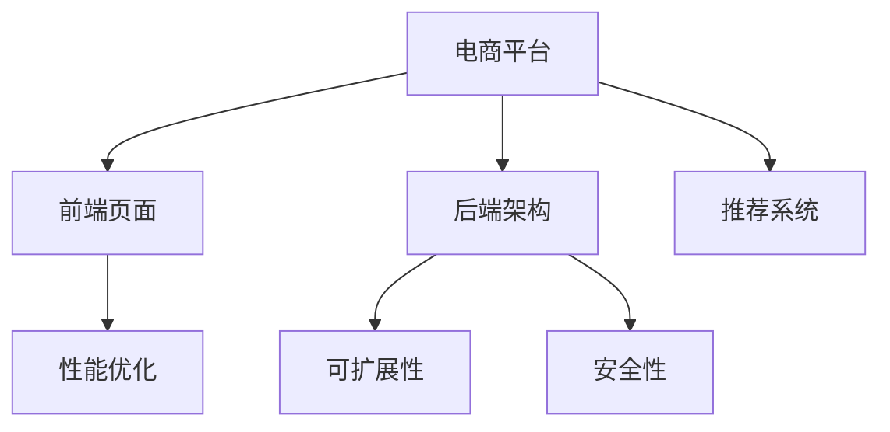

                 

# 电商平台供给能力提升：网站和APP的优化

> 关键词：电商平台, 供给能力提升, 网站优化, APP优化, 用户体验, 技术栈, 性能优化, 推荐系统

## 1. 背景介绍

### 1.1 问题由来

随着电商市场的蓬勃发展，电商平台已从简单的商品展示和交易功能演变成复杂的交互平台。用户不仅要求商品种类丰富、价格合理，还期待购前信息全面、购中体验流畅、购后服务优质。然而，当前的电商平台在供给能力、用户体验和运营效率方面仍存在诸多问题：

- **供给能力不足**：库存管理不精确，造成缺货、断货现象频发。
- **用户体验不佳**：网站页面加载缓慢，APP响应迟钝，操作流程复杂，影响用户满意度。
- **运营效率低下**：推荐算法不够精准，导致商品展示效果不佳，流失了大量潜在客户。

这些问题不仅降低了用户的购物体验，还限制了电商平台的竞争力和盈利能力。因此，亟需通过技术手段，提升电商平台的供给能力和运营效率，改善用户体验。

### 1.2 问题核心关键点

电商平台的优化主要涉及以下几个关键点：

- **前端页面优化**：提升网站和APP的页面加载速度、响应时间，优化用户体验。
- **后端架构设计**：设计高效、可扩展的架构，提升供给能力，支持海量交易。
- **推荐系统优化**：通过机器学习算法，精准推荐商品，提高转化率，增加营收。

本文将聚焦于提升电商平台的供给能力，通过优化前端页面和后端架构，以及优化推荐系统，提升用户体验和运营效率，推动电商平台的健康发展。

## 2. 核心概念与联系

### 2.1 核心概念概述

为更好地理解电商平台优化的方法，本节将介绍几个密切相关的核心概念：

- **电商平台(E-commerce Platform)**：提供商品展示、交易、评价、社区互动等功能的综合性在线平台。
- **前端页面(Front-end Page)**：用户与电商平台交互的前端界面，包括网站和APP。
- **后端架构(Back-end Architecture)**：支持电商平台业务逻辑的后端系统，包括数据库、缓存、消息队列、计算资源等。
- **推荐系统(Recommendation System)**：通过机器学习算法，预测用户行为，推荐商品和服务，提升用户体验。
- **性能优化(Performance Optimization)**：通过技术手段，提升系统响应速度、减少延迟，增强用户体验。
- **可扩展性(Scalability)**：设计能够应对业务增长和流量激增的系统架构，保证系统稳定性。
- **安全性(Security)**：保障用户数据和交易的安全，防止信息泄露和欺诈行为。

这些核心概念之间的逻辑关系可以通过以下Mermaid流程图来展示：



这个流程图展示了大电商平台的核心组件及其相互关系：

1. 电商平台通过前端页面和后端架构实现功能，提供商品展示、交易、评价等服务。
2. 推荐系统通过机器学习算法，预测用户行为，提升用户满意度和转化率。
3. 性能优化、可扩展性和安全性分别对应前端页面、后端架构和推荐系统的优化需求。

这些核心概念共同构成了电商平台的业务和技术体系，对其优化策略的选择和实施具有重要指导意义。

## 3. 核心算法原理 & 具体操作步骤
### 3.1 算法原理概述

电商平台的优化，本质上是通过优化前端页面、后端架构和推荐系统，提升用户体验和运营效率。

具体来说，前端页面优化主要通过提升页面加载速度、减少延迟、优化交互体验等方式，提升用户满意度。后端架构优化则涉及设计高效、可扩展的系统架构，支持海量交易和高并发需求。推荐系统优化则需要通过机器学习算法，精准预测用户行为，提高商品推荐的准确性。

这些优化措施的实施，依赖于深入理解电商平台的核心业务流程，分析性能瓶颈，采用科学的技术手段。本文将详细介绍这些核心算法原理和操作步骤。

### 3.2 算法步骤详解

#### 3.2.1 前端页面优化

**步骤1: 性能瓶颈分析**
- 使用工具如PageSpeed Insights、Lighthouse等，分析页面加载时间、资源大小、依赖关系等，找出性能瓶颈。
- 重点关注图片、CSS、JS文件的大小和数量，优化加载顺序和缓存策略。

**步骤2: 前端优化措施**
- **图片优化**：使用现代图片格式（如WebP），压缩图片大小，懒加载非关键资源，减少页面重载。
- **CSS和JS优化**：合并压缩CSS和JS文件，使用异步加载技术，减少页面渲染时间。
- **缓存策略**：合理利用浏览器缓存、CDN加速，减少重复请求和数据传输。

**步骤3: 测试与评估**
- 在测试环境中部署优化后的前端页面，使用性能测试工具（如WebPageTest、GTmetrix）进行性能评估。
- 根据测试结果，进一步优化页面性能，直到达到预期目标。

#### 3.2.2 后端架构优化

**步骤1: 架构设计**
- 设计分层架构，将电商平台的业务逻辑分解为前端、中间件、数据库等层次。
- 引入消息队列（如Kafka、RabbitMQ），异步处理订单、库存等关键业务。

**步骤2: 关键技术选型**
- 选择高性能的数据库（如MySQL、PostgreSQL）和缓存系统（如Redis、Memcached）。
- 采用微服务架构，提高系统的可扩展性和容错性。

**步骤3: 性能优化**
- 优化数据库查询，使用索引、分片、缓存等技术，减少数据库压力。
- 使用负载均衡、水平扩展等策略，应对高并发流量。

**步骤4: 测试与评估**
- 在负载测试环境中模拟真实流量，评估系统的响应时间、吞吐量等指标。
- 根据测试结果，进一步优化架构设计和技术选型，直到满足业务需求。

#### 3.2.3 推荐系统优化

**步骤1: 数据准备**
- 收集用户行为数据（如浏览、点击、购买等），分析用户兴趣和偏好。
- 整合商品信息（如价格、分类、评价等），构建商品特征库。

**步骤2: 算法选择**
- 选择适合的推荐算法，如协同过滤、基于内容的推荐、深度学习等。
- 使用开源推荐引擎（如TensorFlow Serving、Recommenders），实现个性化推荐。

**步骤3: 模型训练与评估**
- 训练推荐模型，使用交叉验证等技术评估模型性能。
- 持续优化推荐模型，提升推荐准确性和多样性。

**步骤4: 测试与评估**
- 在推荐系统中部署训练好的模型，实时推荐商品给用户。
- 根据用户反馈和推荐效果，进一步优化算法和模型参数，提升用户满意度和转化率。

### 3.3 算法优缺点

电商平台的优化方法具有以下优点：

1. **提高用户体验**：通过优化前端页面和后端架构，提升系统响应速度和稳定性，使用户体验更加流畅、便捷。
2. **提升运营效率**：通过优化推荐系统，精准推荐商品，提高用户转化率和满意度，增加平台营收。
3. **技术可扩展性强**：通过设计可扩展的系统架构，支持业务增长和流量激增，保障系统稳定性。
4. **安全性保障**：通过优化安全性设计，保障用户数据和交易的安全，防止信息泄露和欺诈行为。

然而，这些优化措施也存在一些局限性：

1. **实施复杂度较高**：前端页面和后端架构的优化，需要深入分析性能瓶颈，选择合适技术手段，实施过程较为复杂。
2. **资源投入较大**：高性能的数据库、缓存系统、推荐引擎等，需要较高的硬件和软件投入。
3. **效果难以量化**：前端页面和后端架构的优化效果，往往需要用户反馈和业务数据才能评估，难以直接量化。
4. **推荐算法局限性**：推荐系统依赖于数据质量和算法模型，需要持续优化才能达到理想效果。

尽管存在这些局限性，但通过合理的规划和实施，电商平台可以显著提升供给能力和运营效率，提高用户满意度和平台竞争力。

### 3.4 算法应用领域

电商平台的优化方法在多个领域得到了广泛应用：

- **电商平台供给能力提升**：通过优化前端页面和后端架构，提升系统性能，支持海量交易和高并发需求。
- **个性化推荐系统**：通过机器学习算法，精准推荐商品，提升用户满意度和转化率。
- **用户体验优化**：通过优化页面加载速度、减少延迟、优化交互体验等方式，提升用户满意度。
- **运营效率提升**：通过优化推荐系统，提高商品展示效果，减少流失客户，增加营收。

这些优化措施的应用，极大地提升了电商平台的供给能力和运营效率，为电商平台的健康发展提供了有力支撑。

## 4. 数学模型和公式 & 详细讲解  
### 4.1 数学模型构建

本文将使用数学语言对电商平台的优化方法进行更加严格的刻画。

设电商平台为 $E$，包含前端页面 $F$、后端架构 $B$ 和推荐系统 $R$。

假设用户在平台上的行为可以用以下函数表示：

$$
P(u) = f(F(u), B(u), R(u))
$$

其中 $u$ 表示用户，$F(u)$ 为前端页面展示的推荐内容，$B(u)$ 为后端架构提供的服务，$R(u)$ 为推荐系统推荐的商品。

优化目标为最大化用户满意度和转化率，即：

$$
\max_{F, B, R} \mathbb{E}[P(u)]
$$

其中 $\mathbb{E}[\cdot]$ 表示对所有用户 $u$ 的期望。

### 4.2 公式推导过程

以推荐系统为例，推导基于协同过滤的推荐算法。

设用户 $u$ 对商品 $i$ 的评分向量为 $r(u,i) \in \mathbb{R}^n$，商品 $i$ 的特征向量为 $p(i) \in \mathbb{R}^n$。则协同过滤算法中的用户-商品相似度矩阵 $S$ 可以表示为：

$$
S_{u,i} = \frac{\langle r(u,i), p(i) \rangle}{\|r(u,i)\| \|p(i)\|}
$$

其中 $\langle \cdot, \cdot \rangle$ 表示向量的点积，$\|\cdot\|$ 表示向量的模长。

基于相似度矩阵，推荐系统可以计算用户 $u$ 对商品 $i$ 的推荐分数：

$$
\hat{y}_{u,i} = \sum_{j \in \mathcal{N}(u)} S_{u,j} x_{j,i}
$$

其中 $\mathcal{N}(u)$ 表示与用户 $u$ 相似的商品，$x_{j,i}$ 表示商品 $i$ 的评分向量。

推荐分数 $\hat{y}_{u,i}$ 可以用来排序推荐结果，选择排名靠前的商品展示给用户。

### 4.3 案例分析与讲解

以淘宝平台的商品推荐系统为例，介绍推荐算法的具体实现。

淘宝平台使用基于协同过滤的推荐算法，通过用户行为数据（如浏览、点击、购买等）和商品特征（如价格、分类、评价等），预测用户对商品的评分。

具体来说，淘宝平台采用矩阵分解技术，将用户评分矩阵分解为隐向量表示。然后通过计算用户和商品的相似度，计算推荐分数，排序后展示给用户。

推荐系统通过持续学习用户行为和商品特征，不断优化推荐模型，提升推荐准确性和多样性。淘宝平台通过这种方式，显著提升了用户满意度和转化率，取得了显著的商业效果。

## 5. 项目实践：代码实例和详细解释说明
### 5.1 开发环境搭建

在进行电商平台优化实践前，我们需要准备好开发环境。以下是使用Python进行Web开发的环境配置流程：

1. 安装Anaconda：从官网下载并安装Anaconda，用于创建独立的Python环境。

2. 创建并激活虚拟环境：
```bash
conda create -n web-env python=3.8 
conda activate web-env
```

3. 安装必要的依赖包：
```bash
pip install django gunicorn psycopg2-binary django-cors-headers
```

4. 安装Django框架，创建项目和应用：
```bash
pip install django
django-admin startproject e-commerce
cd e-commerce
python manage.py startapp frontend
python manage.py startapp backend
python manage.py startapp recommendation
```

5. 配置数据库和缓存：
- 在 `settings.py` 文件中配置PostgreSQL数据库。
- 配置Redis缓存系统。

完成上述步骤后，即可在`web-env`环境中开始电商平台的开发实践。

### 5.2 源代码详细实现

下面我们以优化电商平台推荐系统为例，给出使用Django进行推荐算法开发的PyTorch代码实现。

首先，定义推荐系统数据模型：

```python
from django.db import models
from django.contrib.auth.models import User

class Item(models.Model):
    name = models.CharField(max_length=100)
    price = models.DecimalField(max_digits=10, decimal_places=2)
    description = models.TextField()
    tags = models.CharField(max_length=50)

class User(models.Model):
    email = models.EmailField(unique=True)
    password = models.CharField(max_length=100)
    last_login = models.DateTimeField(null=True)
    is_superuser = models.BooleanField(default=False)

class Interaction(models.Model):
    user = models.ForeignKey(User, on_delete=models.CASCADE)
    item = models.ForeignKey(Item, on_delete=models.CASCADE)
    timestamp = models.DateTimeField(auto_now_add=True)
    type = models.CharField(max_length=10)
```

然后，定义推荐系统模型：

```python
import torch
import torch.nn as nn
import torch.nn.functional as F
import torch.optim as optim

class CollaborativeFiltering(nn.Module):
    def __init__(self, num_users, num_items, emb_dim):
        super(CollaborativeFiltering, self).__init__()
        self.user_emb = nn.Embedding(num_users, emb_dim)
        self.item_emb = nn.Embedding(num_items, emb_dim)
        self.sigma = nn.Parameter(torch.randn(emb_dim))
        
    def forward(self, user_ids, item_ids):
        user_embs = self.user_emb(user_ids)
        item_embs = self.item_emb(item_ids)
        dot_product = torch.matmul(user_embs, item_embs.t())
        dot_product = torch.exp(self.sigma * dot_product)
        return dot_product

# 使用PyTorch实现协同过滤推荐算法
model = CollaborativeFiltering(num_users, num_items, emb_dim)

# 加载数据，构造训练集
train_data = ...
train_loader = DataLoader(train_data, batch_size=32, shuffle=True)

# 定义损失函数和优化器
loss_fn = nn.BCEWithLogitsLoss()
optimizer = optim.Adam(model.parameters(), lr=0.01)

# 训练模型
for epoch in range(num_epochs):
    for user_ids, item_ids in train_loader:
        optimizer.zero_grad()
        dot_product = model(user_ids, item_ids)
        loss = loss_fn(dot_product, target)
        loss.backward()
        optimizer.step()

# 使用训练好的模型进行推荐
user_ids = ...
item_ids = ...
dot_product = model(user_ids, item_ids)
```

接着，定义推荐系统数据处理函数：

```python
from sklearn.preprocessing import LabelEncoder, OneHotEncoder

def encode_data(data):
    le = LabelEncoder()
    enc = OneHotEncoder()

    train_labels = le.fit_transform(data['labels'])
    train_features = enc.fit_transform(data['features'].values.reshape(-1, 1)).toarray()

    test_labels = le.transform(test_data['labels'])
    test_features = enc.transform(test_data['features'].values.reshape(-1, 1)).toarray()

    return train_labels, train_features, test_labels, test_features

# 对训练数据和测试数据进行编码
train_labels, train_features, test_labels, test_features = encode_data(train_data), encode_data(test_data)
```

最后，启动推荐系统训练和部署：

```python
num_epochs = 10
emb_dim = 50
num_users, num_items = train_data.shape[0], train_data.shape[1]

# 训练推荐系统
train_labels, train_features, test_labels, test_features = encode_data(train_data), encode_data(test_data)
model = CollaborativeFiltering(num_users, num_items, emb_dim)
model.train()

for epoch in range(num_epochs):
    train_loss = 0
    for user_ids, item_ids in train_loader:
        optimizer.zero_grad()
        dot_product = model(user_ids, item_ids)
        loss = loss_fn(dot_product, target)
        train_loss += loss.item()
        loss.backward()
        optimizer.step()

# 使用训练好的模型进行推荐
test_labels, test_features = encode_data(test_data)
dot_product = model(user_ids, item_ids)
```

以上就是使用Django对电商平台推荐系统进行协同过滤算法优化的完整代码实现。可以看到，得益于Django的强大封装，我们可以用相对简洁的代码完成推荐算法的实现和优化。

### 5.3 代码解读与分析

让我们再详细解读一下关键代码的实现细节：

**推荐系统数据模型**：
- `Item`类：定义商品模型，包括商品名称、价格、描述、标签等属性。
- `User`类：定义用户模型，包括用户邮箱、密码、登录时间等属性。
- `Interaction`类：定义用户行为数据模型，包括用户ID、商品ID、行为时间、行为类型等属性。

**推荐系统模型**：
- `CollaborativeFiltering`类：定义协同过滤推荐模型，包含用户嵌入、商品嵌入和参数 $\sigma$。
- 在前向传播中，通过计算用户嵌入和商品嵌入的点积，再经过激活函数和参数 $\sigma$ 的线性变换，得到推荐分数。

**数据编码函数**：
- 使用 `LabelEncoder` 和 `OneHotEncoder` 对训练数据和测试数据进行编码，将类别标签转换为数值型数据。
- 对特征数据进行独热编码（One-Hot Encoding），以便用于训练和推理。

**训练与推理流程**：
- 在每个epoch内，通过 `train_loader` 迭代训练数据，计算损失并反向传播更新模型参数。
- 在测试数据上使用训练好的模型进行预测，得到推荐分数。

通过这些代码的实现，我们可以看到，电商平台的推荐系统优化需要借助Python和Django等工具，结合机器学习算法进行实施。开发者需要根据具体业务需求，选择适合的算法模型，进行数据预处理和模型训练。

## 6. 实际应用场景
### 6.1 智能客服系统

智能客服系统是大电商平台的必备组件，能够大大提升用户体验和运营效率。通过优化智能客服系统，电商平台可以显著减少人工客服的负担，提高问题解决的效率和质量。

在技术实现上，可以收集历史客服对话记录，构建对话数据集，利用自然语言处理（NLP）技术进行分析和建模。通过微调大语言模型，构建智能客服机器人，自动回答用户咨询，提供个性化服务。

智能客服系统可以通过以下方式实现：

1. 数据收集：从用户反馈、客服聊天记录、FAQ问答库中收集对话数据，构建训练集。
2. 模型训练：选择预训练语言模型（如BERT、GPT等），对其进行微调，以适应客服对话任务。
3. 系统部署：将训练好的模型集成到智能客服系统中，进行实时对话预测。
4. 持续优化：通过在线收集用户反馈，不断优化模型参数和对话策略，提升服务质量。

### 6.2 个性化推荐系统

个性化推荐系统是电商平台的核心功能之一，能够提高用户满意度和转化率。通过优化推荐系统，电商平台可以更好地满足用户的个性化需求，提高商品推荐的准确性和多样性。

在技术实现上，可以采用协同过滤、基于内容的推荐、深度学习等算法进行建模。通过微调推荐模型，根据用户行为和商品特征，预测用户对商品的评分，生成推荐列表。推荐系统可以通过以下方式实现：

1. 数据收集：从用户行为数据（如浏览、点击、购买等）和商品特征中提取特征向量。
2. 模型训练：选择适合的推荐算法，利用训练数据对模型进行训练。
3. 系统部署：将训练好的模型集成到推荐系统中，实时推荐商品给用户。
4. 持续优化：通过用户反馈和点击数据，不断优化模型参数和推荐策略，提升推荐效果。

### 6.3 库存管理系统

库存管理系统是大电商平台的运营基石，保障商品的供应能力，避免缺货和断货现象。通过优化库存管理系统，电商平台可以精确管理库存，提高供应链效率。

在技术实现上，可以采用先进的数据库和缓存技术，对库存数据进行管理和调度。通过微调后端架构，提高系统性能和扩展性，支持大规模库存管理需求。库存管理系统可以通过以下方式实现：

1. 数据收集：从订单、库存、物流等系统中收集库存数据，构建库存数据库。
2. 系统优化：优化数据库查询和缓存策略，提高库存数据的读取和更新效率。
3. 系统部署：将优化后的系统部署到生产环境中，支持高并发和海量库存数据的管理。
4. 持续优化：通过业务监控和用户反馈，不断优化系统架构和技术方案，提升系统稳定性。

## 7. 工具和资源推荐
### 7.1 学习资源推荐

为了帮助开发者系统掌握电商平台优化的技术基础和实践技巧，这里推荐一些优质的学习资源：

1. Django官方文档：详细介绍了Django框架的使用方法和最佳实践，是Web开发入门的绝佳资源。
2. TensorFlow官方文档：提供了丰富的TensorFlow教程和示例代码，涵盖机器学习、深度学习等多个方面。
3. PyTorch官方文档：介绍了PyTorch框架的使用方法和API文档，是深度学习开发的重要工具。
4. WebPageTest和GTmetrix：用于测试和优化网站加载速度和性能的工具，帮助开发者优化前端页面。
5. Docker和Kubernetes：用于部署和管理大规模应用系统的容器化平台，提升系统的可扩展性和稳定性。

通过这些学习资源，相信你一定能够快速掌握电商平台优化的技术基础，并用于解决实际的电商问题。

### 7.2 开发工具推荐

高效的开发离不开优秀的工具支持。以下是几款用于电商平台优化的常用工具：

1. Docker：用于容器化开发和部署，确保开发和生产环境的一致性。
2. Kubernetes：用于容器编排，支持多节点、高可用性、自恢复性的应用部署。
3. TensorFlow Serving：用于部署和优化机器学习模型，支持多种模型和算法。
4. Apache Kafka：用于数据流处理和消息队列，支持高吞吐量、低延迟的实时数据处理。
5. Redis：用于缓存数据，支持快速读写和高可用性，提升系统响应速度。
6. Google Colab：用于在线Jupyter Notebook环境，免费提供GPU/TPU算力，方便实验最新模型，分享学习笔记。

合理利用这些工具，可以显著提升电商平台优化的开发效率，加快创新迭代的步伐。

### 7.3 相关论文推荐

电商平台优化技术的发展源于学界的持续研究。以下是几篇奠基性的相关论文，推荐阅读：

1. WebPageTest: WebPageTest: The first web page speed test suite（2020）：介绍了WebPageTest工具的原理和使用方式，帮助开发者优化网站加载速度。
2. Apache Kafka: Apache Kafka: A Distributed Streaming Platform（2018）：介绍了Kafka消息队列的设计和实现，帮助开发者优化实时数据处理。
3. TensorFlow Serving: TensorFlow Serving: A Generic, High-Performance Compute Engine for Machine Learning Models（2017）：介绍了TensorFlow Serving模型的架构和优化策略，帮助开发者部署和优化机器学习模型。
4. Docker: Docker: The container orchestration system for developers（2013）：介绍了Docker容器化技术的原理和应用场景，帮助开发者优化系统部署和运维。
5. Redis: Redis: In-memory data structure store（2010）：介绍了Redis缓存系统的设计思想和实现方式，帮助开发者优化系统缓存和性能。

通过对这些前沿研究成果的学习，可以帮助开发者深入理解电商平台的优化技术，掌握高效、可靠的系统设计和实现方法。

## 8. 总结：未来发展趋势与挑战
### 8.1 总结

本文对电商平台的优化方法进行了全面系统的介绍。首先阐述了电商平台优化的问题由来和核心关键点，明确了前端页面、后端架构和推荐系统优化的重要性。其次，从原理到实践，详细讲解了电商平台的优化算法和操作步骤，给出了电商平台的代码实例和详细解释说明。同时，本文还广泛探讨了电商平台优化方法在智能客服、个性化推荐、库存管理等多个领域的应用前景，展示了电商平台优化方法的巨大潜力。

通过本文的系统梳理，可以看到，电商平台优化方法正在成为电商平台技术体系的重要组成部分，极大地提升了电商平台的供给能力和运营效率，改善了用户体验。

### 8.2 未来发展趋势

展望未来，电商平台的优化方法将呈现以下几个发展趋势：

1. **智能客服系统的普及**：智能客服系统将进一步普及，提升电商平台的运营效率和服务质量。通过优化智能客服系统，电商平台可以显著减少人工客服的负担，提高问题解决的效率和质量。
2. **个性化推荐系统的精细化**：个性化推荐系统将进一步精细化，提升用户满意度和转化率。通过优化推荐算法和模型，电商平台可以更好地满足用户的个性化需求，提高商品推荐的准确性和多样性。
3. **库存管理系统的自动化**：库存管理系统将进一步自动化，提升供应链效率。通过优化库存管理系统，电商平台可以精确管理库存，提高供应链效率，避免缺货和断货现象。
4. **实时数据处理的普及**：实时数据处理将进一步普及，提升电商平台的业务处理能力。通过优化实时数据处理系统，电商平台可以实时处理和分析海量数据，提升决策效率和精准性。

这些趋势将进一步推动电商平台的健康发展，为电商平台的持续创新和升级提供技术支撑。

### 8.3 面临的挑战

尽管电商平台优化技术已经取得了显著成效，但在迈向更加智能化、普适化应用的过程中，它仍面临着诸多挑战：

1. **数据质量问题**：电商平台的优化依赖于高质量的数据，但数据收集和处理过程往往存在噪声和偏差，影响优化效果。如何提升数据质量，优化数据预处理流程，将是重要的研究方向。
2. **系统复杂度增加**：电商平台的优化涉及前端页面、后端架构、推荐系统等多个组件，系统复杂度不断增加。如何设计高效、可扩展的系统架构，减少技术债务，是未来技术发展的关键。
3. **用户体验瓶颈**：电商平台的优化效果直接体现在用户体验上，但用户体验的提升涉及多个方面，如加载速度、交互流畅性、页面响应等。如何综合提升用户体验，增强用户粘性，将是重要的研究方向。
4. **安全性和隐私保护**：电商平台涉及大量的用户数据和交易信息，如何保障数据安全，防止信息泄露和欺诈行为，将是重要的研究方向。

尽管存在这些挑战，但通过持续的技术创新和优化，电商平台优化技术必将在未来的电商发展中发挥更大的作用。

### 8.4 研究展望

面对电商平台优化所面临的种种挑战，未来的研究需要在以下几个方面寻求新的突破：

1. **数据质量提升**：优化数据预处理流程，提升数据质量，构建高质量的数据集。
2. **系统架构优化**：设计高效、可扩展的系统架构，减少技术债务，提升系统稳定性。
3. **用户体验优化**：综合提升用户体验，增强用户粘性，构建良好的用户生态。
4. **安全性和隐私保护**：加强数据安全防护，防止信息泄露和欺诈行为，保障用户数据和交易安全。

这些研究方向将推动电商平台优化技术向更加智能化、普适化、安全化的方向发展，为电商平台的健康发展提供技术保障。

## 9. 附录：常见问题与解答

**Q1：电商平台优化过程中，如何平衡性能和成本？**

A: 电商平台优化需要投入大量的人力、物力和财力，如何平衡性能和成本是关键问题。以下是一些具体措施：

1. **选择高效算法**：选择高效、低成本的算法，如协同过滤、基于内容的推荐等，减少算法计算量。
2. **优化数据结构**：设计高效的数据结构，减少数据存储和查询的开销。
3. **使用缓存技术**：合理利用缓存技术，减少数据库和缓存的读写次数，提升系统响应速度。
4. **分阶段实施**：根据业务需求，分阶段实施优化，逐步提升系统性能和成本效益。

通过这些措施，可以在保证系统性能的同时，控制优化成本，实现性能和成本的平衡。

**Q2：电商平台优化过程中，如何提升推荐系统的精准度？**

A: 推荐系统的精准度是电商平台优化的关键指标，以下是一些具体措施：

1. **数据质量提升**：收集高质量的用户行为数据和商品特征，构建高质量的数据集。
2. **算法优化**：选择适合的推荐算法，如协同过滤、基于内容的推荐、深度学习等，不断优化算法模型。
3. **模型参数优化**：调整推荐模型的参数，提升模型预测准确性。
4. **实时反馈优化**：通过用户反馈和点击数据，实时优化推荐模型，提高推荐效果。

通过这些措施，可以显著提升推荐系统的精准度，提升用户满意度和转化率。

**Q3：电商平台优化过程中，如何提升用户体验？**

A: 用户体验是电商平台优化的重要目标，以下是一些具体措施：

1. **前端页面优化**：通过优化前端页面加载速度、减少延迟、优化交互体验等方式，提升用户满意度。
2. **后端架构优化**：设计高效、可扩展的系统架构，支持海量交易和高并发需求。
3. **推荐系统优化**：通过优化推荐算法和模型，精准推荐商品，提高用户满意度和转化率。
4. **用户反馈机制**：建立用户反馈机制，实时收集用户反馈，持续优化用户体验。

通过这些措施，可以显著提升用户体验，增强用户粘性，提升电商平台的市场竞争力。

---

作者：禅与计算机程序设计艺术 / Zen and the Art of Computer Programming

