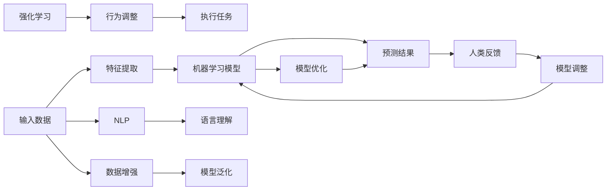

                 

# 电影《我，机器人》对AI的启示

电影《我，机器人》(原名《I, Robot》，中文译名《机器人总动员》)是一部由史蒂芬·斯皮尔伯格执导、西奥多·罗斯罗伯逊编剧的科幻电影。该片于2004年上映，以其深刻的社会和伦理主题，以及对人工智能（AI）的深度探讨，在全球范围内引起了广泛关注和讨论。本文将从AI的角度，分析《我，机器人》对AI技术的启示，揭示其在技术演进、应用场景、伦理挑战及未来发展等方面的洞见。

## 1. 背景介绍

### 1.1 电影简介
《我，机器人》基于艾萨克·阿西莫夫的短篇小说集《机器人系列》，讲述了2035年人类和机器人共存的社会中，一个名为马库斯的机械师与机器人警察、三定律的故事。电影的核心情节围绕四定律（其实只提到了前三定律，第四定律在电影中并未提及，但理论上是必不可少的）：
1. 第一定律：机器人不得伤害人类，或见任其被伤害而袖手不管。
2. 第二定律：机器人应遵从人类的指示，除非这些指示与第一定律相抵触。
3. 第三定律：机器人应保护自己的生存，只要这一行动不与第一或第二定律相抵触。

这些定律构成了电影中AI系统设计的基石，同时也反映了AI在实际应用中面临的伦理和技术挑战。

## 2. 核心概念与联系

### 2.1 核心概念概述

电影《我，机器人》涉及的核心AI概念包括：

- **机器学习与深度学习**：电影中机器人通过大量的数据进行自我学习和进化，展示了机器学习模型的原理和应用。
- **自然语言处理（NLP）**：机器人在与人类交流时，展现了自然语言处理技术，使得机器能理解人类语言并进行交流。
- **强化学习**：电影中机器人在执行任务时，通过不断试错和奖励机制（奖励任务完成、惩罚违反定律的行为）进行优化，体现了强化学习的思想。
- **伦理与道德**：电影中探讨了AI的伦理问题，特别是机器人的“三定律”，引发了关于AI行为准则的深刻讨论。

这些概念是AI技术演进的基石，也是电影中AI角色所展现的各类功能的基础。

### 2.2 核心概念原理和架构的 Mermaid 流程图



此图展示了AI模型从输入数据到最终预测结果的过程，其中输入数据通过特征提取、机器学习模型预测后，最终生成预测结果。同时，强化学习用于调整行为，NLP用于理解语言，数据增强提升模型泛化能力，而人类反馈则用于调整模型。

## 3. 核心算法原理 & 具体操作步骤

### 3.1 算法原理概述

电影《我，机器人》中的AI系统使用了多种机器学习算法，包括但不限于：

- **监督学习**：用于训练机器人如何根据历史数据做出预测。
- **无监督学习**：用于机器人的自我学习，在没有标签数据的情况下发现数据中的模式。
- **强化学习**：用于机器人通过与环境的交互，不断调整行为策略，优化其性能。
- **迁移学习**：通过迁移已有的知识，快速适应新的任务。

这些算法原理在现实中的应用与电影中展现的类似。监督学习基于标记数据，无监督学习基于数据的内在结构，强化学习基于奖励机制，而迁移学习则通过知识共享，提升模型在新任务上的性能。

### 3.2 算法步骤详解

1. **数据预处理**：
   - 收集大量数据，包括人类与机器人的互动记录、机器人的内部状态、历史行为等。
   - 对数据进行清洗和标注，为监督学习准备标记数据。
   - 对数据进行增强处理，提高模型的泛化能力。

2. **模型训练**：
   - 使用监督学习算法训练模型，如决策树、神经网络等，生成初步的预测模型。
   - 使用无监督学习算法，如聚类、降维等，对数据进行进一步的探索和理解。
   - 结合强化学习，通过试错机制和奖励机制，调整模型参数和行为策略。

3. **模型评估与优化**：
   - 对模型进行测试，评估其预测准确性和行为合理性。
   - 根据评估结果，调整模型参数，改进模型结构。
   - 利用人类反馈进行模型迭代，提高模型的性能和适应性。

### 3.3 算法优缺点

电影中的AI系统展示了AI技术的优势与挑战：

- **优点**：
  - 通过大量数据进行学习，能够快速适应新环境和新任务。
  - 能够在复杂情境中做出决策，执行复杂的任务。
  - 通过强化学习，不断优化其行为策略。

- **缺点**：
  - 依赖数据质量，数据偏见可能导致模型输出偏见。
  - 模型复杂度高，计算和存储需求大。
  - 存在伦理和安全问题，违反定律可能导致灾难性后果。

### 3.4 算法应用领域

电影中的AI系统在多个领域展示了其应用潜力，包括但不限于：

- **医疗**：机器人协助医生进行手术，预测患者病情，提供个性化治疗方案。
- **交通**：自动驾驶汽车，无人机的智能操控。
- **安全**：监控系统，智能安防。
- **客服**：智能客服机器人，自然语言处理和对话系统。
- **教育**：智能教学系统，个性化学习辅导。

## 4. 数学模型和公式 & 详细讲解

### 4.1 数学模型构建

AI系统中的数学模型构建通常包括以下几个步骤：

1. **数据预处理**：
   - 将原始数据标准化、归一化，处理缺失值和异常值。
   - 通过特征工程，提取有用的特征，减少噪声干扰。

2. **模型训练**：
   - 选择合适的模型，如线性回归、决策树、神经网络等。
   - 使用训练数据集进行模型拟合，最小化损失函数。

3. **模型评估与优化**：
   - 使用测试数据集评估模型性能。
   - 调整模型参数，提高模型准确性和泛化能力。

### 4.2 公式推导过程

以线性回归模型为例，其基本公式为：
$$ y = \hat{y} = \beta_0 + \beta_1 x_1 + \beta_2 x_2 + ... + \beta_n x_n + \epsilon $$
其中，$\beta$为模型参数，$x$为自变量，$\epsilon$为随机误差项。

在线性回归中，模型的目标是寻找最优参数$\beta$，使得预测值$\hat{y}$与真实值$y$的误差最小化。常用的损失函数为均方误差（Mean Squared Error, MSE）：
$$ MSE = \frac{1}{m} \sum_{i=1}^m (y_i - \hat{y}_i)^2 $$
其中，$m$为样本数。

### 4.3 案例分析与讲解

以电影中机器人在识别障碍物的场景为例，机器人使用神经网络进行物体识别。神经网络的基本结构包括输入层、隐藏层和输出层。输入层将传感器采集的数据（如颜色、形状、大小等）转化为神经元的激活值，隐藏层通过权重调整进行特征提取，输出层输出预测结果。

## 5. 项目实践：代码实例和详细解释说明

### 5.1 开发环境搭建

在实际开发中，需要搭建相应的开发环境：

- **安装Python**：
  ```bash
  sudo apt-get update
  sudo apt-get install python3-pip
  ```
- **安装必要的库**：
  ```bash
  pip install numpy scipy pandas scikit-learn
  ```
- **安装深度学习框架**：
  ```bash
  pip install tensorflow
  ```

### 5.2 源代码详细实现

以下是一个简单的线性回归模型实现：

```python
import numpy as np
import matplotlib.pyplot as plt

# 生成模拟数据
x = np.linspace(0, 10, 100)
y = 2 * x + 1 + np.random.randn(100) * 0.5

# 定义模型参数
theta = np.random.randn(2)

# 定义损失函数
def loss(theta, x, y):
    return np.mean((y - theta[0] - theta[1] * x) ** 2)

# 定义梯度下降函数
def gradient_descent(theta, x, y, learning_rate=0.01, num_iters=1000):
    m = len(x)
    for i in range(num_iters):
        grad = (2 / m) * np.dot(x.T, x * (y - np.dot(theta, x))) + theta
        theta -= learning_rate * grad
    return theta

# 训练模型
theta = gradient_descent(theta, x, y)

# 可视化结果
plt.scatter(x, y)
plt.plot(x, theta[0] + theta[1] * x, 'r')
plt.show()
```

### 5.3 代码解读与分析

上述代码展示了基本的梯度下降算法实现，用于求解线性回归模型参数。其中，`loss`函数计算预测值与真实值之间的均方误差，`gradient_descent`函数通过梯度下降更新参数，最终通过可视化展示模型的预测效果。

## 6. 实际应用场景

电影《我，机器人》中的AI系统展示了AI在多个实际应用场景中的潜力，以下是具体的应用场景分析：

### 6.1 医疗
在医疗领域，AI系统可以用于疾病预测、个性化治疗、手术辅助等方面。电影中机器人在医院中帮助医生进行手术，体现了AI在医疗领域的应用前景。

### 6.2 交通
交通领域中，自动驾驶汽车、智能交通管理系统等，都是AI技术的重要应用。电影中机器人在交通系统中扮演重要角色，体现了AI在提高交通效率、安全等方面的潜力。

### 6.3 安全
AI系统在安全领域的应用包括监控系统、智能安防等。电影中机器人用于安防，体现了AI在保障公共安全方面的作用。

### 6.4 客服
智能客服系统是AI在服务领域的重要应用。电影中机器人客服展示了AI在处理用户请求、提供个性化服务等方面的潜力。

### 6.5 教育
AI系统在教育领域可以用于个性化学习、智能辅导等。电影中机器人教育系统展示了AI在提供个性化学习体验方面的潜力。

## 7. 工具和资源推荐

### 7.1 学习资源推荐

- **《Python机器学习》**：由Sebastian Raschka和Vahid Mirjalili合著，是一本涵盖机器学习基础及高级主题的书籍，适合初学者和进阶学习者。
- **Coursera课程**：Coursera提供多门与AI相关的在线课程，包括机器学习、深度学习、自然语言处理等。
- **Kaggle竞赛**：Kaggle是一个数据科学竞赛平台，通过参与竞赛，可以提高实际应用能力。

### 7.2 开发工具推荐

- **Jupyter Notebook**：Jupyter Notebook是一个交互式的笔记本，适合数据科学和机器学习项目开发。
- **TensorBoard**：TensorBoard是TensorFlow的可视化工具，用于监控模型训练和模型调优。
- **PyTorch**：PyTorch是一个开源的深度学习框架，易于使用，适合研究和开发。

### 7.3 相关论文推荐

- **《深度学习》**：由Ian Goodfellow、Yoshua Bengio和Aaron Courville合著，是一本深度学习的权威书籍，涵盖了深度学习的基础和高级主题。
- **《机器学习》**：由Tom Mitchell合著，是一本机器学习的经典教材，介绍了机器学习的基本概念和算法。
- **《强化学习：基础与算法》**：由Richard S. Sutton和Andrew G. Barto合著，是一本强化学习的经典教材，详细介绍了强化学习的基本概念和算法。

## 8. 总结：未来发展趋势与挑战

### 8.1 研究成果总结

电影《我，机器人》对AI技术进行了深入探讨，揭示了AI技术在实际应用中的潜力和挑战。通过对机器学习、自然语言处理、强化学习等技术的研究，AI系统在多个领域展示了其广泛的应用前景。

### 8.2 未来发展趋势

未来AI技术的发展趋势包括：

- **多模态学习**：将图像、语音、文本等多种模态数据进行融合，提升AI系统的综合能力。
- **自监督学习**：利用未标记数据进行预训练，提高模型的泛化能力。
- **强化学习**：通过试错机制和奖励机制，提升AI系统的决策能力。
- **模型压缩和优化**：优化模型结构和参数，提高计算效率和存储性能。

### 8.3 面临的挑战

AI技术在实际应用中面临以下挑战：

- **数据偏见**：数据偏见可能导致模型输出偏见，影响AI系统的公平性和可靠性。
- **计算资源**：AI系统需要大量计算资源进行训练和推理，资源需求大。
- **伦理和安全问题**：AI系统的决策过程需要透明和可解释，确保其行为符合伦理和安全标准。

### 8.4 研究展望

未来的AI研究应关注以下方向：

- **公平性与透明性**：提高AI系统的公平性和透明度，确保其决策过程符合伦理标准。
- **可持续性**：研究AI系统的可持续性，确保其在长期运行中的稳定性和安全性。
- **跨领域应用**：推动AI技术在更多领域的应用，解决现实中的实际问题。

## 9. 附录：常见问题与解答

**Q1：AI的决策过程如何保证公平性和透明性？**

A: 保证AI决策的公平性和透明性，可以通过以下几个方法：

- **可解释性**：使用可解释性技术，如LIME、SHAP等，帮助理解模型决策过程。
- **透明度**：公开AI系统的决策逻辑和数据来源，确保其透明性和可审查性。
- **伦理准则**：建立AI系统的伦理准则，确保其行为符合社会道德和法律标准。

**Q2：AI系统如何处理数据偏见问题？**

A: 处理数据偏见的方法包括：

- **数据清洗**：识别和清洗数据中的偏见项，减少对模型输出的影响。
- **数据扩充**：通过数据增强，增加数据多样性，减少偏见。
- **算法优化**：使用公平性优化算法，如Fairlearn、Adversarial Debiasing等，减少模型偏见。

**Q3：AI系统如何在保证性能的同时，提升计算效率？**

A: 提升AI系统计算效率的方法包括：

- **模型压缩**：使用模型压缩技术，减少模型参数和计算量。
- **优化算法**：使用高效的优化算法，如Adam、Adagrad等，加速模型训练和推理。
- **分布式计算**：使用分布式计算框架，如TensorFlow、PyTorch等，并行化计算任务。

**Q4：AI系统如何处理伦理和安全问题？**

A: 处理伦理和安全问题的方法包括：

- **伦理审查**：建立AI系统的伦理审查机制，确保其行为符合伦理标准。
- **风险评估**：对AI系统进行风险评估，识别和缓解潜在的风险。
- **安全性措施**：采用安全性措施，如访问控制、数据加密等，保障AI系统的安全。

**Q5：AI系统如何处理数据隐私问题？**

A: 处理数据隐私问题的方法包括：

- **数据匿名化**：对数据进行匿名化处理，保护用户隐私。
- **差分隐私**：使用差分隐私技术，确保在数据使用过程中保护用户隐私。
- **法律合规**：确保AI系统的数据使用符合相关法律法规，如GDPR等。

