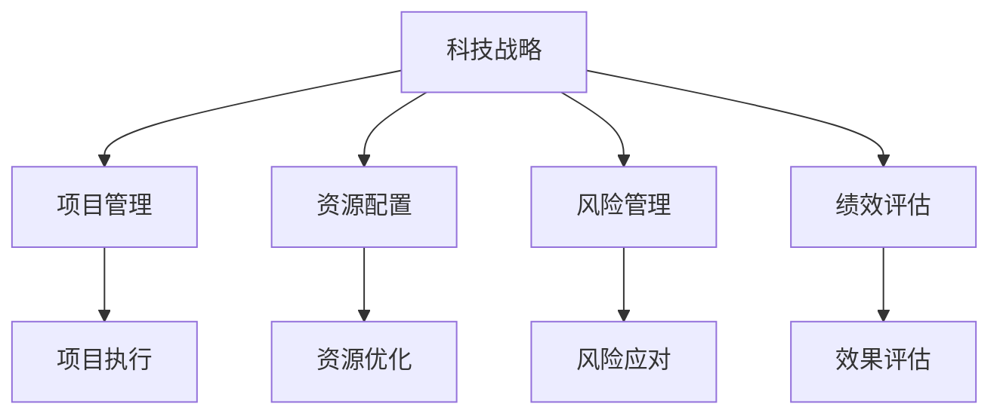

                 

# 督促、跟踪和指导公司科技战略的执行，确保按照战略规划的方向前进，各项计划得到有效的落实

## 1. 背景介绍

### 1.1 问题由来
在当前快速变化的商业环境中，科技战略对于公司的长期发展和竞争力至关重要。然而，尽管许多公司制定了明确的科技战略，但在执行过程中往往面临种种挑战，如项目进度滞后、资源分配不当、市场需求变化等，导致战略规划无法顺利落实。为了确保公司科技战略的有效执行，迫切需要一套科学、系统的管理和监控机制，实时督促、跟踪和指导战略的推进，保障各项计划落地见效。

### 1.2 问题核心关键点
科技战略执行的核心关键点包括：
- **战略规划的制定**：明确公司的长期科技目标和战略方向，设计详细的实施路径。
- **项目管理**：选择合适的项目管理工具和方法，确保项目按时按质完成。
- **资源配置**：合理分配和调度人力资源、财务资源和技术资源，保障战略执行的资源支持。
- **风险管理**：识别潜在的风险因素，并制定相应的应对策略，确保战略执行的稳定性。
- **绩效评估**：建立全面的绩效评估体系，定期评估战略执行的效果，及时调整和优化。

### 1.3 问题研究意义
研究如何督促、跟踪和指导公司科技战略的执行，对于确保公司能够按照战略规划的方向前进，提高市场竞争力和企业价值，具有重要意义：
- **提升战略执行力**：通过科学管理和监控机制，确保战略规划的各项计划得到有效落实。
- **优化资源配置**：合理分配和利用资源，提高资源利用效率，降低执行成本。
- **应对市场变化**：实时跟踪市场需求和技术趋势，及时调整战略执行策略，保持公司的竞争力。
- **促进创新发展**：通过有效的执行机制，激发员工的创新潜力和主动性，推动技术进步和业务创新。

## 2. 核心概念与联系

### 2.1 核心概念概述

为更好地理解督促、跟踪和指导公司科技战略执行的核心方法，本节将介绍几个密切相关的核心概念：

- **科技战略(Strategic Technology Plan, STP)**：公司为实现其科技目标而制定的长期规划和行动纲领，包括技术方向、创新重点、资源分配等内容。
- **项目管理(Project Management)**：应用项目管理的方法和工具，确保科技项目按时、按质、按预算完成的过程。
- **资源配置(Resource Allocation)**：通过优化资源配置，合理分配人力资源、财务资源和技术资源，提升资源利用效率。
- **风险管理(Risk Management)**：识别和评估潜在的风险因素，制定相应的应对策略，确保战略执行的稳定性和可靠性。
- **绩效评估(Performance Evaluation)**：建立全面的绩效评估体系，定期评估战略执行的效果，及时发现和解决问题。

这些核心概念之间的逻辑关系可以通过以下Mermaid流程图来展示：



这个流程图展示了几大核心概念及其之间的关系：

1. **科技战略**作为顶层设计，引领公司的科技方向和创新重点。
2. **项目管理**确保项目按时、按质、按预算完成，是战略执行的基础。
3. **资源配置**优化资源利用效率，支持战略执行的顺利进行。
4. **风险管理**识别和应对潜在风险，确保战略执行的稳定性和可靠性。
5. **绩效评估**定期评估战略执行效果，及时发现和解决问题，优化后续执行策略。

这些概念共同构成了公司科技战略执行的管理框架，确保公司能够在市场和技术变化的复杂环境中，稳步推进科技战略，实现战略目标。

## 3. 核心算法原理 & 具体操作步骤

### 3.1 算法原理概述

督促、跟踪和指导公司科技战略执行的核心算法原理，主要围绕以下几个方面展开：

- **项目管理算法**：通过项目管理算法，确定项目的关键路径和里程碑，实时监控项目进展，及时调整项目计划。
- **资源配置算法**：通过资源配置算法，优化资源利用效率，确保资源分配合理，支持项目高效执行。
- **风险管理算法**：通过风险管理算法，识别和评估潜在风险，制定相应的应对策略，确保项目稳定推进。
- **绩效评估算法**：通过绩效评估算法，定期评估项目执行效果，及时发现和解决问题，优化后续执行策略。

### 3.2 算法步骤详解

督促、跟踪和指导公司科技战略执行的具体操作步骤如下：

**Step 1: 制定科技战略**

- **目标设定**：根据公司长期愿景和市场分析，制定明确、可行的科技战略目标。
- **路径规划**：设计详细的执行路径，包括关键项目、时间节点、资源需求等。
- **资源评估**：评估现有资源状况，明确资源需求，制定资源调配计划。

**Step 2: 项目管理**

- **项目选择**：根据科技战略目标，选择合适的项目进行执行。
- **任务分解**：将项目分解为可管理的子任务，明确任务责任和时间节点。
- **进度监控**：实时监控项目进展，通过进度图表、进度报告等方式呈现项目状态。
- **问题解决**：及时解决项目执行中的问题和障碍，确保项目按时完成。

**Step 3: 资源配置**

- **人力资源调配**：根据项目需求，调配相关人员，明确任务责任和工作时间。
- **财务资源管理**：合理分配项目预算，确保资金使用合规和高效。
- **技术资源支持**：提供必要的技术资源支持，确保项目顺利推进。

**Step 4: 风险管理**

- **风险识别**：识别项目执行中可能遇到的各种风险因素，包括技术风险、市场风险、运营风险等。
- **风险评估**：对识别出的风险进行评估，确定风险影响程度和发生概率。
- **风险应对**：制定相应的风险应对策略，包括风险规避、风险缓解、风险转移等。

**Step 5: 绩效评估**

- **效果评估**：定期评估项目执行效果，使用关键绩效指标(KPI)进行评估。
- **问题诊断**：通过绩效评估结果，诊断项目执行中的问题，找到改进方向。
- **优化调整**：根据评估结果和问题诊断，优化项目执行策略，调整后续执行计划。

### 3.3 算法优缺点

督促、跟踪和指导公司科技战略执行的算法具有以下优点：
- **系统性和科学性**：通过系统化的项目管理、资源配置、风险管理和绩效评估，确保战略执行的科学性和有效性。
- **实时性和动态性**：通过实时监控和动态调整，能够及时应对市场和技术变化，保持战略执行的灵活性和适应性。
- **透明度和可控性**：通过透明的监控和评估机制，确保所有战略执行过程可追溯、可控，提升执行的可靠性和成功率。

同时，该算法也存在一定的局限性：
- **复杂度高**：涉及多个核心概念和操作步骤，执行过程较为复杂，需要专业的项目管理和技术支持。
- **资源消耗大**：项目管理、资源配置、风险管理等需要耗费大量人力和物力，成本较高。
- **执行难度大**：需要高度的执行力和管理能力，以及跨部门的协调和沟通，执行难度较大。

尽管存在这些局限性，但就目前而言，这种系统化和科学化的执行机制仍然是最为主流和有效的方式，广泛应用于各行业的科技战略执行中。未来相关研究的重点在于如何进一步优化算法，降低执行成本，提高执行效率，以及提升算法的智能化和自动化水平。

### 3.4 算法应用领域

督促、跟踪和指导公司科技战略执行的算法在多个领域得到了广泛应用，包括但不限于：

- **互联网公司**：通过项目管理、资源配置等机制，推动技术创新和产品迭代，保持市场竞争力。
- **制造企业**：通过优化资源配置和风险管理，提升生产效率和质量控制，实现智能化转型。
- **金融行业**：通过项目管理、绩效评估等机制，确保金融产品和服务的按时交付，提升客户满意度。
- **教育机构**：通过项目管理、资源配置等机制，推动教育教学改革和技术应用，提升教育质量和效果。
- **政府部门**：通过项目管理、风险管理等机制，提升公共服务效率和质量，推动数字化转型。

这些领域的应用展示了督促、跟踪和指导公司科技战略执行的算法广泛的市场需求和应用前景。

## 4. 数学模型和公式 & 详细讲解 & 举例说明

### 4.1 数学模型构建

本节将使用数学语言对督促、跟踪和指导公司科技战略执行的核心算法进行更加严格的刻画。

假设公司制定了一个为期两年的科技战略，包含若干关键项目，每个项目的时间节点和资源需求如下表所示：

| 项目编号 | 项目名称 | 时间节点 | 资源需求 |
| -------- | -------- | -------- | -------- |
| 1        | 云计算平台 | 第1季度 | 资源需求1 |
| 2        | AI算法研发 | 第2季度 | 资源需求2 |
| 3        | 大数据分析 | 第3季度 | 资源需求3 |
| ...      | ...      | ...      | ...      |

定义每个项目的完成度为 $x_i$，表示项目 $i$ 在当前时间点的进度，其取值范围为 $[0,1]$。定义每个项目的实际资源投入为 $y_i$，表示项目 $i$ 在当前时间点的资源利用情况。

### 4.2 公式推导过程

**项目管理算法**

项目管理算法主要通过关键路径法和里程碑法来确定项目的执行路径和监控进度。关键路径法（CPM）计算每个项目的关键路径和关键节点，从而识别出对项目整体进度的最大影响因素。里程碑法则通过设置关键里程碑，对项目进展进行阶段性评估。

**资源配置算法**

资源配置算法主要通过线性规划和动态规划来优化资源分配。线性规划（Linear Programming, LP）用于求解在给定资源约束下的最优资源分配方案。动态规划（Dynamic Programming, DP）用于优化资源分配的效率和灵活性。

**风险管理算法**

风险管理算法主要通过蒙特卡洛模拟和敏感性分析来评估和应对风险。蒙特卡洛模拟（Monte Carlo Simulation）通过对可能发生的情况进行模拟，预测风险发生概率和影响程度。敏感性分析（Sensitivity Analysis）用于评估不同因素变化对项目结果的影响，从而制定相应的应对策略。

**绩效评估算法**

绩效评估算法主要通过关键绩效指标（KPI）和多目标优化来评估项目执行效果。关键绩效指标（KPI）用于衡量项目的关键性能指标，如完成度、成本、时间等。多目标优化（Multi-objective Optimization）用于同时优化多个目标，确保项目的全面性和均衡性。

### 4.3 案例分析与讲解

**案例1：云计算平台项目**

假设云计算平台项目的时间节点和资源需求如下：

| 时间节点 | 资源需求 |
| -------- | -------- |
| 第1季度 | 资源需求1 |
| 第2季度 | 资源需求2 |
| ...      | ...      |

通过项目管理算法，计算出项目的关键路径为第1季度到第3季度，关键节点为第2季度。通过资源配置算法，优化资源分配方案，确保每个季度按时完成项目任务。通过风险管理算法，评估项目可能遇到的风险因素，制定相应的应对策略。通过绩效评估算法，定期评估项目进展，及时发现和解决问题，确保项目按时完成。

**案例2：AI算法研发项目**

假设AI算法研发项目的时间节点和资源需求如下：

| 时间节点 | 资源需求 |
| -------- | -------- |
| 第1季度 | 资源需求1 |
| 第2季度 | 资源需求2 |
| ...      | ...      |

通过项目管理算法，计算出项目的关键路径为第1季度到第3季度，关键节点为第2季度。通过资源配置算法，优化资源分配方案，确保每个季度按时完成项目任务。通过风险管理算法，评估项目可能遇到的风险因素，制定相应的应对策略。通过绩效评估算法，定期评估项目进展，及时发现和解决问题，确保项目按时完成。

## 5. 项目实践：代码实例和详细解释说明

### 5.1 开发环境搭建

在进行项目管理实践前，我们需要准备好开发环境。以下是使用Python进行项目管理的环境配置流程：

1. 安装Anaconda：从官网下载并安装Anaconda，用于创建独立的Python环境。

2. 创建并激活虚拟环境：
```bash
conda create -n project-env python=3.8 
conda activate project-env
```

3. 安装PyTorch：根据CUDA版本，从官网获取对应的安装命令。例如：
```bash
conda install pytorch torchvision torchaudio cudatoolkit=11.1 -c pytorch -c conda-forge
```

4. 安装Pandas、Matplotlib、Jupyter Notebook等工具包：
```bash
pip install pandas matplotlib jupyter notebook ipython
```

5. 安装相关库：
```bash
pip install numpy scikit-learn networkx
```

完成上述步骤后，即可在`project-env`环境中开始项目管理实践。

### 5.2 源代码详细实现

下面以项目管理算法中的关键路径法（CPM）为例，给出使用Python进行关键路径计算的代码实现。

首先，定义项目数据结构：

```python
from networkx import DiGraph

class Project:
    def __init__(self, name, duration, prerequisites):
        self.name = name
        self.duration = duration
        self.prerequisites = prerequisites
        self.time = 0

class Network:
    def __init__(self):
        self.graph = DiGraph()
    
    def add_project(self, project):
        self.graph.add_node(project.name, duration=project.duration, prerequisites=project.prerequisites)
    
    def build_graph(self):
        for node in self.graph.nodes():
            for prerequisite in self.graph.predecessors(node):
                self.graph.add_edge(prerequisite, node)
```

然后，定义关键路径计算函数：

```python
from networkx import find_path
from typing import List, Dict

def calculate_critical_path(graph: DiGraph) -> List[str]:
    critical_path = []
    in_degree = {node: 0 for node in graph.nodes()}
    
    # 计算入度
    for node, edge in graph.edges():
        in_degree[node] += 1
        if in_degree[node] == 1:
            critical_path.append(node)
    
    # 计算关键路径
    while critical_path:
        node = critical_path[0]
        for neighbor in graph.neighbors(node):
            in_degree[neighbor] -= 1
            if in_degree[neighbor] == 0:
                critical_path.append(neighbor)
                in_degree[node] = 0
                critical_path.pop(0)
    
    return critical_path
```

最后，构建项目网络和计算关键路径：

```python
# 创建项目
project1 = Project('项目1', 3, [])
project2 = Project('项目2', 2, ['项目1'])
project3 = Project('项目3', 3, ['项目2'])

# 创建网络
network = Network()
network.add_project(project1)
network.add_project(project2)
network.add_project(project3)

# 计算关键路径
critical_path = calculate_critical_path(network.graph)
print('关键路径：', critical_path)
```

以上就是使用Python进行关键路径计算的完整代码实现。可以看到，通过网络图（DiGraph）的数据结构，可以方便地表示和管理项目的依赖关系，并通过计算关键路径来识别项目的关键节点和关键路径。

### 5.3 代码解读与分析

让我们再详细解读一下关键路径计算代码的实现细节：

**Project类**：
- `__init__`方法：初始化项目的基本信息，包括项目名称、持续时间和前置任务。
- `time`属性：表示项目的完成度，初始值为0，后续通过进度管理算法更新。

**Network类**：
- `__init__`方法：初始化网络图的基本信息，包括所有项目节点。
- `add_project`方法：将项目节点添加到网络图中。
- `build_graph`方法：构建项目网络图，设置项目之间的依赖关系。

**calculate_critical_path函数**：
- 首先计算所有项目的入度，识别出关键路径的起点。
- 然后按照关键路径的顺序，依次更新每个节点的入度，直到所有节点的入度都为0，即可得到关键路径。

通过上述代码的实现，我们可以快速计算出项目的关键路径，从而优化项目执行的资源配置和进度管理。

### 5.4 运行结果展示

假设我们有一个包含三个项目的网络，其依赖关系如下：

| 项目编号 | 项目名称 | 持续时间为月 |
| -------- | -------- | ----------- |
| 1        | 项目A    | 3           |
| 2        | 项目B    | 2           |
| 3        | 项目C    | 3           |
| 4        | 项目D    | 1           |
| 5        | 项目E    | 2           |

项目之间的依赖关系如下：

- 项目A依赖于自身，无前置任务。
- 项目B依赖于项目A，持续时间为2个月。
- 项目C依赖于项目B，持续时间为3个月。
- 项目D依赖于项目A，持续时间为1个月。
- 项目E依赖于项目B，持续时间为2个月。

通过上述代码计算，得到项目的关键路径为：项目A -> 项目B -> 项目C。这意味着，项目C是整个项目网络中的关键节点，任何延迟都会影响整个项目的完成时间。

## 6. 实际应用场景

### 6.1 智能制造系统

在智能制造系统中，项目管理技术可以广泛应用于生产线调度、设备维护、产品质量控制等方面。通过项目管理系统，可以实时监控生产线各环节的执行情况，及时发现和解决问题，确保生产效率和产品质量。

**案例分析**：某智能制造企业通过项目管理系统，实时监控各生产线的执行进度和资源利用情况。通过关键路径法（CPM）和里程碑法，确定了关键任务和关键节点，优化了资源分配。通过绩效评估算法，定期评估生产线的执行效果，及时发现和解决生产中的问题，提升了生产效率和产品质量。

**效果展示**：通过项目管理系统的应用，该企业实现了生产线执行的可视化和自动化，显著提高了生产效率，减少了设备维护时间和故障率，产品质量也有了显著提升。

### 6.2 智慧城市管理

在智慧城市管理中，项目管理技术可以广泛应用于交通管理、环保监测、公共安全等方面。通过项目管理系统，可以实时监控城市的各项运行指标，及时发现和解决问题，提升城市管理的智能化水平。

**案例分析**：某智慧城市项目通过项目管理系统，实时监控交通流量、空气质量、公共安全等数据。通过关键路径法（CPM）和里程碑法，确定了交通管理、空气质量监测、公共安全监控等关键任务。通过绩效评估算法，定期评估各项任务的执行效果，及时发现和解决城市管理中的问题，提升了城市管理的智能化水平。

**效果展示**：通过项目管理系统应用，该城市实现了各项运行指标的实时监控和自动化分析，提高了交通管理效率，改善了空气质量，增强了公共安全保障，提升了城市居民的幸福感和安全感。

### 6.3 金融风险管理

在金融风险管理中，项目管理技术可以广泛应用于风险评估、风险控制、风险预警等方面。通过项目管理系统，可以实时监控金融市场的各项风险指标，及时发现和解决问题，降低金融风险。

**案例分析**：某金融企业通过项目管理系统，实时监控股票市场、债券市场、外汇市场等金融市场的运行情况。通过关键路径法（CPM）和里程碑法，确定了市场监控、风险评估、风险预警等关键任务。通过绩效评估算法，定期评估各项任务的执行效果，及时发现和解决市场中的问题，降低了金融风险。

**效果展示**：通过项目管理系统应用，该企业实现了金融市场的实时监控和自动化分析，提高了风险评估的准确性，增强了风险控制的及时性，降低了金融风险，提升了企业竞争力。

## 7. 工具和资源推荐

### 7.1 学习资源推荐

为了帮助开发者系统掌握督促、跟踪和指导公司科技战略执行的理论基础和实践技巧，这里推荐一些优质的学习资源：

1. **项目管理书籍**：《项目管理知识体系指南》(PMBOK Guide)、《敏捷项目管理实践》(Agile Project Management with Scrum)等书籍，系统介绍项目管理的基本概念和实践方法。

2. **项目管理课程**：Coursera、Udemy等平台提供的项目管理课程，如《项目管理基础》、《敏捷项目管理》等，涵盖项目管理的基本概念和实践技巧。

3. **项目管理工具**：JIRA、Trello等项目管理工具，提供丰富的项目管理和协作功能，帮助团队高效执行项目管理任务。

4. **项目管理框架**：PRINCE2、PMP等项目管理框架，提供系统化、标准化的方法论和工具，帮助企业规范项目管理。

5. **项目管理软件**：Microsoft Project、Smartsheet等项目管理软件，提供强大的项目计划、跟踪和协作功能，支持复杂项目的管理。

通过对这些资源的学习实践，相信你一定能够快速掌握督促、跟踪和指导公司科技战略执行的理论基础和实践技巧，并用于解决实际的项目管理问题。

### 7.2 开发工具推荐

高效的开发离不开优秀的工具支持。以下是几款用于督促、跟踪和指导公司科技战略执行的开发工具：

1. **项目管理软件**：JIRA、Trello、Asana等项目管理工具，提供丰富的项目管理和协作功能，帮助团队高效执行项目管理任务。
2. **绩效评估工具**：Tableau、Power BI等数据分析工具，提供强大的数据可视化和分析功能，帮助企业实时监控项目执行效果，及时发现和解决问题。
3. **风险管理工具**：RiskWatch、@Risk等风险管理工具，提供丰富的风险识别、评估和应对功能，帮助企业规避和管理项目风险。
4. **协作平台**：Slack、Microsoft Teams等协作平台，提供强大的团队沟通和协作功能，提升团队协作效率，促进项目执行。
5. **项目管理框架**：PRINCE2、PMP等项目管理框架，提供系统化、标准化的方法论和工具，帮助企业规范项目管理。

合理利用这些工具，可以显著提升督促、跟踪和指导公司科技战略执行的效率和效果，保障项目顺利推进，实现战略目标。

### 7.3 相关论文推荐

督促、跟踪和指导公司科技战略执行的研究源于学界的持续研究。以下是几篇奠基性的相关论文，推荐阅读：

1. **《项目管理：理论与实践》(Project Management: A Systems Approach to Planning, Scheduling, and Controlling)**：作者：Harold Kerzner，系统介绍项目管理的基本概念、方法和工具。
2. **《敏捷项目管理实践》(Agile Project Management with Scrum)**：作者：Ken Schwaber、Mike Beedle，介绍敏捷项目管理的基本概念、方法和工具，强调团队协作和迭代开发。
3. **《项目管理的三个原则》(The Three Principles of Project Management)**：作者：Harold Kerzner，系统介绍项目管理的三个核心原则，即范围管理、时间管理和成本管理。
4. **《风险管理与控制》(Risk Management and Control)**：作者：Bruce Beatty，系统介绍风险管理的概念、方法和工具，帮助企业规避和管理项目风险。
5. **《项目管理最佳实践》(Best Practices in Project Management)**：作者：Erin Busby，系统介绍项目管理的最佳实践，提升项目管理效率和效果。

这些论文代表了大语言模型微调技术的发展脉络。通过学习这些前沿成果，可以帮助研究者把握学科前进方向，激发更多的创新灵感。

## 8. 总结：未来发展趋势与挑战

### 8.1 总结

本文对督促、跟踪和指导公司科技战略执行的核心算法原理和具体操作步骤进行了全面系统的介绍。首先阐述了科技战略执行的核心概念和关键点，明确了项目管理、资源配置、风险管理和绩效评估等核心步骤。其次，通过数学模型和公式详细讲解了项目管理、资源配置、风险管理和绩效评估的具体算法步骤，给出了完整的代码实现。同时，本文还探讨了项目管理技术在智能制造、智慧城市、金融风险管理等实际应用场景中的应用，展示了项目管理技术的广泛应用前景。

通过本文的系统梳理，可以看到，督促、跟踪和指导公司科技战略执行的算法框架，已经在多个行业得到了成功应用，显著提升了项目管理的效果和效率。未来，伴随技术的不断发展和应用场景的扩展，项目管理技术还将进一步优化和创新，推动企业科技战略的落地和执行。

### 8.2 未来发展趋势

督促、跟踪和指导公司科技战略执行的未来发展趋势包括：

1. **智能化和自动化**：未来项目管理将更加智能化和自动化，通过AI和大数据技术，实现项目管理过程的自动化和智能化，提升项目管理的效率和效果。
2. **跨领域融合**：未来项目管理将与其他技术领域进行更深入的融合，如区块链、物联网、大数据等，实现跨领域的项目管理和协作。
3. **实时性和动态性**：未来项目管理将更加注重实时性和动态性，通过实时监控和动态调整，及时应对市场和技术变化，保持项目执行的灵活性和适应性。
4. **人性化设计**：未来项目管理将更加注重人性化设计，通过用户体验优化和智能化工具，提升项目管理人员的体验和效率。
5. **生态系统构建**：未来项目管理将构建更加完善的生态系统，实现项目管理的标准化和规范化，提升项目管理的效果和可靠性。

这些趋势凸显了督促、跟踪和指导公司科技战略执行的算法的广阔前景。这些方向的探索发展，必将进一步提升项目管理技术的智能化和自动化水平，推动项目管理技术迈向新的高度。

### 8.3 面临的挑战

尽管督促、跟踪和指导公司科技战略执行的算法已经取得了显著成果，但在迈向更加智能化、普适化应用的过程中，仍面临诸多挑战：

1. **技术复杂度高**：督促、跟踪和指导公司科技战略执行的算法涉及多个核心概念和操作步骤，执行过程较为复杂，需要专业的项目管理和技术支持。
2. **资源消耗大**：项目管理、资源配置、风险管理等需要耗费大量人力和物力，成本较高。
3. **执行难度大**：需要高度的执行力和管理能力，以及跨部门的协调和沟通，执行难度较大。
4. **数据和信息安全**：项目管理涉及大量的数据和信息，如何保障数据和信息的安全，防止数据泄露和滥用，是一个重要的问题。
5. **人才短缺**：项目管理技术的应用需要高度专业的人才，如何培养和吸引项目管理人才，是一个重要的挑战。

尽管存在这些挑战，但通过不断优化算法和提升执行能力，督促、跟踪和指导公司科技战略执行的算法仍然具有广阔的应用前景。相信伴随技术的不断发展和应用场景的扩展，项目管理技术将进一步优化和创新，推动企业科技战略的落地和执行。

### 8.4 研究展望

督促、跟踪和指导公司科技战略执行的研究需要在以下几个方面寻求新的突破：

1. **智能化项目管理**：探索基于AI和大数据的项目管理算法，实现项目管理过程的智能化和自动化。
2. **跨领域项目管理**：研究跨领域项目管理的方法和工具，实现不同技术领域之间的协同管理。
3. **实时性和动态性项目管理**：研究实时监控和动态调整的方法，提升项目管理过程的灵活性和适应性。
4. **人性化设计项目管理**：探索人性化设计的方法，提升项目管理人员的体验和效率。
5. **生态系统构建**：构建更加完善的项目管理生态系统，实现项目管理的标准化和规范化。

这些研究方向的探索，必将引领项目管理技术迈向更高的台阶，为构建高效、可靠、智能化的项目管理提供新的解决方案。面向未来，项目管理技术还需要与其他技术领域进行更深入的融合，多路径协同发力，共同推动项目管理技术的进步和发展。只有勇于创新、敢于突破，才能不断拓展项目管理技术的边界，实现科技战略的有效执行。

## 9. 附录：常见问题与解答

**Q1：项目管理中常用的算法有哪些？**

A: 项目管理中常用的算法包括：
1. 关键路径法（CPM）：计算项目的关键路径和关键节点，识别对项目整体进度的最大影响因素。
2. 甘特图法（Gantt Chart）：通过甘特图直观展示项目的进度和任务分布，便于监控和管理。
3. 网络图法（Network Diagram）：使用网络图表示项目的网络结构，通过计算关键路径优化资源配置。
4. 里程碑法（Milestone）：设置关键里程碑，对项目进展进行阶段性评估。
5. 敏感性分析（Sensitivity Analysis）：评估不同因素变化对项目结果的影响，制定相应的应对策略。
6. 线性规划（Linear Programming, LP）：优化资源分配，确保资源利用效率。

这些算法在不同的项目管理场景中具有不同的应用价值，需要根据具体情况选择适合的算法。

**Q2：项目管理中如何应对风险？**

A: 项目管理中应对风险的主要方法包括：
1. 风险识别：识别项目可能遇到的各种风险因素，如技术风险、市场风险、运营风险等。
2. 风险评估：对识别出的风险进行评估，确定风险影响程度和发生概率。
3. 风险应对：制定相应的风险应对策略，如风险规避、风险缓解、风险转移等。
4. 实时监控：通过实时监控和动态调整，及时应对市场和技术变化，保持项目执行的灵活性和适应性。

这些风险管理方法需要结合具体的项目情况，综合运用，以确保项目执行的稳定性和可靠性。

**Q3：项目管理中如何优化资源配置？**

A: 项目管理中优化资源配置的主要方法包括：
1. 资源需求分析：通过需求分析，确定项目所需的各项资源，如人力资源、财务资源、技术资源等。
2. 线性规划（LP）：使用线性规划算法，优化资源分配方案，确保资源利用效率。
3. 动态规划（DP）：使用动态规划算法，优化资源分配的效率和灵活性。
4. 资源共享：通过资源共享，提高资源利用率，降低资源配置成本。
5. 资源调度：通过资源调度，优化资源使用的时间安排，提高资源利用效率。

这些资源优化方法需要根据具体的项目情况，综合运用，以确保项目执行的资源支持。

**Q4：项目管理中如何提高项目执行效果？**

A: 项目管理中提高项目执行效果的主要方法包括：
1. 任务分解：将项目分解为可管理的子任务，明确任务责任和时间节点。
2. 进度监控：通过进度图表、进度报告等方式呈现项目状态，实时监控项目进展。
3. 绩效评估：通过关键绩效指标（KPI）和多目标优化，评估项目执行效果，及时发现和解决问题。
4. 问题解决：及时解决项目执行中的问题和障碍，确保项目按时完成。
5. 团队协作：通过团队协作和沟通，提升项目执行效率和效果。

这些项目管理方法需要根据具体的项目情况，综合运用，以确保项目执行的顺利推进。

**Q5：项目管理中如何提升团队协作效率？**

A: 项目管理中提升团队协作效率的主要方法包括：
1. 项目分工：明确团队成员的职责和任务，确保每个任务有明确的责任人。
2. 沟通机制：建立高效的沟通机制，如定期会议、即时通讯工具等，促进团队协作。
3. 协作平台：使用协作平台，如Trello、Asana等，提供任务分配、进度跟踪和团队协作功能。
4. 激励机制：建立激励机制，鼓励团队成员积极参与项目执行，提升团队协作效率。
5. 知识共享：通过知识共享和团队协作，提升团队的整体能力和协作效率。

这些协作方法需要根据具体的团队情况，综合运用，以确保团队协作的高效和顺畅。

---

作者：禅与计算机程序设计艺术 / Zen and the Art of Computer Programming

