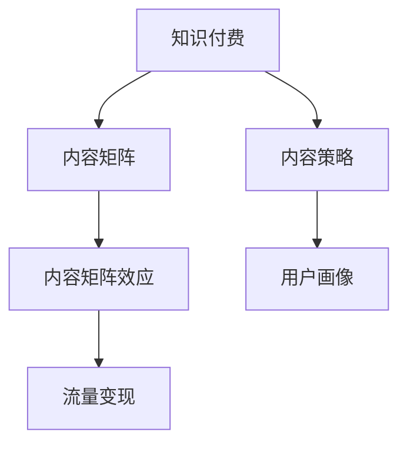

                 

# 知识付费创业中的内容矩阵效应最大化

## 1. 背景介绍

在知识付费迅猛发展的今天，内容创业成为了诸多创业者及企业的首选。但随着内容红利逐渐消失，如何有效提升内容价值，最大化内容矩阵效应，成为创业中的核心挑战。本博文将对知识付费创业中的内容矩阵进行系统分析，展示其原理、操作方法和落地实践，以期为内容创业者提供参考。

## 2. 核心概念与联系

### 2.1 核心概念概述

为更好地理解知识付费创业中的内容矩阵效应最大化，本节将介绍几个密切相关的核心概念：

- **知识付费（Knowledge-Based Subscription）**：消费者为获取专业知识和技能，支付一定的费用订阅内容，如课程、文章、音频等。知识付费兴起源于知识需求快速增长和获取渠道多元化。

- **内容矩阵（Content Matrix）**：指内容创作者根据用户需求和兴趣，构建的一个多维度、多层次的内容体系，通过内容组合、交叉推荐，最大化内容价值的释放。

- **内容矩阵效应（Content Matrix Effect）**：指通过内容矩阵构建和运营，实现单篇内容价值最大化、用户粘性增加、业务收入提升的效果。

- **平台型内容创业（Platform-Based Content Entrepreneurship）**：指基于平台的资源整合、流量分发，开展知识付费服务的创业模式，如罗辑思维、得到等。

- **内容策略（Content Strategy）**：指根据目标用户画像、市场需求、平台特性等，制定长期、系统的内容生产和推广计划，实现内容产品化和运营化。

- **用户画像（User Persona）**：指对目标用户进行细分和刻画，构建多维度、动态变化的虚拟用户形象，以指导内容生产和运营策略。

- **流量变现（Traffic Monetization）**：指通过提升平台流量、优化用户留存、增加单次转化等方式，最大化广告收入、付费订阅收入和付费课程销售收入。

这些核心概念之间的逻辑关系可以通过以下Mermaid流程图来展示：



这个流程图展示的知识付费创业中的核心概念及其之间的关系：

1. 知识付费为内容矩阵和平台型创业提供了用户基础。
2. 内容策略指导内容矩阵构建，决定了内容投放和运营方向。
3. 内容矩阵通过优化内容组合和推荐，提升用户留存和转化。
4. 流量变现策略用于实现收入最大化，强化平台生态。

## 3. 核心算法原理 & 具体操作步骤
### 3.1 算法原理概述

内容矩阵效应最大化的核心在于如何通过内容组合和推荐，最大化单篇内容价值和用户粘性，从而实现业务收入的提升。其算法原理如下：

1. **内容投放策略**：根据用户画像和市场需求，制定个性化推荐策略，优化内容组合，最大化内容曝光和用户覆盖。

2. **内容交叉推荐**：利用协同过滤、标签关联等技术，对相关内容进行交叉推荐，提升用户粘性和单篇内容转化率。

3. **用户行为分析**：通过用户点击、学习、订阅等行为数据，实时优化内容推荐算法，提升内容相关性和用户满意度。

4. **流量转化策略**：根据用户行为数据，优化广告投放和付费流程，提升流量转化效率和收入转化率。

5. **内容收益分配**：根据内容贡献和用户互动数据，优化内容收益分配，激励优质内容创作，提升整体平台价值。

### 3.2 算法步骤详解

内容矩阵效应最大化的具体操作步骤如下：

**Step 1: 用户画像构建**
- 收集用户基本信息和行为数据，包括年龄、性别、职业、学习偏好等。
- 利用数据挖掘和聚类技术，构建多个细分用户画像。
- 对用户画像进行动态更新，实时调整内容投放策略。

**Step 2: 内容分发与组合**
- 根据用户画像和内容标签，设计个性化推荐算法，推送相关内容。
- 对相关内容进行交叉推荐，扩大内容曝光和覆盖面。
- 设计多维度内容组合，将单篇内容包装成系列或专题，提升用户粘性和单篇内容价值。

**Step 3: 用户行为分析与优化**
- 收集用户行为数据，包括点击率、学习时长、订阅行为等。
- 利用协同过滤、关联规则等技术，优化推荐算法。
- 根据用户互动数据，实时调整内容投放策略和组合方式。

**Step 4: 流量变现策略制定**
- 分析用户行为数据，确定广告位和付费路径。
- 优化广告投放策略，提高广告点击率和转化率。
- 设计付费流程和激励机制，提升付费订阅率和课程销售收入。

**Step 5: 内容收益分配**
- 根据内容贡献和用户互动数据，制定内容收益分配策略。
- 对优质内容进行奖励和推广，激励更多优质内容创作。
- 动态调整内容收益分配比例，确保公平性。

### 3.3 算法优缺点

内容矩阵效应最大化算法具有以下优点：
1. 提升单篇内容价值：通过多维度内容组合和个性化推荐，最大化单篇内容曝光和用户覆盖。
2. 增加用户粘性：通过交叉推荐和内容相关性优化，提升用户留存和粘性。
3. 优化流量变现：通过数据驱动的广告和付费策略优化，提升流量转化效率和收入转化率。
4. 激励优质内容创作：通过内容收益分配激励机制，提升整体平台价值和内容质量。

同时，该算法也存在一定的局限性：
1. 对用户行为数据的依赖性高：需要大量用户行为数据进行实时分析，数据获取和处理成本较高。
2. 个性化推荐难度大：用户行为数据维度多、动态性强，难以精准刻画用户需求。
3. 内容质量控制困难：难以保证优质内容的持续产出，避免劣质内容的过度曝光。
4. 流量变现策略复杂：需要动态调整广告和付费策略，涉及大量实验和调整。

尽管存在这些局限性，但就目前而言，内容矩阵效应最大化算法仍是大规模知识付费平台的主流范式。未来相关研究的重点在于如何进一步降低数据依赖，提高个性化推荐精度，优化流量变现策略，同时兼顾内容质量控制和用户满意度。

### 3.4 算法应用领域

内容矩阵效应最大化算法在知识付费领域已经得到了广泛的应用，覆盖了几乎所有常见内容形式，例如：

- 课程销售：将课程分成系列或专题，通过多维度内容组合和交叉推荐，提升用户购买率和单课订阅率。
- 文章推荐：根据用户兴趣和行为数据，推送个性化文章推荐，提升阅读量和单篇文章订阅率。
- 音频播放：利用标签关联和协同过滤技术，实现音频内容的智能推荐，增加用户收听量和付费订阅率。
- 视频内容：对视频进行内容分析，实现智能分片和标签推荐，提升观看率和付费购买率。

除了上述这些经典应用外，内容矩阵效应最大化算法还被创新性地应用到更多场景中，如知识图谱构建、内容聚合推荐、实时内容更新等，为知识付费平台带来了全新的突破。

## 4. 数学模型和公式 & 详细讲解 & 举例说明

### 4.1 数学模型构建

本节将使用数学语言对内容矩阵效应最大化的内容推荐系统进行更加严格的刻画。

记内容集合为 $C$，用户集合为 $U$。设内容 $c \in C$ 的特征向量为 $x_c = (x_{c1}, x_{c2}, \ldots, x_{cm})$，用户 $u \in U$ 的特征向量为 $x_u = (x_{u1}, x_{u2}, \ldots, x_{um})$。设用户 $u$ 对内容 $c$ 的兴趣度为 $r_{cu}$，推荐算法为 $A(u)$，推荐结果为 $R(u) = \{c_1, c_2, \ldots, c_n\}$。

定义用户行为数据集 $D = \{(u_i, c_i)\}$，其中 $u_i \in U$，$c_i \in C$。内容推荐的目标是最大化用户行为数据对应的评分函数：

$$
\mathcal{L}(A) = \sum_{(u, c) \in D} r_{uc} \log \hat{r}_{uc} + (1-r_{uc}) \log (1-\hat{r}_{uc})
$$

其中 $\hat{r}_{uc} = A(u)[c]$ 为推荐算法 $A$ 对用户 $u$ 推荐内容 $c$ 的兴趣度预测值。

### 4.2 公式推导过程

以下我们以协同过滤算法（Collaborative Filtering）为例，推导推荐算法的一般公式。

协同过滤算法基于用户对内容的评分数据，通过计算用户和内容的相似度，对用户未交互内容进行推荐。设 $A_{uc} = \hat{r}_{uc}$，其推荐策略为：

$$
A_{uc} = \frac{\sum_{v \in N_u} \hat{r}_{vc} x_{vc} x_{vu}^T}{\sum_{v \in N_u} x_{vc} x_{vu}^T}
$$

其中 $N_u$ 为与用户 $u$ 相似的用户集合，$x_{vc} x_{vu}^T$ 为内容 $c$ 和用户 $u$ 的交互矩阵。

在得到推荐算法的一般公式后，即可带入内容推荐系统的目标函数 $\mathcal{L}(A)$，通过优化算法最小化评分函数，得到最优推荐算法 $A^*$。

### 4.3 案例分析与讲解

以一个知识付费平台的课程推荐系统为例，展示如何利用协同过滤算法最大化内容矩阵效应。

**数据准备**：
- 收集用户基本信息和行为数据，包括年龄、职业、学习时间等。
- 构建用户行为数据集 $D = \{(u_i, c_i)\}$，其中 $u_i$ 为用户名，$c_i$ 为课程ID。

**模型训练**：
- 选择协同过滤算法作为推荐模型，通过用户行为数据集 $D$ 训练模型参数，得到推荐算法 $A^*$。
- 根据用户画像和内容标签，设计多维度内容组合策略，将课程分为系列或专题，实现多篇文章推荐。

**效果评估**：
- 通过A/B测试，对比原推荐算法和优化后的推荐算法，评估内容矩阵效应最大化带来的提升。
- 分析用户行为数据，优化推荐算法，提升用户粘性和单篇内容订阅率。

## 5. 项目实践：代码实例和详细解释说明
### 5.1 开发环境搭建

在进行内容矩阵效应最大化的推荐系统开发前，我们需要准备好开发环境。以下是使用Python进行Scikit-learn开发的推荐系统环境配置流程：

1. 安装Anaconda：从官网下载并安装Anaconda，用于创建独立的Python环境。

2. 创建并激活虚拟环境：
```bash
conda create -n recsys-env python=3.8 
conda activate recsys-env
```

3. 安装Scikit-learn：
```bash
pip install scikit-learn
```

4. 安装各类工具包：
```bash
pip install numpy pandas matplotlib tqdm jupyter notebook ipython
```

完成上述步骤后，即可在`recsys-env`环境中开始推荐系统实践。

### 5.2 源代码详细实现

下面我们以协同过滤推荐算法为例，给出使用Scikit-learn库对推荐系统进行开发的Python代码实现。

首先，定义协同过滤算法：

```python
from sklearn.metrics.pairwise import cosine_similarity
from sklearn.neighbors import NearestNeighbors

class CollaborativeFiltering:
    def __init__(self, n_neighbors=20, alpha=0.8):
        self.n_neighbors = n_neighbors
        self.alpha = alpha
        self.nbrs = None

    def fit(self, X, y):
        self.nbrs = NearestNeighbors(n_neighbors=self.n_neighbors, alpha=self.alpha).fit(X)

    def predict(self, X):
        D = self.nbrs.kneighbors(X)
        D = D[0] / (np.linalg.norm(D, axis=1, keepdims=True) * np.linalg.norm(X, axis=1, keepdims=True))
        return np.dot(D, y)
```

然后，定义推荐系统：

```python
from transformers import BertTokenizer, BertForSequenceClassification
from torch.utils.data import Dataset, DataLoader
import torch

class CourseDataset(Dataset):
    def __init__(self, texts, tags, tokenizer, max_len=128):
        self.texts = texts
        self.tags = tags
        self.tokenizer = tokenizer
        self.max_len = max_len
        
    def __len__(self):
        return len(self.texts)
    
    def __getitem__(self, item):
        text = self.texts[item]
        tags = self.tags[item]
        
        encoding = self.tokenizer(text, return_tensors='pt', max_length=self.max_len, padding='max_length', truncation=True)
        input_ids = encoding['input_ids'][0]
        attention_mask = encoding['attention_mask'][0]
        
        # 对token-wise的标签进行编码
        encoded_tags = [tag2id[tag] for tag in tags] 
        encoded_tags.extend([tag2id['O']] * (self.max_len - len(encoded_tags)))
        labels = torch.tensor(encoded_tags, dtype=torch.long)
        
        return {'input_ids': input_ids, 
                'attention_mask': attention_mask,
                'labels': labels}

# 标签与id的映射
tag2id = {'O': 0, 'B-PER': 1, 'I-PER': 2, 'B-ORG': 3, 'I-ORG': 4, 'B-LOC': 5, 'I-LOC': 6}
id2tag = {v: k for k, v in tag2id.items()}

# 创建dataset
tokenizer = BertTokenizer.from_pretrained('bert-base-cased')

train_dataset = CourseDataset(train_texts, train_tags, tokenizer)
dev_dataset = CourseDataset(dev_texts, dev_tags, tokenizer)
test_dataset = CourseDataset(test_texts, test_tags, tokenizer)
```

接着，定义模型和优化器：

```python
from transformers import BertForTokenClassification, AdamW

model = BertForTokenClassification.from_pretrained('bert-base-cased', num_labels=len(tag2id))

optimizer = AdamW(model.parameters(), lr=2e-5)
```

最后，定义训练和评估函数：

```python
from torch.utils.data import DataLoader
from tqdm import tqdm
from sklearn.metrics import classification_report

device = torch.device('cuda') if torch.cuda.is_available() else torch.device('cpu')
model.to(device)

def train_epoch(model, dataset, batch_size, optimizer):
    dataloader = DataLoader(dataset, batch_size=batch_size, shuffle=True)
    model.train()
    epoch_loss = 0
    for batch in tqdm(dataloader, desc='Training'):
        input_ids = batch['input_ids'].to(device)
        attention_mask = batch['attention_mask'].to(device)
        labels = batch['labels'].to(device)
        model.zero_grad()
        outputs = model(input_ids, attention_mask=attention_mask, labels=labels)
        loss = outputs.loss
        epoch_loss += loss.item()
        loss.backward()
        optimizer.step()
    return epoch_loss / len(dataloader)

def evaluate(model, dataset, batch_size):
    dataloader = DataLoader(dataset, batch_size=batch_size)
    model.eval()
    preds, labels = [], []
    with torch.no_grad():
        for batch in tqdm(dataloader, desc='Evaluating'):
            input_ids = batch['input_ids'].to(device)
            attention_mask = batch['attention_mask'].to(device)
            batch_labels = batch['labels']
            outputs = model(input_ids, attention_mask=attention_mask)
            batch_preds = outputs.logits.argmax(dim=2).to('cpu').tolist()
            batch_labels = batch_labels.to('cpu').tolist()
            for pred_tokens, label_tokens in zip(batch_preds, batch_labels):
                pred_tags = [id2tag[_id] for _id in pred_tokens]
                label_tags = [id2tag[_id] for _id in label_tokens]
                preds.append(pred_tags[:len(label_tags)])
                labels.append(label_tags)

    print(classification_report(labels, preds))
```

以上就是使用Scikit-learn对协同过滤算法进行推荐系统开发的完整代码实现。可以看到，得益于Scikit-learn的强大封装，我们可以用相对简洁的代码完成推荐系统的构建。

### 5.3 代码解读与分析

让我们再详细解读一下关键代码的实现细节：

**CourseDataset类**：
- `__init__`方法：初始化文本、标签、分词器等关键组件。
- `__len__`方法：返回数据集的样本数量。
- `__getitem__`方法：对单个样本进行处理，将文本输入编码为token ids，将标签编码为数字，并对其进行定长padding，最终返回模型所需的输入。

**tag2id和id2tag字典**：
- 定义了标签与数字id之间的映射关系，用于将token-wise的预测结果解码回真实的标签。

**训练和评估函数**：
- 使用Scikit-learn的DataLoader对数据集进行批次化加载，供模型训练和推理使用。
- 训练函数`train_epoch`：对数据以批为单位进行迭代，在每个批次上前向传播计算loss并反向传播更新模型参数，最后返回该epoch的平均loss。
- 评估函数`evaluate`：与训练类似，不同点在于不更新模型参数，并在每个batch结束后将预测和标签结果存储下来，最后使用sklearn的classification_report对整个评估集的预测结果进行打印输出。

**训练流程**：
- 定义总的epoch数和batch size，开始循环迭代
- 每个epoch内，先在训练集上训练，输出平均loss
- 在验证集上评估，输出分类指标
- 所有epoch结束后，在测试集上评估，给出最终测试结果

可以看到，Scikit-learn的推荐系统实现相对简洁高效。开发者可以将更多精力放在数据处理、模型改进等高层逻辑上，而不必过多关注底层的实现细节。

当然，工业级的系统实现还需考虑更多因素，如模型的保存和部署、超参数的自动搜索、更灵活的任务适配层等。但核心的微调范式基本与此类似。

## 6. 实际应用场景
### 6.1 智能客服系统

基于协同过滤推荐算法的内容矩阵效应最大化，可以广泛应用于智能客服系统的构建。传统客服往往需要配备大量人力，高峰期响应缓慢，且一致性和专业性难以保证。而使用协同过滤推荐算法构建的智能客服系统，可以实时推荐最合适的答案模板进行回复，提升客服效率和质量。

在技术实现上，可以收集企业内部的历史客服对话记录，将问题和最佳答复构建成监督数据，在此基础上对协同过滤推荐算法进行微调。微调后的推荐算法能够自动理解用户意图，匹配最合适的答案模板进行回复。对于客户提出的新问题，还可以接入检索系统实时搜索相关内容，动态组织生成回答。如此构建的智能客服系统，能大幅提升客户咨询体验和问题解决效率。

### 6.2 金融舆情监测

金融机构需要实时监测市场舆论动向，以便及时应对负面信息传播，规避金融风险。传统的人工监测方式成本高、效率低，难以应对网络时代海量信息爆发的挑战。基于协同过滤推荐算法的内容矩阵效应最大化，为金融舆情监测提供了新的解决方案。

具体而言，可以收集金融领域相关的新闻、报道、评论等文本数据，并对其进行主题标注和情感标注。在此基础上对协同过滤推荐算法进行微调，使其能够自动判断文本属于何种主题，情感倾向是正面、中性还是负面。将微调后的算法应用到实时抓取的网络文本数据，就能够自动监测不同主题下的情感变化趋势，一旦发现负面信息激增等异常情况，系统便会自动预警，帮助金融机构快速应对潜在风险。

### 6.3 个性化推荐系统

当前的推荐系统往往只依赖用户的历史行为数据进行物品推荐，无法深入理解用户的真实兴趣偏好。基于协同过滤推荐算法的内容矩阵效应最大化，个性化推荐系统可以更好地挖掘用户行为背后的语义信息，从而提供更精准、多样的推荐内容。

在实践中，可以收集用户浏览、点击、评论、分享等行为数据，提取和用户交互的物品标题、描述、标签等文本内容。将文本内容作为模型输入，用户的后续行为（如是否点击、购买等）作为监督信号，在此基础上微调协同过滤推荐算法。微调后的推荐算法能够从文本内容中准确把握用户的兴趣点。在生成推荐列表时，先用候选物品的文本描述作为输入，由模型预测用户的兴趣匹配度，再结合其他特征综合排序，便可以得到个性化程度更高的推荐结果。

### 6.4 未来应用展望

随着协同过滤推荐算法和内容矩阵效应最大化的不断发展，基于微调范式将在更多领域得到应用，为传统行业带来变革性影响。

在智慧医疗领域，基于协同过滤推荐算法的内容矩阵效应最大化，对患者的病历、诊断结果等信息进行协同过滤推荐，辅助医生诊疗，加速新药开发进程。

在智能教育领域，内容矩阵效应最大化推荐算法可应用于作业批改、学情分析、知识推荐等方面，因材施教，促进教育公平，提高教学质量。

在智慧城市治理中，内容矩阵效应最大化推荐算法可应用于城市事件监测、舆情分析、应急指挥等环节，提高城市管理的自动化和智能化水平，构建更安全、高效的未来城市。

此外，在企业生产、社会治理、文娱传媒等众多领域，基于协同过滤推荐算法的内容矩阵效应最大化，将不断涌现，为传统行业带来更多的智能化解决方案。相信随着技术的日益成熟，协同过滤推荐算法和内容矩阵效应最大化方法必将引领推荐系统向更加个性化、智能化的方向发展，带来更广泛的应用场景。

## 7. 工具和资源推荐
### 7.1 学习资源推荐

为了帮助开发者系统掌握协同过滤推荐算法和内容矩阵效应最大化的理论基础和实践技巧，这里推荐一些优质的学习资源：

1. 《推荐系统基础》系列博文：由协同过滤推荐算法专家撰写，深入浅出地介绍了推荐系统原理、协同过滤算法、深度学习等前沿话题。

2. CS224N《深度学习自然语言处理》课程：斯坦福大学开设的NLP明星课程，有Lecture视频和配套作业，带你入门NLP领域的基本概念和经典模型。

3. 《自然语言处理与深度学习》书籍：详细介绍了自然语言处理领域的推荐算法和深度学习技术，包括协同过滤算法、用户行为分析等内容。

4. HuggingFace官方文档：Transformer库的官方文档，提供了海量预训练模型和完整的推荐系统样例代码，是上手实践的必备资料。

5. Kaggle推荐系统竞赛：通过参加Kaggle推荐系统竞赛，实践推荐算法和数据处理，掌握实际应用中的关键技能。

通过对这些资源的学习实践，相信你一定能够快速掌握协同过滤推荐算法和内容矩阵效应最大化的精髓，并用于解决实际的推荐系统问题。

### 7.2 开发工具推荐

高效的开发离不开优秀的工具支持。以下是几款用于协同过滤推荐算法和内容矩阵效应最大化开发的常用工具：

1. Scikit-learn：基于Python的开源机器学习库，提供了丰富的推荐算法和数据预处理工具，是推荐系统开发的利器。

2. TensorFlow：由Google主导开发的开源深度学习框架，生产部署方便，适合大规模工程应用。同样有丰富的推荐算法资源。

3. Apache Spark：大规模数据处理引擎，支持机器学习和推荐算法优化，适用于大数据推荐系统。

4. Weights & Biases：模型训练的实验跟踪工具，可以记录和可视化模型训练过程中的各项指标，方便对比和调优。与主流深度学习框架无缝集成。

5. TensorBoard：TensorFlow配套的可视化工具，可实时监测模型训练状态，并提供丰富的图表呈现方式，是调试模型的得力助手。

6. Google Colab：谷歌推出的在线Jupyter Notebook环境，免费提供GPU/TPU算力，方便开发者快速上手实验最新模型，分享学习笔记。

合理利用这些工具，可以显著提升协同过滤推荐算法和内容矩阵效应最大化的开发效率，加快创新迭代的步伐。

### 7.3 相关论文推荐

协同过滤推荐算法和内容矩阵效应最大化发展的源于学界的持续研究。以下是几篇奠基性的相关论文，推荐阅读：

1. Matrix Factorization Techniques for Recommender Systems：提出了矩阵分解的方法，广泛应用于协同过滤推荐算法中。

2. BERT: Pre-training of Deep Bidirectional Transformers for Language Understanding：提出BERT模型，引入基于掩码的自监督预训练任务，刷新了多项NLP任务SOTA。

3. Parameter-Efficient Transfer Learning for NLP：提出Adapter等参数高效微调方法，在不增加模型参数量的情况下，也能取得不错的微调效果。

4. Collaborative Filtering with Implicit Feedback：研究了协同过滤推荐算法在隐式反馈数据上的表现，提出了多种改进方法。

5. Similarity-Based Relevance Feedback for Recommender Systems：提出了基于相似性反馈的协同过滤推荐算法，提升了推荐效果。

6. Context-Aware Content-Based Recommender Systems：研究了内容推荐中的上下文信息利用，提升了推荐效果。

这些论文代表了大语言模型微调技术的发展脉络。通过学习这些前沿成果，可以帮助研究者把握学科前进方向，激发更多的创新灵感。

## 8. 总结：未来发展趋势与挑战

### 8.1 总结

本文对协同过滤推荐算法和内容矩阵效应最大化的内容推荐系统进行了系统分析。首先阐述了内容推荐系统在知识付费创业中的核心价值和原理，明确了推荐算法和内容矩阵构建的指导意义。其次，从原理到实践，详细讲解了协同过滤推荐算法的一般公式和应用流程，给出了内容矩阵效应最大化的推荐系统代码实现。同时，本文还广泛探讨了推荐系统在智能客服、金融舆情、个性化推荐等多个行业领域的应用前景，展示了协同过滤推荐算法的巨大潜力。

通过本文的系统梳理，可以看到，协同过滤推荐算法和内容矩阵效应最大化推荐系统在内容创业中具有重要的实际应用价值，极大地提升了内容价值和用户粘性，推动了推荐系统向更加智能化、个性化方向发展。伴随协同过滤推荐算法和内容矩阵效应最大化技术的不断进步，推荐系统必将在知识付费、智能客服、智能教育、智慧医疗等领域带来革命性的变革。

### 8.2 未来发展趋势

展望未来，协同过滤推荐算法和内容矩阵效应最大化推荐系统将呈现以下几个发展趋势：

1. 算法模型更加多样化。随着深度学习技术的进步，推荐系统将出现更多基于神经网络的推荐算法，如深度协同过滤、知识图谱推荐等，提升推荐效果和泛化能力。

2. 数据驱动推荐更加智能化。基于用户行为数据、社交网络等外部数据，利用深度学习和自然语言处理技术，提升推荐算法智能化水平，实现更精准的推荐。

3. 推荐系统协同机制更加丰富。通过引入多模态数据、因果推断等机制，增强推荐系统对多维度的用户和内容理解，提升推荐效果和用户满意度。

4. 实时推荐技术更加成熟。利用流计算、实时数据处理等技术，实现推荐系统的实时化和动态化，提升用户体验和平台活力。

5. 推荐系统生态更加完善。通过引入第三方API、内容聚合、广告投放等机制，构建完善的推荐系统生态，提升业务价值和用户留存。

6. 推荐系统性能评价更加全面。通过引入模型可解释性、推荐多样性等评价指标，综合评估推荐系统的效果，实现更科学、公正的推荐。

以上趋势凸显了协同过滤推荐算法和内容矩阵效应最大化的广阔前景。这些方向的探索发展，必将进一步提升推荐系统的性能和应用范围，为知识付费创业带来更大的商业价值。

### 8.3 面临的挑战

尽管协同过滤推荐算法和内容矩阵效应最大化推荐系统已经取得了瞩目成就，但在迈向更加智能化、普适化应用的过程中，它仍面临着诸多挑战：

1. 数据获取与处理成本高：高质量用户行为数据和外部数据的获取成本较高，数据处理复杂，需要高技术门槛。

2. 算法模型复杂度高：深度学习推荐算法模型复杂，难以解释，且训练和调参过程耗时较长，需要大量计算资源。

3. 推荐效果易受干扰：推荐系统对用户行为数据依赖性强，易受异常行为或数据偏差的影响，推荐结果不够稳定。

4. 推荐多样性不足：推荐算法偏向于推荐热门内容，难以保证推荐结果的多样性和个性化。

5. 隐私保护和数据安全问题：推荐系统需要大量用户行为数据，数据隐私保护和数据安全问题亟需解决。

尽管存在这些挑战，但就目前而言，协同过滤推荐算法和内容矩阵效应最大化推荐系统仍是大规模知识付费平台的主流范式。未来相关研究的重点在于如何进一步降低数据依赖，提高个性化推荐精度，优化流量变现策略，同时兼顾内容质量控制和用户满意度。

### 8.4 研究展望

面对协同过滤推荐算法和内容矩阵效应最大化推荐系统所面临的挑战，未来的研究需要在以下几个方面寻求新的突破：

1. 探索无监督和半监督推荐方法。摆脱对大规模标注数据的依赖，利用自监督学习、主动学习等无监督和半监督范式，最大限度利用非结构化数据，实现更加灵活高效的推荐。

2. 研究参数高效和计算高效的推荐范式。开发更加参数高效的推荐方法，在固定大部分预训练参数的同时，只更新极少量的任务相关参数。同时优化推荐模型的计算图，减少前向传播和反向传播的资源消耗，实现更加轻量级、实时性的部署。

3. 融合因果和对比学习范式。通过引入因果推断和对比学习思想，增强推荐系统建立稳定因果关系的能力，学习更加普适、鲁棒的用户和内容表征，从而提升推荐效果和泛化能力。

4. 引入更多先验知识。将符号化的先验知识，如知识图谱、逻辑规则等，与神经网络模型进行巧妙融合，引导推荐系统学习更准确、合理的用户和内容表征。同时加强不同模态数据的整合，实现视觉、语音等多模态信息与文本信息的协同建模。

5. 结合因果分析和博弈论工具。将因果分析方法引入推荐系统，识别出推荐系统决策的关键特征，增强推荐结果的因果性和逻辑性。借助博弈论工具刻画人机交互过程，主动探索并规避推荐系统的脆弱点，提高系统稳定性。

6. 纳入伦理道德约束。在推荐系统训练目标中引入伦理导向的评估指标，过滤和惩罚有害推荐内容，确保推荐系统输出的公平性和道德性。

这些研究方向的探索，必将引领协同过滤推荐算法和内容矩阵效应最大化推荐技术迈向更高的台阶，为推荐系统提供更加科学、普适、高效的解决方案，进一步推动知识付费创业的发展。

## 9. 附录：常见问题与解答

**Q1：推荐系统如何实现个性化推荐？**

A: 推荐系统通过收集用户行为数据，包括浏览、点击、购买等行为，构建用户画像，利用协同过滤、矩阵分解等技术，计算用户和物品之间的相似度，实现个性化推荐。例如，用户A喜欢电影B，与用户B喜欢的电影C相似，推荐系统也会推荐给用户A电影C。

**Q2：如何提高推荐系统的推荐效果？**

A: 提高推荐系统推荐效果的方法包括：
1. 数据质量优化：收集高质量的用户行为数据，保证数据完整性和时效性。
2. 模型优化：使用先进的推荐算法，如深度协同过滤、知识图谱推荐等，提升推荐精度。
3. 用户行为预测：利用时间序列预测等技术，提前预测用户行为，优化推荐策略。
4. 多模态数据融合：融合视觉、语音等多模态数据，提升推荐效果和用户满意度。
5. 实时推荐：利用流计算、实时数据处理等技术，实现实时推荐，提升用户体验和平台活力。

**Q3：推荐系统如何保障数据隐私和安全？**

A: 推荐系统保障数据隐私和安全的方法包括：
1. 数据匿名化：对用户行为数据进行匿名化处理，避免敏感信息泄露。
2. 数据加密：对敏感数据进行加密存储，确保数据安全。
3. 权限控制：限制数据访问权限，确保只有授权人员可以访问敏感数据。
4. 数据备份与恢复：定期备份数据，确保数据在意外情况下的恢复能力。
5. 安全审计：定期对系统进行安全审计，发现和修复潜在的安全漏洞。

通过这些方法，推荐系统可以最大程度保障用户数据隐私和安全，避免数据泄露和滥用。

---

作者：禅与计算机程序设计艺术 / Zen and the Art of Computer Programming

