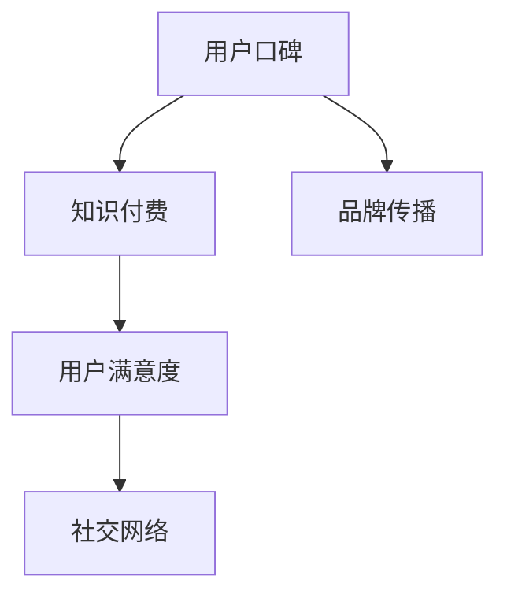

                 

# 知识付费创业中的用户口碑营销策略

## 1. 背景介绍

### 1.1 问题由来

随着互联网的发展，知识付费成为一种新兴的商业模式。越来越多的个人和公司开始提供知识付费内容，以帮助用户解决问题、获取技能或提升自身价值。但与此同时，随着市场竞争的加剧，知识付费产品的同质化现象越来越严重，用户获取信息的成本也随之上升。在这种情况下，如何有效提升用户口碑，实现差异化的品牌传播，成为知识付费创业公司关注的重点。

### 1.2 问题核心关键点

用户口碑营销的核心在于如何构建和维护良好的用户体验，从而激发用户的分享意愿和情感投入。具体而言，包括以下几个关键点：

1. 高品质的内容：优质的内容是赢得用户信任和口碑的基础。
2. 互动式设计：有效的用户互动可以提高用户满意度和参与度。
3. 社交网络：借助社交媒体等网络平台，扩大用户影响范围。
4. 反馈机制：及时响应用户反馈，不断优化产品和服务。
5. 社群建设：构建社群，增强用户归属感和忠诚度。

## 2. 核心概念与联系

### 2.1 核心概念概述

为更好地理解用户口碑营销策略，本节将介绍几个密切相关的核心概念：

- 用户口碑：指用户对产品或服务的满意度和评价，通过推荐、评论等方式传播。
- 知识付费：通过在线或线下渠道，为用户提供付费的教育和咨询服务。
- 品牌传播：通过各种营销手段，提升品牌知名度和影响力。
- 用户满意度：衡量用户对产品或服务的满意程度，影响用户口碑的重要因素。
- 社交网络：借助社交媒体、论坛等网络平台，实现信息的快速传播和交流。

这些核心概念之间的逻辑关系可以通过以下Mermaid流程图来展示：



这个流程图展示了几组核心概念及其之间的关系：

1. 用户口碑和知识付费：知识付费是用户口碑的来源之一，高质量的内容和服务可以提升用户满意度，从而促成积极口碑的传播。
2. 品牌传播和用户口碑：品牌传播可以有效扩大用户口碑的影响范围，提升品牌知名度。
3. 用户满意度和社会网络：用户满意度直接影响用户口碑，而社交网络则是口碑传播的重要渠道。

## 3. 核心算法原理 & 具体操作步骤

### 3.1 算法原理概述

用户口碑营销的核心在于通过互动式设计、社交网络、反馈机制等多种手段，提升用户满意度和参与度，从而激发用户自发传播行为。其原理可以简单概括为以下几点：

1. 互动式设计：通过界面友好、交互性强的设计，增加用户使用产品的乐趣和成就感。
2. 社交网络：利用社交媒体等网络平台，实现信息的快速传播和用户之间的互动。
3. 反馈机制：及时响应用户反馈，快速解决用户问题，提升用户满意度。
4. 社群建设：通过构建社群，增强用户归属感和忠诚度，促成用户自发传播。

### 3.2 算法步骤详解

用户口碑营销的具体操作步骤如下：

1. 确定目标用户群体：明确知识付费产品的目标用户群体，了解他们的需求和偏好。
2. 设计互动式界面：根据目标用户的需求和偏好，设计界面友好、交互性强的产品界面，提高用户体验。
3. 利用社交网络：通过社交媒体、论坛等平台，积极传播品牌信息，扩大用户影响范围。
4. 建立反馈机制：及时响应用户反馈，快速解决用户问题，提升用户满意度。
5. 构建社群：通过社群管理工具，构建用户社群，增强用户归属感和忠诚度，促成用户自发传播。

### 3.3 算法优缺点

用户口碑营销的优势包括：

1. 成本低：相比传统的广告营销，口碑传播的成本较低，且传播效果更好。
2. 可信度高：用户口碑相比广告更加真实可信，能够提升品牌信誉。
3. 传播范围广：通过社交网络，用户口碑可以迅速传播，覆盖更多潜在用户。

但该方法也存在一些缺点：

1. 不可控：用户口碑的传播往往不可控，难以预料用户的具体行为。
2. 易产生负面影响：负面口碑同样可以快速传播，对品牌形象造成损害。
3. 需要高水平的用户体验：良好的用户体验是用户口碑的基础，需要花费较多资源投入。

### 3.4 算法应用领域

用户口碑营销可以应用于知识付费、教育、医疗等多个领域。例如：

- 知识付费平台：通过用户反馈和社群建设，提升用户满意度和忠诚度。
- 在线教育：通过互动式设计和社交网络，增强学生的学习体验，提升课程评价。
- 医疗咨询：通过及时反馈和社群管理，提升患者满意度，改善医疗服务质量。

## 4. 数学模型和公式 & 详细讲解 & 举例说明

### 4.1 数学模型构建

假设用户对知识付费产品的满意度为 $S$，用户口碑传播的概率为 $P$，社交网络影响力为 $I$，社群的传播半径为 $R$，则用户口碑的影响力 $E$ 可以表示为：

$$ E = S \times P \times I \times R $$

其中：

- $S$：用户对产品的满意度，可以通过用户评分、评论等方式量化。
- $P$：用户口碑传播的概率，可以通过用户的行为数据（如转发、点赞、评论等）计算。
- $I$：社交网络影响力，可以通过社交媒体的粉丝数、活跃度等指标评估。
- $R$：社群传播半径，表示社群的覆盖范围和用户之间的互动频率。

### 4.2 公式推导过程

以一个简单的知识付费平台为例，假设平台每日有 $N$ 名用户参与互动，每个用户都有 $C$ 个好友，每个好友都会转发用户对其评价的概率为 $p$，那么每天的口碑传播次数 $T$ 可以表示为：

$$ T = N \times C \times p $$

其中 $N$ 是用户数，$C$ 是每个用户的平均好友数，$p$ 是用户转发的概率。

进一步推导可得用户口碑传播的概率 $P$ 为：

$$ P = \frac{T}{N} = \frac{N \times C \times p}{N} = C \times p $$

在实际应用中，还需要考虑其他因素，如用户评价的正负性、社交网络的影响力等。

### 4.3 案例分析与讲解

以某在线教育平台的用户口碑营销为例，假设该平台每日有 10000 名用户参与互动，每个用户都有 100 个好友，每个好友转发的概率为 0.2，那么每天的口碑传播次数为：

$$ T = 10000 \times 100 \times 0.2 = 200000 $$

假设用户的平均满意度为 4（满分 5 分），社交网络影响力为 10，社群传播半径为 3，则用户口碑的影响力为：

$$ E = 4 \times 0.2 \times 10 \times 3 = 24 $$

通过以上公式推导，可以得出用户口碑的传播效果与用户满意度、社交网络影响力、社群传播半径等因素密切相关。

## 5. 项目实践：代码实例和详细解释说明

### 5.1 开发环境搭建

在进行用户口碑营销实践前，我们需要准备好开发环境。以下是使用Python进行Web开发的环境配置流程：

1. 安装Python：从官网下载并安装Python，推荐使用3.6及以上版本。
2. 安装Django框架：使用pip安装，命令为：`pip install django`
3. 安装第三方库：如djangorestframework、django-crispy-forms等，用于构建API接口和友好的前端界面。

完成上述步骤后，即可在本地搭建Web开发环境。

### 5.2 源代码详细实现

接下来，我们将详细介绍一个简单的用户口碑营销系统的前端和后端实现。

首先，定义前端页面：

```html
<!-- templates/feedback.html -->
<form method="post">
    
    {{ form.label }}
    {{ form.submit }}
</form>
```

然后，定义后端API接口：

```python
# views.py
from django import forms
from django.http import JsonResponse

class FeedbackForm(forms.Form):
    label = forms.CharField()

# views.py
def feedback_view(request):
    if request.method == 'POST':
        form = FeedbackForm(request.POST)
        if form.is_valid():
            label = form.cleaned_data['label']
            # 保存用户反馈数据，触发后续口碑营销逻辑
            # ...
            return JsonResponse({'success': True})
    return JsonResponse({'success': False})
```

最后，定义前端页面与后端API的交互：

```javascript
// views.js
$.ajax({
    url: '/feedback',
    type: 'POST',
    data: { label: 'Great!' },
    success: function(data) {
        console.log('Feedback submitted successfully!');
    },
    error: function(data) {
        console.log('Feedback submission failed!');
    }
});
```

通过以上代码，实现了一个简单的用户反馈系统。用户可以通过前端页面提交反馈，后端接收并保存数据，触发后续口碑营销逻辑。

### 5.3 代码解读与分析

这里我们重点解读一下关键代码的实现细节：

**forms.py**：
- 定义了用户反馈表单，包括一个文字字段 `label`，用于接收用户反馈内容。

**views.py**：
- 定义了前端页面和后端API的交互逻辑。当用户提交反馈后，后端验证表单内容，并将数据保存到数据库，触发后续口碑营销逻辑。

**views.js**：
- 通过Ajax向后端API发送用户反馈，并在成功或失败时输出日志信息。

通过以上代码实现，用户反馈系统能够实时收集用户意见，并通过后端处理反馈数据，触发后续口碑营销逻辑。

## 6. 实际应用场景

### 6.1 用户反馈系统

在线教育平台可以构建用户反馈系统，通过收集用户对课程、教师、平台等各方面的反馈，及时优化产品和服务，提升用户满意度，从而促成积极口碑的传播。具体而言，可以在课程页面、教师页面、平台主页等位置增加反馈入口，并设置不同类型（如课程评价、教师评价、平台评价等），帮助用户更加方便地进行反馈。

### 6.2 社交媒体营销

知识付费平台可以通过社交媒体营销，积极传播品牌信息，扩大用户影响范围。具体而言，可以在微博、微信、知乎等平台上建立官方账号，发布有价值的内容和用户口碑，与用户进行互动。同时，可以利用社交媒体的分享功能，让用户将优质内容分享到自己的朋友圈、微博、微博空间等，进一步扩大品牌影响力和用户覆盖范围。

### 6.3 社群管理

知识付费平台可以构建用户社群，增强用户归属感和忠诚度，促成用户自发传播。具体而言，可以在平台上创建各类用户群组，如课程学习群、教师交流群、平台粉丝群等，定期组织线上线下活动，增强用户互动和粘性。同时，可以在社群中发布有价值的内容和用户评价，增强社群的活跃度和影响力。

## 7. 工具和资源推荐

### 7.1 学习资源推荐

为帮助开发者系统掌握用户口碑营销的理论基础和实践技巧，这里推荐一些优质的学习资源：

1. 《用户反馈与产品改进》系列博文：由产品管理专家撰写，深入浅出地介绍了用户反馈的收集、分析和应用，以及如何通过用户反馈改进产品。
2. 《用户体验设计》课程：由UI/UX设计大师开设的在线课程，涵盖用户行为、可用性测试、设计原则等多个方面，提升设计师的思维深度和设计水平。
3. 《社交媒体营销》书籍：系统介绍了社交媒体营销的基本原理和实践方法，包括内容创作、用户互动、广告投放等多个环节。
4. 《社群建设与管理》博客：由社群管理专家撰写，分享了各类社群的创建和管理经验，提供切实可行的操作步骤和技巧。
5. 《知识付费案例分析》报告：精选了几家知名的知识付费平台，详细分析了它们的用户口碑营销策略，提供丰富的实践经验和案例参考。

通过对这些资源的学习实践，相信你一定能够快速掌握用户口碑营销的精髓，并用于解决实际的商业问题。

### 7.2 开发工具推荐

高效的开发离不开优秀的工具支持。以下是几款用于用户口碑营销开发的常用工具：

1. Django：基于Python的Web开发框架，易于上手，灵活性高，适合构建复杂的Web应用。
2. Flask：轻量级的Web开发框架，快速高效，适合构建小型应用和API接口。
3. React：基于组件化的JavaScript库，用于构建动态前端界面，提升用户体验。
4. Bootstrap：开源的前端框架，提供丰富的UI组件和布局方案，快速构建友好的用户界面。
5. Vue.js：现代前端框架，支持双向数据绑定和组件化开发，提升开发效率和用户体验。

合理利用这些工具，可以显著提升用户口碑营销任务的开发效率，加快创新迭代的步伐。

### 7.3 相关论文推荐

用户口碑营销的发展源于学界的持续研究。以下是几篇奠基性的相关论文，推荐阅读：

1. Word of Mouth Formation and Communication in Social Media: A Model and Experiments: 分析社交媒体中的用户口碑形成和传播机制，提出有价值的理论和实验方法。
2. Social Media Marketing: A Strategic Framework: 提出社交媒体营销的战略框架，涵盖内容创作、用户互动等多个方面。
3. User Experience Impact on Customer Reviews: 研究用户反馈对产品质量的影响，提供基于用户满意度的产品改进建议。
4. Social Media Influencers: How Much Influence Do They Really Have?: 探讨社交媒体网红对用户行为的影响，提供真实的用户反馈和数据分析。
5. Community Building and Engagement Strategies: 介绍社群建设和管理策略，提供丰富的实践经验和操作步骤。

这些论文代表了大语言模型微调技术的发展脉络。通过学习这些前沿成果，可以帮助研究者把握学科前进方向，激发更多的创新灵感。

## 8. 总结：未来发展趋势与挑战

### 8.1 总结

本文对用户口碑营销策略进行了全面系统的介绍。首先阐述了用户口碑营销的研究背景和意义，明确了提升用户满意度、优化用户体验、增强社群建设等关键点。其次，从原理到实践，详细讲解了用户口碑营销的理论基础和操作步骤，给出了用户反馈系统的完整代码实例。同时，本文还广泛探讨了用户口碑营销在知识付费、教育、医疗等多个领域的应用前景，展示了用户口碑营销的广泛应用价值。

通过本文的系统梳理，可以看到，用户口碑营销已经成为知识付费创业公司的重要营销手段，能够有效提升用户满意度、增强品牌影响力和用户粘性，促成积极口碑的传播。未来，伴随用户反馈和社交网络技术的不断进步，用户口碑营销必将在更多领域得到应用，为知识付费产业带来新的发展机遇。

### 8.2 未来发展趋势

展望未来，用户口碑营销技术将呈现以下几个发展趋势：

1. 自动化程度提升：通过机器学习和数据分析技术，自动化分析用户反馈数据，生成有价值的洞察和建议，提升产品改进的效率和效果。
2. 个性化推荐系统：利用用户反馈和行为数据，构建个性化推荐系统，推荐用户感兴趣的内容和产品，增强用户满意度和忠诚度。
3. 跨平台集成：将用户口碑营销系统集成到多个平台和渠道，提升用户覆盖范围和影响力。
4. 实时反馈机制：利用实时数据流处理技术，实时响应用户反馈，快速优化产品和服务，提升用户体验。
5. 智能客服和机器人：通过智能客服和机器人技术，提升用户互动和解决问题的效果，增强用户粘性。

以上趋势凸显了用户口碑营销技术的广阔前景。这些方向的探索发展，必将进一步提升用户反馈系统的智能化水平，为用户提供更优质的服务体验。

### 8.3 面临的挑战

尽管用户口碑营销已经取得了瞩目成就，但在迈向更加智能化、普适化应用的过程中，它仍面临着诸多挑战：

1. 数据隐私和安全：用户反馈和行为数据的收集和分析涉及用户隐私，需要加强数据保护和安全措施。
2. 用户真实性：用户反馈和行为数据可能存在虚假信息，需要进行去伪存真和真实性验证。
3. 数据质量：用户反馈数据的质量和完整性直接影响分析结果的准确性，需要进行数据清洗和质量提升。
4. 用户期望管理：用户期望可能过高或过低，需要合理管理用户期望，提高用户满意度。
5. 跨文化差异：不同文化背景下的用户反馈和行为模式存在差异，需要针对不同市场进行本地化优化。

### 8.4 研究展望

面对用户口碑营销面临的种种挑战，未来的研究需要在以下几个方面寻求新的突破：

1. 数据隐私保护：加强用户数据隐私保护措施，确保用户反馈和行为数据的安全性。
2. 用户真实性验证：利用自然语言处理和机器学习技术，自动识别和过滤虚假信息，提高用户反馈的真实性。
3. 数据清洗和质量提升：通过自动化的数据清洗和质量提升技术，提高用户反馈数据的质量和完整性。
4. 用户期望管理：利用心理学和行为科学方法，合理管理用户期望，提升用户满意度和忠诚度。
5. 本地化优化：针对不同市场和文化背景，进行本地化优化，提升用户反馈和行为数据的适用性。

这些研究方向的探索，必将引领用户口碑营销技术迈向更高的台阶，为知识付费产业带来新的发展机遇。相信随着学界和产业界的共同努力，这些挑战终将一一被克服，用户口碑营销必将在构建人机协同的智能时代中扮演越来越重要的角色。

## 9. 附录：常见问题与解答

**Q1：用户反馈系统如何实现？**

A: 用户反馈系统可以通过前端页面收集用户反馈，后端接收并处理数据，触发后续口碑营销逻辑。具体实现可以采用Python、Django等技术栈，结合前端框架如React、Vue.js等，快速构建用户反馈系统。

**Q2：用户口碑营销的优势是什么？**

A: 用户口碑营销的优势包括：

1. 成本低：相比传统的广告营销，口碑传播的成本较低，且传播效果更好。
2. 可信度高：用户口碑相比广告更加真实可信，能够提升品牌信誉。
3. 传播范围广：通过社交网络，用户口碑可以迅速传播，覆盖更多潜在用户。

**Q3：如何提升用户反馈系统的体验？**

A: 提升用户反馈系统的体验可以从以下几个方面入手：

1. 界面友好：设计简洁友好的用户界面，减少用户操作步骤，提高用户使用体验。
2. 快速反馈：及时响应用户反馈，快速解决问题，提升用户满意度。
3. 数据分析：利用数据分析技术，生成有价值的洞察和建议，帮助用户更好地改进产品和服务。
4. 社交传播：通过社交网络平台，积极传播用户反馈，增强用户互动和粘性。

**Q4：用户反馈数据的质量如何保障？**

A: 保障用户反馈数据的质量可以从以下几个方面入手：

1. 数据清洗：通过自动化的数据清洗技术，去除噪音和错误数据，提高数据质量。
2. 用户真实性验证：利用自然语言处理和机器学习技术，自动识别和过滤虚假信息，提高用户反馈的真实性。
3. 数据标注：通过人工标注的方式，标记关键信息，提高数据标注的准确性和可靠性。
4. 数据采集：通过多种渠道采集用户反馈数据，增加数据的丰富性和多样性。

通过以上措施，可以保障用户反馈数据的质量和可靠性，提升数据应用的精准度和有效性。

**Q5：用户反馈系统如何与业务系统集成？**

A: 用户反馈系统可以与业务系统通过API接口集成，实现数据的共享和交互。具体实现步骤包括：

1. 定义API接口：根据业务需求，定义用户反馈数据的接口和格式。
2. 数据传输：通过API接口，将用户反馈数据传输到业务系统，实现数据的共享。
3. 数据分析：在业务系统中，利用数据分析技术，生成有价值的洞察和建议，帮助用户更好地改进产品和服务。
4. 反馈处理：根据业务需求，对用户反馈数据进行处理，实现反馈的闭环管理。

通过以上措施，可以实现用户反馈系统与业务系统的无缝集成，提升数据应用的效率和效果。

**Q6：用户反馈系统的安全性如何保障？**

A: 保障用户反馈系统的安全性可以从以下几个方面入手：

1. 数据加密：利用加密技术，保护用户反馈数据的安全性，防止数据泄露和篡改。
2. 访问控制：通过访问控制技术，限制数据访问权限，防止未经授权的访问和操作。
3. 审计记录：记录用户反馈数据的访问和操作记录，方便后续的审计和追踪。
4. 异常检测：利用异常检测技术，识别数据异常和攻击行为，及时预警和处理。

通过以上措施，可以保障用户反馈系统的安全性，保护用户数据的安全和隐私。

**Q7：用户反馈系统如何优化用户体验？**

A: 优化用户体验可以从以下几个方面入手：

1. 界面友好：设计简洁友好的用户界面，减少用户操作步骤，提高用户使用体验。
2. 快速反馈：及时响应用户反馈，快速解决问题，提升用户满意度。
3. 数据分析：利用数据分析技术，生成有价值的洞察和建议，帮助用户更好地改进产品和服务。
4. 社交传播：通过社交网络平台，积极传播用户反馈，增强用户互动和粘性。

通过以上措施，可以提升用户反馈系统的用户体验，增强用户粘性和满意度，促成积极口碑的传播。

---

作者：禅与计算机程序设计艺术 / Zen and the Art of Computer Programming

