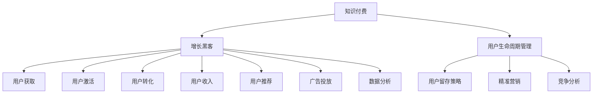

                 

# 知识付费创业的增长黑客技巧

> 关键词：知识付费, 增长黑客, 数据驱动, 用户增长, 用户体验优化, 精准营销, 用户生命周期管理, 用户留存策略, 增长分析, 竞争分析

## 1. 背景介绍

### 1.1 问题由来
随着知识经济的兴起，知识付费成为了一个热门领域。知识付费平台如得到、喜马拉雅、知乎等纷纷涌现，用户获取有价值的知识变得更加便捷高效。然而，尽管市场需求庞大，知识付费平台仍然面临诸多挑战，包括用户获取成本高、内容同质化、用户体验差等。为了在竞争激烈的知识付费市场中脱颖而出，企业需要依靠科学的方法论进行用户增长，提升用户粘性和留存率。增长黑客（Growth Hacker）应运而生，通过数据驱动的方式，实现高效精准的用户增长。

### 1.2 问题核心关键点
增长黑客是一种以数据驱动为核心的方法论，通过不断测试、迭代优化，实现用户增长和营收提升。增长黑客的核心理念在于“增长”，而非“营销”。增长的目标是将新用户引入平台，并提升现有用户的价值，实现长期的可持续增长。这一过程中，增长黑客需要综合运用产品、市场、技术等手段，快速迭代测试，不断优化产品和服务，满足用户需求，提升用户满意度。

## 2. 核心概念与联系

### 2.1 核心概念概述

为更好地理解增长黑客在知识付费创业中的应用，本节将介绍几个关键概念：

- **知识付费**：通过付费方式获取有价值的知识，如在线课程、音频讲座、电子书等。知识付费模式为用户提供了一种便捷高效获取知识的方式。
- **增长黑客**：利用数据驱动的方法，快速、低成本地实现用户增长和营收提升，通过A/B测试、用户行为分析等手段进行优化和迭代。
- **用户生命周期管理**：从用户获取、激活、留存、收入、推荐等各个阶段，制定精细化的运营策略，提升用户价值和平台收益。
- **用户留存策略**：通过提高用户满意度，增强平台粘性，实现用户长期留存。
- **精准营销**：针对特定用户群体进行定向推广，提升广告效率和用户转化率。
- **竞争分析**：通过对竞争对手的用户增长策略进行分析，找出自身的优势和不足，制定相应的应对措施。

这些核心概念之间的逻辑关系可以通过以下Mermaid流程图来展示：



这个流程图展示了这个体系的基本框架，帮助理解各个环节的相互关系。

## 3. 核心算法原理 & 具体操作步骤

### 3.1 算法原理概述

知识付费平台的用户增长主要依赖于用户获取、激活、留存和收入的循环。增长黑客的核心理念是通过数据驱动，不断迭代优化，提升各环节的用户转化率和价值，实现可持续增长。

根据Kano模型，用户需求可以分为三类：基本需求、期望需求和兴奋需求。增长黑客的目标在于提升用户的期望需求和兴奋需求，从而提升用户满意度和平台粘性。这一过程通常分为以下几步：

1. **用户获取**：通过各种渠道吸引新用户，如社交媒体、搜索引擎、付费广告等。
2. **用户激活**：通过优化产品体验、增加诱因刺激，促使新用户完成首次购买或使用。
3. **用户留存**：通过用户行为分析和数据驱动的运营策略，提升现有用户的长期留存和平台粘性。
4. **用户收入**：通过提高用户复购率和平均订单价值，提升平台的整体收入。
5. **用户推荐**：通过用户口碑传播和奖励机制，增加新用户的引入，形成良性循环。

### 3.2 算法步骤详解

知识付费平台的增长黑客具体实施步骤包括以下几个关键环节：

**Step 1: 数据收集与分析**

- **用户行为数据**：通过网站、应用、广告等渠道收集用户行为数据，如浏览、点击、购买、评价等。
- **用户属性数据**：收集用户的基本信息，如年龄、性别、职业、兴趣等。
- **市场环境数据**：收集竞争对手的运营数据，如用户数量、广告投放、用户评价等。

**Step 2: 用户细分与画像**

- **用户分群**：根据用户属性和行为数据，将用户进行细分，如按年龄、兴趣、消费水平等进行分组。
- **用户画像**：构建各用户群体的画像，了解用户需求和行为特征，为定向运营提供依据。

**Step 3: A/B测试与优化**

- **假设生成**：根据用户需求和市场环境，提出各种增长假设，如增加某个功能、改变广告投放策略等。
- **A/B测试**：随机选择两组用户，分别进行不同策略的测试，评估各策略的效果。
- **优化迭代**：根据测试结果，选择效果最佳的策略，进行全面推广。

**Step 4: 产品与运营策略制定**

- **产品优化**：根据用户反馈和市场趋势，不断优化产品功能和体验，满足用户需求。
- **运营策略**：制定精细化的用户运营策略，如新用户欢迎活动、老用户优惠、会员权益等。

**Step 5: 数据驱动的营销活动**

- **精准营销**：针对特定用户群体进行定向推广，如通过邮件、社交媒体等渠道发送个性化内容。
- **活动策划**：策划各种活动，如节日优惠、会员专属活动、限时折扣等，提升用户粘性和留存率。

**Step 6: 用户生命周期管理**

- **用户获取**：通过SEO、社交媒体广告、合作推广等方式，不断吸引新用户。
- **用户激活**：通过新手引导、积分奖励、免费试用等方式，提升新用户留存率。
- **用户留存**：通过定期推送、个性化推荐、会员激励等方式，提升用户长期留存。
- **用户收入**：通过复购机制、会员订阅、增值服务等方式，提高用户平均订单价值。
- **用户推荐**：通过用户评价、社交分享、积分奖励等方式，鼓励用户推荐新用户。

### 3.3 算法优缺点

增长黑客的优势在于数据驱动、快速迭代、效果明显。但同时也存在一些局限性：

**优点**：
- **快速迭代**：通过A/B测试和快速数据分析，可以快速找出最佳方案，缩短开发周期。
- **成本可控**：通过优化营销策略，可降低推广成本，提高广告转化率。
- **效果明显**：数据驱动的方法可以精确评估每个策略的效果，避免盲目投入。

**缺点**：
- **依赖数据**：需要大量数据支撑，数据质量和完整性对策略效果有较大影响。
- **复杂性高**：涉及产品、市场、技术等多个环节，需要跨部门协同合作。
- **需要技术支持**：需要有一定的数据科学和编程能力，对人员要求较高。

### 3.4 算法应用领域

增长黑客在知识付费创业中的应用领域非常广泛，包括但不限于以下几个方面：

- **用户获取**：通过SEO优化、社交媒体广告、内容营销等方式，吸引新用户注册和购买。
- **用户留存**：通过个性化推荐、积分激励、会员服务等方式，提升现有用户的长期留存。
- **用户收入**：通过复购机制、增值服务、会员订阅等方式，提升用户平均订单价值。
- **市场拓展**：通过精准营销和竞争分析，拓展新市场和新用户。

## 4. 数学模型和公式 & 详细讲解 & 举例说明

### 4.1 数学模型构建

增长黑客的核心在于通过数据分析和用户行为建模，实现精准的用户运营和增长优化。以知识付费平台为例，可以构建以下数学模型：

- **用户获取模型**：$U_{acquired}=f(AU,AD,CV)$，其中 $AU$ 为广告投入，$AD$ 为广告转化率，$CV$ 为用户获取渠道效果。
- **用户留存模型**：$R=f(NU,CB,IP)$，其中 $NU$ 为初始用户数量，$CB$ 为平台功能完备度，$IP$ 为个性化推荐策略。
- **用户收入模型**：$Revenue=f(AS,AP,CS)$，其中 $AS$ 为平均订单价值，$AP$ 为复购次数，$CS$ 为付费用户比例。

### 4.2 公式推导过程

以用户留存模型为例，推导其基本公式：

$$
R=f(NU,CB,IP) = \sum_{i=1}^{n} p_i f_i(NU, CB, IP)
$$

其中，$p_i$ 为各策略对用户留存的影响权重，$f_i$ 为各策略的函数表达式。

**案例分析与讲解**

假设知识付费平台有以下几种用户留存策略：

- **新用户欢迎活动**：$R_{welcome}=f_{welcome}(NU, CB, IP)$
- **积分奖励系统**：$R_{积分}=f_{积分}(NU, CB, IP)$
- **会员专属活动**：$R_{会员}=f_{会员}(NU, CB, IP)$

通过A/B测试，可以计算出每种策略对用户留存的影响权重 $p_i$，进而得到最终的留存率 $R$。

### 4.3 案例分析与讲解

假设某知识付费平台通过A/B测试，得到以下结果：

- **新用户欢迎活动**：A组留存率为50%，B组留存率为55%
- **积分奖励系统**：A组留存率为45%，B组留存率为50%
- **会员专属活动**：A组留存率为55%，B组留存率为60%

通过加权求和，得到最终的留存率：

$$
R = p_{welcome} R_{welcome} + p_{积分} R_{积分} + p_{会员} R_{会员}
$$

假设 $p_{welcome}=0.3$，$p_{积分}=0.4$，$p_{会员}=0.3$，则：

$$
R = 0.3 \times 0.55 + 0.4 \times 0.5 + 0.3 \times 0.6 = 0.53
$$

**具体实现**：

通过实际测试，可以不断调整每种策略的权重和函数表达式，以优化用户留存率。

## 5. 项目实践：代码实例和详细解释说明

### 5.1 开发环境搭建

要进行增长黑客的实践，首先需要搭建相应的开发环境。以下是使用Python进行数据分析和A/B测试的开发环境配置流程：

1. 安装Anaconda：从官网下载并安装Anaconda，用于创建独立的Python环境。

2. 创建并激活虚拟环境：
```bash
conda create -n growth-env python=3.8 
conda activate growth-env
```

3. 安装相关库：
```bash
conda install pandas numpy matplotlib seaborn scipy
pip install beautifulsoup4 requests
```

4. 安装Jupyter Notebook：
```bash
conda install jupyter notebook
```

完成上述步骤后，即可在`growth-env`环境中开始增长黑客实践。

### 5.2 源代码详细实现

下面以知识付费平台为例，给出使用Python进行A/B测试和数据驱动的用户增长优化的代码实现。

```python
import pandas as pd
import numpy as np
from scipy.stats import ttest_ind
from statsmodels.tsa.arima_model import ARIMA

# 读取用户数据
user_data = pd.read_csv('user_data.csv')

# 用户行为数据
user_behavior = user_data[['buy_time', 'buy_amount', 'buy_frequency']]

# 广告投入和转化率数据
ad_data = pd.read_csv('ad_data.csv')
ad_data = pd.pivot_table(ad_data, index='ad_id', values=['AU', 'AD', 'CV'], aggfunc='sum')

# 用户留存数据
retention_data = pd.read_csv('retention_data.csv')
retention_data = pd.pivot_table(retention_data, index='user_id', values=['R'], aggfunc='mean')

# 用户收入数据
revenue_data = pd.read_csv('revenue_data.csv')
revenue_data = pd.pivot_table(revenue_data, index='user_id', values=['AS', 'AP', 'CS'], aggfunc='sum')

# 用户获取数据
acquisition_data = pd.read_csv('acquisition_data.csv')
acquisition_data = pd.pivot_table(acquisition_data, index='user_id', values=['AS'], aggfunc='mean')

# 用户获取模型
def calculate_user_acquisition(ad_data, acquisition_data):
    AU = ad_data['AU']
    AD = ad_data['AD']
    CV = ad_data['CV']
    AS = acquisition_data['AS']
    R = (AS / (AU * AD * CV)) * 100
    return R

# 用户留存模型
def calculate_user_retention(user_data, retention_data):
    NU = user_data['NU']
    CB = retention_data['CB']
    IP = retention_data['IP']
    R = retention_data['R']
    return R

# 用户收入模型
def calculate_user_revenue(user_data, revenue_data):
    AS = revenue_data['AS']
    AP = revenue_data['AP']
    CS = revenue_data['CS']
    Revenue = (AS * AP * CS) / 100
    return Revenue

# 运行A/B测试
def run_A_B_test(data, test_user_id, control_user_id, p):
    test_data = data[data['user_id'] == test_user_id]
    control_data = data[data['user_id'] == control_user_id]
    test_data_mean = np.mean(test_data['R'])
    control_data_mean = np.mean(control_data['R'])
    t, p_value = ttest_ind(test_data['R'], control_data['R'], equal_var=False)
    if p_value < p:
        return True
    else:
        return False

# 数据驱动的用户增长优化
def optimize_growth(user_data, ad_data, retention_data, revenue_data, p=0.05):
    # 用户获取优化
    R = calculate_user_acquisition(ad_data, acquisition_data)
    print(f"User Acquisition Optimization: {R}%")

    # 用户留存优化
    R = calculate_user_retention(user_data, retention_data)
    print(f"User Retention Optimization: {R}%")

    # 用户收入优化
    Revenue = calculate_user_revenue(user_data, revenue_data)
    print(f"User Revenue Optimization: {Revenue}")

    # A/B测试优化
    test_user_id = 'user_test'
    control_user_id = 'user_control'
    if run_A_B_test(user_data, test_user_id, control_user_id, p):
        print(f"A/B Test Optimization: Successful")
    else:
        print(f"A/B Test Optimization: Failed")

# 运行优化函数
optimize_growth(user_data, ad_data, retention_data, revenue_data)
```

### 5.3 代码解读与分析

**代码解读**：

1. **数据准备**：使用Pandas库读取用户数据、广告数据、留存数据、收入数据和获取数据，并进行预处理。
2. **模型构建**：构建用户获取、留存和收入的数学模型，使用ARIMA模型进行时间序列分析。
3. **A/B测试**：通过t-test对两组用户留存率进行比较，判断是否达到显著性水平。
4. **优化策略**：根据测试结果，调整广告投放策略、用户留存策略和收入策略，并进行A/B测试优化。

**分析**：

1. **用户获取优化**：通过调整广告投放策略，提高广告转化率和用户获取效果。
2. **用户留存优化**：通过优化用户留存策略，提升用户长期留存率。
3. **用户收入优化**：通过提高用户复购率和平均订单价值，提升平台整体收入。
4. **A/B测试优化**：通过A/B测试，验证新策略的效果，不断优化和迭代。

## 6. 实际应用场景

### 6.1 智能客服系统

智能客服系统通过知识付费平台的用户数据，进行智能推荐和个性化服务，提升用户满意度和留存率。通过智能客服系统，用户可以实时获取个性化问题解答，提升用户体验。

### 6.2 金融理财应用

金融理财应用通过知识付费平台，提供个性化的理财建议和投资指导，提升用户对理财工具的使用粘性。通过智能分析用户的财务状况和投资偏好，提供精准的理财方案。

### 6.3 在线教育平台

在线教育平台通过知识付费平台，提供专业的课程内容和名师讲解，提升用户的知识获取效率和平台粘性。通过个性化推荐和学习路径优化，满足用户的个性化学习需求。

### 6.4 未来应用展望

随着增长黑客方法的不断发展和成熟，未来在知识付费领域的运用将更加广泛。未来，增长黑客将进一步结合AI和大数据分析技术，实现更加精准的用户运营和增长优化。以下是几个未来应用展望：

- **智能推荐系统**：结合AI推荐算法，实现更加精准和个性化的内容推荐。
- **情感分析**：通过情感分析技术，了解用户对平台的情感反馈，优化用户体验。
- **用户行为预测**：通过机器学习模型，预测用户行为和需求，提前进行优化和调整。
- **用户画像构建**：通过大数据分析，构建更加全面的用户画像，实现精细化的运营策略。

## 7. 工具和资源推荐

### 7.1 学习资源推荐

为了帮助开发者系统掌握增长黑客的理论基础和实践技巧，这里推荐一些优质的学习资源：

1. **《增长黑客》（Startwithwhy）**：通过实际案例，介绍增长黑客的核心思想和方法论。
2. **《增长黑客圣经》（Growth Hacker's Rulebook）**：系统介绍增长黑客的策略和工具，适合新手入门。
3. **《增长黑客指南》（The Growth Hacker's Guide）**：涵盖增长黑客的完整流程和实践技巧，适合进阶学习。
4. **Google Analytics**：通过数据分析工具，了解用户行为和流量变化。
5. **Hotjar**：提供热图、用户录屏等功能，深入了解用户互动行为。
6. **Mixpanel**：用户行为分析工具，帮助跟踪用户生命周期各环节的表现。

通过对这些资源的学习实践，相信你一定能够快速掌握增长黑客的精髓，并用于解决实际的增长问题。

### 7.2 开发工具推荐

高效的增长黑客开发离不开优秀的工具支持。以下是几款常用的增长黑客工具：

1. **Google Analytics**：网站流量分析工具，帮助了解用户行为和转化路径。
2. **Hotjar**：用户行为分析工具，提供热图、录屏等功能，深入了解用户互动行为。
3. **Mixpanel**：用户行为分析工具，帮助跟踪用户生命周期各环节的表现。
4. **A/B Testing Tools**：如Optimizely、Google Optimize等，帮助进行A/B测试和优化策略验证。
5. **Cohort Analysis Tools**：如Amplitude、Cohortly等，帮助进行用户分群和生命周期分析。
6. **User Segmentation Tools**：如Segment、Kissmetrics等，帮助进行用户细分和画像构建。

合理利用这些工具，可以显著提升增长黑客的开发效率，加快创新迭代的步伐。

### 7.3 相关论文推荐

增长黑客的方法论不断发展，相关论文代表了这一领域的前沿研究。以下是几篇奠基性的相关论文，推荐阅读：

1. **《增长黑客方法论》（Growth Hacking Methodology）**：系统介绍增长黑客的方法论和最佳实践。
2. **《A/B Testing：The Most Important Growth Hacking Tool》**：详细介绍A/B测试的基本原理和实施方法。
3. **《User Acquisition Strategies》**：通过实际案例，介绍用户获取的策略和优化方法。
4. **《Retention Engineering》**：详细介绍用户留存的策略和工具，帮助提升用户粘性。
5. **《Revenue Growth Strategies》**：通过实际案例，介绍用户收入的策略和优化方法。

这些论文代表了大增长黑客领域的最新进展，通过学习这些前沿成果，可以帮助研究者把握学科前进方向，激发更多的创新灵感。

## 8. 总结：未来发展趋势与挑战

### 8.1 总结

本文对知识付费平台的用户增长进行详细阐述，介绍了增长黑客的核心思想和方法论。通过数据驱动的增长策略，帮助平台不断优化产品和服务，提升用户满意度和留存率。

### 8.2 未来发展趋势

展望未来，增长黑客技术将在知识付费领域迎来新的发展机遇，以下是几个主要趋势：

1. **数据驱动的智能推荐**：结合AI推荐算法，实现更加精准和个性化的内容推荐。
2. **情感分析与用户体验优化**：通过情感分析技术，提升用户满意度和平台粘性。
3. **用户行为预测与个性化运营**：通过机器学习模型，预测用户行为和需求，提前进行优化和调整。
4. **用户画像构建与细分运营**：通过大数据分析，构建更加全面的用户画像，实现精细化的运营策略。

这些趋势将推动增长黑客技术在知识付费领域的广泛应用，进一步提升平台的增长效率和用户价值。

### 8.3 面临的挑战

尽管增长黑客方法在知识付费领域取得了显著成效，但也面临一些挑战：

1. **数据隐私与合规**：在用户数据收集和分析过程中，需要严格遵守数据隐私和合规要求，保护用户隐私。
2. **数据质量与完整性**：数据质量对增长策略的效果有较大影响，需要不断优化数据采集和清洗方法。
3. **模型复杂性与可解释性**：增长黑客方法往往涉及复杂的模型和算法，模型的可解释性需要进一步提升。
4. **跨部门协同**：增长黑客涉及产品、市场、技术等多个部门，跨部门协同和沟通成本较高。

这些挑战需要企业不断优化数据采集和清洗方法，提升模型的可解释性，加强跨部门协作，才能实现高效的增长策略。

### 8.4 研究展望

面对增长黑客面临的挑战，未来的研究需要在以下几个方面寻求新的突破：

1. **数据隐私保护**：在数据采集和分析过程中，采用差分隐私等技术，保护用户隐私。
2. **数据质量优化**：通过自动化的数据清洗和预处理，提高数据质量。
3. **模型可解释性**：通过可解释性算法和工具，提升模型的可解释性，帮助理解模型决策。
4. **跨部门协作**：建立跨部门协同机制，优化流程和沟通方式，提高增长策略的实施效率。

这些研究方向的探索，将推动增长黑客技术迈向更高的台阶，为知识付费平台带来更多创新和突破。总之，增长黑客方法需要在数据隐私、数据质量、模型可解释性、跨部门协同等方面不断优化和提升，才能实现高效的增长和用户运营。

## 9. 附录：常见问题与解答

**Q1：知识付费平台如何通过增长黑客技术实现用户增长？**

A: 知识付费平台可以通过以下步骤实现用户增长：

1. 数据收集：通过网站、应用、广告等渠道收集用户行为数据、广告数据、收入数据和留存数据。
2. 用户细分：根据用户属性和行为数据，将用户进行细分，如按年龄、兴趣、消费水平等进行分组。
3. A/B测试：通过A/B测试，验证不同策略的效果，选择最优策略进行推广。
4. 优化迭代：根据测试结果，不断优化产品功能和运营策略，提升用户体验和留存率。
5. 用户留存：通过个性化推荐、积分奖励、会员服务等方式，提升现有用户的长期留存。
6. 用户收入：通过复购机制、增值服务、会员订阅等方式，提升用户平均订单价值。
7. 用户推荐：通过用户评价、社交分享、积分奖励等方式，鼓励用户推荐新用户。

通过这些步骤，知识付费平台可以不断优化运营策略，提升用户满意度和留存率，实现可持续的增长。

**Q2：增长黑客中常用的数据驱动方法有哪些？**

A: 增长黑客常用的数据驱动方法包括：

1. A/B测试：通过随机选择两组用户，进行不同策略的测试，评估各策略的效果。
2. Cohort Analysis：通过用户分群和生命周期分析，了解用户行为和需求变化。
3. Mixpanel：用户行为分析工具，帮助跟踪用户生命周期各环节的表现。
4. Google Analytics：网站流量分析工具，了解用户行为和转化路径。
5. Hotjar：用户行为分析工具，提供热图、录屏等功能，深入了解用户互动行为。
6. Cohort Analysis Tools：如Segment、Kissmetrics等，帮助进行用户细分和画像构建。

这些方法通过数据驱动，实现精准的用户运营和增长优化。

**Q3：知识付费平台如何构建用户画像？**

A: 知识付费平台可以通过以下步骤构建用户画像：

1. 数据收集：通过网站、应用、广告等渠道收集用户行为数据、广告数据、收入数据和留存数据。
2. 用户细分：根据用户属性和行为数据，将用户进行细分，如按年龄、兴趣、消费水平等进行分组。
3. 用户画像构建：通过数据分析和机器学习算法，构建用户的画像，了解用户需求和行为特征。
4. 画像应用：将用户画像应用于产品推荐、个性化运营和广告投放等环节，提升用户体验和转化率。

通过这些步骤，知识付费平台可以构建更加全面和精准的用户画像，实现精细化的运营策略。

**Q4：增长黑客中常用的增长策略有哪些？**

A: 增长黑客常用的增长策略包括：

1. 用户获取：通过SEO优化、社交媒体广告、内容营销等方式，吸引新用户注册和购买。
2. 用户留存：通过个性化推荐、积分奖励、会员服务等方式，提升现有用户的长期留存。
3. 用户收入：通过复购机制、增值服务、会员订阅等方式，提升用户平均订单价值。
4. 用户推荐：通过用户评价、社交分享、积分奖励等方式，鼓励用户推荐新用户。
5. A/B测试：通过A/B测试，验证不同策略的效果，选择最优策略进行推广。

这些策略通过数据驱动，实现精准的用户运营和增长优化。

**Q5：增长黑客中常用的数据分析方法有哪些？**

A: 增长黑客常用的数据分析方法包括：

1. 用户行为分析：通过Google Analytics、Mixpanel等工具，了解用户行为和转化路径。
2. 用户留存分析：通过Cohort Analysis、Hotjar等工具，了解用户留存率和流失原因。
3. 用户收入分析：通过数据分析工具，了解用户收入来源和收入变化。
4. A/B测试分析：通过统计学方法，评估A/B测试的效果，选择最优策略。
5. 用户画像分析：通过数据分析和机器学习算法，构建用户画像，了解用户需求和行为特征。

这些方法通过数据驱动，实现精准的用户运营和增长优化。

