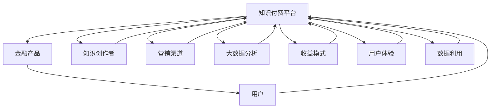

                 

## 1. 背景介绍

在数字化和互联网时代的浪潮中，知识付费作为一种新型的商业模式，正在迅速崛起。它不仅改变了传统教育行业，也在金融、企业培训、职业发展等领域产生了广泛影响。随着人工智能和大数据技术的发展，知识付费与金融行业的跨界合作成为新的趋势。本文旨在探讨如何通过知识付费实现跨界营销，并在金融领域创造更大的价值。

### 1.1 问题由来

知识付费平台的兴起，使得知识内容的价值得到充分挖掘和利用。用户不再满足于免费的公开信息，而是愿意为高质量、有深度的知识内容支付费用。这不仅为内容创作者提供了稳定的收入来源，也为内容分发平台带来了新的商业机会。金融行业作为知识密集型领域，自然成为了知识付费跨界营销的理想对象。

### 1.2 问题核心关键点

知识付费与金融跨界合作的核心关键点在于如何高效利用知识内容，提升金融产品的吸引力和用户体验，同时为知识创作者和平台带来实际收益。主要包括以下几点：

- **内容价值**：设计有价值的金融课程或服务，能够解决用户的实际问题，提高投资回报率或理财效率。
- **用户体验**：打造便捷、高效的知识获取途径，提升用户的学习体验和满意度。
- **收益模式**：探索多样化的收益模式，包括订阅费、按需购买、投资分成等，确保知识创作者和平台的可持续发展。
- **数据利用**：充分挖掘用户行为数据，进行精准营销和个性化推荐，提升营销效果和用户粘性。

## 2. 核心概念与联系

### 2.1 核心概念概述

- **知识付费**：通过付费方式，获取高质量、有深度的知识内容，满足用户的学习和成长需求。

- **跨界营销**：将知识付费与金融等行业跨界融合，通过知识传播提升产品和服务价值，同时为知识创作者和平台创造收益。

- **金融跨界**：将知识付费与金融业务结合，利用知识内容提升金融产品的吸引力，同时为金融业务带来新的用户和市场机会。

- **用户体验**：通过技术手段和内容设计，提升用户获取知识和应用金融产品的便利性和满意度。

- **收益模式**：探索和创新知识付费的收益模式，确保平台和创作者的经济利益。

- **数据利用**：通过大数据分析，实现精准营销和个性化推荐，提升营销效果和用户粘性。

这些核心概念之间存在紧密联系，共同构成了知识付费与金融跨界营销的逻辑框架。

### 2.2 核心概念原理和架构的 Mermaid 流程图



## 3. 核心算法原理 & 具体操作步骤

### 3.1 算法原理概述

知识付费与金融跨界营销的核心算法原理，在于通过精准推荐和个性化服务，提升用户对金融产品的认知和使用率。具体步骤如下：

1. **内容构建**：设计有价值的金融课程或服务，涵盖金融基础知识、投资策略、理财规划等方面。
2. **数据挖掘**：利用大数据分析技术，对用户行为、兴趣、需求进行深入挖掘，进行精准营销。
3. **推荐算法**：采用协同过滤、基于内容的推荐等算法，为用户推荐最符合其需求的金融产品。
4. **用户反馈**：通过用户行为数据，不断优化内容和推荐算法，提升用户体验和满意度。
5. **收益模式**：探索多样化的收益模式，确保知识创作者和平台的经济利益。

### 3.2 算法步骤详解

#### 3.2.1 内容构建

- **课程设计**：邀请金融专家和学者，设计有深度、有价值的金融课程，涵盖投资、理财、风险管理等方面。
- **内容审核**：对课程内容进行审核，确保知识的准确性和实用性。
- **内容包装**：将课程内容制作成易于用户理解和应用的形式，如视频、文章、音频等。

#### 3.2.2 数据挖掘

- **用户画像**：通过问卷调查、数据分析等方式，建立用户画像，了解用户的兴趣、需求、消费习惯等。
- **行为分析**：利用大数据技术，对用户的行为数据进行深入分析，识别用户的偏好和需求。
- **推荐算法**：采用协同过滤、基于内容的推荐等算法，为用户推荐最符合其需求的金融产品。

#### 3.2.3 推荐算法

- **协同过滤**：根据用户的行为数据和偏好，推荐类似的产品或课程。
- **基于内容的推荐**：根据课程内容的关键词和标签，为用户推荐相关产品。
- **混合推荐**：结合多种推荐算法，提升推荐效果和准确性。

#### 3.2.4 用户反馈

- **反馈收集**：通过用户评价、互动等方式，收集用户的反馈信息。
- **数据分析**：对用户反馈数据进行分析，发现用户需求和改进点。
- **内容优化**：根据用户反馈，不断优化课程内容和推荐算法。

#### 3.2.5 收益模式

- **订阅制**：用户购买课程或服务的年度或月度订阅。
- **按需购买**：用户根据需要，单次购买课程或服务。
- **投资分成**：用户通过购买课程推荐的金融产品，平台与创作者分享收益。

### 3.3 算法优缺点

#### 3.3.1 优点

- **提升用户价值**：通过精准推荐和个性化服务，提升用户对金融产品的认知和使用率，提高用户的投资回报率。
- **增强平台收益**：通过多样化的收益模式，确保知识创作者和平台的经济利益。
- **优化用户体验**：通过技术手段和内容设计，提升用户获取知识和应用金融产品的便利性和满意度。

#### 3.3.2 缺点

- **内容质量依赖专家**：课程和服务的质量依赖于专家的知识和经验，需要持续投入资源进行内容更新和优化。
- **技术门槛较高**：推荐算法和大数据分析技术需要较高的技术门槛，对平台的开发和运维能力要求较高。
- **用户粘性管理**：如何保持用户的高频次使用和粘性，是跨界营销面临的重要挑战。

### 3.4 算法应用领域

知识付费与金融跨界营销主要应用于以下几个领域：

- **在线教育平台**：如Coursera、Udacity等，通过与金融机构的合作，推出金融类课程。
- **金融投资平台**：如雪球、同花顺等，提供金融知识的订阅服务和投资建议。
- **理财平台**：如支付宝、理财通等，通过推荐优质课程提升用户理财水平。
- **职业培训平台**：如网易云课堂、知乎live等，推出金融相关的职业培训课程。

## 4. 数学模型和公式 & 详细讲解 & 举例说明

### 4.1 数学模型构建

假设知识付费平台有$N$个用户，每个用户有$m$个行为记录，每个行为记录可以表示为$(i,j,v)$，其中$i$为用户ID，$j$为行为类型（如课程观看、投资操作等），$v$为行为价值（如观看时长、投资收益等）。通过大数据分析，可以得到用户行为矩阵$X$和行为价值矩阵$Y$。设平台推荐的金融产品为$C$，课程与产品之间的关联矩阵为$W$。

### 4.2 公式推导过程

#### 4.2.1 协同过滤推荐算法

协同过滤算法可以分为基于用户的协同过滤和基于物品的协同过滤两种。基于用户的协同过滤算法公式如下：

$$
\hat{v}_{ui} = \frac{\sum_{j \in I} v_{uj} r_{ji}}{\sqrt{\sum_{j \in I} r_{ji}^2} \sqrt{\sum_{j \in I} v_{uj}^2}}
$$

其中，$v_{ui}$为用户$u$对物品$i$的预测评分，$v_{uj}$为物品$j$的实际评分，$r_{ji}$为物品$j$和$i$之间的相似度，$I$为物品集合。

基于物品的协同过滤算法公式如下：

$$
\hat{v}_{ui} = \frac{\sum_{k \in K} v_{ik} r_{kj}}{\sqrt{\sum_{k \in K} r_{kj}^2} \sqrt{\sum_{k \in K} v_{ik}^2}}
$$

其中，$v_{ik}$为用户$k$对物品$i$的实际评分，$r_{kj}$为物品$k$和$j$之间的相似度，$K$为用户集合。

#### 4.2.2 基于内容的推荐算法

基于内容的推荐算法可以根据课程内容与金融产品的相似度进行推荐。设课程$i$和产品$j$的相似度为$s_{ij}$，则推荐公式为：

$$
\hat{v}_{ui} = \sum_{j=1}^M s_{ij} v_{uj}
$$

其中，$v_{uj}$为用户$u$对产品$j$的实际评分，$M$为产品集合。

### 4.3 案例分析与讲解

#### 4.3.1 案例背景

某在线教育平台与某金融机构合作，推出了金融投资课程。平台通过大数据分析，发现大部分用户对股票和基金投资较为感兴趣，但缺乏系统的理财知识。平台决定推出一系列针对投资新手的课程，同时与金融机构合作推出相关金融产品。

#### 4.3.2 数据分析

平台通过问卷调查和行为分析，发现用户最常查看的课程主题为“股票基础知识”、“基金投资策略”等，且用户观看时长和互动频率较高。同时，通过行为分析发现，用户对推荐的金融产品（如某基金）的购买和持有时间较长，投资收益稳定。

#### 4.3.3 推荐算法

平台采用基于用户的协同过滤算法和基于内容的推荐算法相结合的方式，为用户推荐最符合其需求的课程和产品。具体步骤如下：

1. 对用户行为数据进行聚类分析，识别出不同兴趣群体的特征。
2. 对课程和金融产品进行内容分析，提取关键词和标签。
3. 根据用户画像和行为数据，对用户进行个性化推荐。
4. 根据用户反馈和行为数据，不断优化推荐算法和课程内容。

## 5. 项目实践：代码实例和详细解释说明

### 5.1 开发环境搭建

知识付费与金融跨界营销的项目开发环境需要具备以下条件：

1. 高性能服务器：用于存储用户数据和计算推荐算法。
2. 大数据平台：如Hadoop、Spark等，用于存储和处理用户行为数据。
3. 推荐系统框架：如TensorFlow、PyTorch等，用于构建推荐算法模型。
4. 编程语言：如Python、Java等，用于开发推荐算法和知识内容平台。

### 5.2 源代码详细实现

#### 5.2.1 用户行为数据收集

通过Web应用和移动应用，收集用户的行为数据，包括课程观看时长、投资操作等。数据存储在Hadoop中，通过Spark进行数据处理和分析。

```python
from pyspark.sql import SparkSession

spark = SparkSession.builder.appName("user_behavior_analysis").getOrCreate()
user_data = spark.read.format("csv").option("header", "true").load("user_behavior_data.csv")
```

#### 5.2.2 协同过滤推荐算法

利用TensorFlow实现基于用户的协同过滤推荐算法。代码如下：

```python
import tensorflow as tf

# 定义协同过滤模型
class CollaborativeFiltering(tf.keras.Model):
    def __init__(self, num_users, num_items, embedding_dim):
        super(CollaborativeFiltering, self).__init__()
        self.user_embedding = tf.keras.layers.Embedding(num_users, embedding_dim)
        self.item_embedding = tf.keras.layers.Embedding(num_items, embedding_dim)
        self.similarity = tf.keras.layers.Dot(axes=1, normalize=True)

    def call(self, user, item):
        user_embeddings = self.user_embedding(user)
        item_embeddings = self.item_embedding(item)
        similarities = self.similarity(user_embeddings, item_embeddings)
        return tf.nn.softmax(similarities)

# 训练协同过滤模型
model = CollaborativeFiltering(num_users, num_items, embedding_dim)
model.compile(optimizer="adam", loss="categorical_crossentropy", metrics=["accuracy"])
model.fit(user_data, item_data, epochs=10)
```

#### 5.2.3 基于内容的推荐算法

利用TensorFlow实现基于内容的推荐算法。代码如下：

```python
import tensorflow as tf

# 定义基于内容的推荐模型
class ContentBasedRecommender(tf.keras.Model):
    def __init__(self, num_items, embedding_dim):
        super(ContentBasedRecommender, self).__init__()
        self.item_embedding = tf.keras.layers.Embedding(num_items, embedding_dim)
        self.content_similarity = tf.keras.layers.Dot(axes=1, normalize=True)

    def call(self, item):
        item_embeddings = self.item_embedding(item)
        content_similarities = self.content_similarity(item_embeddings)
        return tf.nn.softmax(content_similarities)

# 训练基于内容的推荐模型
model = ContentBasedRecommender(num_items, embedding_dim)
model.compile(optimizer="adam", loss="categorical_crossentropy", metrics=["accuracy"])
model.fit(item_data, user_data, epochs=10)
```

#### 5.2.4 混合推荐算法

将协同过滤和基于内容的推荐算法相结合，提升推荐效果。代码如下：

```python
import tensorflow as tf

# 定义混合推荐模型
class HybridRecommender(tf.keras.Model):
    def __init__(self, num_users, num_items, embedding_dim):
        super(HybridRecommender, self).__init__()
        self.user_embedding = tf.keras.layers.Embedding(num_users, embedding_dim)
        self.item_embedding = tf.keras.layers.Embedding(num_items, embedding_dim)
        self.similarity = tf.keras.layers.Dot(axes=1, normalize=True)
        self.content_similarity = tf.keras.layers.Dot(axes=1, normalize=True)

    def call(self, user, item):
        user_embeddings = self.user_embedding(user)
        item_embeddings = self.item_embedding(item)
        similarities = self.similarity(user_embeddings, item_embeddings)
        content_similarities = self.content_similarity(item_embeddings)
        return tf.nn.softmax(similarities + content_similarities)

# 训练混合推荐模型
model = HybridRecommender(num_users, num_items, embedding_dim)
model.compile(optimizer="adam", loss="categorical_crossentropy", metrics=["accuracy"])
model.fit(user_data, item_data, epochs=10)
```

### 5.3 代码解读与分析

#### 5.3.1 用户行为数据收集

用户行为数据的收集是推荐系统的基础。通过Web应用和移动应用，收集用户的行为数据，包括课程观看时长、投资操作等。数据存储在Hadoop中，通过Spark进行数据处理和分析。

#### 5.3.2 协同过滤推荐算法

协同过滤算法通过用户行为数据和物品评分数据，为用户推荐相似的物品。在代码中，我们定义了一个协同过滤模型，使用嵌入层和相似度层进行计算。模型训练采用Adam优化器和交叉熵损失函数。

#### 5.3.3 基于内容的推荐算法

基于内容的推荐算法通过课程内容与金融产品的相似度，为用户推荐相关产品。在代码中，我们定义了一个基于内容的推荐模型，使用嵌入层和相似度层进行计算。模型训练采用Adam优化器和交叉熵损失函数。

#### 5.3.4 混合推荐算法

混合推荐算法结合协同过滤和基于内容的推荐算法，提升推荐效果。在代码中，我们定义了一个混合推荐模型，使用嵌入层、相似度层和内容相似度层进行计算。模型训练采用Adam优化器和交叉熵损失函数。

## 6. 实际应用场景

### 6.1 智能投顾平台

智能投顾平台通过知识付费与金融跨界营销，为用户提供个性化的投资建议和理财服务。平台通过收集用户的理财行为数据，利用协同过滤和基于内容的推荐算法，为用户推荐适合的投资产品。同时，平台还推出在线课程，帮助用户提升理财知识水平，提高投资回报率。

### 6.2 在线教育平台

在线教育平台通过与金融机构合作，推出金融投资类课程，提升用户理财水平。平台通过大数据分析，识别用户对金融产品的需求，利用协同过滤和基于内容的推荐算法，为用户推荐适合的金融产品。同时，平台还推出在线课程，帮助用户系统学习金融知识，提升投资决策能力。

### 6.3 银行理财服务

银行理财服务通过知识付费与金融跨界营销，为用户提供个性化的理财规划和投资建议。平台通过收集用户的理财行为数据，利用协同过滤和基于内容的推荐算法，为用户推荐适合的理财产品。同时，平台还推出在线课程，帮助用户提升理财知识水平，提高投资回报率。

### 6.4 未来应用展望

未来，知识付费与金融跨界营销将在更多领域得到应用，为传统行业带来变革性影响。

在智慧城市治理中，平台通过知识付费与金融跨界营销，提升政府决策的科学性和精准性。在农业领域，平台通过知识付费与金融跨界营销，提升农业生产效率和农民收益水平。在环保领域，平台通过知识付费与金融跨界营销，推动绿色投资和可持续发展。

## 7. 工具和资源推荐

### 7.1 学习资源推荐

为了帮助开发者系统掌握知识付费与金融跨界营销的理论基础和实践技巧，这里推荐一些优质的学习资源：

1. **《知识付费商业模式研究》**：深入解析知识付费的商业模式和运营策略，适合从业者和创业者参考。
2. **《金融产品设计与开发》**：全面介绍金融产品的设计和开发过程，适合产品经理和技术开发者学习。
3. **《机器学习与推荐系统》**：深入介绍机器学习和大数据推荐系统，适合数据科学家和推荐系统开发者学习。
4. **《金融知识付费课程开发》**：详细讲解金融知识付费课程的开发流程和内容设计，适合内容创作者和平台运营者参考。

### 7.2 开发工具推荐

高效的知识付费与金融跨界营销开发离不开优秀的工具支持。以下是几款常用的开发工具：

1. **Hadoop和Spark**：用于大数据处理和分析，适合存储和处理用户行为数据。
2. **TensorFlow和PyTorch**：用于推荐算法和模型训练，适合构建协同过滤和基于内容的推荐算法。
3. **SQL和NoSQL数据库**：用于数据存储和管理，适合存储用户行为数据和课程内容。
4. **Jupyter Notebook和Google Colab**：用于数据探索和算法验证，适合快速迭代和共享学习笔记。

### 7.3 相关论文推荐

知识付费与金融跨界营销的研究源于学界的持续研究。以下是几篇奠基性的相关论文，推荐阅读：

1. **《知识付费的市场潜力和商业模型》**：探讨知识付费的市场前景和商业模型，适合从业者和创业者参考。
2. **《基于协同过滤的推荐系统研究》**：深入解析协同过滤算法的原理和实现，适合推荐系统开发者学习。
3. **《金融科技与知识付费的融合》**：介绍金融科技与知识付费的融合应用，适合金融从业者和技术开发者参考。

## 8. 总结：未来发展趋势与挑战

### 8.1 总结

本文对知识付费与金融跨界营销的方法进行了全面系统的介绍。首先阐述了知识付费和金融跨界营销的背景和意义，明确了跨界合作的重要价值。其次，从原理到实践，详细讲解了协同过滤和基于内容的推荐算法的原理和操作步骤，给出了推荐任务开发的完整代码实例。同时，本文还广泛探讨了知识付费与金融跨界营销在智能投顾、在线教育、银行理财等领域的应用前景，展示了跨界营销范式的巨大潜力。

通过本文的系统梳理，可以看到，知识付费与金融跨界营销通过精准推荐和个性化服务，提升用户对金融产品的认知和使用率，提高用户的投资回报率。未来，随着技术的不断发展，知识付费与金融跨界营销将在更多领域得到应用，为传统行业带来变革性影响。

### 8.2 未来发展趋势

展望未来，知识付费与金融跨界营销将呈现以下几个发展趋势：

1. **技术手段多样化**：随着人工智能和大数据技术的不断进步，推荐算法和数据处理技术将更加先进，提升推荐效果和用户体验。
2. **用户体验个性化**：利用自然语言处理和图像识别等技术，提升用户获取知识和应用金融产品的便利性和满意度。
3. **数据应用场景广泛**：大数据分析将在更多领域得到应用，推动知识付费与金融跨界营销的发展。
4. **多渠道融合**：知识付费与金融跨界营销将在多渠道（如Web、移动应用、社交媒体等）融合，提升用户粘性和转化率。
5. **可持续发展**：通过多样化的收益模式，确保知识创作者和平台的经济利益，推动可持续发展。

### 8.3 面临的挑战

尽管知识付费与金融跨界营销取得了显著成效，但在迈向更加智能化、普适化应用的过程中，仍面临诸多挑战：

1. **内容质量保障**：课程和金融产品的质量保障需要持续投入资源进行内容更新和优化。
2. **技术门槛较高**：推荐算法和大数据分析技术需要较高的技术门槛，对平台的开发和运维能力要求较高。
3. **用户粘性管理**：如何保持用户的高频次使用和粘性，是跨界营销面临的重要挑战。
4. **收益模式创新**：如何探索多样化的收益模式，确保平台和创作者的经济利益。
5. **数据安全和隐私**：如何在保障用户数据安全和隐私的前提下，进行精准营销和个性化推荐。

### 8.4 研究展望

面对知识付费与金融跨界营销面临的挑战，未来的研究需要在以下几个方面寻求新的突破：

1. **内容质量提升**：通过自动化内容审核和用户反馈机制，提升课程和金融产品的质量。
2. **技术手段创新**：引入深度学习、强化学习等前沿技术，提升推荐算法和数据处理能力。
3. **用户体验优化**：利用自然语言处理和图像识别等技术，提升用户获取知识和应用金融产品的便利性和满意度。
4. **收益模式多样化**：探索多样化的收益模式，确保平台和创作者的经济利益，如按需购买、投资分成等。
5. **数据安全和隐私保护**：通过数据匿名化、加密等技术，保障用户数据安全和隐私。

这些研究方向的探索，将推动知识付费与金融跨界营销技术向更高的台阶发展，为构建更加智能、普适、可持续的金融服务体系提供技术支持。

## 9. 附录：常见问题与解答

**Q1: 知识付费与金融跨界营销的难点在哪里？**

A: 知识付费与金融跨界营销的难点主要在于以下几个方面：
1. **内容质量保障**：课程和金融产品的质量保障需要持续投入资源进行内容更新和优化。
2. **技术门槛较高**：推荐算法和大数据分析技术需要较高的技术门槛，对平台的开发和运维能力要求较高。
3. **用户粘性管理**：如何保持用户的高频次使用和粘性，是跨界营销面临的重要挑战。

**Q2: 如何提高知识付费与金融跨界营销的推荐效果？**

A: 提高知识付费与金融跨界营销的推荐效果主要需要以下几个方面的努力：
1. **数据质量提升**：收集和清洗高质量的用户行为数据，确保推荐算法的数据基础。
2. **推荐算法优化**：采用多样化的推荐算法，如协同过滤、基于内容的推荐、混合推荐等，提升推荐效果和准确性。
3. **内容质量提升**：通过自动化内容审核和用户反馈机制，提升课程和金融产品的质量。
4. **用户体验优化**：利用自然语言处理和图像识别等技术，提升用户获取知识和应用金融产品的便利性和满意度。
5. **收益模式创新**：探索多样化的收益模式，确保平台和创作者的经济利益，如按需购买、投资分成等。

**Q3: 知识付费与金融跨界营销在实际应用中有哪些案例？**

A: 知识付费与金融跨界营销在实际应用中有以下几个典型案例：
1. **智能投顾平台**：如基金公司推出的智能投顾服务，通过知识付费和金融跨界营销，提升用户的理财水平和投资回报率。
2. **在线教育平台**：如Coursera、Udacity等平台与金融机构合作，推出金融投资类课程，提升用户理财水平。
3. **银行理财服务**：如银行推出的理财课程和投资建议，通过知识付费和金融跨界营销，提升用户的理财知识和投资回报率。

---

作者：禅与计算机程序设计艺术 / Zen and the Art of Computer Programming

