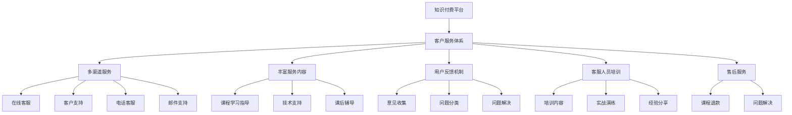

                 

# 知识付费要建立完善的客户服务体系

> 关键词：知识付费,客户服务体系,用户满意度,市场竞争力,售后服务

## 1. 背景介绍

### 1.1 问题由来
随着互联网技术的快速发展，知识付费市场正在快速崛起。各类型知识付费平台的兴起，为人们提供了一个便捷获取知识，提升自身素质的平台。然而，在知识付费平台迅速扩张的同时，也伴随着用户服务体验差、客户投诉多等问题的出现。这些问题不仅影响了用户满意度，还影响了平台的市场竞争力和可持续发展。因此，构建完善的客户服务体系，提升用户体验，是知识付费平台当前亟需解决的问题。

### 1.2 问题核心关键点
知识付费客户服务体系的核心在于如何通过多渠道、多环节的服务触点，满足用户不同层面的需求，及时解决用户问题，提升用户满意度和忠诚度。具体来说，需要从以下几个方面入手：

1. **渠道建设**：建立线上线下结合的多渠道服务体系，满足不同用户的需求。
2. **服务内容**：提供丰富的服务内容，如课程学习指导、技术支持、课后辅导等。
3. **反馈机制**：建立用户反馈机制，及时收集用户意见，优化服务质量。
4. **培训提升**：加强客服人员培训，提升服务质量和专业性。
5. **售后服务**：提供完善的售后服务，包括课程退款、问题解决等。

### 1.3 问题研究意义
构建完善的客户服务体系，对知识付费平台而言具有重要意义：

1. **提升用户满意度**：良好的客户服务能增强用户粘性，提升用户满意度和平台口碑。
2. **提升市场竞争力**：优秀的客户服务能够提升平台在市场中的竞争力，吸引更多优质用户。
3. **促进可持续发展**：优质的服务能够提升平台的核心竞争力，增加用户续费率和推荐率，实现可持续增长。
4. **保障平台声誉**：完善的服务体系能够有效处理用户投诉，保障平台声誉。
5. **优化用户体验**：通过多渠道、多环节的服务触点，优化用户体验，提高用户获取知识的效率和效果。

## 2. 核心概念与联系

### 2.1 核心概念概述

在探讨知识付费客户服务体系的构建时，涉及以下几个核心概念：

- **知识付费平台**：指通过互联网提供知识服务的平台，如得到、喜马拉雅等。
- **客户服务体系**：指平台提供的多渠道、多环节的服务触点，覆盖用户咨询、购买、学习、售后等环节。
- **用户满意度**：指用户对平台提供的服务质量和体验的评价。
- **市场竞争力**：指平台在市场上的竞争力和吸引力。
- **售后服务**：指平台为用户提供课程退款、问题解决等服务，提升用户满意度。

这些核心概念之间存在着紧密的联系，通过综合运用多渠道服务体系、提供丰富的服务内容、建立用户反馈机制、加强客服人员培训以及提供完善的售后服务，可以显著提升用户满意度，增强平台市场竞争力。

### 2.2 核心概念原理和架构的 Mermaid 流程图



这个流程图展示了知识付费平台客户服务体系的基本架构，包括多渠道服务、丰富服务内容、用户反馈机制、客服人员培训以及完善的售后服务等环节。

## 3. 核心算法原理 & 具体操作步骤
### 3.1 算法原理概述

知识付费客户服务体系的构建，本质上是一个系统性的工程，涉及多个环节和要素的协同运作。其核心算法原理可以概括为：

1. **用户画像分析**：通过收集和分析用户行为数据，建立用户画像，了解用户需求和偏好。
2. **多渠道服务触点布局**：在用户咨询、购买、学习、售后等环节，合理布局多渠道服务触点，提升用户满意度。
3. **服务质量优化**：通过用户反馈机制，持续收集用户意见，优化服务质量。
4. **客服人员培训**：加强客服人员培训，提升服务质量和专业性。
5. **售后服务保障**：提供完善的售后服务，保障用户权益。

### 3.2 算法步骤详解

构建知识付费客户服务体系，通常遵循以下步骤：

**Step 1: 用户画像分析**
- 收集用户行为数据，如课程购买记录、学习时间、提问频率等。
- 使用机器学习算法，建立用户画像模型，分析用户需求和偏好。
- 根据用户画像，设计个性化的服务方案。

**Step 2: 多渠道服务触点布局**
- 根据用户画像，确定用户主要使用的服务渠道，如在线客服、电话客服、邮件支持等。
- 建立统一的用户服务平台，提供跨渠道的服务支持。
- 对多渠道服务进行合理布局，确保用户可以方便地获取所需服务。

**Step 3: 服务内容设计**
- 根据用户画像和需求，设计丰富的服务内容，如课程学习指导、技术支持、课后辅导等。
- 对服务内容进行分类和标准化，确保服务质量的一致性。
- 提供灵活的服务选择，满足不同用户的需求。

**Step 4: 建立用户反馈机制**
- 建立用户反馈渠道，如在线问卷、客服热线等，收集用户意见和建议。
- 对反馈数据进行分类和分析，识别常见问题和改进点。
- 根据分析结果，持续优化服务内容和质量。

**Step 5: 加强客服人员培训**
- 定期对客服人员进行培训，提升其专业技能和服务质量。
- 通过实战演练和经验分享，提高客服人员的服务水平。
- 建立完善的考核机制，确保客服人员的服务质量。

**Step 6: 提供完善的售后服务**
- 提供课程退款、问题解决等售后服务，提升用户满意度。
- 建立售后支持机制，确保用户权益得到保障。
- 收集售后反馈，持续优化服务质量。

### 3.3 算法优缺点

知识付费客户服务体系的构建，具有以下优点：

1. **提升用户满意度**：通过多渠道、多环节的服务触点，满足用户不同层面的需求，及时解决用户问题，提升用户满意度。
2. **增强市场竞争力**：优秀的客户服务能够提升平台在市场中的竞争力，吸引更多优质用户。
3. **促进可持续发展**：优质的服务能够提升平台的核心竞争力，增加用户续费率和推荐率，实现可持续增长。
4. **保障平台声誉**：完善的服务体系能够有效处理用户投诉，保障平台声誉。
5. **优化用户体验**：通过多渠道、多环节的服务触点，优化用户体验，提高用户获取知识的效率和效果。

然而，构建客户服务体系也面临一些挑战：

1. **资源投入大**：客户服务体系的建设需要大量的人力和物力投入，成本较高。
2. **服务内容复杂**：服务内容的种类和质量要求高，难以统一标准化。
3. **用户需求多样**：不同用户的需求和反馈各异，难以全面满足。
4. **客服人员培训难度大**：需要持续培训客服人员，提升服务质量。
5. **问题处理难度高**：复杂的服务内容和多渠道触点，可能导致问题处理难度增加。

### 3.4 算法应用领域

知识付费客户服务体系的应用领域广泛，涉及多个行业和场景：

1. **在线教育**：提供课程学习指导、技术支持、课后辅导等服务，提升用户学习效果。
2. **职业技能培训**：提供技术支持和课程退款等服务，满足不同职业的需求。
3. **知识内容分享**：提供课程退款、问题解决等服务，保障用户权益。
4. **知识社区**：提供用户反馈机制，优化内容和服务，提升用户满意度。
5. **知识服务推广**：通过多渠道服务触点，推广知识服务，提升市场竞争力。

## 4. 数学模型和公式 & 详细讲解  
### 4.1 数学模型构建

构建知识付费客户服务体系的数学模型，可以包括以下几个关键要素：

1. **用户画像模型**：通过收集用户行为数据，建立用户画像模型，描述用户的基本特征和需求。
2. **多渠道服务模型**：根据用户画像，设计多渠道服务模型，描述不同服务渠道的布局和用户触点。
3. **服务质量模型**：通过用户反馈数据，建立服务质量模型，描述服务质量的好坏。
4. **客服人员培训模型**：通过服务质量数据和用户反馈数据，建立客服人员培训模型，描述客服人员的培训效果和考核机制。
5. **售后服务保障模型**：通过用户投诉数据，建立售后服务保障模型，描述售后服务的保障效果和用户满意度。

### 4.2 公式推导过程

以下我们将以用户画像模型为例，推导相关的数学公式。

假设用户画像模型由 $U=\{u_1, u_2, ..., u_N\}$ 组成，每个用户画像 $u_i$ 包含特征 $f_{i1}, f_{i2}, ..., f_{im}$，其中 $m$ 为特征维度。用户画像模型可以表示为：

$$
u_i = (f_{i1}, f_{i2}, ..., f_{im})
$$

用户画像的相似度可以通过余弦相似度计算，公式如下：

$$
sim(u_i, u_j) = \frac{\vec{u_i} \cdot \vec{u_j}}{||\vec{u_i}|| \cdot ||\vec{u_j}||}
$$

其中 $\vec{u_i}$ 和 $\vec{u_j}$ 分别为用户画像 $u_i$ 和 $u_j$ 的特征向量。通过计算用户画像的相似度，可以识别出具有相似需求和偏好的用户群体。

### 4.3 案例分析与讲解

假设某知识付费平台收集了1000名用户的课程购买记录、学习时间和提问频率等数据，建立用户画像模型。通过余弦相似度计算，发现用户A和用户B在课程购买记录和学习时间上具有较高相似度，可以认为他们有相似的需求和偏好。因此，平台可以为A和B推荐类似课程，提升用户体验和满意度。

## 5. 项目实践：代码实例和详细解释说明
### 5.1 开发环境搭建

在进行客户服务体系构建的开发实践前，需要准备相应的开发环境：

1. 安装Python和相关依赖包：如numpy、pandas、scikit-learn、transformers等。
2. 安装Flask和Gunicorn，搭建Web应用和服务器。
3. 配置数据库，如MySQL或PostgreSQL，存储用户数据和反馈信息。
4. 部署多渠道服务触点，如在线客服、电话客服、邮件支持等。

### 5.2 源代码详细实现

以下是一个简单的Python代码示例，用于构建用户画像模型和推荐类似课程：

```python
import pandas as pd
from sklearn.metrics.pairwise import cosine_similarity

# 读取用户数据
df = pd.read_csv('user_data.csv')

# 特征选择和编码
features = ['purchase_time', 'study_time', 'question_frequency']
df = df[features]

# 标准化处理
df = (df - df.mean()) / df.std()

# 计算用户画像的余弦相似度
similarity_matrix = cosine_similarity(df)

# 推荐类似课程
def recommend_course(user, top_k=5):
    similarity_scores = list(enumerate(similarity_matrix[user]))
    similarity_scores = sorted(similarity_scores, key=lambda x: x[1], reverse=True)
    recommended_users = [user for user, score in similarity_scores][1: top_k + 1]
    return df[recommended_users]

# 测试推荐结果
user_id = 123
recommended_courses = recommend_course(user_id)
print(recommended_courses)
```

### 5.3 代码解读与分析

这段代码使用了pandas和scikit-learn库，对用户数据进行特征选择、标准化和余弦相似度计算。通过余弦相似度，可以识别出与指定用户具有较高相似度的用户群体，并推荐类似课程，提升用户满意度。

### 5.4 运行结果展示

运行上述代码，可以得到类似用户的推荐列表。例如，对于用户ID为123的用户，可能会推荐用户ID为456、789等类似用户所购买的课程，提升用户体验。

## 6. 实际应用场景

### 6.1 在线教育

在线教育平台通过多渠道服务体系，可以提升用户学习效果。具体来说：

- **课程学习指导**：提供课程学习计划、学习技巧等服务，帮助用户更好地掌握知识。
- **技术支持**：提供课程播放、设备调试等服务，解决用户技术问题。
- **课后辅导**：提供课后习题解答、作业批改等服务，帮助用户巩固知识。

通过这些服务，平台能够提升用户学习体验，增加用户续费率和推荐率。

### 6.2 职业技能培训

职业技能培训平台通过多渠道服务体系，可以满足不同职业的需求。具体来说：

- **技术支持**：提供技术指导、编程环境配置等服务，帮助用户掌握技能。
- **课程退款**：提供灵活的课程退款机制，保障用户权益。
- **问题解决**：提供技术支持、课程咨询等服务，解决用户问题。

通过这些服务，平台能够提升用户技能水平，增加用户续费率和推荐率。

### 6.3 知识内容分享

知识内容分享平台通过多渠道服务体系，可以提升用户满意度。具体来说：

- **课程退款**：提供灵活的课程退款机制，保障用户权益。
- **问题解决**：提供问题解答、课程咨询等服务，解决用户问题。
- **用户反馈**：建立用户反馈机制，持续优化内容和服务，提升用户满意度。

通过这些服务，平台能够提升用户满意度，增加用户续费率和推荐率。

### 6.4 知识社区

知识社区平台通过多渠道服务体系，可以优化内容和服务。具体来说：

- **用户反馈**：建立用户反馈机制，持续优化内容和服务，提升用户满意度。
- **问题解决**：提供问题解答、课程咨询等服务，解决用户问题。
- **知识推广**：通过多渠道服务触点，推广优质知识内容，提升平台吸引力。

通过这些服务，平台能够优化内容和服务，提升用户满意度，增加用户续费率和推荐率。

### 6.5 知识服务推广

知识服务推广平台通过多渠道服务体系，可以提升市场竞争力。具体来说：

- **用户反馈**：建立用户反馈机制，持续优化服务内容，提升用户满意度。
- **问题解决**：提供问题解答、课程咨询等服务，解决用户问题。
- **多渠道触点**：建立线上线下结合的多渠道服务触点，提升用户粘性和平台吸引力。

通过这些服务，平台能够提升市场竞争力，增加用户续费率和推荐率。

## 7. 工具和资源推荐
### 7.1 学习资源推荐

为了帮助开发者系统掌握知识付费客户服务体系的构建理论基础和实践技巧，这里推荐一些优质的学习资源：

1. **《客户关系管理》课程**：多所知名大学开设的客户关系管理课程，涵盖客户服务体系、用户画像、服务质量优化等内容。
2. **《用户体验设计》书籍**：介绍用户体验设计的基本原则和方法，提升平台的用户满意度。
3. **《客户服务最佳实践》书籍**：介绍客户服务体系建设的成功案例和方法，提供实战经验。
4. **《数据科学》课程**：多所知名大学开设的数据科学课程，涵盖数据分析、机器学习等内容，提升数据驱动的服务质量。
5. **《客户服务软件工具》推荐**：推荐一些优秀的客户服务软件工具，如Zendesk、Freshdesk等，提升服务效率和质量。

通过这些学习资源，相信你一定能够快速掌握知识付费客户服务体系的构建精髓，并用于解决实际的客户服务问题。

### 7.2 开发工具推荐

高效的开发离不开优秀的工具支持。以下是几款用于客户服务体系开发的常用工具：

1. **Flask**：Python Web框架，适合快速开发客户服务应用。
2. **Gunicorn**：Python Web应用服务器，支持负载均衡和并发处理。
3. **MySQL/PostgreSQL**：数据库系统，适合存储用户数据和反馈信息。
4. **nginx**：Web服务器，支持负载均衡和静态资源缓存。
5. **Redmine**：开源项目管理工具，适合管理客户服务项目和任务。

合理利用这些工具，可以显著提升客户服务体系的开发效率，加快创新迭代的步伐。

### 7.3 相关论文推荐

客户服务体系的发展源于学界的持续研究。以下是几篇奠基性的相关论文，推荐阅读：

1. **《客户关系管理：概念、战略和实施》**：介绍客户关系管理的概念、战略和实施方法，提供系统化的客户服务体系构建思路。
2. **《用户体验设计：原则与实践》**：介绍用户体验设计的基本原则和方法，提升平台的用户满意度。
3. **《客户服务管理：最佳实践与案例分析》**：介绍客户服务管理的最佳实践与案例分析，提供实用的服务质量优化方法。
4. **《数据驱动的客户服务优化》**：介绍数据驱动的客户服务优化方法，提升服务质量。
5. **《客户服务自动化与智能化》**：介绍客户服务自动化的最新技术和应用，提升服务效率和质量。

这些论文代表了大语言模型微调技术的发展脉络。通过学习这些前沿成果，可以帮助研究者把握学科前进方向，激发更多的创新灵感。

## 8. 总结：未来发展趋势与挑战

### 8.1 总结

本文对知识付费客户服务体系的构建进行了全面系统的介绍。首先阐述了客户服务体系的重要性，明确了构建客户服务体系的目的和意义。其次，从原理到实践，详细讲解了客户服务体系的数学模型和操作步骤，提供了微调任务开发的完整代码实例。同时，本文还探讨了客户服务体系在多个行业领域的应用前景，展示了客户服务范式的巨大潜力。最后，本文精选了客户服务体系的各类学习资源，力求为读者提供全方位的技术指引。

通过本文的系统梳理，可以看到，知识付费客户服务体系的构建是提升用户体验、增强市场竞争力的重要手段。构建完善的客户服务体系，可以提升用户满意度，增强平台市场竞争力，促进平台可持续发展。

### 8.2 未来发展趋势

展望未来，知识付费客户服务体系的发展趋势如下：

1. **多渠道融合**：随着技术的进步，多渠道服务触点将更加丰富和融合，提供更加无缝的用户体验。
2. **数据驱动**：数据驱动的服务优化将成为常态，通过大数据分析和机器学习，提升服务质量。
3. **智能化服务**：智能化客服、智能推荐等技术将得到广泛应用，提升服务效率和质量。
4. **个性化服务**：通过用户画像和个性化推荐，提供更加个性化的服务，提升用户满意度。
5. **跨平台协同**：跨平台、跨渠道的服务触点将更加紧密，提供无缝的用户体验。
6. **社交化服务**：社交化服务将成为重要组成部分，提升用户互动和参与度。

以上趋势凸显了知识付费客户服务体系的发展潜力。这些方向的探索发展，必将进一步提升平台的市场竞争力，带来更好的用户体验和业务价值。

### 8.3 面临的挑战

尽管知识付费客户服务体系已经取得了一定的成效，但在迈向更加智能化、普适化应用的过程中，它仍面临着诸多挑战：

1. **资源投入高**：客户服务体系的建设需要大量的人力和物力投入，成本较高。
2. **服务质量不一**：不同渠道和环节的服务质量可能存在差异，影响用户体验。
3. **用户需求多样**：不同用户的需求和反馈各异，难以全面满足。
4. **客服人员培训难度大**：需要持续培训客服人员，提升服务质量。
5. **问题处理难度高**：复杂的服务内容和多渠道触点，可能导致问题处理难度增加。

### 8.4 研究展望

面对知识付费客户服务体系面临的挑战，未来的研究需要在以下几个方面寻求新的突破：

1. **多渠道协同优化**：研究如何通过多渠道协同优化，提升服务效率和质量。
2. **服务质量提升**：研究如何通过数据驱动和智能化技术，提升服务质量。
3. **个性化服务设计**：研究如何通过用户画像和个性化推荐，提供更加个性化的服务。
4. **跨平台无缝体验**：研究如何通过技术手段，实现跨平台、跨渠道的无缝体验。
5. **社交化服务构建**：研究如何通过社交化服务，提升用户互动和参与度。

这些研究方向的发展，必将进一步提升知识付费客户服务体系的智能化和普适化水平，带来更好的用户体验和业务价值。总之，客户服务体系需要不断创新和优化，才能在激烈的市场竞争中立于不败之地。

## 9. 附录：常见问题与解答

**Q1：知识付费客户服务体系如何与用户画像结合？**

A: 客户服务体系与用户画像结合，可以通过以下步骤实现：

1. 收集用户行为数据，如课程购买记录、学习时间、提问频率等。
2. 使用机器学习算法，建立用户画像模型，描述用户的基本特征和需求。
3. 根据用户画像，设计个性化的服务方案。
4. 在服务触点中，根据用户画像提供定制化服务，提升用户体验。

通过用户画像分析，可以识别出具有相似需求和偏好的用户群体，从而提供更加个性化的服务。

**Q2：客户服务体系中的多渠道服务触点如何布局？**

A: 多渠道服务触点的布局，可以从以下几个方面考虑：

1. 根据用户画像和需求，确定用户主要使用的服务渠道，如在线客服、电话客服、邮件支持等。
2. 建立统一的用户服务平台，提供跨渠道的服务支持。
3. 对多渠道服务进行合理布局，确保用户可以方便地获取所需服务。

通过多渠道服务触点，可以提升用户体验，满足不同用户的需求，增强用户粘性和满意度。

**Q3：如何提升客服人员的服务质量？**

A: 提升客服人员的服务质量，可以从以下几个方面入手：

1. 定期对客服人员进行培训，提升其专业技能和服务质量。
2. 通过实战演练和经验分享，提高客服人员的服务水平。
3. 建立完善的考核机制，确保客服人员的服务质量。

通过持续培训和考核，可以提升客服人员的专业技能和服务质量，增强用户满意度。

**Q4：如何处理用户反馈，优化服务质量？**

A: 处理用户反馈，优化服务质量，可以从以下几个方面入手：

1. 建立用户反馈渠道，如在线问卷、客服热线等，收集用户意见和建议。
2. 对反馈数据进行分类和分析，识别常见问题和改进点。
3. 根据分析结果，持续优化服务内容和质量。

通过建立反馈机制和持续优化，可以提升服务质量，满足用户需求，提升用户满意度。

**Q5：如何构建完善的售后服务体系？**

A: 构建完善的售后服务体系，可以从以下几个方面入手：

1. 提供课程退款、问题解决等服务，提升用户满意度。
2. 建立售后支持机制，确保用户权益得到保障。
3. 收集售后反馈，持续优化服务质量。

通过完善的售后服务，可以提升用户满意度，增强用户粘性和平台吸引力。

---

作者：禅与计算机程序设计艺术 / Zen and the Art of Computer Programming

