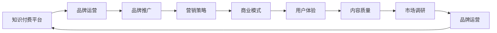

                 

# 知识付费赚钱的品牌品牌运营与品牌推广策略

> 关键词：知识付费,品牌运营,品牌推广,营销策略,商业模式,用户体验,内容质量,市场调研

## 1. 背景介绍

随着互联网和移动互联网的普及，知识付费行业逐渐成为新时代的宠儿。从在线教育、心理咨询、法律咨询到编程学习，知识付费已经覆盖了诸多垂直领域，并得到了广泛的用户认可。然而，如何运营好知识付费品牌，实现商业价值的最大化，是摆在所有知识付费平台面前的重大挑战。本文将从品牌运营和品牌推广两个角度，探讨知识付费领域的企业如何打造强势品牌，获取更多用户和收益。

### 1.1 知识付费的兴起

知识付费兴起的背景主要是两方面的原因：

1. **信息过载**：在互联网时代，人们每天接触的信息量爆炸性增长。如何甄别信息，获取真正有价值的知识，成为了社会的一种普遍需求。

2. **时间成本**：在现代社会，时间成为一种稀缺资源，很多人倾向于用货币来换取时间，希望快速高效地获取知识，而不是自己去花费大量时间通过书籍、视频等自学。

这一背景下，知识付费模式应运而生，为人们提供了一个快速、高效获取知识的平台，满足了人们对于知识获取的刚性需求。

### 1.2 知识付费的优势

1. **筛选过滤**：知识付费平台能够对知识内容进行筛选过滤，确保内容的质量和可信度。

2. **个性化推荐**：根据用户的学习历史和兴趣，推荐最符合用户需求的知识内容，提升用户粘性。

3. **高效互动**：通过付费模式，知识付费平台可以与用户建立更紧密的联系，提供更高效的服务与互动。

4. **精准营销**：知识付费平台的商业化运营，可以通过精准的营销策略，提升品牌知名度和市场份额。

5. **投资回报**：知识付费平台的用户付费行为，使得平台能够从广告、版权销售等渠道获取收益，实现盈利。

### 1.3 知识付费的挑战

尽管知识付费领域前景广阔，但也存在诸多挑战：

1. **内容同质化**：许多知识付费平台之间的内容重叠度较高，容易引发用户疲劳。

2. **用户留存低**：付费用户流失率高，如何提升用户黏性和留存率，是知识付费平台亟待解决的问题。

3. **用户体验差**：内容质量参差不齐，部分平台的用户体验不佳，导致用户流失。

4. **盈利模式单一**：依赖单一的订阅模式，缺乏多元化的盈利方式。

5. **版权问题**：大量内容缺乏原创性，版权纠纷频发。

6. **市场竞争激烈**：众多知识付费平台不断涌现，市场竞争激烈，需要持续创新才能脱颖而出。

## 2. 核心概念与联系

### 2.1 核心概念概述

为了更好地理解知识付费品牌运营与推广的策略，本节将介绍几个关键概念：

1. **知识付费**：即通过付费方式获取知识和信息的商业模式。知识付费平台通过提供高质量的知识内容，满足用户的知识需求，并获取相应的收益。

2. **品牌运营**：指在市场营销、用户服务、品牌建设等环节中，提升品牌影响力和市场竞争力，实现商业价值的最大化。

3. **品牌推广**：通过各种手段，提升品牌知名度和美誉度，吸引更多潜在用户。

4. **营销策略**：在品牌推广过程中，采用的具体策略和方法，包括内容营销、社交媒体营销、SEO优化等。

5. **商业模式**：指企业通过产品或服务创造价值并获取利润的业务模式，包括广告、订阅、内容销售等。

6. **用户体验**：指用户在使用产品或服务过程中，感受到的整体满足程度，包括内容的丰富性、易用性、互动性等。

7. **内容质量**：指知识内容的专业性、深度、原创性和适用性，是知识付费平台的核心竞争力之一。

8. **市场调研**：指通过数据分析、问卷调查等手段，了解用户需求和市场趋势，为品牌运营和推广提供依据。

这些概念之间的联系紧密，通过合理的品牌运营和推广策略，可以在品牌价值提升的同时，吸引更多用户和收益。

### 2.2 核心概念原理和架构的 Mermaid 流程图



此流程图展示了知识付费平台在品牌运营和推广过程中，各项关键概念之间的联系。品牌运营和推广为知识付费平台提供市场竞争力，而内容质量和用户体验则直接影响用户满意度和忠诚度，市场调研为品牌运营和推广提供数据支撑。最终，通过合理的商业模式，知识付费平台实现商业价值的最大化。

## 3. 核心算法原理 & 具体操作步骤

### 3.1 算法原理概述

知识付费品牌的运营和推广，本质上是一种复杂的系统工程，涉及到市场、用户、内容、技术等多个方面。其核心算法原理如下：

1. **市场调研**：通过数据分析和用户调研，了解市场需求和用户偏好，为内容生产和推广提供依据。

2. **内容生产**：根据市场需求，生产高质量、专业化的内容，满足用户的知识需求。

3. **用户体验优化**：通过优化平台的用户界面、交互方式，提升用户使用体验，增加用户粘性。

4. **品牌建设**：通过有效的品牌传播策略，提升品牌知名度和美誉度。

5. **营销推广**：通过线上线下多种营销手段，吸引潜在用户，提升用户转化率。

6. **数据驱动**：通过分析用户数据，实时优化运营策略，提升运营效果。

### 3.2 算法步骤详解

以下是知识付费品牌运营和推广的具体操作步骤：

**Step 1: 市场调研**

1. **数据收集**：收集市场数据、用户行为数据、竞争对手数据等，通过分析找出市场热点和用户需求。

2. **用户调研**：通过问卷调查、焦点小组等形式，了解用户的痛点和需求，为内容生产提供方向。

3. **竞争对手分析**：分析竞争对手的平台、内容、用户反馈等，找出差异化的竞争策略。

**Step 2: 内容生产**

1. **内容规划**：根据市场需求和用户调研结果，规划内容主题和形式，确保内容的高质量和专业性。

2. **内容制作**：聘请专家、学者、从业人员等，制作高质量的内容，确保内容的原创性和权威性。

3. **内容推广**：通过SEO优化、社交媒体营销等手段，提升内容的曝光率和用户转化率。

**Step 3: 用户体验优化**

1. **界面设计**：设计直观、易用的用户界面，提升用户使用体验。

2. **交互优化**：优化用户互动方式，提供便捷的用户反馈机制，提升用户满意度。

3. **功能开发**：根据用户反馈，持续优化和增加功能，提升平台的吸引力。

**Step 4: 品牌建设**

1. **品牌定位**：确定品牌的核心价值和定位，形成独特的品牌形象。

2. **品牌传播**：通过品牌故事、名人代言等手段，提升品牌知名度和美誉度。

3. **品牌管理**：通过统一的视觉识别系统、标准的服务流程，建立品牌信任和认同。

**Step 5: 营销推广**

1. **渠道选择**：选择合适的营销渠道，如社交媒体、搜索引擎、线下活动等。

2. **推广策略**：制定具体的推广策略，如内容营销、社交媒体广告、合作推广等。

3. **效果评估**：通过数据分析，评估推广效果，实时调整策略，提升ROI。

**Step 6: 数据驱动**

1. **数据收集**：通过用户行为数据、平台流量数据等，收集运营数据。

2. **数据分析**：利用数据分析工具，如Google Analytics、Tableau等，进行深入分析。

3. **决策优化**：根据数据结果，优化运营策略，提升品牌运营效果。

### 3.3 算法优缺点

知识付费品牌运营和推广的算法具有以下优点：

1. **提升品牌知名度**：通过有效的品牌传播策略，提升品牌知名度和美誉度。

2. **吸引用户关注**：通过多种营销手段，吸引潜在用户，提升用户转化率。

3. **增强用户粘性**：通过优化用户体验，提升用户粘性和留存率。

4. **提升内容质量**：通过市场调研和内容规划，生产高质量、专业化的内容，满足用户需求。

5. **数据驱动优化**：通过数据分析，实时优化运营策略，提升运营效果。

同时，该算法也存在以下缺点：

1. **投入成本高**：品牌建设和内容生产需要大量的人力和资源投入，成本较高。

2. **市场竞争激烈**：知识付费市场竞争激烈，需要不断创新才能保持竞争力。

3. **内容质量参差不齐**：内容质量和数量之间存在平衡，过度追求数量可能导致质量下降。

4. **用户流失率高**：部分用户付费体验不佳，容易导致用户流失。

5. **数据隐私问题**：在数据驱动优化过程中，可能存在用户隐私泄露的风险。

### 3.4 算法应用领域

知识付费品牌的运营和推广，已经广泛应用于以下领域：

1. **在线教育**：通过知识付费模式，提供高质量的在线课程，满足用户学习需求。

2. **心理咨询**：提供专业的心理咨询服务，帮助用户解决心理问题，提升心理健康。

3. **法律咨询**：提供法律咨询服务，满足用户的法律需求。

4. **编程学习**：提供编程课程和资料，帮助用户提升编程技能。

5. **健康管理**：提供健康管理、营养咨询等知识服务，帮助用户提升健康水平。

6. **旅游出行**：提供旅游攻略、目的地介绍等服务，提升用户旅行体验。

## 4. 数学模型和公式 & 详细讲解 & 举例说明

### 4.1 数学模型构建

本节将使用数学语言对知识付费品牌运营和推广的模型进行更加严格的刻画。

记知识付费平台的运营效果为 $E$，品牌知名度为 $B$，用户转化率为 $C$，内容质量为 $Q$，市场调研效果为 $S$。则整个知识付费品牌的运营效果可以表示为：

$$
E = f(B, C, Q, S)
$$

其中 $f$ 为复杂的非线性函数，描述了各因素对运营效果的影响。

### 4.2 公式推导过程

假设平台投入的营销预算为 $M$，平台用户数为 $U$，广告点击率（CTR）为 $R$，广告转化率为 $T$。则各因素与运营效果之间的关系可以表示为：

1. **品牌知名度**：

$$
B = g(M)
$$

其中 $g$ 为品牌知名度与营销预算的函数关系。

2. **用户转化率**：

$$
C = h(U, R, T)
$$

其中 $h$ 为转化率与用户数、广告点击率、广告转化率的关系。

3. **内容质量**：

$$
Q = p(S)
$$

其中 $p$ 为内容质量与市场调研的关系。

4. **市场调研效果**：

$$
S = k(Q, B, M)
$$

其中 $k$ 为市场调研效果与内容质量、品牌知名度、营销预算的关系。

将这些关系代入 $E$ 的公式中，可以得到：

$$
E = f(g(M), h(U, R, T), p(S), S)
$$

### 4.3 案例分析与讲解

以某在线教育平台为例，假设其品牌知名度为 $B=10$，用户数为 $U=100000$，广告点击率为 $R=0.1$，广告转化率为 $T=0.01$，内容质量为 $Q=0.9$，市场调研效果为 $S=0.8$。则运营效果可以计算如下：

1. **品牌知名度**：

$$
B = g(M) = 10
$$

2. **用户转化率**：

$$
C = h(U, R, T) = h(100000, 0.1, 0.01) = 1000
$$

3. **内容质量**：

$$
Q = p(S) = p(0.8) = 0.9
$$

4. **市场调研效果**：

$$
S = k(Q, B, M) = k(0.9, 10, M)
$$

假设营销预算 $M=100000$ 元，则：

$$
S = k(0.9, 10, 100000) = 0.9 \times 10 \times 100000 = 900000
$$

5. **运营效果**：

$$
E = f(10, 1000, 0.9, 900000) = 1000 \times 0.9 \times 900000 = 81000000
$$

根据以上计算，该在线教育平台的运营效果为 81000000 元。

## 5. 项目实践：代码实例和详细解释说明

### 5.1 开发环境搭建

在进行知识付费品牌运营和推广的实践前，我们需要准备好开发环境。以下是使用Python进行数据分析和可视化的环境配置流程：

1. 安装Anaconda：从官网下载并安装Anaconda，用于创建独立的Python环境。

2. 创建并激活虚拟环境：
```bash
conda create -n pyenv python=3.8 
conda activate pyenv
```

3. 安装必要的Python库：
```bash
conda install pandas numpy matplotlib seaborn
```

4. 安装Jupyter Notebook：
```bash
conda install jupyterlab
```

5. 安装DataFrame可视化库：
```bash
conda install plotly
```

完成上述步骤后，即可在`pyenv`环境中开始数据分析和可视化实践。

### 5.2 源代码详细实现

下面以某在线教育平台为例，给出使用Pandas和Plotly进行品牌运营数据分析和可视化的Python代码实现。

首先，导入必要的库：

```python
import pandas as pd
import plotly.express as px
import plotly.graph_objects as go
```

然后，导入数据：

```python
data = pd.read_csv('data.csv')
```

接着，进行数据处理和分析：

```python
# 计算各指标的平均值
avg_B = data['B'].mean()
avg_C = data['C'].mean()
avg_Q = data['Q'].mean()
avg_S = data['S'].mean()

# 绘制直方图
fig = px.histogram(data, x='B', title='品牌知名度分布', barmode='stack')
fig.show()
```

最后，生成可视化图表：

```python
# 创建散点图
fig = go.Figure(data=[go.Scatter(x=[avg_B, avg_C, avg_Q, avg_S], y=[0, 0, 0, 0], mode='markers')])

# 添加坐标轴
fig.update_layout(xaxis=dict(title='各指标平均值'), yaxis=dict(title='运营效果'))

# 显示图表
fig.show()
```

以上就是使用Python对知识付费品牌运营数据分析和可视化的代码实现。可以看到，通过简单的Python代码，可以高效地进行数据处理和图表生成，为品牌运营提供有力的数据支撑。

### 5.3 代码解读与分析

让我们再详细解读一下关键代码的实现细节：

**Pandas库**：
- `pd.read_csv`方法：从CSV文件中读取数据。
- `data['B'].mean()`方法：计算品牌知名度指标的平均值。

**Plotly库**：
- `px.histogram`方法：绘制品牌知名度的直方图。
- `go.Figure`方法：创建散点图。
- `fig.update_layout`方法：设置坐标轴标题。

**可视化图表**：
- `fig.show()`方法：展示图表。

以上代码实现展示了数据分析和可视化在知识付费品牌运营中的重要应用，通过数据处理和可视化，可以更直观地了解品牌运营的关键指标，为后续的品牌推广提供决策依据。

## 6. 实际应用场景

### 6.1 在线教育

在线教育领域是知识付费的重要应用场景之一。品牌运营和推广在该领域的应用主要包括以下几个方面：

1. **内容生产**：根据市场需求和用户调研，生产高质量、专业化的课程内容，满足用户的知识需求。

2. **品牌建设**：通过名人代言、官方宣传等方式，提升品牌知名度和美誉度。

3. **用户转化**：通过SEO优化、社交媒体营销等手段，提升广告点击率和转化率，吸引更多用户注册和付费。

4. **用户留存**：通过优化用户体验，提供丰富的课程资源和互动方式，增加用户粘性和留存率。

5. **数据分析**：通过数据驱动，实时监控用户行为，优化运营策略，提升品牌运营效果。

### 6.2 心理咨询

心理咨询领域也有着广阔的应用前景，主要体现在：

1. **品牌建设**：通过心理咨询师的专业背景和案例展示，提升品牌专业性和可信度。

2. **用户转化**：通过精准营销和社交媒体推广，吸引有心理困扰的用户进行咨询。

3. **数据分析**：通过分析用户反馈和咨询记录，优化咨询流程，提升服务质量。

4. **用户体验**：提供多种咨询形式，如文字、语音、视频等，提升用户体验。

### 6.3 法律咨询

法律咨询领域主要包括以下应用：

1. **品牌建设**：通过法律咨询机构的权威性和专业性，提升品牌知名度和美誉度。

2. **用户转化**：通过线上线下多种营销渠道，吸引用户进行法律咨询。

3. **用户体验**：提供便捷的咨询方式，如在线咨询、电话咨询等，提升用户满意度。

4. **数据分析**：通过分析用户咨询记录，优化法律咨询流程，提升服务质量。

### 6.4 未来应用展望

未来，随着知识付费领域的不断成熟和创新，品牌运营和推广的应用场景将更加广泛。以下是一些可能的未来应用：

1. **知识普及**：通过知识付费平台，普及科学知识、文化知识等，提升全民素质。

2. **技能培训**：提供职业技能培训、编程培训等服务，帮助用户提升职业竞争力。

3. **教育娱乐**：结合教育内容和娱乐元素，提供有趣、有用的知识内容，吸引更多用户参与。

4. **健康管理**：提供健康管理、营养咨询等服务，提升用户的健康水平。

5. **旅游出行**：提供旅游攻略、目的地介绍等服务，提升用户旅行体验。

## 7. 工具和资源推荐

### 7.1 学习资源推荐

为了帮助开发者系统掌握知识付费领域的企业品牌运营与推广的理论基础和实践技巧，这里推荐一些优质的学习资源：

1. **《知识付费：从零到一》系列博文**：由知识付费专家撰写，深入浅出地介绍了知识付费的运营模式、用户心理、市场调研等内容。

2. **《知识付费的商业逻辑》课程**：由知名大学开设的线上课程，系统讲解知识付费的商业模式、用户行为分析、品牌建设等内容。

3. **《知识付费的市场洞察》书籍**：深入分析知识付费市场的发展趋势、用户需求、品牌运营策略等，为知识付费平台的运营提供思路。

4. **《知识付费的数据分析》书籍**：介绍数据分析在知识付费中的应用，包括用户行为分析、效果评估等内容。

5. **《知识付费的市场调研》白皮书**：分析市场调研方法、数据采集与处理、应用场景等内容，为知识付费平台的运营提供数据支持。

通过对这些资源的学习实践，相信你一定能够快速掌握知识付费品牌运营与推广的精髓，并用于解决实际的运营问题。

### 7.2 开发工具推荐

高效的开发离不开优秀的工具支持。以下是几款用于知识付费品牌运营和推广开发的常用工具：

1. **Anaconda**：用于创建和管理Python虚拟环境，支持各种数据分析和可视化库的安装和使用。

2. **Jupyter Notebook**：提供交互式的Python编程环境，方便开发者进行数据分析和可视化。

3. **Tableau**：强大的数据可视化工具，支持大规模数据的实时分析与展示。

4. **Google Analytics**：用户行为数据分析工具，帮助开发者了解用户行为和市场趋势。

5. **Adobe Analytics**：提供更深入的流量分析和用户行为分析，帮助品牌运营优化策略。

6. **MailChimp**：邮件营销工具，帮助品牌运营进行精准的邮件推广。

合理利用这些工具，可以显著提升知识付费品牌运营和推广的开发效率，加快创新迭代的步伐。

### 7.3 相关论文推荐

知识付费品牌运营和推广技术的发展源于学界的持续研究。以下是几篇奠基性的相关论文，推荐阅读：

1. **《知识付费平台的品牌运营与推广策略》**：探讨知识付费平台的品牌建设和推广策略，提出有效的运营模式。

2. **《用户行为分析与知识付费平台的商业价值》**：通过用户行为分析，提出提升知识付费平台商业价值的策略。

3. **《知识付费的内容生产与用户留存》**：分析知识付费平台的内容生产机制和用户留存方法，提出提升用户粘性的策略。

4. **《知识付费的市场调研与数据分析》**：通过市场调研，了解用户需求和市场趋势，为品牌运营和推广提供数据支撑。

5. **《知识付费平台的用户体验设计与优化》**：分析知识付费平台的用户体验，提出优化策略，提升用户满意度。

6. **《知识付费平台的商业化运营与盈利模式》**：探讨知识付费平台的商业化运营和盈利模式，提出多元化的盈利策略。

这些论文代表了大语言模型微调技术的发展脉络。通过学习这些前沿成果，可以帮助研究者把握学科前进方向，激发更多的创新灵感。

## 8. 总结：未来发展趋势与挑战

### 8.1 总结

本文对知识付费领域的企业品牌运营与推广策略进行了全面系统的介绍。首先阐述了知识付费兴起的背景和优势，明确了品牌运营和推广在知识付费平台中的重要性。其次，从品牌运营和推广两个角度，详细讲解了知识付费品牌的运营效果模型，并给出了具体的案例分析。最后，本文探讨了品牌运营和推广在多个垂直领域的应用，提出了品牌运营和推广的未来发展趋势和面临的挑战。

通过本文的系统梳理，可以看到，知识付费品牌运营与推广在知识付费平台中的应用，不仅提升了品牌知名度和美誉度，还吸引了更多用户和收益。然而，品牌运营和推广也面临着诸如投入成本高、市场竞争激烈、内容质量参差不齐等诸多挑战。相信随着知识付费领域的不断成熟和创新，这些问题将逐步得到解决，知识付费品牌运营与推广必将在构建人机协同的智能时代中扮演越来越重要的角色。

### 8.2 未来发展趋势

展望未来，知识付费品牌运营和推广技术将呈现以下几个发展趋势：

1. **数据驱动**：随着大数据和人工智能技术的发展，品牌运营和推广将更加依赖于数据驱动，通过实时数据分析优化运营策略。

2. **用户体验优化**：随着用户对平台体验要求的提升，品牌运营和推广将更加注重用户体验，提供更加便捷、高效的服务。

3. **个性化推荐**：通过数据分析，实现个性化推荐，提升用户转化率和留存率。

4. **多元化盈利模式**：除了传统的订阅模式，品牌运营和推广将探索更多的盈利模式，如版权销售、合作推广等。

5. **多渠道营销**：品牌运营和推广将充分利用线上线下多种渠道，提升品牌曝光率和用户转化率。

6. **品牌国际化**：随着全球化的深入，品牌运营和推广将逐渐拓展到国际市场，提升品牌的全球影响力。

以上趋势凸显了知识付费品牌运营与推广技术的广阔前景。这些方向的探索发展，必将进一步提升知识付费平台的用户粘性和商业价值。

### 8.3 面临的挑战

尽管知识付费品牌运营和推广技术已经取得了显著成就，但在迈向更加智能化、普适化应用的过程中，它仍面临着诸多挑战：

1. **用户需求多样**：不同用户的需求和偏好各异，品牌运营和推广需要精准识别和满足这些需求。

2. **市场竞争激烈**：知识付费领域竞争激烈，需要持续创新才能保持竞争力。

3. **内容质量控制**：如何保证内容的原创性和专业性，是品牌运营和推广的重要挑战。

4. **数据隐私问题**：在数据分析和用户行为监测过程中，可能存在用户隐私泄露的风险。

5. **技术平台支持**：品牌运营和推广需要高效的技术平台支持，技术平台的建设和管理成本较高。

6. **国际化和本地化**：品牌运营和推广需要适应不同国家和地区的文化和语言差异，提升国际化水平。

这些挑战需要通过技术创新、管理优化等手段，逐步解决和克服，才能推动知识付费品牌运营与推广技术的持续发展。

### 8.4 研究展望

未来，知识付费品牌运营和推广技术的研究方向将更加多元和深入。以下是一些可能的研究方向：

1. **多模态内容生产**：结合文本、音频、视频等多模态内容，提升品牌运营和推广效果。

2. **用户行为分析**：深入分析用户行为和需求，提供更加个性化和精准的服务。

3. **数据安全和隐私保护**：保护用户数据隐私，提升数据安全性和用户信任度。

4. **品牌国际化策略**：研究品牌国际化的策略和方法，提升品牌的全球影响力。

5. **内容创新**：探索新的内容形式和内容生产机制，提升内容质量和吸引力。

6. **用户体验设计**：提升用户体验设计，提供更加便捷、高效的服务，提升用户满意度。

这些研究方向将为知识付费品牌运营与推广技术的进一步发展提供新的动力和方向。

## 9. 附录：常见问题与解答

**Q1：知识付费品牌运营与推广的核心是什么？**

A: 知识付费品牌运营与推广的核心是品牌建设与用户转化。品牌建设通过提升品牌知名度和美誉度，增强用户信任感。用户转化则通过精准营销和用户体验优化，吸引更多用户付费。两者相辅相成，共同推动品牌价值和商业价值的提升。

**Q2：如何制定有效的品牌推广策略？**

A: 有效的品牌推广策略需要根据品牌定位和目标用户，制定精准的营销渠道和推广内容。常用的推广手段包括社交媒体营销、搜索引擎优化、广告投放等。同时，需要持续监测推广效果，实时调整策略，提升推广效果。

**Q3：如何优化用户体验？**

A: 用户体验优化需要从界面设计、交互方式、功能开发等多个方面入手。界面设计需要直观、简洁，提升用户使用便捷性。交互方式需要响应迅速，减少用户等待时间。功能开发需要根据用户反馈，持续优化和增加功能，提升用户满意度。

**Q4：如何确保内容质量？**

A: 内容质量保障需要从内容生产、内容审核、内容更新等多个环节入手。内容生产需要聘请专家、学者、从业人员等，确保内容的原创性和权威性。内容审核需要设立严格的审核机制，防止低质量内容发布。内容更新需要持续跟进行业动态，及时更新内容，保持内容的时效性和相关性。

**Q5：品牌运营和推广中的数据驱动策略具体是什么？**

A: 数据驱动策略是指通过数据分析，实时监测用户行为和运营效果，及时发现问题并进行优化。具体策略包括：

1. **用户行为分析**：通过分析用户行为数据，了解用户需求和行为特征，优化运营策略。

2. **效果评估**：通过效果评估，了解推广效果和用户转化率，实时调整策略，提升运营效果。

3. **决策优化**：通过数据驱动，优化品牌建设和用户转化策略，提升品牌运营效果。

这些策略通过数据驱动，能够实现更加精准和高效的品牌运营与推广。

---

作者：禅与计算机程序设计艺术 / Zen and the Art of Computer Programming

