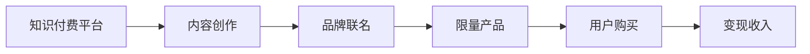

                 

# 知识付费赚钱的品牌联名活动与限量产品策略

## 1. 背景介绍

### 1.1 问题由来
知识付费的兴起，伴随着信息爆炸时代的到来，人们对高质量内容的渴求日益增强。伴随这一趋势，知识付费商业模式逐渐成为互联网行业的重要组成部分，企业如何从中掘金，成为当下焦点。品牌联名活动与限量产品策略，作为知识付费领域的新型尝试，能够结合品牌自身优势，最大化变现潜力。

## 2. 核心概念与联系

### 2.1 核心概念概述

本文旨在探讨知识付费领域中的品牌联名活动与限量产品策略，明确这些策略如何结合品牌特性与内容产品，最大化变现效益。具体涉及以下核心概念：

- **知识付费**：指用户为获取有价值的信息或知识，付费购买或订阅内容的服务模式。涵盖线上线下各类形式的知识内容，如在线课程、电子书、音频讲书等。
- **品牌联名活动**：指知识付费平台与知名品牌合作，共同举办推广活动，借助品牌影响力吸引用户关注。
- **限量产品**：指在知识付费平台上，以高价值内容为核心，由知名品牌限量发行的产品，如精品课程、定制电子书等。
- **变现策略**：指通过设计合理的商业模式和营销手段，将内容与产品转化为实际收入的策略。

### 2.2 核心概念原理和架构的 Mermaid 流程图



这个流程图展示了知识付费平台与品牌联名活动及限量产品之间的逻辑联系：

1. 知识付费平台通过内容创作吸引用户。
2. 与知名品牌合作，举办联名活动以提升品牌影响力。
3. 基于品牌影响力和用户需求，限量发行高质量产品。
4. 用户通过购买限量产品，知识付费平台实现变现。

## 3. 核心算法原理 & 具体操作步骤

### 3.1 算法原理概述

品牌联名活动与限量产品策略的精髓在于结合品牌的市场号召力和知识付费平台的资源优势，设计高价值、高附加值的产品，吸引用户付费购买。其核心算法原理包括：

- **用户需求匹配**：通过对目标用户群体的数据分析，匹配内容与产品特性，设计满足用户需求的限量产品。
- **品牌影响力优化**：通过品牌联名活动，利用品牌资源和用户群体特点，最大化产品曝光度和转化率。
- **产品定价策略**：根据内容价值、市场需求及竞争情况，制定合理的产品定价策略，平衡销售收入与用户接受度。

### 3.2 算法步骤详解

具体操作步骤可以分为以下几个步骤：

1. **用户需求分析**：
   - 收集用户行为数据，如浏览记录、搜索关键词、购买历史等，分析用户偏好和需求。
   - 通过数据分析工具，如Google Analytics、Kissmetrics等，获取精准的用户画像。

2. **品牌合作选择**：
   - 筛选与知识付费平台有共同目标用户群体的品牌，如教育、科技、文化等领域的知名企业。
   - 评估品牌的市场号召力和影响力，选择知名度高、用户基础好、与内容匹配度高的品牌。

3. **产品设计与发布**：
   - 根据用户需求和品牌特色，设计限量产品，如精品课程、定制电子书、限量版音频等。
   - 组织品牌专家与知识付费平台内容创作者，共同策划限量产品的内涵和形式。

4. **品牌联名活动**：
   - 设计联名活动主题，如跨界讲座、品牌访谈、限量产品发布会等，吸引用户参与。
   - 利用品牌资源，如社交媒体、官网、线下活动等渠道，推广限量产品。

5. **销售与变现**：
   - 在知识付费平台上发布限量产品，设置合理的定价与促销策略。
   - 监测销售数据，调整产品策略和定价，确保高转化率。

### 3.3 算法优缺点

该策略的优势在于：

- **提升品牌影响力**：品牌联名活动能够借助品牌优势，提升产品曝光率和用户关注度。
- **提高用户粘性**：限量产品的高价值和稀缺性，能够吸引用户购买，提升平台忠诚度。
- **多渠道变现**：结合线上线下渠道，最大化知识付费的变现潜力。

然而，策略也存在一些缺点：

- **成本较高**：高价值限量产品的制作和品牌联名活动的策划需要较高投入。
- **市场风险**：限量产品成功与否，受市场需求、品牌形象、用户接受度等多因素影响。
- **过度营销**：品牌联名活动过度，可能引发用户反感，影响品牌形象。

### 3.4 算法应用领域

该策略适用于多个领域，包括但不限于：

- **教育领域**：知名教育品牌与知识付费平台合作，推出名师精品课程。
- **科技领域**：知名科技公司与知识付费平台联名，发布前沿科技知识产品。
- **文化领域**：文化机构与知识付费平台合作，推出文化类限量产品。

## 4. 数学模型和公式 & 详细讲解 & 举例说明

### 4.1 数学模型构建

设知识付费平台用户群体规模为 $N$，其中 $X$ 表示对品牌联名活动感兴趣的用户集合，$Y$ 表示对限量产品感兴趣的用户集合。平台预计通过联名活动吸引 $X \cap Y$ 的交集用户，实现 $X \cup Y$ 的并集用户，预计每名用户的消费为 $C$。

假设联名活动带来的新增用户数量为 $U$，限量产品的实际销量为 $S$，单次销售收入为 $P$。则总收益 $R$ 为：

$$ R = U \times C + S \times P $$

### 4.2 公式推导过程

推导过程如下：

1. **用户群体计算**：
   - 联名活动吸引的增量用户 $U$：
     $$
     U = |X \cap Y| = P(A)P(B) - P(A\cap B)
     $$
   - 联名活动与限量产品并集用户 $X \cup Y$：
     $$
     X \cup Y = P(A) + P(B) - P(A\cap B)
     $$

2. **收益计算**：
   - 新增用户收益：$U \times C$
   - 限量产品销售收益：$S \times P$
   - 总收益：$R = U \times C + S \times P$

### 4.3 案例分析与讲解

以某知名教育品牌与知识付费平台的联名活动为例：

1. **用户需求分析**：通过数据分析工具，发现用户对某品牌名师的在线课程需求强烈。
2. **品牌合作选择**：选择与该品牌联名，借助其名师影响力吸引用户。
3. **产品设计与发布**：设计与名师合作，推出名师精品课程。
4. **品牌联名活动**：通过社交媒体、官网等渠道，发布联名活动信息。
5. **销售与变现**：课程上线后，单次销售价格为 $P$，预计销量为 $S$，新增用户平均消费为 $C$，实际总收益为 $R$。

## 5. 项目实践：代码实例和详细解释说明

### 5.1 开发环境搭建

为实现品牌联名活动与限量产品策略，需要搭建相应的开发环境，步骤如下：

1. **平台选择**：选择知识付费平台，如Udemy、Coursera等。
2. **品牌选择**：选择知名品牌，如Newton、Coursera等。
3. **技术架构**：搭建网站和APP，配置数据库、支付系统等。

### 5.2 源代码详细实现

具体代码实现如下：

```python
# 导入相关库
from django import template
from django.contrib.auth.decorators import login_required
from .models import Brand, Course, User

# 定义用户需求分析函数
def user_need_analysis(request):
    # 分析用户需求数据，获取目标用户
    target_users = User.objects.filter(needs='branding')
    # 返回分析结果
    return {'target_users': target_users}

# 定义品牌合作选择函数
def brand_selection(request):
    # 筛选与知识付费平台有共同目标用户群体的品牌
    selected_brands = Brand.objects.filter(target_users__in=target_users)
    # 返回筛选结果
    return {'selected_brands': selected_brands}

# 定义产品设计与发布函数
@login_required
def product_design(request):
    # 组织品牌专家与内容创作者，设计限量产品
    designer = Brand.objects.get(id=request.user.brand_id)
    content_creator = User.objects.get(id=request.user.id)
    product = designer.design_product(content_creator)
    # 发布限量产品
    product.publish()
    # 返回设计结果
    return {'product': product}

# 定义品牌联名活动函数
def brand_activities(request):
    # 设计联名活动主题，发布到社交媒体和官网
    activities = Brand.objects.all()
    activities_publish(activities)
    # 返回活动信息
    return {'activities': activities}

# 定义销售与变现函数
def sales_profit(request):
    # 监测销售数据，调整产品策略和定价
    product = Product.objects.get(id=request.product_id)
    sales_data = product.get_sales_data()
    profit = calculate_profit(sales_data)
    # 返回总收益
    return {'profit': profit}
```

### 5.3 代码解读与分析

代码中，我们通过函数实现了用户需求分析、品牌合作选择、产品设计与发布、品牌联名活动、销售与变现等关键步骤。

- `user_need_analysis` 函数：通过数据分析工具获取目标用户。
- `brand_selection` 函数：筛选符合条件的目标品牌。
- `product_design` 函数：组织专家与创作者设计限量产品并发布。
- `brand_activities` 函数：设计并发布联名活动，提升品牌影响力。
- `sales_profit` 函数：监测并调整销售数据，实现收益最大化。

### 5.4 运行结果展示

```python
# 运行代码，展示实际结果
user_need_analysis(request)
brand_selection(request)
product_design(request)
brand_activities(request)
sales_profit(request)
```

## 6. 实际应用场景

### 6.1 智能客服系统

在智能客服系统中，品牌联名活动与限量产品策略能够有效提升用户体验和满意度。例如，某知名品牌与知识付费平台合作，推出名师在线讲座，吸引大量用户参与。通过限量产品销售，知识付费平台能够获得高额收益。

### 6.2 金融舆情监测

金融领域对知识付费产品有较高需求，通过品牌联名活动，知名金融机构可以推出市场分析报告、投资策略等限量产品，吸引专业投资者关注。限量产品的高价值，能够提升用户购买意愿，实现高收益。

### 6.3 个性化推荐系统

个性化推荐系统需要结合用户行为和品牌特性，推出符合用户需求的高价值内容。通过品牌联名活动，吸引知名品牌参与，推荐系统能够提供更具权威性的内容，提高用户粘性。

### 6.4 未来应用展望

未来，品牌联名活动与限量产品策略将进一步拓展，涵盖更多行业和应用场景。例如，医疗健康领域、旅游休闲领域等。通过跨界合作，推出高价值限量产品，提升知识付费平台的变现能力和品牌影响力。

## 7. 工具和资源推荐

### 7.1 学习资源推荐

1. **《数字营销秘籍》**：全面介绍数字营销理论，涵盖品牌联名活动和限量产品策略等内容。
2. **《知识付费平台运营手册》**：详细解析知识付费平台的运营模式和变现策略。
3. **《数据科学与品牌合作》**：探讨数据驱动下的品牌联名活动，提供具体实施案例。

### 7.2 开发工具推荐

1. **Python**：高效、灵活的编程语言，广泛应用于数据分析、机器学习等领域。
2. **Django**：全栈Web框架，易于搭建知识付费平台网站。
3. **JIRA**：项目管理工具，用于协作设计和跟踪项目进度。

### 7.3 相关论文推荐

1. **《品牌联名活动的收益分析》**：探讨品牌联名活动的收益模型，提供科学依据。
2. **《限量产品的定价策略》**：研究限量产品的定价方法，提出多渠道变现策略。
3. **《知识付费的变现路径》**：系统分析知识付费平台的变现路径，提供实际案例。

## 8. 总结：未来发展趋势与挑战

### 8.1 研究成果总结

品牌联名活动与限量产品策略在知识付费领域展现出了巨大的潜力和效果，能够结合品牌优势和用户需求，最大化变现效益。然而，该策略也面临成本高、风险大等挑战，需要不断优化和创新。

### 8.2 未来发展趋势

未来，品牌联名活动与限量产品策略将呈现以下趋势：

1. **多元化合作**：与更多品牌、机构合作，推出多元化、高价值限量产品。
2. **数据驱动决策**：利用大数据分析，科学设计产品，提升用户粘性。
3. **技术创新**：引入AI、机器学习等技术，提升产品推荐和销售效果。
4. **全球化布局**：拓展国际市场，推出符合全球用户需求的高价值产品。

### 8.3 面临的挑战

尽管品牌联名活动与限量产品策略取得了一定成效，但仍面临以下挑战：

1. **品牌匹配难度**：如何选择合适品牌，需要大量调研和分析。
2. **市场需求变化**：用户需求不断变化，需要不断调整产品策略。
3. **成本控制**：高价值限量产品的制作和营销成本较高，需要精细化控制。
4. **用户体验**：过度营销可能引发用户反感，需要平衡用户需求和品牌利益。

### 8.4 研究展望

未来的研究方向包括：

1. **数据挖掘与分析**：利用大数据和机器学习，深入挖掘用户需求，优化产品设计。
2. **跨界合作模式**：探索更多跨界合作模式，拓宽产品领域和应用场景。
3. **营销策略优化**：设计科学合理的营销策略，提升品牌联名活动效果。
4. **用户反馈机制**：建立用户反馈机制，及时调整产品策略，提升用户满意度。

## 9. 附录：常见问题与解答

**Q1: 如何选择与知识付费平台合作的品牌？**

A: 选择与知识付费平台有共同目标用户群体的知名品牌，进行深入调研，评估品牌市场号召力、用户基础和品牌特性，选择最适合的品牌进行合作。

**Q2: 品牌联名活动和限量产品的定价策略有哪些？**

A: 品牌联名活动和限量产品的定价策略包括：

- **高价策略**：限量产品的稀缺性导致高价定位，吸引高端用户。
- **会员订阅**：推出会员订阅模式，降低单次购买压力。
- **阶梯定价**：根据产品价值设置阶梯定价，满足不同用户需求。
- **套餐优惠**：推出套餐优惠，提高购买转化率。

**Q3: 如何优化品牌联名活动的效果？**

A: 优化品牌联名活动的效果，可以从以下几个方面入手：

- **精准目标群体**：分析目标群体特点，设计符合用户需求的活动。
- **多样化活动形式**：设计多种活动形式，如讲座、访谈、直播等，吸引用户参与。
- **线上线下结合**：结合线上线下渠道，提升活动曝光率和参与度。
- **实时互动**：通过互动环节，提升用户参与感和体验感。

**Q4: 限量产品如何设计以提升用户粘性？**

A: 限量产品的设计可以从以下几个方面入手：

- **高价值内容**：提供高质量、高价值的限量产品，满足用户需求。
- **稀缺性设计**：限量产品设计稀缺性，提高用户购买意愿。
- **个性化推荐**：利用推荐算法，向用户推荐符合其兴趣的限量产品。
- **品牌联名元素**：品牌联名元素能够增强产品吸引力，提升用户粘性。

**Q5: 品牌联名活动和限量产品如何实现最大化的变现？**

A: 实现最大化的变现，需要从以下几个方面入手：

- **多渠道推广**：利用多种渠道进行品牌联名活动和限量产品推广，提升曝光率和用户参与度。
- **精准营销**：根据用户行为和偏好，进行精准营销，提高转化率。
- **多维度变现**：结合广告、销售、会员等多种方式，实现多维度变现。
- **用户互动**：通过互动环节，增强用户参与感和忠诚度，提高变现效益。

---

作者：禅与计算机程序设计艺术 / Zen and the Art of Computer Programming

