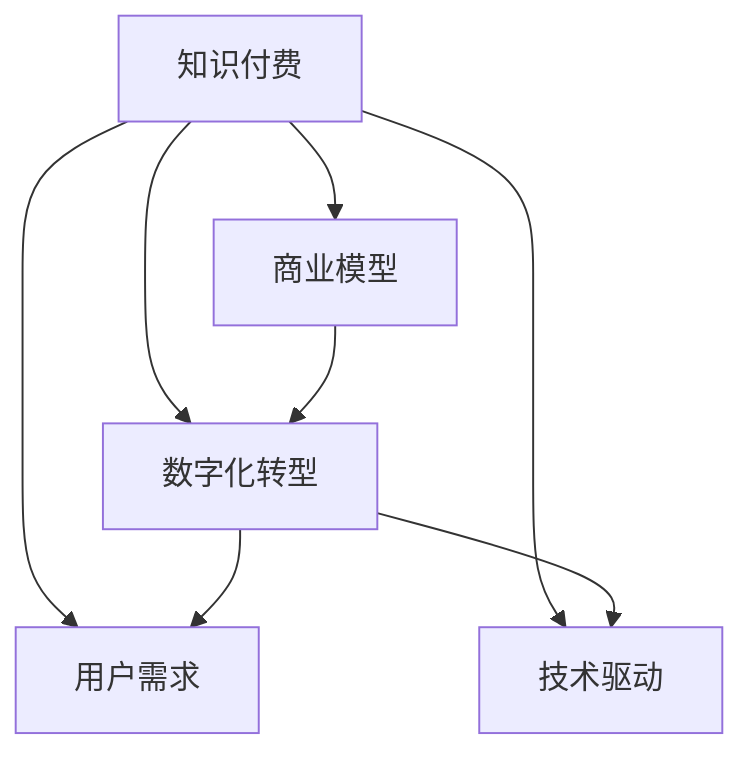

                 

# 知识经济时代下的知识付费创新商业模式评估

> 关键词：知识付费, 商业模型, 数字化转型, 用户需求, 技术驱动

## 1. 背景介绍

### 1.1 问题由来

随着知识经济的蓬勃发展，传统的教育、娱乐和信息获取模式正在经历翻天覆地的变化。特别是在互联网、人工智能和大数据技术的推动下，知识内容的获取、共享和应用方式正在向数字化、智能化的方向转型。知识付费，作为一种新型的内容变现模式，正迅速成为知识经济时代的重要组成部分。

### 1.2 问题核心关键点

知识付费商业模式的核心在于知识内容的获取、分享和应用。这种模式通过互联网平台，将知识内容转化为付费服务，为用户提供高质量、个性化、有价值的知识服务。与传统的内容免费获取模式相比，知识付费能够更好地满足用户对深度、专业、系统化知识的需求，同时也能激发创作者的创作热情，形成良性的内容生产与消费循环。

当前知识付费市场呈现出以下几个主要特点：
- 用户群体逐渐扩大：涵盖个人用户和机构用户，覆盖知识消费的各个层面。
- 内容形式日益多样化：包括音频、视频、图文等多种形式。
- 商业模式多样化：涵盖订阅模式、按需付费模式、增值服务模式等。

然而，尽管知识付费市场潜力巨大，但仍面临诸多挑战。例如，用户付费意愿不高，优质内容供给不足，平台盈利模式单一等问题。如何通过技术创新和商业创新，优化知识付费商业模式，是当前知识经济时代亟待解决的关键问题。

### 1.3 问题研究意义

研究知识付费创新商业模式，对于推动知识经济的发展、提升知识服务的价值、激发知识创作者的活力、满足用户对知识内容的多样化需求具有重要意义。特别是在数字化转型的浪潮下，知识付费能够更好地整合线上线下资源，形成知识经济的新生态，为传统产业的数字化转型升级提供新的动力。

## 2. 核心概念与联系

### 2.1 核心概念概述

为更好地理解知识付费商业模式的本质，本节将介绍几个密切相关的核心概念：

- **知识付费**：通过互联网平台提供高质量、专业化的知识服务，满足用户对深度知识的获取需求。与传统免费获取模式相比，知识付费模式能够更好地激发创作者创作热情，形成良性的内容生产和消费循环。

- **商业模型**：企业或平台通过特定方式获取和提供知识内容，从而实现价值变现的商业模式。主要包括内容订阅、按需付费、增值服务等多种形式。

- **数字化转型**：传统行业利用互联网、人工智能和大数据等技术，进行业务流程、组织结构和运营模式的变革，提升效率和竞争力。

- **用户需求**：知识付费平台面对的是多样化的用户群体，其需求包括但不限于：获取深度专业知识、提升职业技能、进行兴趣拓展等。

- **技术驱动**：包括互联网、人工智能、大数据等新兴技术，推动知识付费平台的内容生产和运营模式创新，提升用户体验和服务质量。

这些核心概念之间的逻辑关系可以通过以下Mermaid流程图来展示：



这个流程图展示了大语言模型的核心概念及其之间的关系：

1. 知识付费基于商业模型，通过互联网平台提供知识服务。
2. 数字化转型推动知识付费的创新和升级。
3. 用户需求驱动知识付费平台的内容生产和服务模式。
4. 技术驱动支撑知识付费平台的创新和优化。

这些概念共同构成了知识付费商业模式的逻辑框架，帮助理解知识付费的发展动因和未来趋势。

## 3. 核心算法原理 & 具体操作步骤
### 3.1 算法原理概述

知识付费商业模式的本质是知识内容的变现和价值创造。其核心在于如何通过互联网平台，将高质量、有价值的知识内容转化为付费服务，满足用户的多样化需求，同时实现平台的盈利目标。

形式化地，假设知识付费平台为 $P$，用户群体为 $U$，知识内容为 $K$，内容生产方为 $C$。平台的目标是最大化其收益 $R$，即：

$$
R = \max_{P, K, C} P \times K \times U
$$

其中 $P$ 为平台的定价策略，$K$ 为知识内容的价值，$U$ 为用户需求。平台通过定价策略 $P$ 和内容价值 $K$ 的优化组合，最大化平台的收益。

### 3.2 算法步骤详解

知识付费商业模式的实现一般包括以下几个关键步骤：

**Step 1: 确定知识内容**
- 筛选高质量、专业化的知识内容，确定内容的原创性和可靠性。
- 根据用户的兴趣和需求，制定内容生产计划和策略。

**Step 2: 制定定价策略**
- 根据内容价值、市场竞争、用户支付意愿等因素，制定定价策略。
- 选择适合的知识付费形式，如订阅模式、按需付费模式等。

**Step 3: 设计用户体验**
- 优化平台的用户界面和交互设计，提升用户体验。
- 通过个性化推荐算法，提高内容的相关性和用户满意度。

**Step 4: 营销推广**
- 利用互联网营销工具，提升平台知名度和用户转化率。
- 通过内容营销、社交媒体推广等方式，吸引潜在用户。

**Step 5: 数据分析与优化**
- 通过用户行为数据，分析用户需求和内容偏好，优化内容生产和定价策略。
- 引入机器学习模型，提升平台的内容推荐和个性化服务能力。

### 3.3 算法优缺点

知识付费商业模式具有以下优点：
1. 高价值变现：通过高质量知识内容的付费服务，实现高附加值的价值变现。
2. 激励创新：高质量的知识内容能够激发创作者创作热情，形成良性循环。
3. 个性化服务：通过数据分析和个性化推荐，提升用户满意度和平台黏性。

同时，该模式也存在一些局限性：
1. 高昂成本：高质量内容生产和平台运营成本较高，可能导致初期投资较大。
2. 市场竞争激烈：知识付费市场竞争激烈，需要持续创新才能保持竞争优势。
3. 用户需求多样：用户需求多样化，需要平台具备较强的内容生产和用户运营能力。

尽管存在这些局限性，但就目前而言，知识付费商业模式仍是大数据时代内容变现的重要方式。未来相关研究的重点在于如何进一步优化内容生产和用户运营策略，提升平台盈利能力。

### 3.4 算法应用领域

知识付费商业模式在知识经济时代具有广泛的应用前景，适用于多个领域：

- **教育培训**：提供高质量的在线课程和培训，满足用户学习新技能、提升职业素养的需求。
- **职业发展**：提供专业的行业资讯、职业技能培训，帮助用户职业成长。
- **兴趣拓展**：提供丰富的兴趣类内容，如科技、艺术、文化等，满足用户个性化兴趣需求。
- **健康管理**：提供健康知识、疾病预防、营养搭配等健康管理内容，提升用户健康水平。

此外，知识付费还应用于企业内训、政府咨询、社会公益等领域，为知识经济的发展提供了新的动力。

## 4. 数学模型和公式 & 详细讲解  
### 4.1 数学模型构建

本节将使用数学语言对知识付费商业模式的数学模型进行更加严格的刻画。

记知识付费平台为 $P$，用户群体为 $U$，知识内容为 $K$，内容生产方为 $C$。平台的收益 $R$ 为目标函数，用户满意度 $S$ 为优化目标。

定义平台在用户 $u$ 上提供的知识内容为 $k_u$，用户对内容 $k_u$ 的满意度为 $s_u$，则平台的目标函数为：

$$
R = \sum_{u \in U} p_{u} \times s_{u}
$$

其中 $p_{u}$ 为对用户 $u$ 的定价策略，$s_{u}$ 为用户 $u$ 的满意度。

### 4.2 公式推导过程

以下我们以在线课程订阅模式为例，推导定价策略和用户满意度之间的数学关系。

假设平台提供 $n$ 门课程，每门课程的价格为 $p_i$，用户订阅 $i$ 门课程的概率为 $p_{ui}$，用户对课程 $i$ 的满意度为 $s_i$，则用户对平台总的满意度为：

$$
s_{u} = \sum_{i=1}^{n} p_{ui} \times s_i
$$

为了最大化平台的收益，需要优化定价策略 $p_{u}$。通过求解目标函数的极值，可以得到最优定价策略：

$$
p_{ui} = \frac{s_i \times p_i}{\sum_{j=1}^{n} s_j \times p_j}
$$

其中 $s_i$ 为用户对课程 $i$ 的满意度，$p_i$ 为课程 $i$ 的价格。

### 4.3 案例分析与讲解

以在线编程课程为例，分析如何通过定价策略最大化平台收益。

假设平台提供三门编程课程 $C_1, C_2, C_3$，价格分别为 $p_1=100$, $p_2=200$, $p_3=300$，用户对三门课程的满意度分别为 $s_1=0.8$, $s_2=0.7$, $s_3=0.9$。用户订阅任意课程的概率相等，即 $p_{ui}=\frac{1}{3}$。

根据上述公式，可以计算出用户对平台总的满意度 $s_{u}$：

$$
s_{u} = \frac{1}{3} \times (0.8 \times 100 + 0.7 \times 200 + 0.9 \times 300) = 200
$$

为了最大化平台的收益，需要优化定价策略 $p_{u}$。通过求解目标函数的极值，可以得到最优定价策略：

$$
p_{ui} = \frac{s_i \times p_i}{\sum_{j=1}^{3} s_j \times p_j} = \frac{0.8 \times 100 + 0.7 \times 200 + 0.9 \times 300}{200} = 1.6
$$

因此，平台应当根据用户对课程的满意度，动态调整定价策略，以最大化平台的收益。

## 5. 项目实践：代码实例和详细解释说明
### 5.1 开发环境搭建

在进行知识付费平台开发前，我们需要准备好开发环境。以下是使用Python进行Flask开发的环境配置流程：

1. 安装Python和Flask：从官网下载并安装Python和Flask，用于搭建知识付费平台的Web服务。

2. 创建Flask应用：
```python
from flask import Flask
app = Flask(__name__)
```

3. 安装必要的库：
```python
pip install flask flask_sqlalchemy flask_login
```

4. 设置数据库：
```python
app.config['SQLALCHEMY_DATABASE_URI'] = 'sqlite:///test.db'
app.config['SECRET_KEY'] = 'secret_key'
```

5. 创建数据库模型：
```python
from flask_sqlalchemy import SQLAlchemy
db = SQLAlchemy(app)

class User(db.Model):
    id = db.Column(db.Integer, primary_key=True)
    username = db.Column(db.String(80), unique=True, nullable=False)
    email = db.Column(db.String(120), unique=True, nullable=False)
    password = db.Column(db.String(120), nullable=False)
    courses = db.relationship('Course', secondary=courses_users, backref='users')

class Course(db.Model):
    id = db.Column(db.Integer, primary_key=True)
    title = db.Column(db.String(120), nullable=False)
    price = db.Column(db.Float, nullable=False)
    content = db.Column(db.Text, nullable=False)
    is_paid = db.Column(db.Boolean, default=False)

courses_users = db.Table('courses_users',
    db.Column('course_id', db.Integer, db.ForeignKey('course.id'), primary_key=True),
    db.Column('user_id', db.Integer, db.ForeignKey('user.id'), primary_key=True)
)
```

完成上述步骤后，即可在`test.db`数据库中创建表，并开始知识付费平台的开发。

### 5.2 源代码详细实现

下面我们以在线编程课程为例，给出使用Flask搭建知识付费平台的代码实现。

首先，定义用户和课程模型：

```python
from flask import Flask, render_template, request, redirect, url_for, flash
from flask_sqlalchemy import SQLAlchemy
from flask_login import LoginManager, UserMixin, login_user, logout_user, login_required, current_user

app = Flask(__name__)
app.config['SQLALCHEMY_DATABASE_URI'] = 'sqlite:///test.db'
app.config['SECRET_KEY'] = 'secret_key'
db = SQLAlchemy(app)
login_manager = LoginManager(app)

class User(db.Model, UserMixin):
    id = db.Column(db.Integer, primary_key=True)
    username = db.Column(db.String(80), unique=True, nullable=False)
    email = db.Column(db.String(120), unique=True, nullable=False)
    password = db.Column(db.String(120), nullable=False)

class Course(db.Model):
    id = db.Column(db.Integer, primary_key=True)
    title = db.Column(db.String(120), nullable=False)
    price = db.Column(db.Float, nullable=False)
    content = db.Column(db.Text, nullable=False)
    is_paid = db.Column(db.Boolean, default=False)

@login_manager.user_loader
def load_user(user_id):
    return User.query.get(int(user_id))

@app.route('/')
@login_required
def home():
    courses = Course.query.filter_by(is_paid=False).all()
    return render_template('home.html', courses=courses)

@app.route('/courses', methods=['GET', 'POST'])
@login_required
def courses():
    if request.method == 'POST':
        course_id = request.form.get('course_id')
        course = Course.query.get(course_id)
        user = User.query.get(current_user.id)
        user.courses.append(course)
        course.is_paid = True
        db.session.commit()
        flash('Course purchased successfully!', 'success')
        return redirect(url_for('courses'))
    else:
        courses = Course.query.all()
        return render_template('courses.html', courses=courses)
```

然后，定义用户登录和注册功能：

```python
from werkzeug.security import generate_password_hash, check_password_hash

@app.route('/login', methods=['GET', 'POST'])
def login():
    if request.method == 'POST':
        username = request.form.get('username')
        password = request.form.get('password')
        user = User.query.filter_by(username=username).first()
        if user and check_password_hash(user.password, password):
            login_user(user)
            return redirect(url_for('home'))
        flash('Invalid username or password', 'danger')
    return render_template('login.html')

@app.route('/register', methods=['GET', 'POST'])
def register():
    if request.method == 'POST':
        username = request.form.get('username')
        email = request.form.get('email')
        password = request.form.get('password')
        user = User(username=username, email=email, password=generate_password_hash(password))
        db.session.add(user)
        db.session.commit()
        flash('User registered successfully!', 'success')
        return redirect(url_for('login'))
    return render_template('register.html')
```

最后，定义用户退出和课程购买功能：

```python
@app.route('/logout')
def logout():
    logout_user()
    return redirect(url_for('home'))

@app.route('/checkout', methods=['GET', 'POST'])
@login_required
def checkout():
    if request.method == 'POST':
        course_id = request.form.get('course_id')
        course = Course.query.get(course_id)
        user = User.query.get(current_user.id)
        user.courses.append(course)
        course.is_paid = True
        db.session.commit()
        flash('Course purchased successfully!', 'success')
        return redirect(url_for('courses'))
    else:
        courses = Course.query.filter_by(is_paid=False).all()
        return render_template('checkout.html', courses=courses)
```

完成上述步骤后，即可在`test.db`数据库中创建表，并开始知识付费平台的开发。

### 5.3 代码解读与分析

让我们再详细解读一下关键代码的实现细节：

**User类和Course类**：
- 定义了用户和课程的模型，包括用户的基本信息、课程的详细信息等。
- 利用Flask-Login扩展实现了用户登录和认证功能，用户登录后才能访问部分页面。

**home和courses函数**：
- home函数展示了所有未付费课程，用户可以直接访问。
- courses函数展示了所有课程，用户可以选择购买。

**login和register函数**：
- login函数处理用户登录请求，验证用户名和密码，成功则登录成功，失败则提示错误。
- register函数处理用户注册请求，创建新用户并保存到数据库。

**logout函数**：
- logout函数处理用户退出请求，退出当前用户。

**checkout函数**：
- checkout函数处理课程购买请求，将课程标记为已付费，更新用户和课程的信息。

这些代码展示了知识付费平台的基本功能，包括用户登录、课程浏览、课程购买等。

### 5.4 运行结果展示

完成上述代码后，启动Flask应用，访问`http://localhost:5000`即可看到知识付费平台的前端页面。用户可以注册、登录，浏览和购买课程。

## 6. 实际应用场景
### 6.1 在线教育平台

在线教育平台通过知识付费商业模式，为用户提供高质量的在线课程和培训服务。平台可以根据用户的学习需求，提供个性化、系统化的知识内容，满足用户的学习目标。

在技术实现上，在线教育平台可以采用微服务架构，将内容管理、用户管理、支付管理等模块进行分离，提升系统的可扩展性和稳定性。同时引入AI技术，进行内容推荐、智能答疑、作业批改等功能，提升用户体验和学习效果。

### 6.2 企业内训系统

企业内训系统通过知识付费模式，帮助企业员工获取职业发展所需的知识和技能。平台可以结合企业的业务需求，提供定制化的培训课程，帮助员工提升职业技能，满足企业的人才培养需求。

在技术实现上，企业内训系统可以采用企业内部的知识库和课程资源，通过知识付费的方式，为员工提供学习服务。同时引入AI技术，进行内容推荐、智能答疑、作业批改等功能，提升员工的学习效果和平台的用户体验。

### 6.3 知识社区

知识社区通过知识付费模式，聚集了大量的知识创作者和用户，形成了一个开放的知识共享平台。平台可以提供多种知识付费形式，如订阅、按需付费、众筹等，满足用户的不同需求。

在技术实现上，知识社区可以采用开源的论坛系统，结合知识付费功能，进行内容的生产和消费。同时引入AI技术，进行内容推荐、智能问答、情感分析等功能，提升平台的互动性和用户体验。

## 7. 工具和资源推荐
### 7.1 学习资源推荐

为了帮助开发者系统掌握知识付费商业模式的理论基础和实践技巧，这里推荐一些优质的学习资源：

1. 《知识付费商业模型与运营》系列博文：由知识付费领域专家撰写，深入浅出地介绍了知识付费商业模型的基本原理和运营策略。

2. Coursera《知识付费与内容营销》课程：介绍知识付费的商业模式、内容生产和运营策略，帮助用户构建知识付费平台。

3. 《知识付费平台设计与实现》书籍：全面介绍了知识付费平台的架构设计、功能开发和运营优化，适合系统学习知识付费平台开发。

4. 《知识付费商业模式创新》报告：分析了知识付费市场的现状和未来趋势，提供了相关的行业报告和案例分析。

5. 《知识付费商业模式的挑战与机会》白皮书：探讨了知识付费商业模式面临的挑战和机遇，提出了相关的解决方案和策略。

通过对这些资源的学习实践，相信你一定能够快速掌握知识付费商业模式的精髓，并用于解决实际的商业问题。

### 7.2 开发工具推荐

高效的开发离不开优秀的工具支持。以下是几款用于知识付费平台开发的常用工具：

1. Flask：轻量级的Web开发框架，简单易用，适合快速迭代开发。

2. Django：全功能的Web开发框架，提供完整的MVC架构，适合大型项目开发。

3. SQLAlchemy：Python ORM框架，支持多种数据库，适合数据库管理和CRUD操作。

4. Redis：内存数据库，支持高并发和缓存，适合知识付费平台的用户管理和服务优化。

5. Elasticsearch：分布式搜索引擎，支持全文搜索和分析，适合知识付费平台的内容检索和推荐。

6. TensorFlow和PyTorch：深度学习框架，适合知识付费平台的AI功能开发，如智能答疑、情感分析等。

合理利用这些工具，可以显著提升知识付费平台的开发效率，加快创新迭代的步伐。

### 7.3 相关论文推荐

知识付费商业模式的研究源于学界的持续研究。以下是几篇奠基性的相关论文，推荐阅读：

1. Content Subscription Model: A New Monetization Model for Digital Content（内容订阅模型）：介绍了内容订阅模型在数字内容产业中的应用，探讨了其优缺点和未来发展方向。

2. The Economics of the Knowledge Economy（知识经济理论）：分析了知识经济的概念和特征，探讨了知识付费模式的经济基础和应用前景。

3. Digital Content Platforms: Economics and Data（数字内容平台经济学）：探讨了数字内容平台的经济模型和数据驱动策略，分析了其市场竞争和用户行为。

4. Revenue Models for Online Knowledge Services（在线知识服务商业模式）：介绍了多种在线知识服务的商业模式，探讨了其盈利模式和市场应用。

5. Pricing Strategies for Subscription-based Digital Content（订阅模式下的定价策略）：分析了订阅模式下的定价策略，探讨了其定价模型和市场应用。

这些论文代表了大语言模型微调技术的发展脉络。通过学习这些前沿成果，可以帮助研究者把握学科前进方向，激发更多的创新灵感。

## 8. 总结：未来发展趋势与挑战

### 8.1 总结

本文对知识付费创新商业模式的理论基础和实践技巧进行了全面系统的介绍。首先阐述了知识付费商业模式的来历和核心关键点，明确了知识付费商业模式的本质和应用场景。其次，从原理到实践，详细讲解了知识付费商业模式的数学模型和核心步骤，给出了知识付费平台开发的完整代码实例。同时，本文还广泛探讨了知识付费商业模式在多个行业领域的应用前景，展示了知识付费的广阔前景。

通过本文的系统梳理，可以看到，知识付费商业模式正在成为知识经济时代的重要组成部分，极大地拓展了知识服务的价值和范围，为传统产业的数字化转型升级提供了新的动力。

### 8.2 未来发展趋势

展望未来，知识付费商业模式将呈现以下几个发展趋势：

1. 数字化转型加速：随着数字化技术的不断进步，知识付费平台的运营模式和技术架构将不断优化，提升用户体验和平台稳定性。

2. 内容多元化发展：知识付费平台将不再局限于课程和培训，而是向更多元化的内容形式扩展，如文章、电子书、视频等。

3. 个性化服务提升：通过AI和大数据技术，知识付费平台将能够提供更加精准、个性化的知识服务，满足用户的多样化需求。

4. 社交化互动增强：知识付费平台将更加注重用户之间的互动和社区建设，形成知识共享和交流的生态。

5. 国际化扩展：随着全球化进程的加速，知识付费平台将扩展到更多的国际市场，形成全球化的知识服务体系。

6. 技术驱动创新：通过引入AI、大数据、区块链等新兴技术，知识付费平台将不断创新和优化，提升平台的市场竞争力和用户满意度。

以上趋势凸显了知识付费商业模式的广阔前景。这些方向的探索发展，必将进一步提升知识付费平台的用户体验和服务质量，为知识经济的发展提供新的动力。

### 8.3 面临的挑战

尽管知识付费商业模式已经取得了瞩目成就，但在迈向更加智能化、普适化应用的过程中，它仍面临着诸多挑战：

1. 市场竞争激烈：知识付费平台面临激烈的市场竞争，需要持续创新才能保持竞争优势。

2. 内容供给不足：高质量知识内容的生产和获取成本较高，需要平台具备较强的内容运营和用户运营能力。

3. 用户需求多样：用户需求多样化，需要平台具备较强的内容生产和服务能力，提供多样化的知识内容。

4. 定价策略复杂：知识付费的定价策略需要考虑内容价值、市场需求、用户支付意愿等多方面因素，需要科学合理的定价模型。

5. 平台盈利模式单一：知识付费平台的盈利模式较为单一，需要多元化收入来源，提升平台的盈利能力。

6. 数据隐私和安全：知识付费平台涉及大量的用户数据，需要采取有效的数据保护措施，确保用户数据的安全和隐私。

正视知识付费面临的这些挑战，积极应对并寻求突破，将是大数据时代知识付费走向成熟的必由之路。相信随着学界和产业界的共同努力，这些挑战终将一一被克服，知识付费商业模式必将在构建知识经济新生态中扮演越来越重要的角色。

### 8.4 研究展望

面对知识付费商业模式所面临的种种挑战，未来的研究需要在以下几个方面寻求新的突破：

1. 探索新型知识付费模式。摆脱对传统课程和培训的依赖，利用AI和大数据技术，探索新型知识付费模式，如智能问答、个性化推荐等。

2. 研究用户行为分析。通过用户行为数据，分析用户需求和内容偏好，优化内容生产和定价策略，提升用户体验和服务质量。

3. 引入区块链技术。通过区块链技术，提升知识付费平台的信任度和透明度，保障用户和创作者权益。

4. 整合多元内容形式。将内容形式从单一的课程和培训，扩展到文章、电子书、视频等多元形式，满足用户多样化的知识需求。

5. 开发智能推荐系统。引入AI技术，构建智能推荐系统，提升知识内容的推荐准确性和用户满意度。

6. 加强平台生态建设。通过社交化互动、社区建设等方式，加强平台生态建设，形成知识共享和交流的社区。

这些研究方向的探索，必将引领知识付费商业模式迈向更高的台阶，为知识经济的发展提供新的动力。面向未来，知识付费商业模式需要与其他人工智能技术进行更深入的融合，如知识表示、因果推理、强化学习等，多路径协同发力，共同推动知识经济的发展。只有勇于创新、敢于突破，才能不断拓展知识服务的边界，让知识经济更好地造福人类社会。

## 9. 附录：常见问题与解答

**Q1：知识付费商业模式是否适用于所有知识内容？**

A: 知识付费商业模式适用于大部分高质量、有价值的知识内容，特别是针对特定领域、特定人群的深度知识内容。对于通用知识、大众科普等免费内容，知识付费商业模式可能并不适用。

**Q2：如何确定知识付费平台的内容价值？**

A: 知识付费平台的内容价值主要取决于内容的专业性、原创性、适用性和时效性。可以通过市场调研、用户反馈、专家评审等方式，综合评估内容的价值。

**Q3：知识付费平台的盈利模式有哪些？**

A: 知识付费平台的盈利模式主要包括内容订阅、按需付费、增值服务等多种形式。内容订阅模式适用于长期内容消费，按需付费模式适用于单次内容消费，增值服务模式则通过附加服务获取额外收入。

**Q4：知识付费平台的用户体验如何提升？**

A: 提升知识付费平台的用户体验，需要从内容质量、用户界面、互动体验等多个方面进行优化。引入AI和大数据技术，进行内容推荐、智能答疑、情感分析等功能，提升用户体验和学习效果。

**Q5：知识付费平台的长期运营策略是什么？**

A: 知识付费平台的长期运营策略包括内容运营、用户运营和市场运营三个方面。内容运营需要不断更新和丰富内容库，提升内容质量和多样性；用户运营需要通过用户行为分析，提升用户满意度和平台黏性；市场运营需要引入市场营销手段，提升平台知名度和市场占有率。

通过这些问题的解答，希望能帮助读者更好地理解知识付费商业模式，解决实际问题。

---

作者：禅与计算机程序设计艺术 / Zen and the Art of Computer Programming

