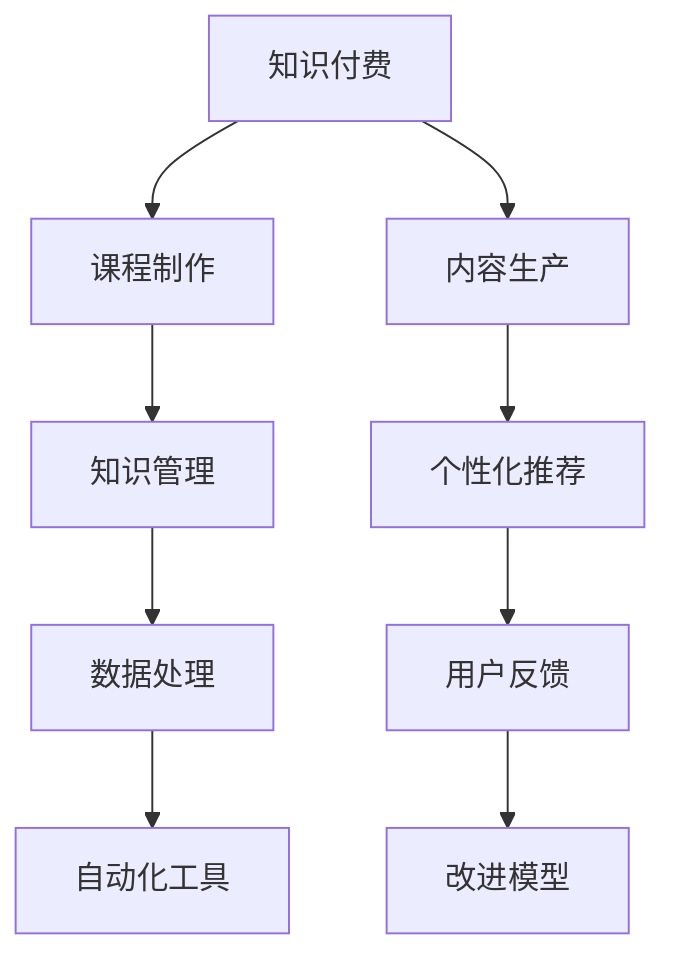

                 

# 知识经济时代下的知识付费创新课程制作与内容生产

> 关键词：知识付费, 课程制作, 内容生产, 技术驱动, 个性化推荐, 数据处理, 自动化工具, 知识管理, 视频制作, 人工智能, 教育技术

## 1. 背景介绍

### 1.1 问题由来

在知识经济时代，知识付费成为了一种主流趋势，众多在线教育平台如Coursera、Udemy、得到、知乎等应运而生。这些平台通过出售付费课程，让专业领域的专家和学者将自己的知识和经验转化为有形的产品，满足了广大用户对知识的需求。

知识付费不仅为用户提供学习的机会，也给创作者提供了收入来源，逐渐形成了良性循环。然而，随着知识付费市场的发展，用户对于课程质量、个性化推荐、高效学习等提出了更高要求。这无疑对课程制作和内容生产带来了新的挑战。

### 1.2 问题核心关键点

目前，知识付费课程制作与内容生产面临的核心问题包括：

- 如何提升课程质量，确保内容深度和广度，满足用户的学习需求？
- 如何实现个性化推荐，让课程推荐系统更精准地匹配用户兴趣，提高用户参与度和满意度？
- 如何优化内容生成流程，提升内容生产效率，降低制作成本？
- 如何管理和维护大量的知识资源，确保内容的时效性和准确性？
- 如何利用最新的AI技术，提升课程制作和内容生产的自动化水平？

这些问题的解决不仅需要专业的课程制作团队，更需要依托先进的AI技术和大数据处理能力，为用户提供更加个性化、高效、高质量的学习体验。

## 2. 核心概念与联系

### 2.1 核心概念概述

为更好地理解知识付费课程制作与内容生产的方法论，本节将介绍几个密切相关的核心概念：

- 知识付费(Knowledge Pricing): 指用户为获取特定知识内容而支付的费用，涵盖从课程、书籍、文章等各类形式。
- 课程制作(Course Production): 指从需求分析、内容策划、录制、编辑到发布的全过程，确保课程质量和学习效果。
- 内容生产(Content Generation): 指利用技术手段，自动生成或优化各种知识内容，如文本、视频、图像等。
- 知识管理(Knowledge Management): 指对知识资源进行组织、存储、检索和应用的过程，确保知识资源的有效利用。
- 个性化推荐(Personalized Recommendation): 指根据用户行为和偏好，智能推荐相关内容，提升用户体验。
- 数据处理(Data Processing): 指对大数据进行清洗、处理和分析，从中提取有价值的信息。
- 自动化工具(Automation Tools): 指通过软件工具实现内容生成、数据分析、知识管理的自动化。

这些核心概念之间的逻辑关系可以通过以下Mermaid流程图来展示：



这个流程图展示出知识付费的各个环节如何相互关联：

1. 知识付费依赖高质量的课程和内容，课程制作是基础。
2. 内容生产利用技术手段，提升内容生成效率和质量。
3. 知识管理对知识资源进行有效组织和管理，确保内容的及时更新。
4. 个性化推荐根据用户需求，推荐相关课程，提升用户体验。
5. 数据处理对用户行为进行分析，指导课程改进和个性化推荐。
6. 自动化工具提升课程制作、内容生产、知识管理的效率。
7. 用户反馈用于改进课程和推荐模型，进一步提升用户满意度。

这些概念共同构成了知识付费的完整框架，使其能够更好地满足用户的知识需求，同时提升内容制作和知识管理的效率。

## 3. 核心算法原理 & 具体操作步骤
### 3.1 算法原理概述

知识付费课程制作与内容生产的核心算法原理可以概括为以下几点：

1. **需求分析与内容策划**：通过调查问卷、市场分析等方式，了解用户需求，进行内容策划和设计。
2. **知识挖掘与处理**：利用NLP、知识图谱等技术，从海量知识资源中挖掘有价值的内容，并进行处理和组织。
3. **内容生成与优化**：利用文本生成、视频制作等技术，自动生成或优化课程内容，提升生产效率和质量。
4. **个性化推荐算法**：基于用户行为和偏好，设计推荐模型，智能推荐相关课程。
5. **知识管理与检索**：利用数据库和搜索技术，管理知识资源，提供快速检索服务。
6. **数据处理与分析**：对用户行为数据进行清洗、分析和建模，指导课程改进和推荐优化。
7. **自动化工具应用**：应用各类自动化工具，提升各个环节的效率和准确性。

### 3.2 算法步骤详解

知识付费课程制作与内容生产的典型步骤包括：

**Step 1: 需求分析与内容策划**

- **市场调研**：通过问卷调查、用户访谈等方式，了解目标用户的学习需求和偏好。
- **专家咨询**：邀请领域专家和学者，进行内容策划和设计。
- **课程大纲**：制定课程大纲，确定课程结构和内容安排。

**Step 2: 知识挖掘与处理**

- **资源收集**：收集各类知识资源，如学术论文、书籍、视频等。
- **文本处理**：对文本资源进行清洗、分词、标注等处理。
- **知识图谱构建**：利用知识图谱技术，构建知识结构，进行内容关联。
- **内容优化**：通过文本生成、自动摘要等技术，优化课程内容，提升学习效果。

**Step 3: 内容生成与优化**

- **视频制作**：录制和编辑视频课程，确保视频质量和流畅度。
- **交互设计**：设计课程互动环节，提升用户参与度。
- **多媒体整合**：将文本、视频、图像等多种媒体形式整合，形成完整的课程内容。

**Step 4: 个性化推荐算法**

- **用户画像**：基于用户行为数据，构建用户画像。
- **推荐模型训练**：选择适合的推荐算法（如协同过滤、基于内容的推荐等），训练推荐模型。
- **推荐系统部署**：将推荐模型部署到实际应用中，实现智能推荐。

**Step 5: 知识管理与检索**

- **知识库构建**：利用数据库或知识图谱构建知识库，存储和管理知识资源。
- **内容检索**：设计高效的搜索算法，提供快速的知识检索服务。
- **知识更新**：定期更新知识库，确保知识的时效性和准确性。

**Step 6: 数据处理与分析**

- **数据收集**：收集用户行为数据（如学习时长、答题情况等）。
- **数据清洗**：清洗和处理数据，消除噪音。
- **数据分析**：利用统计学、机器学习等方法，分析用户行为，发现用户需求。
- **模型改进**：根据分析结果，改进课程内容和推荐算法。

**Step 7: 自动化工具应用**

- **内容生成工具**：应用文本生成、图像生成等自动化工具，提高内容生成效率。
- **数据分析工具**：利用数据可视化、数据挖掘等工具，分析用户行为和课程效果。
- **知识管理工具**：应用文档管理、版本控制等工具，管理知识资源。

### 3.3 算法优缺点

知识付费课程制作与内容生产的方法具有以下优点：

- **提高效率**：利用自动化工具和算法，提升内容生成和数据分析的效率，降低人工成本。
- **提升质量**：通过数据驱动的内容优化和个性化推荐，提升课程质量和用户满意度。
- **覆盖广泛**：利用大数据和知识图谱，涵盖更广泛的知识领域和用户需求。
- **灵活性高**：可以根据用户反馈和市场变化，快速调整课程内容，适应变化。

同时，这些方法也存在以下缺点：

- **成本高**：初期开发和维护成本较高，尤其是对于技术要求高的内容制作。
- **数据隐私**：大量数据的收集和处理，可能涉及用户隐私问题，需要严格保护。
- **依赖技术**：对于技术依赖较强的环节，技术问题可能影响内容质量和用户体验。
- **个性化不足**：个性化推荐算法可能存在冷启动问题和泛化能力不足的问题。

尽管存在这些局限性，但知识付费课程制作与内容生产仍然是大数据和人工智能技术应用的重要方向，有助于提升教育质量和用户满意度。

### 3.4 算法应用领域

知识付费课程制作与内容生产的方法，已在众多领域得到广泛应用，包括但不限于：

- **在线教育**：提供各类专业课程，如编程、金融、心理学等，满足用户自学需求。
- **企业培训**：提供定制化的企业内部培训课程，提升员工技能和工作效率。
- **科普教育**：提供趣味性、科普性的内容，提升公众科学素养。
- **语言学习**：提供多语言学习课程，帮助用户学习新的语言。
- **职业认证**：提供职业资格认证课程，提升职业竞争力。

除了上述这些领域，知识付费课程制作与内容生产的技术和方法，也在更多领域如医学、法律、艺术等得到应用，为这些领域的知识传播和普及提供了新的途径。

## 4. 数学模型和公式 & 详细讲解 & 举例说明
### 4.1 数学模型构建

知识付费课程制作与内容生产的数学模型可以构建如下：

假设课程制作过程为 $f(\theta, X)$，其中 $\theta$ 为模型参数，$X$ 为课程制作的输入数据（如用户需求、知识资源等）。课程制作的目标是最大化用户满意度 $U$，即：

$$
\max_{\theta} U(f(\theta, X))
$$

其中 $U$ 为满意度函数，可以分解为用户互动程度 $I$、课程内容质量 $C$ 和用户反馈 $F$ 的函数：

$$
U = \alpha I + \beta C + \gamma F
$$

课程制作过程 $f(\theta, X)$ 可以进一步分解为内容生成 $C_G$、内容优化 $C_O$、个性化推荐 $R$ 和知识管理 $K_M$ 四个子过程：

$$
f(\theta, X) = C_G(\theta) + C_O(\theta) + R(\theta) + K_M(\theta)
$$

其中 $C_G$、$C_O$、$R$ 和 $K_M$ 分别代表内容生成、内容优化、个性化推荐和知识管理的数学模型。

### 4.2 公式推导过程

以下是知识付费课程制作中常用的一些数学公式和推导：

**协同过滤推荐算法**

协同过滤推荐算法是一种基于用户行为数据的推荐算法，通过计算用户之间的相似性，推荐用户喜欢的内容。设用户集合为 $U$，物品集合为 $I$，用户对物品的评分矩阵为 $R$，相似度计算方法为 $S$，推荐模型为 $M$，则协同过滤推荐算法的推导如下：

$$
M_{ij} = \sum_{k=1}^N S(u_i, u_k) \cdot R_{ik}
$$

其中 $S(u_i, u_k)$ 为用户 $i$ 和用户 $k$ 的相似度，$R_{ik}$ 为用户 $k$ 对物品 $j$ 的评分。

**基于内容的推荐算法**

基于内容的推荐算法通过计算物品的特征与用户兴趣的匹配度，推荐相关物品。设物品特征向量为 $F$，用户兴趣向量为 $U$，相似度计算方法为 $S$，推荐模型为 $M$，则基于内容的推荐算法的推导如下：

$$
M_{ij} = \sum_{k=1}^D S(F_i, F_k) \cdot U_k
$$

其中 $S(F_i, F_k)$ 为物品特征向量 $F_i$ 和 $F_k$ 的相似度，$U_k$ 为用户 $k$ 的兴趣权重。

**文本生成算法**

文本生成算法利用神经网络模型，通过条件概率模型生成文本。设文本生成模型为 $G$，输入为 $X$，输出为 $Y$，则文本生成算法的推导如下：

$$
P(Y|X) = \frac{e^{G(X)}}{\Sigma_{y \in Y} e^{G(y)}}
$$

其中 $G(X)$ 为生成模型 $G$ 对输入 $X$ 的输出，$\Sigma_{y \in Y}$ 为所有可能的输出 $y$ 的指数和。

**知识图谱构建算法**

知识图谱构建算法通过关联实体和属性，构建知识结构。设实体集合为 $E$，属性集合为 $A$，实体关系集合为 $R$，知识图谱模型为 $K$，则知识图谱构建算法的推导如下：

$$
K = \sum_{e \in E} \prod_{r \in R} \prod_{a \in A} \delta_{e, r, a}
$$

其中 $\delta_{e, r, a}$ 为实体 $e$ 和属性 $a$ 之间存在关系 $r$ 的布尔值，$\Sigma_{e \in E}$ 为所有实体的组合。

### 4.3 案例分析与讲解

以在线教育平台Coursera为例，其课程制作与内容生产流程如下：

**Step 1: 需求分析与内容策划**

Coursera通过在线调查问卷和用户反馈，了解用户的学习需求和课程偏好，邀请领域专家进行课程设计，最终制定课程大纲。

**Step 2: 知识挖掘与处理**

Coursera收集全球顶尖大学的课程资源，并进行文本清洗、分词、标注等处理，构建知识图谱，优化课程内容。

**Step 3: 内容生成与优化**

Coursera利用视频录制和编辑工具，制作高质量的视频课程，并设计互动环节，提升用户参与度。

**Step 4: 个性化推荐算法**

Coursera通过用户行为数据构建用户画像，设计协同过滤和基于内容的推荐算法，智能推荐相关课程。

**Step 5: 知识管理与检索**

Coursera利用数据库和搜索算法，管理知识资源，提供快速检索服务。

**Step 6: 数据处理与分析**

Coursera收集用户行为数据，进行清洗和分析，改进课程内容和推荐算法，提升用户满意度。

**Step 7: 自动化工具应用**

Coursera应用各类自动化工具，提高内容生成和数据分析的效率，降低人工成本。

## 5. 项目实践：代码实例和详细解释说明
### 5.1 开发环境搭建

知识付费课程制作与内容生产的开发环境搭建主要包括以下几个步骤：

1. 安装Python：下载并安装Python解释器，确保版本在3.6及以上。
2. 安装Pip：通过命令行安装Pip，用于安装和管理Python包。
3. 安装所需Python包：通过Pip安装需要的Python包，如NumPy、Pandas、Scikit-learn、TensorFlow等。
4. 设置开发环境：创建虚拟环境，隔离项目依赖，避免冲突。
5. 安装所需的开发工具：如Jupyter Notebook、PyCharm等，方便代码编写和调试。

### 5.2 源代码详细实现

以在线教育平台为例，展示知识付费课程制作与内容生产的代码实现：

```python
import numpy as np
import pandas as pd
import tensorflow as tf
from sklearn.metrics import accuracy_score

# 需求分析与内容策划
def analyze_demand():
    # 收集用户调查问卷数据
    data = pd.read_csv('demand.csv')
    # 分析用户需求
    analyze = data.groupby(['interest', 'age'])['count'].sum()
    # 生成课程大纲
    generate大纲()

# 知识挖掘与处理
def extract_knowledge():
    # 收集知识资源
    data = pd.read_csv('resources.csv')
    # 文本清洗和分词
    clean = data['text'].apply(lambda x: x.lower())
    tokenize = clean.str.split()
    # 构建知识图谱
    build图谱()

# 内容生成与优化
def generate_content():
    # 录制和编辑视频
    video录制()
    # 设计互动环节
    设计互动()
    # 整合多媒体内容
    整合多媒体()

# 个性化推荐算法
def recommend_courses():
    # 构建用户画像
    user画像()
    # 训练推荐模型
    训练模型()
    # 部署推荐系统
    部署推荐()

# 知识管理与检索
def manage_knowledge():
    # 构建知识库
    构建知识库()
    # 提供检索服务
    提供检索()

# 数据处理与分析
def analyze_data():
    # 收集用户行为数据
    data = pd.read_csv('user_behavior.csv')
    # 清洗和处理数据
    clean = data.dropna()
    # 分析用户行为
    analyze = clean.groupby(['interest', 'age'])['count'].sum()
    # 改进课程内容和推荐算法
    改进课程()

# 自动化工具应用
def apply_automation():
    # 使用文本生成工具
    text生成()
    # 使用数据分析工具
    数据可视化()
    # 使用知识管理工具
    文档管理()

# 主程序
if __name__ == '__main__':
    analyze_demand()
    extract_knowledge()
    generate_content()
    recommend_courses()
    manage_knowledge()
    analyze_data()
    apply_automation()
```

### 5.3 代码解读与分析

**需求分析与内容策划**

- `analyze_demand`函数：通过收集和分析用户调查问卷数据，了解用户需求，生成课程大纲。

**知识挖掘与处理**

- `extract_knowledge`函数：收集知识资源，并进行文本清洗、分词和构建知识图谱。

**内容生成与优化**

- `generate_content`函数：录制和编辑视频课程，设计互动环节，整合多媒体内容。

**个性化推荐算法**

- `recommend_courses`函数：构建用户画像，训练推荐模型，部署推荐系统。

**知识管理与检索**

- `manage_knowledge`函数：构建知识库，提供快速检索服务。

**数据处理与分析**

- `analyze_data`函数：收集用户行为数据，清洗和处理数据，分析用户行为，改进课程内容和推荐算法。

**自动化工具应用**

- `apply_automation`函数：使用文本生成、数据分析和知识管理等自动化工具。

**主程序**

- 按照课程制作的流程，依次执行各个函数。

## 6. 实际应用场景
### 6.4 未来应用展望

### 6.5 实际应用场景

知识付费课程制作与内容生产的技术，已经在在线教育、企业培训、科普教育等多个领域得到广泛应用。未来，随着技术的进步和市场的扩展，这些技术将在更多领域发挥作用：

- **智慧医疗**：提供各类医学知识和技能培训课程，提升医务人员的专业水平。
- **金融培训**：提供金融知识和技能培训课程，提升金融从业人员的职业素养。
- **科普教育**：提供科普视频和知识内容，提升公众科学素养。
- **语言学习**：提供多语言学习课程，帮助用户学习新的语言。
- **职业认证**：提供职业资格认证课程，提升职业竞争力。

此外，知识付费技术还可以应用于政府公开课、企业内部培训、在线考试等领域，为各行各业提供高质量的知识资源。

### 6.6 未来应用展望

未来，知识付费课程制作与内容生产将呈现以下几个发展趋势：

1. **个性化学习**：通过个性化推荐和智能辅导，提升用户学习体验。
2. **智能化内容生成**：利用自然语言生成、图像生成等技术，自动生成高质量的内容。
3. **互动式学习**：通过游戏化、互动化的教学方式，提升用户参与度和兴趣。
4. **社会化学习**：通过社交网络和社区讨论，促进知识的传播和分享。
5. **数据驱动的教学**：利用大数据和人工智能技术，优化教学方法和评估标准。
6. **跨学科融合**：将知识付费与教育技术、人工智能、大数据等技术进行融合，推动知识传播方式的创新。

这些趋势将使知识付费技术进一步发展和完善，为知识传播提供更高效、更智能的解决方案，推动知识经济社会的进步。

## 7. 工具和资源推荐
### 7.1 学习资源推荐

为帮助开发者掌握知识付费课程制作与内容生产的理论基础和实践技巧，以下是一些推荐的学习资源：

1. **Coursera官方文档**：Coursera提供的官方文档和教程，涵盖了课程制作、内容生产、推荐系统等各个环节的详细指南。
2. **edX官方文档**：edX提供的官方文档和教程，介绍了在线教育的最佳实践和技术栈。
3. **Udacity官方文档**：Udacity提供的官方文档和教程，涵盖了课程设计、个性化推荐等各个环节的技术细节。
4. **Kaggle在线竞赛**：Kaggle提供的各类知识竞赛，提供丰富的数据集和模型，可以用于学习和实践。
5. **Coursera论坛**：Coursera提供的社区论坛，汇集了大量的课程制作和推荐系统方面的讨论和实践经验。

通过对这些资源的学习，相信你一定能够系统地掌握知识付费课程制作与内容生产的核心技术和方法，实现高质量的知识内容生产。

### 7.2 开发工具推荐

以下是一些推荐的开发工具，可以大大提升知识付费课程制作与内容生产的效率：

1. **Jupyter Notebook**：免费的开源笔记本，支持Python、R等多种编程语言，非常适合数据处理和模型训练。
2. **PyCharm**：流行的Python开发环境，支持自动代码补全、调试等功能，提升开发效率。
3. **GitHub**：全球最大的代码托管平台，可以方便地存储和管理代码，进行版本控制。
4. **Google Colab**：免费的在线Jupyter Notebook环境，提供GPU和TPU资源，适合大规模模型训练和调试。
5. **Docker**：开源的容器化平台，可以方便地部署和管理应用程序，提升系统稳定性和可移植性。

合理利用这些工具，可以显著提升知识付费课程制作与内容生产的开发效率，缩短项目开发周期。

### 7.3 相关论文推荐

以下是几篇知识付费课程制作与内容生产方面的经典论文，推荐阅读：

1. **《Knowledge Graphs: What, Why and How》**：由知识图谱领域专家撰写，介绍了知识图谱的基本概念、构建方法和应用场景。
2. **《Recommender Systems for Large-Scale E-Commerce》**：介绍了协同过滤和基于内容的推荐算法，适合推荐系统开发人员学习。
3. **《Natural Language Processing with Deep Learning》**：由自然语言处理领域的权威专家撰写，介绍了自然语言处理的基本技术和算法。
4. **《Learning to Generate High-Quality Text》**：介绍了文本生成技术的基本原理和实现方法，适合文本生成技术开发者学习。
5. **《Practical Machine Learning》**：由机器学习领域的实战专家撰写，介绍了机器学习的基本理论和实践技巧，适合机器学习初学者学习。

这些论文涵盖了知识付费课程制作与内容生产的核心技术，可以帮助你更好地理解相关概念和算法，提升技术水平。

## 8. 总结：未来发展趋势与挑战
### 8.1 总结

本文对知识付费课程制作与内容生产的方法进行了全面系统的介绍。首先阐述了知识付费的背景和意义，明确了课程制作和内容生产的核心问题。其次，从原理到实践，详细讲解了知识付费的各个环节和算法，提供了完整的代码实例和详细解释。最后，探讨了知识付费未来的发展趋势和面临的挑战，展望了技术的未来方向。

通过本文的系统梳理，可以看到，知识付费课程制作与内容生产的技术正在成为知识传播的重要工具，有望在教育、培训、科普等领域发挥更大的作用。利用大数据和人工智能技术，提升课程质量和用户满意度，是知识付费技术未来发展的关键方向。

### 8.2 未来发展趋势

未来，知识付费课程制作与内容生产将呈现以下几个发展趋势：

1. **自动化生产**：通过自动化工具和算法，提升内容生成和数据分析的效率，降低人工成本。
2. **个性化推荐**：通过个性化推荐和智能辅导，提升用户学习体验。
3. **智能化内容生成**：利用自然语言生成、图像生成等技术，自动生成高质量的内容。
4. **互动式学习**：通过游戏化、互动化的教学方式，提升用户参与度和兴趣。
5. **社会化学习**：通过社交网络和社区讨论，促进知识的传播和分享。
6. **数据驱动的教学**：利用大数据和人工智能技术，优化教学方法和评估标准。
7. **跨学科融合**：将知识付费与教育技术、人工智能、大数据等技术进行融合，推动知识传播方式的创新。

这些趋势将使知识付费技术进一步发展和完善，为知识传播提供更高效、更智能的解决方案，推动知识经济社会的进步。

### 8.3 面临的挑战

尽管知识付费课程制作与内容生产的技术已经取得了不少进展，但在推广应用过程中，仍然面临以下挑战：

1. **内容质量控制**：课程内容和资源需要经过严格的筛选和审查，保证内容的高质量和高安全性。
2. **用户隐私保护**：大量的用户数据和行为信息需要得到有效的保护，避免数据泄露和滥用。
3. **技术普及障碍**：部分中小企业和个体创作者可能缺乏技术支持，难以充分利用知识付费技术。
4. **成本和收益问题**：课程制作和内容生产的初期投入较高，需要平衡成本和收益，确保项目的可持续发展。
5. **市场竞争压力**：知识付费市场竞争激烈，需要不断创新和优化，才能保持竞争力和市场份额。

尽管这些挑战存在，但知识付费课程制作与内容生产仍然是大数据和人工智能技术应用的重要方向，有助于提升教育质量和用户满意度。

### 8.4 研究展望

面向未来，知识付费课程制作与内容生产的研发需要从以下几个方向进行突破：

1. **提升内容生成效率**：通过优化算法和工具，提升文本、视频等内容的自动生成效率。
2. **增强个性化推荐能力**：改进推荐算法，提升推荐精准度，增强用户粘性。
3. **推动跨领域融合**：将知识付费与教育技术、人工智能、大数据等技术进行融合，推动知识传播方式的创新。
4. **优化数据处理和分析**：提升数据处理和分析的效率和准确性，优化课程内容和推荐算法。
5. **探索新型的知识传播方式**：如元宇宙、虚拟现实等新兴技术，提供沉浸式、互动式的学习体验。
6. **加强社会责任和伦理研究**：在技术开发和应用过程中，注重社会责任和伦理问题，确保技术的健康发展。

这些研究方向将推动知识付费技术的不断进步，为知识传播提供更加高效、智能、安全的解决方案。

## 9. 附录：常见问题与解答
### 9.1 常见问题

1. **Q1: 知识付费课程制作与内容生产的难点是什么？**

**A1:** 知识付费课程制作与内容生产的难点主要包括：内容质量控制、用户隐私保护、技术普及障碍、成本和收益问题、市场竞争压力等。需要平衡各方面的因素，确保项目的可持续发展。

2. **Q2: 如何提高知识付费课程的质量和用户体验？**

**A2:** 提高知识付费课程的质量和用户体验需要从多个方面入手：利用数据驱动的内容优化，设计互动式和个性化学习路径，提升课程互动性和参与度。同时，应用先进的技术手段，如文本生成、图像生成等，自动生成高质量的内容。

3. **Q3: 知识付费课程制作与内容生产有哪些典型工具和平台？**

**A3:** 知识付费课程制作与内容生产常用的工具和平台包括：Coursera、edX、Udacity、Kaggle、Jupyter Notebook、PyCharm、GitHub、Docker等。这些工具和平台可以大大提升开发效率和系统稳定性。

4. **Q4: 如何改进个性化推荐算法？**

**A4:** 改进个性化推荐算法需要从数据采集、模型选择、参数调优等多个方面入手：收集更多的用户行为数据，选择适合的推荐算法，优化模型参数，定期更新模型。同时，注重用户隐私保护，避免数据滥用。

5. **Q5: 知识付费课程制作与内容生产未来的发展方向是什么？**

**A5:** 知识付费课程制作与内容生产未来的发展方向主要包括：自动化生产、个性化推荐、智能化内容生成、互动式学习、社会化学习、数据驱动的教学、跨学科融合等。这些方向将使知识付费技术进一步发展和完善，为知识传播提供更高效、更智能的解决方案。

### 9.2 解答

通过本文的系统梳理，可以看到，知识付费课程制作与内容生产的技术正在成为知识传播的重要工具，有望在教育、培训、科普等领域发挥更大的作用。利用大数据和人工智能技术，提升课程质量和用户满意度，是知识付费技术未来发展的关键方向。

**作者：禅与计算机程序设计艺术 / Zen and the Art of Computer Programming**

