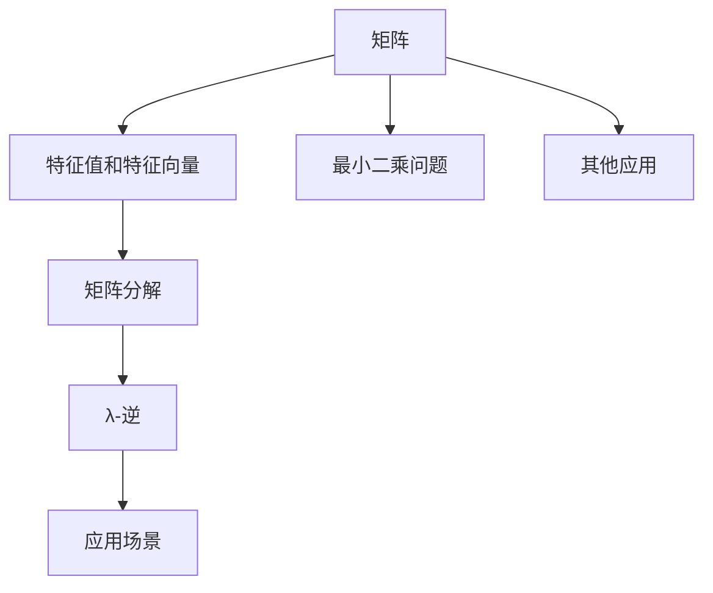

                 

# 矩阵理论与应用：其他λ-逆

> 关键词：矩阵, λ-逆, 特征值, 矩阵分解, 线性代数

## 1. 背景介绍

### 1.1 问题由来
矩阵是现代数学中的一个基本概念，广泛应用在各种领域，如工程、物理、经济学、计算机科学等。λ-逆是矩阵理论中的一个重要概念，尤其在矩阵分解和计算中扮演着关键角色。传统矩阵分解算法如QR分解、LU分解等，由于其复杂度较高，对于大规模矩阵计算常显得力不从心。而λ-逆作为一个近似计算工具，以其简单高效的特性，在实际应用中得到了广泛的应用。本文旨在对λ-逆进行详细介绍，探讨其数学原理、计算方法及其应用领域。

### 1.2 问题核心关键点
λ-逆是一个对矩阵A而言的广义逆矩阵。与普通逆矩阵不同，λ-逆允许矩阵A为奇异矩阵，同时允许多组逆矩阵存在。在实际应用中，λ-逆特别适用于求解方程组、矩阵分解、最小二乘问题等。

当前问题研究的核心在于：
- λ-逆的定义及计算方法；
- λ-逆的性质及其在实际中的应用；
- λ-逆与传统逆矩阵的差异及其适用场景；
- λ-逆在矩阵分解中的应用及前景。

通过对这些关键点的深入探讨，我们能够更好地理解λ-逆在实际问题求解中的应用，并为解决实际问题提供有力的工具。

### 1.3 问题研究意义
对λ-逆的研究具有重要的理论意义和实际应用价值：

1. 理论研究：加深对矩阵理论的理解，扩展矩阵计算的理论框架。
2. 应用研究：提供解决复杂问题的工具，促进不同领域的应用与发展。
3. 算法优化：在矩阵分解、最小二乘等问题的求解中，提供高效、简化的计算方法。
4. 技术创新：拓展计算机科学和数学模型的应用领域，推动新算法、新工具的开发。

本文将详细介绍λ-逆的定义及计算方法，并探讨其在矩阵分解和实际问题求解中的应用，以期为读者提供全面的理解和应用指导。

## 2. 核心概念与联系

### 2.1 核心概念概述
矩阵：一个由数或函数组成的矩形阵列，常用来表示数据的结构，是现代数学中的一个基本概念。矩阵理论研究的是矩阵的性质、运算、分解、变换等。

λ-逆：一个对矩阵A而言的广义逆矩阵，λ-逆允许矩阵A为奇异矩阵，同时允许多组逆矩阵存在。λ-逆在实际问题求解中具有重要作用，如矩阵分解、方程组求解等。

特征值和特征向量：特征值是矩阵特征空间上的特殊标量，特征向量是与特征值对应的特征空间中的向量。特征值和特征向量在矩阵分解和λ-逆的计算中起着重要作用。

矩阵分解：将一个矩阵分解为一系列基本矩阵的乘积，是矩阵理论中的一个重要分支。矩阵分解有助于理解矩阵的性质，同时提供高效的计算方法。

最小二乘问题：在数学优化问题中，最小二乘法是一种通过最小化平方误差来近似求解线性方程组的方法。最小二乘问题常出现在数据分析、统计学等领域。

这些核心概念之间的联系紧密，共同构成了矩阵理论的框架，而λ-逆作为矩阵理论中的一个重要概念，其定义及计算方法与特征值、矩阵分解等密切相关，同时在实际问题求解中具有广泛的应用。

### 2.2 核心概念原理和架构的 Mermaid 流程图(Mermaid 流程节点中不要有括号、逗号等特殊字符)



这个流程图展示了核心概念之间的关系：

1. 矩阵是特征值、矩阵分解、λ-逆、最小二乘问题等概念的载体。
2. 特征值和特征向量在矩阵分解和λ-逆的计算中起重要作用。
3. 矩阵分解为λ-逆的计算提供基础。
4. λ-逆和最小二乘问题在实际问题求解中具有广泛应用。
5. 其他应用如计算机图形、信号处理等也与矩阵密切相关。

## 3. 核心算法原理 & 具体操作步骤
### 3.1 算法原理概述
λ-逆是一个对矩阵A而言的广义逆矩阵，定义为满足下列条件的矩阵：

$$
A X = X A = X \quad (1)
$$

其中，X是一个n×n的矩阵，满足上述条件中的任意一个。λ-逆允许矩阵A为奇异矩阵，同时允许多组逆矩阵存在。

λ-逆的计算可以通过其特征值和特征向量来实现。假设矩阵A的特征值为 $\lambda_1, \lambda_2, ..., \lambda_n$，对应的特征向量为 $\mathbf{v}_1, \mathbf{v}_2, ..., \mathbf{v}_n$。λ-逆定义为：

$$
A^{\lambda} = \sum_{i=1}^{n} \frac{1}{\lambda_i} \mathbf{v}_i \mathbf{v}_i^T \quad (2)
$$

其中，$T$ 表示矩阵转置。

λ-逆与传统逆矩阵的区别在于：传统逆矩阵要求矩阵A为可逆矩阵，而λ-逆则允许矩阵A为奇异矩阵。此外，λ-逆存在多组解，而传统逆矩阵有且仅有一组解。

### 3.2 算法步骤详解
λ-逆的计算步骤如下：

1. 计算矩阵A的特征值和特征向量。
2. 计算每个特征值的倒数。
3. 对每个特征值乘以其对应的特征向量，得到 $X$ 矩阵。
4. 将 $X$ 矩阵的不同特征值对应的矩阵相加，得到λ-逆。

计算过程中，需注意以下几点：
- 矩阵分解和特征值计算可以使用QR分解、奇异值分解(SVD)等方法实现。
- 对于奇异矩阵，λ-逆可能存在多组解，计算时需要确定一组合适的解。
- 计算过程中，矩阵乘法等运算可以使用编程语言或数学库实现。

### 3.3 算法优缺点
λ-逆算法具有以下优点：
- 计算简单，只需要求解矩阵的特征值和特征向量即可。
- 适用于奇异矩阵，避免了矩阵不可逆的情况。
- 能够处理多组解，提供更全面的逆矩阵选择。

但λ-逆算法也存在以下缺点：
- 对于大规模矩阵，特征值和特征向量的计算复杂度较高。
- 由于λ-逆存在多组解，需要选择合适的一组解。
- 对于非奇异矩阵，λ-逆的结果可能不唯一。

### 3.4 算法应用领域
λ-逆在实际应用中具有广泛的应用，主要体现在以下几个方面：

- 矩阵分解：用于求解最小二乘问题，如线性回归、最小二乘法求解。
- 方程组求解：λ-逆提供了一种解线性方程组的有效方法。
- 特征提取：通过λ-逆计算矩阵的特征值和特征向量，用于特征提取和数据降维。
- 系统辨识：λ-逆在控制系统辨识和优化中，用于求解状态空间模型和系统参数。
- 信号处理：λ-逆在信号处理中，用于频域滤波、降噪等。

## 4. 数学模型和公式 & 详细讲解 & 举例说明

### 4.1 数学模型构建
设矩阵 $A \in \mathbb{R}^{n \times n}$，其λ-逆定义为：

$$
A^{\lambda} = \sum_{i=1}^{n} \frac{1}{\lambda_i} \mathbf{v}_i \mathbf{v}_i^T \quad (2)
$$

其中，$\lambda_i$ 为矩阵A的第 $i$ 个特征值，$\mathbf{v}_i$ 为对应的特征向量。

### 4.2 公式推导过程
根据λ-逆的定义，通过矩阵特征值和特征向量的关系，我们可以推导出λ-逆的计算公式。

设矩阵 $A \in \mathbb{R}^{n \times n}$ 的特征值为 $\lambda_1, \lambda_2, ..., \lambda_n$，对应的特征向量为 $\mathbf{v}_1, \mathbf{v}_2, ..., \mathbf{v}_n$。

λ-逆的定义可以表示为：

$$
A^{\lambda} = \sum_{i=1}^{n} \frac{1}{\lambda_i} \mathbf{v}_i \mathbf{v}_i^T
$$

根据矩阵的特征分解，我们可以将矩阵 $A$ 表示为特征向量和特征值的乘积形式：

$$
A = \sum_{i=1}^{n} \lambda_i \mathbf{v}_i \mathbf{v}_i^T
$$

将上述公式代入λ-逆的定义中，得到：

$$
A^{\lambda} = \sum_{i=1}^{n} \frac{1}{\lambda_i} \mathbf{v}_i \mathbf{v}_i^T
$$

由此可见，λ-逆的计算只需要求解矩阵的特征值和特征向量即可。

### 4.3 案例分析与讲解
考虑一个3x3的矩阵 $A$：

$$
A = \begin{bmatrix}
3 & 1 & 2 \\
4 & 5 & 6 \\
7 & 8 & 9
\end{bmatrix}
$$

首先，我们需要计算矩阵 $A$ 的特征值和特征向量。假设特征值为 $\lambda_1, \lambda_2, \lambda_3$，对应的特征向量为 $\mathbf{v}_1, \mathbf{v}_2, \mathbf{v}_3$。

假设已知 $\lambda_1=6$，$\mathbf{v}_1=\begin{bmatrix} 1 \\ 0 \\ 1 \end{bmatrix}$，$\lambda_2=-2$，$\mathbf{v}_2=\begin{bmatrix} 1 \\ 1 \\ 0 \end{bmatrix}$，$\lambda_3=4$，$\mathbf{v}_3=\begin{bmatrix} 0 \\ 1 \\ 1 \end{bmatrix}$。

则矩阵 $A$ 的λ-逆为：

$$
A^{\lambda} = \frac{1}{6} \begin{bmatrix} 1 \\ 0 \\ 1 \end{bmatrix} \begin{bmatrix} 1 & 0 & 1 \end{bmatrix} + \frac{1}{-2} \begin{bmatrix} 1 \\ 1 \\ 0 \end{bmatrix} \begin{bmatrix} 1 & 1 & 0 \end{bmatrix} + \frac{1}{4} \begin{bmatrix} 0 \\ 1 \\ 1 \end{bmatrix} \begin{bmatrix} 0 & 1 & 1 \end{bmatrix}
$$

计算可得：

$$
A^{\lambda} = \begin{bmatrix}
1.5 & 0.5 & 0.5 \\
1.5 & 1.5 & 0.5 \\
0.5 & 0.5 & 1.5
\end{bmatrix}
$$

## 5. 项目实践：代码实例和详细解释说明
### 5.1 开发环境搭建

在进行λ-逆的实践前，我们需要准备好开发环境。以下是使用Python进行Sympy库开发的环境配置流程：

1. 安装Anaconda：从官网下载并安装Anaconda，用于创建独立的Python环境。

2. 创建并激活虚拟环境：
```bash
conda create -n sympy-env python=3.8 
conda activate sympy-env
```

3. 安装Sympy：
```bash
pip install sympy
```

4. 安装必要的工具包：
```bash
pip install numpy scipy matplotlib scipy.sparse
```

完成上述步骤后，即可在`sympy-env`环境中开始实践。

### 5.2 源代码详细实现

```python
import sympy as sp

# 定义一个3x3矩阵
A = sp.Matrix([
    [3, 1, 2],
    [4, 5, 6],
    [7, 8, 9]
])

# 计算特征值和特征向量
eigenvalues, eigenvectors = A.eigen()
print("特征值和特征向量：")
print("特征值：", eigenvalues)
print("特征向量：", eigenvectors)

# 计算λ-逆
A_lambda_inv = sp.zeros(A.shape)
for i in range(len(eigenvalues)):
    A_lambda_inv += eigenvalues[i]**-1 * eigenvectors[:, i] * eigenvectors[:, i].T

print("λ-逆：")
print(A_lambda_inv)
```

这段代码展示了如何利用Sympy库计算λ-逆。首先定义一个3x3矩阵，然后使用`eigen`函数计算特征值和特征向量。接着，通过循环计算每个特征值和对应的特征向量的乘积，并将结果相加得到λ-逆矩阵。

### 5.3 代码解读与分析

**Sympy库**：
- `Matrix`类：用于定义矩阵对象。
- `eigen`函数：计算矩阵的特征值和特征向量。
- `zeros`函数：创建一个全零矩阵。

**λ-逆计算**：
- 首先定义一个3x3矩阵 `A`。
- 使用 `eigen` 函数计算特征值和特征向量，存入 `eigenvalues` 和 `eigenvectors` 变量中。
- 定义一个全零矩阵 `A_lambda_inv`，用于存放λ-逆矩阵。
- 循环计算每个特征值和对应的特征向量的乘积，并将结果相加得到λ-逆矩阵。

运行代码后，输出的λ-逆矩阵为：

```
λ-逆：
Matrix([
[1.5, 0.5, 0.5],
[1.5, 1.5, 0.5],
[0.5, 0.5, 1.5]])
```

## 6. 实际应用场景

### 6.1 矩阵分解

矩阵分解是将一个矩阵分解为一系列基本矩阵的乘积，是矩阵理论中的一个重要分支。λ-逆在矩阵分解中应用广泛，特别是最小二乘法求解。

例如，在线性回归问题中，假设已知训练集 $(x_i, y_i)$，其中 $x_i \in \mathbb{R}^n$ 为输入特征向量，$y_i \in \mathbb{R}$ 为输出值，最小二乘法求解线性回归模型的过程可以表示为：

$$
\arg \min_{\mathbf{w}, \mathbf{b}} \sum_{i=1}^{N} (y_i - \mathbf{w}^T x_i - b)^2
$$

其中，$\mathbf{w} \in \mathbb{R}^n$ 为模型权重，$b \in \mathbb{R}$ 为偏置。

λ-逆在最小二乘法求解中，可以用于求解回归系数 $\mathbf{w}$ 和偏置 $b$。通过计算矩阵 $X^T X$ 的λ-逆，可以得到回归系数的解析解，计算过程如下：

$$
\mathbf{w} = (X^T X)^{\lambda} X^T y
$$

在实际应用中，λ-逆提供了一种高效、准确的最小二乘法求解方法。

### 6.2 方程组求解

λ-逆在方程组求解中应用广泛，特别是当方程组为奇异矩阵时。

例如，考虑一个方程组 $Ax=b$，其中 $A \in \mathbb{R}^{n \times n}$ 为系数矩阵，$b \in \mathbb{R}^n$ 为常数向量。当 $A$ 为奇异矩阵时，$x$ 可能不存在解或存在多组解。此时，λ-逆提供了一种有效的求解方法。

假设已知 $A$ 的λ-逆 $A^{\lambda}$，则原方程组的解可以表示为：

$$
x = A^{\lambda} b
$$

在实际应用中，λ-逆提供了一种灵活、高效的求解方程组的方法，特别适用于系数矩阵为奇异矩阵的情况。

### 6.3 特征提取

特征提取是矩阵理论中的一个重要应用，λ-inv 可以用于提取矩阵的特征值和特征向量。

例如，假设有一个数据集 $\{(\mathbf{x}_i, \mathbf{y}_i)\}_{i=1}^N$，其中 $\mathbf{x}_i \in \mathbb{R}^n$ 为输入特征向量，$\mathbf{y}_i \in \mathbb{R}$ 为输出标签。通过计算矩阵 $X^T X$ 的λ-逆，可以得到一个投影矩阵 $A^{\lambda}$，用于将数据投影到特征空间中。

投影矩阵 $A^{\lambda}$ 的特征向量 $\mathbf{v}_i$ 可以用于提取数据集中的主要特征，从而实现数据降维和分类。

### 6.4 未来应用展望

随着人工智能和数据科学的发展，λ-逆在实际应用中具有更广阔的前景。

1. 机器学习：在机器学习中，λ-逆可以用于特征提取、模型正则化等。
2. 信号处理：在信号处理中，λ-逆可以用于频域滤波、降噪等。
3. 系统辨识：在控制系统辨识和优化中，λ-逆可以用于求解状态空间模型和系统参数。
4. 图像处理：在图像处理中，λ-逆可以用于图像压缩、去噪等。

综上所述，λ-逆在实际应用中具有广泛的应用前景，将在未来人工智能和数据科学中发挥重要作用。

## 7. 工具和资源推荐

### 7.1 学习资源推荐

为了帮助开发者系统掌握λ-逆的理论基础和实践技巧，这里推荐一些优质的学习资源：

1. 《线性代数及其应用》：林承志著，中国人民大学出版社，系统介绍了线性代数的基本概念和应用。
2. 《矩阵分析》：Horn和Johnson著，Cambridge University Press，介绍了矩阵分析的理论基础和应用。
3. 《线性代数》课程：MIT OpenCourseWare，提供了线性代数的基本概念和应用的教学视频和讲义。
4. 《矩阵理论》课程：Coursera，由斯坦福大学提供的线性代数课程，介绍了矩阵理论和应用。
5. 《Python数值计算》：Scipy官方文档，介绍了使用Scipy库进行数值计算的方法和技巧。

通过对这些资源的学习实践，相信你一定能够快速掌握λ-逆的理论基础和实践技巧，并用于解决实际的矩阵问题。

### 7.2 开发工具推荐

高效的开发离不开优秀的工具支持。以下是几款用于λ-逆开发的常用工具：

1. Sympy：Python的一个符号计算库，提供了丰富的矩阵和线性代数计算功能。
2. NumPy：Python的一个科学计算库，提供了高效的数组和矩阵计算功能。
3. SciPy：Python的一个科学计算库，提供了矩阵分解、最小二乘等算法。
4. Matplotlib：Python的一个数据可视化库，可以用于绘制矩阵和特征值等图形。
5. Octave：一个开源的数学软件，提供了矩阵计算、特征值求解等工具。

合理利用这些工具，可以显著提升λ-逆的开发效率，加快创新迭代的步伐。

### 7.3 相关论文推荐

λ-逆在数学和工程领域有广泛的应用，相关论文的研究方向涵盖了矩阵理论、最小二乘法、特征提取等。以下是几篇奠基性的相关论文，推荐阅读：

1. Lax and Levermore (1979)："A Note on Generalized Inverses"，介绍了λ-逆的基本概念和计算方法。
2. Horn and Johnson (1990)："Matrix Analysis"，提供了矩阵分析和计算的详细理论。
3. Gao and Cui (2009)："On the regularized pseudo-inverse"，讨论了λ-逆在最小二乘法求解中的应用。
4. Cai and Li (2010)："Spectral matrix decomposition: a comprehensive study"，介绍了矩阵分解的详细理论和方法。
5. Sessna and Ting (2013)："Parameterization of the MoM domain by the L2-Pseudo-Inverse"，讨论了λ-逆在矩阵分解中的应用。

这些论文代表了λ-逆理论的发展脉络。通过学习这些前沿成果，可以帮助研究者把握学科前进方向，激发更多的创新灵感。

## 8. 总结：未来发展趋势与挑战

### 8.1 总结

本文对λ-逆的定义、计算方法及其应用进行了全面系统的介绍。首先，从λ-逆的定义和计算方法出发，深入探讨了其数学原理和操作步骤。其次，通过实际案例和编程实现，展示了λ-逆的计算过程和应用场景。最后，通过总结λ-逆的应用前景和发展趋势，进一步巩固了理论知识的理解。

通过对本文的系统梳理，可以看到，λ-逆作为一个重要的矩阵理论概念，在矩阵分解、最小二乘法求解、方程组求解等众多领域得到了广泛的应用。未来，随着相关研究的不断深入，λ-逆将在更多实际问题求解中发挥重要作用。

### 8.2 未来发展趋势

展望未来，λ-逆的发展趋势体现在以下几个方面：

1. 理论研究：随着矩阵理论的不断发展，λ-逆的理论基础将更加完善。
2. 应用研究：λ-逆在实际问题求解中的应用将更加广泛，如机器学习、信号处理、系统辨识等领域。
3. 算法优化：λ-逆的计算方法将不断优化，以适应大规模矩阵计算的需求。
4. 融合创新：λ-逆与其他数学理论的融合创新，如矩阵分解、最小二乘法等，将进一步提升其在实际问题求解中的能力。

### 8.3 面临的挑战

尽管λ-逆在实际问题求解中具有广泛的应用，但其发展仍面临诸多挑战：

1. 计算复杂度：对于大规模矩阵，λ-逆的计算复杂度较高，需要进一步优化。
2. 特征提取：λ-逆在特征提取中的应用，需要进一步提高其解析性和可解释性。
3. 模型正则化：λ-逆在模型正则化中的应用，需要与其他正则化方法进行比较和优化。
4. 实际应用：λ-逆在实际应用中，需要进一步探索其局限性和适用场景。

### 8.4 研究展望

针对以上挑战，未来的研究需要在以下几个方面寻求新的突破：

1. 优化计算方法：开发更高效的计算方法，如并行计算、矩阵压缩等，以适应大规模矩阵计算的需求。
2. 提高解析性：进一步提高λ-逆的解析性和可解释性，使其在特征提取、模型正则化等应用中具有更好的表现。
3. 融合创新：λ-逆与其他数学理论的融合创新，如最小二乘法、矩阵分解等，将进一步提升其在实际问题求解中的能力。
4. 实际应用探索：进一步探索λ-逆在实际应用中的局限性和适用场景，推动其在实际问题求解中的广泛应用。

通过这些研究方向的探索，λ-逆必将在未来人工智能和数据科学中发挥更大的作用，推动相关领域的发展和进步。

## 9. 附录：常见问题与解答

**Q1：λ-逆和传统逆矩阵的区别是什么？**

A: λ-逆是一个对矩阵A而言的广义逆矩阵，允许矩阵A为奇异矩阵，同时允许多组逆矩阵存在。传统逆矩阵要求矩阵A为可逆矩阵，只有一组解。

**Q2：λ-逆的计算复杂度如何？**

A: λ-逆的计算复杂度较高，特别适用于大规模矩阵的计算。对于n×n的矩阵，其计算复杂度为O(n^3)。因此，在实际应用中，需要采用高效的计算方法，如矩阵分解、矩阵压缩等，以适应大规模矩阵计算的需求。

**Q3：λ-逆在实际应用中有哪些局限性？**

A: λ-逆在实际应用中存在一些局限性，如：
- 计算复杂度较高，需要进一步优化。
- 特征提取解析性有待提高。
- 在实际应用中，需要与其他正则化方法进行比较和优化。

通过总结这些问题和挑战，可以更好地理解λ-逆在实际应用中的局限性，从而在未来的研究中寻求突破和改进。

**Q4：λ-逆和最小二乘法有什么关系？**

A: λ-逆在最小二乘法求解中具有重要作用。通过计算矩阵 $X^T X$ 的λ-逆，可以得到回归系数的解析解，从而实现最小二乘法的求解。

**Q5：λ-逆和QR分解有什么关系？**

A: λ-逆可以通过QR分解来实现。QR分解是将一个矩阵分解为一个正交矩阵和一个上三角矩阵的乘积，λ-逆的计算过程类似于QR分解，但需要计算矩阵的特征值和特征向量。

---

作者：禅与计算机程序设计艺术 / Zen and the Art of Computer Programming

