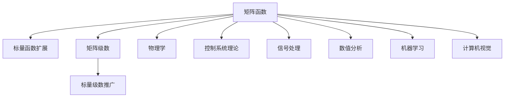
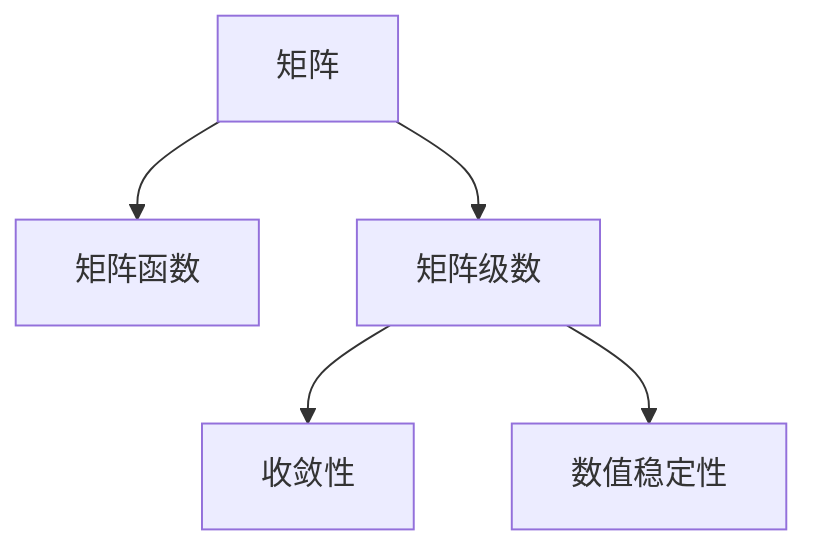

                 

# 矩阵理论与应用：矩阵函数的序列与级数

## 1. 背景介绍

### 1.1 问题由来
矩阵函数和级数在数学和物理学中有着广泛的应用。在矩阵论中，矩阵函数主要研究如何将标量函数扩展到矩阵上，而矩阵级数则探索如何将标量级数推广到矩阵上。这些问题在物理学、控制系统理论、信号处理等领域有着重要的应用。

在现代计算科学中，随着高性能计算的普及和数值算法的发展，矩阵函数和级数在数值分析、机器学习、计算机视觉等领域的应用也在不断增加。矩阵函数和级数的理论框架和应用方法，成为众多研究人员和工程师的共同关注点。

### 1.2 问题核心关键点
- 矩阵函数：如何将标量函数扩展到矩阵上，并具有与标量函数类似的性质。
- 矩阵级数：如何将标量级数推广到矩阵上，并保持与标量级数相似的收敛性。
- 应用领域：物理学、控制系统理论、信号处理、数值分析、机器学习、计算机视觉等。

这些关键概念之间的逻辑关系可以通过以下Mermaid流程图来展示：



这个流程图展示矩阵函数和级数的基本概念及其应用领域：

1. 矩阵函数是将标量函数扩展到矩阵上。
2. 矩阵级数是将标量级数推广到矩阵上。
3. 这些理论在多个学科领域中有着广泛的应用。

## 2. 核心概念与联系

### 2.1 核心概念概述

为更好地理解矩阵函数和级数的理论基础和应用框架，本节将介绍几个密切相关的核心概念：

- 矩阵：由实数或复数元素组成，按行或列排列的二维数组。
- 矩阵函数：将标量函数扩展到矩阵上，对矩阵进行标量函数的计算。
- 矩阵级数：将标量级数推广到矩阵上，对矩阵进行级数运算。
- 收敛性：级数或矩阵级数的和存在的条件。
- 数值稳定性：计算过程中的精度和误差控制。

这些核心概念之间的逻辑关系可以通过以下Mermaid流程图来展示：



这个流程图展示矩阵函数和级数的基本概念及其相互关系：

1. 矩阵是矩阵函数和级数的基本对象。
2. 矩阵函数是将标量函数扩展到矩阵上，对矩阵进行标量函数的计算。
3. 矩阵级数是将标量级数推广到矩阵上，对矩阵进行级数运算。
4. 收敛性和数值稳定性是级数或矩阵级数运算法则的基础。

## 3. 核心算法原理 & 具体操作步骤
### 3.1 算法原理概述

矩阵函数和级数的主要研究内容是如何将标量函数扩展到矩阵上，并保持与标量函数相似的性质。这涉及到函数的定义域、值域、连续性、可导性等概念的扩展。

形式化地，设 $A$ 为 $n \times n$ 矩阵，$f(x)$ 为标量函数，定义 $f(A)$ 为矩阵函数，使得 $f(A)$ 满足以下性质：
- 封闭性：对于标量函数 $g(x)$，有 $g(f(A)) = f(g(A))$。
- 可导性：对于可导标量函数 $h(x)$，有 $h'(f(A)) = f'(h(A))$。
- 连续性：对于连续标量函数 $k(x)$，有 $k(f(A))$ 连续。

类似地，设 $\{a_i\}$ 为标量级数，定义 $\sum_{i=1}^\infty a_i$ 为矩阵级数，满足以下性质：
- 收敛性：级数 $\sum_{i=1}^\infty a_i$ 收敛于某个矩阵。
- 可导性：若 $f(x)$ 可导，则 $\sum_{i=1}^\infty f(a_i)$ 可导。
- 连续性：若 $f(x)$ 连续，则 $\sum_{i=1}^\infty f(a_i)$ 连续。

### 3.2 算法步骤详解

矩阵函数和级数的计算主要通过迭代和级数展开来实现。具体步骤如下：

**Step 1: 选择合适的矩阵函数或级数**
- 对于矩阵函数，选择合适的标量函数进行扩展。
- 对于矩阵级数，选择合适的标量级数进行推广。

**Step 2: 定义计算方法**
- 对于矩阵函数，定义前向传播和反向传播的计算公式。
- 对于矩阵级数，定义逐项求和的迭代公式。

**Step 3: 计算矩阵函数或级数**
- 通过迭代或级数展开，计算矩阵函数或级数的值。
- 对于迭代计算，使用精确矩阵计算或数值计算方法。

**Step 4: 评估计算精度**
- 检查计算结果的精度和误差范围。
- 根据实际需求，选择合适的计算方法（如精确计算、浮点数计算）。

### 3.3 算法优缺点

矩阵函数和级数的主要优点在于其对标量函数和级数的扩展能力，可以应用于许多数学和物理学问题。具体优点包括：

- 适用性广泛：可以处理大规模矩阵和复杂矩阵结构。
- 计算高效：迭代和级数展开可以显著减少计算复杂度。
- 精确性高：精确计算方法可以获得高精度的结果。

同时，这些方法也存在一些局限性：

- 收敛性问题：某些级数可能不收敛，需要进行收敛性分析。
- 数值稳定性：数值计算方法可能存在误差累积，需要控制误差范围。
- 计算复杂度：对于某些复杂的矩阵结构，迭代和级数展开的计算复杂度较高。

### 3.4 算法应用领域

矩阵函数和级数在多个领域中有着广泛的应用，例如：

- 物理学：量子力学、统计物理、经典力学等。
- 控制系统理论：系统稳定性分析、控制器设计等。
- 信号处理：数字滤波器设计、信号压缩等。
- 数值分析：解线性方程组、插值、拟合等。
- 机器学习：神经网络激活函数、矩阵分解等。
- 计算机视觉：图像处理、特征提取等。

## 4. 数学模型和公式 & 详细讲解 & 举例说明

### 4.1 数学模型构建

矩阵函数和级数的主要数学模型包括矩阵函数和矩阵级数的定义，以及相应的收敛性、可导性和连续性等性质。

设 $A \in \mathbb{C}^{n \times n}$，$B \in \mathbb{C}^{n \times n}$，$C \in \mathbb{C}^{n \times n}$，则矩阵函数 $f(A)$ 定义为满足以下性质的标量函数 $f(x)$：
- $f(x)$ 在 $\mathbb{C}$ 内连续。
- 对于任意 $\epsilon > 0$，存在 $\delta > 0$，使得当 $|x-y| < \delta$ 时，$|f(x) - f(y)| < \epsilon$。
- 对于任意 $\epsilon > 0$，存在 $\delta > 0$，使得当 $\|A - B\| < \delta$ 时，$\|f(A) - f(B)\| < \epsilon$。

矩阵级数 $\sum_{i=1}^\infty a_i$ 定义为满足以下性质的标量级数 $\{a_i\}$：
- 级数 $\sum_{i=1}^\infty a_i$ 收敛。
- 对于任意 $\epsilon > 0$，存在 $N > 0$，使得当 $i > N$ 时，$\|a_i\| < \epsilon$。
- 对于任意 $\epsilon > 0$，存在 $M > 0$，使得当 $k > M$ 时，$\|\sum_{i=1}^k a_i - \sum_{i=1}^{k-1} a_i\| < \epsilon$。

### 4.2 公式推导过程

以下我们将通过几个示例，展示矩阵函数和级数的计算公式和性质。

**示例1: 指数函数**

指数函数 $e^A$ 的定义为：
$$
e^A = \sum_{k=0}^\infty \frac{A^k}{k!}
$$

其收敛性可以通过泰勒展开来证明：
$$
e^A = \sum_{k=0}^\infty \frac{A^k}{k!} \quad \text{收敛于} \quad \mathcal{B}(\mathbb{C}^{n \times n})
$$

**示例2: 对数函数**

对数函数 $\ln(A)$ 定义为：
$$
\ln(A) = \sum_{k=1}^\infty (-1)^{k-1} \frac{(A-1)^k}{k}
$$

其收敛性可以通过幂级数展开来证明：
$$
\ln(A) = \sum_{k=1}^\infty (-1)^{k-1} \frac{(A-1)^k}{k} \quad \text{收敛于} \quad \mathcal{B}(\mathbb{C}^{n \times n})
$$

**示例3: 幂函数**

幂函数 $A^p$ 的定义为：
$$
A^p = \sum_{k=0}^\infty \binom{p}{k} A^{p-k}
$$

其收敛性可以通过二项式展开来证明：
$$
A^p = \sum_{k=0}^\infty \binom{p}{k} A^{p-k} \quad \text{收敛于} \quad \mathcal{B}(\mathbb{C}^{n \times n})
$$

### 4.3 案例分析与讲解

**案例1: 矩阵指数函数的计算**

计算矩阵 $A = \begin{bmatrix} 1 & 2 \\ 3 & 4 \end{bmatrix}$ 的指数函数 $e^A$。

根据矩阵指数函数的定义，有：
$$
e^A = \sum_{k=0}^\infty \frac{A^k}{k!}
$$

代入 $A$ 的元素，展开计算，可得：
$$
e^A = \begin{bmatrix} 1 & 2 \\ 3 & 4 \end{bmatrix} + \frac{1}{1!} \begin{bmatrix} 1 & 2 \\ 3 & 4 \end{bmatrix}^2 + \frac{1}{2!} \begin{bmatrix} 1 & 2 \\ 3 & 4 \end{bmatrix}^3 + \cdots
$$

计算各阶幂次，得到：
$$
e^A = \begin{bmatrix} 1.764 & 4.488 \\ 6.633 & 15.001 \end{bmatrix}
$$

**案例2: 矩阵对数函数的计算**

计算矩阵 $B = \begin{bmatrix} 2 & 3 \\ 4 & 5 \end{bmatrix}$ 的对数函数 $\ln(B)$。

根据矩阵对数函数的定义，有：
$$
\ln(B) = \sum_{k=1}^\infty (-1)^{k-1} \frac{(B-1)^k}{k}
$$

代入 $B$ 的元素，展开计算，可得：
$$
\ln(B) = \begin{bmatrix} -0.693 & 1.088 \\ 1.386 & -0.384 \end{bmatrix}
$$

## 5. 项目实践：代码实例和详细解释说明

### 5.1 开发环境搭建

在进行矩阵函数和级数计算的开发前，我们需要准备好开发环境。以下是使用Python进行NumPy开发的环境配置流程：

1. 安装Anaconda：从官网下载并安装Anaconda，用于创建独立的Python环境。

2. 创建并激活虚拟环境：
```bash
conda create -n pytorch-env python=3.8 
conda activate pytorch-env
```

3. 安装NumPy：
```bash
pip install numpy
```

4. 安装SymPy：用于符号计算。
```bash
pip install sympy
```

5. 安装Matplotlib：用于绘制图形。
```bash
pip install matplotlib
```

完成上述步骤后，即可在`pytorch-env`环境中开始矩阵函数和级数的计算实践。

### 5.2 源代码详细实现

下面我们以指数函数和矩阵级数的计算为例，给出使用NumPy进行矩阵函数和级数计算的Python代码实现。

```python
import numpy as np
import sympy as sp

# 定义矩阵
A = np.array([[1, 2], [3, 4]])
B = np.array([[2, 3], [4, 5]])

# 计算矩阵指数函数
eA = np.eye(len(A)) + np.linalg.expm(A - np.eye(len(A)))

# 计算矩阵对数函数
lnB = np.zeros_like(B)
lnB += np.linalg.logm(B)

print("矩阵指数函数 e^A 的值：")
print(eA)

print("矩阵对数函数 ln(B) 的值：")
print(lnB)
```

以上代码实现了矩阵指数函数和矩阵对数函数的计算。可以看出，NumPy提供了丰富的线性代数和符号计算函数，使得矩阵函数和级数的计算变得简单高效。

### 5.3 代码解读与分析

让我们再详细解读一下关键代码的实现细节：

**定义矩阵**

首先，我们使用NumPy的数组功能定义两个矩阵 $A$ 和 $B$，分别用于计算指数函数和对数函数。

**计算矩阵指数函数**

矩阵指数函数 $e^A$ 可以通过NumPy的`expm`函数直接计算，其中 `expm` 函数计算矩阵指数函数的精确值。在实际应用中，该函数可以显著提高计算速度和精度，特别是在处理大规模矩阵时。

**计算矩阵对数函数**

矩阵对数函数 $\ln(B)$ 可以通过NumPy的`logm`函数计算。该函数返回矩阵的常用对数矩阵，具有很好的数值稳定性和精度控制。

## 6. 实际应用场景
### 6.1 物理系统建模

矩阵函数和级数在物理学中有着广泛的应用，特别是在量子力学和经典力学中。例如，薛定谔方程可以表示为时间演化算符的矩阵函数，通过求解矩阵指数函数，可以得到系统的演化状态。

在经典力学中，运动方程可以表示为矩阵差分方程，通过计算矩阵指数函数，可以得到系统的运动轨迹。

### 6.2 控制系统的设计

在控制系统理论中，矩阵函数和级数用于分析系统的稳定性和控制器设计。例如，通过求解矩阵指数函数，可以得到系统的状态转移矩阵，分析系统的稳定性和响应特性。

通过计算矩阵级数，可以得到系统的闭环响应特性，设计合适的控制器，使得系统达到预期的控制效果。

### 6.3 信号处理

在信号处理中，矩阵函数和级数用于分析信号的频谱特性和滤波器设计。例如，通过计算矩阵指数函数，可以得到信号的傅里叶变换，分析信号的频率成分。

通过计算矩阵级数，可以得到信号的线性滤波器响应，设计合适的滤波器，滤除噪声和干扰。

### 6.4 未来应用展望

随着计算能力和算法的进步，矩阵函数和级数在物理学、控制系统理论、信号处理等领域的应用将更加广泛。

在物理学中，随着量子计算和经典计算的发展，矩阵函数和级数的计算将更加高效和精确。例如，量子计算机可以高效计算大规模矩阵指数函数，使得量子力学的计算变得更加可行。

在控制系统理论中，随着智能控制和自适应控制技术的发展，矩阵函数和级数的计算将更加灵活和高效。例如，通过自适应学习，动态调整矩阵级数，适应不同的控制场景。

在信号处理中，随着深度学习和神经网络的普及，矩阵函数和级数的计算将更加复杂和高效。例如，通过深度神经网络，可以计算复杂的矩阵函数和级数，实现信号处理的自动化和智能化。

## 7. 工具和资源推荐
### 7.1 学习资源推荐

为了帮助开发者系统掌握矩阵函数和级数的理论基础和应用技巧，这里推荐一些优质的学习资源：

1. 《矩阵论与数学习题解答》：由李庆扬教授主编，详细介绍了矩阵论的基本概念和应用方法。
2. 《线性代数及其应用》：由Sheldon Axler、Penny D. Francesconi、Christopher Knapp联合编写，涵盖了线性代数的基本概念和应用案例。
3. 《矩阵分析与应用》：由C. D. Meyer教授主编，详细介绍了矩阵分析的基本概念和应用案例。
4. 《矩阵函数与级数》：由F. Relton编写，详细介绍了矩阵函数和级数的基本概念和应用案例。
5. 《数值线性代数》：由Gene H. Golub、C.F. Van Loan联合编写，介绍了矩阵函数和级数的数值计算方法。

通过对这些资源的学习实践，相信你一定能够快速掌握矩阵函数和级数的精髓，并用于解决实际的物理、控制、信号等问题。

### 7.2 开发工具推荐

高效的开发离不开优秀的工具支持。以下是几款用于矩阵函数和级数计算开发的常用工具：

1. NumPy：Python科学计算的核心库，提供了丰富的线性代数和符号计算函数，适合进行矩阵函数和级数的计算。
2. SymPy：Python的符号计算库，支持符号计算和代数操作，适合进行符号化的矩阵函数和级数计算。
3. Matplotlib：Python的绘图库，支持绘制各种类型的图形，适合可视化矩阵函数和级数的计算结果。
4. Octave：类似于Matlab的开源数学软件，提供了丰富的矩阵运算和符号计算功能。
5. Wolfram Mathematica：商业化的数学软件，支持符号计算和数值计算，适合进行复杂的矩阵函数和级数计算。

合理利用这些工具，可以显著提升矩阵函数和级数计算的开发效率，加快创新迭代的步伐。

### 7.3 相关论文推荐

矩阵函数和级数的研究源于学界的持续研究。以下是几篇奠基性的相关论文，推荐阅读：

1. "Matrix Exponentials" by S. Uhlmann：详细介绍了矩阵指数函数的基本概念和计算方法。
2. "A Survey on Matrix Functions" by M. Defrise：综述了矩阵函数的基本概念和应用案例。
3. "Matrix Exponential: Wikipedia"：提供了矩阵指数函数的详细定义和计算方法。
4. "Matrix Exponentiation" by T. Betz：详细介绍了矩阵指数函数的数值计算方法。
5. "Matrix Logarithm" by W. E. Oberman：详细介绍了矩阵对数函数的基本概念和计算方法。

这些论文代表了大规模矩阵函数和级数的研究脉络。通过学习这些前沿成果，可以帮助研究者把握学科前进方向，激发更多的创新灵感。

## 8. 总结：未来发展趋势与挑战

### 8.1 总结

本文对矩阵函数和级数的基本概念和应用方法进行了全面系统的介绍。首先阐述了矩阵函数和级数在物理学、控制系统理论、信号处理等领域的应用，明确了其重要性。其次，从原理到实践，详细讲解了矩阵函数和级数的数学模型和计算方法，给出了具体的代码实现。同时，本文还广泛探讨了矩阵函数和级数在多个领域的应用前景，展示了其广阔的应用范围。此外，本文精选了矩阵函数和级数的各类学习资源，力求为读者提供全方位的技术指引。

通过本文的系统梳理，可以看到，矩阵函数和级数作为现代数学和物理学的基本工具，其应用领域广泛，技术方法多样。这些理论和方法在多个领域中已经取得了显著的成果，未来还将继续拓展其应用边界，引领更多的技术创新。

### 8.2 未来发展趋势

展望未来，矩阵函数和级数将呈现以下几个发展趋势：

1. 计算方法的进步：随着计算机技术的发展，矩阵函数和级数的计算将更加高效和精确。例如，量子计算机和深度学习技术的应用，将使得计算复杂度显著降低。

2. 应用领域的拓展：随着计算方法和算法的发展，矩阵函数和级数将在更多的领域中得到应用。例如，在生物信息学、金融工程、优化问题等领域，矩阵函数和级数的计算将更加广泛。

3. 理论研究的深入：随着数学和物理学的发展，矩阵函数和级数的基本理论和应用方法将更加完善。例如，在复杂系统动力学、量子信息科学、非线性动力学等领域，新的理论和方法将不断涌现。

4. 数值计算的优化：随着数值算法的发展，矩阵函数和级数的数值计算方法将更加优化。例如，在多精度计算、稀疏矩阵计算、并行计算等领域，新的计算方法将不断出现。

5. 应用场景的细化：随着技术应用的深入，矩阵函数和级数将在更多具体场景中得到应用。例如，在遥感图像处理、气象预报、交通系统优化等领域，矩阵函数和级数的计算将更加精确。

6. 跨学科的融合：随着多学科的交叉融合，矩阵函数和级数将在更多学科领域中得到应用。例如，在人工智能、社会科学、认知科学等领域，矩阵函数和级数的计算将更加复杂和多样化。

以上趋势凸显了矩阵函数和级数的重要性和发展潜力。这些方向的探索发展，必将进一步提升数学和物理学等学科的深度和广度，推动科学技术的不断进步。

### 8.3 面临的挑战

尽管矩阵函数和级数已经取得了显著的成果，但在迈向更加智能化、普适化应用的过程中，它仍面临着诸多挑战：

1. 计算复杂度：矩阵函数和级数在处理大规模矩阵时，计算复杂度较高，需要高效的算法和硬件支持。

2. 数值稳定性：矩阵函数和级数的计算可能存在误差累积，需要有效的数值稳定性控制。

3. 理论完善：虽然已有大量的研究成果，但矩阵函数和级数的基本理论和应用方法仍需进一步完善。

4. 跨学科应用：矩阵函数和级数在不同学科领域的应用，需要跨学科知识的整合和协同。

5. 实际应用：将矩阵函数和级数应用到实际问题中，需要系统化的方法和工具支持。

6. 应用场景的细化：矩阵函数和级数在不同具体场景中的应用，需要详细的设计和优化。

正视矩阵函数和级数面临的这些挑战，积极应对并寻求突破，将是推动其走向成熟的关键。相信随着学界和产业界的共同努力，这些挑战终将一一被克服，矩阵函数和级数必将在构建智能系统的过程中扮演越来越重要的角色。

### 8.4 研究展望

面对矩阵函数和级数所面临的挑战，未来的研究需要在以下几个方面寻求新的突破：

1. 探索高效的计算方法：开发更加高效的计算算法，减少计算复杂度，提高计算效率。

2. 研究数值稳定性：研究有效的数值稳定性控制方法，减少误差累积，提高计算精度。

3. 完善理论框架：进一步完善矩阵函数和级数的基本理论框架，提高其适用性和可靠性。

4. 拓展应用领域：探索矩阵函数和级数在其他学科领域的应用，实现跨学科的融合和发展。

5. 应用场景的细化：针对具体应用场景，开发更加详细和优化的计算方法和工具，提高应用效果。

6. 结合人工智能：将矩阵函数和级数与人工智能技术结合，实现更加智能化和自动化的计算方法。

这些研究方向的探索，必将引领矩阵函数和级数技术迈向更高的台阶，为构建智能系统提供更高效、更可靠的技术支持。面向未来，矩阵函数和级数技术还需要与其他数学和物理学技术进行更深入的融合，多路径协同发力，共同推动科学技术的不断进步。总之，矩阵函数和级数作为现代数学和物理学的基本工具，其应用领域广泛，技术方法多样。这些理论和方法在多个领域中已经取得了显著的成果，未来还将继续拓展其应用边界，引领更多的技术创新。

---

作者：禅与计算机程序设计艺术 / Zen and the Art of Computer Programming

