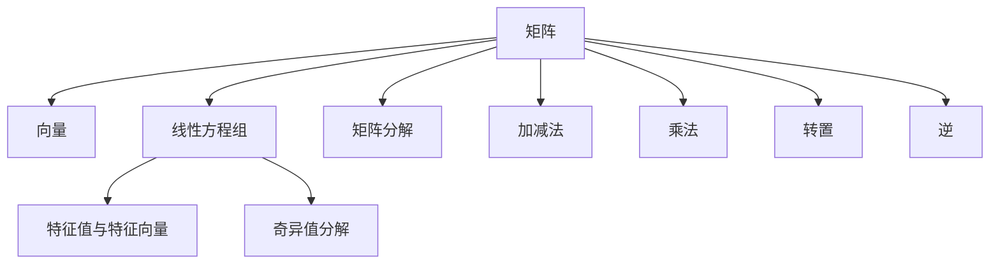

                 

## 1. 背景介绍

矩阵理论是现代数学的一个重要分支，广泛应用于工程、物理、计算机科学等领域。矩阵不仅在数学运算中扮演着关键角色，还成为现代计算科学的核心工具。从线性代数到优化算法，从深度学习到信号处理，矩阵理论无处不在。本文将详细阐述矩阵理论的基本知识，探讨其在实际应用中的原理与技巧。

### 1.1 问题的由来

矩阵与线性代数早在19世纪初就已形成学科基础，但随着计算机科学和信息技术的飞速发展，矩阵理论的应用范围和深度也在不断扩展。从计算几何、数值分析到信号处理、深度学习，矩阵理论被广泛应用于众多领域。其在科学计算、工程设计、数据科学等诸多领域均扮演了重要角色。

在数学研究中，矩阵理论深入探讨了矩阵的性质和变换，成为现代数学体系的重要组成部分。而在计算机科学中，矩阵理论帮助解决了众多复杂的计算问题，如线性系统求解、优化问题、图像处理等，为计算机科学带来了质的飞跃。

### 1.2 问题的核心关键点

矩阵理论的核心在于理解矩阵的组成、运算和变换。我们通过矩阵的加减法、乘法、转置、逆等基本运算，建立起矩阵的基本运算框架。在此基础上，进一步探讨矩阵的特征值与特征向量、奇异值分解、矩阵分解等高级概念，以此来理解矩阵的结构和性质。

## 2. 核心概念与联系

### 2.1 核心概念概述

矩阵理论涉及诸多核心概念，包括矩阵、向量和线性方程组等。在此，我们选取几个关键概念进行概述：

- **矩阵**：由数或符号排成的矩形阵列，通常用大写字母表示，如 $A$、$B$ 等。
- **向量**：一个具有大小和方向的量，可以看作是一维矩阵。
- **线性方程组**：一组包含未知数的线性方程。
- **特征值与特征向量**：矩阵的特征值和特征向量是矩阵理论的核心，用于描述矩阵的性质和行为。
- **奇异值分解**：用于分解矩阵的高级算法，揭示矩阵的低秩性质。
- **矩阵分解**：将复杂矩阵分解为简单矩阵的方法，常见有QR分解、LU分解等。

这些核心概念之间通过运算和变换紧密联系，构成了矩阵理论的基础框架。

### 2.2 核心概念原理和架构的 Mermaid 流程图



这个流程图展示了矩阵理论中几个核心概念之间的联系和转化过程。

## 3. 核心算法原理 & 具体操作步骤

### 3.1 算法原理概述

矩阵理论的算法原理主要围绕矩阵的运算和变换展开，包括加减法、乘法、转置、逆等基本运算，以及特征值、奇异值分解等高级概念。这些算法构成了矩阵理论的数学基础，并通过具体运算实现了矩阵的操作和变换。

### 3.2 算法步骤详解

#### 3.2.1 矩阵加减法

矩阵加减法遵循逐元素相加的原则，即 $A+B$ 的结果为两个矩阵对应位置的元素相加。

$$
A+B = \begin{bmatrix}
    a_{11} & a_{12} \\
    a_{21} & a_{22} 
\end{bmatrix} + 
\begin{bmatrix}
    b_{11} & b_{12} \\
    b_{21} & b_{22} 
\end{bmatrix} = 
\begin{bmatrix}
    a_{11} + b_{11} & a_{12} + b_{12} \\
    a_{21} + b_{21} & a_{22} + b_{22}
\end{bmatrix}
$$

#### 3.2.2 矩阵乘法

矩阵乘法遵循左矩阵的列数等于右矩阵的行数，结果矩阵的行列数为左矩阵行数和右矩阵列数。

$$
A \times B = \begin{bmatrix}
    a_{11} & a_{12} \\
    a_{21} & a_{22} 
\end{bmatrix} \times 
\begin{bmatrix}
    b_{11} & b_{12} \\
    b_{21} & b_{22} 
\end{bmatrix} = 
\begin{bmatrix}
    a_{11}b_{11} + a_{12}b_{21} & a_{11}b_{12} + a_{12}b_{22} \\
    a_{21}b_{11} + a_{22}b_{21} & a_{21}b_{12} + a_{22}b_{22}
\end{bmatrix}
$$

#### 3.2.3 矩阵转置

矩阵转置是将矩阵的行与列互换，即 $A^T$ 的结果为 $A$ 的列变为行，行变为列。

$$
A = \begin{bmatrix}
    a_{11} & a_{12} \\
    a_{21} & a_{22} 
\end{bmatrix} \Rightarrow 
A^T = \begin{bmatrix}
    a_{11} & a_{21} \\
    a_{12} & a_{22}
\end{bmatrix}
$$

#### 3.2.4 矩阵逆

矩阵逆是在矩阵满足非奇异（即行列式不为0）的前提下，存在一个矩阵 $B$，使得 $AB=BA=I$，其中 $I$ 为单位矩阵。

$$
A^{-1} = \frac{1}{|A|} \text{adj}(A)
$$

其中 $|A|$ 为矩阵 $A$ 的行列式，$\text{adj}(A)$ 为 $A$ 的伴随矩阵。

### 3.3 算法优缺点

矩阵理论的算法在处理矩阵运算方面非常强大，具有以下优点：

1. 通用性强：矩阵理论适用于各种规模和类型的矩阵运算。
2. 高效快速：矩阵运算可以通过矩阵乘法和并行计算等高效实现。
3. 算法完备：矩阵理论形成了完整的算法体系，涵盖了矩阵的加减、乘法、逆等基本运算，以及特征值、奇异值分解等高级算法。

然而，矩阵理论也存在一些局限性：

1. 矩阵乘法计算量大：对于大规模矩阵，矩阵乘法需要较大的计算资源。
2. 逆矩阵存在问题：矩阵满足非奇异是逆矩阵存在的先决条件，难以处理奇异矩阵。
3. 运算复杂度较高：高维矩阵的运算复杂度随维度指数增长，处理复杂矩阵困难。

### 3.4 算法应用领域

矩阵理论在多个领域中得到了广泛应用：

1. **线性代数**：矩阵是线性代数的基本元素，用于描述向量空间和线性变换。
2. **信号处理**：矩阵理论用于信号的频域分析、滤波器设计等。
3. **深度学习**：矩阵理论是深度学习模型的基础，用于权重矩阵、卷积操作等。
4. **控制系统**：矩阵理论用于描述和分析线性控制系统的稳定性、可控性等。
5. **物理学**：矩阵理论用于描述物理系统的动力学方程，如量子力学中的哈密顿矩阵。

## 4. 数学模型和公式 & 详细讲解 & 举例说明

### 4.1 数学模型构建

在矩阵理论中，矩阵的数学模型构建主要包括以下几个方面：

- **定义**：矩阵 $A$ 的元素为 $a_{ij}$，其中 $i$ 表示行，$j$ 表示列。
- **表示**：矩阵通常用大写字母表示，如 $A$、$B$ 等。
- **维度**：矩阵的维度为 $m \times n$，即行数 $m$ 和列数 $n$。

### 4.2 公式推导过程

矩阵的加减法、乘法、转置、逆等基本运算都可以通过简单的代数推导得出。

#### 4.2.1 加减法

矩阵加减法是逐元素相加，即 $A+B$ 的结果为两个矩阵对应位置的元素相加。

$$
A+B = \begin{bmatrix}
    a_{11} & a_{12} \\
    a_{21} & a_{22} 
\end{bmatrix} + 
\begin{bmatrix}
    b_{11} & b_{12} \\
    b_{21} & b_{22} 
\end{bmatrix} = 
\begin{bmatrix}
    a_{11} + b_{11} & a_{12} + b_{12} \\
    a_{21} + b_{21} & a_{22} + b_{22}
\end{bmatrix}
$$

#### 4.2.2 乘法

矩阵乘法的计算规则为左矩阵的列数等于右矩阵的行数。

$$
A \times B = \begin{bmatrix}
    a_{11} & a_{12} \\
    a_{21} & a_{22} 
\end{bmatrix} \times 
\begin{bmatrix}
    b_{11} & b_{12} \\
    b_{21} & b_{22} 
\end{bmatrix} = 
\begin{bmatrix}
    a_{11}b_{11} + a_{12}b_{21} & a_{11}b_{12} + a_{12}b_{22} \\
    a_{21}b_{11} + a_{22}b_{21} & a_{21}b_{12} + a_{22}b_{22}
\end{bmatrix}
$$

#### 4.2.3 转置

矩阵转置是将矩阵的行与列互换。

$$
A = \begin{bmatrix}
    a_{11} & a_{12} \\
    a_{21} & a_{22} 
\end{bmatrix} \Rightarrow 
A^T = \begin{bmatrix}
    a_{11} & a_{21} \\
    a_{12} & a_{22}
\end{bmatrix}
$$

#### 4.2.4 逆

矩阵逆的定义为 $A^{-1}$ 满足 $A \times A^{-1} = A^{-1} \times A = I$，其中 $I$ 为单位矩阵。

$$
A^{-1} = \frac{1}{|A|} \text{adj}(A)
$$

其中 $|A|$ 为矩阵 $A$ 的行列式，$\text{adj}(A)$ 为 $A$ 的伴随矩阵。

### 4.3 案例分析与讲解

假设我们有两个矩阵 $A$ 和 $B$：

$$
A = \begin{bmatrix}
    1 & 2 \\
    3 & 4 
\end{bmatrix}, \quad 
B = \begin{bmatrix}
    5 & 6 \\
    7 & 8 
\end{bmatrix}
$$

我们可以计算 $A+B$、$A-B$、$A \times B$、$A^{-1}$ 等。

#### 4.3.1 矩阵加减法

$$
A+B = \begin{bmatrix}
    1 & 2 \\
    3 & 4 
\end{bmatrix} + 
\begin{bmatrix}
    5 & 6 \\
    7 & 8 
\end{bmatrix} = 
\begin{bmatrix}
    6 & 8 \\
    10 & 12
\end{bmatrix}
$$

$$
A-B = \begin{bmatrix}
    1 & 2 \\
    3 & 4 
\end{bmatrix} - 
\begin{bmatrix}
    5 & 6 \\
    7 & 8 
\end{bmatrix} = 
\begin{bmatrix}
    -4 & -4 \\
    -4 & -4
\end{bmatrix}
$$

#### 4.3.2 矩阵乘法

$$
A \times B = \begin{bmatrix}
    1 & 2 \\
    3 & 4 
\end{bmatrix} \times 
\begin{bmatrix}
    5 & 6 \\
    7 & 8 
\end{bmatrix} = 
\begin{bmatrix}
    19 & 22 \\
    43 & 50 
\end{bmatrix}
$$

#### 4.3.3 矩阵转置

$$
A = \begin{bmatrix}
    1 & 2 \\
    3 & 4 
\end{bmatrix} \Rightarrow 
A^T = \begin{bmatrix}
    1 & 3 \\
    2 & 4
\end{bmatrix}
$$

#### 4.3.4 矩阵逆

$$
A^{-1} = \frac{1}{|A|} \text{adj}(A) = \frac{1}{1 \times 1 - 2 \times 3} \text{adj}(A) = \frac{1}{-5} \times \begin{bmatrix}
    4 & -2 \\
    -3 & 1
\end{bmatrix} = 
\begin{bmatrix}
    -4/5 & 2/5 \\
    3/5 & -1/5
\end{bmatrix}
$$

## 5. 项目实践：代码实例和详细解释说明

### 5.1 开发环境搭建

在矩阵理论的实践应用中，我们需要使用Python编程语言。以下是在Python中使用NumPy进行矩阵运算的开发环境搭建步骤：

1. 安装Anaconda：从官网下载并安装Anaconda，用于创建独立的Python环境。
2. 创建并激活虚拟环境：
```bash
conda create -n numpy-env python=3.8 
conda activate numpy-env
```
3. 安装NumPy：
```bash
pip install numpy
```
4. 安装各类工具包：
```bash
pip install matplotlib scikit-learn scipy sympy
```

完成上述步骤后，即可在`numpy-env`环境中开始矩阵理论的实践应用。

### 5.2 源代码详细实现

以下是使用NumPy进行矩阵运算的Python代码实现：

```python
import numpy as np

# 矩阵定义
A = np.array([[1, 2], [3, 4]])
B = np.array([[5, 6], [7, 8]])

# 矩阵加减法
C = A + B
D = A - B

# 矩阵乘法
E = np.dot(A, B)

# 矩阵转置
F = A.T

# 矩阵逆
G = np.linalg.inv(A)

# 打印结果
print("矩阵加减法结果：\n", C, "\n", D)
print("矩阵乘法结果：\n", E)
print("矩阵转置结果：\n", F)
print("矩阵逆结果：\n", G)
```

### 5.3 代码解读与分析

在上述代码中，我们使用了NumPy库来进行矩阵的加减、乘法、转置和逆运算。以下是代码的详细解释：

- 矩阵定义：使用`np.array`定义了两个矩阵`A`和`B`。
- 矩阵加减法：使用`+`和`-`运算符进行加减法运算，得到`C`和`D`。
- 矩阵乘法：使用`np.dot`函数进行矩阵乘法运算，得到`E`。
- 矩阵转置：使用`A.T`进行矩阵转置，得到`F`。
- 矩阵逆：使用`np.linalg.inv`函数计算矩阵逆，得到`G`。
- 打印结果：使用`print`函数输出所有矩阵运算结果。

## 6. 实际应用场景

### 6.1 线性代数中的矩阵应用

在线性代数中，矩阵是最基本的操作对象。线性代数中的求解线性方程组、矩阵分解等都离不开矩阵的运算。

#### 6.1.1 线性方程组求解

线性方程组 $Ax=b$ 中的矩阵 $A$ 被称为系数矩阵，向量 $x$ 为未知向量，向量 $b$ 为常数向量。矩阵 $A$ 必须可逆，才能求解 $x$。

$$
\begin{bmatrix}
    2 & 3 \\
    4 & 5
\end{bmatrix} \times 
\begin{bmatrix}
    x_1 \\
    x_2 
\end{bmatrix} = 
\begin{bmatrix}
    1 \\
    2 
\end{bmatrix} \Rightarrow 
\begin{bmatrix}
    x_1 \\
    x_2 
\end{bmatrix} = 
\begin{bmatrix}
    2 & 3 \\
    4 & 5
\end{bmatrix}^{-1} \times 
\begin{bmatrix}
    1 \\
    2 
\end{bmatrix}
$$

#### 6.1.2 矩阵分解

矩阵分解是将矩阵分解为更简单、更易处理的形式。常见的矩阵分解有QR分解、LU分解等。

$$
A = Q \times R = 
\begin{bmatrix}
    2 & 3 \\
    4 & 5
\end{bmatrix} = 
\begin{bmatrix}
    1 & 0 \\
    \frac{4}{2} & 1
\end{bmatrix} \times 
\begin{bmatrix}
    2 & 3 \\
    0 & 2
\end{bmatrix}
$$

### 6.2 信号处理中的矩阵应用

在信号处理中，矩阵理论用于信号的频域分析和滤波器设计。

#### 6.2.1 频域分析

信号的频域分析通常使用傅里叶变换，将时域信号转换为频域信号，便于分析信号的频率特性。

$$
x(t) = \sum_{n=-\infty}^{\infty} \hat{x}(n) e^{j2\pi n f_t t}
$$

其中 $x(t)$ 为时域信号，$\hat{x}(n)$ 为频域信号，$f_t$ 为采样频率。

#### 6.2.2 滤波器设计

滤波器设计通常使用线性时不变系统的转移函数 $H(z)$，其中 $z$ 为z变换。

$$
y(z) = H(z) x(z)
$$

其中 $y(z)$ 为输出信号，$x(z)$ 为输入信号。

### 6.3 深度学习中的矩阵应用

在深度学习中，矩阵理论用于构建权重矩阵、卷积操作等。

#### 6.3.1 权重矩阵

权重矩阵是深度学习模型的核心，用于连接不同的神经元。

$$
W = \begin{bmatrix}
    w_{11} & w_{12} \\
    w_{21} & w_{22}
\end{bmatrix}
$$

其中 $w_{ij}$ 为权重。

#### 6.3.2 卷积操作

卷积操作是深度学习模型中的基本操作，用于提取特征。

$$
A * B = 
\begin{bmatrix}
    1 & 2 & 3 \\
    4 & 5 & 6 
\end{bmatrix} * 
\begin{bmatrix}
    1 & 0 \\
    0 & 1
\end{bmatrix} = 
\begin{bmatrix}
    3 & 5 \\
    6 & 10 
\end{bmatrix}
$$

### 6.4 未来应用展望

矩阵理论在未来的应用领域将更加广泛，涵盖了更多领域的数学模型和算法。

1. **计算机视觉**：矩阵理论用于图像处理、计算机视觉等领域的算法设计。
2. **机器学习**：矩阵理论在机器学习算法中得到广泛应用，如支持向量机、线性回归等。
3. **物理学**：矩阵理论在量子力学、粒子物理等物理学领域中用于描述和分析物理系统的动力学方程。
4. **工程设计**：矩阵理论用于设计和优化工程系统，如机器人控制、结构优化等。

## 7. 工具和资源推荐

### 7.1 学习资源推荐

为了帮助开发者系统掌握矩阵理论的基本知识，以下是推荐的几类学习资源：

1. 《线性代数及其应用》：经典的线性代数教材，涵盖了线性代数的基本概念和运算规则。
2. 《矩阵分析与应用》：详细讲解矩阵的性质和应用，是矩阵理论的经典参考书。
3. 《信号与系统》：介绍信号处理的基本概念和数学模型，涵盖频域分析和滤波器设计等内容。
4. 《深度学习》：讲解深度学习的基本算法和数学模型，包含矩阵理论的详细应用。
5. 在线课程：如Coursera的《线性代数》课程，由斯坦福大学教授讲授，涵盖了矩阵理论的诸多核心概念和应用。

### 7.2 开发工具推荐

高效的学习和开发离不开优秀的工具支持。以下是推荐几款用于矩阵理论学习与开发的常用工具：

1. NumPy：Python的数学计算库，提供了高效的矩阵运算功能。
2. MATLAB：专业的数学计算软件，适用于矩阵运算和信号处理。
3. Python编程语言：Python在科学计算领域有广泛应用，适用于矩阵理论的实践。
4. Scikit-learn：Python的机器学习库，包含矩阵运算和线性代数等基础模块。

### 7.3 相关论文推荐

矩阵理论在多个领域的研究和应用中取得了重要进展，以下是几篇代表性论文：

1. 《矩阵理论及其应用》：全面介绍矩阵理论的基本概念和应用，是数学领域的重要经典。
2. 《线性代数在深度学习中的应用》：讨论线性代数在深度学习算法中的应用，具有重要的学术价值。
3. 《频域信号分析与滤波器设计》：介绍频域分析的基本概念和滤波器设计，具有工程应用价值。

## 8. 总结：未来发展趋势与挑战

### 8.1 研究成果总结

本文详细阐述了矩阵理论的基本知识，探讨了矩阵的运算和变换，并应用到实际问题中。通过系统梳理矩阵理论的原理和技巧，希望能为读者提供全面的理论基础和应用指导。

### 8.2 未来发展趋势

矩阵理论在未来的发展趋势将更加多样化和高效化：

1. 矩阵理论将更加深入融合数学和物理，推动科学计算的发展。
2. 矩阵理论将在深度学习、信号处理等领域得到广泛应用，拓展更多应用场景。
3. 矩阵理论将与其他数学理论如微积分、概率论等结合，形成更完整的数学模型。

### 8.3 面临的挑战

矩阵理论在未来的发展中也面临一些挑战：

1. 高维矩阵的计算复杂度较高，需要更多的计算资源和算法优化。
2. 矩阵逆和奇异值的计算较为复杂，需要进一步简化和优化算法。
3. 矩阵理论与其他数学理论的融合仍需深入研究，形成更完整的数学体系。

### 8.4 研究展望

未来矩阵理论的研究方向包括：

1. 矩阵的高效计算方法：开发更加高效的矩阵计算算法，降低计算复杂度。
2. 矩阵的深度学习应用：探索矩阵理论在深度学习模型中的更深层次应用。
3. 矩阵的高维优化：研究高维矩阵的优化方法，提升矩阵计算的效率和稳定性。

## 9. 附录：常见问题与解答

**Q1: 矩阵和向量有什么区别？**

A: 矩阵和向量都是数学中的基本元素。矩阵是一个二维数组，向量是一个一维数组。向量可以看作是矩阵的一列或一行。

**Q2: 矩阵的乘法有交换律吗？**

A: 矩阵的乘法没有交换律，即 $AB \neq BA$。只有当左矩阵的列数等于右矩阵的行数时，才能进行矩阵乘法运算。

**Q3: 矩阵的逆存在条件是什么？**

A: 矩阵的逆存在的前提是矩阵可逆，即行列式不为0。对于大多数矩阵，矩阵的逆可以通过伴随矩阵和行列式的计算得到。

**Q4: 矩阵理论在深度学习中的应用是什么？**

A: 矩阵理论在深度学习中用于构建权重矩阵、卷积操作等。通过矩阵运算，可以实现神经网络的层间连接和特征提取，从而实现深度学习模型的训练和推理。

**Q5: 矩阵理论在信号处理中的应用是什么？**

A: 矩阵理论在信号处理中用于信号的频域分析和滤波器设计。通过矩阵运算，可以将时域信号转换为频域信号，进行频率分析和滤波处理。

---

作者：禅与计算机程序设计艺术 / Zen and the Art of Computer Programming

