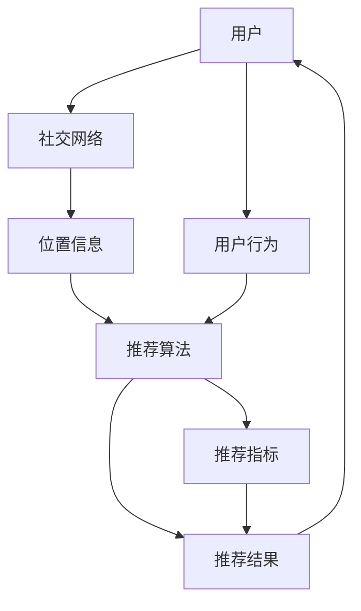

                 

# 社交网络中的位置推荐算法研究

> 关键词：社交网络,位置推荐,算法优化,数据驱动,用户体验,隐私保护

## 1. 背景介绍

### 1.1 问题由来
随着社交网络应用的蓬勃发展，用户的位置信息成为了社交网络中非常重要的元素之一。位置推荐系统可以根据用户当前位置提供附近的新闻、活动、餐饮、交通等信息，提升用户体验。但是，如何设计一个高效、准确、公平的位置推荐系统，同时兼顾用户隐私和数据安全，是一个充满挑战的问题。

### 1.2 问题核心关键点
社交网络位置推荐的核心关键点包括：
1. 如何高效地获取用户当前位置信息。
2. 如何基于位置信息推荐相关内容和信息。
3. 如何在推荐过程中保护用户隐私和数据安全。
4. 如何通过算法优化提升推荐系统的精度和用户体验。

## 2. 核心概念与联系

### 2.1 核心概念概述

本节将介绍几个与社交网络位置推荐系统相关的核心概念：

- **社交网络**：以用户之间的关系和互动为基础，用户通过注册、登录、点赞、评论、分享等操作，构建起一个虚拟的社会网络。
- **位置推荐系统**：基于用户的位置信息，推荐附近的兴趣点、活动、服务等信息，提升用户的生活便利性和社交体验。
- **推荐算法**：用于分析用户行为和兴趣，并根据这些信息推荐内容和服务的技术。
- **隐私保护**：通过技术手段保护用户个人信息和数据安全，防止数据泄露和滥用。

这些概念共同构成了社交网络位置推荐系统的核心框架，需要结合实际应用场景进行系统设计和实现。

### 2.2 核心概念原理和架构的 Mermaid 流程图



这个流程图展示了社交网络位置推荐系统的主要流程：用户通过社交网络获取位置信息，位置推荐算法基于位置信息推荐相关内容，推荐结果反馈给用户，同时收集用户行为数据以优化推荐算法。

## 3. 核心算法原理 & 具体操作步骤
### 3.1 算法原理概述

社交网络位置推荐系统主要采用机器学习和推荐算法来分析和推荐位置信息。推荐算法主要包括：

- **协同过滤算法**：通过分析用户的历史行为，推荐其他用户感兴趣的位置信息。
- **基于内容的推荐算法**：分析用户的历史兴趣，推荐与用户兴趣相关的位置信息。
- **混合推荐算法**：结合多种推荐方法，提高推荐系统的精度和鲁棒性。

在算法的设计和实现中，需要考虑以下关键问题：

- **算法效率**：如何在大规模数据下高效地处理和推荐位置信息。
- **推荐精度**：如何设计算法提高推荐的准确性和相关性。
- **用户隐私**：如何在推荐过程中保护用户位置信息的安全。

### 3.2 算法步骤详解

以下是社交网络位置推荐系统的详细算法步骤：

**Step 1: 数据准备**
- 收集用户的社交网络数据，包括用户ID、位置信息、兴趣偏好、互动行为等。
- 收集位置数据，包括附近的兴趣点、活动、服务等信息。
- 预处理数据，清洗和标准化数据格式。

**Step 2: 用户行为建模**
- 分析用户的历史行为，构建用户兴趣模型。
- 通过协同过滤和基于内容的推荐算法，获取用户可能感兴趣的位置信息。

**Step 3: 推荐算法设计**
- 设计推荐算法，选择合适的方法，如混合推荐算法、深度学习模型等。
- 设计模型结构，如神经网络、协同过滤矩阵等。

**Step 4: 训练和优化**
- 在用户历史数据和位置数据上进行训练，优化推荐算法。
- 使用交叉验证和A/B测试等方法，评估算法效果。

**Step 5: 部署和评估**
- 将训练好的模型部署到生产环境。
- 收集用户反馈和推荐结果，持续优化推荐算法。

### 3.3 算法优缺点

社交网络位置推荐算法具有以下优点：
1. 提升用户体验：通过推荐用户感兴趣的位置信息，提升用户的生活便利性和社交体验。
2. 精准推荐：结合多种推荐方法，提高推荐的准确性和相关性。
3. 数据驱动：利用用户行为数据进行优化，提高推荐系统的灵活性和适应性。

同时，该算法也存在以下缺点：
1. 数据隐私问题：用户位置信息的收集和使用可能带来隐私问题。
2. 数据不平衡：社交网络数据通常存在用户分布不均、数据不平衡等问题。
3. 推荐公平性：推荐算法可能存在偏见，导致部分用户被冷落。
4. 算法复杂度：大规模数据和复杂模型的训练和推理需要高性能的计算资源。

### 3.4 算法应用领域

社交网络位置推荐算法已经被广泛应用于以下领域：

- **出行服务**：提供附近交通、旅游信息，帮助用户规划行程。
- **餐饮推荐**：推荐附近的餐厅、美食、饮品等信息，提升用户用餐体验。
- **娱乐活动**：推荐附近的电影、演出、展览等信息，满足用户娱乐需求。
- **商业推广**：向用户推荐附近的商家、优惠信息，促进消费。
- **社交互动**：推荐附近的社交活动、朋友动态，增强用户社交互动。

## 4. 数学模型和公式 & 详细讲解 & 举例说明

### 4.1 数学模型构建

社交网络位置推荐系统的数学模型通常包括：
- **用户行为模型**：通过分析用户历史行为，构建用户兴趣模型。
- **位置信息模型**：分析位置数据，构建位置信息模型。
- **推荐模型**：设计推荐算法，建立用户位置和兴趣之间的关系。

### 4.2 公式推导过程

以基于内容的推荐算法为例，其核心公式如下：

$$
\theta = \arg\max_{\theta} \sum_{i=1}^N \alpha_i\log\sigma\left(a_i^T\theta\right)
$$

其中 $\theta$ 为推荐模型参数，$a_i$ 为用户兴趣向量，$\sigma$ 为激活函数，$\alpha_i$ 为用户行为权重。

### 4.3 案例分析与讲解

假设用户 $u$ 喜欢旅游、美食、运动等兴趣，且位置在 $(x,y)$。通过协同过滤算法，收集与 $u$ 类似兴趣的 $k$ 个用户，并分析这些用户的位置信息，得到推荐结果 $r$。具体计算过程如下：

1. 收集与用户 $u$ 相似兴趣的 $k$ 个用户，并计算这些用户的位置信息 $r_1, r_2, ..., r_k$。
2. 计算用户 $u$ 和每个用户的相似度 $s$。
3. 根据相似度 $s$ 和用户行为 $a$，计算用户 $u$ 的位置推荐结果 $r = \frac{1}{k}\sum_{i=1}^k s_ir_i$。

## 5. 项目实践：代码实例和详细解释说明

### 5.1 开发环境搭建

在进行位置推荐系统开发前，需要准备以下开发环境：

1. 安装Python和相关依赖包，如numpy、pandas、scikit-learn等。
2. 安装推荐算法库，如Surprise、LightFM等。
3. 使用Docker容器进行环境部署和管理。

### 5.2 源代码详细实现

以下是一个简单的基于内容的推荐系统实现示例：

```python
from surprise import Dataset, Reader, KNNBasic, SVD, SVD++
from surprise.model_selection import train_test_split

# 加载数据
reader = Reader(rating_scale=(1, 5))
data = Dataset.load_from_file('user_data.csv', reader=reader)

# 划分训练集和测试集
trainset, testset = train_test_split(data, test_size=0.2)

# 构建基于内容的推荐算法
algo = SVD++
algo.fit(trainset)

# 预测并评估推荐结果
predictions = algo.test(testset)
metric = accuracy_score(predictions)
print('推荐准确率：', metric)
```

### 5.3 代码解读与分析

- **数据加载**：使用surprise库读取用户数据，并进行预处理。
- **模型构建**：使用SVD++算法构建基于内容的推荐模型，并进行训练。
- **结果评估**：使用测试集评估模型效果，计算推荐准确率。

### 5.4 运行结果展示

通过上述代码，可以初步实现一个基于内容的推荐系统，并在测试集上评估其效果。推荐准确率的提高需要结合更多数据和算法优化措施。

## 6. 实际应用场景

### 6.1 出行服务

在出行服务场景中，位置推荐系统可以提供交通路况、公共交通站点、酒店、景点等信息。例如，用户计划前往某个城市旅游，位置推荐系统可以根据用户的地理位置，推荐附近的旅游景点、酒店和美食。

### 6.2 餐饮推荐

在餐饮推荐场景中，位置推荐系统可以推荐附近的餐厅、美食和饮品。例如，用户搜索附近的意大利餐厅，位置推荐系统可以根据用户的地理位置，推荐附近的意大利餐厅，并提供餐厅评分和用户评价。

### 6.3 娱乐活动

在娱乐活动场景中，位置推荐系统可以推荐附近的电影、演出、展览等活动。例如，用户计划观看电影，位置推荐系统可以根据用户的地理位置，推荐附近的电影院和演出场馆，并提供活动信息和用户评价。

### 6.4 商业推广

在商业推广场景中，位置推荐系统可以推荐附近的商家、优惠信息和促销活动。例如，用户搜索附近的商场，位置推荐系统可以根据用户的地理位置，推荐附近的商场和优惠信息，并提供商家评分和用户评价。

### 6.5 社交互动

在社交互动场景中，位置推荐系统可以推荐附近的社交活动、朋友动态和兴趣小组。例如，用户参加社交活动，位置推荐系统可以根据用户的地理位置，推荐附近的兴趣小组和社交活动，并提供活动信息和用户评价。

## 7. 工具和资源推荐

### 7.1 学习资源推荐

为了帮助开发者系统掌握位置推荐技术，推荐以下学习资源：

1. **推荐系统理论**：深入理解推荐算法的基本原理和数学模型。推荐阅读《推荐系统实践》一书。
2. **机器学习课程**：学习机器学习的基本概念和算法。推荐参加Coursera的《机器学习》课程。
3. **深度学习框架**：学习深度学习框架的使用，如TensorFlow和PyTorch。推荐参加DeepLearning.AI的《深度学习专项课程》。
4. **推荐系统开源项目**：学习开源推荐系统的实现方法。推荐关注OpenRec和RecSys2019的最佳实践论文。
5. **推荐系统竞赛**：通过参加推荐系统竞赛，提升实践能力。推荐参加Kaggle的推荐系统竞赛。

### 7.2 开发工具推荐

以下是一些常用的位置推荐系统开发工具：

1. **Python**：推荐使用Python进行推荐系统开发。Python有丰富的机器学习库和推荐算法库。
2. **Docker**：使用Docker容器进行环境管理和部署。Docker可以方便地进行跨平台部署和扩展。
3. **Kibana**：使用Kibana进行数据分析和可视化。Kibana可以实时监控推荐系统的效果。
4. **Jupyter Notebook**：使用Jupyter Notebook进行数据处理和算法调试。Jupyter Notebook支持Python和R语言的混合编程。
5. **AWS**：使用AWS云平台进行大规模数据存储和处理。AWS提供了丰富的计算资源和数据服务。

### 7.3 相关论文推荐

以下是一些与位置推荐相关的经典论文，推荐阅读：

1. **《A recommender system framework for the future: from collaborative filtering to data mining and beyond》**：探讨了推荐系统的发展历程和未来趋势。
2. **《On the Design and Analysis of Collaborative Filtering Algorithms》**：分析了协同过滤算法的原理和效果。
3. **《The BellKor 2011 PPCF Summer School on Recommendation Systems》**：介绍了推荐系统的基本概念和算法。
4. **《Personalized Web Search as Recommendation》**：探讨了基于Web搜索的推荐系统。
5. **《SVD++ Approximations for Scalable Recommender Systems》**：介绍了一种基于矩阵分解的推荐算法。

## 8. 总结：未来发展趋势与挑战

### 8.1 总结

本文对社交网络位置推荐系统的原理和实践进行了全面系统的介绍。首先阐述了位置推荐系统的背景和核心关键点，明确了其在提升用户体验和推荐效果方面的重要意义。其次，从原理到实践，详细讲解了位置推荐系统的算法流程和数学模型，给出了具体代码实现。同时，本文还探讨了位置推荐系统在实际应用中的广泛场景，展示了其潜在的市场价值和技术前景。最后，本文精选了相关学习资源和工具，力求为读者提供全方位的技术指引。

通过本文的系统梳理，可以看到，社交网络位置推荐系统已经逐渐成为互联网应用的重要组成部分，其推荐的准确性和多样性直接影响用户体验和平台流量。未来，随着推荐算法的不断优化和数据量的不断增加，社交网络位置推荐系统必将实现更大的突破和应用。

### 8.2 未来发展趋势

展望未来，社交网络位置推荐系统将呈现以下几个发展趋势：

1. **推荐算法的智能化**：随着深度学习和大数据技术的发展，推荐算法将更加智能化，能够更加精准地预测用户行为和偏好。
2. **推荐系统的个性化**：个性化推荐系统将成为未来的主流趋势，能够根据用户的个性化需求提供更为精准和有针对性的推荐。
3. **推荐系统的跨平台集成**：推荐系统将更加注重跨平台集成，整合多种数据来源，提升推荐效果。
4. **推荐系统的实时性**：实时推荐系统将成为未来的重要方向，能够及时更新推荐结果，满足用户即时需求。
5. **推荐系统的安全性**：随着用户隐私保护意识的增强，推荐系统将更加注重用户隐私保护，确保数据安全和用户隐私。

### 8.3 面临的挑战

尽管社交网络位置推荐系统已经取得了不小的进展，但在迈向更加智能化、普适化应用的过程中，它仍面临着诸多挑战：

1. **数据隐私问题**：用户位置信息等隐私数据的使用和保护是一个重大挑战。如何在满足用户需求的同时，保护用户隐私，是一个亟待解决的问题。
2. **数据质量和多样性**：推荐系统的效果很大程度上依赖于数据质量和多样性。如何在数据量不足的情况下，提升推荐精度，是一个需要解决的问题。
3. **推荐系统的公平性**：推荐系统可能存在偏见，导致部分用户被冷落。如何在算法设计中引入公平性约束，是一个需要解决的问题。
4. **推荐系统的实时性**：实时推荐系统需要高效的数据处理和计算能力。如何在保证算法效果的同时，提高系统实时性，是一个需要解决的问题。
5. **推荐系统的可扩展性**：推荐系统需要处理大规模数据和复杂模型，如何设计高效可扩展的系统架构，是一个需要解决的问题。

### 8.4 研究展望

面对社交网络位置推荐系统所面临的挑战，未来的研究需要在以下几个方面寻求新的突破：

1. **深度学习优化**：结合深度学习和大数据技术，优化推荐算法，提升推荐精度和实时性。
2. **推荐系统的可解释性**：引入可解释性方法，提高推荐系统的透明度和可信度，帮助用户理解和信任推荐结果。
3. **推荐系统的可扩展性**：设计高效可扩展的系统架构，提升推荐系统的处理能力和可维护性。
4. **推荐系统的跨平台集成**：整合多种数据来源和推荐方法，提升推荐系统的多样性和精准性。
5. **推荐系统的隐私保护**：引入隐私保护技术，确保用户数据安全和隐私保护，增强用户信任。

这些研究方向的探索，必将引领社交网络位置推荐系统迈向更高的台阶，为构建安全、可靠、智能的推荐系统提供新的思路和技术手段。

## 9. 附录：常见问题与解答

**Q1：位置推荐系统如何处理用户隐私问题？**

A: 位置推荐系统处理用户隐私问题的方法包括：
1. 数据匿名化：在收集数据时，对用户位置信息进行匿名化处理，防止数据泄露。
2. 数据加密：对敏感数据进行加密处理，确保数据在传输和存储过程中的安全性。
3. 用户授权：在使用位置信息前，获取用户授权，并明确告知用户数据的使用范围和目的。
4. 数据最小化：只收集和处理必要的数据，避免过度收集用户信息。

**Q2：如何提升推荐系统的准确性和多样性？**

A: 提升推荐系统的准确性和多样性需要结合多种算法和策略：
1. 使用协同过滤算法，结合用户历史行为数据，提升推荐精度。
2. 使用基于内容的推荐算法，结合用户兴趣和产品特征，提升推荐多样性。
3. 引入混合推荐算法，结合多种推荐方法，提升推荐效果。
4. 引入冷启动策略，帮助新用户快速适应推荐系统。
5. 引入反馈机制，及时调整推荐结果，提升用户满意度。

**Q3：位置推荐系统如何处理数据不平衡问题？**

A: 位置推荐系统处理数据不平衡问题的方法包括：
1. 引入数据增强技术，扩充训练数据集，提升推荐系统泛化能力。
2. 使用加权策略，对不平衡数据进行加权处理，提升推荐效果。
3. 使用采样技术，对不平衡数据进行采样处理，提升推荐效果。
4. 引入生成对抗网络（GAN），生成新的样本数据，扩充训练数据集。

**Q4：位置推荐系统如何处理推荐公平性问题？**

A: 位置推荐系统处理推荐公平性问题的方法包括：
1. 引入公平性约束，设计公平的推荐算法，确保不同用户得到公平的推荐机会。
2. 使用公平性评估指标，定期评估推荐系统的公平性，及时进行调整。
3. 引入公平性机制，通过算法调整和数据预处理，提升推荐系统的公平性。

**Q5：位置推荐系统如何处理推荐系统实时性问题？**

A: 位置推荐系统处理推荐系统实时性问题的方法包括：
1. 引入流数据处理技术，实时处理用户行为数据，及时更新推荐结果。
2. 使用分布式计算和存储技术，提升数据处理和存储能力，支持实时推荐。
3. 优化算法设计，提升推荐算法效率，减少计算时间。

---

作者：禅与计算机程序设计艺术 / Zen and the Art of Computer Programming

