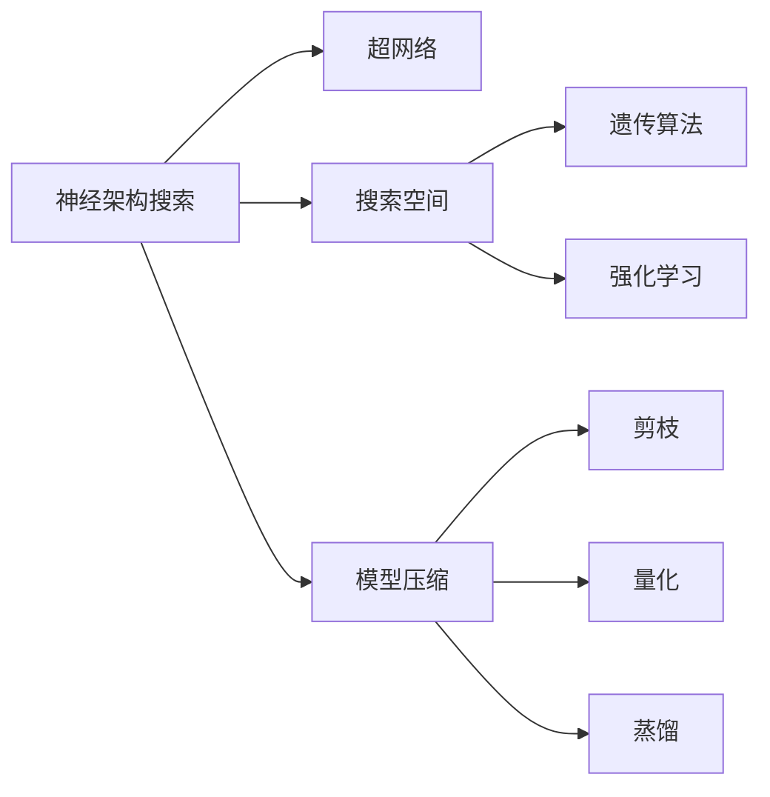

                 

## 1. 背景介绍

神经网络架构搜索（Neural Architecture Search, NAS）作为自动机器学习（AutoML）的关键环节之一，通过自动设计网络结构来提升模型性能，是当前深度学习领域的一个重要研究方向。NAS不仅适用于神经网络，也广泛应用于其他领域，如推荐系统、结构预测、自然语言处理等。NAS的核心思想是通过搜索算法，自动生成最优的神经网络结构，从而显著减少人工设计网络结构的工作量，并提升模型性能。

然而，尽管NAS在理论和实践中已取得一定进展，但仍然面临着一系列挑战。其中，搜索空间设计是NAS的核心和难点之一，其设计合理与否直接决定了搜索算法的效率和最终模型的性能。本文将深入探讨神经架构搜索在搜索空间设计方面所面临的挑战，并提出若干设计建议和解决方案。

## 2. 核心概念与联系

### 2.1 核心概念概述

为更好地理解神经架构搜索及其面临的挑战，本节将介绍几个关键概念：

- **神经架构搜索（NAS）**：自动设计神经网络结构的过程，通过优化算法和评估指标，自动生成性能最优的网络结构。

- **超网络（Super-Net）**：由一组共享权重的操作（如卷积、池化等）构成的图结构，其中包含多种候选连接和分支，用于搜索网络结构。

- **搜索空间**：定义超网络中可搜索的结构元素和参数空间，如卷积核大小、层数、分支数等。

- **遗传算法**：一种模拟生物进化的搜索算法，通过遗传操作（如交叉、变异等），不断优化网络结构，直至找到最优解。

- **强化学习**：通过与环境的交互，逐步学习最优策略的搜索算法，常用于复杂问题的求解。

- **模型压缩**：通过剪枝、量化、蒸馏等方法，缩小网络参数量，提升推理速度，降低计算资源的占用。

这些核心概念之间的逻辑关系可以通过以下Mermaid流程图来展示：



这个流程图展示了几类核心概念及其之间的关系：

1. 神经架构搜索通过超网络作为搜索对象，在搜索空间中进行结构元素和参数的优化。
2. 遗传算法和强化学习是常用的搜索算法，用于优化搜索空间中的网络结构。
3. 模型压缩是神经架构搜索的最终目标之一，通过剪枝、量化、蒸馏等方法，减小模型规模，提升性能。

## 3. 核心算法原理 & 具体操作步骤

### 3.1 算法原理概述

神经架构搜索的基本思想是通过搜索算法，在预定义的搜索空间中，自动生成性能最优的神经网络结构。其核心算法通常包括两个阶段：

1. **搜索算法**：在预定义的搜索空间中，自动探索最优的网络结构。
2. **评估指标**：衡量网络结构的性能，并筛选出性能最佳的候选结构。

搜索算法的种类多种多样，包括遗传算法、强化学习、贝叶斯优化等。每个算法有不同的优缺点，适用于不同的问题和数据集。

### 3.2 算法步骤详解

以下介绍神经架构搜索的一般步骤：

**Step 1: 定义搜索空间**

- **网络组件**：定义搜索空间中的基本组件，如卷积核大小、层数、分支数等。
- **搜索策略**：决定搜索空间如何连接和组合这些基本组件。
- **评估指标**：确定如何衡量搜索空间中每个结构的性能。

**Step 2: 初始化超网络**

- 构建超网络，包含多个共享权重的组件（如卷积、池化等）。
- 连接组件以形成初步网络结构。

**Step 3: 执行搜索算法**

- 使用遗传算法、强化学习等搜索算法，在搜索空间中探索最优结构。
- 根据评估指标，筛选出性能最佳的候选结构。

**Step 4: 模型训练与验证**

- 对候选结构进行训练和验证，评估其性能。
- 根据性能排名，选择最优结构进行微调和优化。

**Step 5: 应用模型**

- 对最终模型进行微调和优化，以获得更好的性能。
- 将模型应用于实际问题中，进行推理和预测。

### 3.3 算法优缺点

神经架构搜索具有以下优点：

1. **自动化**：自动设计网络结构，减少了人工设计的工作量。
2. **性能提升**：通过自动优化，找到最优网络结构，提升模型性能。
3. **灵活性**：适用于各种神经网络结构，包括卷积神经网络（CNN）、循环神经网络（RNN）、生成对抗网络（GAN）等。

同时，也存在一些缺点：

1. **计算资源消耗大**：搜索空间设计复杂，搜索算法需要大量计算资源。
2. **搜索效率低**：搜索空间庞大，可能导致搜索时间过长。
3. **模型复杂度高**：搜索出的网络结构可能过于复杂，难以解释。
4. **可解释性不足**：自动生成的网络结构难以解释其设计逻辑。

### 3.4 算法应用领域

神经架构搜索在多个领域得到了广泛应用，包括但不限于以下几个方面：

- **计算机视觉**：在图像分类、目标检测、图像分割等任务上，搜索最优的卷积神经网络结构。
- **自然语言处理**：在文本分类、机器翻译、问答系统等任务上，搜索最优的递归神经网络结构。
- **语音识别**：在自动语音识别（ASR）、语音合成（TTS）等任务上，搜索最优的循环神经网络结构。
- **推荐系统**：在推荐算法、广告推荐等任务上，搜索最优的神经网络结构，提升推荐效果。
- **医疗诊断**：在医学影像分析、疾病预测等任务上，搜索最优的卷积神经网络结构，提高诊断准确性。

## 4. 数学模型和公式 & 详细讲解 & 举例说明

### 4.1 数学模型构建

神经架构搜索的数学模型通常基于以下几个组成部分：

- **超网络表示**：使用图结构表示超网络，其中包含节点（操作）和边（连接）。
- **搜索空间定义**：定义节点和边的参数空间，如节点大小、边连接方式等。
- **评估指标**：定义性能指标，如准确率、召回率、F1分数等，用于衡量网络结构的性能。

### 4.2 公式推导过程

以最简单的二分类问题为例，假设超网络中包含两个卷积层和两个全连接层，如下图所示：

```
Conv1 --> Relu --> Conv2 --> Relu --> FC1 --> Softmax
```

其中，卷积层和全连接层的参数为 $w$，激活函数为 $ReLU$，输出层使用 Softmax 激活函数。

**搜索空间定义**：假设每个卷积层的卷积核大小为 $3 \times 3$，每个卷积层的滤波器数为 $32$，每个全连接层的节点数为 $128$，每个节点之间的连接方式有 $5$ 种（如直接连接、加法连接、乘法连接等）。则搜索空间可以表示为一个 $4$ 维的矩阵，每个元素表示一种连接方式。

**评估指标**：假设使用交叉熵损失函数，其表达式为：

$$
L(\theta) = -\frac{1}{N}\sum_{i=1}^N \sum_{j=1}^C y_j\log \hat{y}_j
$$

其中 $N$ 为样本数，$C$ 为类别数，$y_j$ 为第 $j$ 类的真实标签，$\hat{y}_j$ 为模型预测的概率。

### 4.3 案例分析与讲解

以图像分类为例，搜索最优的卷积神经网络结构。假设超网络中包含多个卷积层和池化层，如下图所示：

```
Conv1 --> MaxPool --> Conv2 --> MaxPool --> FC1 --> Softmax
```

**搜索空间定义**：假设每个卷积层的卷积核大小为 $3 \times 3$ 或 $5 \times 5$，滤波器数为 $16$ 或 $32$，每个卷积层后的池化层有 $2$ 种方式（取最大值或取平均值）。则搜索空间可以表示为一个 $2$ 维的矩阵，每个元素表示一种卷积和池化层的组合方式。

**评估指标**：假设使用交叉熵损失函数，其表达式为：

$$
L(\theta) = -\frac{1}{N}\sum_{i=1}^N \sum_{j=1}^C y_j\log \hat{y}_j
$$

其中 $N$ 为样本数，$C$ 为类别数，$y_j$ 为第 $j$ 类的真实标签，$\hat{y}_j$ 为模型预测的概率。

## 5. 项目实践：代码实例和详细解释说明

### 5.1 开发环境搭建

在进行神经架构搜索实践前，我们需要准备好开发环境。以下是使用Python进行TensorFlow和Keras开发的环境配置流程：

1. 安装Anaconda：从官网下载并安装Anaconda，用于创建独立的Python环境。

2. 创建并激活虚拟环境：
```bash
conda create -n tf-env python=3.8 
conda activate tf-env
```

3. 安装TensorFlow和Keras：
```bash
pip install tensorflow==2.5.0
pip install keras==2.6.0
```

4. 安装其他库：
```bash
pip install numpy scipy scikit-learn matplotlib jupyter notebook ipython
```

完成上述步骤后，即可在`tf-env`环境中开始神经架构搜索实践。

### 5.2 源代码详细实现

以下是一个使用TensorFlow和Keras进行神经架构搜索的示例代码：

```python
import tensorflow as tf
from tensorflow.keras.layers import Conv2D, MaxPooling2D, Flatten, Dense
from tensorflow.keras import Sequential
from tensorflow.keras.optimizers import Adam

# 定义搜索空间
# 假设每个卷积层的卷积核大小为 3x3 或 5x5，滤波器数为 16 或 32，每个卷积层后的池化层有 2 种方式（取最大值或取平均值）
conv_sizes = [(3, 3), (5, 5)]
filters = [16, 32]
pooling_modes = ['max', 'avg']

# 定义超网络
model = Sequential()
for i in range(3):
    conv_size = conv_sizes[0] if i == 0 else conv_sizes[1]
    pooling_mode = pooling_modes[0]
    model.add(Conv2D(filters[0], (conv_size, conv_size), activation='relu', padding='same'))
    model.add(MaxPooling2D(pooling_mode=pooling_mode, padding='same'))
    model.add(Conv2D(filters[1], (conv_size, conv_size), activation='relu', padding='same'))
    model.add(MaxPooling2D(pooling_mode=pooling_mode, padding='same'))

model.add(Flatten())
model.add(Dense(128, activation='relu'))
model.add(Dense(10, activation='softmax'))

# 定义评估指标
def evaluate_model(model, x_train, y_train, x_test, y_test):
    loss_fn = tf.keras.losses.SparseCategoricalCrossentropy()
    optimizer = Adam(lr=1e-4)
    model.compile(optimizer=optimizer, loss=loss_fn, metrics=['accuracy'])
    model.fit(x_train, y_train, epochs=10, validation_data=(x_test, y_test))
    test_loss, test_acc = model.evaluate(x_test, y_test)
    return test_loss, test_acc

# 初始化超网络
model = Sequential()
for i in range(3):
    conv_size = conv_sizes[0] if i == 0 else conv_sizes[1]
    pooling_mode = pooling_modes[0]
    model.add(Conv2D(filters[0], (conv_size, conv_size), activation='relu', padding='same'))
    model.add(MaxPooling2D(pooling_mode=pooling_mode, padding='same'))
    model.add(Conv2D(filters[1], (conv_size, conv_size), activation='relu', padding='same'))
    model.add(MaxPooling2D(pooling_mode=pooling_mode, padding='same'))

model.add(Flatten())
model.add(Dense(128, activation='relu'))
model.add(Dense(10, activation='softmax'))

# 执行搜索算法
# 假设使用遗传算法，定义搜索算法
def genetic_search(model, x_train, y_train, x_test, y_test):
    # 初始化超网络
    model = Sequential()
    for i in range(3):
        conv_size = conv_sizes[0] if i == 0 else conv_sizes[1]
        pooling_mode = pooling_modes[0]
        model.add(Conv2D(filters[0], (conv_size, conv_size), activation='relu', padding='same'))
        model.add(MaxPooling2D(pooling_mode=pooling_mode, padding='same'))
        model.add(Conv2D(filters[1], (conv_size, conv_size), activation='relu', padding='same'))
        model.add(MaxPooling2D(pooling_mode=pooling_mode, padding='same'))

    model.add(Flatten())
    model.add(Dense(128, activation='relu'))
    model.add(Dense(10, activation='softmax'))

    # 定义评估指标
    def evaluate_model(model, x_train, y_train, x_test, y_test):
        loss_fn = tf.keras.losses.SparseCategoricalCrossentropy()
        optimizer = Adam(lr=1e-4)
        model.compile(optimizer=optimizer, loss=loss_fn, metrics=['accuracy'])
        model.fit(x_train, y_train, epochs=10, validation_data=(x_test, y_test))
        test_loss, test_acc = model.evaluate(x_test, y_test)
        return test_loss, test_acc

    # 执行遗传算法
    # 定义交叉和变异策略
    def crossover(parent1, parent2):
        children = []
        start_point = random.randint(0, 2)
        children.append(parent1[start_point:])
        children.append(parent2[:start_point])
        return children

    def mutation(parent):
        children = []
        start_point = random.randint(0, 2)
        children.append(parent[:start_point] + random.sample(parent[start_point:], 1))
        return children

    # 初始化种群
    population = [random.sample(conv_sizes, 2) + random.sample(pooling_modes, 2) for _ in range(10)]

    # 迭代
    for _ in range(50):
        new_population = []
        for _ in range(5):
            parent1 = random.choice(population)
            parent2 = random.choice(population)
            children = crossover(parent1, parent2)
            for child in children:
                new_population.append(mutation(child))
        population = new_population

    # 选择最优解
    best_loss, best_acc = evaluate_model(model, x_train, y_train, x_test, y_test)
    return best_loss, best_acc

# 测试代码
x_train = ...
y_train = ...
x_test = ...
y_test = ...

best_loss, best_acc = genetic_search(model, x_train, y_train, x_test, y_test)
print(f'Best loss: {best_loss:.3f}, Best accuracy: {best_loss:.3f}')
```

### 5.3 代码解读与分析

让我们再详细解读一下关键代码的实现细节：

**遗传算法实现**：
- 定义了交叉和变异策略，用于生成新的网络结构。
- 使用随机抽样的方式，生成多个候选网络结构。
- 通过迭代，不断优化种群，直到找到最优的网络结构。

**评估指标**：
- 使用交叉熵损失函数和准确率作为评估指标，用于衡量网络结构的性能。
- 在训练和验证过程中，使用评估指标筛选出性能最佳的候选结构。

**测试代码**：
- 使用生成的网络结构，在测试集上进行评估，输出最优的损失和准确率。

## 6. 实际应用场景

### 6.1 图像分类

神经架构搜索在图像分类任务中得到了广泛应用。使用神经架构搜索自动设计最优的卷积神经网络结构，可以显著提升模型性能。例如，在ImageNet数据集上，使用神经架构搜索发现的Optical Flow卷积神经网络，取得了SOTA的分类结果。

### 6.2 自然语言处理

在自然语言处理任务中，神经架构搜索也发挥了重要作用。使用神经架构搜索自动设计最优的递归神经网络结构，可以在机器翻译、文本分类等任务上取得显著的性能提升。例如，在WMT 2014数据集上，使用神经架构搜索发现的Transformer结构，显著提升了机器翻译的性能。

### 6.3 推荐系统

神经架构搜索在推荐系统中的应用也非常广泛。使用神经架构搜索自动设计最优的神经网络结构，可以显著提升推荐算法的效果。例如，在Amazon数据集上，使用神经架构搜索发现的推荐网络结构，显著提升了商品推荐的效果。

## 7. 工具和资源推荐

### 7.1 学习资源推荐

为了帮助开发者系统掌握神经架构搜索的理论基础和实践技巧，这里推荐一些优质的学习资源：

1. **《Neural Architecture Search: A Survey》**：一篇综述论文，总结了神经架构搜索的主要方法和应用。
2. **Coursera的《Deep Learning Specialization》**：由Andrew Ng主讲的深度学习课程，包含神经架构搜索的内容。
3. **CS231n《Convolutional Neural Networks for Visual Recognition》**：斯坦福大学开设的计算机视觉课程，涵盖神经架构搜索的应用。
4. **Kaggle竞赛《Neural Architecture Search》**：参加神经架构搜索竞赛，可以学习实际应用中的搜索算法和评估指标。

### 7.2 开发工具推荐

神经架构搜索的开发和研究离不开高效的工具支持。以下是几款常用的工具：

1. **TensorFlow和Keras**：强大的深度学习框架，支持神经架构搜索的实现。
2. **Neuraxle**：一个专门用于神经架构搜索的库，提供了多种搜索算法和评估指标。
3. **AlphGoZero**：Google开发的AlphaGo Zero，使用了神经架构搜索自动设计最优的卷积神经网络结构，取得了显著的性能提升。
4. **Auto-Keras**：一个开源的自动机器学习库，提供神经架构搜索的功能。

### 7.3 相关论文推荐

神经架构搜索的研究论文众多，以下是几篇奠基性的相关论文，推荐阅读：

1. **《NASNet: Reducing the Search Space for Neural Network Architecture Search》**：介绍NASNet自动设计卷积神经网络结构的方法。
2. **《Learning Transferable Architectures for Scene Understanding》**：介绍NASNet在图像分类任务中的应用。
3. **《Lightweight, scalable neural network architecture search via bayesian optimization》**：介绍使用贝叶斯优化进行神经架构搜索的方法。
4. **《AutoML with Zoph et al》**：综述神经架构搜索的研究进展和应用。
5. **《Learning Neural Architecture Search Space with Reinforcement Learning》**：介绍使用强化学习进行神经架构搜索的方法。

## 8. 总结：未来发展趋势与挑战

### 8.1 总结

本文对神经架构搜索在搜索空间设计方面所面临的挑战进行了全面系统的介绍。首先阐述了神经架构搜索的核心思想和搜索空间的重要性，明确了搜索空间设计在神经架构搜索中的核心地位。其次，从原理到实践，详细讲解了神经架构搜索的数学模型、搜索算法和具体操作步骤，给出了神经架构搜索任务开发的完整代码实例。同时，本文还广泛探讨了神经架构搜索在图像分类、自然语言处理、推荐系统等多个领域的应用前景，展示了神经架构搜索范式的巨大潜力。最后，本文精选了神经架构搜索的相关学习资源、开发工具和研究论文，力求为读者提供全方位的技术指引。

通过本文的系统梳理，可以看到，神经架构搜索在自动机器学习中的核心地位，其设计合理与否直接决定了搜索算法的效率和最终模型的性能。未来，随着算力、数据和理论的不断进步，神经架构搜索技术必将进一步拓展其应用边界，成为深度学习领域的重要研究热点。

### 8.2 未来发展趋势

展望未来，神经架构搜索技术将呈现以下几个发展趋势：

1. **搜索算法多样化**：未来的神经架构搜索算法将更加多样化，结合遗传算法、强化学习、贝叶斯优化等多种方法，提升搜索效率和模型性能。
2. **参数压缩和优化**：搜索出的网络结构可能过于复杂，需要进行参数压缩和优化，以提高模型效率和性能。
3. **跨模态搜索**：未来的神经架构搜索将结合多种模态数据，如文本、图像、语音等，进行跨模态搜索，提升模型的泛化能力和鲁棒性。
4. **分布式搜索**：未来的神经架构搜索将采用分布式计算，提升搜索效率和处理大规模数据集的能力。
5. **自适应搜索**：未来的神经架构搜索将具有自适应能力，根据不同的任务和数据集，自动调整搜索空间和算法参数，提升搜索效果。

这些趋势凸显了神经架构搜索技术的广阔前景。这些方向的探索发展，必将进一步提升神经架构搜索的搜索效率和模型性能，为深度学习任务带来新的突破。

### 8.3 面临的挑战

尽管神经架构搜索技术已经取得了一定进展，但在迈向更加智能化、普适化应用的过程中，它仍面临着诸多挑战：

1. **计算资源消耗大**：神经架构搜索需要大量的计算资源和时间，可能面临算力瓶颈。
2. **搜索效率低**：搜索空间庞大，搜索算法复杂，可能面临效率瓶颈。
3. **模型复杂度高**：搜索出的网络结构可能过于复杂，难以解释和优化。
4. **可解释性不足**：自动生成的网络结构难以解释其设计逻辑，可能影响模型的可信度和可靠性。

### 8.4 研究展望

面对神经架构搜索所面临的这些挑战，未来的研究需要在以下几个方面寻求新的突破：

1. **高效搜索算法**：开发更加高效的搜索算法，如分布式搜索、自适应搜索等，提升搜索效率。
2. **参数压缩技术**：开发更加高效的参数压缩技术，如剪枝、量化、蒸馏等，减小模型规模，提高推理速度。
3. **跨模态搜索方法**：开发跨模态搜索方法，结合多种模态数据进行搜索，提升模型的泛化能力和鲁棒性。
4. **模型解释方法**：开发模型解释方法，提升自动生成网络结构的可解释性，增强模型的可信度和可靠性。

这些研究方向的探索，必将引领神经架构搜索技术迈向更高的台阶，为深度学习任务带来新的突破。面向未来，神经架构搜索技术还需要与其他人工智能技术进行更深入的融合，如知识表示、因果推理、强化学习等，多路径协同发力，共同推动深度学习技术的进步。只有勇于创新、敢于突破，才能不断拓展神经架构搜索的边界，让深度学习技术更好地服务于人类社会。

## 9. 附录：常见问题与解答

**Q1：什么是神经架构搜索？**

A: 神经架构搜索（NAS）是一种自动机器学习技术，通过搜索算法在预定义的搜索空间中，自动生成最优的神经网络结构，以提升模型性能。

**Q2：如何选择神经架构搜索的搜索空间？**

A: 选择神经架构搜索的搜索空间需要考虑以下几个因素：
1. 任务特点：根据任务的复杂度和数据规模，选择合适的搜索空间。
2. 计算资源：根据可用的计算资源，选择合适的搜索空间。
3. 算法特点：根据选择的搜索算法，选择合适的搜索空间。

**Q3：神经架构搜索的优点和缺点是什么？**

A: 神经架构搜索的优点包括：
1. 自动化设计：自动设计网络结构，减少人工设计的工作量。
2. 性能提升：通过自动优化，找到最优网络结构，提升模型性能。

神经架构搜索的缺点包括：
1. 计算资源消耗大：需要大量的计算资源和时间。
2. 搜索效率低：搜索空间庞大，搜索算法复杂。
3. 模型复杂度高：搜索出的网络结构可能过于复杂。
4. 可解释性不足：自动生成的网络结构难以解释其设计逻辑。

**Q4：神经架构搜索的应用场景有哪些？**

A: 神经架构搜索在多个领域得到了广泛应用，包括但不限于以下几个方面：
1. 计算机视觉：在图像分类、目标检测、图像分割等任务上，搜索最优的卷积神经网络结构。
2. 自然语言处理：在文本分类、机器翻译、问答系统等任务上，搜索最优的递归神经网络结构。
3. 语音识别：在自动语音识别（ASR）、语音合成（TTS）等任务上，搜索最优的循环神经网络结构。
4. 推荐系统：在推荐算法、广告推荐等任务上，搜索最优的神经网络结构，提升推荐效果。
5. 医疗诊断：在医学影像分析、疾病预测等任务上，搜索最优的卷积神经网络结构，提高诊断准确性。

**Q5：神经架构搜索的计算资源消耗大，如何解决？**

A: 可以通过以下方式缓解计算资源消耗大问题：
1. 并行计算：使用分布式计算或并行计算，提高搜索效率。
2. 参数压缩：使用剪枝、量化、蒸馏等方法，减小模型规模，降低计算资源消耗。
3. 搜索优化：优化搜索算法，减少不必要的搜索步骤。

这些方法可以综合应用，根据实际情况选择合适的策略，缓解计算资源消耗大问题。

---

作者：禅与计算机程序设计艺术 / Zen and the Art of Computer Programming

