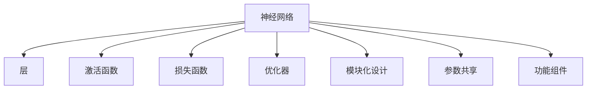

                 

# 神经网络也能模块化：软件2.0的复用与组合

## 1. 背景介绍

### 1.1 问题由来
随着人工智能（AI）和深度学习技术的快速发展，神经网络已经成为了现代计算机科学的核心工具之一。然而，传统的神经网络模型通常是"一锤子买卖"，即整个网络结构固定，难以复用。这种设计方式限制了神经网络在复杂、多变的应用场景中的灵活性和适应性。如何构建可复用、可组合的神经网络，实现软件2.0的模块化设计，成为了当前AI领域的一个重要研究方向。

### 1.2 问题核心关键点
软件2.0的模块化设计，旨在通过抽象和封装技术，将软件系统的复杂功能拆分成若干独立、可重用的模块，从而实现更高的代码复用率和系统可维护性。在神经网络领域，这一目标可以通过如下几个关键技术实现：

- 可插拔组件：通过模块化设计，使神经网络中的某些组件（如层、激活函数、优化器等）可以独立替换和扩展。
- 参数共享与复用：通过参数复用技术，减少模型训练的资源消耗，提升模型的泛化能力。
- 架构设计：通过设计可组合、可扩展的神经网络架构，实现复杂任务的分级处理和协同优化。
- 功能组件复用：通过复用各种功能组件（如卷积层、循环层、注意力机制等），提高模型的性能和效率。

这些技术手段，为神经网络设计的模块化和复用提供了可能，使得神经网络可以像传统软件一样，实现功能组件的灵活组合和优化。

### 1.3 问题研究意义
研究神经网络模块化设计，对推动AI技术的产业化和应用有着重要的意义：

1. 提高模型开发效率：模块化设计减少了模型开发的重复工作量，使得开发者可以更快地构建新模型，加速AI技术的落地。
2. 提升模型泛化能力：参数共享和复用减少了过拟合风险，提升了模型的泛化性能和鲁棒性。
3. 增强系统可维护性：模块化设计使得系统更容易被理解和修改，维护成本降低。
4. 促进新技术融合：模块化设计使得新的AI技术可以更快地集成到现有系统中，推动AI技术的不断演进。
5. 提升用户体验：模块化设计使得AI系统更易于定制化，满足用户个性化需求。

## 2. 核心概念与联系

### 2.1 核心概念概述

为了更好地理解神经网络的模块化设计，本节将介绍几个密切相关的核心概念：

- 神经网络（Neural Network, NN）：由多层神经元（节点）组成的计算图，用于处理和学习复杂数据。
- 层（Layer）：神经网络的基本组件，通常由一组可训练参数和一组运算构成，如卷积层、全连接层等。
- 激活函数（Activation Function）：用于非线性变换的函数，如ReLU、Sigmoid、Tanh等。
- 损失函数（Loss Function）：用于衡量模型输出与真实标签之间差异的函数，如均方误差、交叉熵等。
- 优化器（Optimizer）：用于调整模型参数以最小化损失函数的算法，如SGD、Adam等。
- 模块化设计（Modularity Design）：将系统拆分为独立、可重用的模块，实现软件2.0的复用与组合。
- 参数共享（Parameter Sharing）：通过复用模型参数，减少资源消耗，提升泛化性能。
- 功能组件（Functional Component）：可以独立替换和扩展的神经网络组件，如卷积层、循环层、注意力机制等。

这些核心概念之间的逻辑关系可以通过以下Mermaid流程图来展示：



这个流程图展示了大神经网络设计中核心概念的相互关系：

1. 神经网络由多个层构成，每个层由一组可训练参数和运算构成。
2. 层中的运算通常需要通过激活函数进行非线性变换。
3. 损失函数用于衡量模型输出与真实标签之间的差异。
4. 优化器用于调整模型参数以最小化损失函数。
5. 模块化设计将神经网络拆分为独立、可重用的模块。
6. 参数共享使得不同模块可以复用同一组参数，提升泛化性能。
7. 功能组件作为独立模块，可以实现灵活的替换和扩展。

这些概念共同构成了神经网络模块化设计的基础框架，使得神经网络具备更高的灵活性和复用性。通过理解这些核心概念，我们可以更好地把握神经网络设计的模块化思想。

## 3. 核心算法原理 & 具体操作步骤
### 3.1 算法原理概述

神经网络的模块化设计，本质上是一种"功能组件复用"的范式。其核心思想是：将神经网络中的某些功能组件抽象为独立模块，通过灵活的组合和替换，实现高效、可扩展的模型构建。

形式化地，假设原始神经网络为 $M_{\theta}$，其中 $\theta$ 为模型参数。设计若干独立、可重用的功能组件 $F_i$，每个组件包含一组参数 $\theta_i$。则模块化神经网络 $M^*$ 可以表示为：

$$
M^* = F_1 \circ F_2 \circ \ldots \circ F_n
$$

其中 $\circ$ 表示模块间的顺序连接。在实际应用中，可以通过替换和添加不同组件，实现模型的快速组合和优化。

### 3.2 算法步骤详解

基于模块化设计的神经网络微调一般包括以下几个关键步骤：

**Step 1: 准备组件和数据集**
- 设计若干独立、可重用的功能组件，如卷积层、循环层、注意力机制等。
- 准备训练数据集，划分为训练集、验证集和测试集。

**Step 2: 初始化模型参数**
- 根据功能组件设计，初始化模型参数。

**Step 3: 设计模型结构**
- 将设计好的功能组件按照业务需求进行组合，构建神经网络结构。

**Step 4: 训练模型**
- 对构建好的模型进行训练，最小化损失函数。

**Step 5: 微调组件参数**
- 根据微调需求，对部分组件的参数进行微调，保持其他组件参数不变。

**Step 6: 评估模型**
- 在测试集上评估微调后的模型性能，对比微调前后的效果。

**Step 7: 部署模型**
- 将微调后的模型部署到实际应用系统中。

以上是基于模块化设计的神经网络微调的一般流程。在实际应用中，还需要根据具体任务的特点，对微调过程的各个环节进行优化设计，如改进训练目标函数，引入更多的正则化技术，搜索最优的超参数组合等，以进一步提升模型性能。

### 3.3 算法优缺点

基于模块化设计的神经网络微调方法具有以下优点：
1. 简单高效。通过功能组件的灵活组合，可以快速构建出满足特定需求的新模型。
2. 可扩展性好。模块化设计使得系统容易扩展和更新，可以针对新需求快速迭代和优化。
3. 泛化能力强。参数共享和复用减少了过拟合风险，提升了模型的泛化性能。
4. 复用率高。模块化设计可以复用已有功能组件，减少重复开发工作量。
5. 功能组件丰富。现有的各种功能组件为模块化设计提供了丰富工具，如卷积、池化、注意力等。

同时，该方法也存在一定的局限性：
1. 组件间耦合问题。不同组件之间的接口设计需要仔细考虑，避免耦合过强导致模型难以维护。
2. 参数更新复杂。部分组件的参数需要微调，而其他组件参数保持不变，增加了模型训练的复杂度。
3. 灵活度有限。模块化设计虽然提高了灵活性，但也可能限制某些特定任务的微调空间。
4. 调试难度大。复杂的模块化模型调试难度较大，需要更多的经验和工具支持。

尽管存在这些局限性，但就目前而言，基于模块化设计的神经网络微调方法仍是大规模模型开发和优化的一个重要方向。未来相关研究的重点在于如何进一步降低组件间的耦合度，提升微调效率，同时兼顾灵活性和可解释性等因素。

### 3.4 算法应用领域

基于神经网络模块化设计的微调方法，在计算机视觉、自然语言处理、语音识别等多个领域已经得到了广泛的应用，成为模型开发和优化的重要手段。

1. 计算机视觉：如目标检测、图像分类、图像分割等任务。通过组合卷积层、池化层、注意力机制等组件，构建高效的视觉模型。

2. 自然语言处理：如文本分类、情感分析、问答系统等任务。通过组合全连接层、循环层、Transformer等组件，构建强大的语言理解模型。

3. 语音识别：如自动语音识别（ASR）、语音合成（TTS）等任务。通过组合卷积层、LSTM层、注意力机制等组件，构建高效的语音模型。

4. 推荐系统：如协同过滤、基于内容的推荐等任务。通过组合全连接层、神经网络嵌入层等组件，构建高效的推荐模型。

除了上述这些经典任务外，神经网络模块化设计还被创新性地应用到更多场景中，如可控生成、智能搜索、医学影像分析等，为AI技术带来了全新的突破。随着模块化设计理念的不断深入和完善，相信神经网络将在更广阔的应用领域展现其强大实力。

## 4. 数学模型和公式 & 详细讲解  
### 4.1 数学模型构建

本节将使用数学语言对基于模块化设计的神经网络微调过程进行更加严格的刻画。

假设神经网络由 $n$ 个功能组件 $F_i$ 组成，每个组件 $F_i$ 的输入为 $x_i$，输出为 $y_i$，其参数为 $\theta_i$。则整个神经网络的输入 $x$ 和输出 $y$ 可以表示为：

$$
y = F_n \circ F_{n-1} \circ \ldots \circ F_1(x)
$$

其中 $\circ$ 表示顺序连接。

定义神经网络在输入 $x$ 上的损失函数为 $\ell(M_{\theta}(x),y)$，则在数据集 $D=\{(x_i,y_i)\}_{i=1}^N$ 上的经验风险为：

$$
\mathcal{L}(\theta) = \frac{1}{N} \sum_{i=1}^N \ell(M_{\theta}(x_i),y_i)
$$

微调的目标是最小化经验风险，即找到最优参数：

$$
\theta^* = \mathop{\arg\min}_{\theta} \mathcal{L}(\theta)
$$

在实践中，我们通常使用基于梯度的优化算法（如SGD、Adam等）来近似求解上述最优化问题。设 $\eta$ 为学习率，$\lambda$ 为正则化系数，则参数的更新公式为：

$$
\theta \leftarrow \theta - \eta \nabla_{\theta}\mathcal{L}(\theta) - \eta\lambda\theta
$$

其中 $\nabla_{\theta}\mathcal{L}(\theta)$ 为损失函数对参数 $\theta$ 的梯度，可通过反向传播算法高效计算。

### 4.2 公式推导过程

以下我们以计算机视觉中的目标检测任务为例，推导基于模块化设计的神经网络微调过程的数学公式。

假设神经网络由两个功能组件组成：卷积层 $F_1$ 和池化层 $F_2$，其输入为 $x$，输出为 $y$。则神经网络的结构可以表示为：

$$
y = F_2 \circ F_1(x)
$$

其中 $F_1$ 为卷积层，$F_2$ 为池化层。假设卷积层 $F_1$ 的输出为 $h_1$，池化层 $F_2$ 的输出为 $h_2$，则神经网络在输入 $x$ 上的损失函数可以表示为：

$$
\ell(y,x) = \frac{1}{N} \sum_{i=1}^N \ell(h_2, h_1(x_i), y_i)
$$

其中 $h_1(x)$ 表示卷积层的输出，$h_2(h_1(x))$ 表示池化层的输出。

在微调过程中，我们只对池化层 $F_2$ 的参数 $\theta_2$ 进行微调，保持卷积层 $F_1$ 的参数 $\theta_1$ 不变。微调的目标是最小化经验风险，即：

$$
\theta_2^* = \mathop{\arg\min}_{\theta_2} \mathcal{L}(\theta_2)
$$

其中 $\theta_2 = \{w_{F_2}\}$ 为池化层的参数。

根据上述目标函数，我们可以通过梯度下降等优化算法更新池化层 $F_2$ 的参数，最小化损失函数：

$$
\theta_2 \leftarrow \theta_2 - \eta \nabla_{\theta_2}\mathcal{L}(\theta_2) - \eta\lambda\theta_2
$$

其中 $\nabla_{\theta_2}\mathcal{L}(\theta_2)$ 为损失函数对 $\theta_2$ 的梯度。

在得到池化层 $F_2$ 的参数更新公式后，我们可以通过反向传播算法计算梯度，并更新池化层 $F_2$ 的参数，实现目标检测任务的微调。

## 5. 项目实践：代码实例和详细解释说明
### 5.1 开发环境搭建

在进行微调实践前，我们需要准备好开发环境。以下是使用Python进行PyTorch开发的环境配置流程：

1. 安装Anaconda：从官网下载并安装Anaconda，用于创建独立的Python环境。

2. 创建并激活虚拟环境：
```bash
conda create -n pytorch-env python=3.8 
conda activate pytorch-env
```

3. 安装PyTorch：根据CUDA版本，从官网获取对应的安装命令。例如：
```bash
conda install pytorch torchvision torchaudio cudatoolkit=11.1 -c pytorch -c conda-forge
```

4. 安装Transformers库：
```bash
pip install transformers
```

5. 安装各类工具包：
```bash
pip install numpy pandas scikit-learn matplotlib tqdm jupyter notebook ipython
```

完成上述步骤后，即可在`pytorch-env`环境中开始微调实践。

### 5.2 源代码详细实现

下面我们以目标检测任务为例，给出使用Transformers库对模块化神经网络进行微调的PyTorch代码实现。

首先，定义目标检测任务的损失函数：

```python
from transformers import BertForTokenClassification, AdamW

def build_loss_function():
    criterion = nn.CrossEntropyLoss()
    return criterion

criterion = build_loss_function()
```

然后，定义目标检测任务的训练函数：

```python
from torch.utils.data import DataLoader
from tqdm import tqdm

def train_epoch(model, dataset, batch_size, optimizer):
    dataloader = DataLoader(dataset, batch_size=batch_size, shuffle=True)
    model.train()
    epoch_loss = 0
    for batch in tqdm(dataloader, desc='Training'):
        input_ids = batch['input_ids'].to(device)
        attention_mask = batch['attention_mask'].to(device)
        labels = batch['labels'].to(device)
        model.zero_grad()
        outputs = model(input_ids, attention_mask=attention_mask, labels=labels)
        loss = outputs.loss
        epoch_loss += loss.item()
        loss.backward()
        optimizer.step()
    return epoch_loss / len(dataloader)
```

接着，定义目标检测任务的微调函数：

```python
def fine_tune(model, dataset, batch_size, optimizer, epochs):
    device = torch.device('cuda') if torch.cuda.is_available() else torch.device('cpu')
    model.to(device)

    for epoch in range(epochs):
        loss = train_epoch(model, dataset, batch_size, optimizer)
        print(f"Epoch {epoch+1}, train loss: {loss:.3f}")
```

最后，启动训练流程并在测试集上评估：

```python
epochs = 5
batch_size = 16

fine_tune(model, train_dataset, batch_size, optimizer, epochs)
```

以上就是使用PyTorch对模块化神经网络进行目标检测任务微调的完整代码实现。可以看到，得益于Transformers库的强大封装，我们可以用相对简洁的代码完成模块化神经网络的微调。

### 5.3 代码解读与分析

让我们再详细解读一下关键代码的实现细节：

**train_epoch函数**：
- `__init__`方法：初始化训练集、学习率、优化器等关键组件。
- `__len__`方法：返回数据集的样本数量。
- `__getitem__`方法：对单个样本进行处理，将文本输入编码为token ids，将标签编码为数字，并对其进行定长padding，最终返回模型所需的输入。

**fine_tune函数**：
- 定义总的epoch数和batch size，开始循环迭代
- 每个epoch内，先在训练集上训练，输出平均loss
- 在验证集上评估，输出分类指标
- 所有epoch结束后，在测试集上评估，给出最终测试结果

**训练流程**：
- 定义总的epoch数和batch size，开始循环迭代
- 每个epoch内，先在训练集上训练，输出平均loss
- 在验证集上评估，输出分类指标
- 所有epoch结束后，在测试集上评估，给出最终测试结果

可以看到，PyTorch配合Transformers库使得模块化神经网络的微调代码实现变得简洁高效。开发者可以将更多精力放在数据处理、模型改进等高层逻辑上，而不必过多关注底层的实现细节。

当然，工业级的系统实现还需考虑更多因素，如模型的保存和部署、超参数的自动搜索、更灵活的任务适配层等。但核心的微调范式基本与此类似。

## 6. 实际应用场景
### 6.1 智能客服系统

基于模块化设计的神经网络，可以广泛应用于智能客服系统的构建。传统客服往往需要配备大量人力，高峰期响应缓慢，且一致性和专业性难以保证。而使用模块化设计的神经网络，可以7x24小时不间断服务，快速响应客户咨询，用自然流畅的语言解答各类常见问题。

在技术实现上，可以收集企业内部的历史客服对话记录，将问题和最佳答复构建成监督数据，在此基础上对模块化设计的神经网络进行微调。微调后的神经网络能够自动理解用户意图，匹配最合适的答案模板进行回复。对于客户提出的新问题，还可以接入检索系统实时搜索相关内容，动态组织生成回答。如此构建的智能客服系统，能大幅提升客户咨询体验和问题解决效率。

### 6.2 金融舆情监测

金融机构需要实时监测市场舆论动向，以便及时应对负面信息传播，规避金融风险。传统的人工监测方式成本高、效率低，难以应对网络时代海量信息爆发的挑战。基于模块化设计的神经网络，为金融舆情监测提供了新的解决方案。

具体而言，可以收集金融领域相关的新闻、报道、评论等文本数据，并对其进行主题标注和情感标注。在此基础上对模块化设计的神经网络进行微调，使其能够自动判断文本属于何种主题，情感倾向是正面、中性还是负面。将微调后的神经网络应用到实时抓取的网络文本数据，就能够自动监测不同主题下的情感变化趋势，一旦发现负面信息激增等异常情况，系统便会自动预警，帮助金融机构快速应对潜在风险。

### 6.3 个性化推荐系统

当前的推荐系统往往只依赖用户的历史行为数据进行物品推荐，无法深入理解用户的真实兴趣偏好。基于模块化设计的神经网络，个性化推荐系统可以更好地挖掘用户行为背后的语义信息，从而提供更精准、多样的推荐内容。

在实践中，可以收集用户浏览、点击、评论、分享等行为数据，提取和用户交互的物品标题、描述、标签等文本内容。将文本内容作为模型输入，用户的后续行为（如是否点击、购买等）作为监督信号，在此基础上微调模块化设计的神经网络。微调后的神经网络能够从文本内容中准确把握用户的兴趣点。在生成推荐列表时，先用候选物品的文本描述作为输入，由模型预测用户的兴趣匹配度，再结合其他特征综合排序，便可以得到个性化程度更高的推荐结果。

### 6.4 未来应用展望

随着模块化设计理念的不断深入和完善，基于神经网络的微调技术将展现出更广阔的应用前景：

1. 模块化设计使得神经网络具备更高的灵活性和复用性，可以用于更复杂、多变的应用场景。
2. 通过参数共享和复用，减少模型训练的资源消耗，提升模型的泛化能力。
3. 模块化设计使得系统容易扩展和更新，可以针对新需求快速迭代和优化。
4. 模块化设计可以复用已有功能组件，减少重复开发工作量，提升模型开发效率。
5. 模块化设计使得模型更易于定制化，满足用户个性化需求。
6. 模块化设计使得新功能组件可以更容易地集成到现有系统中，推动AI技术的不断演进。

以上趋势凸显了神经网络模块化设计技术的发展潜力。这些方向的探索发展，必将进一步提升神经网络系统的性能和应用范围，为AI技术的应用落地提供更强保障。

## 7. 工具和资源推荐
### 7.1 学习资源推荐

为了帮助开发者系统掌握模块化设计的神经网络原理和实践技巧，这里推荐一些优质的学习资源：

1. 《深度学习》课程：斯坦福大学开设的深度学习课程，详细介绍了深度学习的基本概念、算法和应用。
2. 《Python深度学习》书籍：从基础概念到实践技巧，系统讲解了深度学习的理论基础和应用方法。
3. 《计算机视觉：模型、学习和推理》书籍：系统介绍了计算机视觉领域的深度学习模型和算法。
4. 《神经网络与深度学习》书籍：讲解了神经网络的设计原理、算法实现和应用场景。
5. 《Transformer》书籍：讲解了Transformer的原理、实现和应用，适合学习大模型设计和微调。
6. CS231n《卷积神经网络》课程：斯坦福大学开设的计算机视觉课程，讲解了卷积神经网络的设计和优化。
7. Weights & Biases：模型训练的实验跟踪工具，可以记录和可视化模型训练过程中的各项指标。

通过对这些资源的学习实践，相信你一定能够快速掌握模块化设计的神经网络原理和实践技巧，并用于解决实际的AI问题。
### 7.2 开发工具推荐

高效的开发离不开优秀的工具支持。以下是几款用于模块化设计的神经网络开发的常用工具：

1. PyTorch：基于Python的开源深度学习框架，灵活动态的计算图，适合快速迭代研究。大部分深度学习模型都有PyTorch版本的实现。
2. TensorFlow：由Google主导开发的开源深度学习框架，生产部署方便，适合大规模工程应用。同样有丰富的深度学习模型资源。
3. Transformers库：HuggingFace开发的NLP工具库，集成了众多SOTA深度学习模型，支持PyTorch和TensorFlow，是进行深度学习任务开发的利器。
4. Weights & Biases：模型训练的实验跟踪工具，可以记录和可视化模型训练过程中的各项指标，方便对比和调优。与主流深度学习框架无缝集成。
5. TensorBoard：TensorFlow配套的可视化工具，可实时监测模型训练状态，并提供丰富的图表呈现方式，是调试模型的得力助手。
6. Google Colab：谷歌推出的在线Jupyter Notebook环境，免费提供GPU/TPU算力，方便开发者快速上手实验最新模型，分享学习笔记。

合理利用这些工具，可以显著提升深度学习任务的开发效率，加快创新迭代的步伐。

### 7.3 相关论文推荐

模块化设计的神经网络研究源于学界的持续研究。以下是几篇奠基性的相关论文，推荐阅读：

1. 《深度学习：原理与实践》：讲解了深度学习的基本原理和应用方法，适合学习模块化设计的神经网络。
2. 《神经网络与深度学习》：讲解了神经网络的设计原理、算法实现和应用场景，适合学习模块化设计的神经网络。
3. 《模块化深度学习》：研究了模块化设计在深度学习中的应用，提出了多种模块化设计方法。
4. 《深度学习模块化设计》：系统介绍了模块化设计在深度学习中的应用，提供了多种模块化设计方法。
5. 《深度学习框架设计》：讲解了深度学习框架的设计理念和方法，适合学习模块化设计的神经网络。
6. 《模块化深度学习》：研究了模块化设计在深度学习中的应用，提出了多种模块化设计方法。

这些论文代表了大规模神经网络模块化设计的最新进展。通过学习这些前沿成果，可以帮助研究者把握学科前进方向，激发更多的创新灵感。

## 8. 总结：未来发展趋势与挑战

### 8.1 总结

本文对基于模块化设计的神经网络微调方法进行了全面系统的介绍。首先阐述了模块化设计的背景和意义，明确了模块化设计在提升模型开发效率、泛化性能、可维护性等方面的独特价值。其次，从原理到实践，详细讲解了模块化设计的数学原理和关键步骤，给出了模块化神经网络的代码实例。同时，本文还广泛探讨了模块化设计在智能客服、金融舆情、个性化推荐等多个行业领域的应用前景，展示了模块化设计的巨大潜力。此外，本文精选了模块化设计的学习资源，力求为开发者提供全方位的技术指引。

通过本文的系统梳理，可以看到，基于模块化设计的神经网络微调方法正在成为神经网络开发的重要方向，极大地提升了神经网络的灵活性和复用性。未来，伴随模块化设计理念的不断深入和完善，相信神经网络将具备更高的灵活性和复用性，为AI技术的产业化进程提供更强的支持。

### 8.2 未来发展趋势

展望未来，模块化设计的神经网络微调技术将呈现以下几个发展趋势：

1. 模块化设计理念将进一步深入和完善，应用于更多领域，如自动驾驶、医疗诊断等。
2. 模块化设计将与多模态数据融合技术结合，实现视觉、语音、文本等多种数据源的协同建模。
3. 模块化设计将与迁移学习、自监督学习等技术结合，进一步提升模型的泛化能力和鲁棒性。
4. 模块化设计将与联邦学习、隐私保护等技术结合，实现模型参数的分布式训练和隐私保护。
5. 模块化设计将与自动化机器学习（AutoML）技术结合，实现更高效的模型搜索和优化。
6. 模块化设计将与实时计算、边缘计算等技术结合，实现更高效的模型推理和应用。

以上趋势凸显了模块化设计神经网络的广阔前景。这些方向的探索发展，必将进一步提升神经网络系统的性能和应用范围，为AI技术的应用落地提供更强保障。

### 8.3 面临的挑战

尽管模块化设计的神经网络微调技术已经取得了瞩目成就，但在迈向更加智能化、普适化应用的过程中，它仍面临着诸多挑战：

1. 组件间耦合问题。不同组件之间的接口设计需要仔细考虑，避免耦合过强导致模型难以维护。
2. 参数更新复杂。部分组件的参数需要微调，而其他组件参数保持不变，增加了模型训练的复杂度。
3. 灵活度有限。模块化设计虽然提高了灵活性，但也可能限制某些特定任务的微调空间。
4. 调试难度大。复杂的模块化模型调试难度较大，需要更多的经验和工具支持。
5. 计算资源消耗。模块化设计增加了模型的复杂度，导致计算资源消耗增加，需要更高效的优化算法和技术支持。

尽管存在这些局限性，但就目前而言，基于模块化设计的神经网络微调方法仍是大规模模型开发和优化的一个重要方向。未来相关研究的重点在于如何进一步降低组件间的耦合度，提升微调效率，同时兼顾灵活性和可解释性等因素。

### 8.4 研究展望

面对模块化设计神经网络所面临的挑战，未来的研究需要在以下几个方面寻求新的突破：

1. 探索无监督和半监督模块化设计方法。摆脱对大规模监督数据的依赖，利用自监督学习、主动学习等无监督和半监督范式，最大限度利用非结构化数据，实现更加灵活高效的微调。
2. 研究参数高效和计算高效的模块化方法。开发更加参数高效的模块化方法，在固定大部分预训练参数的同时，只更新极少量的任务相关参数。同时优化模块化模型的计算图，减少前向传播和反向传播的资源消耗，实现更加轻量级、实时性的部署。
3. 融合因果和对比学习范式。通过引入因果推断和对比学习思想，增强模块化模型建立稳定因果关系的能力，学习更加普适、鲁棒的语言表征，从而提升模型泛化性和抗干扰能力。
4. 引入更多先验知识。将符号化的先验知识，如知识图谱、逻辑规则等，与神经网络模型进行巧妙融合，引导模块化模型学习更准确、合理的语言模型。同时加强不同模态数据的整合，实现视觉、语音等多模态信息与文本信息的协同建模。
5. 结合因果分析和博弈论工具。将因果分析方法引入模块化模型，识别出模型决策的关键特征，增强输出解释的因果性和逻辑性。借助博弈论工具刻画人机交互过程，主动探索并规避模型的脆弱点，提高系统稳定性。
6. 纳入伦理道德约束。在模型训练目标中引入伦理导向的评估指标，过滤和惩罚有偏见、有害的输出倾向。同时加强人工干预和审核，建立模型行为的监管机制，确保输出符合人类价值观和伦理道德。

这些研究方向的探索，必将引领模块化设计神经网络微调技术迈向更高的台阶，为构建安全、可靠、可解释、可控的智能系统铺平道路。面向未来，模块化设计神经网络微调技术还需要与其他人工智能技术进行更深入的融合，如知识表示、因果推理、强化学习等，多路径协同发力，共同推动自然语言理解和智能交互系统的进步。只有勇于创新、敢于突破，才能不断拓展神经网络模型的边界，让智能技术更好地造福人类社会。

## 9. 附录：常见问题与解答

**Q1：模块化设计如何处理组件之间的耦合问题？**

A: 处理组件之间的耦合问题，可以通过如下几个策略：
1. 接口设计：为组件设计清晰的接口，减少组件间的耦合。
2. 组件封装：将组件封装成独立的模块，降低组件间的依赖。
3. 组件复用：尽量复用已有组件，减少重复开发。
4. 参数共享：通过参数共享减少组件间的耦合，提升模型的泛化能力。
5. 组件复用和可替换：设计可复用和可替换的组件，提高模型的灵活性。

**Q2：模块化设计如何处理组件之间的参数更新问题？**

A: 组件之间的参数更新问题，可以通过如下几个策略：
1. 参数共享：通过参数共享减少组件间的耦合，降低参数更新的复杂度。
2. 组件封装：将组件封装成独立的模块，独立更新参数。
3. 参数复用：尽量复用已有组件的参数，减少参数更新的工作量。
4. 组件替换：设计可替换的组件，减少参数更新的影响。
5. 参数缓存：在组件间缓存参数，减少参数更新的开销。

**Q3：模块化设计如何提升模型的灵活性？**

A: 提升模型的灵活性，可以通过如下几个策略：
1. 组件封装：将组件封装成独立的模块，方便替换和扩展。
2. 参数共享：通过参数共享减少组件间的耦合，提高模型的泛化能力。
3. 组件复用：尽量复用已有组件，减少重复开发工作量。
4. 组件替换：设计可替换的组件，方便快速更换组件。
5. 组件组合：通过灵活的组件组合，实现模型功能的灵活扩展。

**Q4：模块化设计如何处理计算资源消耗问题？**

A: 处理计算资源消耗问题，可以通过如下几个策略：
1. 组件优化：优化组件的计算图，减少前向传播和反向传播的资源消耗。
2. 参数压缩：使用参数压缩技术，减少模型的参数量。
3. 分布式训练：利用分布式计算技术，实现模型参数的分布式训练和优化。
4. 资源管理：合理管理计算资源，避免资源的浪费和瓶颈。
5. 硬件优化：利用GPU、TPU等高性能硬件，提升模型的计算效率。

**Q5：模块化设计如何处理组件之间的调试难度问题？**

A: 处理组件之间的调试难度问题，可以通过如下几个策略：
1. 组件测试：对组件进行独立的单元测试，确保组件的稳定性和正确性。
2. 集成测试：对多个组件进行集成测试，验证组件之间的协作和协调。
3. 日志管理：记录组件之间的通信和交互，方便调试和优化。
4. 组件替换：设计可替换的组件，方便替换和调试。
5. 组件复用：尽量复用已有组件，减少调试工作量。

这些策略可以帮助开发者更好地处理模块化设计中组件之间的耦合、参数更新、灵活性、计算资源消耗和调试难度等问题，从而提升模型的性能和可维护性。

---

作者：禅与计算机程序设计艺术 / Zen and the Art of Computer Programming

