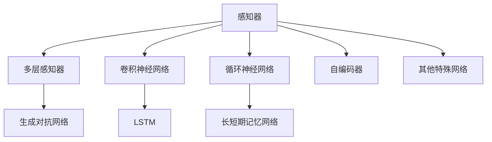

                 

# 神经网络：人类智慧的解放

> 关键词：神经网络，深度学习，人工智能，知识提取，推理，计算力解放，人类智慧

## 1. 背景介绍

### 1.1 问题由来
在现代社会，信息爆炸和数据密集化背景下，人类获取、处理和利用信息的能力面临着前所未有的挑战。无论是医疗、金融、教育、交通还是公共卫生，数据正以指数级的速度增长，如何高效地从海量数据中提取有价值的信息，成为一个亟待解决的问题。

神经网络作为一种强大的机器学习模型，通过模拟人类大脑的神经元运作机制，在图像识别、自然语言处理、语音识别等领域取得了显著的成功。它不仅提升了信息处理和决策的能力，而且正在逐步解放人类智慧，为各行各业带来革命性的变化。

### 1.2 问题核心关键点
神经网络的核心在于其复杂的结构、庞大的参数空间和强大的数据处理能力。相较于传统算法，神经网络能够处理更复杂、更多样化的数据，并通过多层次的抽象和表示，提取出更有意义的信息。

1. **非线性映射能力**：通过层与层之间的非线性变换，神经网络可以学习任意复杂的关系，而非仅限于线性关系。
2. **自动特征提取**：神经网络能够自动学习输入数据的特征表示，避免了手工特征工程的需求。
3. **鲁棒性强**：通过大规模的训练数据和复杂的模型结构，神经网络在对抗噪声、数据缺失等情况下表现较为稳定。
4. **并行计算**：深度神经网络中存在大量参数，通过并行计算可以加速模型训练，提升计算效率。

神经网络的成功，很大程度上源于其庞大的参数空间和强大的计算能力，以及丰富的应用场景。本文将从神经网络的原理出发，详细介绍其核心算法，并探讨其在多个实际应用中的表现和潜力。

## 2. 核心概念与联系

### 2.1 核心概念概述

神经网络是一种通过模拟人脑神经元运作机制来处理复杂信息的机器学习模型。它由大量的神经元(节点)和连接它们的边(权重)组成，通过学习数据的特征表示，进行高效的推理和决策。

- **感知器(Perceptron)**：最早的神经网络形式，用于二值分类问题。
- **多层感知器(Multilayer Perceptron, MLP)**：引入了多个隐藏层，能够处理更复杂的非线性关系。
- **卷积神经网络(Convolutional Neural Network, CNN)**：适用于图像识别任务，通过卷积和池化操作提取图像特征。
- **循环神经网络(Recurrent Neural Network, RNN)**：用于序列数据的处理，如语音识别和自然语言处理。
- **长短期记忆网络(Long Short-Term Memory, LSTM)**：一种特殊的RNN结构，用于解决梯度消失和长序列记忆问题。
- **生成对抗网络(Generative Adversarial Network, GAN)**：通过对抗训练生成逼真的数据，如生成图像、文本等。
- **自编码器(Autocoder)**：用于数据压缩和特征提取，通过重构输入数据来获取有用信息。

这些概念之间的逻辑关系可以通过以下Mermaid流程图来展示：



这个流程图展示了几类主要神经网络形式及其联系，它们共同构成了深度学习模型的基础。

## 3. 核心算法原理 & 具体操作步骤
### 3.1 算法原理概述

神经网络的核心算法是反向传播算法(Backpropagation)，其基本思想是通过误差反向传播，更新模型参数，从而使得模型输出逐渐逼近真实标签。具体来说，反向传播算法通过链式法则，将预测误差从输出层逐层向前传播，更新输入层和隐藏层的权重。

反向传播算法的核心步骤如下：
1. **前向传播**：将输入数据通过神经网络计算得到预测输出。
2. **计算误差**：将预测输出与真实标签进行比较，计算误差函数。
3. **反向传播**：利用误差函数对网络各层进行误差回传，计算各层的梯度。
4. **参数更新**：根据梯度下降规则更新模型参数，使预测误差逐渐减小。

神经网络通过不断迭代训练，逐步优化模型参数，提升预测性能。这种迭代优化过程称为训练过程，训练的目的是使模型在给定的训练集上获得最优的预测能力。

### 3.2 算法步骤详解

下面将详细介绍神经网络训练的具体操作步骤：

**Step 1: 准备数据集**
- 准备训练数据集、验证数据集和测试数据集，并按一定比例划分。
- 对数据进行预处理，如归一化、标准化、数据增强等，确保数据的一致性和多样性。

**Step 2: 定义模型结构**
- 选择适合的神经网络结构，如MLP、CNN、RNN等。
- 确定模型的输入、隐藏和输出层的节点数，以及各层之间的连接方式。

**Step 3: 初始化模型参数**
- 对模型的所有可训练参数进行随机初始化，如权重、偏置等。
- 常用的初始化方法有Xavier初始化和He初始化，可以有效避免梯度消失和梯度爆炸问题。

**Step 4: 定义损失函数**
- 选择合适的损失函数，如均方误差、交叉熵等。
- 损失函数用于衡量模型预测与真实标签之间的差异。

**Step 5: 设置优化器**
- 选择合适的优化算法，如SGD、Adam、RMSprop等。
- 优化器用于更新模型参数，以最小化损失函数。

**Step 6: 执行训练过程**
- 通过前向传播计算预测输出，计算误差，进行反向传播更新模型参数。
- 设置迭代次数、学习率、批大小等超参数，控制训练过程。
- 使用验证集评估模型性能，避免过拟合。

**Step 7: 模型评估与测试**
- 在测试集上评估模型的性能，如精度、召回率、F1分数等。
- 将模型应用于实际场景中，进行推理和决策。

### 3.3 算法优缺点

神经网络在处理复杂数据、自动特征提取等方面具有显著优势，但也存在一些问题和挑战：
1. **计算成本高**：神经网络参数量巨大，训练和推理过程需要大量计算资源。
2. **模型复杂性**：神经网络结构复杂，难以解释其内部工作机制。
3. **过拟合问题**：由于模型复杂性高，容易在训练集上表现良好，而在测试集上泛化能力不足。
4. **训练时间长**：神经网络训练时间较长，需要大量时间和计算资源。
5. **依赖数据**：模型性能依赖于训练数据的质量和数量。

尽管存在这些挑战，神经网络仍然在多个领域取得了显著的成果，为人类智慧的解放做出了重要贡献。未来，随着硬件设施的进步和算法优化，神经网络的应用场景将会更加广泛，其潜力也将得到进一步挖掘。

### 3.4 算法应用领域

神经网络已经在多个领域实现了落地应用，包括但不限于以下领域：

1. **计算机视觉**：通过卷积神经网络(CNN)进行图像识别、目标检测、人脸识别等任务。
2. **自然语言处理**：通过循环神经网络(RNN)、长短期记忆网络(LSTM)进行文本分类、情感分析、机器翻译等任务。
3. **语音识别**：通过卷积神经网络(CNN)、循环神经网络(RNN)进行语音识别、语音合成等任务。
4. **机器人控制**：通过神经网络进行机器人视觉、动作控制等任务。
5. **自动驾驶**：通过神经网络进行图像识别、目标检测、路径规划等任务。
6. **金融分析**：通过神经网络进行市场预测、信用评分、风险评估等任务。
7. **医疗健康**：通过神经网络进行疾病诊断、基因分析、药物研发等任务。

这些应用展示了神经网络在多个领域的强大能力，推动了相关领域的科技进步，为人类的智慧解放做出了重要贡献。

## 4. 数学模型和公式 & 详细讲解 & 举例说明

### 4.1 数学模型构建

神经网络的数学模型可以表示为：

$$
y=f(x; \theta)
$$

其中，$x$ 表示输入数据，$\theta$ 表示模型参数，$f(x)$ 表示模型在给定参数下的输出。

以多层感知器(MLP)为例，其数学模型可以表示为：

$$
y=f(W^{(L)}x+b^{(L)})=f(W^{(L-1)}f(W^{(L-2)}...x+b^{(L-2)})+b^{(L-1)})+...+b^{(1)}
$$

其中，$W^{(l)}$ 和 $b^{(l)}$ 表示第$l$层的权重和偏置。

### 4.2 公式推导过程

以多层感知器(MLP)为例，其前向传播和反向传播的过程可以表示为：

$$
\begin{aligned}
z^{(l)} &= W^{(l)}x^{(l-1)}+b^{(l)} \\
a^{(l)} &= g(z^{(l)}) \\
\hat{y} &= f(a^{(L)})
\end{aligned}
$$

其中，$z^{(l)}$ 表示第$l$层的线性变换结果，$a^{(l)}$ 表示第$l$层的激活函数输出，$g$ 表示激活函数，$\hat{y}$ 表示模型的最终输出。

反向传播的过程可以表示为：

$$
\begin{aligned}
\frac{\partial L}{\partial y} &= \frac{\partial L}{\partial \hat{y}} \\
\frac{\partial L}{\partial a^{(l)}} &= W^{(l)T}\frac{\partial L}{\partial z^{(l)}} \\
\frac{\partial L}{\partial z^{(l)}} &= \frac{\partial L}{\partial a^{(l)}}\frac{\partial a^{(l)}}{\partial z^{(l)}} \\
\frac{\partial L}{\partial W^{(l)}} &= \frac{\partial L}{\partial z^{(l)}}x^{(l-1)T} \\
\frac{\partial L}{\partial b^{(l)}} &= \frac{\partial L}{\partial z^{(l)}} \\
\end{aligned}
$$

其中，$L$ 表示损失函数，$x^{(l-1)}$ 表示第$l-1$层的输出，$W^{(l)T}$ 表示第$l$层的权重矩阵转置。

### 4.3 案例分析与讲解

以图像识别任务为例，我们可以使用卷积神经网络(CNN)进行图像分类。CNN的数学模型可以表示为：

$$
y=f(W^{(1)}*(x^{(1)})+b^{(1)})=f(W^{(2)}*f(W^{(1)}*(x^{(1)})+b^{(1)})+b^{(2)})+...+b^{(L)}
$$

其中，$x^{(1)}$ 表示图像的卷积特征图，$W^{(1)}$ 和 $b^{(1)}$ 表示第一层的卷积核和偏置，$f$ 表示激活函数。

在训练过程中，我们通过前向传播计算图像的卷积特征图，并通过反向传播更新卷积核和偏置的参数，使得模型能够更好地识别图像。CNN的成功在于其卷积层和池化层的设计，能够高效地提取图像的局部特征，并进行特征融合，从而实现高效的图像分类。

## 5. 项目实践：代码实例和详细解释说明

### 5.1 开发环境搭建

在进行神经网络项目实践前，我们需要准备好开发环境。以下是使用Python进行TensorFlow开发的环境配置流程：

1. 安装Anaconda：从官网下载并安装Anaconda，用于创建独立的Python环境。

2. 创建并激活虚拟环境：
```bash
conda create -n tf-env python=3.8 
conda activate tf-env
```

3. 安装TensorFlow：根据CUDA版本，从官网获取对应的安装命令。例如：
```bash
pip install tensorflow
```

4. 安装TensorFlow Addons：包含更多高级组件和功能。
```bash
pip install tensorflow-addons
```

5. 安装Keras：基于TensorFlow的高层API，用于快速构建和训练模型。
```bash
pip install keras
```

6. 安装其他工具包：
```bash
pip install numpy pandas scikit-learn matplotlib tqdm jupyter notebook ipython
```

完成上述步骤后，即可在`tf-env`环境中开始项目实践。

### 5.2 源代码详细实现

下面我们以图像识别任务为例，给出使用TensorFlow和Keras进行卷积神经网络(CNN)训练的Python代码实现。

首先，导入必要的库：

```python
import tensorflow as tf
from tensorflow.keras import layers, models
import numpy as np
from tensorflow.keras.utils import to_categorical
```

然后，定义CNN模型：

```python
def create_model():
    model = models.Sequential([
        layers.Conv2D(32, (3, 3), activation='relu', input_shape=(28, 28, 1)),
        layers.MaxPooling2D((2, 2)),
        layers.Conv2D(64, (3, 3), activation='relu'),
        layers.MaxPooling2D((2, 2)),
        layers.Conv2D(64, (3, 3), activation='relu'),
        layers.Flatten(),
        layers.Dense(64, activation='relu'),
        layers.Dense(10, activation='softmax')
    ])
    return model
```

接着，定义训练数据集：

```python
(x_train, y_train), (x_test, y_test) = tf.keras.datasets.mnist.load_data()
x_train = x_train.reshape((60000, 28, 28, 1))
x_test = x_test.reshape((10000, 28, 28, 1))
x_train, x_test = x_train / 255.0, x_test / 255.0
y_train = to_categorical(y_train, 10)
y_test = to_categorical(y_test, 10)
```

然后，定义优化器和损失函数：

```python
model = create_model()
model.compile(optimizer='adam', loss='categorical_crossentropy', metrics=['accuracy'])
```

最后，启动训练过程：

```python
history = model.fit(x_train, y_train, epochs=10, batch_size=64, validation_data=(x_test, y_test))
```

以上就是使用TensorFlow和Keras进行CNN训练的完整代码实现。可以看到，借助TensorFlow和Keras的高级API，我们可以用相对简洁的代码构建和训练CNN模型。

### 5.3 代码解读与分析

让我们再详细解读一下关键代码的实现细节：

**create_model函数**：
- 定义了一个包含多个卷积层和池化层的CNN模型。
- 卷积层使用32、64个3x3的卷积核进行特征提取，激活函数使用ReLU。
- 池化层使用2x2的最大池化，以减少特征图的大小。
- 最后两个全连接层用于分类，输出10个类别的概率。

**加载数据集**：
- 使用TensorFlow的内置数据集`mnist`，加载手写数字图像和标签。
- 将图像数据标准化到[0,1]之间，并将标签转换为one-hot编码。

**编译模型**：
- 使用Adam优化器和交叉熵损失函数。
- 使用准确率作为评估指标。

**训练模型**：
- 通过`fit`方法进行模型训练，设置训练轮数和批大小。
- 使用测试集进行验证，输出训练过程中的损失和准确率。

可以看到，借助TensorFlow和Keras，构建和训练CNN模型变得非常简洁。开发者可以将更多精力放在数据处理和模型改进上，而不必过多关注底层实现。

当然，工业级的系统实现还需考虑更多因素，如模型的保存和部署、超参数的自动搜索、更灵活的模型构建等。但核心的训练流程基本与此类似。

## 6. 实际应用场景

### 6.1 智能推荐系统

智能推荐系统是神经网络在实际应用中的典型案例。通过神经网络模型对用户历史行为、物品属性、时间信息等进行联合建模，预测用户对不同物品的兴趣程度，从而实现个性化推荐。

在技术实现上，可以使用卷积神经网络(CNN)对用户行为序列进行编码，使用循环神经网络(RNN)对物品属性进行建模，结合两种模型的输出进行综合推荐。智能推荐系统能够实时响应用户需求，提升用户体验，成为电商、新闻、音乐等领域的重要技术支持。

### 6.2 自动驾驶

神经网络在自动驾驶中的应用主要集中在图像识别、目标检测和路径规划等方面。通过卷积神经网络(CNN)进行道路场景的理解和物体识别，使用循环神经网络(RNN)进行路径规划和决策，从而实现车辆自动驾驶。

自动驾驶技术能够有效提升道路安全和交通效率，减少交通拥堵和事故发生率。未来，随着神经网络算法的不断优化，自动驾驶将逐步实现更高级别的智能驾驶功能，如自动泊车、交通灯识别等。

### 6.3 金融分析

神经网络在金融领域也有广泛应用。通过卷积神经网络(CNN)对金融数据进行图像识别和特征提取，使用循环神经网络(RNN)进行时间序列分析和预测，从而实现市场预测、信用评分、风险评估等任务。

金融分析系统能够帮助金融机构进行精准的业务决策和风险控制，提升金融市场的透明度和稳定性。未来，随着神经网络技术的进一步发展，金融分析将更加精准和智能化，推动金融行业的创新和变革。

### 6.4 未来应用展望

随着神经网络技术的不断进步，其在多个领域的应用前景将更加广阔。未来，神经网络将继续在计算机视觉、自然语言处理、语音识别、机器人控制、自动驾驶等领域发挥重要作用，推动各行业的智能化转型。

1. **计算机视觉**：随着神经网络算法的不断优化，图像识别、目标检测、图像生成等任务将实现更高的精度和效率，推动医疗、安防、零售等行业的智能化升级。
2. **自然语言处理**：通过神经网络模型，自然语言处理将实现更复杂的任务，如情感分析、文本生成、机器翻译等，提升人机交互的智能化水平。
3. **语音识别**：神经网络在语音识别领域将实现更高的准确率和鲁棒性，推动智能家居、语音助手等应用的普及。
4. **机器人控制**：通过神经网络模型，机器人能够实现更复杂的动作和任务，提升自动化生产、医疗服务等领域的工作效率。
5. **自动驾驶**：神经网络在自动驾驶中将实现更高级别的智能驾驶功能，推动交通、物流等领域的智能化转型。
6. **医疗健康**：神经网络在医疗领域将实现更精准的疾病诊断、基因分析、药物研发等任务，提升医疗服务的智能化水平。

总之，神经网络技术将为各个行业带来深刻的变革，推动人类智慧的全面解放，带来更加智能化、便捷化的生活方式。

## 7. 工具和资源推荐
### 7.1 学习资源推荐

为了帮助开发者系统掌握神经网络的理论基础和实践技巧，这里推荐一些优质的学习资源：

1. **《深度学习》书籍**：由Ian Goodfellow等作者编写，系统介绍了深度学习的理论基础和实践方法。
2. **《Python深度学习》书籍**：由Francois Chollet等作者编写，介绍了使用Keras进行深度学习开发的实用技巧。
3. **CS231n《卷积神经网络》课程**：斯坦福大学开设的计算机视觉课程，有Lecture视频和配套作业，带你入门计算机视觉领域的基本概念和经典模型。
4. **Coursera《深度学习专项课程》**：由Andrew Ng等专家主讲的深度学习课程，涵盖从理论到实践的全面内容。
5. **arXiv论文**：深度学习领域的顶级期刊和会议，如NIPS、ICML、CVPR等，提供了大量的前沿研究和论文。

通过对这些资源的学习实践，相信你一定能够快速掌握神经网络的精髓，并用于解决实际的智能问题。

### 7.2 开发工具推荐

高效的开发离不开优秀的工具支持。以下是几款用于神经网络开发的常用工具：

1. **TensorFlow**：由Google主导开发的开源深度学习框架，生产部署方便，适合大规模工程应用。
2. **PyTorch**：Facebook开发的深度学习框架，灵活动态的计算图，适合快速迭代研究。
3. **Keras**：基于TensorFlow和Theano的高级API，能够快速构建和训练模型。
4. **MXNet**：亚马逊开源的深度学习框架，支持多种编程语言和平台。
5. **Caffe**：由Berkeley Vision and Learning Center开发的深度学习框架，适用于图像识别等任务。
6. **TorchScript**：PyTorch的静态计算图，支持模型优化和推理加速。

合理利用这些工具，可以显著提升神经网络项目的开发效率，加快创新迭代的步伐。

### 7.3 相关论文推荐

神经网络的研究源于学界的持续探索。以下是几篇奠基性的相关论文，推荐阅读：

1. **《深度学习》书籍**：Ian Goodfellow等著，系统介绍了深度学习的理论基础和实践方法。
2. **《神经网络与深度学习》书籍**：Michael Nielsen著，介绍了神经网络的基本概念和实现方法。
3. **《ImageNet Classification with Deep Convolutional Neural Networks》论文**：Alex Krizhevsky等著，介绍了使用CNN进行图像分类的经典方法。
4. **《Long Short-Term Memory》论文**：Sepp Hochreiter等著，介绍了长短期记忆网络的结构和应用。
5. **《Generative Adversarial Nets》论文**：Ian Goodfellow等著，介绍了生成对抗网络的基本原理和应用。
6. **《Attention is All You Need》论文**：Ashish Vaswani等著，介绍了Transformer结构的基本原理和应用。

这些论文代表了大规模神经网络的研究脉络。通过学习这些前沿成果，可以帮助研究者把握学科前进方向，激发更多的创新灵感。

## 8. 总结：未来发展趋势与挑战

### 8.1 总结

本文对神经网络的核心算法和实践方法进行了全面系统的介绍。首先阐述了神经网络在信息处理和智能决策中的强大能力，明确了其在各个领域的应用前景。其次，从原理到实践，详细讲解了神经网络模型的构建和训练过程，提供了完整的代码实现。同时，本文还广泛探讨了神经网络在智能推荐、自动驾驶、金融分析等多个实际应用中的表现和潜力。

通过本文的系统梳理，可以看到，神经网络在多个领域取得了显著的成果，为人类智慧的解放做出了重要贡献。未来，随着算力成本的下降和算法优化，神经网络的应用场景将会更加广泛，其潜力也将得到进一步挖掘。

### 8.2 未来发展趋势

展望未来，神经网络技术将呈现以下几个发展趋势：

1. **模型规模持续增大**：随着算力成本的下降和数据规模的扩张，神经网络模型的参数量还将持续增长，超大规模模型将逐步普及。
2. **模型结构更加复杂**：未来将出现更多更复杂的神经网络结构，如注意力机制、自适应网络等，提升模型的表示能力和泛化能力。
3. **数据利用更加高效**：数据增强、迁移学习、联邦学习等技术将进一步提升神经网络的数据利用率，降低对标注数据的依赖。
4. **计算效率不断提高**：分布式训练、模型压缩、推理加速等技术将提升神经网络的计算效率，使其更适用于实际应用。
5. **多模态融合更加深入**：未来的神经网络将支持多模态数据的融合，如图像、语音、文本等，提升模型的综合理解能力。
6. **伦理和安全更加重视**：神经网络的公平性、透明性、安全性等将成为重要研究方向，确保模型应用的合理性和公正性。

以上趋势凸显了神经网络技术的广阔前景，这些方向的探索发展，必将进一步提升神经网络系统的性能和应用范围，为人类的智慧解放做出更大的贡献。

### 8.3 面临的挑战

尽管神经网络技术已经取得了显著的成果，但在迈向更加智能化、普适化应用的过程中，它仍面临诸多挑战：

1. **计算资源需求高**：神经网络模型参数量巨大，训练和推理过程需要大量计算资源。
2. **模型复杂度高**：神经网络模型结构复杂，难以解释其内部工作机制。
3. **数据依赖性强**：模型性能依赖于训练数据的质量和数量。
4. **鲁棒性不足**：模型面对噪声、数据缺失等情况下表现不稳定。
5. **伦理和安全问题**：神经网络可能存在偏见、有害信息等，带来伦理和安全问题。

尽管存在这些挑战，神经网络技术仍然在多个领域取得了显著的成果，为人类智慧的解放做出了重要贡献。未来，随着技术进步和应用拓展，这些挑战有望逐步克服。

### 8.4 研究展望

面对神经网络面临的挑战，未来的研究需要在以下几个方面寻求新的突破：

1. **模型压缩与加速**：开发更加高效的神经网络压缩技术，如剪枝、量化、蒸馏等，减少计算资源消耗。
2. **数据增强与迁移学习**：引入更多数据增强和迁移学习方法，提升模型的泛化能力和数据利用率。
3. **模型解释性与透明性**：开发更多的模型解释工具，增强模型的透明性和可解释性。
4. **伦理与安全约束**：在模型设计中引入伦理导向的评估指标，避免模型偏见和有害信息。
5. **多模态融合**：结合符号化的先验知识，如知识图谱、逻辑规则等，与神经网络模型进行融合，提升模型的综合理解能力。

这些研究方向将引领神经网络技术迈向更高的台阶，为构建安全、可靠、可解释、可控的智能系统铺平道路。面向未来，神经网络技术还需要与其他人工智能技术进行更深入的融合，如知识表示、因果推理、强化学习等，多路径协同发力，共同推动自然语言理解和智能交互系统的进步。只有勇于创新、敢于突破，才能不断拓展神经网络的边界，让智能技术更好地造福人类社会。

## 9. 附录：常见问题与解答

**Q1：神经网络是否适用于所有数据类型？**

A: 神经网络主要适用于结构化或半结构化的数据类型，如图像、文本、语音等。对于非结构化数据，如文本、音频等，神经网络需要进行预处理和特征提取，才能进行有效的建模和训练。

**Q2：神经网络如何避免过拟合？**

A: 避免过拟合是神经网络训练中的重要问题。常见的解决方法包括：
1. 数据增强：通过图像旋转、裁剪、噪声添加等方式扩充训练集，增加数据多样性。
2. 正则化：使用L2正则、Dropout等技术，防止模型过拟合。
3. 早停策略：在验证集性能不再提升时，提前停止训练，避免过拟合。
4. 模型简化：减少模型参数和层数，避免模型过于复杂。
5. 集成学习：使用多个模型进行集成，提高模型的泛化能力。

**Q3：神经网络是否需要大量的标注数据？**

A: 传统的神经网络训练需要大量的标注数据，但通过迁移学习、少样本学习等技术，可以在少样本甚至无样本的情况下进行神经网络训练，提升模型的泛化能力。

**Q4：神经网络是否可以解释？**

A: 传统神经网络模型的内部机制较为复杂，难以进行解释。但通过可解释性模型、可视化工具等技术，可以逐步提高模型的透明性和可解释性。

**Q5：神经网络是否容易受到攻击？**

A: 神经网络模型可能会受到对抗样本攻击，导致模型输出错误。常见的防御方法包括：
1. 对抗训练：使用对抗样本训练模型，提升模型的鲁棒性。
2. 数据清洗：去除或修正对抗样本中的噪声和错误数据。
3. 模型集成：使用多个模型进行集成，提高模型的鲁棒性。

这些技术将帮助神经网络在实际应用中更好地应对各种挑战，确保其安全性和可靠性。

---

作者：禅与计算机程序设计艺术 / Zen and the Art of Computer Programming

