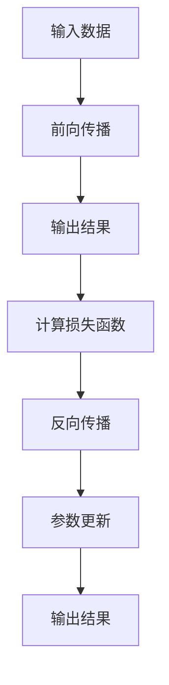

                 

## 1. 背景介绍

### 1.1 问题由来

自20世纪80年代以来，人工智能领域经过几十年的探索，逐渐从以规则为主的专家系统，向以数据驱动的机器学习范式转变。其中，神经网络作为机器学习的重要分支，因其强大的拟合能力和自适应性，在图像识别、语音识别、自然语言处理等领域取得了突破性进展。

在传统神经网络中，往往需要手工设计模型结构和特征提取方式，且难以解释模型的内部工作机制。而深度学习技术的兴起，尤其是深度神经网络（Deep Neural Networks, DNNs）的提出，通过大规模数据训练，自适应地优化网络结构和参数，极大提升了模型的性能。

### 1.2 问题核心关键点

深度学习特别是深度神经网络，通过多个层次的特征抽象和网络结构设计，能够自动发现数据中的高层次特征。然而，其背后依赖的仍是大量有标签的数据，训练过程耗费时间、计算资源，且难以解释模型的决策过程。

为此，研究者们不断探索新的神经网络架构和训练技术，如卷积神经网络（CNNs）、循环神经网络（RNNs）、生成对抗网络（GANs）、残差网络（ResNets）等，推动了深度学习技术在各个领域的突破应用。

### 1.3 问题研究意义

研究深度神经网络，对于推进人工智能技术的发展，探索智能新形态具有重要意义：

1. **提升模型性能**：深度神经网络通过自动化的特征提取和优化，能够发现数据中的复杂关系，显著提升模型的准确率和泛化能力。
2. **降低开发成本**：神经网络的自动学习能力减少了人工特征工程的复杂度，大大降低了模型开发和训练的成本。
3. **推动领域应用**：深度神经网络在图像识别、语音识别、自然语言处理等领域的应用，显著提升了相关技术的应用效果和普及率。
4. **引发新研究范式**：深度神经网络催生了新理论如深度学习理论、泛化理论等，推动了人工智能技术体系的演进。
5. **促进产业变革**：深度神经网络在多个行业中的应用，推动了相关行业的数字化、智能化转型。

## 2. 核心概念与联系

### 2.1 核心概念概述

为更好地理解深度神经网络的工作原理和优化方法，本节将介绍几个关键概念：

- **深度神经网络**：由多个层次的非线性函数组成的神经网络，能够自动发现并抽象数据中的高层次特征。
- **前向传播**：从输入数据开始，通过网络的前向计算，得到最终的输出结果。
- **反向传播**：通过网络前向传播的误差反传，计算各层参数的梯度，从而更新模型参数。
- **损失函数**：用于度量模型输出与真实标签之间的差异，常见的损失函数包括均方误差、交叉熵等。
- **优化算法**：用于最小化损失函数，优化模型参数的算法，如梯度下降、Adam等。

这些核心概念之间相互关联，构成了深度神经网络的完整框架，使得神经网络能够在各种场景下发挥强大的智能处理能力。

### 2.2 核心概念原理和架构的 Mermaid 流程图



这个流程图展示了深度神经网络的基本流程：

1. **输入数据**：从外部输入数据，通过前向传播得到最终输出。
2. **前向传播**：数据通过神经网络各层进行非线性变换，最终得到模型输出。
3. **计算损失函数**：将模型输出与真实标签进行比较，计算损失。
4. **反向传播**：根据损失函数，反向计算各层参数的梯度。
5. **参数更新**：使用优化算法更新模型参数，减小损失。
6. **输出结果**：更新参数后，再通过前向传播输出最终结果。

### 2.3 核心概念之间的联系

深度神经网络中的前向传播和反向传播是互为补充的过程。前向传播负责将输入数据通过网络进行特征提取和抽象，得到模型输出。反向传播则负责将输出与真实标签之间的误差信息反传回网络，计算各层参数的梯度，从而更新模型参数，使得模型输出更加准确。两者通过损失函数连接起来，共同优化模型的性能。

## 3. 核心算法原理 & 具体操作步骤

### 3.1 算法原理概述

深度神经网络通过多层非线性变换，自动发现并抽象数据中的复杂特征。其核心算法包括前向传播、反向传播和参数更新三个步骤，共同完成模型的训练和优化。

形式化地，假设深度神经网络模型为 $M_{\theta}(\cdot)$，其中 $\theta$ 为模型参数，$\boldsymbol{x}$ 为输入数据。模型的前向传播过程为：

$$
\boldsymbol{z}^{(l)} = f_{(l)}(\boldsymbol{x}, \boldsymbol{w}^{(l)}) \quad \text{for} \quad l=1, \dots, L
$$

其中 $f_{(l)}(\cdot)$ 为第 $l$ 层的激活函数，$\boldsymbol{w}^{(l)}$ 为第 $l$ 层的权重矩阵。模型的输出为：

$$
\boldsymbol{y} = M_{\theta}(\boldsymbol{x}) = \boldsymbol{z}^{(L)}
$$

模型的损失函数为：

$$
\mathcal{L}(\theta, \boldsymbol{x}, \boldsymbol{y}) = \ell(\boldsymbol{y}, \boldsymbol{y}_{\text{true}})
$$

其中 $\ell(\cdot)$ 为损失函数，$\boldsymbol{y}_{\text{true}}$ 为真实标签。

通过反向传播计算损失函数对各层参数的梯度：

$$
\frac{\partial \mathcal{L}}{\partial \theta} = \frac{\partial \mathcal{L}}{\partial \boldsymbol{z}^{(L)}} \cdot \frac{\partial \boldsymbol{z}^{(L)}}{\partial \boldsymbol{z}^{(L-1)}} \cdots \frac{\partial \boldsymbol{z}^{(1)}}{\partial \boldsymbol{x}} \cdot \frac{\partial \boldsymbol{x}}{\partial \theta}
$$

其中 $\frac{\partial \mathcal{L}}{\partial \boldsymbol{z}^{(l)}}$ 为第 $l$ 层的梯度。

利用优化算法如梯度下降，更新模型参数：

$$
\theta \leftarrow \theta - \eta \frac{\partial \mathcal{L}}{\partial \theta}
$$

其中 $\eta$ 为学习率，$\frac{\partial \mathcal{L}}{\partial \theta}$ 为梯度向量。

### 3.2 算法步骤详解

深度神经网络的训练过程通常包括以下几个关键步骤：

**Step 1: 准备数据集和模型**

- 收集数据集，并划分为训练集、验证集和测试集。
- 选择适合的深度神经网络模型，如卷积神经网络（CNNs）、循环神经网络（RNNs）等。
- 初始化模型参数，通常使用随机初始化。

**Step 2: 前向传播和损失计算**

- 对每个样本进行前向传播，计算输出结果和损失函数。
- 使用训练集进行前向传播和损失计算，更新模型参数。

**Step 3: 反向传播和梯度更新**

- 根据损失函数，计算每个样本的梯度。
- 使用优化算法计算梯度的累积，并更新模型参数。
- 在验证集上评估模型性能，避免过拟合。

**Step 4: 训练与评估**

- 在训练集上进行迭代训练，直至模型收敛。
- 在验证集上评估模型性能，确定最优的超参数。
- 在测试集上评估最终模型性能。

**Step 5: 模型部署与预测**

- 将训练好的模型部署到实际应用系统中。
- 对新的数据进行预测，输出模型结果。

这些步骤展示了深度神经网络从训练到预测的全流程，包括数据的准备、模型的初始化、前向传播、损失计算、反向传播、梯度更新、模型评估、模型部署和预测等关键环节。

### 3.3 算法优缺点

深度神经网络的训练过程具有以下优点：

1. **自动特征提取**：深度神经网络能够自动学习数据中的高层次特征，无需手工设计特征提取器。
2. **泛化能力强**：通过多层非线性变换，深度神经网络能够捕捉数据中的复杂关系，具有较强的泛化能力。
3. **灵活性高**：深度神经网络可以灵活设计网络结构，适用于各种数据类型和任务。
4. **应用广泛**：深度神经网络已经在图像识别、语音识别、自然语言处理等领域取得突破性进展。

同时，深度神经网络也存在一些缺点：

1. **计算资源需求高**：深度神经网络参数量庞大，训练和推理计算资源需求高。
2. **训练时间长**：深度神经网络训练时间长，特别是大规模数据集和高维特征的情况下。
3. **模型难以解释**：深度神经网络模型复杂，难以解释其内部决策过程。
4. **过拟合风险**：深度神经网络模型容易过拟合，特别是在训练集规模较小的情况下。

### 3.4 算法应用领域

深度神经网络在各个领域都有广泛的应用，以下是几个典型应用场景：

**计算机视觉**：卷积神经网络（CNNs）在图像分类、目标检测、图像生成等任务上取得显著成果。

**自然语言处理**：循环神经网络（RNNs）和变换器（Transformers）在机器翻译、文本分类、情感分析等任务上表现优异。

**语音识别**：深度神经网络在语音识别、语音合成等任务上，通过声学模型和语言模型，显著提升了语音交互的质量。

**推荐系统**：深度神经网络在推荐系统中，通过协同过滤和深度学习，能够更准确地预测用户行为，提升个性化推荐效果。

**医学影像分析**：深度神经网络在医学影像分析中，通过卷积神经网络，能够自动分析影像特征，辅助医生诊断疾病。

**游戏智能**：深度神经网络在游戏AI中，通过强化学习，能够自我优化策略，实现智能博弈。

## 4. 数学模型和公式 & 详细讲解 & 举例说明

### 4.1 数学模型构建

深度神经网络是一个包含多个层次的非线性函数，其数学模型可以表示为：

$$
\boldsymbol{y} = M_{\theta}(\boldsymbol{x}) = \boldsymbol{z}^{(L)}
$$

其中，$\boldsymbol{x}$ 为输入数据，$\boldsymbol{y}$ 为输出结果，$\theta$ 为模型参数，$\boldsymbol{z}^{(l)}$ 为第 $l$ 层的输出结果，$L$ 为网络深度。

假设第 $l$ 层为线性层，则第 $l$ 层的输出为：

$$
\boldsymbol{z}^{(l)} = \boldsymbol{W}^{(l)} \boldsymbol{z}^{(l-1)} + \boldsymbol{b}^{(l)}
$$

其中，$\boldsymbol{W}^{(l)}$ 为第 $l$ 层的权重矩阵，$\boldsymbol{b}^{(l)}$ 为第 $l$ 层的偏置向量。

假设第 $l$ 层使用激活函数 $f_{(l)}(\cdot)$，则第 $l$ 层的输出为：

$$
\boldsymbol{z}^{(l)} = f_{(l)}(\boldsymbol{z}^{(l-1)})
$$

### 4.2 公式推导过程

以下以一个简单的二分类任务为例，推导深度神经网络的前向传播和损失函数计算过程。

假设输入数据 $\boldsymbol{x} = [x_1, x_2, \dots, x_n]$，输出结果 $\boldsymbol{y} = [y_1, y_2, \dots, y_n]$，真实标签 $\boldsymbol{y}_{\text{true}} = [y_{1,\text{true}}, y_{2,\text{true}}, \dots, y_{n,\text{true}}]$。模型输出为：

$$
\boldsymbol{z}^{(L)} = f_{(L)}(\boldsymbol{z}^{(L-1)})
$$

其中 $f_{(L)}(\cdot)$ 为第 $L$ 层的激活函数。假设第 $L$ 层输出为二分类概率，即 $f_{(L)}(\cdot)$ 为 sigmoid 函数。

模型的损失函数为二分类交叉熵损失：

$$
\mathcal{L}(\theta, \boldsymbol{x}, \boldsymbol{y}_{\text{true}}) = -\frac{1}{n} \sum_{i=1}^n [y_{i,\text{true}} \log \sigma(\boldsymbol{z}^{(L)}) + (1-y_{i,\text{true}}) \log (1-\sigma(\boldsymbol{z}^{(L)}))
$$

其中 $\sigma(\cdot)$ 为 sigmoid 函数。

假设第 $l$ 层的输出为 $\boldsymbol{z}^{(l)}$，其梯度计算公式为：

$$
\frac{\partial \mathcal{L}}{\partial \boldsymbol{z}^{(l)}} = \frac{\partial \mathcal{L}}{\partial \boldsymbol{z}^{(l+1)}} \cdot \frac{\partial \boldsymbol{z}^{(l+1)}}{\partial \boldsymbol{z}^{(l)}} \cdot f'_{(l)}(\boldsymbol{z}^{(l)}) \cdot \frac{\partial \boldsymbol{z}^{(l)}}{\partial \boldsymbol{z}^{(l-1)}} \cdot \dots \cdot \frac{\partial \boldsymbol{z}^{(1)}}{\partial \boldsymbol{x}}
$$

其中 $f'_{(l)}(\cdot)$ 为第 $l$ 层激活函数的导数。

### 4.3 案例分析与讲解

假设有一个简单的两层神经网络，其结构如下：

```
输入层 --> 隐藏层 --> 输出层
```

其中，输入层有 $n$ 个神经元，隐藏层有 $m$ 个神经元，输出层有 $k$ 个神经元。激活函数使用 sigmoid 函数。

假设输入数据为 $\boldsymbol{x} = [x_1, x_2, \dots, x_n]$，输出结果为 $\boldsymbol{y} = [y_1, y_2, \dots, y_k]$。

前向传播计算输出结果的公式为：

$$
\boldsymbol{z}^{(1)} = \boldsymbol{W}^{(1)} \boldsymbol{x} + \boldsymbol{b}^{(1)}
$$

$$
\boldsymbol{z}^{(2)} = \boldsymbol{W}^{(2)} \boldsymbol{z}^{(1)} + \boldsymbol{b}^{(2)}
$$

$$
\boldsymbol{y} = \boldsymbol{z}^{(2)}
$$

其中，$\boldsymbol{W}^{(1)}$ 和 $\boldsymbol{W}^{(2)}$ 为权重矩阵，$\boldsymbol{b}^{(1)}$ 和 $\boldsymbol{b}^{(2)}$ 为偏置向量。

假设二分类任务的损失函数为交叉熵损失：

$$
\mathcal{L}(\theta, \boldsymbol{x}, \boldsymbol{y}_{\text{true}}) = -\frac{1}{n} \sum_{i=1}^n [y_{i,\text{true}} \log \sigma(\boldsymbol{z}^{(2)}) + (1-y_{i,\text{true}}) \log (1-\sigma(\boldsymbol{z}^{(2)}))
$$

其中 $\sigma(\cdot)$ 为 sigmoid 函数。

假设第 $l$ 层的输出为 $\boldsymbol{z}^{(l)}$，其梯度计算公式为：

$$
\frac{\partial \mathcal{L}}{\partial \boldsymbol{z}^{(1)}} = \frac{\partial \mathcal{L}}{\partial \boldsymbol{z}^{(2)}} \cdot \frac{\partial \boldsymbol{z}^{(2)}}{\partial \boldsymbol{z}^{(1)}} \cdot f'_{(1)}(\boldsymbol{z}^{(1)}) \cdot \frac{\partial \boldsymbol{z}^{(1)}}{\partial \boldsymbol{x}}
$$

其中 $f'_{(1)}(\cdot)$ 为第 $1$ 层激活函数的导数。

## 5. 项目实践：代码实例和详细解释说明

### 5.1 开发环境搭建

在进行深度神经网络项目开发时，需要准备相应的开发环境。以下是使用Python进行TensorFlow开发的环境配置流程：

1. 安装Anaconda：从官网下载并安装Anaconda，用于创建独立的Python环境。

2. 创建并激活虚拟环境：
```bash
conda create -n tf-env python=3.8 
conda activate tf-env
```

3. 安装TensorFlow：根据CUDA版本，从官网获取对应的安装命令。例如：
```bash
conda install tensorflow-gpu=2.8 -c conda-forge -c pytorch -c nvidia
```

4. 安装各类工具包：
```bash
pip install numpy pandas scikit-learn matplotlib tqdm jupyter notebook ipython
```

完成上述步骤后，即可在`tf-env`环境中开始深度神经网络项目的开发。

### 5.2 源代码详细实现

下面以一个简单的二分类任务为例，给出使用TensorFlow进行深度神经网络微调的Python代码实现。

首先，定义模型的输入和输出：

```python
import tensorflow as tf
from tensorflow.keras import layers

# 定义输入
input_size = 784
input_layer = tf.keras.Input(shape=(input_size,))

# 定义隐藏层
hidden_size = 128
hidden_layer = layers.Dense(hidden_size, activation='relu')(input_layer)

# 定义输出层
output_size = 1
output_layer = layers.Dense(output_size, activation='sigmoid')(hidden_layer)

# 定义模型
model = tf.keras.Model(inputs=input_layer, outputs=output_layer)

# 定义损失函数
loss_fn = tf.keras.losses.BinaryCrossentropy()

# 定义优化器
optimizer = tf.keras.optimizers.Adam(learning_rate=0.001)
```

然后，定义训练和评估函数：

```python
# 定义训练函数
def train_epoch(model, dataset, batch_size):
    for batch in dataset:
        inputs, labels = batch
        with tf.GradientTape() as tape:
            predictions = model(inputs)
            loss = loss_fn(labels, predictions)
        grads = tape.gradient(loss, model.trainable_variables)
        optimizer.apply_gradients(zip(grads, model.trainable_variables))

# 定义评估函数
def evaluate(model, dataset, batch_size):
    correct_predictions = 0
    for batch in dataset:
        inputs, labels = batch
        predictions = model(inputs)
        correct_predictions += tf.reduce_sum(tf.cast(tf.equal(tf.round(predictions), labels), tf.int32))
    accuracy = correct_predictions / len(dataset)
    return accuracy
```

最后，启动训练流程并在测试集上评估：

```python
# 定义训练集和测试集
train_dataset = ...
test_dataset = ...

# 定义超参数
epochs = 10
batch_size = 32

# 训练模型
for epoch in range(epochs):
    train_epoch(model, train_dataset, batch_size)
    accuracy = evaluate(model, test_dataset, batch_size)
    print(f'Epoch {epoch+1}, accuracy: {accuracy:.3f}')

# 在测试集上评估模型
test_accuracy = evaluate(model, test_dataset, batch_size)
print(f'Test accuracy: {test_accuracy:.3f}')
```

以上就是使用TensorFlow进行深度神经网络微调的完整代码实现。可以看到，TensorFlow提供了丰富的API和工具，使得深度神经网络模型的训练和评估过程变得简洁高效。

### 5.3 代码解读与分析

让我们再详细解读一下关键代码的实现细节：

**输入和输出定义**：
- `input_size` 和 `output_size`：分别定义输入和输出的大小。
- `input_layer` 和 `output_layer`：分别定义输入和输出的神经网络层。
- `model`：定义完整的神经网络模型。
- `loss_fn` 和 `optimizer`：定义损失函数和优化器。

**训练函数**：
- `train_epoch`：对每个epoch进行迭代，计算损失并更新模型参数。
- `tf.GradientTape`：自动记录梯度，用于反向传播计算梯度。
- `optimizer.apply_gradients`：使用优化器更新模型参数。

**评估函数**：
- `evaluate`：计算模型的准确率。
- `tf.reduce_sum` 和 `tf.cast`：对预测结果和标签进行计算和转换。
- `correct_predictions`：统计正确预测的样本数。

**训练流程**：
- `epochs` 和 `batch_size`：定义训练轮数和批次大小。
- 在每个epoch内，对训练集进行训练，并计算测试集的准确率。

可以看到，TensorFlow提供了强大的工具支持，使得深度神经网络的开发和微调过程变得轻松便捷。开发者可以将更多精力放在模型设计和优化上，而不必过多关注底层实现细节。

当然，工业级的系统实现还需考虑更多因素，如模型的保存和部署、超参数的自动搜索、更灵活的任务适配层等。但核心的微调范式基本与此类似。

## 6. 实际应用场景

### 6.1 计算机视觉

深度神经网络在计算机视觉领域有广泛应用。卷积神经网络（CNNs）通过卷积操作提取图像特征，能够识别图像中的目标物体。例如，ImageNet大规模视觉识别挑战赛展示了卷积神经网络在图像分类、目标检测等任务上的强大能力。

### 6.2 自然语言处理

深度神经网络在自然语言处理（NLP）领域也取得了显著成果。循环神经网络（RNNs）和变换器（Transformers）被广泛应用于机器翻译、文本分类、情感分析等任务。例如，Google的Transformer模型在机器翻译任务上，显著提升了翻译质量和效率。

### 6.3 语音识别

深度神经网络在语音识别领域同样有重要应用。通过声学模型和语言模型，深度神经网络能够自动识别语音并转写成文本。例如，IBM Watson的语音识别系统，在多个评测中取得了优异成绩。

### 6.4 推荐系统

深度神经网络在推荐系统中也表现优异。通过协同过滤和深度学习，深度神经网络能够更准确地预测用户行为，提升个性化推荐效果。例如，Netflix使用深度神经网络优化推荐系统，提升了用户满意度和留存率。

### 6.5 医疗影像分析

深度神经网络在医疗影像分析中也有重要应用。通过卷积神经网络，深度神经网络能够自动分析医学影像，辅助医生诊断疾病。例如，DeepMind开发的AlphaGo系统，通过深度神经网络和强化学习，在围棋领域取得了突破性成果。

## 7. 工具和资源推荐

### 7.1 学习资源推荐

为了帮助开发者系统掌握深度神经网络的理论基础和实践技巧，这里推荐一些优质的学习资源：

1. 《深度学习》书籍：Ian Goodfellow、Yoshua Bengio、Aaron Courville所著，全面介绍了深度神经网络的理论基础和实践技巧。

2. 《TensorFlow实战》书籍：TensorFlow官方团队编写，介绍了TensorFlow的API和工具，适合TensorFlow开发者的入门学习。

3. CS231n《卷积神经网络》课程：斯坦福大学开设的计算机视觉课程，有Lecture视频和配套作业，深入浅出地讲解了卷积神经网络的工作原理和优化方法。

4. Coursera《深度学习》课程：Andrew Ng教授开设的深度学习课程，系统介绍了深度神经网络的基本概念和经典模型。

5. arXiv.org：深度学习领域的研究论文集散地，提供最新、最前沿的深度神经网络研究成果。

通过对这些资源的学习实践，相信你一定能够快速掌握深度神经网络的理论基础和实践技巧，并用于解决实际的NLP问题。

### 7.2 开发工具推荐

高效的深度神经网络开发离不开优秀的工具支持。以下是几款用于深度神经网络开发和微调的常用工具：

1. TensorFlow：由Google主导开发的深度学习框架，提供强大的GPU/TPU支持，适合大规模工程应用。

2. PyTorch：由Facebook开发的深度学习框架，灵活便捷，适合快速迭代研究。

3. Keras：高层次深度学习API，易于上手，适合初学者和快速原型设计。

4. Weights & Biases：模型训练的实验跟踪工具，可以记录和可视化模型训练过程中的各项指标，方便对比和调优。

5. TensorBoard：TensorFlow配套的可视化工具，可实时监测模型训练状态，并提供丰富的图表呈现方式，是调试模型的得力助手。

6. Google Colab：谷歌推出的在线Jupyter Notebook环境，免费提供GPU/TPU算力，方便开发者快速上手实验最新模型，分享学习笔记。

合理利用这些工具，可以显著提升深度神经网络开发的效率，加快创新迭代的步伐。

### 7.3 相关论文推荐

深度神经网络的发展依赖于持续的研究创新。以下是几篇奠基性的相关论文，推荐阅读：

1. ImageNet Classification with Deep Convolutional Neural Networks：提出卷积神经网络，展示了其在图像分类任务上的强大能力。

2. Sequence to Sequence Learning with Neural Networks：提出循环神经网络，展示了其在序列生成任务上的应用潜力。

3. Attention is All You Need：提出Transformer模型，展示了其在机器翻译等任务上的突破性成果。

4. Generative Adversarial Networks：提出生成对抗网络，展示了其在图像生成、语音生成等任务上的应用。

5. ResNet: Deep Residual Learning for Image Recognition：提出残差网络，展示了其在图像分类等任务上的显著效果。

这些论文代表了大神经网络的发展脉络。通过学习这些前沿成果，可以帮助研究者把握学科前进方向，激发更多的创新灵感。

## 8. 总结：未来发展趋势与挑战

### 8.1 总结

本文对深度神经网络的工作原理和优化方法进行了全面系统的介绍。首先阐述了深度神经网络在计算机视觉、自然语言处理、语音识别、推荐系统等领域的应用前景和优势，明确了深度神经网络的重要价值。其次，从原理到实践，详细讲解了深度神经网络的数学模型和算法步骤，给出了深度神经网络微调的完整代码实例。同时，本文还广泛探讨了深度神经网络在各个领域的应用场景，展示了深度神经网络的巨大潜力。此外，本文精选了深度神经网络的学习资源和工具推荐，力求为读者提供全方位的技术指引。

通过本文的系统梳理，可以看到，深度神经网络作为人工智能的重要组成部分，已经在各个领域展示了强大的智能处理能力，为数字化、智能化转型提供了坚实基础。未来，伴随深度神经网络技术的不断演进，其应用场景将更加丰富多样，推动人工智能技术进入新的发展阶段。

### 8.2 未来发展趋势

展望未来，深度神经网络将呈现以下几个发展趋势：

1. **模型规模继续增大**：随着算力成本的下降和数据规模的扩张，深度神经网络的参数量还将继续增长。超大规模深度神经网络将具备更强的表达能力和泛化能力，推动更多复杂任务的突破。

2. **模型结构更加复杂**：深度神经网络将继续探索新的网络结构和优化算法，如残差网络、Transformer、注意力机制等，提升模型的性能和效率。

3. **多模态融合**：深度神经网络将更多地融合视觉、语音、文本等多种模态数据，提升模型对现实世界的理解能力，推动多模态智能系统的发展。

4. **自监督学习**：深度神经网络将更多地采用自监督学习范式，通过无标签数据进行预训练，提高模型的泛化能力和迁移能力。

5. **迁移学习**：深度神经网络将更多地采用迁移学习范式，通过在大规模数据集上进行预训练，在特定领域数据上微调，提升模型的泛化能力和效率。

6. **可解释性增强**：深度神经网络将更多地引入可解释性技术，如特征可视化、模型解释等，增强模型的透明性和可信度。

### 8.3 面临的挑战

尽管深度神经网络已经取得了瞩目成就，但在迈向更加智能化、普适化应用的过程中，仍面临诸多挑战：

1. **计算资源需求高**：深度神经网络参数量庞大，训练和推理计算资源需求高，需要高性能硬件支持。

2. **训练时间长**：深度神经网络训练时间长，特别是大规模数据集和高维特征的情况下，需要优化训练算法和时间调度。

3. **模型难以解释**：深度神经网络模型复杂，难以解释其内部决策过程，需要引入可解释性技术。

4. **数据需求高**：深度神经网络需要大量标注数据进行训练，标注数据获取成本高，数据质量难以保证。

5. **鲁棒性不足**：深度神经网络面对噪声、干扰等情况，鲁棒性不足，容易出现过拟合和泛化能力下降。

6. **安全和隐私**：深度神经网络模型可能泄露隐私信息，需要加强模型安全性和隐私保护。

### 8.4 研究展望

面对深度神经网络所面临的挑战，未来的研究需要在以下几个方面寻求新的突破：

1. **优化训练算法**：开发高效的训练算法，如自适应学习率、混合精度训练、分布式训练等，提升训练速度和效率。

2. **增强模型可解释性**：引入可解释性技术，如特征可视化、模型解释等，增强模型的透明性和可信度。

3. **提升数据处理能力**：采用数据增强、数据合成等技术，提高深度神经网络对数据噪声的鲁棒性，提升数据利用效率。

4. **融合多模态数据**：探索多模态数据融合技术，提升深度神经网络对现实世界的理解能力，推动多模态智能系统的发展。

5. **优化模型结构**：探索新的网络结构和优化算法，如残差网络、Transformer、注意力机制等，提升模型的性能和效率。

6. **加强安全性和隐私保护**：引入数据加密、隐私保护等技术，确保深度神经网络模型的安全性和隐私保护。

通过以上研究方向的探索，相信深度神经网络技术将进一步提升其在各个领域的应用效果和普适性，推动人工智能技术的不断演进。面向未来，深度神经网络技术还将与其他AI技术进行更深入的融合，共同推动智能技术的发展，为构建人机协同的智能社会贡献力量。

## 9. 附录：常见问题与解答

**Q1：深度神经网络的优势和劣势是什么？**

A: 深度神经网络的优势包括：

1. **自动特征提取**：深度神经网络能够自动学习数据中的高层次特征，无需手工设计特征提取器。
2. **泛化能力强**：通过多层非线性变换，深度神经网络能够捕捉数据中的复杂关系，具有较强的泛化能力。
3. **灵活性高**：深度神经网络可以灵活设计网络结构，适用于各种数据类型和任务。

深度神经网络的劣势包括：

1. **计算资源需求高**：深度神经网络参数量庞大，训练和推理计算资源需求高。
2. **训练时间长**：深度神经网络训练时间长，特别是大规模数据集和高维特征的情况下。
3. **模型难以解释**：深度神经网络模型复杂，难以解释其内部决策过程。

**Q2：深度神经网络在各个领域的应用有哪些？**

A: 深度神经网络在各个领域都有广泛的应用，以下是几个典型应用场景：

1. **计算机视觉**：卷积神经网络（CNNs）在图像分类、目标检测、图像生成等任务上取得显著成果。

2. **自然语言处理**：循环神经网络（RNNs）和变换器（Transformers）被广泛应用于机器翻译、文本分类、情感分析等任务。

3. **语音识别**：深度神经网络在语音识别领域同样有重要应用。通过声学模型和语言模型，深度神经网络能够自动识别语音并转写成文本。

4. **推荐系统**：深度神经网络在推荐系统中，通过协同过滤和深度学习，能够更准确地预测用户行为，提升个性化推荐效果。

5. **医疗影像分析**：通过卷积神经网络，深度神经网络能够自动分析医学影像，辅助医生诊断疾病。

**Q3：如何优化深度神经网络的训练过程？**

A: 深度神经网络的训练过程可以通过以下方式进行优化：

1. **优化算法**：选择适合的优化算法，如Adam、SGD等，并调整超参数，如学习率、批量大小等。

2. **正则化技术**：使用L2正则、Dropout等正则化技术，防止模型过拟合。

3. **数据增强**：通过数据增强技术，如回译、旋转等，扩充训练数据，提高模型泛化能力。

4. **模型压缩**：通过模型压缩技术，如剪枝、量化等，减少模型大小，提升训练和推理效率。

5. **迁移学习**：通过在大规模数据集上进行预训练，在特定领域数据上微调，提高模型泛化能力和效率。

6. **自监督学习**：通过无标签数据进行预训练，提高模型泛化能力和迁移能力。

通过以上优化手段，可以显著提升深度神经网络的训练效果和泛化能力。

**Q4：深度神经网络在实际应用中需要注意哪些问题？**

A: 深度神经网络在实际应用中需要注意以下问题：

1. **计算资源需求高**：深度神经网络参数量庞大，需要高性能硬件支持。

2. **训练时间长**：深度神经网络训练时间长，需要优化训练算法和时间调度。

3. **模型难以解释**：深度神经网络模型复杂，需要引入可解释性技术，增强模型的透明性和可信度。

4. **数据需求高**：深度神经网络需要大量标注数据进行训练，标注数据获取成本高，数据质量难以保证。

5. **鲁棒性不足**：深度神经网络面对噪声、干扰等情况，鲁棒性不足，容易出现过拟合和泛化能力下降。

6. **安全和隐私**：深度神经网络模型可能泄露隐私信息，需要加强模型安全性和隐私保护。

通过合理解决这些问题，可以有效提升深度神经网络在实际应用中的效果和安全性。

**Q5：深度神经网络有哪些前沿研究方向？**

A: 深度神经网络的前沿研究方向包括：

1. **优化训练算法**：开发高效的训练算法，如自适应学习率、混合精度训练、分布式训练等，提升训练速度和效率。

2. **增强模型可解释性**：引入可解释性技术，如特征可视化、模型解释等，增强模型的透明性和可信度。

3. **提升数据处理能力**：采用数据增强、数据合成等技术，提高深度神经网络对数据噪声的鲁棒性，提升数据利用效率。

4. **融合多模态数据**：探索多模态数据融合技术，提升深度神经网络对现实世界的理解能力，推动多模态智能系统的发展。

5. **优化模型结构**：探索新的网络结构和优化算法，如残差网络、Transformer、注意力机制等，提升模型的性能和效率。

6. **加强安全性和隐私保护**：引入数据加密、隐私保护等技术，确保深度神经网络模型的安全性和隐私保护。

通过这些研究方向的探索，相信深度神经网络技术将进一步提升其在各个领域的应用效果和普适性，推动人工智能技术的不断演进。面向未来，深度神经网络技术还将与其他AI技术进行更深入的融合，共同推动智能技术的发展，为构建人机协同的智能社会贡献力量。

---

作者：禅与计算机程序设计艺术 / Zen and the Art of Computer Programming

