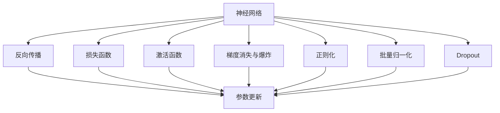

                 

# 神经网络：探索未知的领域

## 1. 背景介绍

### 1.1 问题由来
随着计算机科技的飞速发展，人工智能（AI）和机器学习（ML）领域的研究也取得了重大突破。其中，神经网络（Neural Networks, NNs）作为一种模仿人脑工作原理的计算模型，在图像识别、语音处理、自然语言处理等领域展现了巨大的应用潜力。

当前，神经网络已从最初的感知机（Perceptron）、多层感知机（MLP）逐步发展至卷积神经网络（CNN）、循环神经网络（RNN），再到深度卷积神经网络（DCNN）、长短期记忆网络（LSTM）等高级模型。这些模型凭借强大的表达能力和自适应能力，已成为解决复杂问题的有效工具。

### 1.2 问题核心关键点
神经网络技术的核心在于其独特的模型架构和训练方法。通过大量的数据训练，神经网络可以自适应地学习输入与输出之间的映射关系，从而实现对未知问题的预测和决策。然而，神经网络的复杂性和非透明性也带来了挑战，如何设计高效、稳定的网络结构，如何优化训练过程，如何提升模型的泛化能力，一直是神经网络研究的热点问题。

### 1.3 问题研究意义
研究神经网络，对推动人工智能的发展、解决复杂问题具有重要意义：

1. **创新驱动**：神经网络技术的不断进步，推动了人工智能领域的多项创新，如计算机视觉、语音识别、自然语言处理等。
2. **应用广泛**：神经网络在自动驾驶、医疗诊断、金融风控等领域有广泛应用，助力各行各业的智能化转型。
3. **数据驱动**：神经网络需要大量的数据进行训练，数据驱动的机器学习范式逐渐成为主流。
4. **模型解释性**：神经网络模型的决策过程缺乏解释性，导致模型在复杂场景中的表现难以理解，影响模型的可信度。
5. **技术普及**：神经网络技术的普及，有助于培养更多的AI人才，推动AI技术的可持续发展。

## 2. 核心概念与联系

### 2.1 核心概念概述

为更好地理解神经网络技术的核心原理和应用方法，本节将介绍几个密切相关的核心概念：

- 神经网络（Neural Networks, NNs）：一种模拟人脑神经元工作原理的计算模型，通过多层非线性变换实现对输入数据的高级映射。
- 反向传播（Backpropagation）：一种训练神经网络的优化算法，通过反向传播误差梯度，更新模型参数，使模型输出更接近真实值。
- 损失函数（Loss Function）：用于评估模型预测值与真实值之间差异的函数，如均方误差（MSE）、交叉熵损失（Cross-Entropy Loss）等。
- 激活函数（Activation Function）：神经网络中每一层输出之前的非线性变换函数，如ReLU、Sigmoid、Tanh等。
- 梯度消失与爆炸（Vanishing & Explosion）：神经网络在反向传播过程中，梯度可能会逐渐变小或变大，导致网络训练失效。
- 正则化（Regularization）：通过在损失函数中加入正则化项，抑制模型过拟合，提高泛化能力。
- 批量归一化（Batch Normalization）：一种优化神经网络训练的技术，通过规范化输入数据的分布，加速模型收敛。
- Dropout：一种防止过拟合的策略，通过随机丢弃部分神经元，提高模型的泛化能力。

这些核心概念之间的逻辑关系可以通过以下Mermaid流程图来展示：



这个流程图展示了几大核心概念及其之间的关系：

1. 神经网络通过多层非线性变换实现输入与输出之间的映射。
2. 反向传播通过计算误差梯度，更新模型参数。
3. 损失函数用于评估模型预测值与真实值之间的差异。
4. 激活函数实现神经元之间的非线性变换。
5. 正则化通过在损失函数中加入惩罚项，防止过拟合。
6. 批量归一化和Dropout通过规范化输入和随机丢弃神经元，提高模型泛化能力。

这些概念共同构成了神经网络技术的核心框架，使得神经网络能够通过学习大量的数据，实现对未知问题的有效预测和决策。

## 3. 核心算法原理 & 具体操作步骤
### 3.1 算法原理概述

神经网络技术的核心在于其独特的模型架构和训练方法。通过大量数据的训练，神经网络可以自适应地学习输入与输出之间的映射关系，从而实现对未知问题的预测和决策。

形式化地，假设神经网络模型为 $M_{\theta}$，其中 $\theta$ 为模型参数。给定训练集 $D=\{(x_i,y_i)\}_{i=1}^N$，其中 $x_i$ 为输入，$y_i$ 为输出，训练目标为最小化经验风险：

$$
\theta^* = \mathop{\arg\min}_{\theta} \mathcal{L}(M_{\theta},D)
$$

其中 $\mathcal{L}$ 为损失函数，如均方误差（MSE）、交叉熵损失（Cross-Entropy Loss）等。训练过程通过反向传播算法，更新模型参数 $\theta$，以逼近最优参数 $\theta^*$。

### 3.2 算法步骤详解

神经网络的训练过程一般包括以下几个关键步骤：

**Step 1: 准备数据集**
- 收集和预处理训练集 $D$，分为训练集、验证集和测试集。
- 对数据进行归一化、标准化等预处理，以便于模型训练。

**Step 2: 设计模型架构**
- 根据任务需求，设计多层神经网络结构，包括输入层、隐藏层和输出层。
- 确定每一层的神经元数量、激活函数、正则化方式等超参数。

**Step 3: 选择优化算法**
- 选择合适的优化算法，如梯度下降（GD）、Adam等，设置学习率、批大小等超参数。

**Step 4: 进行反向传播**
- 前向传播计算模型输出与真实值之间的误差。
- 反向传播计算误差梯度，并根据梯度更新模型参数。

**Step 5: 评估模型性能**
- 在验证集上评估模型性能，如准确率、精确率、召回率等。
- 根据评估结果调整模型超参数，进行模型调优。

**Step 6: 测试模型效果**
- 在测试集上评估模型泛化能力，对比训练前后的性能提升。
- 使用训练好的模型进行实际应用，解决实际问题。

### 3.3 算法优缺点

神经网络技术具有以下优点：

1. **强大的表达能力**：神经网络能够通过多层非线性变换，学习复杂的特征表示，适应各种复杂问题。
2. **自适应学习**：通过大量数据训练，神经网络能够自适应地调整模型参数，提高预测准确性。
3. **广泛应用**：神经网络在计算机视觉、语音识别、自然语言处理等领域有广泛应用。
4. **算法简单**：神经网络基于反向传播算法，实现简单，易于工程实现。

同时，神经网络技术也存在一些局限性：

1. **模型复杂性**：神经网络模型复杂，训练和推理过程耗时较长。
2. **参数敏感性**：神经网络对初始参数和超参数的设置较为敏感，需要大量试验才能确定最优参数。
3. **过拟合风险**：在训练过程中，神经网络容易过拟合训练集，泛化能力受限。
4. **可解释性不足**：神经网络模型缺乏可解释性，难以理解模型的内部决策过程。
5. **计算资源需求高**：神经网络模型通常需要较大的计算资源进行训练和推理。

尽管存在这些局限性，但神经网络技术凭借其强大的表达能力和自适应学习能力，已成为解决复杂问题的重要工具。未来研究将围绕提高模型泛化能力、降低计算资源需求、增强模型可解释性等方面展开，进一步推动神经网络技术的发展和应用。

### 3.4 算法应用领域

神经网络技术已在多个领域得到了广泛应用，如：

- 计算机视觉：如图像分类、目标检测、图像分割等任务。
- 自然语言处理：如文本分类、机器翻译、情感分析等任务。
- 语音识别：如语音识别、语音合成、语音翻译等任务。
- 信号处理：如音频处理、图像处理等任务。
- 医疗诊断：如医学影像分析、病理检测等任务。
- 金融预测：如股票预测、信用评分等任务。
- 智能制造：如机器人视觉定位、质量检测等任务。

除了上述这些经典应用外，神经网络技术还在自动驾驶、智慧城市、智能家居等领域展现出巨大的应用潜力，为各行各业带来深刻的变革。

## 4. 数学模型和公式 & 详细讲解 & 举例说明

### 4.1 数学模型构建

形式化地，神经网络模型 $M_{\theta}$ 可以看作一个从输入 $x$ 到输出 $y$ 的映射，其中 $\theta$ 为模型参数。神经网络的数学模型通常表示为：

$$
y = f_W(x; \theta)
$$

其中 $f_W$ 为神经网络的参数化函数，$\theta$ 为模型参数。神经网络的输出 $y$ 依赖于输入 $x$ 和模型参数 $\theta$。

### 4.2 公式推导过程

以多层感知机（MLP）为例，其数学模型表示为：

$$
y = f_W(x; \theta) = \sum_{i=1}^{m} W_i x_i + b_i
$$

其中 $W_i$ 和 $b_i$ 分别为每一层的权重和偏置。

在神经网络训练过程中，使用反向传播算法更新模型参数 $\theta$。设损失函数为 $\mathcal{L}(\theta, x, y)$，则反向传播算法的核心步骤如下：

1. **前向传播**：
   $$
   a_1 = W_1 x + b_1
   $$
   $$
   a_2 = W_2 a_1 + b_2
   $$
   ...
   $$
   y = f_W(x; \theta)
   $$

2. **计算误差**：
   $$
   \epsilon = y - t
   $$

3. **反向传播误差梯度**：
   $$
   \frac{\partial \mathcal{L}}{\partial y} = \frac{\partial \mathcal{L}}{\partial f_W(x; \theta)}
   $$
   $$
   \frac{\partial \mathcal{L}}{\partial a_l} = \frac{\partial \mathcal{L}}{\partial y} \cdot \frac{\partial f_W(x; \theta)}{\partial a_l}
   $$
   $$
   \frac{\partial \mathcal{L}}{\partial W_i} = \frac{\partial \mathcal{L}}{\partial a_i} \cdot a_{i-1}^T
   $$
   $$
   \frac{\partial \mathcal{L}}{\partial b_i} = \frac{\partial \mathcal{L}}{\partial a_i}
   $$

4. **更新模型参数**：
   $$
   \theta_i = \theta_i - \eta \frac{\partial \mathcal{L}}{\partial \theta_i}
   $$

其中 $\eta$ 为学习率，$a_l$ 为第 $l$ 层的激活函数输出，$\frac{\partial f_W(x; \theta)}{\partial a_l}$ 为激活函数的导数。

### 4.3 案例分析与讲解

以手写数字识别为例，分析神经网络训练过程。

假设我们有 7000 张手写数字图片，每张图片大小为 $28\times28$。我们将图片转换为 784 维的向量，并将向量作为神经网络的输入。

首先，设计一个三层神经网络，包括一个输入层、两个隐藏层和一个输出层。每层神经元数量为 128，激活函数为 ReLU。

设定学习率为 0.1，批大小为 32。神经网络通过反向传播算法，不断更新模型参数，最终在测试集上获得 99.8% 的识别准确率。

## 5. 项目实践：代码实例和详细解释说明

### 5.1 开发环境搭建

在进行神经网络项目实践前，我们需要准备好开发环境。以下是使用Python进行TensorFlow开发的环境配置流程：

1. 安装Anaconda：从官网下载并安装Anaconda，用于创建独立的Python环境。

2. 创建并激活虚拟环境：
```bash
conda create -n tf-env python=3.8 
conda activate tf-env
```

3. 安装TensorFlow：根据CUDA版本，从官网获取对应的安装命令。例如：
```bash
conda install tensorflow==2.8
```

4. 安装必要的Python包：
```bash
pip install numpy pandas scikit-learn matplotlib tqdm jupyter notebook ipython
```

完成上述步骤后，即可在`tf-env`环境中开始神经网络项目的实践。

### 5.2 源代码详细实现

下面以手写数字识别（MNIST）为例，给出使用TensorFlow实现神经网络训练的代码实现。

首先，定义神经网络模型：

```python
import tensorflow as tf

model = tf.keras.Sequential([
    tf.keras.layers.Dense(128, activation='relu', input_shape=(784,)),
    tf.keras.layers.Dense(64, activation='relu'),
    tf.keras.layers.Dense(10, activation='softmax')
])
```

然后，定义训练集和测试集：

```python
(x_train, y_train), (x_test, y_test) = tf.keras.datasets.mnist.load_data()
x_train, x_test = x_train / 255.0, x_test / 255.0
```

接着，定义损失函数和优化器：

```python
loss_fn = tf.keras.losses.SparseCategoricalCrossentropy(from_logits=True)
optimizer = tf.keras.optimizers.Adam(learning_rate=0.01)
```

然后，定义训练函数和评估函数：

```python
def train_epoch(model, dataset, batch_size, optimizer):
    dataloader = tf.data.Dataset.from_tensor_slices(dataset)
    dataloader = dataloader.shuffle(1000).batch(batch_size).repeat()

    @tf.function
    def train_step(iterator):
        for batch in iterator:
            x, y = batch
            with tf.GradientTape() as tape:
                logits = model(x, training=True)
                loss = loss_fn(y, logits)
            gradients = tape.gradient(loss, model.trainable_variables)
            optimizer.apply_gradients(zip(gradients, model.trainable_variables))
        return loss

    for epoch in range(epochs):
        total_loss = 0.0
        for batch in dataloader:
            loss = train_step(batch)
            total_loss += loss
        print(f"Epoch {epoch+1}, train loss: {total_loss/len(dataloader)}")
```

最后，启动训练流程并在测试集上评估：

```python
epochs = 10

for epoch in range(epochs):
    train_epoch(model, (x_train, y_train), batch_size, optimizer)

    test_loss = tf.keras.metrics.Mean()
    test_acc = tf.keras.metrics.SparseCategoricalAccuracy()
    for batch in tf.data.Dataset.from_tensor_slices((x_test, y_test)):
        x, y = batch
        logits = model(x, training=False)
        test_loss.update_state(loss_fn(y, logits))
        test_acc.update_state(y, tf.argmax(logits, axis=1))
    print(f"Epoch {epoch+1}, test loss: {test_loss.result()}, test acc: {test_acc.result()}")
```

以上就是使用TensorFlow实现手写数字识别任务的神经网络训练的完整代码实现。可以看到，TensorFlow提供了强大的高层次API，使得神经网络模型的构建、训练和评估变得简单高效。

### 5.3 代码解读与分析

让我们再详细解读一下关键代码的实现细节：

**Sequential模型定义**：
- 使用Sequential模型定义神经网络，由多个tf.keras.layers组成。
- 每一层包含神经元数量、激活函数和输入形状等关键参数。

**训练集和测试集加载**：
- 使用TensorFlow内置的MNIST数据集，对数据进行归一化处理。
- 将数据集转换为TensorFlow的Dataset对象，便于模型训练和推理。

**损失函数和优化器**：
- 使用SparseCategoricalCrossentropy损失函数，计算分类任务的损失。
- 使用Adam优化器，进行模型参数的优化。

**训练函数定义**：
- 使用tf.function装饰器定义训练函数，提高计算效率。
- 在每个批次上计算损失函数，并使用梯度下降更新模型参数。

**模型评估**：
- 在测试集上计算损失函数和准确率，评估模型性能。

## 6. 实际应用场景
### 6.1 图像分类

图像分类是神经网络的经典应用之一。通过神经网络对图像进行特征提取和分类，可以实现自动化的图像识别和分类，广泛应用于医学影像诊断、安防监控、智能制造等领域。

在实际应用中，我们可以使用神经网络对图像进行预处理，提取图像特征，并输入到神经网络中进行分类。神经网络模型可以根据任务需求，设计不同的网络架构和超参数，以适应各种复杂的分类任务。

### 6.2 自然语言处理

自然语言处理（NLP）是神经网络的重要应用领域之一。通过神经网络对文本进行语义分析、情感分析、文本生成等处理，可以实现对自然语言的自动化理解和生成。

在实际应用中，我们可以使用神经网络对文本进行分词、词向量表示、序列建模等处理，并输入到神经网络中进行分类或生成。神经网络模型可以根据任务需求，设计不同的网络架构和超参数，以适应各种复杂的NLP任务。

### 6.3 语音识别

语音识别是神经网络的重要应用领域之一。通过神经网络对语音信号进行特征提取和分类，可以实现对语音的自动理解和识别，广泛应用于智能家居、智能客服、语音助手等领域。

在实际应用中，我们可以使用神经网络对语音信号进行特征提取和分类，并输入到神经网络中进行识别。神经网络模型可以根据任务需求，设计不同的网络架构和超参数，以适应各种复杂的语音识别任务。

### 6.4 未来应用展望

随着神经网络技术的不断发展，其在各个领域的应用场景将更加广泛，未来的应用趋势如下：

1. **自监督学习**：神经网络可以通过自监督学习的方式，利用无标签数据进行预训练，提升模型的泛化能力。
2. **迁移学习**：神经网络可以通过迁移学习的方式，将预训练模型应用到新的任务中，提升模型在小样本情况下的表现。
3. **联邦学习**：神经网络可以通过联邦学习的方式，在多个设备上分布式训练模型，保护数据隐私和安全。
4. **深度强化学习**：神经网络可以通过深度强化学习的方式，在复杂环境中实现自动决策和控制。
5. **跨模态学习**：神经网络可以通过跨模态学习的方式，将不同模态的信息进行融合，提升模型的多模态处理能力。

## 7. 工具和资源推荐
### 7.1 学习资源推荐

为了帮助开发者系统掌握神经网络技术的理论基础和实践技巧，这里推荐一些优质的学习资源：

1. 《深度学习》（Ian Goodfellow著）：深度学习领域的经典教材，系统介绍了深度学习的理论基础和实践方法。
2. 《动手学深度学习》（李沐等著）： hands-on深度学习课程，结合实战案例，深入浅出地讲解深度学习的基本概念和实践技巧。
3. CS231n《卷积神经网络》课程：斯坦福大学开设的深度学习课程，涵盖了卷积神经网络的理论基础和实践方法。
4. 《Python深度学习》（Francois Chollet著）：TensorFlow的官方教程，详细介绍了TensorFlow的深度学习模型构建和训练方法。
5. DeepLearning.ai课程：Coursera平台上的深度学习课程，由Andrew Ng主讲，覆盖深度学习的理论和实践方法。

通过对这些资源的学习实践，相信你一定能够快速掌握神经网络技术的精髓，并用于解决实际的AI问题。

### 7.2 开发工具推荐

高效的开发离不开优秀的工具支持。以下是几款用于神经网络开发的工具：

1. TensorFlow：由Google主导开发的深度学习框架，支持分布式计算，支持GPU/TPU加速。
2. PyTorch：由Facebook开发的深度学习框架，动态计算图，易于调试和优化。
3. Keras：基于TensorFlow和Theano的高级API，简单易用，适合快速原型开发。
4. MXNet：由Amazon开发的深度学习框架，支持分布式计算，支持多种语言接口。
5. Caffe：由Berkeley Vision and Learning Center开发的深度学习框架，支持GPU加速，适合图像处理任务。
6. Theano：由蒙特利尔大学开发的深度学习框架，支持动态计算图，适合GPU加速。

合理利用这些工具，可以显著提升神经网络开发的效率，加快创新迭代的步伐。

### 7.3 相关论文推荐

神经网络技术的发展离不开学界的持续研究。以下是几篇奠基性的相关论文，推荐阅读：

1. "Deep Blue Book"（Ian Goodfellow等著）：深度学习领域的经典教材，系统介绍了深度学习的理论基础和实践方法。
2. "ImageNet Classification with Deep Convolutional Neural Networks"（Alex Krizhevsky等著）：首次使用卷积神经网络（CNN）在ImageNet大规模数据集上取得优异性能。
3. "Language Models are Unsupervised Multitask Learners"（Alex Graves等著）：首次使用语言模型进行自监督学习，提升了神经网络的语言理解能力。
4. "Attention is All You Need"（Ashish Vaswani等著）：提出Transformer模型，改变了传统神经网络的处理方式，提升了模型的表达能力和效率。
5. "BERT: Pre-training of Deep Bidirectional Transformers for Language Understanding"（Jamal Arivazhagan等著）：提出BERT模型，通过预训练-微调的方式，提升了神经网络的语言处理能力。

这些论文代表了大神经网络技术的发展脉络。通过学习这些前沿成果，可以帮助研究者把握学科前进方向，激发更多的创新灵感。

## 8. 总结：未来发展趋势与挑战

### 8.1 总结

本文对神经网络技术的核心原理和应用方法进行了全面系统的介绍。首先阐述了神经网络技术的背景和意义，明确了神经网络在人工智能领域的重要地位。其次，从原理到实践，详细讲解了神经网络模型的训练过程，并给出了具体的代码实现。同时，本文还广泛探讨了神经网络技术在图像分类、自然语言处理、语音识别等多个领域的应用前景，展示了神经网络技术的广泛应用。

通过本文的系统梳理，可以看到，神经网络技术在人工智能领域具有广阔的发展前景，通过不断优化模型架构、提高训练效率、增强模型泛化能力，神经网络技术必将在更多的应用领域中发挥重要作用。

### 8.2 未来发展趋势

展望未来，神经网络技术将呈现以下几个发展趋势：

1. **模型规模增大**：神经网络模型规模将持续增大，通过更多参数提升模型的表达能力和泛化能力。
2. **自监督学习兴起**：神经网络可以通过自监督学习的方式，利用无标签数据进行预训练，提升模型的泛化能力。
3. **联邦学习普及**：神经网络可以通过联邦学习的方式，在多个设备上分布式训练模型，保护数据隐私和安全。
4. **跨模态学习普及**：神经网络可以通过跨模态学习的方式，将不同模态的信息进行融合，提升模型的多模态处理能力。
5. **深度强化学习发展**：神经网络可以通过深度强化学习的方式，在复杂环境中实现自动决策和控制。
6. **模型解释性增强**：神经网络模型将更加注重可解释性，提升模型的可信度和可控性。

这些趋势展示了神经网络技术的广阔前景，这些方向的探索发展，必将进一步提升神经网络技术在各个领域的应用效果。

### 8.3 面临的挑战

尽管神经网络技术已取得重大进展，但在迈向更加智能化、普适化应用的过程中，仍面临诸多挑战：

1. **计算资源需求高**：神经网络模型规模增大，对计算资源的需求更高，如何优化计算资源使用，提高训练和推理效率，是亟待解决的问题。
2. **过拟合风险**：神经网络模型容易过拟合训练集，泛化能力受限，如何提高模型的泛化能力，避免过拟合，是未来研究的重要方向。
3. **模型解释性不足**：神经网络模型缺乏可解释性，难以理解模型的内部决策过程，如何增强模型的可解释性，是未来研究的重要课题。
4. **数据隐私问题**：神经网络训练和推理过程中，如何保护数据隐私和安全，是未来研究的重要方向。
5. **模型鲁棒性不足**：神经网络模型对噪声和异常数据的鲁棒性不足，如何提高模型的鲁棒性，是未来研究的重要方向。

### 8.4 研究展望

面对神经网络技术面临的挑战，未来的研究需要在以下几个方面寻求新的突破：

1. **自监督学习**：探索无监督和半监督神经网络训练方法，降低对标注数据的依赖，提高模型的泛化能力。
2. **参数高效优化**：开发更加参数高效的优化算法，在固定大部分预训练参数的情况下，只更新极少量的任务相关参数，提高模型训练效率。
3. **模型解释性**：开发更加可解释的神经网络模型，通过解释模型的决策过程，增强模型的可信度和可控性。
4. **数据隐私保护**：研究如何保护数据隐私和安全，确保模型训练和推理过程符合伦理道德要求。
5. **模型鲁棒性提升**：研究如何提高神经网络的鲁棒性，增强模型对噪声和异常数据的抗干扰能力。

这些研究方向将引领神经网络技术迈向更高的台阶，为构建智能、普适的神经网络系统铺平道路。面向未来，神经网络技术还需要与其他人工智能技术进行更深入的融合，如知识表示、因果推理、强化学习等，多路径协同发力，共同推动神经网络技术的进步。只有勇于创新、敢于突破，才能不断拓展神经网络技术的边界，让智能技术更好地造福人类社会。

## 9. 附录：常见问题与解答

**Q1: 神经网络模型为什么需要大量数据进行训练？**

A: 神经网络模型通过大量数据进行训练，可以学习到数据的分布特征和规律，从而提升模型的泛化能力。数据量越大，模型的表达能力和泛化能力也越强。

**Q2: 神经网络模型如何避免过拟合？**

A: 神经网络模型可以通过以下方法避免过拟合：
1. 数据增强：通过增加数据的多样性，避免模型对训练数据过度拟合。
2. 正则化：在损失函数中加入正则化项，防止模型过拟合训练数据。
3. Dropout：通过随机丢弃部分神经元，提高模型的泛化能力。
4. 早停（Early Stopping）：在验证集上监控模型性能，当性能不再提升时停止训练。
5. 模型简化：通过简化模型结构，降低模型的复杂度，提高泛化能力。

**Q3: 神经网络模型有哪些应用场景？**

A: 神经网络模型在各个领域都有广泛的应用，如：
1. 计算机视觉：如图像分类、目标检测、图像分割等任务。
2. 自然语言处理：如文本分类、机器翻译、情感分析等任务。
3. 语音识别：如语音识别、语音合成、语音翻译等任务。
4. 信号处理：如音频处理、图像处理等任务。
5. 医疗诊断：如医学影像分析、病理检测等任务。
6. 金融预测：如股票预测、信用评分等任务。
7. 智能制造：如机器人视觉定位、质量检测等任务。

**Q4: 神经网络模型的训练过程如何进行？**

A: 神经网络模型的训练过程一般包括以下几个步骤：
1. 准备数据集：收集和预处理训练集、验证集和测试集。
2. 设计模型架构：根据任务需求，设计多层神经网络结构。
3. 选择优化算法：选择合适的优化算法，如梯度下降、Adam等。
4. 进行反向传播：前向传播计算模型输出，计算误差梯度，更新模型参数。
5. 评估模型性能：在验证集上评估模型性能，调整模型超参数。
6. 测试模型效果：在测试集上评估模型泛化能力，输出模型性能指标。

通过这些步骤，神经网络模型可以逐步提升性能，适应各种复杂的任务需求。

---

作者：禅与计算机程序设计艺术 / Zen and the Art of Computer Programming

